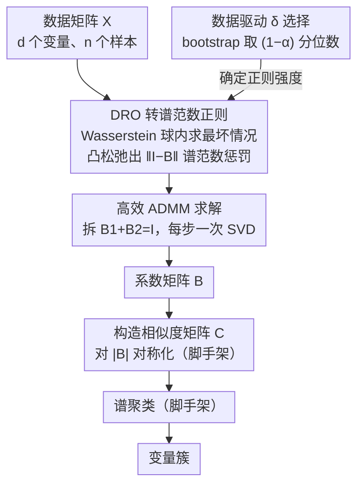

# 通过分布式鲁棒逐节点回归的变量聚类

**会议**: ICML 2026  
**arXiv**: [2212.07944](https://arxiv.org/abs/2212.07944)  
**代码**: https://github.com/xuxiao2695/dro-subspace-clustering  
**领域**: 优化 / 变量聚类  
**关键词**: 变量聚类, 子空间聚类, 逐节点回归, 分布式鲁棒优化, 不确定性量化

## 一句话总结
利用分布式鲁棒优化框架将逐节点回归的参数调优问题转化为带谱范数正则化的凸优化问题——实现无参数聚类方法，在模拟、人脸和金融数据上显著超越 Lasso 稀疏聚类。

## 研究背景与动机

**领域现状**：逐节点回归（nodewise regression）是子空间聚类的经典工具，通过将每个变量对所有其他变量回归生成相似度矩阵，再用谱聚类恢复变量簇。现有方法主要采用 $L_1$ 正则化稀疏聚类（SSC）或核范数正则化低秩表示（LRR）。

**现有痛点**：SSC 方法存在三大问题——（1）参数 $\lambda_i$ 依赖未知的幂次噪声方差难以调优；（2）追求系数稀疏性不自然，子空间非正交或同簇变量相关性强时真实关联矩阵常密集；（3）对强相关变量恢复困难。

**核心矛盾**：现有正则化策略要么过度稀疏化（破坏真实关联），要么依赖先验参数（调优代价高），难以在数据驱动、可解释、计算高效之间取得平衡。

**本文目标**：从分布式鲁棒优化（DRO）视角重新表述逐节点回归问题，自然推导出谱范数正则化项，同时提供数据驱动的参数选择方法。

**核心 idea**：将逐节点回归问题置于不确定集合 $\mathcal{U}_\delta(\mathbb{P}_n)$ 内最大化的 DRO 框架中，不确定性半径 $\delta$ 由 Wasserstein 距离定义，经凸松弛后等价于对 $(I-B)$ 谱范数的正则化。

## 方法详解

### 整体框架
在多因子块模型下每个变量 $X_i = (F_G^{z(i)})^\top \beta_i + U_i$。标准逐节点回归求解 $\min_B \|X - XB\|_F^2, \text{s.t.} \text{diag}(B)=0$。本文改进为分布式鲁棒版本——$\min_B \sup_{\mathcal{D}_c(\mathbb{P}, \mathbb{P}_n) \le \delta} \mathbb{E}_\mathbb{P}[\|X - B^\top X\|_2^2]$，其中 $\mathcal{D}_c$ 为 Wasserstein-2 距离，$\delta$ 为不确定性半径。

整个变量聚类流程沿用子空间聚类的两段式骨架：先由逐节点回归求出系数矩阵 $B$，再按标准做法把 $B$ 对称化成相似度矩阵 $C=B_{abs}^\top+B_{abs}$，最后对 $C$ 跑谱聚类得到变量簇。本文的三处贡献都集中在「如何求好这个 $B$」这一段：把无限维的 DRO 目标凸松弛成对 $(I-B)$ 谱范数的正则化问题、用 bootstrap 数据驱动地确定不确定性半径 $\delta$、再用一个利用 SVD 结构的高效 ADMM 求解器把它跑出来。后续构造相似度矩阵与谱聚类沿用既有流程，不是本文的创新点。

### 关键设计

**1. DRO 转化为谱范数正则化：把无限维鲁棒优化松弛成有限维凸问题**

逐节点回归的痛点是 $L_1$ 稀疏正则既不自然（真实关联矩阵常常密集）又要手调依赖未知噪声方差的 $\lambda_i$。本文换一个视角：把回归放进一个 Wasserstein-2 球 $\mathcal{U}_\delta(\mathbb{P}_n)$ 里求最坏情况，$\min_B \sup_{\mathcal{D}_c(\mathbb{P},\mathbb{P}_n)\le\delta}\mathbb{E}_\mathbb{P}[\|X-B^\top X\|_2^2]$。定理 3.1 证明这个无限维问题被夹在 $\tfrac{1}{2}f(B)\le \text{DRO 目标}\le f(B)$ 之间，其中

$$f(B)=\Big(\tfrac{1}{\sqrt{n}}\|X-XB\|_F+\sqrt{\delta}\,\|I-B\|_2\Big)^2.$$

于是分布不确定性自然导出了对 $(I-B)$ 谱范数 $\|I-B\|_2$ 的惩罚——它充当鲁棒性调节器，约束模型对数据扰动的敏感性。和 $L_1$ 不同，谱范数不要求系数绝对稀疏、允许密集线性组合，因此更贴合"同簇变量本就强相关、关联矩阵本就密集"的子空间结构，从根上绕开了稀疏化破坏真实关联的问题。

**2. 数据驱动参数选择：让不确定性半径 $\delta$ 自己从数据里长出来**

谱范数正则虽然换掉了逐变量的 $\lambda_i$，但还剩一个不确定性半径 $\delta$ 要定，本文索性把它也自动化。思路是利用残差结构 $Z=(I-B)^{-1}U$ 满足约束的置信水平来推 $\delta$：固定置信度 $1-\alpha=0.95$，用参数 bootstrap 采样 $M=1000$ 次生成 $Z$ 的分布，取其 $(1-\alpha)$ 分位数作为 $\delta$。因为 $\delta$ 的合理取值本就依赖数据尺度和噪声水平，让它从 bootstrap 量化数里自动确定既透明又省掉交叉验证的开销；实验也显示它对置信度极不敏感（$\alpha\in[0.001,0.2]$ 时 AMI 稳定在 0.91–0.93），相当于把"调参"这件事彻底从用户手里拿走了。

**3. 高效 ADMM 算法：利用谱结构把求解开销压下来**

谱范数正则的凸问题若直接丢给通用凸优化器会很慢，本文针对它的结构设计专门的 ADMM。做法是把原问题改写成约束形式 $B_1+B_2=I$，拆成两个子问题交替求解：$B_1$ 更新仍是 Frobenius 范数加二次惩罚，用一阶优化法解；$B_2$ 更新引入引理 3.2，通过一次 SVD 自动关闭较小的奇异值。每步迭代只需一次满 SVD，没有逐变量迭代调 $\lambda_i$ 的冗长流程，相比通用优化器加速 80%+，让方法在大 $d$ 场景下真正跑得动。

## 实验关键数据

### 主实验（模拟数据）

| 方法 | 平均 AMI | 标准差 | 说明 |
|------|--------|--------|------|
| DRO | 0.92 | 0.02 | 提出方法，谱范数正则化 |
| Lasso | 0.83 | 0.04 | SSC 基线，$L_1$ 正则化 |
| MFC | 0.43 | - | 同为多因子模型，拟合不足 |
| k-medoids | 0.33 | - | 质心法 |
| ACC | 0.15 | - | 假设单因子，与多因子不符 |

| 数据集 | 500 维、25 簇、250 样本 | AMI 差异 |
|--------|----------------------|-----------|
| 无全局因子 | DRO=0.92, Lasso=0.83 | $\Delta=0.09$ |
| 全局因子 $\beta_H^2=0.5$ | DRO=0.88, Lasso=0.78 | $\Delta=0.10$ |
| 全局因子 $\beta_H^2=0.9$ | DRO=0.82, Lasso=0.65 | $\Delta=0.17$ |

### 人脸聚类（Extended Yale B）

| 度量 | DRO | Lasso | SSC-EnSC | MFC |
|------|-----|-------|----------|-----|
| 平均 AMI | 0.580 | 0.403 | 0.218 | 0.172 |
| 中位数 AMI | 0.584 | 0.422 | 0.220 | 0.171 |

### 金融数据实验
S&P 500 股票投资组合构造——DRO-ACC 组合方法（先 DRO 聚 $K_1=6$ 簇，再 ACC 分割成 $K_2=6$ 子簇，共 36 只股票）相比 Lasso-ACC、LRR 等基线，年超额收益和 Sharpe 比提升显著（回测期 2001-2020）。

### 关键发现
- 全局因子越大所有方法 AMI 都下降但 DRO 仍领先。
- 参数选择对置信度 $1-\alpha$ 极不敏感（$\alpha \in [0.001, 0.2]$ 时 AMI 稳定在 0.91-0.93）。

## 亮点与洞察
- **巧妙的 DRO-谱范数等价性**：将 Wasserstein 不确定性集转化为算子范数约束，从"鲁棒性约束"视角统一诠释正则化作用。
- **参数自适应而非人工调参**：通过 bootstrap 量化数自动确定 $\delta$，机制透明且对置信度极不敏感。
- **子空间簇发现的通用框架**：不限于稀疏恢复，可扩展到任意凸正则化项。
- **大规模场景可行性**：ADMM 算法充分利用 SVD 结构特性，相比通用优化器加速 80%+。

## 局限与展望
- 簇数 $K$ 需预知。
- 子空间维数差异较大时效果可能下降。
- 有全局因子时性能衰减——所有方法 AMI 都下降。
- 未比较其他 DRO 方法（如 KL 散度作为不确定性度量）。

## 相关工作与启发
- **vs SSC**：SSC 追求系数稀疏依赖手调 $\lambda_i$；本文谱范数约束允许密集组合且参数自适应。
- **vs LRR**：LRR 对所有 $B$ 施加核范数惩罚；本文谱范数仅控制 $(I-B)$ 的最大特征值。
- **vs MFC**：同样基于多因子块模型但 MFC 采用特征值分解，大 $d$ 小 $n$ 时数值不稳定。
- **广义化到图模型**：本文 DRO 框架潜在可迁移到因果结构恢复。

## 评分
- 新颖性: ⭐⭐⭐⭐⭐  首次在逐节点回归中应用 DRO 理论，Wasserstein-谱范数等价性新颖。
- 实验充分度: ⭐⭐⭐⭐  模拟 + 视觉 + 金融 + 敏感性分析；缺乏理论收敛速率的实证验证。
- 写作质量: ⭐⭐⭐⭐⭐  逻辑链条清晰，关键定理表述严谨。
- 价值: ⭐⭐⭐⭐  为变量聚类提供原理性改进；金融投资组合应用具行业意义。

<!-- RELATED:START -->

## 相关论文

- [\[ICML 2026\] Position: Age Estimation Models Do Not Process Biometric Data](position_age_estimation_models_do_not_process_biometric_data.md)
- [\[ICML 2026\] Structure-Induced Information for Rerooting Levin Tree Search](structure-induced_information_for_rerooting_levin_tree_search.md)
- [\[ICML 2026\] Complexity as Advantage: A Regret-Based Perspective on Emergent Structure](complexity_as_advantage_a_regret-based_perspective_on_emergent_structure.md)
- [\[ICML 2026\] Private and Stable Test-Time Adaptation with Differential Privacy](private_and_stable_test-time_adaptation_with_differential_privacy.md)
- [\[ICML 2026\] Networked Information Aggregation for Binary Classification](networked_information_aggregation_for_binary_classification.md)

<!-- RELATED:END -->
