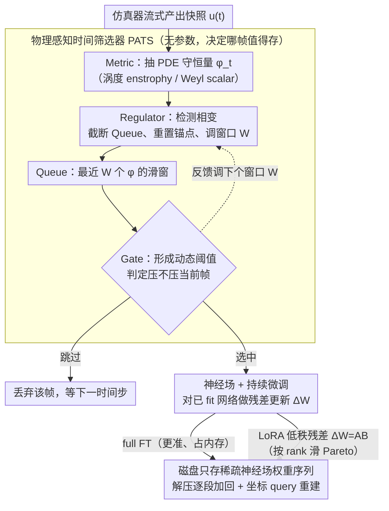

# ANTIC: Adaptive Neural Temporal In-situ Compressor

**会议**: ICML 2026  
**arXiv**: [2604.09543](https://arxiv.org/abs/2604.09543)  
**代码**: https://github.com/AndreiB137/ANTIC  
**领域**: 科学计算 / 神经压缩 / 神经场  
**关键词**: 在线压缩, 神经场, 持续微调, LoRA, PDE 仿真

## 一句话总结
为了把 PB-EB 级别 PDE 仿真数据"边算边压"，本文提出 ANTIC：用 physics-aware 时间选择器只保留物理上重要的快照，再用神经场 + LoRA 持续微调编码相邻快照之间的残差，在 2D Kolmogorov 流上拿到 435× 压缩、在 4.2 TiB 的 3D 双黑洞合并模拟上拿到 6807× 时空联合压缩。

## 研究背景与动机
**领域现状**：CFD、磁流体、等离子物理、数值相对论这类高分辨率瞬态仿真，单条 trajectory 动辄数 TB 到数百 TB。传统方案是 simulation 输出原始数据再做 post-hoc 压缩（JPEG2000、DWT、FPZIP、ZFP 等），spatial 维度上 codec 派和 low-rank 张量分解派各有市场。

**现有痛点**：（1）离线压缩对 petascale/exascale 仿真已不可行——根本没那么大的磁盘先存下来再压。（2）现有 in-situ 压缩要么时间维度上等间隔采样（错过瞬态事件 / 在缓慢期过采样），要么空间维度上用固定表示（autoencoder latent 不分辨率不变、传统 codec 难捕捉 multiscale 相关）。（3）多数方法不"懂物理"——既不知道哪个 snapshot 重要、也不利用相邻 snapshot 间的连续性。

**核心矛盾**：stiff/multi-rate PDE 同时具有时间 multiscale（快慢相变同时存在）和空间 multiscale（非线性、非平稳）两种特性，单一的时间采样策略或空间表示都无法在 storage、accuracy、throughput 三个维度上同时让步——所以需要一个时间-空间联合优化、且物理感知的 in-situ 框架。

**本文目标**：（1）时间轴上设计一个无参数、可注入 PDE 特定 metric 的快照选择器；（2）空间轴上用神经场表示 + 持续微调相邻 snapshot 的残差；（3）合并成单 streaming pass 的 in-situ 流水线，且暴露 rate-distortion Pareto 前沿供用户按需选点。

**切入角度**：作者观察到 stiff PDE 解在相邻时间步上"主要是平滑的小幅扰动"，可以把"压缩第 $t+\Delta t$ 个 snapshot"重新解释成"对一个已经 fit 好第 $t$ 个 snapshot 的神经场做一次低秩残差更新"——这天然适合 LoRA。同时物理量（涡度、Weyl scalar）就是 cheap 的 saliency 指标，可以即时判断"现在系统是稳态还是相变"。

**核心 idea**：物理感知时间筛选器（PATS） + 神经场持续微调（CFT / CFT+LoRA）组合，把时间和空间压缩同时在线完成，暴露 rate-distortion Pareto 给用户。

## 方法详解
ANTIC 由两个异步模块组成：(i) PATS 决定"要不要压这一帧"，(ii) Spatial Neural Compression 决定"怎么压"。整个流水线 single streaming pass，无需把原始 trajectory 落盘。

### 整体框架
- **流式输入**：仿真器逐时间步产出 snapshot $u(t)$。
- **PATS 子流水线**：Metric 从 snapshot 抽 physics-of-interest $\phi_t$（如涡度的 enstrophy / Weyl scalar 模），Regulator 根据 $\phi_t$ 动态调整 Queue 窗口大小 $W$，Gate 根据当前 truncated context + $\phi_t$ 形成动态阈值决定是否接受这个 snapshot。
- **Spatial Neural Compression**：被选中的 snapshot 通过持续微调（CFT）更新已存在的神经场 $W_t \to W_t + \Delta W_{\Delta t}$。其中 $\Delta W_{\Delta t}$ 可以选 full fine-tune（更准、内存大）或低秩 $\mathbf{A}^{(\Delta t)}\mathbf{B}^{(\Delta t)}$（更省、稍微损失精度），用户在 Pareto 上滑动。
- **输出**：磁盘上只保留稀疏的神经场权重序列，解压时把每段权重逐步加回到基础网络上、对坐标 query 即可重建任意时刻的场。

### 关键设计

**1. 物理感知时间筛选器 PATS：用 PDE 内禀守恒量当 saliency 决定哪帧值得存**

传统时间采样要么固定间隔（错过快变瞬态、在慢演化期过采样），要么用帧间像素差这种对物理意义无感的通用启发式。PATS 是个无参数的四部件流水线：Metric 抽 PDE 特定标量——湍流场用 enstrophy $\mathcal{E}(t)=\frac12\int_\Omega\|\omega\|^2 dA$（涡度模），双黑洞合并用 Weyl scalar $\Psi_4(t,\mathbf{r})$（外向引力波场强）；Queue 是只存最近 $W$ 个 metric 值的滑窗；Regulator 检测到 phase transition 时截断 Queue、重置参考锚点；Gate 根据 truncated context 形成动态阈值，既决定当前帧要不要压、又反馈给 Regulator 调下个窗口大小。整套机制不训练任何参数，所有"智能"来自物理量本身——慢演化时少采、瞬变时密采，换一个 PDE 只需换 Metric 函数，因此能在 stiff/multi-rate 系统上自适应而不漏掉关键事件。

**2. 神经场 + 持续微调：把"压下一帧"reframe 成"对已 fit 的网络做残差更新"**

每帧单独 fit 一个网络太冗余（相邻帧权重本就相似），只 fit 第一帧再时间外推又会误差爆炸。作者取中间路线：把空间压缩重写成"对已拟合 $u(t)$ 的神经场做残差更新以拟合 $u(t+\Delta t)$"。由于 stiff PDE 解的平滑性 $u(t+\Delta t)-u(t)\approx\Delta u(t)$，残差量级远小于原场，只需少量梯度步、少量参数更新就能收敛。神经场是 $256\times6$ MLP + SiLU + Fourier Feature Mapping（embedding dim 256，缓解高频谱偏差），用 SOAP 二阶预条件优化器 + cosine annealing 训练，并加 LayerNorm（抑制激活分布漂移）和 weight decay（抑制权重无界增长）来稳住持续微调——消融显示没有这两者权重 norm 会爆炸、多步后整网发散。这一设计把时间相关性当先验复用，又能逐帧矫正，正好契合 in-situ 的流式输入。

**3. LoRA 低秩残差：把残差更新参数化为 $\mathbf{A}\mathbf{B}$，用 rank 滑出 rate-distortion Pareto**

full FT 完全更新所有参数、没法控制存储，而下游真正需要的是一个能在"省存储"和"高精度"间任意取点的旋钮。作者把残差更新写成低秩

$$\Delta W_{\Delta t}=\mathbf{A}^{(\Delta t)}\mathbf{B}^{(\Delta t)},\quad \mathbf{A}\in\mathbb{R}^{n\times r},\ \mathbf{B}\in\mathbb{R}^{r\times k},\ r\ll\min(n,k),$$

改变 $r$ 等价于沿一条 accuracy-memory Pareto 前沿移动——大 $r$ 逼近 full FT，小 $r$ 给出极致压缩（3D BBH 上 $r=16$ 就拿到 3744× 单 snapshot 空间压缩）。LoRA 初始 LR 比 full FT 高一个量级（$10^{-2}$ vs $10^{-3}$），符合 Hayou 等的近期经验。思路直接搬自 LLM 上"小 rank 即可逼近 full FT"的结论，只是把 fine-tune target 从语言任务换成"拟合下一时间步的场"，让 ANTIC 能从存储紧张到精度优先各种场景自由适配。

### 损失函数 / 训练策略
神经场训练：标准 coordinate-to-value 回归损失（L2 on 物理量 values at sampled coords）。CFT 阶段 LR 从 $10^{-3}$ annealing 到 $10^{-5}$；LoRA 版本初始 LR $10^{-2}$。每个 snapshot 独立完成 fine-tune 后再继续下一帧；中间产物（loss curve）由 PATS 决策时是否触发。

## 实验关键数据

### 主实验（2D Kolmogorov + 3D BBH 合并）
PATS-LoRA 在两个 stress test 上都大幅碾压传统压缩器和等间隔采样的神经压缩。TR=Temporal Retention、SC=Spatial Compression、TC=Total Compression。

| 方法 | 数据集 | TR | PA | SC | TC |
|------|--------|----|----|-----|-----|
| Sparse + ZFP | 2D Kolmogorov | 20% | ✗ | 13× | 65× |
| PATS + ZFP | 同 | 37% | ✓ | 13× | 120× |
| Sparse + LoRA(r=32) | 同 | 20% | ✗ | 47× | 235× |
| **ANTIC-LoRA (本文)** | 同 | 37% | ✓ | **47×** | **435×** |
| Sparse + FT | 3D BBH (4.2 TiB) | 20% | ✗ | 471× | 2457× |
| Sparse + LoRA(r=16) | 同 | 20% | ✗ | 3744× | 18720× |
| Dense + LoRA(r=16) | 同 | 100% | ✓ | 3744× | 3744× |
| **ANTIC-LoRA (本文)** | 同 | 55% | ✓ | **3744×** | **6807×** |

### 消融实验

| 配置 | 关键结果 | 说明 |
|------|----------|------|
| Dense + ZFP（无 PATS、传统压缩） | 13× / 27× | baseline，纯空间压缩天花板 |
| Dense + FT（无 PATS、神经压缩） | 12× / 471× | 神经场在 3D 上吊打传统 |
| PATS + ZFP | TC 提到 120× / 52× | 仅时间筛选就把传统 codec 大幅外推 |
| ANTIC-FT (37% / 55% TR) | 111× / 860× | 时间筛选 + full FT 神经压缩 |
| ANTIC-LoRA | 435× / 6807× | 加上 LoRA 后再提一个数量级 |

### 关键发现
- 时间和空间两个轴可以乘性叠加：PATS 单独拿 2.5~3× TC 加成，神经场单独拿 30~470× SC，二者一起就到 100~1000× 量级。
- 在 3D BBH 这种 multi-rate 系统上 PATS 拿到了 45% 时间压缩同时不丢关键物理事件（合并瞬变），说明 Weyl scalar 是个有效的 saliency 指标——单纯等间隔采样会错过合并峰值。
- LoRA rank $r$ 提供了平滑的 Pareto，3D 上 $r=16$ 已经够用、再大没有显著收益；这种"rank 与 PDE 内禀维度成正比"的规律可能对其它科学场也成立。
- LayerNorm + weight decay 是 CFT 稳定性的关键——没有它们时观察到权重 norm 爆炸，多步 fine-tune 后整个网络发散。

## 亮点与洞察
- **"残差即压缩"的视角转换**：把"对每帧 fit 一个独立网络"改成"对前一帧的网络做 LoRA 残差更新"，这是一种朴素但威力惊人的 reframe——相当于把"空间神经压缩"变成了"时间 + 空间联合神经压缩"，并且天然支持流式输入。
- **PATS 完全无参数**：所有判断都来自 PDE 物理量本身和 sliding window 阈值，没有训练成本、没有 hyperparameter tuning 黑魔法、跨 PDE 只需换 Metric，工程师友好度极高。
- **暴露 Pareto 前沿而非单点压缩比**：用户可以根据 storage budget / 精度需求自选 LoRA rank，这种"可调"的设计在科学计算里很贴心——不同实验对精度的容忍度天差地别。

## 局限与展望
- Metric 是 PDE-specific 的，新 PDE 需要专家选指标；能否数据驱动地从 trajectory 中自动学出 saliency 是未来方向。
- LoRA rank 是手工 sweep 的，可以做 adaptive rank allocation 进一步压。
- 实验只覆盖 2D Kolmogorov 和 3D BBH 两种 PDE，跨更多 stiff 系统（磁流体、化学反应等）的验证较少。
- 解压时需要逐步加载每段权重 + coordinate query，对随机时间访问不友好；流式解码是优势但点查询是劣势。
- 神经场对突变/激波这种 sharp feature 仍可能有 oscillation（Gibbs-like），文中未深入讨论。

## 相关工作与启发
- **vs ZFP / FPZIP / MGARD（传统压缩）**：传统方法是 transform-based、对 PDE 多尺度结构感知不到；本文神经场 + LoRA 在 3D 上 SC 高一两个数量级。
- **vs MGARD（自适应精度 codec）**：MGARD 是 feature-aware error bound 但时间上仍 uniform；本文是 non-uniform 时间 + 神经空间，正交于 MGARD。
- **vs PINN / 物理 informed 神经场（Galletti 2025）**：那些用 VQ + 物理损失拿 70000× 压缩，但只能离线；本文是 online、且支持任意 PDE 不需要写显式 loss。
- **vs Neural Video Compression**：思想类似（keyframe + 残差），但 NVC 是 perceptual 优化、本文是 physics 优化；NVC 的 keyframe 选择基于运动 / 信息熵，本文基于 PDE 守恒量。

## 评分
- 新颖性: ⭐⭐⭐⭐ 时间 PATS + 空间 LoRA 残差神经场的组合是清晰且 effective 的创新
- 实验充分度: ⭐⭐⭐⭐ 两个完全不同尺度 PDE（2D 16GB / 3D 4TB）+ 多基线对比，结果说服力强
- 写作质量: ⭐⭐⭐⭐ 模块化拆解清楚、伪代码完整；个别物理背景对非 NR 读者偏深
- 价值: ⭐⭐⭐⭐⭐ 科学计算社区的 storage crisis 直接刚需，工程 ready 且开源

<!-- RELATED:START -->

## 相关论文

- [\[ICML 2026\] A Call to Lagrangian Action: Learning Population Mechanics from Temporal Snapshots](a_call_to_lagrangian_action_learning_population_mechanics_from_temporal_snapshot.md)
- [\[CVPR 2025\] ATP: Adaptive Threshold Pruning for Efficient Data Encoding in Quantum Neural Networks](../../CVPR2025/physics/atp_adaptive_threshold_pruning_for_efficient_data_encoding_in_quantum_neural_net.md)
- [\[ICML 2026\] BALLAST: Bayesian Active Learning with Look-ahead Amendment for Sea-drifter Trajectories under Spatio-Temporal Vector Fields](ballast_bayesian_active_learning_with_look-ahead_amendment_for_sea-drifter_traje.md)
- [\[ICML 2026\] Topology-Preserving Neural Operator Learning via Hodge Decomposition](topology-preserving_neural_operator_learning_via_hodge_decomposition.md)
- [\[ICML 2026\] EqGINO: Equivariant Geometry-Informed Fourier Neural Operators for 3D PDEs](eqgino_equivariant_geometry-informed_fourier_neural_operators_for_3d_pdes.md)

<!-- RELATED:END -->
