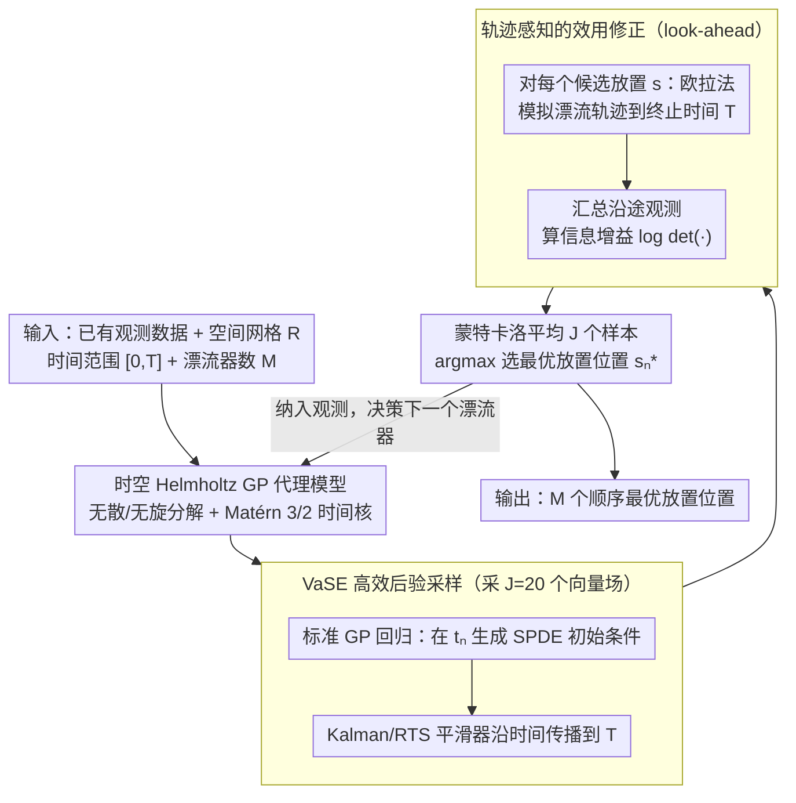

# BALLAST: Bayesian Active Learning with Look-ahead Amendment for Sea-drifter Trajectories under Spatio-Temporal Vector Fields

**会议**: ICML2026  
**arXiv**: [2509.26005](https://arxiv.org/abs/2509.26005)  
**代码**: https://github.com/ShuSheng3927/BALLAST  
**领域**: scientific_computing  
**关键词**: 主动学习, 高斯过程, 海洋漂流器, 时空向量场, 贝叶斯实验设计  

## 一句话总结

提出 BALLAST 算法，通过从 GP 后验中采样向量场并模拟拉格朗日观测器的未来轨迹来修正主动学习的效用估计，同时开发了 VaSE 推理方法将 GP 后验采样效率提升数千倍，在合成与高保真海洋流场上实现约 16%-22% 的部署成本节省。

## 研究背景与动机

**领域现状**：理解和预测海洋流场对于追踪海洋中的热量、营养物质和污染物至关重要。自由漂流的海洋漂流器（drifter）因其能够同时采集时空流场属性而被广泛使用，一旦投放后漂流器会被底层向量场平流，在不同位置和时间进行速度测量，属于拉格朗日观测器。

**现有痛点**：目前漂流器的放置策略要么采用标准的"空间填充"设计（如 Sobol 序列），要么依赖较为随意的专家意见。虽然有工作提出了基于旅行距离和放置间距的手工设计准则，但尚无正式的主动学习框架来指导拉格朗日观测器的部署。

**核心矛盾**：标准的主动学习方法（如期望信息增益 EIG）在估计一个候选放置位置的效用时，只考虑初始观测位置的信息增益，完全忽略了漂流器被流场持续平流后将在不同位置收集到的后续观测数据。这导致 EIG 策略倾向于将观测器放在边界附近——这些位置的初始信息增益高，但观测器会迅速离开研究区域，实际效用很低。实验表明，EIG 甚至一致性地差于均匀随机策略。

**本文目标**：设计一种能正确评估拉格朗日观测器全生命周期信息增益的主动学习策略，并解决其带来的 GP 后验采样计算瓶颈。

**切入角度**：利用 GP 后验采样模拟漂流器在假设向量场中的未来轨迹，将轨迹上所有后续观测的信息增益纳入效用计算。

**核心 idea**：通过蒙特卡洛采样后验向量场并模拟观测器轨迹来修正效用函数（look-ahead amendment），同时提出 VaSE 方法绕过 SPDE-GP 对非网格化观测的计算瓶颈。

## 方法详解

### 整体框架

BALLAST 是一个顺序实验设计框架：先用一个**时空 Helmholtz GP 代理模型**刻画时变向量场；在每个决策时间 $t_n$、给定已有观测 $\mathcal{D}_n$ 后，用 **VaSE** 方法从 GP 后验中高效采样 $J$ 个向量场样本；对每个候选放置位置 $\bm{s}$，在每个样本场下用欧拉法模拟漂流器直到终止时间 $T$ 的完整漂流轨迹，汇总所有轨迹沿途观测的信息增益来给该位置打分（即 **look-ahead 效用修正**），蒙特卡洛平均后选出最优放置。输入为空间网格 $R$、时间范围 $[0,T]$、漂流器数量 $M$；输出为 $M$ 个顺序最优放置位置——每放置一个就把它纳入观测、重新决策下一个，循环 $M$ 次。

### 关键设计

**1. 时空 Helmholtz GP 代理模型：给海洋向量场注入流体物理先验**

代理模型不能随便选，既要尊重流体力学约束，又要为后面 VaSE 的 SPDE 传播留好结构。作者用 Helmholtz 分解构造向量输出核 $k_{\text{tHelm}}((\bm{s},t),(\bm{s}',t'))=k_{\text{Helm}}(\bm{s},\bm{s}')\,k_{\text{time}}(t,t')$，空间部分基于势函数和流函数核的线性微分算子（编码无散/无旋分解这类物理约束），时间部分用 Matérn 3/2 核（与海洋学 $\nu\approx2$ 的经验一致）。Helmholtz 分解保证采出来的场是物理上合理的流场而非任意函数，而**可分离的时空核结构**正是 VaSE 能沿时间做 SPDE 传播的前提——这也是为什么把它放在整条流水线的最前面。

**2. Vanilla SPDE Exchange（VaSE）：绕开非网格拉格朗日数据让 GP 后验采样的瓶颈**

look-ahead 修正要反复从时空 GP 后验采样向量场，标准 GP 采样代价 $O(N_{\text{pred,s}}^3 N_{\text{pred,t}}^3)$ 直接不可行，而 SPDE 方法在"观测位置（非网格化的拉格朗日数据）和预测位置（规则网格）不重叠"时代价又会剧增。VaSE 把两者拼起来：先用扩展 GP $\bm{f}=[f,\partial_t f]^\top$ 在决策时间 $t_n$ 通过标准 GP 回归生成 SPDE 初始条件，再用 Kalman 滤波/RTS 平滑器沿时间方向传播到 $T$，把代价压到 $O(N_{\text{obs}}^3+N_{\text{pred,s}}^2 N_{\text{pred,t}})$。用标准 GP 回归处理初始条件这一步恰好绕过了非网格观测的麻烦，实测带来约 70× 加速（单样本 4.5 min → 3.8 s），让 BALLAST 从理论上可算变成实践上可跑。

**3. 轨迹感知的效用修正（BALLAST Amendment）：把漂流器一生的观测都算进效用**

这是 BALLAST 的核心贡献，也是整条流水线的落脚点。标准 EIG 估计一个放置位置的效用时只看初始观测的信息增益，完全忽略漂流器随后被流场平流、在别处采集的后续数据——结果它偏爱把观测器放在边界附近（初始增益高但很快漂出研究区），实测甚至一致地差于均匀随机。BALLAST 的修正是用前两步采到的 $J$ 个向量场，把整条未来轨迹纳入采集函数：

$$\bm{s}_n^*=\arg\max_{\bm{s}\in R}\ \mathbb{E}_{F\sim p(f|\mathcal{D}_n)}\big[\mathbb{E}[U(P_F^T(\bm{s},t_n))]\big],$$

其中 $P_F^T(\bm{s},t_n)$ 是观测器在采样向量场 $F$ 下从 $\bm{s}$ 出发到终止时间 $T$ 的投影轨迹，外层期望用 $J=20$ 个 GP 后验样本蒙特卡洛近似、每条轨迹用欧拉法以步长 $\delta_t$ 积分模拟。这样每个候选位置被按"长期信息贡献"而非"瞬时增益"评分，直接纠正了 EIG 的边界偏好。

## 实验关键数据

### 主实验

六种策略对比：均匀随机（UNIF）、Sobol 序列（SOBOL）、距离分离启发式（DIST-SEP）、期望信息增益（EIG）、BALLAST-opt（优化超参）、BALLAST-true（真实超参）。

| 实验设置 | 评价指标 | BALLAST-true | BALLAST-opt | UNIF | EIG | 关键结论 |
|----------|---------|-------------|-------------|------|-----|---------|
| Temporal Helmholtz（合成） | 部署成本节省 | ~16% | ~16% | baseline | 差于 UNIF | 节省约 3 个漂流器 |
| SUNTANS（高保真流体模拟） | 部署成本节省 | ~22% | ~22% | baseline | 优于 UNIF | 节省约 2 个漂流器 |

### 计算效率对比

| 推理方法 | 代价量级（典型设置） | 单样本采样耗时 | 加速比 |
|----------|---------------------|--------------|--------|
| 标准 GP | $10^{17}$ | 不可行 | — |
| SPDE-GP | $10^{11}$ | ~4.5 min | 1× |
| VaSE（本文） | $10^{8}$ | ~3.8 s | ~70× |

### 消融实验

| 后验样本数 $J$ | 达到 1% 效用差距 | 决策耗时（$J=20$） | 说明 |
|---------------|-----------------|-------------------|------|
| $J < 20$ | ✓ 一致达标 | < 3 min | 在三个不同决策时间 $t=3,5,7$ 上均在 $J=20$ 前收敛 |
| $J = 200$（参考） | — | — | 作为真实期望效用的近似基准 |

## 亮点与洞察

- BALLAST 方法具有通用性，不仅限于海洋漂流器，也适用于动物追踪项圈传感器、气象气球等被环境平流的拉格朗日观测设备
- 标准 EIG 在拉格朗日观测场景下一致性差于均匀策略这一"反直觉"发现揭示了忽略观测器动力学的根本缺陷
- VaSE 方法独立于 BALLAST 有意义，可用于任何需要从非网格化观测的时空 GP 中高效采样的场景

## 局限性 / 可改进方向

- 当前假设预定义的决策时间，未优化部署时间本身
- GP 代理模型的超参数优化可能在高维或复杂流场中不够稳健
- 可考虑用深度自适应设计摊销采集优化以实现更快的部署决策
- 仅在二维空间流场上验证，三维海洋流场尚未测试

## 相关工作与启发

- Berlinghieri et al. (2023) 提出 Helmholtz GP 核用于海洋流场建模
- Chen et al. (2024b) 基于拉格朗日数据同化框架提出手工设计的放置准则
- Sarkka et al. (2013) 的 SPDE-GP 框架是 VaSE 的基础组件之一
- Hernández-Lobato et al. (2014) 利用互信息对称性的预测熵搜索启发了本文的信息增益重构

## 评分

- 新颖性: ⭐⭐⭐⭐ — 首次将主动学习正式引入拉格朗日观测器放置，VaSE 推理方法具有独立贡献
- 实验充分度: ⭐⭐⭐⭐ — 合成与高保真模拟双重验证，含消融和六种基线对比
- 写作质量: ⭐⭐⭐⭐⭐ — 问题动机清晰，理论与算法展开严谨，图示直观
- 价值: ⭐⭐⭐⭐ — 对海洋科学实际部署有直接应用价值，方法可扩展到其他拉格朗日观测场景

<!-- RELATED:START -->

## 相关论文

- [\[ICML 2026\] A Call to Lagrangian Action: Learning Population Mechanics from Temporal Snapshots](a_call_to_lagrangian_action_learning_population_mechanics_from_temporal_snapshot.md)
- [\[ICML 2026\] ANTIC: Adaptive Neural Temporal In-situ Compressor](antic_adaptive_neural_temporal_in-situ_compressor.md)
- [\[ICML 2026\] Distribution Transformers: Fast Approximate Bayesian Inference With On-The-Fly Prior Adaptation](distribution_transformers_fast_approximate_bayesian_inference_with_on-the-fly_pr.md)
- [\[CVPR 2025\] Accurate Differential Operators for Hybrid Neural Fields](../../CVPR2025/physics/accurate_differential_operators_for_hybrid_neural_fields.md)
- [\[NeurIPS 2025\] Vision Transformers for Cosmological Fields: Application to Weak Lensing Mass Maps](../../NeurIPS2025/physics/vision_transformers_for_cosmological_fields_application_to_weak_lensing_mass_map.md)

<!-- RELATED:END -->
