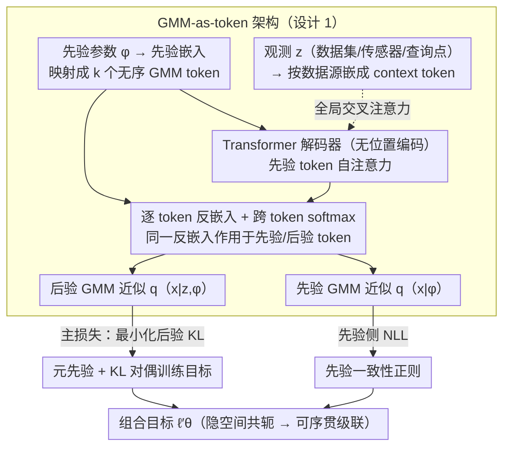

# Distribution Transformers: Fast Approximate Bayesian Inference With On-The-Fly Prior Adaptation

**会议**: ICML 2026  
**arXiv**: [2502.02463](https://arxiv.org/abs/2502.02463)  
**代码**: https://github.com/GWhittle110/distribution-transformers  
**领域**: 科学计算 / 贝叶斯推断 / Transformer 摊销推断  
**关键词**: 摊销贝叶斯推断, 先验自适应, 高斯混合模型, 序贯滤波, Transformer  

## 一句话总结
Distribution Transformer (DT) 把"先验分布"显式 token 化为一组高斯混合分量、把"观测"通过交叉注意力注入解码器，端到端学一个"先验+数据 → 后验"的映射，在保持与先验同族（GMM→GMM）以支持序贯滤波的同时，把推断时间从分钟级压到毫秒级，并允许测试时任意更换先验而无需重训。

## 研究背景与动机

**领域现状**：摊销贝叶斯推断（Amortized Bayesian Inference, ABI）把"为每个新数据集解一次后验"这件昂贵的事预先训练好——离线训练阶段学一个 $z \mapsto q(x|z)$，在线只跑一次前向。基于 Transformer 的代表性方法 PFN/TabPFN/ACE 已经能在小样本场景下做到单次前向出后验，效果与 SVI/MCMC 接近。

**现有痛点**：(1) 这些 ABI 模型在训练时把先验"焊死"了——一旦想换先验，模型要重训甚至重新生成训练数据；(2) 即便少数方法支持"先验灵活性"，输出分布族（如 PFN 的 Riemann 桶状分布）与先验不一致，**输出后验无法再喂回去当下一轮先验**，因此根本不能做序贯滤波（Kalman/粒子滤波场景）；(3) 经典序贯方法（EKF/PF）灵活但要么强 Gaussian 假设要么算力随粒子数爆炸，且不支持跨任务摊销。

**核心矛盾**：摊销 + 先验灵活 + 共轭性（先验和后验同族）这三者必须同时满足，序贯贝叶斯滤波才能跑——以往的工作总是顾此失彼。

**本文目标**：(i) 单次前向出后验（摊销）；(ii) 测试时任意换先验，不重训（先验摊销）；(iii) 先验和后验同属 GMM 族，可递归级联做滤波；(iv) 在静态推断基准上不输 PFN/TabPFN/ACE，序贯任务上能追上粒子滤波但快几十至上千倍。

**切入角度**：找一个"通用万能近似器分布族"并用 Transformer 在该族上操作。作者选择**高斯混合模型**——任意紧支撑光滑密度都能被 $k$ 分量 GMM 任意精度逼近，且 GMM 的参数 $\{(w_i,\boldsymbol{\mu}_i,\boldsymbol{\Sigma}_i)\}_{i=1}^{k}$ 是天然的"无序 token 序列"，正好契合 Transformer 的置换不变假设。

**核心 idea**：把贝叶斯推断重写为 GMM-序列到 GMM-序列的映射，由 transformer decoder 实现，先验和观测都被嵌成 token，输出又回到 GMM 同族——同族性是序贯滤波的钥匙。

## 方法详解

### 整体框架
四个模块串起来：先验嵌入 → 观测嵌入 → transformer decoder → GMM 反嵌入。给定先验参数 $\phi$，可学嵌入网络把它映射成长度为 $k$ 的无序 token 序列（隐空间里的 GMM 表示）；给定观测 $z$（数据集/传感器读数/查询点），用按数据源定制的可学嵌入嵌成另一组 token；transformer decoder（无位置编码，保置换等变）让先验 token 之间自注意力、并与观测 token 全局交叉注意力，输出隐空间里的后验 token 序列；最后一个 component-wise 的可学反嵌入把每个 token 解成 (logit, $\boldsymbol{\mu}_i$, $\boldsymbol{\Sigma}_i$)，跨 token softmax 给出权重 $w_i$，组装成 GMM 后验 $q_\theta(x|z,\phi) = \sum_i w_i \mathcal{N}(x;\boldsymbol{\mu}_i,\boldsymbol{\Sigma}_i)$。同一个反嵌入也作用回先验 token，得到先验 GMM 近似 $q_\theta(x|\phi)$，让主损失（后验侧）与先验损失（先验侧）共用一套解码、把先验和后验锁进同一隐空间。可选地，作者还引入 sample-space 变换 $f(\cdot)$ 把支撑做改变测度（如对带正支撑的逆 Gamma 先验做 log-warp），让 GMM 在 $\mathbb{R}^n$ 上展开。

### 关键设计

**1. GMM-as-token 表示 + Transformer 解码器：把"分布"做成 token 序列，输入输出同族**

序贯滤波要跑，先验和后验必须同属一个分布族，但 PFN 的 Riemann 桶状分布做不到。作者选高斯混合模型：任意紧支撑光滑密度都能被 $k$ 分量 GMM 任意精度逼近，而 GMM 的参数集 $\{(w_i,\boldsymbol{\mu}_i,\boldsymbol{\Sigma}_i)\}$ 是天然无序、正好契合 Transformer 的置换不变。先验参数 $\phi$ 经可学网络嵌成 $k$ 个 token，观测按数据源各自嵌成 token 拼成 context；transformer decoder（不加 positional encoding 以匹配分量置换不变）让先验 token 间自注意力、并与 context 全局交叉注意力，输出后验 token；最后逐 token 反嵌成 $(\text{logit},\boldsymbol{\mu}_i,\boldsymbol{\Sigma}_i)$、跨 token softmax 给权重，组装成 $q_\theta(x|z,\phi)=\sum_i w_i\mathcal{N}(x;\boldsymbol{\mu}_i,\boldsymbol{\Sigma}_i)$。同族输入输出意味着上一时刻的后验 token 序列可直接当下一时刻的先验 token 序列——这是序贯滤波能跑的代数前提。

**2. 元先验 + KL 形式的对偶训练目标：让模型一次见一族先验，测试时随便换**

以往 ABI 把先验"焊死"在训练里，换先验就得重训。DT 引入"先验之上的分布"——元先验 $p(\phi)$，联合分布写成 $p(\phi,x,z)=p(\phi)p(x|\phi)p(z|x)$；训练时每个 batch 先采 $\phi_i\sim p(\phi)$ 再采 $x_i,z_i$，主损失

$$\ell_\theta=\mathbb{E}_{p(\phi,x,z)}[-\log q_\theta(f(x)|z,\phi)].$$

Prop 3.1 证明它等价于 $\mathbb{E}_{p(\phi,z)}[\mathrm{KL}(p(\cdot|z,\phi)\,\|\,q_\theta(\cdot|z,\phi))]$ 加常数，所以这不是临时的最大似然 hack，而是直接最小化平均后验 KL，且只需从 $p(\phi,x,z)$ 采样、无需求真后验密度。把"先验"从训练时常量提升为联合分布里的随机变量，等价于在 $\Phi\times\mathcal{Z}\to\mathcal{Q}$ 这个更大的映射空间里做摊销，于是测试时换先验只是换一个 $\phi$ token，不必重训。

**3. 先验一致性正则：把先验和后验锁进同一个隐空间表示，保住共轭性**

光有同族输出还不够——若先验 token 和后验 token 落在不同隐空间区域，"上一步后验作为下一步先验"在数值上会失效。作者把反嵌入也作用到先验 token 序列上，得到先验的 GMM 近似 $q_\theta(x|\phi)$，加一项 $\ell_\theta^{\mathrm{prior}}=\mathbb{E}_{p(\phi,x)}[-\log q_\theta(x|\phi)]$、组合成 $\ell_\theta'=\ell_\theta^{\mathrm{prior}}+\ell_\theta$。即先验 token 在过 transformer 之前直接解码就要求是先验的 GMM 近似、后验 token 过 transformer 之后解码要求是后验的 GMM 近似，两者必须用同一个反嵌入解出 GMM 才算共轭。这一项对静态性能只是轻微提升，却是序贯级联的必要条件。

## 实验关键数据

### 主实验

实验 4.1：逆 Gamma 先验 + 正态方差似然的解析共轭对照，分窄/宽两个元先验设定，1000 未见问题。

| 方法 | 窄元先验 KL | 宽元先验 KL | 1000 问题推断时间 (s) |
|------|-------------|-------------|------------------------|
| SVI | 0.0425 ± 0.0003 | 0.0558 ± 0.0016 | 148 |
| PFN-15 | 0.517 ± 1.009* | 331.5 ± 646.6* | 0.003 |
| PFN-5000 | 0.0038 ± 0.0789 | 0.2935 ± 0.0237 | 0.003 |
| TabPFNv2 | 0.0112 ± 0.0013 | 0.1513 ± 0.0168 | 1.52 |
| ACE-5 | 0.0094 ± 0.0000 | 0.0048 ± 0.0014 | 0.037 |
| **DT-2** | 0.0044 ± 0.0001 | 0.0058 ± 0.0002 | 0.014 |
| **DT-5** | **0.0004 ± 0.0000** | **0.0003 ± 0.0000** | 0.016 |

DT-5 比 PFN-5000 后验 KL 低近一个数量级（窄元先验）、宽元先验下差 3 个数量级；推断时间 16 ms / 1000 问题，比 SVI 快约 $10^4$ 倍。

实验 4.2.1（5 维 GP 预测后验 + 超后验）：DT 同时在 PPD NLL（0.81）与超后验 NLL（0.31）上击败 PFN/TabPFNv2/ACE，且 9.5 s 是最快。

实验 4.3.1（4 维状态空间贝叶斯传感器融合）：

| 方法 | 期望 NLL | 100 序列批次单步时间 (s) |
|------|---------|---------------------------|
| EKF | 95.9 ± 4.40 | 0.010 |
| Particle Filter | -0.244 ± 0.047 | 0.818 |
| **DT-4** | **-0.197 ± 0.040** | **0.017** |

DT 几乎追上"准 ground truth"的 PF，单步快约 50×；EKF 因线性化假设彻底失败。

### 消融与机制对比

| 维度 / 方法 | 关键观察 | 含义 |
|---|---|---|
| GMM 分量数 $k = 2$ vs $5$（4.1 节）| KL 从 0.0044 降到 0.0004 | 分量数提供"逼近能力的旋钮"，且和参数量解耦 |
| Riemann 输出（PFN）vs GMM（DT/ACE）| Riemann 在宽元先验下 KL 飙到 331 | 桶状分布表达力差是 PFN 的瓶颈 |
| 有/无 prior loss | 性能提升微小，但**序贯级联必需** | 隐空间共轭性是序贯能力的代数前提 |
| 序贯任务可否套用 PFN（拼观测） | 推断时间随 $T$ 线性甚至 $\mathcal{O}(T^2)$ 增长 | DT 的常时间递推是关键工程优势 |
| 实验 4.3.2（10 维随机波动率）| PF 需 3 个数量级更多算力才能匹敌 DT | 高维稀疏信息场景 DT 拉开差距 |

### 关键发现
- **同族性是序贯能力的钥匙**：GMM→GMM 同族意味着上一步后验可直接当下一步先验，单步推断时间与序列长度 $T$ 解耦；而 PFN/TabPFN/ACE 即便强行拼接观测，时间随 $T$ 线性甚至平方增长。
- **GMM 表达力天花板高**：与桶状 Riemann 分布相比，5 分量 GMM 在共轭对照实验里已逼近真后验到肉眼不可分；这是 DT/ACE 共同碾压 PFN/TabPFNv2 的根本原因。
- **元先验越宽，先验灵活性越值钱**：窄元先验下 PFN-5000 还能凑合（因边缘分布接近真先验），宽元先验下完全垮掉，DT 几乎不变。
- **prior loss 性能收益小但功能必需**：去掉它静态 KL 几乎不变，但隐空间共轭性丢失，4.3 节序贯滤波直接失效。

## 亮点与洞察
- **"分布作为输入"是被低估的设计自由度**：以往摊销推断把先验当超参注入或干脆当成训练时常量；本文把先验参数 $\phi$ 显式作为 transformer 的另一组 token，模型架构自然支持"换先验"，这一思路可被迁移到任何需要在测试时调先验的概率建模任务（贝叶斯优化、ABC、传感器融合）。
- **架构对称性 ↔ 概率对称性**：transformer 无位置编码 ↔ GMM 分量无序、cross-attention ↔ 观测条件独立，整套架构和贝叶斯图模型的不变性结构是同构的——这种"先选概率结构、再挑神经架构"的设计范式值得在科学计算 ML 里推广。
- **从"学后验"到"学算子"**：DT 真正学到的是"先验+数据 → 后验"这个算子，而不是某个具体后验。这把"摊销"从单层（跨任务）推到双层（跨任务 + 跨先验家族），抽象层级显著提升。
- **可堆叠的实时贝叶斯滤波**：在毫秒级吞吐里跑非高斯、非线性 SSM，且能复现 PF 的精度，对自动驾驶感知、量子参数实时追踪、工业控制等需要快速贝叶斯更新的场景有直接工程价值。

## 局限与展望
- **训练成本随先验空间维度上升**：要在 $\Phi$ 上覆盖更广，离线训练样本量和时长显著增加（附录 Table 8）。
- **元先验需要"还算合理"**：若实际部署时遇到的先验完全在元先验之外，性能会衰减；附录 C.2 给出了一些鲁棒性证据，但远非全面。
- **高维 GMM 是已知瓶颈**：分量数自注意力是平方、分量内 full-covariance 解码是隐维度平方，10 维以下 ok，几十维以上需要稀疏/低秩协方差。
- **序贯长链上的误差累积**：每步都做近似，长链上误差会缓慢漂移；附录 C.5 验证中等深度上仍可控，但极长序列下未严格验证。
- **超参选择经验主义**：分量数 $k$、嵌入维度、注意力头数等都是手调，缺乏系统化的自动选择策略。

## 相关工作与启发
- **vs PFN / TabPFN / TabPFNv2 (Müller 2021, Hollmann 2022/2025)**：PFN 系列固定先验，输出 Riemann 桶状分布；DT 把先验 token 化、输出 GMM、且能换先验做序贯滤波，是定性增量。
- **vs ACE (Chang 2024)**：ACE 已支持先验灵活性且也用 GMM 输出，性能最接近；DT 的关键差异是更灵活的嵌入设计和显式的同族共轭性保证（prior loss），后者使序贯应用成为可能。
- **vs 经典 Kalman / 粒子滤波 (Kalman 1960; Doucet 2001)**：EKF 假设线性高斯，垮在非线性观测上；PF 渐近精确但维数灾难。DT 把两者的弱点都补上——非线性表达力 + 摊销带来的恒定吞吐。
- **vs 变分推断 / 神经过程 (Kingma & Welling 2013; Garnelo 2018)**：经典 VI 每次问题都要重新优化；神经过程摊销但通常预测数据空间分布而非潜变量后验。DT 同时摊销 + 输出潜变量后验 + 允许换先验。
- **vs 模拟基推断 (Cranmer 2020; Wildberger 2023)**：SBI 表达力强但通常假设固定先验且无法做序贯递归；DT 是"先验灵活 + 同族 + 摊销"的另一条路。

## 评分
- 新颖性: ⭐⭐⭐⭐⭐ 把分布本身 token 化、显式追求先验-后验同族以支持序贯滤波，是摊销贝叶斯里少见的真定性突破。
- 实验充分度: ⭐⭐⭐⭐ 解析共轭、GP 超后验、量子参数、传感器融合、随机波动率覆盖广；可惜缺真实机器人/自动驾驶上的端到端 demo。
- 写作质量: ⭐⭐⭐⭐ 动机—架构—训练—理论命题—实验链条清晰，但 prior loss 的"非性能但必要"角色对读者略反直觉，可再展开。
- 价值: ⭐⭐⭐⭐⭐ 在毫秒级吞吐 + 任意换先验 + 序贯可级联三件事同时拿到，对工业实时贝叶斯应用是真实推动。

<!-- RELATED:START -->

## 相关论文

- [\[AAAI 2026\] Fast 3D Surrogate Modeling for Data Center Thermal Management](../../AAAI2026/physics/fast_3d_surrogate_modeling_for_data_center_thermal_management.md)
- [\[NeurIPS 2025\] Quantum Doubly Stochastic Transformers](../../NeurIPS2025/physics/quantum_doubly_stochastic_transformers.md)
- [\[NeurIPS 2025\] The Primacy of Magnitude in Low-Rank Adaptation](../../NeurIPS2025/physics/the_primacy_of_magnitude_in_low-rank_adaptation.md)
- [\[NeurIPS 2025\] From Simulations to Surveys: Domain Adaptation for Galaxy Observations](../../NeurIPS2025/physics/from_simulations_to_surveys_domain_adaptation_for_galaxy_observations.md)
- [\[NeurIPS 2025\] Vision Transformers for Cosmological Fields: Application to Weak Lensing Mass Maps](../../NeurIPS2025/physics/vision_transformers_for_cosmological_fields_application_to_weak_lensing_mass_map.md)

<!-- RELATED:END -->
