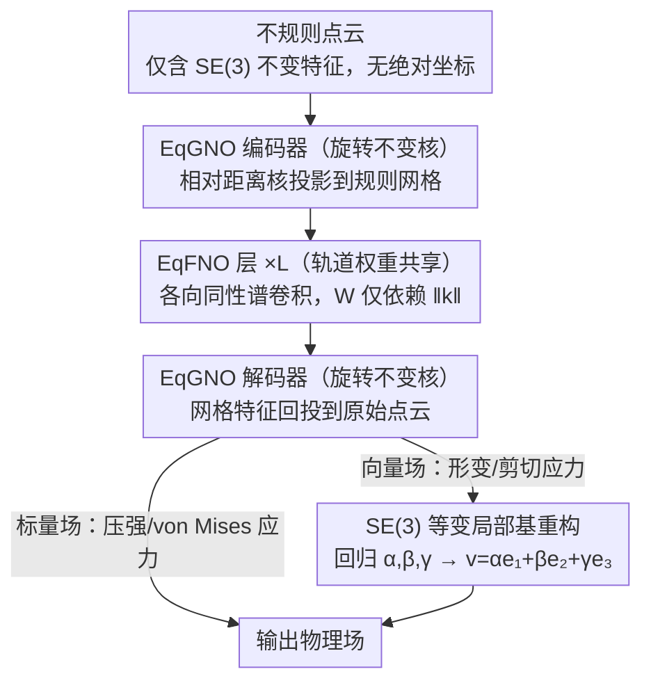

# EqGINO: Equivariant Geometry-Informed Fourier Neural Operators for 3D PDEs

**会议**: ICML 2026  
**arXiv**: [2606.03260](https://arxiv.org/abs/2606.03260)  
**代码**: 论文中说"available at this URL"，未给出具体仓库  
**领域**: 科学计算 / 神经算子 / 等变网络 / 3D PDE  
**关键词**: Fourier Neural Operator, SE(3) Equivariance, Spectral Convolution, Orbit-based Weight Sharing, 3D PDE Surrogate  

## 一句话总结
EqGINO 把 GINO 的 GNO 编码器、FNO 主干、GNO 解码器全部改造成 SE(3) 等变模块：GNO 用相对距离作为旋转不变核、FNO 用"轨道权重共享"在频域强制 $W(R\mathbf k)=W(\mathbf k)$ 的各向同性，从而在保留 FNO 全局感受野的同时让 3D PDE surrogate 对任意刚性变换鲁棒，且把谱权重参数量从 $\mathcal O(K^3)$ 降到 $\mathcal O(K)$。

## 研究背景与动机
**领域现状**：3D PDE 代理模型（汽车气动、车身结构受力、湍流仿真等）目前主流分两路：基于点云/网格的 GNN（PointNet++、MeshGraphNet、Transolver、GINO），以及基于谱方法的 FNO 系列。GINO（Li et al., 2023）是公认的强 baseline，因为它用 GNO 把不规则点云投影到规则网格后再用 FNO 做谱卷积，兼顾不规则几何和全局感受野。

**现有痛点**：物理定律本身在坐标变换下不变（Navier–Stokes 在旋转/平移下形式一致），但现有 SOTA 几乎全都依赖绝对 Cartesian 坐标作为输入特征。这会让模型过拟合到训练时的"规范朝向"，一旦测试样本被旋转 90°、180° 或任意角度，性能急剧崩塌（论文 Table 1b：GINO 的 ShapeNetCar 压强 RMSE 从 0.166 飙到 0.563；DeepJEB 形变从 0.111 飙到 2.319）。

**核心矛盾**：等变性和全局感受野难以兼得。已有等变 GNN（EGNN、EMNN、T-EMNN）靠局部消息传递保证 SE(3) 等变，但局部感受野无法捕捉 PDE 必需的长程相互作用；FNO 在频域有天然全局感受野，但 3D 谱群卷积（如 G-FNO 的 2D 扩展）算力代价高到无法实用。

**本文目标**：（i）找到能在 3D 频域强制 SE(3) 等变的轻量机制；（ii）把它和不规则几何的 GNO 编码器无缝集成，得到端到端等变的 GINO 升级版；（iii）能处理标量场（如 von Mises 应力）和向量场（如形变 $\mathbf u\in\mathbb R^3$）两类预测任务。

**切入角度**：作者注意到 Fourier 变换本身满足 $\widehat{\mathcal T_R f}(\mathbf k)=\hat f(R^{-1}\mathbf k)$，即空间旋转在频域对应 Fourier 模的同步旋转（引理 4.1）。FNO 之所以打破等变，仅仅是因为可学习的谱权重 $W(\mathbf k)$ 对每个 $\mathbf k$ 都独立——只要强制 $W(R\mathbf k)=W(\mathbf k)$，等变性就回来了。

**核心 idea**：强制谱权重沿"等模长轨道"共享——所有 $\|\mathbf k\|_2\approx r$ 的频率模共用一个权重 $w_r$，从而既保证旋转等变又把参数复杂度从 $\mathcal O(K^3)$ 砍到 $\mathcal O(K)$。

## 方法详解
EqGINO 沿用 GINO 的三段式骨架——EqGNO 编码器把点云提升到规则网格；多层 EqFNO 在频域做等变全局卷积；EqGNO 解码器把网格特征投回点云预测物理量——但每一段都被重新设计成 SE(3) 等变。

### 整体框架
- **输入**：不规则点云 $\mathcal P=\{y_j\}$（CFD 网格或汽车表面）；每个点带稀疏物理特征但**不含**绝对坐标。
- **EqGNO 编码器** $\mathcal E$：对每个规则网格点 $x^{grid}$，在半径 $r$ 的局部球内做 Riemann 求和 $v_0(x^{grid})\approx\sum_j\kappa(x^{grid},y_j)\mu_j$，核函数 $\kappa$ 只取相对距离作为输入。
- **EqFNO 层 $\mathcal K_l$**：$L$ 层等变谱卷积，每层 $\mathcal K_l(v_{l-1})=\sigma(S_l v_{l-1}+\mathcal F^{-1}[W(\mathbf k)\cdot\mathcal F v_{l-1}])$，权重 $W$ 强制各向同性。
- **EqGNO 解码器** $\mathcal D$：对每个目标点 $y^{out}$，在邻居规则网格点上做 kernel 积分，回投出物理量 $u(y^{out})$。
- **整体管线**：$G_\theta=\mathcal D\circ \mathcal K_L\circ\cdots\circ\mathcal K_1\circ\mathcal E$。
- **输出**：每个原始点上的物理场（标量如压强/von Mises 应力；向量如壁面剪切应力/形变）。

### 关键设计

**1. 旋转不变核的 EqGNO 编码 / 解码器：让网络只看 SE(3) 不变量**

原版 GNO 把绝对坐标 $(x,y)$ 喂给核 MLP，一旦输入被旋转这些数值就全变，模型于是过拟合到训练时的规范朝向。EqGNO 的破法是只用纯标量距离：编码器核 $\kappa(x^{grid},y_j)=\phi_\theta(\|x^{grid}-y_j\|,\|x^{grid}-\bar y\|)$，第二项是到点云中心 $\bar y$ 的距离、用来注入全局径向上下文；解码器对偶地用 $\|y^{out}-x^{grid}_j\|$ 和 $\|y^{out}-\overline{x^{grid}}\|$。这些量都是 SE(3) 不变标量，所以核值在任意旋转/平移下完全相同。等变性的最简实现就是只让网络看不变量——但完全去掉坐标会丢全局位置信息，所以补一个"到中心的距离"当弱位置编码，既保等变又不至于让所有点看起来一样，这是同时处理几何不规则性和等变性的基础设施。

**2. EqFNO：轨道权重共享的各向同性谱卷积**

FNO 之所以打破等变，仅仅是因为可学谱权重 $W(\mathbf k)$ 对每个 $\mathbf k$ 都独立；而 Fourier 变换本身满足 $\widehat{\mathcal T_R f}(\mathbf k)=\hat f(R^{-1}\mathbf k)$，所以只要强制 $W(R\mathbf k)=W(\mathbf k)$ 等变就回来了。定理证明标量场谱卷积等变的充要条件正是 $W$ 只依赖 $\|\mathbf k\|_2$，据此作者把所有 $\|\mathbf k\|_2\approx r$ 的频率模归为一个轨道 $\mathcal O_r$、共享单个权重 $w_r$，把每层谱参数从 $\mathcal O(K^3)$ 砍到 $\mathcal O(K)$。配套两个工程处理：强制用 Full-FFT 而非 RFFT（RFFT 的 Hermitian 对称在旋转下要求"反线性"操作、会破坏复线性卷积），并给通道维加 block-diagonal 分组（$G$ 组）把混合开销降到 $d_{out}d_{in}N/G$——$G=2$ 恰好抵消 Full-FFT 翻倍的 FLOPs，$G>2$ 时把省下的预算翻成更高谱分辨率 $K$。3D 谱群卷积本来参数和算力都不可承受，而 PDE 物理本就要求各向同性响应，所以"权重仅依赖模长"既是等变的最弱约束、又是符合物理先验的强归纳偏置，三者配合让等变 FNO 第一次能在 3D 大规模运行。

**3. SE(3) 等变局部基的向量场预测：把向量任务降级成标量任务**

轨道共享框架本质"标量友好"，但形变 $\mathbf u$、壁面剪切应力 $\boldsymbol\tau$ 这类目标是 3D 向量——直接输出三个分量会违反等变（旋转输入本应旋转输出，而独立标量回归做不到）。作者的几何重参数化是：先构造 SE(3) 等变局部基 $\{\mathbf e_1,\mathbf e_2,\mathbf e_3\}$，让网络只回归三个投影系数 $(\alpha,\beta,\gamma)$，再线性重构 $\mathbf v=\alpha\mathbf e_1+\beta\mathbf e_2+\gamma\mathbf e_3$。三个系数都是 SE(3) 不变标量、可直接用 EqFNO 输出，而重构出的向量随基一起旋转，整体等变得以保持。这样把向量任务降到标量任务，所有既有等变模块都能直接复用；不同数据集局部基的具体构造不同，但思想统一，可推广到任意 3D 物理量。

### 损失函数 / 训练策略
任务都是回归（相对 $L_2$ 误差）。论文设两种 EqGINO 配置：EqGINO*（$G=2,K=32$，对齐 GINO 算力预算）与 EqGINO（$G=4,K=40$，同参数量但更高谱分辨率）。

## 实验关键数据

### 主实验：In-Distribution + 零样本离散旋转泛化（Octahedral 群 $O$）
3 个数据集 / 8 个物理量；relative $L_2$ error，越低越好；"Canonical→Discrete" 测的是训练时不见任何旋转、测试时旋转 90° 倍数。

| 数据集 / 物理量 | GINO (Canon.) | Transolver (Canon.) | **EqGINO (Canon.)** | GINO (Rot.) | Transolver (Rot.) | **EqGINO (Rot.)** |
|---|---|---|---|---|---|---|
| AhmedBody / Wall Shear | 0.199 | 0.129 | **0.196** | 0.624 | 0.795 | **0.196** |
| AhmedBody / Pressure | 0.167 | 0.276 | **0.164** | 0.563 | 0.519 | **0.164** |
| ShapeNetCar / Pressure | 0.161 | 0.119 | **0.177** | 1.495 | 1.663 | **0.177** |
| DeepJEB / Deflection | 0.111 | 0.162 | **0.171** | 2.319 | 4.506(PointNet) | **0.171** |
| DeepJEB / von Mises Stress | 0.403 | 0.374 | **0.385** | 1.127 | 1.042 | **0.385** |

关键观察：非等变 baseline 在旋转测试集上误差被放大 3~20 倍，而 EqGINO 的"Canonical→Rotated"和"Canonical→Canonical"完全一致——这就是"by design"的等变带来的零损失泛化。

### 消融 / 连续旋转泛化（训练用连续 $SE(3)$ 增广）

| 模型 | AhmedBody Press ↓ | ShapeNetCar Press ↓ | DeepJEB Deflection ↓ | DeepJEB Stress ↓ |
|------|-------------------|---------------------|-----------------------|------------------|
| GINO（非等变） | 0.211 | 0.181 | 0.158 | 0.420 |
| Transolver（非等变） | 0.422 | 0.335 | 0.217 | 0.366 |
| EGNN（等变 GNN） | 0.818 | 0.654 | 0.838 | 0.592 |
| T-EMNN（等变 GNN） | 0.620 | 0.180 | 0.305 | 0.424 |
| Transolver*（去坐标版本） | 0.642 | 0.927 | 0.401 | 0.512 |
| **EqGINO** | **0.185** | **0.156** | **0.162** | **0.367** |

### 关键发现
- "非等变 SOTA + 增广训练"远不如"等变 by design"：GINO/Transolver 即使被强行喂连续旋转增广，AhmedBody Pressure 仍是 0.21/0.42 量级，而 EqGINO 直接 0.185，且训练时根本不需要增广。
- 局部消息传递的等变 GNN（EGNN/EMNN/T-EMNN）在连续旋转任务里依旧打不过 EqGINO，验证了"全局感受野是 PDE 的硬需求"——把等变性嫁接到谱方法上才是正解。
- Transolver*（剥去坐标的等变变体）相比 Transolver 大幅劣化，说明"用绝对坐标作弊"在等变路线下是行不通的；EqGINO 通过 EqGNO 中"到中心距离"这种弱位置编码就能维持表达力。
- 轨道共享把 3D 谱权重从 $\mathcal O(K^3)$ 砍到 $\mathcal O(K)$，配合 block-diagonal 通道分组，整体训练成本与 GINO 持平，性能反而更好或持平——说明这种结构先验既省参数又涨点。

## 亮点与洞察
- **"等变性的最低代价就是各向同性"**——作者把 SO(3) 等变约束直接化简成 $W(\mathbf k)$ 只依赖 $\|\mathbf k\|$，避开了昂贵的 3D 谱群卷积。这是个非常优雅的简化，启示在于：很多看似需要复杂群卷积的等变需求，可以通过"对偶域上的同向性"以极小代价实现。
- **Full-FFT + 通道分组的算力配平**很有工程趣味：RFFT 在等变下因 Hermitian 共轭破坏复线性而不可用，作者老老实实用 Full-FFT 并通过通道分块换回算力预算，这种"先满足正确性、再优化效率"的设计值得借鉴。
- **向量场 = 标量系数 + 等变局部基**这个 reparameterization 思路通用性很强，可以迁移到任何想用标量等变骨干处理向量预测的场景（如 RL policy 的力向量输出、形变重建等）。

## 局限与展望
- 严格等变只保证到 Octahedral 群 $O$（即规则网格上的 90° 倍数旋转），对任意连续 $SE(3)$ 只能近似——通过结构先验"很好地泛化"，但不是 by design 的精确等变；高度对称性极强的物理系统可能仍需进一步处理。
- 数据集都是单时间步的稳态预测（外流、结构静载），未直接验证时序滚动；时间维上是否也能享受同样的鲁棒性需要后续工作。
- Orbit 的离散化（$\|\mathbf k\|_2\approx r$ 的阈值划分）本身依赖网格分辨率 $K$，低分辨率下轨道粒度粗会限制表达力；自适应 / 多尺度轨道是值得探索的方向。
- 局部基的构造按数据集手工设计，缺少统一的几何构造原则，移植到新任务时需要重新设计基底。

## 相关工作与启发
- **vs GINO**：相同骨架，但 EqGINO 把每个模块都改造为等变；在 canonical 测试上几乎打平，在旋转测试上拉开数量级差距。
- **vs G-FNO（Helwig 2023）**：G-FNO 在 2D 用谱群卷积达到等变，但拓展到 3D 算力爆炸；EqGINO 用轨道共享替代群卷积，把 3D 等变 FNO 第一次做到可用。
- **vs EGNN / EMNN / T-EMNN**：那一类依赖局部消息传递，受限于感受野；EqGINO 用谱方法天然全局。
- **vs Transolver**：Transolver 强但严重依赖坐标特征；剥掉坐标的等变变体 Transolver* 性能崩塌——说明"算子学习要等变"这条路上 Transformer 路线还需要新的位置编码方案。
- **vs EGNO（Xu 2024）**：EGNO 关注时间维的等变（轨迹预测），EqGINO 关注空间维的 SE(3) 等变，两条思路互补。

<!-- RELATED:START -->

## 相关论文

- [\[ICML 2026\] Generative Neural Operators Through Diffusion Last Layer](generative_neural_operators_through_diffusion_last_layer.md)
- [\[AAAI 2026\] Phys-Liquid: A Physics-Informed Dataset for Estimating 3D Geometry and Volume of Transparent Deformable Liquids](../../AAAI2026/physics/phys-liquid_a_physics-informed_dataset_for_estimating_3d_geometry_and_volume_of_.md)
- [\[NeurIPS 2025\] Physics-Informed Neural Networks with Fourier Features and Attention-Driven Decoding](../../NeurIPS2025/physics/physics-informed_neural_networks_with_fourier_features_and_attention-driven_deco.md)
- [\[ICML 2025\] Maximal Update Parametrization and Zero-Shot Hyperparameter Transfer for Fourier Neural Operators](../../ICML2025/physics/maximal_update_parametrization_and_zero-shot_hyperparameter_transfer_for_fourier.md)
- [\[ICML 2026\] Topology-Preserving Neural Operator Learning via Hodge Decomposition](topology-preserving_neural_operator_learning_via_hodge_decomposition.md)

<!-- RELATED:END -->
