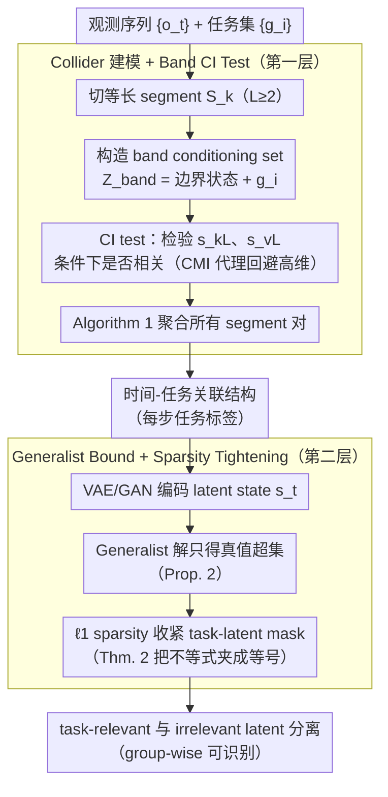

# From Generalist to Specialist Representation

**会议**: ICML 2026  
**arXiv**: [2605.12733](https://arxiv.org/abs/2605.12733)  
**代码**: 无  
**领域**: 表示学习理论 / 因果可识别性  
**关键词**: identifiability, task-relevant representation, nonparametric, sparsity, world model

## 一句话总结
本文给出第一个完全非参数（无 intervention、无 functional 约束）的两层 hierarchical 可识别性证明：时间-任务结构由 collider 视角下的 CI test 可识别，任务相关 latent 由 sparsity 正则可从 generalist 表示中分离出来。

## 研究背景与动机

**领域现状**：从高维观测中学 latent 是世界模型的核心。但 latent 表示若没有 identifiability 保证，就可能与真值"观测等价但内容错位"（$\hat s = \phi(s)$ 的任意置换）。经典线性 ICA 靠非高斯性、nonlinear ICA 靠辅助变量或 functional 约束、因果表示学习靠 intervention / counterfactual——每条路线都要"加点料"。

**现有痛点**：（1）大多数 identifiability 结果追求全 latent 完全恢复，但下游任务往往只需子集；（2）现有 task-relevant 工作（content-style 分离、subspace factorization）只支持固定结构，任务数和组合方式不能灵活变化；（3）i.i.d. 设定下不能用时序信号，理论格外难做。

**核心矛盾**：要"完全通用"（非参数 + 任意任务结构 + 允许断连时序）和"identifiability 可证"之间几乎不可兼得。问题的根本是——追求 component-wise 全 latent 恢复时假设过强，但只识别 task-relevant 子组其实够用且条件可大幅放松。

**本文目标**：在最一般的非参数设定下证明（1）时间步与任务的关联结构可识别；（2）每个时间步内的 task-relevant latent 可识别。

**切入角度**：把"任务"建模为不同时间步的 collider（$s_t \to a_t \to g_i$）——confounder / mediator 视角会推出错误的条件独立，只有 collider 能编码"同一任务内多步互依赖"的实情。在 collider DAG 上，条件独立测试 + sparsity 正则就足以闭环。

**核心 idea**：任务作 collider，用 band conditioning set 做 CI test 恢复时间-任务图；再用 $\ell_1$ 正则把 generalist 的过大表示收紧为任务最小子集，整套理论无需 intervention 或 functional 约束。

## 方法详解

### 整体框架
两层 hierarchical pipeline：第一层（Section 3）从观测序列 $\{o_t\}$ 和任务集 $\{g_i\}$ 出发，用 Algorithm 1 通过 segment-pair 上的 CI test 恢复全局时间-任务关联结构；第二层（Section 4）在每个时间步内用带 sparsity 正则的 VAE 把 latent state $s_t$ 中真正与各任务相关的子集 disentangle 出来。两层之间的接口是"task labels per step"。第三个关键设计不是新阶段，而是贯穿两层的"理论→实践桥"——CI test 在观测空间用 CMI 代理、latent 估计用 VAE/GAN，让渐近的非参数证明变成能跑的标准估计器，因此下图把它的实现选择直接标注在对应节点上。

### 关键设计

**1. Collider 建模 + Band CI Test：把"任务"看成 collider，让条件独立检验能在任意交错的序列里认出任务结构**

第一层要解决的痛点是：现实序列里任务会 interleaving、重复、断连，没法假设"前 10 步是任务 A、后 10 步是任务 B"这种规整切分。本文的做法是把序列切成长度 $L\ge 2$ 的等长 segment $S_k$，再围绕每个 segment 的代表状态构造一个 band conditioning set $Z_{\text{band}}(k,v,i) = \{s_{kL-1}, s_{kL+1}, s_{vL-1}, s_{vL+1}\} \cup \{g_i\}$。Theorem 1 证明：在 Markov + Faithfulness 假设下，任务 $g_i$ 同时与 $S_k, S_v$ 相关，当且仅当 $s_{kL}$ 与 $s_{vL}$ 在 $Z_{\text{band}}$ 条件下不独立——于是一组 CI test 就能把"哪些时间步属于同一个任务"读出来，Corollary 1 还说明代表状态可以自由替换。证明之所以成立，全靠把任务建模成 collider（$s_t \to a_t \to g_i$）：条件在 boundary state 上挡掉时序通道，其它任务作为闭合 collider 自动被 block，最后只剩下 $g_i$ 这条依赖路径暴露出来。这正是为什么不能用 confounder 或 mediator 视角——后两者会推出"同一任务的两步条件独立"这种反直觉结论，只有 collider 能保留"一个协调一致的 plan 内多步互相依赖"的真实语义。

**2. Generalist Bound + Sparsity Tightening：先证明"光靠大模型恢复不全"，再证明"加一个 $\ell_1$ 正则就刚好够"**

第二层要回答"任务相关 latent 能不能从 generalist 表示里分离出来"。本文分两步把答案夹出来。Proposition 2 在 sufficient nonlinearity 假设下证明 $\|\mathcal{I}((J_{\hat u})_{i,\cdot})\| \ge \|\mathcal{I}((J_u)_{i,\cdot})\|$，即一个只追求重建的 generalist 模型最多只能保证估计出的 task-relevant latent 是真值的**超集**——它会把无关维度也混进来。Theorem 2 接着加上 sparsity 约束 $\|\mathcal{I}(J_{\hat u})\| \le \|\mathcal{I}(J_u)\|$，把这个不等式从两边夹成等号，再通过列置换 $\pi$ 推出 $\hat s_{t, \pi(I_k)} = h_k(s_{t, I_K})$（每个任务子组对应一个可逆函数），task-relevant 与 irrelevant latent 就此 disentangle。这种"先说大模型不够、再说 sparsity 给出确切答案"的两段式论证逻辑很紧：它把 sparsity 从一个经验技巧提升成了理论上的必要增益，而且结论本身很硬——i.i.d. 设定下竟然不需要任何 functional 约束就能拿到 group-wise identifiability。

**3. 从理论到实践的桥：把渐近的非参数证明落成一个能在真实视频和图像上跑的标准估计器**

identifiability 是个渐近性质，如果不给一个能跑的算法，社区会把它当纯理论搁置。本文于是把每个理论步骤都配上可实现的代理：CI test 直接在观测空间上做，用 conditional mutual information 当 proxy 来回避高维统计的麻烦；任务未知时就把任务表示作为额外 latent 一起学；latent 估计用标准 VAE 加 $\ell_1$ 正则；图像生成场景则换成 GAN，并用任务特定 mask 去操作 latent。这套"CMI 代理 + 标准 VAE/GAN"的组合让任何 ML researcher 都能直接复现，而不必先攒一套专用工具。

### 损失函数 / 训练策略
没有新损失。任务结构发现阶段用 Fisher's z-test（线性高斯）或 CMI（深度模型）做 CI test，阈值 $p=0.05$；表示学习阶段用标准 VAE 重建 loss 加 $\ell_1$ 正则 $\lambda \|M\|_1$ 在 task-latent mask 上。CMI 用 MINE 估计。

## 实验关键数据

### 主实验（合成 + 真实）
合成数据按 collider DAG 生成 10k 样本，10 次随机 run。

| 设置 | 指标 | CCA | Group Lasso | SelTask | **本文** |
|------|------|-----|-------------|---------|---------|
| $T \in [8,20], M=T/5$ | Accuracy | 低 | 中 | 较好 | **最高** |
| $T=20, M \in [2,10]$ | MCC | 低 | 中 | 较好 | **最高** |

SportsHHI 视频（多人多 task interleaving，mAP）：

| 方法 | mAP |
|------|-----|
| Alg.1 on observed $o$ | 较低 |
| LEAP | 中 |
| **本文（在 latent $s$ 上做 CI）** | **最高** |

### 消融实验
Task-relevant identifiability（合成 nonlinear MLP 数据，$R^2$）：

| 配置 | $R^2$ relevant ↑ | $R^2$ irrelevant ↓ | 说明 |
|------|------------------|---------------------|------|
| VAE without $\ell_1$ | 较高 | 较高 | 信息保留但纠缠 |
| VAE + $\ell_1$ on task-latent mask | **高** | **低** | 既保留又分离 |

Flux 猫图像 + GAN（任务"戴眼镜 / 帽子 / 领带"）：

| 配置 | 视觉结果 |
|------|---------|
| with sparsity | 编辑只动目标属性 |
| without sparsity | 颜色等无关因子被纠缠改动 |

### 关键发现
- $\ell_1$ 正则是把 generalist 转 specialist 的"最小充分增益"：去掉就立刻 entanglement；加上就 disentangle。
- 实验里 task 数 $M$ 增加时性能退化的斜率明显比 baseline 平，说明 collider + band CI 的优势在复杂结构下更显著。
- 真实视频上"在 latent 而非 observed 上做 CI"差距最大，验证 identifiability 需要先有正确的 latent space 这个直觉。

## 亮点与洞察
- "task 当 collider"是个非平凡建模选择——用它推 CI 条件，把"同任务依赖"的精确语义编码进 graph，是整套理论能 work 的起点。
- 把"先证明 generalist 不够 → 再用 sparsity 收紧"两段式呈现，让 sparsity 的必要性从经验技巧上升为理论必要。
- 不需要 intervention、不要 functional class、允许 i.i.d.——三个限制同时放掉还能拿 identifiability，是该方向少见的"大放宽"成果。

## 局限与展望
- Identifiability 是渐近性质，文中没分析有限样本误差，对数据稀缺场景没保障。
- Sparsity 用 $\ell_1$ 凸代理，与真 $\ell_0$ 之间有 gap，理论结论里默认达到了 minimal support 在实践中需 careful tuning。
- 实验中 latent 空间用 VAE，本身依赖 reconstruction 是否足够信息保留，理论假设的 sufficient nonlinearity 在真实数据上不易直接验证。
- "Identifiability-inspired architecture"作者也提到是 future work，目前只是标准 estimator + 正则，离架构级创新还差一步。

## 相关工作与启发
- **vs nonlinear ICA (Hyvärinen 系列)**：他们靠时序 contrastive 或 auxiliary variable；本文允许断连且 i.i.d.。
- **vs causal representation learning (von Kügelgen 等)**：他们要 intervention；本文完全 observational。
- **vs subspace factorization (content-style)**：他们结构固定；本文允许任务数、结构、分配都未知。
- **vs SelTask / LEAP**：实证最强 baseline，但都只保 latent 可识别不保结构可识别；本文两层都给。

## 评分
- 新颖性: ⭐⭐⭐⭐⭐ 第一个完全非参数 task-relevant identifiability + collider 视角原创性强。
- 实验充分度: ⭐⭐⭐ 偏理论论文，实验更多是验证而非全面比较；真实数据规模有限。
- 写作质量: ⭐⭐⭐⭐ 两层框架清晰，定理-推论-引理布局严谨。
- 价值: ⭐⭐⭐⭐ 为"generalist → specialist fine-tuning"提供形式化基础，是未来工作的理论靠山。

<!-- RELATED:START -->

## 相关论文

- [\[CVPR 2026\] Δynamics: Language-Based Representation for Inferring Rigid-Body Dynamics From Videos](../../CVPR2026/physics/δynamics_language-based_representation_for_inferring_rigid-body_dynamics_from_vi.md)
- [\[CVPR 2025\] Improve Representation for Imbalanced Regression through Geometric Constraints](../../CVPR2025/physics/improve_representation_for_imbalanced_regression_through_geometric_constraints.md)
- [\[NeurIPS 2025\] Latent Representation Learning in Heavy-Ion Collisions with MaskPoint Transformer](../../NeurIPS2025/physics/latent_representation_learning_in_heavy-ion_collisions_with_maskpoint_transforme.md)
- [\[NeurIPS 2025\] POLARIS: A High-contrast Polarimetric Imaging Benchmark Dataset for Exoplanetary Disk Representation Learning](../../NeurIPS2025/physics/polaris_a_high-contrast_polarimetric_imaging_benchmark_dataset_for_exoplanetary_.md)
- [\[ICML 2026\] EqGINO: Equivariant Geometry-Informed Fourier Neural Operators for 3D PDEs](eqgino_equivariant_geometry-informed_fourier_neural_operators_for_3d_pdes.md)

<!-- RELATED:END -->
