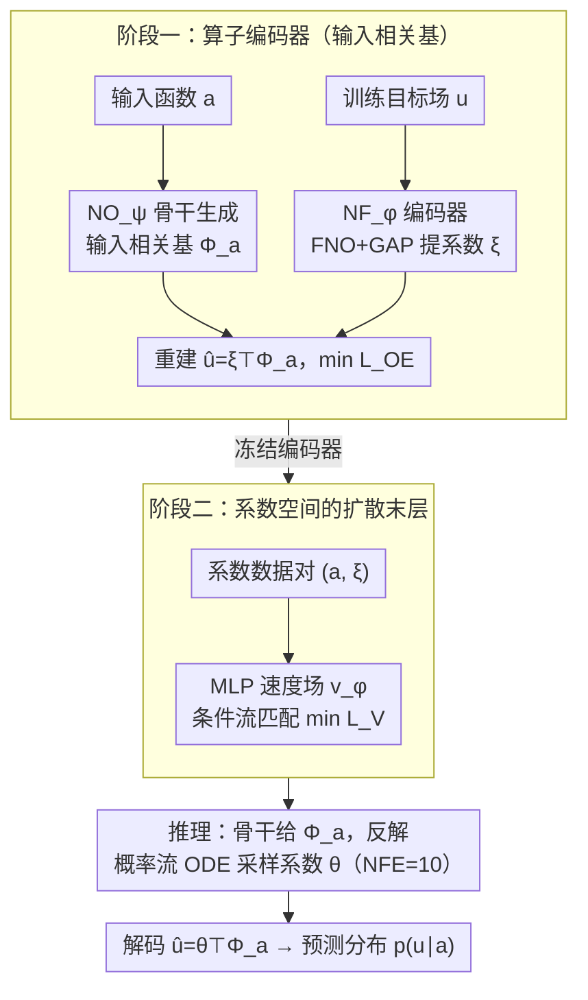

# Generative Neural Operators Through Diffusion Last Layer

**会议**: ICML 2026  
**arXiv**: [2602.04139](https://arxiv.org/abs/2602.04139)  
**代码**: https://github.com/sungwpark/dll-no  
**领域**: 科学计算 / 神经算子 / 扩散模型 / 不确定性量化  
**关键词**: Neural Operator, Diffusion Model, Karhunen–Loève, Flow Matching, Probabilistic Surrogate  

## 一句话总结
在任何神经算子骨干（FNO/DeepONet）后挂一个"扩散末层"（DLL）：用一个输入相关基 $\Phi_a$ 把目标场压成 $r$ 维系数向量，再用一个小 MLP 速度场在系数空间做条件流匹配，从而把确定性算子升级成既能采样随机解又能给出滚动不确定性的生成式算子。

## 研究背景与动机
**领域现状**：神经算子（FNO、DeepONet 等）已经成为求解参数化 PDE 的主流框架，能学到函数空间到函数空间的映射且具有离散化无关性。但绝大多数算子都是确定性的——给定输入函数 $a$ 只吐出一个解 $u$。

**现有痛点**：现实科学问题大多是带随机性的：随机强迫、未解析的亚网格物理、混沌系统对初值的敏感性都会让"同一个输入"对应一个解的分布而非单点。确定性算子无法表示这种内禀随机性（aleatoric uncertainty），即便在确定性问题里做长程自回归滚动时也无法给出误差累积的不确定性估计。已有的概率化方案各有问题：贝叶斯神经算子只刻画参数后验（epistemic），形式被先验/似然限制；像素空间扩散（DM）算力贵；latent diffusion（LDM）用通用 autoencoder 压缩，丢失算子的几何结构优势。

**核心矛盾**：想要"分布建模能力"和"算子学习的离散化无关性、几何感知"两者兼得，但直接在函数空间或像素空间做扩散都太重，而通用 LDM 又抛弃了算子骨干带来的结构归纳偏置。

**本文目标**：设计一个轻量、模块化的概率化输出头，能挂在任意算子骨干之后，同时（i）保留骨干的离散化无关性；（ii）以可控成本建模条件分布 $p(u\mid a)$；（iii）在确定性问题里也能提供滚动不确定性。

**切入角度**：作者观察到，目标解场 $u$ 在给定 $a$ 时通常具有低维结构——这正是经典 Karhunen–Loève 展开的直觉。如果用一个**输入相关**的基 $\Phi_a$ 把 $u$ 投影成低维系数 $\xi\in\mathbb{R}^r$，那扩散建模就可以彻底转到 $r$ 维欧氏空间里做，骨干本身的几何/谱结构由基函数承担。

**核心 idea**：用神经算子学一组与输入 $a$ 适配的低秩基函数，把分布建模问题降维到系数空间，再用条件流匹配（flow matching）的扩散模型学这个系数分布——也就是把扩散当作神经算子的"末层"。

## 方法详解
DLL 的训练分两阶段：先训练算子编码器学到输入相关的低秩基与对应系数；冻结之后再训练系数空间的条件扩散模型。推理时对每个输入 $a$ 采样系数 $\theta\sim p(\theta\mid \mathcal{D},a)$，再用基重建函数 $\hat u=\theta^\top \Phi_a$。

### 整体框架
- **输入**：参数函数 $a\in\mathcal{A}$（如 PDE 系数、初始条件、几何场）。
- **算子编码器** $\mathtt{NO}_\psi+\mathtt{NF}_\varphi$：神经算子骨干 $\mathtt{NO}_\psi$ 把 $a$ 映成 $r$ 个基函数 $\Phi_a=(\phi_1(a),\dots,\phi_r(a))$；神经泛函编码器 $\mathtt{NF}_\varphi$（同样的 FNO + global average pooling）把训练目标 $u$ 映成系数 $\xi=\mathtt{NF}_\varphi(u)\in\mathbb{R}^r$。重建为 $\hat u=\xi^\top\Phi_a$。
- **扩散末层**：在冻结的编码器之上，用 MLP 速度场 $v_\phi$ 在 $\mathbb{R}^r$ 上学条件流 $p(\xi\mid a)$。
- **推理**：对新输入 $a$，先由骨干给出 $\Phi_a$；再在系数空间求解概率流 ODE 从噪声反演出 $\theta$；最后解码 $\hat u=\theta^\top\Phi_a$。
- **输出**：函数 $\hat u$ 上的整条预测分布；可重复采样得到均值、方差或滚动 ensemble。

### 关键设计

**1. 输入相关基的算子编码器：把解场压成 $r$ 维系数，同时保留几何/谱结构**

直接在函数空间或像素空间做扩散都太重，而通用 autoencoder 又会把算子骨干的几何归纳偏置丢掉。作者借 Karhunen–Loève 展开的直觉，用一个完整 FNO 当基生成器 $\Phi_a=\mathtt{NO}_\psi(a)$ 让基函数随输入而变，再用另一个 FNO+GAP 当系数编码器 $\xi=\mathtt{NF}_\varphi(u)$，按 rank-$r$ 展开 $\hat u=\xi^\top\Phi_a$ 重建，训练目标只是重建均方误差

$$\mathcal{L}_{\mathrm{OE}}=\mathbb{E}\big\|u-\mathtt{NF}_\varphi(u)^\top\mathtt{NO}_\psi(a)\big\|_2^2.$$

命题 4.1 证明：理想条件下最小化这个目标等价于求条件二阶矩算子的 leading $r$ 维子空间，也就是学到了输入相关的（未中心化）KL 展开。与通用 autoencoder 把所有结构塞进固定 latent 不同，"重建子空间随条件而变"让相同 latent 维度能承载更多输出结构、$\xi$ 只承担实例级偏离——这正是后面把扩散降到 $r$ 维仍然有效的根本原因。

**2. 系数空间的条件扩散末层：把扩散从像素挪到 $r$ 维向量**

编码器冻结后，扩散只需在 $r$ 维系数空间学条件分布 $p(\xi\mid a)$。作者用线性 schedule 前向过程 $x_t=(1-t)x+t\epsilon$，训一个 MLP 速度场 $v_\phi(x_t,t,c)$ 最小化条件速度匹配

$$\mathcal{L}_V(c)=\mathbb{E}\big[\|v_\phi(x_t,t,c)-(\dot a_t x+\dot b_t\epsilon)\|_2^2\big],$$

推理就是反向积分概率流 ODE、NFE 取 10 即可。命题 2.3 给出端到端的 Wasserstein 界 $\mathcal{W}_2(p,\rho_0)\le C\sqrt{\mathcal{L}_V(c)}$，所以压低速度匹配损失就直接控制了输出分布距离。为什么管用：在 $128\times128$ 解场上做扩散要重型 U-Net 和大量 NFE，而 $r=64$ 维向量用 MLP 就够、单次采样几毫秒；又因为基函数来自神经算子，解码 $\hat u=\theta^\top\Phi_a$ 天然继承离散化无关性，换分辨率推理无需重训。

**3. 确定性 / 随机问题的统一概率化视角：一套损失同时覆盖两类不确定性**

以往要么为 SPDE 设计专门的概率算子，要么为滚动稳定性单独加 ensemble。DLL 把目标算子统一写成 $\mathcal{G}^\ddagger:\mathcal{A}\to\mathcal{P}(\mathcal{U})$（确定性算子是退化成 Dirac 测度的特例），并指出 $\mathcal{W}_2$ 在退化和非退化情形下都是合理度量，因此同一个 $\mathcal{L}_V$ 损失对内禀随机的 SPDE 和确定性混沌系统都能用。在确定性情形里，残留的 $\mathcal{L}_V(c)$ 被解释为"由有限数据/模型误差带来的 epistemic 不确定性的定性指标"——也就是扩散 underfit 的程度可以当滚动不确定性来读。这样把训练目标和不确定性来源挂钩，方便直接部署到任意现有 FNO/DeepONet 骨干上。

### 损失函数 / 训练策略
两阶段训练：阶段一最小化 $\mathcal L_{\mathrm{OE}}$ 学到 $(\mathtt{NO}_\psi,\mathtt{NF}_\varphi)$；阶段二冻结编码器、在 $(a,\xi)$ 对上最小化条件速度匹配 $\mathcal L_V$。默认配置：FNO 骨干、$r=64$、NFE=10、线性噪声 schedule。

## 实验关键数据

### 主实验（随机 PDE 分布拟合）
评估指标包括能量距离（ED）、切片 Wasserstein（SWD）、均值/标准差 NRMSE。每个输入采 64 个 ground-truth 实现，比较学到分布与真实分布的距离。

| 数据集 | 指标 | FNO | PNO | DM | LDM | **DLL** |
|--------|------|-----|-----|----|-----|---------|
| Stochastic Burgers (1D, $u\in\mathbb R^{256}$) | ED ↓ | 6.491 | 1.766 | 1.355 | 1.373 | **1.285** |
| Stochastic Burgers | SWD ↓ | 0.426 | 0.253 | 0.239 | 0.249 | **0.213** |
| Stochastic Burgers | $\mathrm{NRMSE}_s$ ↓ | 1.000 | 0.457 | 0.323 | 0.297 | **0.289** |
| Stochastic Darcy (2D, $128^2$) | ED ↓ | 1.463 | 0.305 | 0.269 | 0.368 | **0.227** |
| Stochastic Darcy | $\mathrm{NRMSE}_s$ ↓ | 1.000 | 0.285 | 0.360 | 0.268 | 0.357 |

DLL 在两类 SPDE 上 ED 都最低，Burgers 上的 SWD 也最低，整体强于像素/通用 latent 扩散；FNO 这种确定性 baseline 的 $\mathrm{NRMSE}_s$ 直接撑到 1.0，说明它根本没在建模方差。

### 长程自回归滚动稳定性（确定性 PDE）
训练 step 长度 50、评测滚动 100；CRPS 越低越好，spread-skill ratio SSR 越接近 1 越好。

| 数据集 | 指标 | FNO | FNO-d | PNO | DM | LDM | **DLL** |
|--------|------|-----|-------|-----|----|-----|---------|
| Kuramoto–Sivashinsky (1D) | NRMSE ↓ | 0.404 | 0.384 | 0.354 | 0.395 | 0.576 | **0.343** |
| KS | CRPS ↓ | – | 0.523 | 0.514 | 0.545 | 0.878 | **0.470** |
| KS | SSR | – | 0.975 | 0.550 | 0.961 | 0.802 | 0.949 |
| Kolmogorov Flow (2D, $128^2$) | NRMSE ↓ | 0.528 | 0.463 | 0.492 | **0.369** | 0.615 | 0.426 |
| Kolmogorov | SSR | – | 0.546 | 0.167 | 0.601 | 0.548 | **0.620** |

DLL 在 KS 上把 NRMSE 和 CRPS 都打到最优，且 SSR 接近 1，说明既改善了精度又给出了校准合理的不确定性；Kolmogorov 上像素扩散凭借更强的 U-Net 空间先验拿到最佳 NRMSE，但 DLL 仍超过 FNO 骨干且 SSR 最好。

### 关键发现
- 操作编码器（OE）在确定性 PDE（KS、Kolmogorov）上以 4× / 256× 的高压缩比仍打过 autoencoder（如 KS NRMSE $2.45\times10^{-4}$ vs $7.75\times10^{-4}$），佐证"输入相关基"确实捕捉了解流形的低维结构。
- 在随机 PDE（Burgers、Darcy）上 OE 重建误差略输 AE，但 DLL 整体分布指标仍领先，说明在分布建模任务里"latent 信息更结构化"比"逐样本重建更准"更重要。
- DLL 的性能上限明显受骨干质量限制：Kolmogorov 上像素 DM 凭 U-Net 反而更强，提示后续可以换更强的 FNO/Transformer 骨干进一步提升。

## 亮点与洞察
- **把扩散降到"系数空间"是非常聪明的拆分**：让骨干承担几何/谱归纳偏置，让小 MLP 承担分布建模，二者职责清晰，训练和推理都便宜，挂到任何已有 FNO/DeepONet 上几乎零侵入。
- **用"扩散 underfit 量"当 epistemic 不确定性**：在确定性问题里没法直接定义 aleatoric 分布，作者把残留的 $\mathcal L_V(c)$ 解释为"有限数据下的隐式 ensemble 宽度"，提供了一种几乎免费的滚动不确定性来源，思路可以迁移到任何条件扩散 surrogate。
- **命题 4.1 把"输入相关基"和经典 KL 展开挂钩**：给了这个看似 ad-hoc 的设计一个清晰的理论解释——本质就是在学一个 condition-dependent 的 KL 子空间，这也解释了为什么 OE 在确定性场上比通用 AE 更好。

## 局限与展望
- 在空间结构强、上下文复杂的 2D 混沌系统（Kolmogorov flow）上 NRMSE 输给像素 DM，说明当骨干表达力不够时 DLL 的天花板会被拖住；需要更强算子骨干或更高 $r$。
- $r$、NFE、骨干结构等是关键超参，文章主要在 FNO/DeepONet 上验证，更复杂的不规则几何（如 GNO/GINO 骨干）尚未充分覆盖。
- 不确定性目前只是分布拟合 + 启发式 SSR，没有像 conformal prediction 那样的覆盖率保证；要做严格 UQ 还需要后处理校准。
- 系数维度 $r$ 是固定超参，缺少自适应选取或层次化基的机制，对极复杂场可能压缩过度。

## 相关工作与启发
- **vs 像素空间扩散 (DM)**：DM 直接在 $128^2$ 网格上学扩散，靠 U-Net 强空间偏置，精度高但开销大、采样慢；DLL 在 $r=64$ 系数空间学扩散，便宜很多但天花板受骨干限制。
- **vs 通用 latent 扩散 (LDM)**：LDM 用与算子无关的 autoencoder 压缩，丢失了算子骨干的几何/谱结构；DLL 用算子本身产生输入相关基，潜空间天然带几何信息。
- **vs 贝叶斯神经算子 / FNO-d**：BNO 和 MC-dropout 只刻画参数后验（epistemic），形式被先验/似然限定；DLL 学的是输出条件分布，能同时表示 aleatoric 和 epistemic 不确定性。
- **vs 概率神经算子 PNO**：PNO 给出 pointwise 高斯预测；DLL 给出全场联合分布且非高斯，能刻画空间相关性，距离指标显著更好。
- **vs 函数空间扩散 (Lim et al., Shi et al.)**：那一支直接在无穷维函数空间定义扩散过程；DLL 用有限维系数表示绕过该复杂度，更工程友好但需要学到合适的基。

<!-- RELATED:START -->

## 相关论文

- [\[NeurIPS 2025\] Towards Universal Neural Operators through Multiphysics Pretraining](../../NeurIPS2025/physics/towards_universal_neural_operators_through_multiphysics_pretraining.md)
- [\[ICML 2026\] EqGINO: Equivariant Geometry-Informed Fourier Neural Operators for 3D PDEs](eqgino_equivariant_geometry-informed_fourier_neural_operators_for_3d_pdes.md)
- [\[ICML 2026\] PINNfluence: Interpreting PINNs Through Influence Functions](pinnfluence_interpreting_pinns_through_influence_functions.md)
- [\[ICML 2026\] Iterative Refinement Neural Operators are Learned Fixed-Point Solvers: A Principled Approach to Spectral Bias Mitigation](iterative_refinement_neural_operators_are_learned_fixed-point_solvers_a_principl.md)
- [\[CVPR 2025\] DiffFNO: Diffusion Fourier Neural Operator](../../CVPR2025/physics/difffno_diffusion_fourier_neural_operator.md)

<!-- RELATED:END -->
