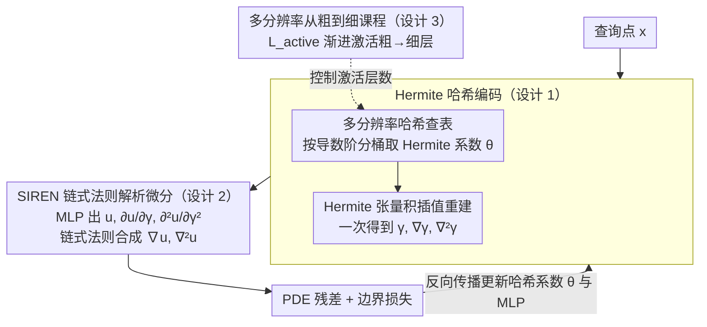

# Hermite-NGP: Gradient-Augmented Hash Encoding for Learning PDEs

**会议**: ICML 2026  
**arXiv**: [2605.24774](https://arxiv.org/abs/2605.24774)  
**代码**: 待确认  
**领域**: 科学计算 / 物理信息神经网络 / 神经场表征  
**关键词**: PINN, 哈希编码, Hermite 插值, 解析微分, 多尺度课程

## 一句话总结
论文把 Instant-NGP 的多分辨率哈希表升级为"梯度增强"版本——在每个哈希格点同时存储函数值与所有混合偏导，再用 Hermite 插值重建出 $C^1$ 连续、内部解析可二阶可微的场，从而让 NGP 第一次能真正用于 PINN 求解 PDE，在 2D/3D 多个基准上比 SOTA 神经 PDE 求解器降误差最多 $20\times$，单 epoch 训练只要 $2$–$3.5\,\mathrm{ms}$。

## 研究背景与动机

**领域现状**：多分辨率哈希编码（I-NGP）是 NeRF / SDF / 图像重建里的明星表征——$O(1)$ 查表、空间自适应、可瞬时训练。它依赖 $d$-线性插值把哈希表的 $F$ 维特征 blend 成连续场，再喂进轻量 MLP。

**现有痛点**：把 I-NGP 直接搬来做 PINN 几乎全军覆没。原因很硬核：$d$-线性插值只有 $C^0$ 连续，一阶导在 cell 内是分段常数、在 cell 边界跳变，二阶导几乎处处为零。这意味着 PDE 残差里出现的 Laplacian $\nabla^2 u$ 拿不出可信的解析值。已有 workaround 是 INGP-FD（用有限差分近似导数，每次 Laplacian 要 $2d+1$ 次 forward——2D 要 5 次、3D 要 7 次），但 $O(\epsilon^2)$ 的截断误差直接把精度天花板封死在 $10^{-5}$ 量级，而且 FD 步长 $\epsilon$ 还要靠手调；另一类方案靠 autodiff 强行二阶求导，又会被哈希碰撞噪声放大。

**核心矛盾**：哈希编码的"locality + speed"和 PINN 的"高阶解析可微"在表征层面就冲突——你要么放弃稀疏哈希换 SIREN/Fourier features（精度可以但慢），要么留着哈希接 FD（快但精度有上限）。

**本文目标**：直接在表征层面打破这个 trade-off——重新设计哈希编码本身，让它原生支持解析二阶导，且仍保留 NGP 的 locality 和 instant training。

**切入角度**：计算物理领域里有一类叫"gradient-augmented level set"的经典方法（Nave et al. 2010）——既存场值也存梯度，在网格 cell 内用 Hermite 插值重建。这个思路给出了"把导数当作表征的一等公民"的范本。如果把同样的 idea 移植到神经哈希表上，就能让导数直接从哈希表里查到而不是事后求。

**核心 idea**：在哈希表里不仅存函数值，还存所有 $2^d$ 个混合偏导系数，用 Hermite 基函数张量积重建 $C^1$ 连续场，二阶导直接由 Hermite 基的二阶解析导得到——一次 forward 同时拿到 $\gamma, \nabla\gamma, \nabla^2\gamma$。

## 方法详解

### 整体框架

Hermite-NGP 的训练流水线是：

- **多分辨率哈希查表**：在每个分辨率 $l\in\{0,\dots,L-1\}$ 上,按 I-NGP 同款哈希函数把 $2^d$ 个 cell 顶点映射到分类型存储的哈希表,取出 Hermite 系数 $\{\theta_{l,h(g)}^{(\alpha)}\}_{\alpha\in\{0,1\}^d}$。
- **Hermite 插值重建**：用张量积 Hermite 基 $H^{(\alpha)}$ 把这些系数 blend 成局部 $C^1$ 场，并同时算出 $\nabla\gamma$ 与 $\nabla^2\gamma$。
- **SIREN MLP + 解析链式法则**：把编码 $\gamma$ 喂进用 $\sin(\omega\cdot)$ 激活的 MLP，借助 SIREN 的二阶导恒等式 $\sigma''=-\omega^2\sigma$，沿链式法则递推出 $\nabla u, \nabla^2 u$，整张 PDE 残差在一次 forward 内算出。
- **多分辨率从粗到细课程训练**：分三阶段从粗到细激活分辨率层，模仿 multigrid V-cycle。

整个 pipeline 由 Algorithm 1 总结，关键链式法则是 $\nabla u = \frac{\partial u}{\partial\gamma}\nabla\gamma$，$\nabla^2 u = \frac{\partial^2 u}{\partial\gamma^2}(\nabla\gamma)^2 + \frac{\partial u}{\partial\gamma}\nabla^2\gamma$。其中「哈希查表 + Hermite 插值重建」共同构成关键设计 1（梯度增强的 Hermite 哈希编码），课程训练（设计 3）作为外层调度控制哪些分辨率层被激活。

### 关键设计

**1. Hermite 哈希编码：把哈希表从"只存值"升级成"值 + 全部混合偏导"**

PINN 跑不动 I-NGP 的根因，是 $d$-线性插值只有 $C^0$ 连续——一阶导在 cell 内是分段常数、边界跳变，二阶导几乎处处为零，PDE 残差里的 Laplacian 根本拿不出可信值。作者的破局点是让每个哈希格点不只存函数值，还存 $2^d$ 个混合偏导系数 $\{f^{(\alpha)}\}_{\alpha\in\{0,1\}^d}$——2D 是 $(f, f_x, f_y, f_{xy})$，3D 是 $(f, f_x, \dots, f_{xyz})$，并按导数阶分桶进 $2^d$ 张独立哈希表（2D 三张：$T_1\times F$ 存 $f$、$T_2\times 2F$ 存一阶、$T_3\times F$ 存混合二阶）。重建时用张量积 Hermite 基把系数 blend 成局部场：

$$\gamma^l(\mathbf{x}) = \sum_{g}\sum_{\alpha}\theta_{l,h(g)}^{(\alpha)}\,H^{(\alpha)}\!\Big(\tfrac{\mathbf{x}-\mathbf{x}_g}{\Delta x_l}\Big)\,\Delta x_l^{|\alpha|},$$

其中 1D 基由值基 $h^{(0)}(t)=-2t^3+3t^2$ 与导基 $h^{(1)}(t)=t^3-t^2$ 组成，$d$ 维由 $H^{(\alpha)}=\prod_i h^{(\alpha_i)}(x_i)$ 张成。为什么必须这么扩张？传统 $d$-线性只有 $2^d$ 个值系数、自由度刚好用完只能到 $C^0$；要做 $C^1$ Hermite 必须把自由度翻倍到 $2\cdot 2^d$（每顶点带导数），$\nabla^2u$ 在 cell 内才不为零。把导数当独立通道存还有个意外好处：哈希碰撞注入的高频噪声被多通道分摊吸收，消融里给一阶导表更大容量（$2^{14}$）能多降 56% 误差，正因一阶导对碰撞最敏感。

**2. SIREN 链式法则下的解析微分：一次 forward 同时拿到 $\nabla u$ 和 $\nabla^2 u$**

光在哈希表层面拿到 $\nabla\gamma,\nabla^2\gamma$ 还不够，得把它们一路传到 MLP 输出 $u$，才能算出整张 PDE 残差。Hermite 基的导数本身可解析写出（cell 内一阶导 $\partial h^{(0)}/\partial t=-6t^2+6t$、二阶导 $-12t+6$），$d$ 维通过因式分解 $\partial_{x_i}H^{(\alpha)}=\partial_{x_i}h^{(\alpha_i)}(y_i)\prod_{k\neq i}h^{(\alpha_k)}(y_k)$ 向量化算出。MLP 选 SIREN（$\sigma(x)=\sin(\omega x)$），是因为它的二阶导恒等式 $\sigma''=-\omega^2\sigma$ 让链式法则极简，单层 Laplacian 写成 $\nabla^2u=W_2[-\omega^2a\odot\sum_i(W_1\gamma_{x_i})^2+\omega\cos(\omega z)\odot W_1\nabla^2\gamma]$，且能复用 forward 的中间量。对比之下 INGP-FD 算一次中心差分 Laplacian 要 $2d+1$ 次 forward（3D 要 7 张 activation 图），既占满显存又被 $O(\epsilon^2)$ 截断误差封死精度；Hermite-NGP 单次 forward 单张计算图，$\sim 17$M 参数模型单 epoch 只要 $3.5\,\mathrm{ms}$，且显存反而比 INGP-FD 更低。换别的激活（Swish/GELU）也能跑，只是丢掉这层 algebraic 简化。

**3. 多分辨率从粗到细课程训练：把"先低频后高频"和哈希层级显式对齐**

PINN 有 spectral bias，一上来让所有频段一起 fit 容易被高频细节带偏。作者借多分辨率哈希天然的层次结构，模仿 multigrid V-cycle 分三阶段激活：先只训粗层 $l=0,\dots,L_0$ 学全局结构，再按 $L_{\text{active}}(t)=\min(L,\,L_0+\lfloor t/\tau\rfloor)$ 渐进激活更细层（$\tau$ 为激活间隔），最后全层联合微调。它之所以有效，是把"频率从低到高"这条缓解 spectral bias 的经典训练动力学和哈希分辨率层一一对应，避免高频细节被随机初始化的粗层干扰。Helmholtz 2D 消融里 C2F 相比无调度降低 79.2% 误差，也优于 V/W-cycle。

### 损失函数 / 训练策略
标准 PINN 损失 $\mathcal{L} = \lambda_{\text{res}}\mathcal{L}_{\text{res}} + \lambda_{\text{ic}}\mathcal{L}_{\text{ic}} + \lambda_{\text{bc}}\mathcal{L}_{\text{bc}} + \lambda_{\text{data}}\mathcal{L}_{\text{data}}$，PDE 残差和边界条件（含 Neumann）都靠解析 $\nabla u, \nabla^2 u$ 算出。优化器 Adam + GradNorm 平衡。SIREN 初始化 $\omega_0=30$，哈希系数零附近初始化。

## 实验关键数据

### 主实验

| 基准 | 设置 | Hermite-NGP (Ours) | 最强基线 | 倍数提升 |
|------|------|--------------------|----------|---------|
| Helmholtz 2D | $a=10$ | **1.81e-5** | PIG 7.04e-4 | $20\times$ |
| Helmholtz 2D | $a=20$ | **7.93e-5** | PirateNet 1.36e-3 | $17\times$ |
| Helmholtz 2D | $a=100$ | **4.59e-2** | 全部 fail | 唯一收敛 |
| Helmholtz 3D | $a=3$ | **6.09e-5** | PirateNet 8.40e-4 | $14\times$ |
| Helmholtz 3D | $a=10$ | **6.01e-3** | INGP-FD 7.21e-2 | $12\times$ |
| Convection 1+1D | $c=30$ | **8.49e-5** | PirateNet 8.54e-4 | $10\times$ |
| Taylor–Green | $\nu=0.01$ | **7.71e-5** | PIG 7.27e-4 | $9\times$ |
| Flow Mixing | — | **2.35e-4** | PIG 2.67e-4 | $1.1\times$ |

3D 复杂几何上 Hermite-NGP 同样领先：

| 任务 | Mesh | Hermite-NGP | 对比基线 | 倍数提升 |
|------|------|-------------|---------|---------|
| 3D Poisson (L2 ↓) | Armadillo | 0.0055 | PIG 0.0167 | $3.0\times$ |
| 3D Poisson (L2 ↓) | Bunny | 0.0044 | PIG 0.0127 | $2.9\times$ |
| 3D Poisson (L2 ↓) | Fandisk | 0.0031 | PIG 0.0100 | $3.2\times$ |
| SDF (Grad MAE ↓) | Armadillo | 0.0478 | NeuralAngelo 0.1009 | $2.1\times$ |
| SDF (Grad MAE ↓) | Bunny | 0.0416 | NeuralAngelo 0.0887 | $2.1\times$ |
| SDF (Grad MAE ↓) | Dragon | 0.0453 | NeuralAngelo 0.1322 | $2.9\times$ |

### 消融实验

| 配置 | Helmholtz 2D ($a=10$) L2 | 说明 |
|------|--------------------------|------|
| Hermite-NGP (完整) | **1.81e-5** | C2F + Hermite 表 |
| 无 C2F 课程 | $\sim 8.7$e-5 | 误差升 79.2%，验证多尺度训练必要 |
| Cubic-NGP（无存储导数） | $>0.1$ (fail) | 高阶但靠 autodiff 求导，哈希碰撞噪声放大 |
| Bicubic 4×4 NGP | $>0.1$ (fail) | 同上失败 |
| INGP-FD 对照 | 1.67e-3 | 有限差分导数，精度天花板 |
| 哈希表 $H_1$-$H_2$-$H_3$ = 14-14-10 | **2.26e-5** | 最优配置 |
| 哈希表 12-12-12（均匀） | 5.13e-5 | 均匀给配 56% 退化 |
| 哈希表 14-10-14 | 9.98e-5 | 一阶导表碰撞敏感度最高 |
| 全 autodiff 二阶导 | $9.5\times$ 慢 | 解析编码导数贡献主要加速 |
| 解析编码 + autograd MLP | $1.2$–$1.5\times$ 慢 | 编码导数是加速主力 |

### 关键发现
- **Hermite 存储是必需的**：消融里所有"用更高阶基但不存导数"的变体（Cubic、Bicubic Catmull–Rom、Trilinear）在 Helmholtz $a=10$ 上全部 L2 > 0.1。原因被作者归结为哈希碰撞会向特征通道注入高频噪声，靠基函数高阶或 FD 反求都会放大噪声；只有把"导数"独立作为优化目标分配到独立通道，才能让噪声被多通道分摊吸收。
- **一阶导表对碰撞最敏感**：把一阶导表从 $2^{14}$ 缩到 $2^{10}$ 误差升 5.5×（9.98e-5 vs 1.81e-5），而把函数值表缩到 $2^{10}$ 只升 4.9×（8.90e-5）；提示后续在做表大小搜索时应优先给一阶导更多容量。
- **算力极便宜**：68K–16.8M 参数模型单 epoch 只要 1.8–3.6 ms，139–389 MB 显存。对比 PIG 1600 高斯就要 33.5 GB 显存、5 s/epoch，差距是几个数量级。
- **唯一能解 $a=100$ 高频 Helmholtz 的方法**，其他所有基线（PirateNet/JAX-PI/INGP-FD/SPINN/PIG）全发散。
- **MLP 深度并非瓶颈**：哈希编码本身承担了主要表达力，depth $d=2$ 即可；加深到 $d=4$ 只多 1.7× 提升但每层 $\sim$ 0.9 ms 开销。
- **5 个随机种子上相对方差全部 $<\sim 15\%$**，结果不是偶然。

## 亮点与洞察
- **"把导数当一等公民"是个可以迁移到很多场景的思想**：不仅 PINN，可微渲染、SDF 法向估计、隐式表面曲率估计，凡是对一阶/二阶导精度敏感的任务都能套这套表征（论文里图像梯度重建一节已经证明这点——PSNR 32.56 dB 在相机图像梯度重建上压过 $\partial^\infty$-Grid 与 SIREN）。
- **哈希碰撞 vs 解析微分的解耦**很优雅：把哈希函数 $h(\cdot)$ 明确定义为"离散索引查找，不在连续计算图里"，所有空间导数都从 smooth 的 Hermite 基直接对系数微分得到。这避开了"高阶插值会放大哈希碰撞噪声"的悖论，是真正治本的设计。
- **存储和效率反直觉地双赢**：$2^d$ 倍系数听起来很贵，但因为消除了 INGP-FD 的 $2d+1$ 次 forward 和那么多 activation 图，3D 上 Hermite-NGP 实际显存比 INGP-FD 还低。这种"表征更复杂但下游计算更简单"的 trade-off 值得在其他 implicit field 设计里复刻。
- **SIREN 选型背后藏着 algebraic 巧思**：$\sigma''=-\omega^2\sigma$ 让二阶链式法则的每一项都能复用 forward 中间量；如果换成 Swish/GELU 也能跑但要单独再算 $\sigma''$，对 batch 小（5K 点）的场景效率退化明显。

## 局限与展望
- $2^d$ 存储缩放在 4D+ 时空 PDE 上会很贵（16 系数/点），论文坦言这是主要瓶颈，需要量化或低秩分解。
- 当前实现强绑 SIREN，换其他激活理论可以但二阶链式法则要重写，工程成本不低。
- 只测了强 form PDE 残差，弱 form（Galerkin / Petrov-Galerkin）和 boundary-conforming mesh 没覆盖；对真正复杂几何（移动边界、奇异点）仍是开放问题。
- 三次 Hermite 只到 $C^1$，对需要更高阶（如四阶 plate 方程 $\nabla^4$）的 PDE 需要扩展到 quintic Hermite，存储和插值复杂度都会再涨。
- 作者明确说"不是要替代 FDM/FEM"，更多是给 mesh-free PDE solver 添一个高精度选项；但对工业级 CFD/CSM 是否真有竞争力还需大规模 benchmark。
- 多个表里"哈希碰撞通过梯度下降隐式解决"在更高分辨率（$2^{18}+$）下能否仍稳定，论文没给出极限。

## 相关工作与启发
- **vs INGP-FD（Huang & Alkhalifah 2024）**：同样用 NGP 做 PINN，但靠中心差分求导，3D 要 7 次 forward 且精度封顶 $10^{-5}$；Hermite-NGP 单次 forward 拿解析二阶导，精度可以做到 $10^{-5}$ 以下且显存更低。
- **vs PirateNet / JAX-PI / PIG**：这些是当前 PINN 的强 baseline，但都基于密集 MLP（PirateNet）或 Gaussian-based（PIG）表征，没有 NGP 的空间自适应；Hermite-NGP 在 8 个基准上对它们普遍 $9$–$20\times$ 领先且训练快几个数量级（PIG 5 s/epoch vs Hermite-NGP 3.5 ms/epoch）。
- **vs $\partial^\infty$-Grid (Kairanda 2026)**：同样追求高阶导，但用密集网格 + 高阶 polynomial，没有哈希稀疏性；Hermite-NGP 在 Helmholtz $a=10$ 上 1.81e-5 vs $\partial^\infty$-Grid 6.07e-3，差 3 个数量级。
- **vs NeuralAngelo (Li 2023b)**：在 SDF + curvature 任务上正面对比，NeuralAngelo 用 FD 算曲率有明显伪影，Hermite-NGP 解析二阶导得到的曲率场显著更平滑，2.4× 低 grad MAE。
- **vs 经典 gradient-augmented level set / APIC**：作者明确说思想源自计算物理这条线，但首次把它移植到神经哈希表上并接管 PINN 训练。这种"经典数值表征 → 神经表征"的跨学科移植值得继续挖（如 RBF-FD、SPH 也可以试）。

## 评分
- 新颖性: ⭐⭐⭐⭐⭐ 第一个让 NGP 真正能用于 PINN 的工作，"梯度增强哈希表 + 解析链式法则"是表征层面的根本创新。
- 实验充分度: ⭐⭐⭐⭐⭐ 8 个 PDE 基准 + 5 个 mesh 几何 + 7 类基线，4 套消融把 Hermite/C2F/表分配/MLP 深度都扫了一遍。
- 写作质量: ⭐⭐⭐⭐⭐ 公式与算法伪代码齐全，对失败模式（Cubic-NGP fail 的成因）有细致解释，图 1 / 图 12 等可视化对比清晰。
- 价值: ⭐⭐⭐⭐⭐ 把 PINN 精度从 $10^{-3}$ 量级推进到 $10^{-5}$，且训练时间快两个数量级，是 neural PDE solver 这条线近年最实在的进展之一。

<!-- RELATED:START -->

## 相关论文

- [\[ICLR 2026\] DRIFT-Net: A Spectral--Coupled Neural Operator for PDEs Learning](../../ICLR2026/physics/drift-net_a_spectral--coupled_neural_operator_for_pdes_learning.md)
- [\[NeurIPS 2025\] Integration Matters for Learning PDEs with Backward SDEs](../../NeurIPS2025/physics/integration_matters_for_learning_pdes_with_backward_sdes.md)
- [\[ICML 2026\] Unbiased and Second-Order-Free Training for High-Dimensional PDEs](unbiased_and_second-order-free_training_for_high-dimensional_pdes.md)
- [\[ICLR 2026\] DGNet: Discrete Green Networks for Data-Efficient Learning of Spatiotemporal PDEs](../../ICLR2026/physics/dgnet_discrete_green_networks_for_data-efficient_learning_of_spatiotemporal_pdes.md)
- [\[ICML 2026\] EqGINO: Equivariant Geometry-Informed Fourier Neural Operators for 3D PDEs](eqgino_equivariant_geometry-informed_fourier_neural_operators_for_3d_pdes.md)

<!-- RELATED:END -->
