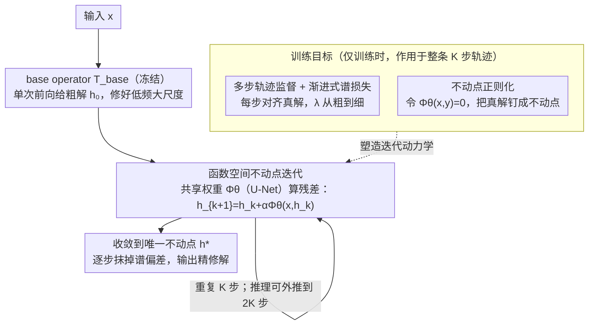

# Iterative Refinement Neural Operators are Learned Fixed-Point Solvers: A Principled Approach to Spectral Bias Mitigation

**会议**: ICML 2026 Spotlight  
**arXiv**: [2605.24041](https://arxiv.org/abs/2605.24041)  
**代码**: https://github.com/xiaotianliu-dartmouth/Iterative_Refinement_Neural_Operator (有)  
**领域**: 科学计算 / 神经算子 / PDE 替代模型  
**关键词**: 神经算子, 不动点迭代, 谱偏差, 推理时迭代, FNO

## 一句话总结
论文给已训练好的神经算子（FNO/TFNO/WDSR 等）外挂一个共享权重的 U-Net 修正模块 $\Phi_\theta$，在推理时按 $h_{k+1}=h_k+\alpha\Phi_\theta(x,h_k)$ 反复迭代，把单次前向的预测变成一个收敛到唯一不动点的"学习版残差求解器"，在湍流、活性物质、ERA5 超分等任务上把误差降低 34%–80%，并能稳定外推到训练步数的 2 倍。

## 研究背景与动机

**领域现状**：FNO、DeepONet 一类神经算子已成为参数化 PDE 与多物理系统的主流快速替代模型；它们在函数空间上学映射 $\mathcal{G}:\mathcal{X}\to\mathcal{H}$，单次前向就给出整张解场，相比传统数值方法快几个数量级。

**现有痛点**：这些算子普遍存在"谱偏差"——大尺度低频结构容易学准，但中高频细节（湍流细丝、风场细纹理、活性物质里的取向梯度）会被显著平滑掉。Figure 1 在 ERA5 16× 超分上很直观：FNO 把大气大体结构画得不错，但小尺度的动能涡旋全糊了。

**核心矛盾**：现有解决思路只剩"训练时砸资源"——加宽模型、堆更高分辨率数据、扩训练集，本质上是把整张解一次性回归出来的"单体前向"范式逼到极限。而经典数值分析早就告诉我们另一条路：先粗解再残差迭代修正（multigrid、defect correction、Krylov），但神经算子领域没人系统地把这条路引进来。

**本文目标**：在不重训 base operator 的前提下，把单次前向变成可迭代的"测试时优化"，把准确率提升和算力消耗解耦，同时给出收敛性的理论保证而不是纯启发式。

**切入角度**：把神经算子的预测过程重新看作一个函数空间里的动力系统——base operator 给出粗初值 $h_0$，再用一个共享权重的修正算子 $\Phi_\theta$ 反复算残差修正。这正好对应数值分析里的不动点迭代 $h_{k+1}=T(h_k)$，于是可以借 Banach 不动点定理去证明收敛、外推稳定性、误差下界。

**核心 idea**：用"学习版残差迭代"替代"单体一次前向"，让谱偏差通过反复迭代被逐步抹掉，并通过 progressive spectral loss 把每一步迭代显式对准不同频段的修正。

## 方法详解

### 整体框架

IRNO 把推理拆成两个阶段：

- **初始化阶段**：用一个已经训好并冻结的 base operator $T_{\text{base}}:\mathcal{X}\to\mathcal{H}$（FNO / TFNO / WDSR）算出粗解 $h_0=T_{\text{base}}(x)$，负责把大尺度低频结构搞定。
- **迭代修正阶段**：一个共享权重的修正算子 $\Phi_\theta:\mathcal{X}\times\mathcal{H}\to\mathcal{H}$ 反复算残差更新：

    $h_{k+1} = h_k + \alpha\cdot\Phi_\theta(x, h_k),\quad k=0,\dots,K-1$

    其中 $\alpha\in(0,1]$ 是步长，控制收敛速度和稳定性的权衡。每一步把原始输入 $x$ 和当前估计 $h_k$ concat 喂进 $\Phi_\theta$，输出修正量。

$\Phi_\theta$ 实例化为一个轻量 U-Net，但框架是 architecture-agnostic 的；架构只需要满足三点要求：(i) 平滑性以保证迭代稳定，(ii) 多尺度表达力以捕捉谱修正，(iii) 跨迭代共享权重以保证算力可控。最关键的一点是 $\Phi_\theta$ 学的是"迭代不变的更新规则"，所以推理时可以跑比训练时更多的步数 $k>K$。训练时把整条 $K$ 步轨迹端到端展开，用三项损失（多步轨迹监督 + 渐进式谱损失、不动点正则化）塑造这套迭代动力学；推理时 base operator 冻结、只跑 $\Phi_\theta$ 迭代。

### 关键设计

**1. 函数空间不动点迭代 + 跨算子可转移：把"重训才能更准"换成"多迭代就更准"**

传统神经算子要提精度只能加宽模型、堆数据、重训，本质是把整张解一次性回归出来的单体前向被逼到极限。IRNO 把预测重写成一个收敛到唯一不动点的迭代 $h_{k+1}=T(h_k)=h_k+\alpha\Phi_\theta(x,h_k)$，并用 Banach 不动点定理给出严格保证：在解 $y$ 附近做一阶 Taylor 展开 $\Phi(x,h)=b(x)+A(x,h)e+R(x,h)$（$e=y-h$ 是残差），只要线性化 $A(x,y)$ 强单调（存在 $m,M$ 使 $\langle Ae,e\rangle\ge m\|e\|^2$、$\|A\|_{\text{op}}\le M$），取 $0<\alpha<2m/M^2$ 就能保证压缩因子 $q=\|I-\alpha A\|_{\text{op}}<1$，于是误差按

$$\|e_{k+1}\|\le q\|e_k\|+c\|e_k\|^2+\alpha\|b\|$$

递推（Thm. 3.1），几何收敛 $\|e_k\|\lesssim q^k\|e_0\|$（Cor. 3.2），极限误差下界 $\|e^*\|\le\alpha\|b\|/(1-q)$（Cor. 3.3）。这样精度提升和重训彻底解耦——推理时多跑几步即可降误差；更妙的是 $\Phi_\theta$ 学的只是局部残差几何而非完整解映射，能无缝迁移到别的 base operator，甚至比同算子配置更好（弱 base 训出来的 $\Phi$ 见过更大更杂的残差结构）。

**2. 多步轨迹监督 + 渐进式谱损失：让每一步迭代显式对准不同频段**

纯空间 L2 loss 对高频几乎无感（高频能量占比太小），固定权重的谱损失又会让早期迭代被高频噪声带偏，于是谱偏差迟迟修不掉。IRNO 训练时把整条 $K$ 步轨迹端到端展开，加轨迹监督 $\mathcal{L}_{\text{spatial}}=\frac1K\sum_k\|h_k-y\|^2$ 防止网络中途跑偏再硬拉回；谱损失则把目标与预测的 FFT 幅值差按频率加权 $\rho(\omega,\lambda_k)=1+(|\omega|/|\omega|_{\text{nyq}})^{\lambda_k}$，关键是指数 $\lambda_k$ 沿迭代步从 $\lambda_{\text{start}}$ 线性增到 $\lambda_{\text{end}}$（实验 $1.0\to2.0$）——早期步专注粗结构，后期步在高频上加大惩罚。这条调度把训练动力学和推理时的不动点动力学对齐（前几步动力大修粗、后几步动力小修细），和 multigrid V-cycle 的"从粗到细"同构；消融里固定 $\lambda$ 的各档高频比都明显更差。

**3. 不动点正则化压缩偏置误差：把真解显式钉成动力系统的不动点**

Cor. 3.3 的极限误差下界正比于 bias 项 $\|b\|=\|\Phi_\theta(x,y)\|$，若不管它，$\Phi_\theta$ 会学到一个在真解 $y$ 处仍输出非零修正的退化解——即便初值完美，迭代也会先把状态推开。作者加一项 $\mathcal{L}_{\text{fp}}=\|\Phi_\theta(x,y)\|^2$，要求输入已是真解时修正量必须为零，把 $y$ 显式钉成不动点，从而直接压低误差地板。这个约束不是凭空加的：经典固定点求解器本就要求"解即不动点"，否则收敛了也停在错地方。Figure 3 在 Active Matter 和 TR-2D 上画 $\min_k\|e_k\|$ 与 $\|b\|$ 的散点，Pearson 相关系数都超 0.93（$p\ll10^{-10}$），实测验证 bias 越小、误差地板越低。

### 损失函数 / 训练策略
总损失 $\mathcal{L}_{\text{total}}=\mathcal{L}_{\text{spatial}}+\beta_{\text{spectral}}\mathcal{L}_{\text{spectral}}+\beta_{\text{fp}}\mathcal{L}_{\text{fp}}$。FNO base 用 $K=6$ 步轨迹训练，TFNO/WDSR base 用 $K=4$ 步；推理时分别评估到 $k=12$ 和 $k=8$（外推到 2× 训练步）。步长 $\alpha\in\{0.2, 0.25\}$ 实验最稳。Base operator 在所有训练里都冻结。

## 实验关键数据

### 主实验

| 数据集 | 指标 | Base | 单步基线 | IRNO | 提升 |
|--------|------|------|---------|------|------|
| TR-2D | VRMSE ↓ | FNO | 0.2394 | 0.1309 | 45.32% |
| TR-2D | VRMSE ↓ | TFNO | 0.2371 | 0.1042 | **56.05%** |
| Active Matter | VRMSE ↓ | FNO | 0.1017 | 0.0501 | 50.73% |
| Active Matter | VRMSE ↓ | TFNO | 0.1981 | 0.0387 | **80.46%** |
| ERA5 16× | ACC ↑ | FNO | 0.7523 | 0.8919 | 18.56% |
| ERA5 16× | RFNE ↓ | FNO | 0.3247 | 0.2140 | 34.09% |
| ERA5 16× | ACC ↑ | WDSR | 0.9091 | 0.9104 | 0.14% |

在 ERA5 上 IRNO (WDSR) 还赢了两个最新谱偏差专用方法：HiNOTE (ACC 0.9055 / RFNE 0.2222) 和 HFS (ACC 0.8915 / RFNE 0.2253)，IRNO 拿到 ACC 0.9104 / RFNE 0.1953；并且与 HFS 互补——在 Active Matter 上 HFS + IRNO 把 VRMSE 从 0.0631 降到 0.0486。Active Matter (FNO) 在频段分析里更可怕：高频带误差被压到 base 的 1.48–2.04%，中频 5.07–6.68%，低频 27.72–36.10%。

### 消融实验

| 配置 | VRMSE ↓ | 低频比 | 中频比 | 高频比 | 说明 |
|------|---------|-------|-------|-------|------|
| 渐进谱损失 $\lambda:1\to2$ | **0.0387** | 0.0551 | 0.0788 | **0.2393** | 完整模型 |
| 固定 $\lambda=1.00$ | 0.0509 | 0.0953 | 0.1067 | 0.6023 | 高频权重不够 |
| 固定 $\lambda=1.25$ | 0.0695 | 0.1599 | 0.2101 | 0.8794 | 全频段都退 |
| 固定 $\lambda=1.75$ | 0.0586 | 0.1124 | 0.1320 | 0.6949 | 早期高频权重过大 |
| 固定 $\lambda=2.00$ | 0.0666 | 0.2063 | 0.1578 | 0.7677 | 早期就被高频噪声带偏 |

跨算子转移实验里，IRNO$_{\text{TFNO}}$ 转去修 FNO 输出竟然把 TR-2D VRMSE 从 0.2396 拉到 0.0994（提升 58.53%），比 same-operator IRNO$_{\text{FNO}}$ 还高 13 个百分点；在不规则网格 CE-Gauss (RIGNO base) 上做 7 步自回归 rollout，每一步都被改善，提升从 $t=1$ 的 12.5% 一路涨到 $t=7$ 的 21.3%，说明早期 refinement 抑制了误差积累。

### 关键发现
- 步长 $\alpha$ 是稳定性的命门：$\alpha=0.1$ 收敛慢但稳，$\alpha\in[0.2,0.4]$ 在训练步内收敛快，$\alpha\geq 0.5$ 超出 $k=6$ 就发散，正好对应理论里 $q=\|I-\alpha A\|_\text{op}<1$ 的临界条件。
- 谱误差不是均匀下降的：在 Nyquist 限附近（$\omega=128$）下降幅度最大，IRNO 实质上把神经算子的谱偏差"反向修复"了。
- bias 越小，误差地板越低（Pearson $r>0.93$），不动点正则化的作用被实证。
- 跨架构鲁棒：ResNet / ConvNext / FNO 三种 backbone 当作 $\Phi_\theta$ 都能拿到 >71% VRMSE 降幅；BatchNorm / LayerNorm / GroupNorm 之间几乎无差。
- 推理时间—性能 Pareto 上 IRNO 在 1100 GFLOPs 拿到 ACC 0.84，等算力的 15× U-Net 单体基线只到 0.79，说明收益来自迭代机制而非参数量。

## 亮点与洞察
- **把谱偏差变成可调节参数**：之前谱偏差被认为是神经算子的"内在缺陷"，IRNO 把它转成了可以靠"多跑几步迭代"换来的"软知识"，本质上是把训练时复杂度转移到推理时计算图深度。
- **理论-实验闭环非常干净**：Theorem 3.1 预测有 bias 时误差有下界 $\propto\|b\|$，论文不仅证了还在 Figure 3 拿散点图实测 Pearson 相关 >0.93；同样 $\alpha$ 的临界值用 Figure 7 在 6 个 step size 上扫出来，正好对应 $\|I-\alpha A\|<1$ 边界。这种"用经典数值分析做指南针" 的做法很值得迁移。
- **跨算子转移逆袭原 base**：IRNO$_{\text{TFNO}}$ 转去修 FNO 输出比 IRNO$_{\text{FNO}}$ 还好——因为弱 base 训出来的修正算子见过更大更多样的残差结构，可以迁移到其他 base 的 in-distribution 设置。这暗示在做迭代式后处理时，**故意选个弱的 base operator 来训练 refinement 模块可能反而是上策**。
- **训练时 K=4–6 步、推理时跑到 2K 步仍稳**：这种"训短测长"性质在 transformer 长上下文外推里也很值钱，思路（共享权重 + 强收敛动力系统）可以迁移过去。

## 局限与展望
- 推理算力会按 $K$ 线性增加，论文虽然在 Pareto 上赢了 capacity 匹配的单体模型，但对单步推理时延极敏感的实时场景（边缘部署、在线控制）仍是劣势。
- 收敛保证依赖 base operator 的初值落在吸引盆内（Assumption 3 的小偏差条件），对完全瞎猜的初值或 base operator 严重失败的样本，理论不再覆盖；论文也没给出"何时初值落在吸引盆外"的检测器。
- 谱分析主要在 Active Matter 上做得最细，TR-2D 和 ERA5 上只有汇总数据；超过 2× 训练步的极长外推（$8\times$）需要更小的步长或步长调度，但具体调度策略只在附录提了一句，没系统化。
- 修正算子学的是"残差几何"，对 PDE 解里有间断（如激波、相变界面）的场景没专门测过；可能需要把谱损失换成 wavelet 或者非平稳基。
- 一个自然的延伸是把 $\Phi_\theta$ 当成可学习的 Krylov 子空间生成器，结合 deflation 或 Anderson acceleration，应该可以在更少步数内收敛。

## 相关工作与启发
- **vs HiNOTE / HFS**：它们都是从架构层面（层次化注意力 / 频段缩放）改善谱偏差，IRNO 反过来在 inference 层引入迭代修正，正交且可叠加——Active Matter 上 HFS+IRNO 比单跑 HFS 多降 23% 误差。
- **vs F-Adapter（参数高效谱微调）**：F-Adapter 用低开销拿 2.31% VRMSE 提升，IRNO 用更高算力拿 50.73% 提升，定位互补——前者适合资源紧凑场景，后者适合精度敏感场景。
- **vs 经典 multigrid / defect correction**：IRNO 本质是学习版的 defect correction，但把 smoother 换成神经网络，且谱损失的"从粗到细"调度对应 V-cycle 思想，给经典 numerical analysis 提供了一个"用数据驱动 smoother 取代手设 Jacobi/GS"的视角。
- **vs diffusion models 的迭代去噪**：DDPM 也是 $h_k\to h_{k+1}$ 的迭代过程，但用的是噪声调度而非不动点理论；IRNO 给出"用 Banach 不动点而非随机微分方程"的另一种学习迭代器的形式化，可能可以反过来启发 deterministic-sampler 的设计。

## 评分
- 新颖性: ⭐⭐⭐⭐ 把经典 defect correction 框架引入神经算子并给出 contraction 证明，思路干净但单元素并非首创。
- 实验充分度: ⭐⭐⭐⭐⭐ 4 种 PDE 系统 × 4 种 base operator × 跨架构 / 跨步长 / 跨频段全方位消融，理论预测每一条都有实测对照。
- 写作质量: ⭐⭐⭐⭐⭐ 理论假设标得清楚，每条 corollary 都有图证，主表 / 谱表 / 转移表层次分明，是科学计算论文的范本。
- 价值: ⭐⭐⭐⭐⭐ 给出了一条"不重训就能涨点"的通用路径，对所有部署中的神经算子立刻可用，且 contraction 视角可启发后续 inference-time scaling 的研究。

<!-- RELATED:START -->

## 相关论文

- [\[ICML 2026\] Learning to Refine: Spectral-Decoupled Iterative Refinement Framework for Precipitation Nowcasting](learning_to_refine_spectral-decoupled_iterative_refinement_framework_for_precipi.md)
- [\[ICML 2026\] Generative Neural Operators Through Diffusion Last Layer](generative_neural_operators_through_diffusion_last_layer.md)
- [\[ICML 2026\] EqGINO: Equivariant Geometry-Informed Fourier Neural Operators for 3D PDEs](eqgino_equivariant_geometry-informed_fourier_neural_operators_for_3d_pdes.md)
- [\[ICLR 2026\] DRIFT-Net: A Spectral--Coupled Neural Operator for PDEs Learning](../../ICLR2026/physics/drift-net_a_spectral--coupled_neural_operator_for_pdes_learning.md)
- [\[AAAI 2026\] PhysicsCorrect: A Training-Free Approach for Stable Neural PDE Simulations](../../AAAI2026/physics/physicscorrect_a_training-free_approach_for_stable_neural_pde_simulations.md)

<!-- RELATED:END -->
