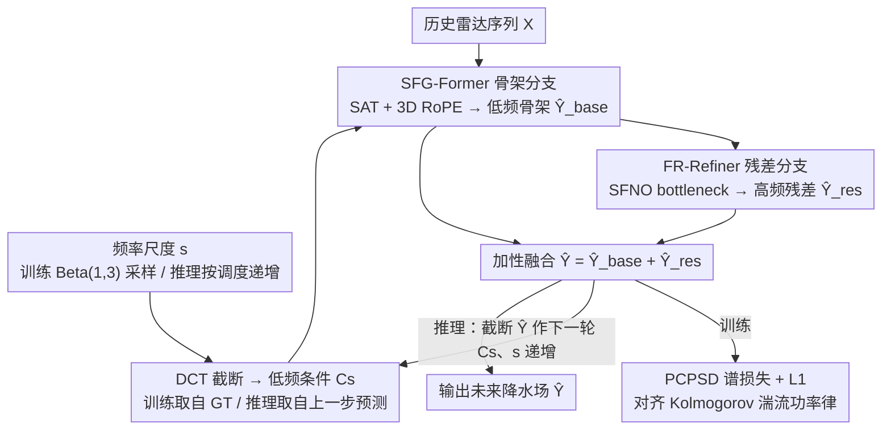

# Learning to Refine: Spectral-Decoupled Iterative Refinement Framework for Precipitation Nowcasting

**会议**: ICML 2026  
**arXiv**: [2606.02661](https://arxiv.org/abs/2606.02661)  
**代码**: https://github.com/RuntimeWarning/SDIR  
**领域**: 科学计算 / 天气预报 / 时空预测  
**关键词**: 降水临近预报, 频谱解耦, 迭代精化, Fourier 神经算子, 功率谱密度损失

## 一句话总结
SDIR 把雷达 0–2 小时降水临近预报重新表述为"频域解耦的迭代精化"过程：先用 SFG-Former 提取稳定的低频天气骨架，再用 FR-Refiner（含 Fourier 神经算子）按频段逐步合成高频对流细节，并用一条对齐 Kolmogorov 湍流功率律的 PCPSD 损失替代会导致过平滑的纯 MSE，在 CIKM / Shanghai / SEVIR 三个 benchmark 上同时显著超过回归类与扩散类 SOTA。

## 研究背景与动机
**领域现状**：降水临近预报（precipitation nowcasting）对城市内涝、航空、灾害防御都至关重要。早期是基于光流的雷达回波外推，后来 ConvLSTM、PredRNN、PhyDNet、Earthformer、SimVP 等 spatiotemporal 模型靠监督回归显著提升了精度；最近一波则是 GAN（DGMR、NowcastNet）和扩散模型（PreDiff、CasCast、DiffCast）通过生成式建模追求高频细节的视觉真实感。

**现有痛点**：两条路线各有结构性病：
- 回归类模型受 MSE 等 pixel-wise loss 的驱动，对空间不确定性"平均化"，导致功率谱在高频迅速衰减、对流核被抹平、峰值强度被压低，从而违反大气湍流的 Kolmogorov 功率律。
- 扩散类模型靠从高斯噪声采样恢复高频，看上去清晰，但生成的对流元胞往往出现在错误位置或强度被夸大，作者称之为 "unanchored hallucinations"——视觉上合理但物理上没有依据。

**核心矛盾**：现实降水演化天生是多尺度、渐进的——大尺度天气场（synoptic skeleton）作为边界条件，小尺度对流再在其上长出来。单步、单分支模型无法同时兼顾"全局稳定（不致漂移）"和"局部锐利（不致模糊）"，要么过平滑要么产生幻觉。

**本文目标**：构造一个**确定性**框架，把预报拆成频段，先稳住低频骨架，再用受物理频谱约束的迭代步骤合成高频细节，使整段功率谱都符合湍流统计。

**切入角度**：把"逐步揭示更高频段"的思想嵌进模型本身——训练时用 DCT 截断给出不同带宽的低频条件 $C_s$，让模型学会"给定低频骨架，合成下一层高频"的能力；推理时再把这种能力组合成一个 $s=0\to s=W-1$ 的迭代调度，相当于一个 deterministic、frequency-conditional 的"扩散过程"，但目标是确定的频谱深度而非随机噪声水平。

**核心 idea**：用频段而非噪声水平作为迭代变量，配合 Fourier-domain 的全局算子（SFNO）与显式监督功率谱（PCPSD）的湍流约束，实现"既不模糊也不幻觉"。

## 方法详解
SDIR 是一个 end-to-end 双分支网络：SFG-Former 输出基线骨架 $\hat Y_{base}$，FR-Refiner 输出高频残差 $\hat Y_{res}$，最终预测 $\hat Y=\hat Y_{base}+\hat Y_{res}$。所有分支都被一个频率尺度信号 $s\in\{0,1,\dots,W-1\}$ 调制，训练时随机采样 $s$，推理时按调度递增 $s$。

### 整体框架
**输入**：历史雷达回波序列 $X\in\mathbb{R}^{B\times T_{in}\times C\times H\times W}$；训练时还提供从 ground truth $Y$ 经 DCT 截断得到的低频条件 $C_s=\operatorname{IDCT}(\operatorname{Trunc}_{s\times s}(\operatorname{DCT}(Y)))$。
**输出**：未来 $T_{out}$ 帧的降水场 $\hat Y$。
**主干**：(i) 频率尺度信号 $s\sim\operatorname{Beta}(1,3)$ 决定当前训练步要学的频段深度；(ii) SFG-Former 用 Scale-Adaptive Transformer（SAT）+ 3D RoPE，融合 $X$ 与 $C_s$ 给出低频骨架 $\hat Y_{base}$；(iii) FR-Refiner 是 U-Net 形态、bottleneck 嵌入 SFNO blocks 的 Fourier 残差生成器，按 $s$ 通过 Adaptive Normalization 调制，输出 $\hat Y_{res}$；(iv) 全程被 reconstruction L1 + 动态加权 PCPSD 谱损失共同优化；(v) 推理时按 schedule $\mathcal{S}=\{s_1=0,s_2,\dots,s_K\}$ 迭代，每步用上一次预测的 DCT 截断作为下一步的 $C_s$。

### 关键设计

**1. 频谱解耦的训练课程：用 DCT 截断 $C_s$ + Beta(1,3) 采样把"频段深度"当迭代变量**

降水演化天生多尺度——大尺度天气场作边界条件，小尺度对流在其上长出来——单步单分支模型很难同时稳住全局又锐化局部。SDIR 把"逐步揭示更高频段"嵌进训练：每个 batch 采 $\sigma\sim\operatorname{Beta}(1,3),s=\lfloor W\sigma\rfloor$，对 ground truth 做 2D DCT、截掉左上 $s\times s$ 之外的系数再 IDCT 得到 ideal low-pass 条件 $C_s=\operatorname{IDCT}(\operatorname{Trunc}_{s\times s}(\operatorname{DCT}(Y)))$。$s=0$ 时 $C_s$ 是零对应"冷启动"，$s=W-1$ 时 $C_s$ 几乎等于 $Y$ 对应"最后的细节增强"；Beta(1,3) 密度偏低 $s$，迫使模型先掌握大尺度骨架再碰高频。这是"扩散式 progressive learning"在频域的确定性翻版——扩散按 noise level 切片，本文按 spatial frequency 切片，切片有明确物理含义（synoptic vs convective scale）且无需随机采样，所以预报是 deterministic 的，从根上避开扩散的 unanchored hallucinations。

**2. SFG-Former + 3D RoPE：频率自适应的全局骨架分支**

骨架分支要吃历史序列和低频条件、输出在任何 $s$ 下都稳的低频 base 预测 $\hat Y_{base}$。把 $X$ 与 $C_s$ 沿时间维拼接、patchify 投影成 $z\in\mathbb{R}^{B\times L\times D}$ 后，每个 SAT block 里的 Frequency Scale Embedder（FSE）把标量 $s$ 映成 modulation 三元组 $(\gamma,\beta,\alpha)$，对 LayerNorm 后特征做 affine 调制 $z_{mod}=(1+\gamma)\odot\operatorname{LN}(z)+\beta$，再以 gated residual $z_{out}=z+\alpha\odot\operatorname{Transformer}(z_{mod})$ 接回主干；位置编码用 3D RoPE 在空间-时间维一并保 translation invariance。Transformer 的 patch embedding 天然偏中等分辨率、单独用会丢高频，把"当前要重建的频谱深度"作为条件灌进每层，骨架分支就既能在低 $s$ 给"模糊但稳"的预测、又能在高 $s$ 给更锐版本，避免和 refiner 抢工；3D RoPE 取代绝对位置编码后，对气象场的平移和时间漂移更鲁棒。

**3. FR-Refiner + SFNO：确定性的高频残差合成分支**

骨架分支基于 patch 的 Transformer 天生丢高频，残差分支负责把这部分细节补回来——它吃 $[X\,\|\,\hat Y_{base}]$、同样被 $s$ 调制，输出高频残差 $\hat Y_{res}$，与骨架相加得到最终预测 $\hat Y=\hat Y_{base}+\hat Y_{res}$。结构用 U-Net 拓扑（PixelUnshuffle/Shuffle 做分辨率转换保细节、residual skip 融合多尺度），bottleneck 堆 8 个 SFNO block——FFT 进频域、按实部/虚部线性变换 + SoftShrink（阈值 0.01）稀疏化、再 IFFT 回空间域，在常数层数内捕捉跨尺度耦合，是 FourCastNet 风格设计在 nowcasting 上的延伸；$s$ 经 FSE 注入每个 block 的 Adaptive Normalization，让残差合成始终对齐当前要解锁的频段。整条分支全程确定性、不引入随机采样，是它区别于扩散残差路线、从根上规避 unanchored hallucination 的关键。

**4. PCPSD 损失：把 Kolmogorov 湍流功率律变成可微的频谱监督**

回归类模型过平滑的根因是 MSE 在各频段的梯度被低频主导、模型理性地选平滑解——只靠空间损失（消融里去掉 PCPSD）HSS 从 0.5882 掉到 0.5367，说明结构对了高频仍塌。PCPSD 直接监督功率谱：先用 2D Hann window 抑边缘伪影、rFFT 得 2D 功率谱、沿径向 bin 平均得 1D isotropic 谱 $S(k)$，在 log 域比较

$$\mathcal{L}_{pcpsd}=\frac{\sum_k\Omega(k,s)\big(\log S_{pred}(k)-\log S_{gt}(k)\big)^2}{\sum_k\Omega(k,s)},$$

动态权重 $\Omega(k,s)=(k+\epsilon)^\gamma\cdot\{0.2\text{ if }k\le k_s(s);\,1.0\text{ otherwise}\}$（$k_s(s)=s/W$ 为当前解锁的截止波数）给已解锁高频更强监督、给已被骨架稳住的低频弱权重。这样预测必须把能量按 GT 的频谱分布"摊"出去，既不丢能量也不乱长结构，从而对齐 Kolmogorov 湍流功率律。总目标是 $\mathcal{L}=\mathcal{L}_{base}+\mathcal{L}_{res}+\phi(s)\mathcal{L}_{pcpsd}$，$\phi(s)=\eta(s/W)^2$ 让 spectral loss 随频段深度二次增长。

### 损失函数 / 训练策略
总损失 $\mathcal{L}=\mathcal{L}_{base}+\mathcal{L}_{res}+\phi(s)\mathcal{L}_{pcpsd}$，前两项是 base 与 residual 的 L1，$\phi(s)=\eta(s/W)^2,\eta=0.01$。优化器 AdamW，初始 lr $3\times 10^{-4}$，硬件 4×RTX 4090D。SFG-Former 含 8 个 SAT block（hidden 512），FR-Refiner 的 SFNO bottleneck 含 8 个 block，输入 CIKM 标准化到 $128\times 128$（zero-pad）、Shanghai / SEVIR 到 $256\times 256$（bilinear）。推理调度采用 8 步（详见消融）。

## 实验关键数据

### 主实验
在 CIKM、Shanghai、SEVIR 三个公共数据集上对比 ConvLSTM / PredRNN / PhyDNet / SimVP / Earthformer / MIMO / DiffCast / AlphaPre。

**Table 1 — CIKM 数据集（HSS / CSI / SSIM ↑、MAE ↓ 的 AVG 列）**

| 模型 | HSS AVG | CSI AVG | SSIM | MAE |
|---|---|---|---|---|
| ConvLSTM | 0.3142 | 0.2615 | 0.4860 | 738.05 |
| PredRNN | 0.3737 | 0.3359 | 0.5157 | 784.84 |
| PhyDNet | 0.4128 | 0.3563 | 0.4306 | 694.99 |
| Earthformer | 0.4159 | 0.3544 | 0.4903 | 674.99 |
| DiffCast | 0.4071 | 0.3477 | 0.4710 | 669.01 |
| AlphaPre | 0.3633 | 0.3092 | 0.4775 | 661.40 |
| **SDIR (Ours)** | **0.4724** | **0.4043** | **0.5574** | **600.37** |

**Table 2 — Shanghai 与 SEVIR 数据集（AVG，括号内为 SEVIR）**

| 模型 | Shanghai HSS / CSI / SSIM / MAE | SEVIR HSS / CSI / SSIM / MAE |
|---|---|---|
| ConvLSTM | 0.3602 / 0.2611 / 0.7438 / 1846.2 | 0.3512 / 0.2715 / 0.6062 / 2896.9 |
| PhyDNet | 0.5203 / 0.3892 / 0.8133 / 1386.0 | 0.4172 / 0.3311 / 0.7063 / 2103.3 |
| Earthformer | 0.5015 / 0.3711 / 0.7643 / 1395.8 | 0.4066 / 0.3230 / 0.6706 / 2241.8 |
| DiffCast | 0.4920 / 0.3628 / 0.8080 / 1450.1 | 0.3972 / 0.3057 / 0.6690 / 2595.5 |
| AlphaPre | 0.4276 / 0.3145 / 0.7534 / 1445.3 | 0.4052 / 0.3193 / 0.6100 / 2463.0 |
| **SDIR (Ours)** | **0.5882 / 0.4497 / 0.8548 / 1129.1** | **0.4401 / 0.3499 / 0.7544 / 1897.9** |

相对最强 baseline：CIKM 上 HSS AVG +13.6%、CSI AVG +14.1%；三个数据集所有阈值的所有指标都拿到最佳。

### 消融实验
**Table 4 — 模块消融（Shanghai）**：S-I = SFG-Former，S-II = FR-Refiner。

| Exp | S-I | S-II | PCPSD | HSS | CSI | SSIM | MAE |
|---|---|---|---|---|---|---|---|
| (a) | ✓ | | | 0.3529 | 0.2559 | 0.8478 | 1248.8 |
| (b) | | ✓ | | 0.4614 | 0.3266 | 0.8125 | 1586.1 |
| (c) | ✓ | ✓ | | 0.5367 | 0.4057 | 0.8512 | 1138.3 |
| Ours | ✓ | ✓ | ✓ | **0.5882** | **0.4497** | **0.8548** | **1129.1** |

**Table 5–7 — 训练与推理配置消融（Shanghai）**

| 配置 | HSS | CSI | SSIM | MAE | 备注 |
|---|---|---|---|---|---|
| 只用 L1 / MAE | 0.4509 | 0.3420 | 0.8555 | 1106.4 | MAE 最低但 HSS / CSI 大降 |
| Uniform 采样 $s$ | 0.2842 | 0.2097 | 0.8458 | 1284.1 | 失去低频优先课程，崩溃 |
| 去掉 Adaptive Norm | 0.5073 | 0.3725 | 0.8102 | 1476.4 | 频段调制信号失效 |
| 推理 1 步 | 0.5584 | 0.4243 | 0.8522 | 1111.0 | 0.30s，欠精化 |
| 推理 8 步（默认） | 0.5882 | 0.4497 | 0.8548 | 1129.1 | 1.17s，最佳平衡 |
| 推理 32 步 | 0.5564 | 0.4164 | 0.8475 | 1352.6 | 4.09s，过精化产生伪影 |
| Beta(1.0, 2.5) | 0.4835 | 0.3759 | 0.8493 | 1241.5 | 低频偏置不足 |
| Beta(1.0, 3.0)（默认） | **0.5882** | **0.4497** | **0.8548** | **1129.1** | 最佳 |

### 关键发现
- PCPSD 是最关键的单一组件：去掉它 HSS 从 0.5882 掉到 0.5367、CSI 从 0.4497 掉到 0.4057，说明纯空间损失训出的 SFG+FR 仍然偏平滑，必须靠频谱监督把高频拉回来。
- 单分支不可替代：仅 SFG-Former 时 CSI 只有 0.2559（缺高频），仅 FR-Refiner 时 MAE 高达 1586.1（缺稳定骨架），两者互补刚好对应"骨架 + 残差"的物理分工。
- 采样分布与推理步数有明显甜点：Beta(1,3) > Beta(1,2.5)/(1,3.5)，8 步 > 16/32 步，反映"低频先于高频"的课程节奏既要有也不能过——过度迭代会引入伪影、SSIM/MAE 退化。
- 长 lead-time 优势更明显：在 0–30 min 内 AlphaPre / PhyDNet 与 SDIR 接近，60–120 min 段差距显著拉开，证明频谱解耦在长程预测中的误差累积控制能力。

## 亮点与洞察
- 用 DCT 截断 + Beta 采样把"扩散式 progressive learning"翻译到频域，是一次很干净的范式迁移：噪声尺度被替换成有物理意义的 spatial frequency，模型既保留了扩散的多步细化能力，又得到了 deterministic、可控、无幻觉的输出。
- PCPSD 损失把 Kolmogorov 湍流功率律变成了一个可微的、动态加权的监督信号，这给所有"高频塌陷"类任务（超分、视频生成、流体仿真）提供了一个直接可复用的模板：先做径向 PSD，再在 log 域比较，并按当前要解锁的频段动态加权。
- SFNO bottleneck 与 Fourier 数据增强是天然搭配：bottleneck 处特征维度小、做 FFT 代价低，但表达能力强，能让 U-Net 用很浅的深度获得全局感受野，这是 FourCastNet 思路在 nowcasting 场景的成功复用。
- 频率尺度调制 + 多步推理给模型带来一种"可解释的速度-质量曲线"：1 步是稳定骨架，8 步是高质量预报，32 步开始过精化，这种调度选择能直接根据下游需要（实时预警 vs. 离线分析）切换，工程上很友好。

## 局限与展望
- 推理 8 步意味着 ~4× 的延迟开销（0.30s → 1.17s），对真正实时业务系统仍可能偏慢，作者没有给出 distillation 或 single-step 蒸馏的方案。
- 频段调度 $\mathcal{S}$ 与 Beta 分布参数都是手工选的全局超参，没有按地区 / 季节 / 天气模态自适应；对极端天气（强对流、台风）单独评估缺失。
- PCPSD 假定降水场满足 isotropic 湍流统计，对各向异性强（如锋面、地形雨）的场景，径向平均会丢方向信息，可考虑改为各向异性谱距离。
- 三个 benchmark 都是雷达回波 / VIL 之类的二维场，对多模态（雷达 + 卫星 + 数值模式输出）、3D 全垂直剖面预报、多变量（风场、温度、湿度）联合预报没有覆盖；与 Pangu、GraphCast 这类全球数值替代模型也没做正面比较。
- 缺少与 NowcastNet 等 hybrid physics-conditional 模型的直接对比，"deterministic 击败 stochastic" 的论断在更多生成式基线（如 CasCast、GenCast）上的鲁棒性还待验证。

## 相关工作与启发
- **vs DiffCast (CVPR'24)**：DiffCast 用 deterministic backbone + diffusion residual 处理随机残差，依然有 hallucination；SDIR 把残差路径替换成 deterministic 的频段-条件 Fourier refiner，并加 PCPSD 显式约束频谱，是"用更强的物理先验代替随机性"的同方向更进一步。
- **vs PreDiff / CasCast**：纯 latent diffusion 路线靠多步采样换真实感，但既慢又会幻觉；SDIR 推理 8 步即可，并且因为目标是 deterministic 的频段，每步都有明确监督。
- **vs Earthformer**：Earthformer 的 cuboid attention 在大尺度上很强但仍是单分支单步预测，没专门处理高频塌陷；SDIR 把它的"全局结构"能力收编到 SFG-Former 里，再用 FR-Refiner + PCPSD 把缺失的高频补齐。
- **vs NowcastNet**：NowcastNet 用 physics-conditional GAN 显式建模 evolution；SDIR 不用 GAN，避免了对抗训练的不稳定性，用频谱约束达到了等价的"物理一致 + 视觉锐利"目标，是 GAN-free 的替代方案。
- **vs FourCastNet / SFNO 全球预报**：FourCastNet 把 SFNO 用于全球中期预报，本文在更短 lead-time、更高分辨率的 nowcasting 上验证了 SFNO bottleneck 的有效性，并加上了显式频谱损失这一缺失环节。

## 评分
- 新颖性: ⭐⭐⭐⭐ 频段解耦 + Fourier refiner + PCPSD 的组合是新的，单个组件大多有先例（DCT / SFNO / PSD loss），合在一起对 nowcasting 痛点定位很准。
- 实验充分度: ⭐⭐⭐⭐ 三个公开数据集 × 八个 SOTA × 全阈值 + 四张消融表，覆盖面相当完整。
- 写作质量: ⭐⭐⭐⭐ 物理动机（湍流能量级联）讲得清楚，方法结构图与算法伪代码对应整齐。
- 价值: ⭐⭐⭐⭐ 给 nowcasting 这个有强业务需求的领域提供了一条 deterministic + 物理一致 + 高分辨率的可部署路线。

<!-- RELATED:START -->

## 相关论文

- [\[ICML 2026\] Iterative Refinement Neural Operators are Learned Fixed-Point Solvers: A Principled Approach to Spectral Bias Mitigation](iterative_refinement_neural_operators_are_learned_fixed-point_solvers_a_principl.md)
- [\[ICLR 2026\] DRIFT-Net: A Spectral--Coupled Neural Operator for PDEs Learning](../../ICLR2026/physics/drift-net_a_spectral--coupled_neural_operator_for_pdes_learning.md)
- [\[ICML 2026\] Topology-Preserving Neural Operator Learning via Hodge Decomposition](topology-preserving_neural_operator_learning_via_hodge_decomposition.md)
- [\[ICML 2026\] Hermite-NGP: Gradient-Augmented Hash Encoding for Learning PDEs](hermite-ngp_gradient-augmented_hash_encoding_for_learning_pdes.md)
- [\[AAAI 2026\] Knowledge-Guided Masked Autoencoder with Linear Spectral Mixing and Spectral-Angle-Aware Reconstruction](../../AAAI2026/physics/knowledge-guided_masked_autoencoder_with_linear_spectral_mixing_and_spectral-ang.md)

<!-- RELATED:END -->
