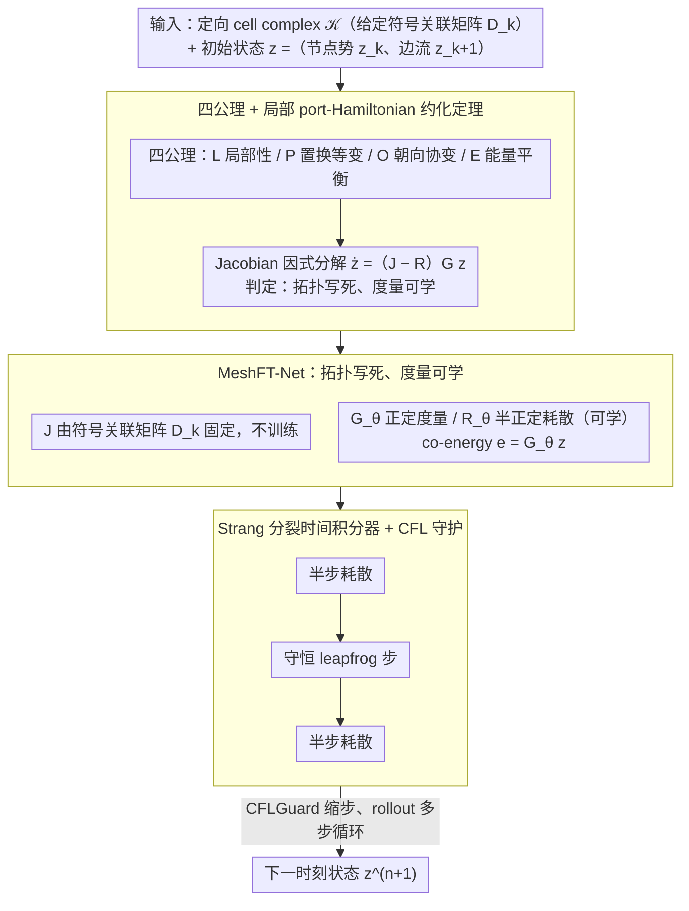

# Mesh Field Theory: Port–Hamiltonian Formulation of Mesh-Based Physics

**会议**: ICML 2026  
**arXiv**: [2605.00394](https://arxiv.org/abs/2605.00394)  
**代码**: 无  
**领域**: 3D 物理仿真 / 结构保持神经网络 / 网格学习  
**关键词**: 网格物理, port-Hamiltonian, 拓扑–度量分离, 能量守恒, MeshGraphNet

## 一句话总结
从「局部性 + 置换等变 + 朝向协变 + 能量守恒/耗散不等式」四条物理原理出发，证明任何满足这些公理的网格物理动力学在雅可比层面都可以局部约化为 port-Hamiltonian 形式——其中守恒互联结构 $J$ 完全由网格拓扑（符号关联矩阵 $D_k$）固定，度量与耗散通过可学的 $G, R$ 进入；据此设计的 MeshFT-Net 在长时间 rollout 上能量漂移近零、色散与动量正确，并大幅领先 MGN / HNN。

## 研究背景与动机

**领域现状**：用 GNN / message passing 学网格物理（流体、弹性体、声学）这条路（如 MeshGraphNets, SPH-Net, FNO）发展迅速；另一条路是显式结构保持网络（HNN, LNN, port-Hamiltonian NN, GENERIC），把能量 / 辛结构硬编码进架构。

**现有痛点**：纯 MGN 类方法长时间 rollout 会能量漂移、出现非物理模态；HNN / 全局 port-Hamiltonian NN 要求人为选定一个全局 Hamiltonian / 模板，对模型设定错时鲁棒性差；两条路都没有清楚说明「网格物理里到底哪些自由度是非物理的、应该被结构消掉」。

**核心矛盾**：在外微分几何里，外导数 $d$ 是拓扑的（与度量无关），而几何 / 材料性质只通过 Hodge $\star$ 等度量算子进入；可惜现有 learned simulator 把两者搅在了一起，让度量学习污染了拓扑结构，反过来又让拓扑误差放大度量误差。

**本文目标**：(1) 给出一组干净的物理原理；(2) 形式化证明这些原理在 Jacobian 层面把动力学逼成 port-Hamiltonian 形式；(3) 据此设计一个把「拓扑写死、只学度量」的网络，并验证长时间稳定性、色散、动量、OOD 泛化。

**切入角度**：把 MeshGraphNet 视为「已经满足局部性 (L) 和置换等变 (P) 但还差朝向协变 (O) 与能量平衡 (E)」的一个超集——只要把 O 和 E 强加上去，多余的非物理自由度就被结构性消掉，剩下的恰好就是经典 DEC（Discrete Exterior Calculus）的拓扑骨架 + 局部度量算子。

**核心 idea**：「物理原理 ⇒ Jacobian 因式分解 ⇒ 拓扑写死、度量可学」——拓扑由 $D_k$（带符号关联矩阵）固定，可学的只有正定度量 $G_\theta$ 与半正定耗散 $R_\theta$。

## 方法详解

### 整体框架
输入是一个固定的有向 cell complex $\mathcal{K}$ 和初始状态 $z^0 = (z_k^0, z_{k+1}^0)$（cochain 自由度，例如节点势 + 边流）。输出是下一时刻状态 $z^{n+1}$。整条 pipeline：(1) 用 reduction theorem 把动力学限定为 $\dot z = (J - R(z)) G(z) z$ 的 port-Hamiltonian 形式；(2) $J = \begin{pmatrix} 0 & -D_k^\top \\ D_k & 0 \end{pmatrix}$ 完全由网格关联矩阵决定，不训练；(3) 用 Strang 分裂积分器交替做「半步耗散 + 守恒步 + 半步耗散」，所有运算都是稀疏 matvec，复杂度 $O(N)$。

下图把这条「定理定结构 → 架构落结构 → 积分器推进」的链路画出来，三个分组分别对应下面的三个关键设计：

### 关键设计

**1. 四公理 + 局部 port-Hamiltonian 约化定理：先证"哪些必须固定、哪些能学"，再谈架构**

和"直接 posit 一个 port-Hamiltonian 模板"不同，本文不预设全局 Hamiltonian，而是从公理出发推导结构。四条公理是 (L) 局部性、(P) 置换等变、(O) 朝向协变（沿 cell 反向只翻 oriented 变量符号、标量 $H$、$e^\top\dot z$ 不变）、(E) 能量平衡（动力学拆成守恒部分 $F_\text{con}$ 满足 $e^\top F_\text{con}=0$、耗散部分 $F_\text{diss}$ 满足 $e^\top F_\text{diss}\le0$）。在此之上证明：任何满足公理的 $F$ 在 Jacobian 层面都能写成

$$\frac{\partial F}{\partial z}=(J(z)-R(z))G(z),$$

守恒部分的 Jacobian 必为反对称、耗散部分必为半负定，且守恒互联的非对角块只能取 signed-incidence 结构 $J_{k,k+1}=-D_k^\top C_k(z)$、$J_{k+1,k}=C_k(z)D_k$。这把"拓扑与度量的分工"写成结构定理而非工程经验——它直接回答了痛点里"网格物理哪些自由度是非物理的、该被结构消掉"。

**2. MeshFT-Net：拓扑写死、度量可学**

定理告诉我们拓扑由网格给定、不该被数据学，于是架构把守恒互联结构 $J=\begin{pmatrix}0&-D_k^\top\\D_k&0\end{pmatrix}$ 直接写死，可学权重只留正定度量 $G_\theta$ 和半正定耗散 $R_\theta$。能量取二次型 $H_\theta(z)=\tfrac12 z^\top G_\theta z$、co-energy $e=G_\theta z$；$G_\theta$ 用 softplus 对角或小型 Cholesky 块实现，可被局部几何/材料特征经 permutation-equivariant + orientation-even 的 MLP 条件化；$R_\theta(z)$ 取 Rayleigh 形式 $z\mapsto\gamma(\cdot)G_\theta^{-1}z$ 以保证 PSD。这样把拓扑从训练集移到网格本身、把度量/材料/耗散交给网络，结果是即便数据有限、即便分布外，拓扑结构也不会崩——这正是它在 OOD 频率/波速/分辨率上稳的根因。

**3. Strang 分裂时间积分器 + CFL 守护：一层 update 内同时保辛性和精确耗散**

常规 Euler 在能量层面无法精确守恒。算法用 Strang 分裂的 KDK 模式：先半步耗散 $\exp(-\tfrac{\Delta t}{2}RG)z$，再用对称 leapfrog 推进守恒部分（$z_k\leftarrow z_k-\tfrac{\Delta t}{2}D_k^\top G_{k+1}z_{k+1}$ → $z_{k+1}\leftarrow z_{k+1}+\Delta t D_k G_k z_k^\text{half}$ → 再半步守恒），最后再做半步耗散；`CFLGuard(Δt)` 按局部最大特征值缩步防爆炸。分裂让守恒和耗散两个子流互不干扰，配合精确反对称的 $J$，就能给出可解析证明的 $\dot H=-e^\top R(z)e\le0$——能量漂移近零不是训练凑出来的，而是积分器结构保证的。

### 损失函数 / 训练策略
监督一步预测：$\sum_k \text{Loss}(\hat z_k^{n+1}, z_k^{n+1})$，不使用 PDE residual 项；inductive bias 完全来自固定的 $J$ 和 SPD / PSD 结构。可堆叠多步并只对最终输出监督，以适应 rollout 任务。

## 实验关键数据

### 主实验
在解析平面波（规则网格 + Delaunay）、Rayleigh 阻尼振荡、来自 The Well 的声学散射、以及 OOD 频率 / 波速 / 分辨率四类设置上对比 MGN / MGN-HP / HNN / PI-MGN / FNO / GraphCON。

| 任务 | 模型 | One-step MSE | TSMSE (rollout) | 能量漂移 |
|------|------|--------------|-----------------|----------|
| 解析平面波（规则网格） | MGN | $1.6{\times}10^{-7}$ | $1.3{\times}10^{-1}$ | $25.9$ |
| 解析平面波 | HNN | $3.5{\times}10^{-8}$ | $3.0{\times}10^{-3}$ | $1.0{\times}10^{-2}$ |
| 解析平面波 | **MeshFT-Net** | $\mathbf{1.3{\times}10^{-9}}$ | $\mathbf{9.6{\times}10^{-5}}$ | $\mathbf{1.3{\times}10^{-4}}$ |
| Rayleigh 阻尼 | MGN | $5.2{\times}10^{-8}$ | $1.7{\times}10^{-1}$ | NEE $2.2$ |
| Rayleigh 阻尼 | **MeshFT-Net** | $1.2{\times}10^{-7}$ | $\mathbf{2.1{\times}10^{-2}}$ | NEE $\mathbf{2.1{\times}10^{-2}}$ |

### 消融实验

| 配置 | TSMSE | 能量漂移 |
|------|-------|----------|
| 固定 $J$ + 对角 $G$ | $4.52{\times}10^{-5}$ | $0.115$ |
| 固定 $J$ + 全 $G$ | $3.28{\times}10^{-5}$ | $0.028$ |
| $z$-依赖 $J$ + 对角 $G$ | $\mathbf{6.77{\times}10^{-6}}$ | $0.025$ |
| $z$-依赖 $J$ + 全 $G$ | $6.17{\times}10^{-6}$ | $0.030$ |

物理一致性诊断（Table 3a 摘录）显示 MeshFT-Net 在波速误差、规范关系、PDE 残差短/长程、动能-势能均分、动量守恒五项里全部第一，动量误差低至 $4.9{\times}10^{-8}$（MGN 为 $0.39$，HNN 为 $1.07$）。

### 关键发现
- 一步 MSE 与长程 rollout 表现没有强相关性：MGN 在阻尼任务里反而拿到最低的 one-step MSE，但 rollout TSMSE 比 MeshFT-Net 高近 10 倍，说明短期局部精度无法暗示长期物理保真。
- 动量守恒不是显式约束，但 MeshFT-Net 因为强制了朝向协变 (O)，自然继承了 action-reaction 关系；未强制 (O) 的方法都有量级以上的动量漂移。
- OOD 上 MGN / FNO / PI-MGN 在分辨率或波速漂移时直接 diverge（$>100$），而 MeshFT-Net 在三种 OOD shift 下能量漂移仍 $<\mathcal{O}(10^{-1})$；说明拓扑写死的 inductive bias 真的给了泛化能力。
- 非线性 shallow-water 玩具实验说明：当系数确实依赖状态时，把 $J$ 改成 state-dependent 提升明显；但「不可学的拓扑写死 + 全 $G$」也能在一定程度上代偿，给出了模型容量与结构的 trade-off。

## 亮点与洞察
- 「定理驱动的架构设计」是这篇文章最大的方法学贡献：先证明在某组公理下解空间被结构性约束到 port-Hamiltonian，再把约束当作 hard architecture，而不是从一个全局 Hamiltonian 模板倒推。
- 「拓扑–度量分离」这件事抽象但非常实用：拓扑（关联矩阵 $D_k$）属于网格、永不学；度量（$G, R$）属于物理、可学。这等于在 GNN 里手动注入了一层「物理上不该泛化的东西」，把可学的部分留给真正与材料 / 几何相关的属性。
- 对 MGN 系列的解读非常清晰——MGN 不是错，而是公理太宽；只要补上 (O) 和 (E)，整个动力学的状态空间就被瘦身到物理上合理的子集，这一观察为后续 mesh-based simulator 的设计提供了清晰的「能量 + 朝向」补丁路线。

## 局限与展望
- 主体实验用了 state-independent $G_\theta$（quadratic storage），强非线性 PDE（如 Navier-Stokes、塑性、相变）需要 $G_\theta(z)$ / $\Psi_\theta(e)$ 的 nonlinear constitutive，本文只在 supplementary 玩具实验里探索。
- 公理 (O) 与 (E) 是充分条件，并不保证模型在外界源、边界条件、多物理耦合下行为完全正确；论文也明确说外加源项需要进一步扩展。
- 整个框架依赖 cell complex 的关联结构 $D_k$，对完全 unstructured / 时变拓扑（如可破裂材料、自适应网格）适配并不直接。
- 与 FNO / GraphCON 在某些 OOD shift 上的对比里 MeshFT-Net 也只是好「相对地」，绝对 TSMSE 仍非零，说明拓扑约束不能完全替代足够丰富的数据。

## 相关工作与启发
- **vs MGN**：MGN 只满足 (L) + (P)，本文额外强制 (O) + (E)，结构上消掉非物理自由度，长程稳定性提升数个数量级。
- **vs HNN / port-Hamiltonian NN（Desai 等）**：那些方法在「全局 Hamiltonian 模板」上学，要求模板正确；本文是「局部 Jacobian 因式分解」，对模板错误更鲁棒。
- **vs DEC / data-driven exterior calculus（Trask 等）**：两者都共享拓扑–度量分离思想；本文从物理公理推导而非从微分几何模板出发，结果更通用。
- **vs PI-MGN / FNO**：PDE residual / 算子学习是数据驱动 + 弱物理；本文是结构驱动，不需要知道 PDE 形式，泛化更稳。

## 评分
- 新颖性: ⭐⭐⭐⭐ 把外微分几何的拓扑–度量分离严格地变成 GNN 架构设计原则，理论与实现一一对应。
- 实验充分度: ⭐⭐⭐⭐ 解析 + 真实数据 + 物理诊断 + OOD + 非线性消融，覆盖面够广。
- 写作质量: ⭐⭐⭐⭐ 定理表述清晰、Algorithm 1 即可复现，几乎不需要附录补充。
- 价值: ⭐⭐⭐⭐ 为 learned simulator 社区提供了一个可被定理驱动的设计范式，未来许多结构保持网络都可以照搬「公理 ⇒ Jacobian 约束 ⇒ 拓扑写死」流程。

<!-- RELATED:START -->

## 相关论文

- [\[ICML 2026\] Understanding Catastrophic Forgetting In LoRA via Mean-Field Attention Dynamics](understanding_catastrophic_forgetting_in_lora_via_mean-field_attention_dynamics.md)
- [\[NeurIPS 2025\] High-order Equivariant Flow Matching for Density Functional Theory Hamiltonian Prediction](../../NeurIPS2025/physics/high-order_equivariant_flow_matching_for_density_functional_theory_hamiltonian_p.md)
- [\[NeurIPS 2025\] Hamiltonian Neural PDE Solvers through Functional Approximation](../../NeurIPS2025/physics/hamiltonian_neural_pde_solvers_through_functional_approximation.md)
- [\[CVPR 2026\] PhysSkin: Real-Time and Generalizable Physics-Based Skin Simulation](../../CVPR2026/physics/physskin_real-time_and_generalizable_physics-based_animation_via_self-supervised.md)
- [\[ICLR 2026\] Astral: Training Physics-Informed Neural Networks with Error Majorants](../../ICLR2026/physics/astral_training_physics-informed_neural_networks_with_error_majorants.md)

<!-- RELATED:END -->
