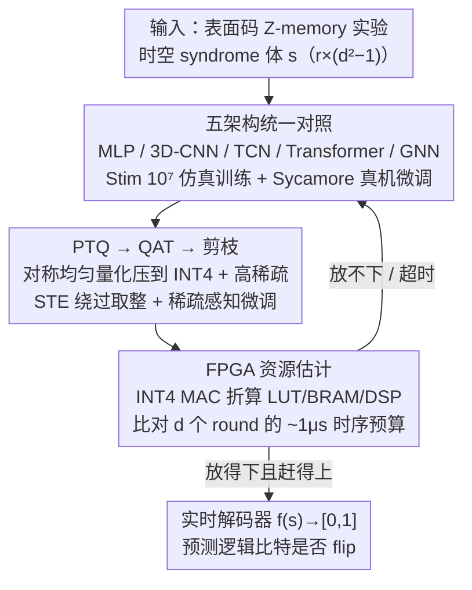

# Rethink the Role of Neural Decoders in Quantum Error Correction

**会议**: ICML 2026  
**arXiv**: [2605.12046](https://arxiv.org/abs/2605.12046)  
**代码**: 暂未公开  
**领域**: 量子纠错 / 神经压缩与硬件部署  
**关键词**: 表面码、神经解码器、FPGA、INT4 量化、归纳偏置

## 一句话总结
本文在 $d\le9$ 的表面码上系统重做 MLP/3D-CNN/TCN/Transformer/GNN 五类神经解码器，并把"量化 + 剪枝 + FPGA 资源建模"作为一等公民放进训练流程，结论是：近期解码性能由数据量而非架构复杂度主导，且 INT4 + QAT 是实现微秒级实时解码的必要前提。

## 研究背景与动机
**领域现状**：量子纠错（QEC）中表面码（surface code）+ 实时解码已被认为是迈向容错量子计算的关键算法原语；传统方法 MWPM 和 BP 在精度/速度上各占一极，最近神经解码器（AlphaQubit、TCN、GNN-BP 等）以"高精度"作为卖点不断被发表。

**现有痛点**：现有神经解码器普遍只比较 logical error rate，几乎不讨论微秒级延迟、FPGA 资源占用、低位宽量化等真实部署约束；同时报告的提升究竟来自架构创新还是更大的训练集，从未被对齐变量地系统对照。

**核心矛盾**：QEC 解码在物理上必须同时满足两件矛盾的事——精度要高到能够"指数压制"逻辑错误，又要在 $\sim 1\mu s$ 内完成以跟上超导量子比特的相干时间窗口；以往工作只优化一端，导致论文里的 SOTA 在硬件上根本跑不起来。

**本文目标**：把精度与延迟视为同一个目标的两面，回答两个具体问题——Q1：性能增益是来自架构还是数据；Q2：怎样让神经解码器在 FPGA 上真正按时完成推理。

**切入角度**：以"表面码 + Z-memory 实验 + 二分类目标"为统一基准，对五大代表性架构做去工程化重实现，并配上端到端的剪枝 + PTQ/QAT 压缩流水线和 FPGA 资源建模，强行让所有方法都接受"精度+延迟"双重审视。

**核心 idea**：用"数据优先 + 适度归纳偏置 + INT4 QAT"代替"堆架构 + 后处理压缩"，证明 $\sim 10^5$ 参数级的小模型已经能在 $d\le9$ 上接近性能饱和并满足 FPGA 实时约束。

## 方法详解

### 整体框架
全文围绕一个统一的二分类任务展开：把表面码 Z-memory 实验产生的 $r\times(d^2-1)$ 时空 syndrome 体 $s$ 喂给网络 $f(s;\theta)\in[0,1]$，预测这一段记忆实验结束后逻辑比特是否发生了 flip。在这个固定接口下，论文做三件事——先在 Stim 仿真的大规模数据集上把五种归纳偏置不同的架构（MLP / dilated 3D-CNN / TCN / Transformer / GNN）放在同一基准下重训并用 Sycamore 真机数据微调，回答"增益来自架构还是数据"；再把每个网络一路压到 INT4 + 高稀疏，看精度能否守住；最后把压缩后的网络折算成 FPGA 资源占用与延迟，判断它到底能不能在 $1\mu s$ 窗口内跑完。三步层层收紧约束，把"精度"和"实时性"逼到同一张桌子上谈。

### 关键设计

**1. 五架构统一对照：把"偏置 vs 数据"彻底解耦**

前面提到，以往论文报告的提升从未在对齐变量的条件下区分清楚"是架构更聪明还是训练集更大"。本文的做法是让五种代表性归纳偏置在完全相同的数据集、batching 和 ground truth 下同台竞争：MLP 直接把 $s$ 拉平，充当零偏置基线；3D-CNN 用 $3\times3\times3$ 扩张卷积保留时空分辨率、不做 pooling 以免破坏错误定位；TCN 把空间交给 2D conv、时间交给 1D conv，避免 RNN 在低位宽下饱和；Transformer 用卷积式 tokenizer 加位置编码替代对二值 syndrome 的直接线性投影，缓解稀疏输入下的嵌入退化；GNN 则在 Tanner 图上做可学习消息传递，相当于"神经版 BP"，用来缓解 surface code 短环导致的置信传播振荡。因为唯一的变量就是网络本身，任何性能差异都能干净地归因到偏置或数据上，这正是回答 Q1 的关键。

**2. PTQ → QAT → 剪枝：把网络压进 FPGA 的 LUT 而非稀缺的 DSP**

精度再高的解码器，若塞不进微秒窗口也是空谈，所以压缩不是事后步骤而是设计的一部分。三者采用对称均匀量化 $x_{int} = \mathrm{clamp}(\lfloor x/\eta\rceil,\, -2^{b-1},\, 2^{b-1}-1)\cdot\eta$，权重按 per-channel、激活按 per-tensor 量化。流程上先用 PTQ 当可行性探针，但 INT4 下几乎所有模型都出现精度"悬崖"式崩塌；于是切到 QAT，靠 straight-through estimator 让 FP32 latent 权重在反传时绕过不可导的取整，学到对量化噪声鲁棒的极小值；最后在已量化网络上按整数幅度施加阈值 $\tau_k$ 的二值 mask 做非结构化剪枝，再做稀疏感知微调。之所以死磕 INT4 + 稀疏，是因为 FPGA 上 DSP 极少而 LUT 极多——INT4 让乘法可以下沉到 LUT 实现，静态零权重又能被综合工具直接 trim 掉，这套"训练阶段就感知硬件"的组合才是把网络压进时序预算的真正杠杆。

**3. FPGA 资源估计：让"压不进去"在选型阶段就被否决**

以往"训练完再压缩"常常事后才发现资源不够。本文把"能否在目标 FPGA 上按时跑完一次推理"变成一个可计算的指标，反过来约束架构、位宽和稀疏度的选择：把网络拆成 INT4 MAC 总数，按 LUT-bound 的部署策略折算每个 PE 的 LUT 消耗，再叠加 BRAM（权重缓存）与少量 DSP（高精度激活），与目标芯片的可用资源对齐；同时按时钟频率推算单次推理的 wall-clock 延迟，跟 $d$ 个 round 的 $\sim 1\mu s$ 物理预算逐一比对。资源估计因此从"事后体检"变成训练期的反馈环，任何放不下或赶不上时序的方案在模型选型阶段就被剔除，这也是 Q2 的落点。

### 损失函数 / 训练策略
训练目标是标准二元交叉熵 $\mathcal{L} = -\mathbb{E}_{(s,y)}[y\log f(s) + (1-y)\log(1-f(s))]$。Stim 仿真提供高达 $10^7$ 样本的大规模训练集，Sycamore 真机数据用于 $d=3,5$ 的微调；INT4 QAT 用 Brevitas 实现，并以训练好的 FP32 参数初始化以加速收敛。

## 实验关键数据

### 主实验

| 设定 | 架构 / 配置 | 关键结果 |
|------|------------|----------|
| $d=9$ surface code，Stim $10^7$ 样本 | 简单 CNN/TCN | 解码精度接近饱和，明显优于在标准数据集上训练的复杂架构 |
| MLP | 任意规模 | 即便加大参数也无法 scale，证明零归纳偏置不可行 |
| GNN-BP | $d\le9$ | 受短环影响明显，整体落后 CNN/TCN |
| INT4 PTQ | 多数模型 | 出现"悬崖"，逻辑错误率剧增 |
| INT4 QAT | 同上 | 基本恢复 FP32 水平，是达到 1μs 延迟的必要条件 |

### 消融实验

| 配置 | 效果 |
|------|------|
| 大数据 + 简单 CNN | 优于"小数据 + 复杂架构" |
| 局部卷积 + 时序聚合（CNN+TCN） | 在所有规模上最稳健 |
| Transformer w/o 卷积 tokenizer | 嵌入退化，精度下降明显 |
| GNN（神经 BP） | 解决 BP 振荡，但仍受图拓扑限制 |
| 仅剪枝不量化 | 无法把推理推到 LUT-bound 区间，延迟不达标 |

### 关键发现
- "增数据"比"换架构"对 $d\le9$ 表面码的解码增益更大，这一结论以前没有被系统量化过，意味着工业 QEC 投入应更多花在仿真/真机数据生成而非模型创新。
- 归纳偏置不可缺：纯 MLP 不 scale，GNN-BP 受短环困扰；只有 CNN/TCN 类"局部 + 时序"组合稳定占优。
- INT4 是硬约束而非性能优化：只有 QAT 能撑住 INT4，PTQ 几乎一定失败；微秒级实时解码必须在训练阶段就感知硬件。

## 亮点与洞察
- 把"FPGA 资源"作为损失外的一类硬约束写进 pipeline，使得"看似 SOTA"的复杂解码器在工程层面被立刻否决——这种"协同设计"思路在其他 latency-critical 领域（自动驾驶感知、网络包处理 NN）同样适用。
- 五架构统一重实现的对照实验给出了一份"未来 QEC 神经解码器"的设计 checklist：偏置必须含局部 + 时序，参数量 $\sim 10^5$ 即够用，INT4 是底线。
- 数据驱动的发现（简单网络 + 大数据 > 复杂网络 + 标准数据）对 ML4Science 中的"过度工程化倾向"是一个有力提醒。

## 局限与展望
- 评估止于 $d=9$（161 物理比特），更高码距下的归纳偏置选择和延迟可行性尚未被刻画；
- FPGA 资源估计基于线性 MAC 拆分，未深入到 routing/place 后的真实功耗，与生产部署仍有距离；
- 没有给出 INT4 训练相对于 FP32 的精度差的下界理论，留下了"为什么 INT4 够用"的开放问题。

## 相关工作与启发
- **vs AlphaQubit 系列**：本文是其工程化、可部署版的"压力测试"，把 transformer 块塞进 INT4 LUT-bound 设定下做对照。
- **vs MWPM/BP**：传统解码器仍在"通用 + 启发式"端，本文显示神经解码器在加足数据后能稳定超越，但只有压缩后才有实时可行性。
- **vs 通用模型压缩工作（Gholami 等）**：本文不是新压缩算法，而是把已有 PTQ/QAT/剪枝按硬件约束严格组合并验证在 QEC 场景下的边界，对压缩 + 硬件协同设计提供了模板。

## 评分
- 新颖性: ⭐⭐⭐ 主要贡献是系统化对照与硬件感知 pipeline，而非全新算法
- 实验充分度: ⭐⭐⭐⭐⭐ 五架构 × 多 $d$ × 仿真+真机 + 完整 FPGA 资源建模，工作量极大
- 写作质量: ⭐⭐⭐⭐ 两个核心问题 Q1/Q2 贯穿全文，论证清晰
- 价值: ⭐⭐⭐⭐ 给"AI for QEC"落地提供了少有的实测基线，对硬件团队选型直接可用

<!-- RELATED:START -->

## 相关论文

- [\[ICML 2025\] Rethink the Role of Deep Learning towards Large-scale Quantum Systems](../../ICML2025/physics/rethink_the_role_of_deep_learning_towards_large-scale_quantum_systems.md)
- [\[ICML 2026\] Score-Based Error Correcting Code Decoder](score_based_error_correcting_code_decoder.md)
- [\[ICML 2026\] Quiver: Quantum-Informed Views for Enhanced Representations in Large ML Models](quiver_quantum-informed_views_for_enhanced_representations_in_large_ml_models.md)
- [\[ICLR 2026\] Astral: Training Physics-Informed Neural Networks with Error Majorants](../../ICLR2026/physics/astral_training_physics-informed_neural_networks_with_error_majorants.md)
- [\[ICML 2026\] ANTIC: Adaptive Neural Temporal In-situ Compressor](antic_adaptive_neural_temporal_in-situ_compressor.md)

<!-- RELATED:END -->
