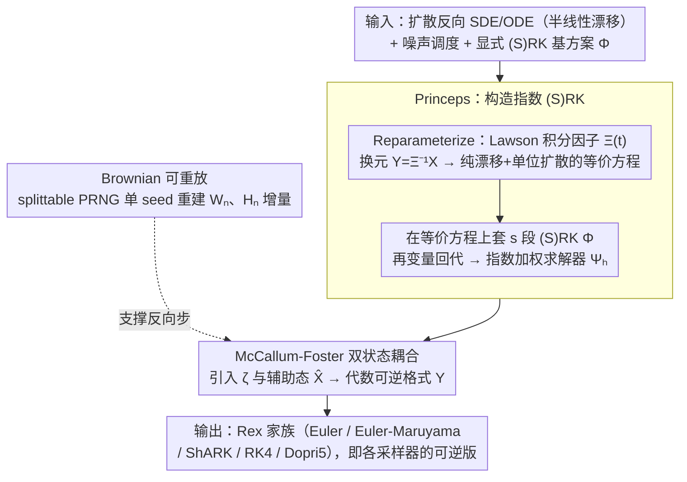

# REX: A Family of Reversible Exponential Stochastic Runge-Kutta Solvers

**会议**: ICML 2026 Oral  
**arXiv**: [2502.08834](https://arxiv.org/abs/2502.08834)  
**代码**: https://github.com/zblasingame/Rex-solver  
**领域**: 科学计算 / 数值方法 / 扩散模型采样  
**关键词**: 可逆求解器, 指数积分器, 随机 Runge-Kutta, 扩散模型反演, Boltzmann 采样

## 一句话总结
本文提出 Rex —— 一族基于 Lawson 指数积分器构造的、可代数反演的（随机）Runge-Kutta 求解器，把任意显式 (S)RK 格式自动转成可精确反演的 ODE/SDE 求解器，既保证任意高阶收敛与非零稳定域，又能在扩散模型的图像重建/编辑、流模型的 Boltzmann 采样上做到接近机器精度的反演。

## 研究背景与动机
**领域现状**：基于神经微分方程的扩散模型/连续归一化流已成为生成任务的 SOTA，前向积分（噪声 → 数据）用 DDIM、DPM-Solver、SEEDS-1 等高阶 (S)RK 类格式；许多关键应用——通过生成模型做梯度下降微调、真实图像编辑、可微奖励、Boltzmann 分布精确似然——要求**反向积分（数据 → 噪声）也严格精确**。

**现有痛点**：标准显式求解器在前向-反向往返中累计离散误差 $\varepsilon>0$，落点会偏离原始轨迹。已有的"精确反演"方法（EDICT、BDIA、BELM/O-BELM 等）问题很多：稳定性差（BDIA 在编辑任务上 LPIPS 飙到 0.885）、阶数低、且**几乎只能处理 ODE**，扩散 SDE 的可逆方案除了把整条 Brownian motion 全部存内存这种"伪可逆"以外几乎是空白。

**核心矛盾**：可代数反演（算子级别等式）和"高阶 + 非零线性稳定域 + 自适应步长 + 支持 SDE"这四个性质难以兼得。McCallum-Foster (MF) 方法首次实现了 ODE 上"可逆 + 非零稳定域"，但只解 ODE，且没考虑扩散模型那种 $f(t)\bm{x} + g(t)\bm{f}_\theta$ 的半线性结构。

**本文目标**：(1) 把 MF 的可逆性扩展到扩散 SDE；(2) 充分利用半线性结构构造指数积分器从而显著提升精度；(3) 在保留任意阶收敛和非零稳定域的同时支持自适应步长。

**切入角度**：扩散 ODE/SDE 的漂移项天然是 $a(t)\bm{x}+b(t)\bm{f}_\theta$ 的半线性形式，可以用 Lawson 方法做积分因子 $\Xi(t)=\exp\int_0^t a(\tau)d\tau$ 变换，把状态变量换到 $\bm{Y}=\Xi^{-1}\bm{X}$，得到一个**纯漂移 + 单位扩散**的等价 SDE，再在这个"漂亮"的方程上套显式 (S)RK 和 MF 包装，最后变量回代——这个三步配方就是 Rex。

**核心 idea**：用 Lawson 指数积分器吃掉半线性部分，再用 McCallum-Foster 包装显式 (S)RK，构造出一族同时可逆、高阶、有稳定域、能跑 SDE 的扩散求解器。

## 方法详解
Rex 是一个**配方**而非单一格式：给一个显式 (S)RK 方案 $\bm{\Phi}$，按三步配出 Rex，记为 $\bm{\Upsilon}$。

### 整体框架
- **输入**：扩散反向 SDE $d\bm{X}_t=[f(t)\bm{X}_t-g^2(t)\nabla\log p_t(\bm{X}_t)]dt+g(t)d\bar{\bm{W}}_t$（ODE 类似），噪声调度 $(\alpha_t,\sigma_t)$，显式 (S)RK 基方案 $\bm{\Phi}$ 的扩展 Butcher 表。
- **三步配方**：
  1. **Reparameterize**：写成 $d\bm{X}_t=[a(t)\bm{X}_t+b(t)\bm{f}_\theta]dt+g(t)d\bar{\bm{W}}_t$，用积分因子 $\Xi(t)=\exp\int_0^t a(\tau)d\tau$ + 时间变换 $\varsigma_t=\int\Xi^{-1}(t)b(t)dt$ 化为 $d\bm{Y}_\varsigma=\bm{f}_\theta(\varsigma,\Xi(\varsigma)\bm{Y}_\varsigma)d\varsigma+d\bm{W}_\varsigma$（命题 3.1）。
  2. **Princeps**：在新方程上套显式 (S)RK $\bm{\Phi}$，再变量回代到原始 $\bm{X}$ 上，得到指数加权的求解器 $\bm{\Psi}_h$（式 11）。Princeps 已经能囊括 DDIM、DPM-Solver-1/2/12、DPM-Solver++、SDE-DPM-Solver、SEEDS-1、gDDIM（定理 3.3）。
  3. **Rex**：在 $\bm{\Psi}_h$ 外套 McCallum-Foster 双状态耦合，得到可逆格式 $\bm{\Upsilon}$（命题 3.2）。
- **输出**：一族求解器 Rex (Euler)、Rex (Euler-Maruyama)、Rex (ShARK)、Rex (RK4)、Rex (Dopri5) 等，自动是 DDIM、DPM-Solver 等的"可逆版本"。

### 关键设计

**1. Princeps：把任意显式 (S)RK 和扩散方程的半线性结构融成"指数 (S)RK"**

扩散反向 SDE 的漂移天然是 $a(t)\bm{x}+b(t)\bm{f}_\theta$ 的半线性形式，直接拿显式 (S)RK 去积分会浪费这个结构、精度上不去。Princeps 先用 Lawson 积分因子把方程整形：令 $\Xi(t)=\exp\int_0^t a(\tau)d\tau$、状态换成 $\bm{Y}=\Xi^{-1}\bm{X}$，得到纯漂移 + 单位扩散的等价 SDE $d\bm{Y}_\varsigma=\bm{f}_\theta(\varsigma,\Xi(\varsigma)\bm{Y}_\varsigma)d\varsigma+d\bm{W}_\varsigma$，再在这条"漂亮"方程上写 $s$ 段 SRK：$\bm{Z}_i=\Xi^{-1}(\varsigma_n)\bm{X}_n+h\sum_{j<i}a_{ij}\bm{f}_\theta^j+a_i^W\bm{W}_n+a_i^H\bm{H}_n$，回代后步进

$$\bm{X}_{n+1}=\frac{\Xi(\varsigma_{n+1})}{\Xi(\varsigma_n)}\bm{X}_n+\Xi(\varsigma_{n+1})\bm{\Psi},$$

其中 $\bm{H}_n$ 是 Brownian 桥的时空 Lévy area，让加性噪声 SRK 在简单近似下也拿到强收敛阶。指数加权吃掉半线性部分带来精确性、(S)RK 提供高阶性，二者相乘的结果不仅继承基方案的阶数（定理 3.4），还自动复刻 DDIM、DPM-Solver-1/2/12、DPM-Solver++、SDE-DPM-Solver、SEEDS-1、gDDIM（定理 3.3）——用主流采样器的用户能无缝迁移。

**2. McCallum-Foster 双状态耦合：把任意显式格式包成代数可逆**

光有精度还不够，很多应用（真实图像编辑、Boltzmann 似然）要求前向-反向严格互逆。作者在 Princeps 的 $\bm{\Psi}$ 外套 McCallum-Foster 双状态耦合：引入参数 $\zeta\in(0,1]$ 和辅助状态 $\hat{\bm{X}}_n$，前向走

$$\bm{X}_{n+1}=\tfrac{\kappa_{n+1}}{\kappa_n}\big(\zeta\bm{X}_n+(1-\zeta)\hat{\bm{X}}_n\big)+\kappa_{n+1}\bm{\Psi}_h(\varsigma_n,\hat{\bm{X}}_n,\bm{W}_n),\quad \hat{\bm{X}}_{n+1}=\tfrac{\kappa_{n+1}}{\kappa_n}\hat{\bm{X}}_n-\kappa_{n+1}\bm{\Psi}_{-h}(\varsigma_{n+1},\bm{X}_{n+1},\bm{W}_n),$$

反向把这两式按 $\hat{\bm{X}}_n,\bm{X}_n$ 解出来恰好是闭式（$\kappa_n,\varsigma_t$ 按数据/噪声预测和 ODE/SDE 分四种取法）。选 MF 是因为它是当时唯一"可逆 + 非零线性稳定域"的格式，套上去 Rex 直接继承稳定域；而 $\zeta$ 还顺手给了一个"反演精度 vs 稳定性"的旋钮——图像编辑要精确反演取 $\zeta=0.999$，Boltzmann 采样只要可逆不要精确取 $\zeta=0.001$ 换稳定性。

**3. Brownian motion 可重放：用单 seed + splittable PRNG 替代轨迹缓存**

扩散 SDE 的反向迭代必须用和前向**同一条** Brownian 实现 $\bm{W}_n(\omega)$，以往做法是把整条轨迹存内存——内存爆炸，还天然杀死自适应步长。Rex 改用 splittable PRNG（Salmon 2011，沿 Li 2020 / Kidger 2021 / Jelinčič 2024 体系），从单个种子按二叉树式递归生成任意区间 $[s,t]$ 上的 Brownian 增量和时空 Lévy area $\bm{H}_{s,t}$，反向步只要存种子就能精确重建 $\bm{W}_n(\omega)$。这一步让 Rex 成为首个不存整条 Brownian 还能精确反演扩散 SDE 的求解器，也因此能配 Dopri5 这种自适应步长方案（Rex (Dopri5) 是据作者所知首个用于扩散编辑的自适应可逆求解器）。

### 损失函数 / 训练策略
Rex 是纯**推理期求解器**，不引入新的训练损失，可以直接插入预训练扩散模型（DDPM、Stable Diffusion v1.5、DiT 等）替换原采样器。理论侧给出两条收敛定理：定理 3.4 证明若 $\bm{\Phi}$ 是 $k$ 阶 RK，则 Rex 在方差保持调度下是 $k$ 阶可逆求解器 $\|\bm{x}_n-\bm{x}_{t_n}\|\le Ch^k$；定理 3.5 证明 SRK 强收敛阶 $\xi$ 被 Princeps 完全继承。

## 实验关键数据

设置：SD v1.5 (512×512) 上做 100 张 pix2pix 真实图像的 latent-space 往返重建（FP32, CFG=1.0），CelebA-HQ (256×256) 上用预训练 DDPM 跑无条件生成 $10^4$ 样本（DINOv2-FD/Precision/Recall/Density/Coverage），COCO 1000 prompts 上跑 SD v1.5 文生图（CLIP/ImageReward/PickScore），pix2pix 上跑往返编辑（LPIPS + 上述三项）。

### 主实验

| 任务 | 方法 | 关键指标 | 备注 |
|------|------|---------|------|
| SD v1.5 重建误差 (50 步 FP32, latent MSE) | DDIM | 量级 ≫ Rex | 非可逆基线，作参照 |
| 同上 | EDICT / BDIA / O-BELM | 比 Rex 高 1–若干数量级 | O-BELM 误差随步数增长（无稳定域）|
| 同上 | **Rex (Euler)** | **接近机器精度** | 各步数 (10/20/50) 全场最低 |
| 文生图 (COCO, SD v1.5) | EDICT / BDIA / O-BELM | 全面劣于 Rex | 三项指标 |
| 同上 | **Rex (Euler-Maruyama / ShARK)** | **Image Reward & PickScore 居首** | SDE 变体领先 |
| 图像编辑 (pix2pix, 50+50 步) | DDIM (非可逆) | LPIPS = 0.214 | 基线 |
| 同上 | O-BELM (最强可逆基线) | LPIPS = 0.140 | |
| 同上 | BDIA | LPIPS = 0.885, ImgReward = −2.21 | 灾难性失败（无稳定域）|
| 同上 | **Rex (Dopri5)** | **LPIPS = 0.107**，ImgReward/PickScore 双登顶 | 约 2× 提升，首个自适应可逆编辑求解器 |
| Boltzmann 采样 (tri-alanine, $10^4$ 样本) | DiT + Dopri5 (非可逆) | ESS=0.140, $\mathcal{E}\text{-}\mathcal{W}_2$=0.737, $\mathbb{T}\text{-}\mathcal{W}_2$=0.468 | 用作精确反演必要性的对照 |
| 同上 | **DiT + Rex (Dopri5)** | ESS=0.104, $\mathcal{E}\text{-}\mathcal{W}_2$=**0.495** (table-best), $\mathbb{T}\text{-}\mathcal{W}_2$=0.497 | 能量分布最准，能与 SBG (SMC) 并列 SOTA |

### 消融实验

| 配置 | 关键观察 | 说明 |
|------|---------|------|
| Rex (Euler) 在重建任务 vs Rex (RK4) | Euler 在 CelebA-HQ FD/Precision 上反而更强 | 高阶反演在浅步数下不一定占优（附录 H.2），与 SDE 变体类似 |
| $\zeta=0.999$ (图像) vs $\zeta=0.001$ (Boltzmann) | 前者精确反演、后者最大化稳定性 | 同一 Rex 凭 $\zeta$ 旋钮覆盖"精度型"和"稳定型"两种场景 |
| BDIA / O-BELM (无非零稳定域) | 重建误差随步数发散；BDIA 在编辑上彻底崩溃 | 反向验证 Rex 继承 MF 稳定域的重要性 |
| Rex 在 SD v1.5 上**未调超参** | 仍在所有指标上超过/匹敌经过调参的 O-BELM / EDICT | 说明配方稳健，不靠 tuning |
| Princeps 一统江湖 | 严格涵盖 DDIM、DPM-Solver-1/2/12、DPM-Solver++、SDE-DPM-Solver、SEEDS-1、gDDIM | 给已有 pipeline "免费换装"反演能力 |

### 关键发现
- **唯一稳定的可逆 SDE 求解器**：Rex 是首个不存整条 Brownian 还能精确反演扩散 SDE 的方法，直接打开 SDE 编辑、SDE Boltzmann 采样这两个之前"反演只能 ODE"的新场景。
- **稳定域的重要性肉眼可见**：BDIA、O-BELM 在重建/编辑上的失败和它们没有线性稳定域强相关——Rex 继承 MF 的非零稳定域后立刻吃下这块红利。
- **"反演"和"采样质量"不冲突**：Rex 不仅在重建误差上甩开基线 1–若干数量级，在 CelebA-HQ FD 这种纯前向采样指标上还**超过了非可逆 DDIM**——可逆性没有付出生成质量代价。
- **自适应步长是关键解锁**：Rex (Dopri5) 把图像编辑 LPIPS 从 0.140 (O-BELM) 砍到 0.107，约 2× 改进，且这在以前是不可能的（其它可逆方法只能用固定步长）。

## 亮点与洞察
- **"算子配方"而非"格式"**：作者不是再发一个 solver，而是给出一个**把任何显式 (S)RK 变可逆**的标准过程——以后扩散社区出新 RK，套一下 Princeps + MF 就直接有可逆版本，复用价值极高。
- **Princeps 是隐藏的统一理论**：定理 3.3 直接证明 Princeps 涵盖 DDIM、DPM-Solver 全家、SEEDS-1、gDDIM，等于回答了"这些采样器为什么形式如此相似"——它们都是某个显式 (S)RK 在指数积分器下的 specialization。这种统一视角对教学和后续工作都极有价值。
- **Splittable PRNG 是工程关键**：把"可逆 SDE 求解器"从"理论玩具"变成"能跑 SD/DiT 大模型"的临门一脚——种子重放替代轨迹缓存，内存复杂度从 $O(N)$ 降到 $O(1)$，是同类方法都没做对的地方。
- **$\zeta$ 旋钮的存在性洞察**：作者明确把"精确反演"和"稳定性"解耦——同一个求解器在 $\zeta\to 1$ 时是精确反演工具、$\zeta\to 0$ 时只是"保证可逆+最大稳定"。这种参数化思维可迁移到任何"硬约束 vs 软优化"的设计（如 LLM RL 的 KL 系数）。
- **可迁移的"半线性 + 指数积分"思路**：本质适用范围远超扩散模型——任何形如 $d\bm{X}=a(t)\bm{X}dt+b(t)\bm{f}_\theta dt+g d\bm{W}$ 的加性噪声 SDE（含主流 flow matching 仿射概率路径）都能套 Rex，作者已经在 Boltzmann 采样上验证了这一点。

## 局限与展望
- **理论保证只覆盖方差保持调度**：定理 3.4/3.5 要求 $g(t)=\sqrt{a(t)b(t)}$ 等条件以及 VP schedule，方差爆炸（VE）调度需要额外分析。
- **依赖加性噪声 SDE 结构**：multiplicative noise SDE（如 score-SDE 的某些变体或一般 SDE 神经网络）不在这套配方覆盖范围内。
- **高阶 Rex 在浅步数生成下未必更好**：附录 H.2 承认 Rex (RK4) 在 CelebA-HQ 上不如 Rex (Euler)，与一般 SDE 高阶格式行为一致，这是数值方法老问题不是 Rex 特有，但也意味着选格式还得视任务调。
- **Hessian/Lévy area 的计算开销**：SRK 中的时空 Lévy area $\bm{H}_n$ 用 splittable PRNG 算，但相比纯 ODE 求解仍有额外随机性成本；本文未给细致的 wall-clock 横向对比。
- **可改进方向**：把 Rex 用到 RL 流匹配的可微奖励（精确似然 → 精确 REINFORCE / DPO），用到分子生成的精确变分自由能估计，以及配合 flow matching 做有限时间最优传输；作者已经在 Boltzmann 采样上做了"诱导"。

## 相关工作与启发
- **vs McCallum-Foster (2024)**：MF 提供了"可逆 + 稳定"的 ODE 包装，Rex 继承它但把指数积分器引入，使其能吃半线性结构并直接拓展到 SDE；MF 不能解 SDE，Rex 能。
- **vs EDICT / BDIA / O-BELM (Wallace 2023 / Zhang 2024 / Wang 2024)**：这些是为扩散 ODE 反演专门设计的格式，但都没有非零稳定域，所以在长步数或编辑上要么发散要么质量崩；Rex 的可逆性来自通用 MF 包装而非 ad-hoc 设计，统一性和稳定性都强。
- **vs SDE "存轨迹"方案 (Nie 2024, Wu & la Torre 2023)**：它们用 trivial reversibility（缓存整条 $\bm{W}$）支持 SDE 反演，Rex 用 splittable PRNG + 代数可逆做到内存 $O(1)$ + 算子可逆。
- **vs DPM-Solver / DDIM / SEEDS-1 (Lu 2022, Song 2021, Gonzalez 2024)**：Rex 通过 Princeps 框架严格覆盖它们，等价于"给这些采样器免费装上可逆版本"。
- **vs Shmelev & Salvi (2025) 的近似可逆 SRK**：同期工作，但 Rex 是**代数精确**可逆而非近似。

## 评分
- 新颖性: ⭐⭐⭐⭐⭐ 首个稳定且统一的扩散 SDE 精确反演 framework，理论 + 实证 + 工程都站得住
- 实验充分度: ⭐⭐⭐⭐⭐ 横跨重建、无条件生成、文生图、图像编辑、Boltzmann 采样五大场景，多基线多指标
- 写作质量: ⭐⭐⭐⭐⭐ 三步配方结构清晰、Princeps 统一定理点睛、附录非常厚实
- 价值: ⭐⭐⭐⭐⭐ 直接解锁扩散 SDE 编辑/精确似然/可微奖励训练等高价值下游应用

<!-- RELATED:START -->

## 相关论文

- [\[NeurIPS 2025\] Quantum Doubly Stochastic Transformers](../../NeurIPS2025/physics/quantum_doubly_stochastic_transformers.md)
- [\[NeurIPS 2025\] Adaptive Stochastic Coefficients for Accelerating Diffusion Sampling](../../NeurIPS2025/physics/adaptive_stochastic_coefficients_for_accelerating_diffusion_sampling.md)
- [\[ICML 2026\] Iterative Refinement Neural Operators are Learned Fixed-Point Solvers: A Principled Approach to Spectral Bias Mitigation](iterative_refinement_neural_operators_are_learned_fixed-point_solvers_a_principl.md)
- [\[NeurIPS 2025\] Hamiltonian Neural PDE Solvers through Functional Approximation](../../NeurIPS2025/physics/hamiltonian_neural_pde_solvers_through_functional_approximation.md)
- [\[ICLR 2026\] One Operator to Rule Them All? On Boundary-Indexed Operator Families in Neural PDE Solvers](../../ICLR2026/physics/one_operator_to_rule_them_all_on_boundary-indexed_operator_families_in_neural_pd.md)

<!-- RELATED:END -->
