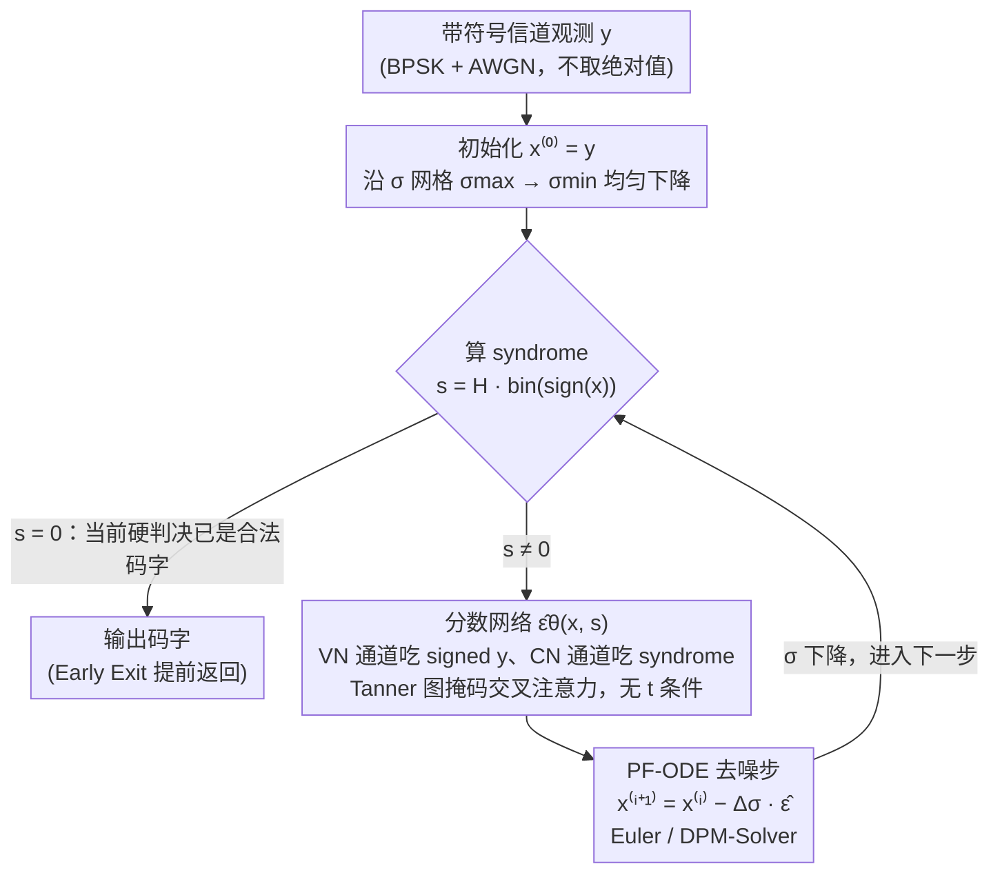

# Score-Based Error Correcting Code Decoder

**会议**: ICML2026  
**arXiv**: [2605.28358](https://arxiv.org/abs/2605.28358)  
**代码**: https://github.com/alonhelvits/SB-ECC  
**领域**: 信号与通信 / 神经译码 / 扩散模型  
**关键词**: 纠错码, 分数模型, 概率流 ODE, 神经译码, DPM-Solver

## 一句话总结
本文提出 SB-ECC：把二进制线性分组码的软译码重新表述为方差爆炸 (VE) 扩散过程的反向去噪，用一个**无时间条件**、直接吃**带符号信道观测** $\mathbf{y}$ 的分数网络求解校验约束引导的概率流 ODE，在 42 种码-SNR 配置中拿下 39 项最优 BER，平均 SNR 增益 0.17 dB、最大 0.46 dB。

## 研究背景与动机

**领域现状**：纠错码 (ECC) 的软译码长期由信念传播 (BP) 等迭代算法 + 因子图主导。深度学习时代分两路：(a) *模型驱动* 神经译码器把 BP/Min-Sum 展开成可训练网络，保留 Tanner 图结构；(b) *模型无关* 译码器直接学 $\mathbf{y} \mapsto$ 码字映射。ECCT、CrossMPT 等 Transformer 译码器用校验矩阵 $H$ 引导的掩码注意力把 (a) 的归纳偏置塞进 (b) 的灵活架构，已经反超经典 BP。最近 DDECC 把扩散思想引入信道译码，把"传输看作前向加噪、译码看作反向去噪"。

**现有痛点**：现行的强基线（ECCT / CrossMPT / DDECC）共享一个看似无害但实际限制表达力的预处理选择——把信道观测先取绝对值 $\mathbf{y} \mapsto |\mathbf{y}|$ 得到"可靠度"，再配合从硬判决算出来的 syndrome 一起送入网络。问题有两点：
1. $\mathbf{y} \mapsto |\mathbf{y}|$ 是**不可逆**的：所有 $\{\mathbf{s} \odot \mathbf{y} : \mathbf{s} \in \{\pm 1\}^n\}$（共 $2^n$ 个）都被映射到同一个输入，丢掉了方向信息；
2. 这些方法直接预测 bit logits，而扩散/分数模型本质上是在 $\mathbb{R}^n$ 学一个**连续向量场**，硬判决离散输出与连续 ODE 求解天然失配。

**核心矛盾**：在"可靠度预处理 + 离散 bit 输出"框架下硬塞扩散模型（如 DDECC），相当于把分数模型的几何优势提前打折；但要保留几何，又会面对训练样本相对码字空间 $|\mathcal{C}|=2^k$ 极度稀疏带来的过拟合（Bennatan et al., 2018 经典痛点）。

**本文目标**：(a) 设计直接吃带符号 $\mathbf{y}$、输出 $\mathbb{R}^n$ 连续去噪方向的译码器；(b) 在推理端摆脱对 SNR/时间的条件依赖，因为实际接收端通常不知道信道 SNR；(c) 让计算预算可调，按延迟需求灵活选择 ODE 求解器步数。

**切入角度**：作者观察到 AWGN 信道 $\mathbf{y} = \mathbf{x}_s + \mathbf{z},\ \mathbf{z}\sim\mathcal{N}(\mathbf{0},\sigma_{ch}^2 I)$ 本身就是 VE 扩散在某个未知 $t^\star$ 处的边缘，于是把整条 AWGN 通道直接当作"前向扩散的一刀切片"，译码 = 沿 PF-ODE 反向积分到 $t=0$。

**核心 idea**：用一个**与时间/SNR 无关**的分数网络 $\hat{\boldsymbol{\epsilon}}_\theta(\mathbf{y}, \mathbf{s})$ 直接吃 signed $\mathbf{y}$ 和 syndrome，在均匀 $\sigma$-空间上跑校验引导的 PF-ODE，把信道几何完整保留下来。

## 方法详解

### 整体框架

SB-ECC 把译码视作 $\sigma$-空间上的反向去噪轨迹：

1. **建模视角**：BPSK 后 $\mathbf{x}_0 \in \{\pm 1\}^n$ 经 AWGN 得到 $\mathbf{y} = \mathbf{x}_0 + \sigma_{ch}\boldsymbol{\epsilon}$，恰好等同 VE-SDE 边缘 $\mathbf{x}_t = \mathbf{x}_0 + \sigma(t)\boldsymbol{\epsilon}$ 在 $\sigma(t^\star) = \sigma_{ch}$ 处。
2. **训练**：均匀采 $t\sim\mathcal{U}(0,1)$、采高斯噪声 $\boldsymbol{\epsilon}$，构造合成接收 $\mathbf{y} = \mathbf{x}_0 + \sigma(t)\boldsymbol{\epsilon}$，从硬判决算 syndrome $\mathbf{s} = H\,\mathrm{bin}(\mathrm{sign}(\mathbf{y}))^\top$，让网络以 noise-prediction 形式拟合 $\boldsymbol{\epsilon}$。注意网络**不接收** $t$ 或 $\sigma$，从而推理时不需要 SNR 估计。
3. **推理 (Algorithm 2 — Early-Exit Decoding)**：从 $\mathbf{x}^{(0)} = \mathbf{y}$ 出发，每步算 syndrome；若为 0 则当前硬判决是合法码字，提前返回；否则调用 $\hat{\boldsymbol{\epsilon}}_\theta(\mathbf{x}^{(i)}, \mathbf{s})$ 得到去噪方向，用 Euler 步 $\mathbf{x}^{(i+1)} = \mathbf{x}^{(i)} - \Delta\sigma\,\hat{\boldsymbol{\epsilon}}$，沿 $\sigma_{\max} \to \sigma_{\min}$ 均匀下降。
4. **求解器替换**：Euler 可无缝换成 DPM-Solver（线性 $\sigma$-schedule 天然适配），在不掉点数的前提下平均压缩 8.86%、最高 12.82% 的端到端延迟。

### 关键设计

**1. 带符号输入 + Tanner 图掩码注意力：保住信道几何，又不丢码结构**

主流强基线（ECCT/CrossMPT/DDECC）都先把信道观测取绝对值 $\mathbf{y}\mapsto|\mathbf{y}|$ 当"可靠度"，但这是一个 $2^n$-到-1 的折叠映射——所有 $\{\mathbf{s}\odot\mathbf{y}\}$ 被压到同一输入、每坐标的方向信息全丢，而方向恰恰是分数场学习最需要的。SB-ECC 沿用 CrossMPT 的双模态架构（变量节点 token × 校验节点 token 经 $H$ 引导的掩码交叉注意力交换消息），但把 VN 通道从 $|\mathbf{y}|$ 改成 signed $\mathbf{y}$、CN 通道仍是 syndrome，输出从"bit 翻转概率/logits"换成 $\mathbb{R}^n$ 中的去噪方向 $\hat{\boldsymbol{\epsilon}}_\theta$。这样既把连续向量场所需的几何信息留住，又用 $H$ 引导的掩码注意力注入校验约束、避免纯模型无关方法被码字空间 $2^k$ 的组合爆炸压垮——是"几何 + 结构"双留的最小改动。

**2. 无时间条件 + 线性 $\sigma$-schedule：推理端不需要估 SNR**

实际接收端往往拿不到准确信道 SNR，而 SNR-conditioned 模型对 SNR 偏差敏感。作者注意到 AWGN 信道 $\mathbf{y}=\mathbf{x}_0+\sigma_{ch}\boldsymbol{\epsilon}$ 恰好等同 VE-SDE 边缘 $\mathbf{x}_t=\mathbf{x}_0+\sigma(t)\boldsymbol{\epsilon}$ 在某个 $\sigma(t^\star)=\sigma_{ch}$ 处，于是训练时取线性 schedule $\sigma(t)=\sigma_{\min}+(\sigma_{\max}-\sigma_{\min})t$、$t\sim\mathcal{U}(0,1)$ 覆盖整个噪声谱，网络只看 $(\mathbf{y},\mathbf{s})$、不接收 $t$ 或 $\sigma$，等价于学一个所有 SNR 共享的去噪场。推理时不估 $\sigma_{ch}$，直接从 $\mathbf{x}^{(0)}=\mathbf{y}$ 沿固定 $\sigma$-grid 走 $N_{\text{steps}}$ 步。代价是网络要学一个对各噪声水平都鲁棒的"平均场"，但 syndrome 已隐式提供"当前离合法码字有多远"的强信号补上这一点，且线性 schedule 直接为后续 DPM-Solver 替换铺路。

**3. 校验引导的 PF-ODE + Early Exit：精度可调、延迟可控**

把校验约束作为软引导塞进概率流 ODE $d\mathbf{x}_t=-\tfrac12 g(t)^2\nabla_{\mathbf{x}}\log p_t(\mathbf{x}_t)\,dt$，用学到的 $\hat{\boldsymbol{\epsilon}}_\theta(\mathbf{x},\mathbf{s})$ 替代分数（VE 下两者只差时间相关常数 $-1/\sigma(t)$）。每个迭代步重算硬判决和 syndrome，若 syndrome 归零说明当前硬判决已是合法码字、提前返回——这把传统 BP"每轮检测 syndrome 是否归零"的早退机制自然搬进连续动力学。再把默认 Euler 步换成 DPM-Solver（线性 $\sigma$-schedule 天然适配），原本 $N_{\text{steps}}$ 次 NFE 的预算能在更少 NFE 下达到等效 BER，平均压缩 8.86%、最高 12.82% 延迟。配合无 SNR 条件，整个推理变成一个可滑动的精度-延迟旋钮：好信道 5–10 步搞定，坏信道才跑满预算。

### 损失函数 / 训练策略
单一去噪损失 $\mathcal{L}_\epsilon = \mathbb{E}\|\hat{\boldsymbol{\epsilon}}_\theta(\mathbf{y}, \mathbf{s}(\mathbf{y})) - \boldsymbol{\epsilon}\|_2^2$（Algorithm 1）。每个 batch 随机采 $t \sim \mathcal{U}(0,1)$ 和 $\boldsymbol{\epsilon}$，构造合成接收 $\mathbf{y}$ 和对应 syndrome，端到端 Adam。架构超参 (层数、d_model、注意力头) 完全跟随 CrossMPT 以做受控对比。

## 实验关键数据

### 主实验

跨 BCH / Polar / LDPC / MacKay / CCSDS 五大码族 14 个码字、$E_b/N_0 \in \{4, 5, 6\}$ dB 共 42 组配置，指标为 $-\ln(\mathrm{BER})$（越大越好）：

| 码 (n, k) | $E_b/N_0$ | BP-50 | CrossMPT | DDECC | SB-ECC (本文) | 较强基线增益 |
|----------|-----------|-------|----------|-------|---------------|--------------|
| BCH(63,45) | 6 dB | 7.26 | 11.62 | 11.41 | **13.17** | +1.55 |
| Polar(128,64) | 6 dB | 6.15 | 14.76 | 16.27 | **16.94** | +0.67 |
| LDPC(121,80) | 6 dB | 17.33 | 18.15 | 18.26 | **20.42** | +2.16 |
| LDPC(121,70) | 6 dB | 15.62 | 17.52 | 17.98 | **19.24** | +1.26 |
| MacKay(96,48) | 6 dB | 12.57 | 15.52 | 16.04 | **16.25** | +0.21 |

宏观：42 项中 SB-ECC 拿下 **39 项最优 BER**，相对最强对手平均 SNR 增益 **0.17 dB**、最大 **0.46 dB**。

### 消融实验

| 配置 | 改动 | 关键指标变化 |
|------|------|--------------|
| Full SB-ECC (Euler) | signed $\mathbf{y}$ + Tanner 注意力 + 无时间条件 + PF-ODE | 基线 $-\ln(\mathrm{BER})$ |
| w/o signed (用 $\|\mathbf{y}\|$) | 把输入退回主流可靠度预处理 | BER 显著退化，几何信息丢失被实证（Sec 5.3）|
| 时间条件版 (conditioned on $\sigma$) | 把 $\sigma$ 拼进 token | 推理需 SNR 估计；轻微下降并丧失"未知 SNR"鲁棒性 |
| Euler → DPM-Solver | 求解器替换 | $-\ln(\mathrm{BER})$ 基本持平，端到端延迟平均 ↓8.86%（最高 ↓12.82%）|

### 关键发现
- **signed 输入在 LDPC / BCH 中长码上增益最大**：这些码字 $k$ 较大、$|\mathcal{C}|$ 巨大，方向信息的几何价值被分数场最大化利用；短码或低码率码（如 (64,48) Polar）增益更平。
- **DPM-Solver 之所以能即插即用，关键是线性 $\sigma$-schedule + 无时间条件**：DPM 要求噪声调度可解析积分，而本文恰好按 $\sigma$ 而非 $t$ 离散化，DPM 高阶项的设计假设直接成立。
- **早退机制让平均 NFE 远低于 worst-case $N_{\text{steps}}$**：高 SNR 下大多数样本在前几步就归零 syndrome，整体推理延迟由难样本主导。

## 亮点与洞察
- **"AWGN 信道 = VE 扩散一个时刻"** 是非常优雅的统一视角：原本 DDECC 还要把信道映射成 *人造* 的离散扩散步，本文直接对齐到连续 SDE 的边缘 $t^\star$，让训练分布和测试分布在数学上完全一致，且自动支持任何 SNR。
- **time-unconditional 的设计意外地是 DPM-Solver 的关键先决条件**：无时间条件 + 线性 $\sigma$ → 均匀 $\sigma$-grid → 高阶 ODE 求解器立刻能用。这是"为推理鲁棒性做的设计选择反过来打开了延迟优化空间"的典型例子。
- **syndrome 作为 *条件输入而非监督信号*** 与码字结构注入方式形成有趣对比：DDECC 把 syndrome 当 step 索引，本文把 syndrome 当 token，让 cross-attention 用 $H$ 掩码自动路由约束信息——这种做法直接复用了 Transformer 译码器的所有积累。
- **可迁移到其他"含已知约束的去噪问题"**：例如低密度奇偶约束图像恢复、CRC 引导的语音去噪、约束满足问题求解，均可套用"unconditional 分数 + 约束作 token + 早退"模板。

## 局限与展望
- **架构创新有限，主要靠表示与求解器**：网络骨架完全跟 CrossMPT，几乎没动结构；从架构创新角度贡献偏轻，更像"重新设计了正确的输入/输出/调度"。
- **平均 0.17 dB 的增益对工程价值是"显著但不剧烈"**：在某些信道/码族下增益接近持平，期望大于 1 dB 飞跃的读者可能失望。
- **未覆盖更长码（如 LDPC(1024,512) 量级）**：当 $n$ 上升时 CrossMPT 注意力本身的 $\mathcal{O}(n \cdot |E|)$ 开销和分数场学习难度都会上升，长码 scaling 是开放问题。
- **校验引导仍是软引导，没有任何最优性保证**：相比"理论上"接近 ML 译码的格基/广义稀疏方法，本文是经验上更好的近似，不能给出收敛或最优性证明。
- **改进思路**：(a) 把 syndrome 引入扩散的 *训练时* 引导（CFG 风格）而不仅是 token；(b) 用 DPM++ 等更高阶求解器进一步压 NFE；(c) 用 consistency model 蒸馏成单步译码，对接 Lei et al. (2025) 的低延迟路线。

## 相关工作与启发
- **vs DDECC (Choukroun & Wolf, 2022)**：DDECC 用离散扩散步并依赖 $|\mathbf{y}|$ 预处理，本文用连续 VE 扩散直接对齐信道、保留 signed 输入；39/42 全面反超，证明"几何 + 连续时间"对译码任务确实更适配。
- **vs CrossMPT (Park et al., 2024)**：共用 backbone，差异在输入通道、输出语义、推理范式。本文相当于把 CrossMPT 从"一次性 logits"升级为"PF-ODE 多步去噪"，说明 backbone 选择正确时表征/动力学才是真正瓶颈。
- **vs ECCT / Foundation Decoder (Choukroun & Wolf, 2022/2024)**：那些工作探索"用更强 Transformer 做大模型直接译码"；本文给出正交方向——同样的网络容量下，**重新表述任务**比堆参数更见效。
- **vs ECC-Consistency Flow (Lei et al., 2025)**：他们蒸馏成单步以求低延迟，本文用 DPM-Solver 在精度优先档位上换 8-13% 延迟；可结合做"准确度档/快速档"双模式。

## 评分
- 新颖性: ⭐⭐⭐⭐ AWGN ↔ VE 一刀切对齐 + signed 输入 + 无时间条件三连组合是确实没被做过的小聪明
- 实验充分度: ⭐⭐⭐⭐ 42 组配置、5 码族覆盖较广，且做了 DPM-Solver 切换的延迟基准
- 写作质量: ⭐⭐⭐⭐ 数学推导和算法伪代码清晰，preliminary 把 VE-SDE / DSM / Tanner 都讲得透
- 价值: ⭐⭐⭐⭐ 给神经译码社区提供新的设计模板，预期会成为后续 score-based 译码工作的对照基线

<!-- RELATED:START -->

## 相关论文

- [\[ICML 2026\] Rethink the Role of Neural Decoders in Quantum Error Correction](rethink_the_role_of_neural_decoders_in_quantum_error_correction.md)
- [\[ICLR 2026\] Astral: Training Physics-Informed Neural Networks with Error Majorants](../../ICLR2026/physics/astral_training_physics-informed_neural_networks_with_error_majorants.md)
- [\[NeurIPS 2025\] Score-informed Neural Operator for Enhancing Ordering-based Causal Discovery](../../NeurIPS2025/physics/score-informed_neural_operator_for_enhancing_ordering-based_causal_discovery.md)
- [\[ICML 2026\] Speculative Sampling for Faster Molecular Dynamics](speculative_sampling_for_faster_molecular_dynamics.md)
- [\[ICML 2026\] BALLAST: Bayesian Active Learning with Look-ahead Amendment for Sea-drifter Trajectories under Spatio-Temporal Vector Fields](ballast_bayesian_active_learning_with_look-ahead_amendment_for_sea-drifter_traje.md)

<!-- RELATED:END -->
