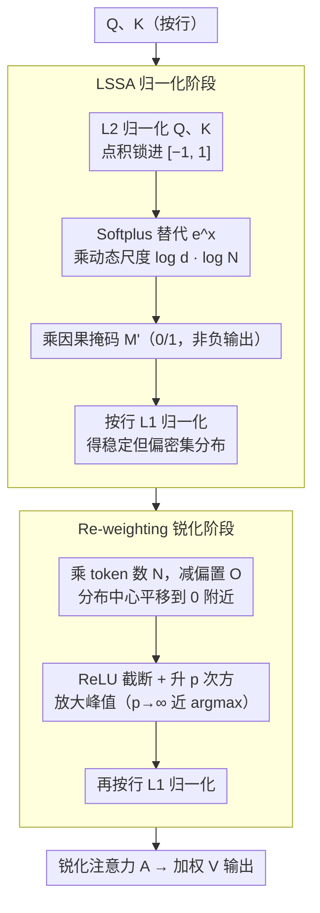

# Softplus Attention with Re-weighting Boosts Length Extrapolation in Large Language Models

**会议**: ICML 2026  
**arXiv**: [2501.13428](https://arxiv.org/abs/2501.13428)  
**代码**: 论文未明确给出（实验基于 GPT-2 small + RoPE 复现）  
**领域**: LLM 效率 / 注意力机制 / 长度外推  
**关键词**: Softmax 替代, Softplus 注意力, 长度外推, 注意力锐化, attention sink

## 一句话总结
作者把传统 Softmax attention 解构为"非负化 + L1 归一化"两个独立部件，证明真正关键的是 L1 归一化而非指数，于是用 Softplus + 动态长度尺度因子换掉指数得到 LSSA，再用一次幂函数式"重权"对注意力锐化，得到的 LSSAR 在 16× 训练长度上几乎保持 validation loss 不变，并能让 GPT-109M 从轨迹数据中"重新发现"牛顿万有引力定律。

## 研究背景与动机

**领域现状**：Transformer 的核心是 scaled dot-product attention $A = \mathrm{Softmax}(QK^T/\sqrt{d} + M)$。Softmax 凭借平滑、可微和"非负归一化"几乎成了 LLM 的默认组件。但训出来的 attention 在两种场景下严重失灵：(i) 当模型规模上到万亿级，$e^x$ 的指数运算极易导致数值不稳；(ii) 推理 token 长度远超训练长度时，attention 分布越来越平坦，难以再聚焦到关键 token——这就是"attention smoothing"和"attention sink"两大顽疾，是限制 LLM 长度外推的最大架构瓶颈之一。

**现有痛点**：现有 Softmax-free 注意力（Sigmoid attention、ReLU attention 等）虽然解决了数值稳定问题，但要么完全失去长度外推能力（8K 上 loss 暴涨数倍），要么因为"死神经元"切断了远距离 token 的梯度通路。事后补救如位置插值、ALiBi 等只是把训练长度的 embedding 拉伸，没解决 attention 分布平坦化的根本原因。

**核心矛盾**：所有现有方案默认 Softmax 的非负性是其有效的核心来源，并围绕"找一个更好的非负激活"做文章。可一旦把"非负化"与"L1 归一化"耦合在同一个函数里，就无法独立调控两者，也就无法在保持归一化优势的同时换掉那个数值不稳的指数。

**本文目标**：(i) 重新分析 Softmax 真正"哪一部分"决定了 attention 的表现；(ii) 设计一个数值稳定且长度可外推的归一化阶段；(iii) 进一步从结构上消除 attention smoothing，使注意力分布天然保持峰锐。

**切入角度**：作者把 Softmax 写成 $\mathrm{Softmax}(x) = \phi(x)/\|\phi(x)\|_1$，其中 $\phi(x) = e^x$ 仅负责非负化、$L_1$ 范数负责归一化竞争。消融实验（附录 Table A4/A6）发现：把 $\phi$ 换成 Softplus 等任何能"全域非零"的函数都不掉点，把 $L_1$ 归一化去掉则模型崩溃——也就是 L1 才是关键。

**核心 idea**：把 attention 拆成"归一化 + 锐化"两阶段，归一化阶段用 Softplus + 动态长度尺度因子保稳定可外推；锐化阶段用一次 ReLU 截断后的幂函数 $\mathrm{ReLU}^p$ 再归一化，把注意力分布"挤"到极少数最相关 token 上，从结构上根治 attention smoothing。

## 方法详解

### 整体框架
LSSAR（Length Scaled Softplus Attention with Re-weighting）由两个串联阶段组成。第一阶段（归一化阶段，LSSA）：对 $Q, K$ 各行做 $L_2$ 归一化，把点积锁在 $[-1, 1]$；用 Softplus 替代 $e^x$ 作为非负化函数；以 $\log d \cdot \log N$ 作为按位置动态变化的尺度因子；最后对每行做 $L_1$ 归一化。第二阶段（锐化阶段）：在 LSSA 的输出上做"乘以 $N$（按位置 token 数）→ 减去偏置矩阵 $O$ → 取 ReLU 并升到 $p$ 次方 → 再 $L_1$ 归一化"。两阶段都加在原 GPT-2 small（124M）+ RoPE 框架上，其它部分不变。

### 关键设计

**1. Softmax 解构 + LSSA：找到真正起作用的 L1 归一化，再换掉数值不稳的指数**

整个工作的支点，是先把 Softmax 写成 $\mathrm{Softmax}(x)=\phi(x)/\|\phi(x)\|_1$ 两件事：$\phi(x)=e^x$ 只负责非负化，$L_1$ 范数负责归一化竞争。消融发现把 $\phi$ 换成任何"全域非零"的函数都不掉点，去掉 $L_1$ 则模型崩——也就是说大家多年盯着替换的"非负函数"根本不是关键，$L_1$ 才是。顺着这条结论，归一化阶段 LSSA 把 $e^x$ 换成数值稳定的 Softplus，并配一个按位置变化的尺度因子：先令 $Q_i\leftarrow Q_i/\|Q_i\|_2$、$K_i\leftarrow K_i/\|K_i\|_2$ 把点积锁进 $[-1,1]$，再算

$$A=\mathrm{Softplus}\big((\log d\cdot\log\mathbf N)\odot QK^T\big)\odot M',\qquad A_i\leftarrow A_i/\|A_i\|_1,$$

其中 $\mathbf N$ 是 $L\times L$ 矩阵、第 $i$ 行全等于 $i$（该行实际参与的 token 数）。Softplus$=\log(1+e^x)$ 同样全域非零却不会数值爆炸，其导数 sigmoid 在 $[-1,1]$ 上斜率陡、与 cosine 归一化天然契合；$\log N$ 来自熵不变性分析（Chiang & Cholak 2022），按位置而非整体长度调温度，让首尾 token 都拿到合适的"温度"，从而在训练和任意推理长度下都保持熵的相对不变。

**2. Re-weighting：把"非负化"和"锐化"彻底解耦，从结构上根治 attention smoothing**

归一化阶段给出的是稳定但仍偏密集的分布，长序列下还是会平坦化。锐化阶段在它之上再做一次后置加权：

$$A\leftarrow \mathrm{ReLU}^p(A\odot\mathbf N - O),\qquad A_i\leftarrow A_i/\|A_i\|_1,$$

$O$ 是全 1 偏置矩阵（前 3 行置 0 防训练初期不稳），把分布中心平移到 0 附近，ReLU 屏蔽低于阈值的元素，再升 $p$ 次方放大峰值。论文证明 $p\to\infty$ 时对任何 $x_l<x_m$ 有 $\lim_{p\to\infty}(x_m^p-x_l^p)/\sum_k x_k^p=1$，即锐化极限等价于硬 argmax。关键巧思在"解耦"：如果直接拿 ReLU 当 $\phi$，一旦某 token 分数掉到 0 以下就再收不到梯度（死神经元）；而这里先用 Softplus 让所有 token 都进 L1 竞争、把梯度通路建好，再在已稳定的分布上做锐化，即便部分 token 被 ReLU 截断也不切断学习。$p$ 在这里扮演逆温度系数，相当于在已有 softmax-like 分布上做一次温度退火。

**3. 最小侵入式集成：把所有改动关进 attention 内部，和已有长上下文技术正交叠加**

长度外推方案要有工程价值就得即插即用，所以作者刻意不动 RoPE / 位置编码 / 前馈层，只把 attention 里的 $\mathrm{Softmax}(\cdot)$ 一次性替换成"LSSA → re-weighting"。唯一的连带改动是掩码：因为 Softplus 输出非负，下三角掩码 $M'$ 从原来"加 $-\infty$"改成"乘 0/1"。其余模块全保持 GPT-2 small 默认，FlashAttention 风格的核也能直接复用 elementwise 的 forward/backward。这样设计是为了让 LSSAR 能与位置插值、滑窗注意力等已有长上下文技术正交叠加，而非互斥。

### 损失函数 / 训练策略
所有模型都基于 GPT-2 small（124M）+ RoPE，在 FineWeb-10B 上以 sequence length 1024 训练 18,865 步、共 10.2B 训练 token + 0.1B 验证 token，8×A100 80GB。$p$ 是关键超参，论文报告 $p\in\{3, 15\}$ 两个设置：$p=3$ 在 1K 长度最优，$p=15$ 在 8K 及以上长度最优（小 $p$ 兼顾稀疏与平滑，大 $p$ 强力锐化）。

## 实验关键数据

### 主实验
所有方法都在同一 GPT-2 124M + RoPE 上，训练长度 1K，外推到 2K/4K/8K 测 validation loss：

| Attention | 1K | 2K | 4K | 8K |
|-----------|-----|-----|-----|-----|
| Softmax baseline | 3.19 | 4.17 | 5.45 | 6.28 |
| Sigmoid (RamapuRam 2024) | 3.19 | 7.46 | 11.84 | 14.50 |
| ReLU (Wortsman 2023) | 3.21 | 6.27 | 8.50 | 10.35 |
| LSSA（仅归一化阶段） | 3.19 | 4.13 | 5.30 | 5.94 |
| LSSAR ($p=3$) | 3.18 | 4.24 | 5.41 | 6.30 |
| **LSSAR ($p=15$)** | **3.19** | **3.19** | **3.23** | **3.32** |

下游 zero-shot（Softmax 124M vs LSSAR 124M）：ARC-E 39.77→40.57，HellaSwag 32.42→33.03，PIQA 64.09→65.34，SciQ 60.6→62.1，SummScreen 1.68→6.31。

### 消融实验

| 配置 | 8K 验证 loss | 说明 |
|------|--------------|------|
| Full LSSAR ($p=15$) | 3.32 | 完整模型，外推几乎无损 |
| 只用 LSSA（无 re-weighting） | 5.94 | 锐化阶段的贡献，长序列差距最大 |
| 只用 re-weighting + Softmax ($p=15$) | 7.02 | 用 Softmax 当归一化阶段反而崩，验证两阶段需匹配 |
| 用 Sigmoid + L1 + re-weighting ($p=15$) | 3.86 | 说明 L1 + 重权才是真正起作用的组合，但仍比 LSSAR 差 |
| 用 ReLU 作 $\phi$ | >10 | "死神经元"，长序列不可用 |

Passkey retrieval（needle-in-a-haystack）：

| 长度 | Softmax 准确率 | LSSAR ($p=15$) 准确率 |
|------|----------------|------------------------|
| 1K | 64% | **86%** |
| 1.5K | 0% | 45% |
| 4K | 0% | 20% |
| 8K | 0% | 非零 |

### 关键发现
- 验证集 loss 在 8K 长度上几乎不增（3.19→3.32），是所有候选方法里第一次"长度外推几乎免费"的结果。
- Passkey 任务上 Softmax 模型一过训练长度直接掉到 0%，LSSAR 在 8 倍训练长度上仍维持非零；这是"attention 是否真的锐化"最干净的探针实验。
- 符号回归实验里，GPT-109M + LSSAR 能从行星轨迹序列里恢复 $F\propto m_1/r^2$ 牛顿万有引力定律，而 Softmax 版本 GPT 给出的力公式毫无物理意义；甚至 o3、Claude 4 Sonnet、Gemini 2.5 Pro 这类万亿参数 LLM 在同一任务上也失败，说明 attention 机制本身的归纳偏置可能比模型规模更影响"是否能学到物理规律"。
- $p$ 在 1K 时较小（3）最优，长序列下需要更大（15）；说明 sparsity 的最佳程度是长度依赖的，未来可以做自适应 $p$。

## 亮点与洞察
- "Softmax 拆解 → L1 才是关键"这条结论本身就值得整个 attention 替代研究方向重新审视：过去多年的 Softmax-free 工作都把焦点放在替换非负函数上，方向选错了。
- 把"sparsity 与梯度通路解耦"是关键巧思——先用 Softplus 保证所有 token 拿到梯度，再用 ReLU + 幂函数后置锐化，相当于在 Softmax 的全连接梯度图上做剪枝而不是直接搭建稀疏图，避免了 ReLU attention 的"死神经元"病。
- $\log d \cdot \log N$ 这种按行变化的尺度因子可以迁移到任何需要长度外推的归一化运算（如 cross attention、retrieval scoring），它的核心是"按当前真正参与归一化的 token 数缩放温度"。
- 符号回归实验给出了一个新颖且严格的评估：模型能否从物理轨迹里学到 $1/r^2$ 律，比传统 NLP benchmark 更能反映 attention 的归纳偏置。

## 局限与展望
- LSSA 中的尺度因子 $\log d \log N$ 是在 $L=1024$、$d=64$ 下验证的，作者也承认 $\log d$ 这一部分在更大 $d$ 时可能需要重调，没有给出大模型规模下的 hyperparameter sweep。
- $p=15$ 是经验最优，没有理论依据；面对未知任务/长度时，是否需要可学习 $p$ 或自适应 $p$ 仍是开放问题。
- 论文实验仅在 124M / 109M 规模上做，没有报告 7B/13B 大模型上的 loss 对比，长序列外推优势能否在大模型上同等保持仍需验证。
- $\mathrm{ReLU}^p$ 在 $p$ 较大时数值上仍有溢出风险，特别是 $p=15$ 时 $x^{15}$ 的动态范围已经很大，对 FP16 训练的稳定性需要专门内核。

## 相关工作与启发
- **vs Sigmoid attention (Ramapuram 2024)**：作者证明该方法之所以掉点是因为缺 L1 归一化；只要加上 L1，sigmoid 也能接近 Softmax 水平——本质上把"非负 + L1"做对就够了，而 LSSA 在此基础上更稳。
- **vs ReLU attention 系列**：ReLU 因为硬阈值产生死神经元，在长序列上灾难性失效；LSSAR 把硬阈值放到 re-weighting 阶段（在 L1 归一化之后），避开了在主干 attention 上直接稀疏化的陷阱。
- **vs 位置插值 / ALiBi / NTK rope**：这些是 PE 层面的事后补救，不改变 attention smoothing 的根本原因；LSSAR 直接从 attention 本身解决 smoothing，可以与上述位置编码方案叠加。

## 评分
- 新颖性: ⭐⭐⭐⭐⭐ "Softmax = $\phi$ + L1，L1 才是核心"是颠覆性结论；两阶段设计与符号回归实验都极具洞察。
- 实验充分度: ⭐⭐⭐⭐ 验证 loss、下游 zero-shot、passkey retrieval、符号回归四类实验互相呼应；缺大模型规模验证。
- 写作质量: ⭐⭐⭐⭐ 解构 Softmax→提出 LSSA→提出 re-weighting 的论证链非常清晰，理论分析（$p\to\infty$ 极限）简洁。
- 价值: ⭐⭐⭐⭐⭐ 长度外推几乎免费 + 数值稳定，是 LLM attention 替代方向上为数不多的"既稳又可外推"方案。

<!-- RELATED:START -->

## 相关论文

- [\[ICML 2025\] L2D: Large Language Models to Diffusion Finetuning](../../ICML2025/physics/large_language_models_to_diffusion_finetuning.md)
- [\[ICML 2026\] Quiver: Quantum-Informed Views for Enhanced Representations in Large ML Models](quiver_quantum-informed_views_for_enhanced_representations_in_large_ml_models.md)
- [\[ICML 2025\] Liger: Linearizing Large Language Models to Gated Recurrent Structures](../../ICML2025/physics/liger_linearizing_large_language_models_to_gated_recurrent_structures.md)
- [\[ICML 2026\] Understanding Catastrophic Forgetting In LoRA via Mean-Field Attention Dynamics](understanding_catastrophic_forgetting_in_lora_via_mean-field_attention_dynamics.md)
- [\[ICML 2026\] $\mathbb{R}^{2k}$ is Theoretically Large Enough for Embedding-based Top-$k$ Retrieval](mathbbr2k_is_theoretically_large_enough_for_embedding-based_top-k_retrieval.md)

<!-- RELATED:END -->
