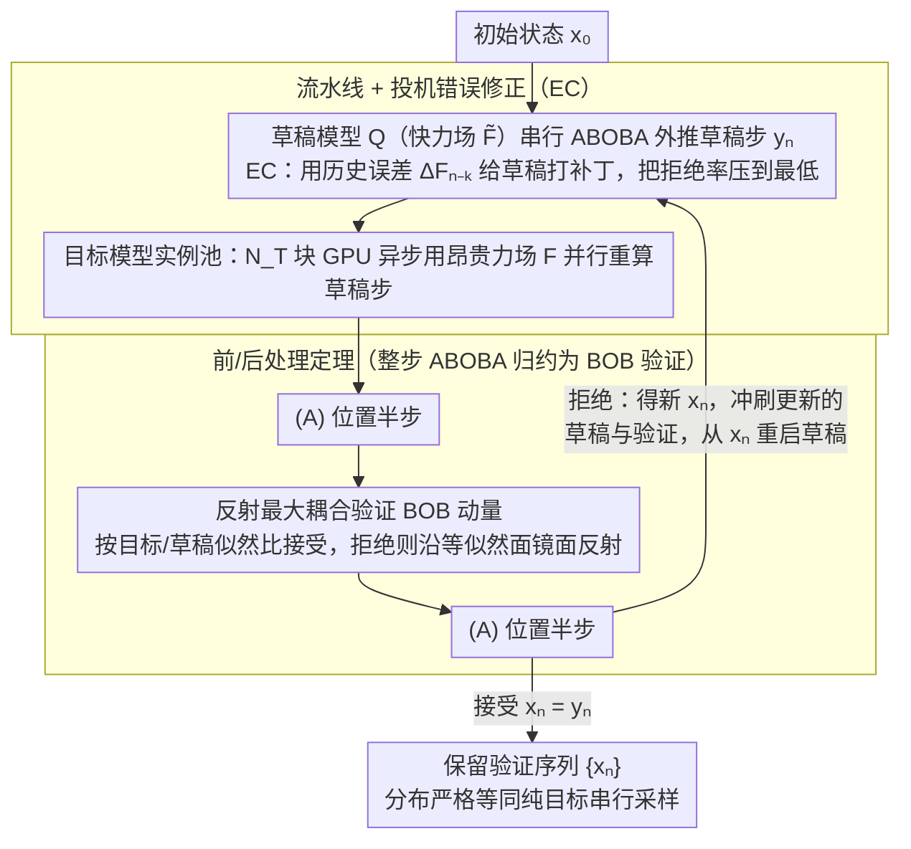

# Speculative Sampling for Faster Molecular Dynamics

**会议**: ICML2026  
**arXiv**: [2606.02455](https://arxiv.org/abs/2606.02455)  
**代码**: https://github.com/facebookresearch/LSD  
**领域**: 科学计算 / 分子动力学 / 机器学习势函数 (MLIP)  
**关键词**: 投机采样, Langevin 动力学, MLIP 加速, 反射最大耦合, 并行验证

## 一句话总结
本文把语言模型里的投机采样迁移到二阶 Langevin 分子动力学，提出 LSD：用快草稿势函数串行外推、慢目标势函数并行验证，通过反射最大耦合保证轨迹分布与目标模型严格一致，在 FCC 铜等系统上获得 3–9× 无误差加速。

## 研究背景与动机

**领域现状**：分子动力学 (MD) 是模拟原子尺度时间演化的标准工具。近年涌现的机器学习势函数 (MLIP) 能在 DFT 量子精度下做到线性复杂度，是 MD 模拟的核心算力瓶颈。

**现有痛点**：MD 的数值积分要求时间步长 $\Delta t \sim 0.5\text{–}1$ fs，而很多目标物理过程发生在 100+ ns 尺度，需要 $10^8$ 量级的串行积分步；MLIP 比经典力场单步昂贵几个数量级，使长时间尺度模拟实际不可行。MD 本质串行——下一步的力依赖当前位置——所以无法像数据并行那样靠堆显卡来提升单条轨迹吞吐。

**核心矛盾**：MLIP 在 Pareto 前沿上呈现"准确度 vs 速度"的天然权衡，有大量"快但糙"和"慢但准"的模型对，但已有加速方案（大步长外推、嵌入复用、蒸馏、多时间步法）几乎都是 *有损* 的，会引入未知的轨迹分布偏差，对物理观测量不安全。

**本文目标**：在不引入任何相对误差的前提下，把"快草稿 + 慢目标"的并行验证范式从 LLM/扩散模型迁移到 MD，使加速来自跨时间步的并行性而非牺牲精度。

**切入角度**：作者注意到 LLM 投机采样和 MD 都是"串行马尔可夫链 + 转移核昂贵"的结构，但有两点关键差异：(1) MD 的状态空间是连续的 $\mathbb{R}^{6N}$；(2) 转移核是二阶 Langevin SDE 的数值积分器（如 ABOBA 分裂），而非一阶 Euler-Maruyama。这两点都不允许直接套用 LLM/diffusion 的离散/一阶投机算法（De Bortoli 等 2025 的工作只覆盖一阶 Langevin）。

**核心 idea**：把投机采样的"接受/拒绝-回滚"机制和 HMC 文献中的 **反射最大耦合 (reflection-maximal coupling)** 嫁接到 ABOBA 类分裂积分器上，对积分器的 (BOB) 动量更新做耦合验证，并证明在可逆的位置更新 (A) 下整步耦合仍达到最优接受率。

## 方法详解

### 整体框架

LSD（Langevin Speculative Dynamics）的运行时是一个流水线异步系统：

1. **草稿模型** $Q(\cdot|\cdot)$ 在一台 GPU 上不间断地产出连续的草稿步 $y_n = (\tilde{\mathbf{q}}_n, \tilde{\mathbf{p}}_n)$，每一步用一个便宜的力场 $\tilde{\mathbf{F}}$（如 EMT 经典力场或 Orb-v3-direct 小 MLIP）走一个 ABOBA 积分。
2. **目标模型实例池** $\{P^{(i)}\}_{i=1}^{N_T}$ 在另外 $N_T$ 块 GPU 上异步消费草稿步，每个实例拿到一个草稿步 $y_{n-1}$ 后重新用昂贵力场 $\mathbf{F}$ 算一遍 ABOBA，得到目标模型本应输出的均值动量 $\langle \mathbf{p}_n \rangle$。
3. **验证协议**：当目标返回时，根据反射最大耦合判定接受 $x_n = y_n$ 还是拒绝并反射出新的 $x_n$。若拒绝，所有比当前步更新的草稿和未完成的验证都被"冲刷"，草稿从 $x_n$ 重新出发。最终保留下来的 $\{x_n\}$ 序列在分布上严格等同于纯目标模型串行采样的结果。

整个系统不需要预先指定前瞻长度 $L$，比 Leviathan 等 (2023) 的同步算法更易分析，资源最优配置只需 $N_T \geq \lceil 1/c \rceil$（$c$ 为草稿/目标耗时比）。

### 关键设计

**1. 反射最大耦合验证 BOB 动量更新：用最大耦合把拒绝率压到最低**

ABOBA 分裂积分器里只有中间的 (BOB) 步受力场影响，它产生一个高斯动量更新 $\mathcal{N}(\cdot;\langle\mathbf{p}_n\rangle,\boldsymbol{\Sigma})$，协方差 $\boldsymbol{\Sigma}=\mathbf{M}k_BT(1-e^{-2\gamma\Delta t})$ 与力场无关——草稿和目标只差均值。验证时令 $\mathbf{z}=\boldsymbol{\Sigma}^{-1/2}(\tilde{\mathbf{p}}_n-\langle\tilde{\mathbf{p}}_n\rangle)$，按草稿/目标似然比 $\min\{1,\mathcal{N}(\tilde{\mathbf{p}}_n;\langle\mathbf{p}_n\rangle,\boldsymbol{\Sigma})/\mathcal{N}(\tilde{\mathbf{p}}_n;\langle\tilde{\mathbf{p}}_n\rangle,\boldsymbol{\Sigma})\}$ 决定接受；若拒绝，就把 $\mathbf{z}$ 沿等似然超平面（法向 $\boldsymbol{\delta}=\boldsymbol{\Sigma}^{-1/2}(\langle\tilde{\mathbf{p}}_n\rangle-\langle\mathbf{p}_n\rangle)$）做镜面反射、再加回目标均值。Bou-Rabee 等证明这是最大耦合——在所有满足"输出服从目标分布"的耦合中 $\mathbb{P}(x_n=y_n)$ 最大。选最大耦合直接最小化拒绝率，而拒绝率决定流水线的有效平均接受长度；理论拒绝率有闭式 $\beta_n=\mathrm{erf}(\|\boldsymbol{\delta}\|/\sqrt8)$，让后续能对系统大小、温度、摩擦做解析分析。

**2. 前/后处理定理：把整步 ABOBA 验证归约为 BOB 验证**

完整 ABOBA 步是 (A)·(BOB)·(A)，直接在 $6N$ 维位置-动量联合空间设计耦合既复杂又未必最优。Thm 3.1 形式化了一条归约：如果目标和草稿分布都能分解成 $P=g_*P'(\cdot\mid f(y_{n-1}))$，那么在 $P',Q'$ 上做耦合再加前 $f$、后 $g$ 的确定性变换，整体仍是 $P,Q$ 的耦合；若 $g$ 可逆则继承最大性。把 $f=g=(A)$ 套入，整步验证就退化成"做一次 (A) → 反射验证 BOB → 再做一次 (A)"。这避免了高维联合耦合，又保证最优接受率不会因多套一层位置更新而下降；定理还把 LSD 推广到 OBABO 等其他分裂方案，并兼容中心质量固定、约束投影这类非可逆后处理。

**3. 流水线 + 投机错误修正（EC）：把吞吐和拒绝率分别打满**

同步式"先攒 $L$ 个草稿再批验证"会让草稿 GPU 空转。LSD 改成目标实例池异步消费草稿步、拒绝即刻回滚冲刷，让草稿 GPU 永不停，加速上界简化为 $\text{speedup}\lesssim1/(c+\langle\beta\rangle)$（$c$ 是草稿/目标耗时比、$\langle\beta\rangle$ 是平均拒绝率，两者对称、谁大谁主导）。但作者推出的半经验拒绝率模型 $\langle\beta\rangle\approx\mathrm{erf}((N\tau\Delta t)^{1/2}T^{-1/2}\varepsilon)$ 显示，随原子数 $N$、摩擦时间 $\tau$ 增大，$\langle\beta\rangle$ 会被 erf 推向 1、加速归零。EC 假设草稿-目标力误差 $\Delta\mathbf{F}_{n-k}$ 物理上变化慢，用最近一次已验证步的误差给当前草稿打补丁 $\mathbf{F}_n\approx\tilde{\mathbf{F}}_n+\Delta\mathbf{F}_{n-k}$，相当于把草稿在线升级成"草稿 + 历史误差"组合模型、把每原子误差常数 $\varepsilon$ 实际拉小，拒绝率最多降 75%，将高摩擦/大体系情形从不可用拉回可用。

### 损失函数 / 训练策略
LSD 是一个 *推理时* 算法，不需要任何额外训练。所用 MLIP（UMA-S、UMA-M、UMA-tiny-direct、Orb-v3-direct）都是开箱即用的预训练通用势函数。流水线的实际开销主要来自跨 GPU 通信和反射验证本身的 $\mathcal{O}(N)$ 矩阵-向量运算，相对于一次 MLIP 力调用可忽略。

## 实验关键数据

### 主实验

FCC 铜 ($T=1500$ K, $\Delta t=1$ fs, $\tau=1$ ps) 上不同草稿-目标组合的真实加速比；目标分别为 UMA-S 和更慢的 UMA-M，草稿为 EMT（经典力场）、Orb-v3-direct、UMA-tiny-direct。

| 草稿 / 目标 | 原子数 N | 草稿/目标耗时比 c | 平均拒绝率 ⟨β⟩ | 真实加速 |
|------------|----------|------------------|----------------|---------|
| EMT / UMA-S | 32 | 极小 | ≈0.20 | ≈4.3× |
| Orb-v3 / UMA-S | 32 | ≈0.18 | ≈0.10 | ≈3.5× |
| Orb-v3 / UMA-M | 128 | ≈0.08 | ≈0.18 | ≈4× |
| UMA-tiny / UMA-M | 256 | ≈0.10 | ≈0.10 | ≈6× |
| UMA-tiny / UMA-M | 大体系 | ≈0.10 | ≈0.07 | 最高 9× |

正确性验证：bulk water 在非守恒 UMA-tiny-direct 下偏离设定温度 300 K 高达 $42.8 \pm 0.7$ K（excess heating），而用 UMA-S 做目标的 LSD 组合把偏差压到 $1.1 \pm 0.8$ K，与纯 UMA-S 的 $1.0 \pm 0.9$ K 在统计上不可分。

### 消融实验

铜系统在高摩擦 $\tau=1$ ps、不同原子数下的拒绝率对比：

| 配置 | N=32 | N=500 | N=2048 | 说明 |
|------|------|-------|--------|------|
| 朴素 LSD | 0.08 | 0.35 | ≈0.85 | erf 公式预测一致，大 N 几乎全拒 |
| LSD + EC | 0.02 | 0.10 | 0.30 | 历史误差替换后拒绝率最高降 75% |
| 理论 $\mathrm{erf}((N\tau\Delta t)^{1/2}T^{-1/2}\varepsilon)$ | 0.08 | 0.35 | 0.84 | 与朴素 LSD 实测高度吻合 |

LGPS 锂离子扩散率：UMA-S 与 LSD 组合在 650–1400 K 区间的 Arrhenius 拟合斜率与 95% CI 完全重合；高维 MMD 测试中 LSD vs UMA-S 的 MMD 与 UMA-S 自己不同随机种子之间的 MMD 同量级，而 Orb 单独使用时 MMD 显著更大。

### 关键发现
- **加速规律完全由 $1/(c+\langle\beta\rangle)$ 决定**：作者把所有 (草稿, 目标, N) 组合画在 $(c, \langle\beta\rangle)$ 平面，实测加速比与理论等高线高度贴合；提速饱和点取决于 $c$ 和 $\langle\beta\rangle$ 中谁更大，工程上要平衡选择草稿。
- **图并行 vs LSD 的交叉点**：对 UMA-S，原子数小时 LSD 比 spatial graph parallelism 快一个数量级；$N$ 超过约 $10^3$ 后 GP 反超，因为 LSD 的拒绝率被 erf 推到上限。两者正交可组合。
- **EC 是高摩擦/大体系的"救命药"**：没有 EC 时 $\tau=1$ ps 在几百原子就崩溃，EC 把可用窗口推到 $\sim 2000$ 原子。

## 亮点与洞察
- **二阶 Langevin 投机采样的首篇工作**：De Bortoli 等 (2025) 把投机采样推广到一阶 Langevin 用于 diffusion 采样，本文把它继续推广到 MD 必需的二阶 SDE，并把 ABOBA/OBABO 等分裂方案的耦合分析做完整，是真正"投机采样 × 物理模拟"的桥梁工作。
- **Thm 3.1 的"前后可逆变换继承最大性"是可迁移工具**：任何把转移核拆成"固定预处理 → 待耦合块 → 可逆后处理"的场景（例如带 normalization layer 的 token 生成、带条件归一化的 diffusion）都可以套这个模式，避免在完整状态空间设计耦合。
- **半经验拒绝率公式 $\mathrm{erf}((N\tau\Delta t/T)^{1/2}\varepsilon)$ 的物理直觉极强**：解释了为什么大体系/长步长会让投机失效——本质是"两个高斯均值差的 Mahalanobis 距离"，这给草稿选择和参数调度提供了几乎是"调一次实验就能外推全局"的预算工具。
- **EC 是一种"在线模型蒸馏"思路**：把历史目标-草稿差当作 stale 残差缓存，可迁移到 LLM 投机解码中：用最近被接受 token 上的 logit 残差去校准 draft logits。

## 局限与展望
- **拒绝率 erf 中的 $N\tau\Delta t$ 是硬墙**：作者诚实指出 $N > \mathcal{O}(10^3)$ 时拒绝率主导，加速塌缩，对蛋白质等大体系不友好；未来需要 target→draft 在线蒸馏或专用草稿来推回这堵墙。
- **依赖充足并行算力**：流水线最优需要 $\lceil 1/c \rceil$ 个目标 GPU 始终在线，单卡机器或科研集群配额紧的场景拿不到声称的加速比。
- **耦合假设要求草稿/目标共用积分器和热浴参数**：草稿和目标的 $\gamma, \Delta t, \boldsymbol{\Sigma}$ 必须一致，所以 LSD 不能"用更大草稿步换更快草稿"——这反而把上面提到的拒绝率公式中的 $\Delta t$ 锁死。
- **EC 的物理假设可能漂移**：当系统经历相变、化学反应或长程缓变结构改变时，"历史误差近似当前误差"会失效；论文未对这类非平稳场景给出诊断指标。
- **改进思路**：(a) 自适应 EC，把 $\Delta\mathbf{F}_{n-k}$ 用小型 GNN 在线拟合而非直接复用；(b) 多级草稿（draft-of-draft）把 $c$ 进一步压低；(c) 针对长程交互系统结合 domain decomposition + LSD，让空间-时间双并行同时发挥。

## 相关工作与启发
- **vs De Bortoli 等 (2025) 一阶 Langevin 投机扩散**：他们把投机采样用于 diffusion 模型的 Euler-Maruyama 一阶 SDE，本文证明二阶 ABOBA 必须额外用前后处理定理才能优化，且推导了 MD 物理参数对拒绝率的解析依赖，结论更可工程化。
- **vs Leviathan / Chen 等 (2023) LLM 投机解码**：LLM 用同步前瞻 $L$ 与 token-level 似然比；LSD 用异步流水线 + 反射最大耦合，状态空间是连续 $\mathbb{R}^{6N}$，分析框架完全不同但加速比公式形式雷同 $1/(c+\beta)$，提示"投机采样上限只跟草稿/目标耗时比和分歧率有关"是跨模态规律。
- **vs Hybrid Monte Carlo (Duane et al., 1987) / Nagai 等 (2020) DFT-MLIP HMC**：HMC 用 Metropolis-Hastings 在能量上接受/拒绝，要求势函数能给出 Hamiltonian；LSD 只用力，可以拿非守恒 MLIP 当草稿，且保证的是"目标转移核乘积分布"而非渐近 Boltzmann，工程上更宽松。
- **vs FlashMD / 长步外推法 (Bigi et al., 2025; Klein et al., 2023)**：那些方法是有损加速、需要超参；LSD 是无损加速，二者可叠加（把 FlashMD 当草稿，慢 MLIP 当目标）。

## 评分
- 新颖性: ⭐⭐⭐⭐⭐ 首次把投机采样严谨推广到二阶 Langevin MD，并给出闭式拒绝率公式
- 实验充分度: ⭐⭐⭐⭐ FCC 铜、bulk water、LGPS 三套体系覆盖了热力学/动力学/高维分布三类验证，唯独缺生物大分子
- 写作质量: ⭐⭐⭐⭐⭐ 数学推导清晰、附录把 OBABO/算法正确性/优化都补齐，可复现性强
- 价值: ⭐⭐⭐⭐⭐ 给 MLIP MD 提供了"免费"加速通道，并将引发后续"专用草稿模型"研究浪潮

<!-- RELATED:START -->

## 相关论文

- [\[ICML 2026\] Teaching Molecular Dynamics to a Non-Autoregressive Ionic Transport Predictor](teaching_molecular_dynamics_to_a_non-autoregressive_ionic_transport_predictor.md)
- [\[NeurIPS 2025\] FlashMD: Long-Stride, Universal Prediction of Molecular Dynamics](../../NeurIPS2025/physics/flashmd_long-stride_universal_prediction_of_molecular_dynamics.md)
- [\[ICML 2026\] Understanding Catastrophic Forgetting In LoRA via Mean-Field Attention Dynamics](understanding_catastrophic_forgetting_in_lora_via_mean-field_attention_dynamics.md)
- [\[CVPR 2026\] Δynamics: Language-Based Representation for Inferring Rigid-Body Dynamics From Videos](../../CVPR2026/physics/δynamics_language-based_representation_for_inferring_rigid-body_dynamics_from_vi.md)
- [\[NeurIPS 2025\] Adaptive Stochastic Coefficients for Accelerating Diffusion Sampling](../../NeurIPS2025/physics/adaptive_stochastic_coefficients_for_accelerating_diffusion_sampling.md)

<!-- RELATED:END -->
