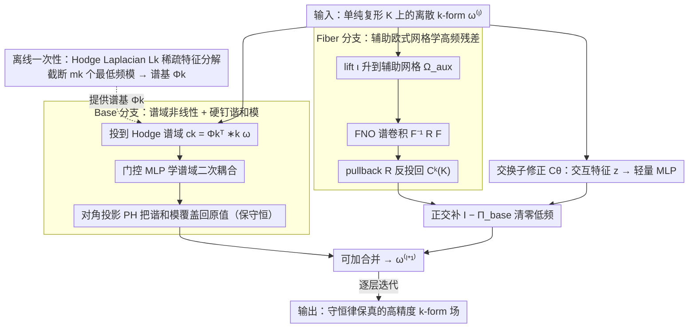

# Topology-Preserving Neural Operator Learning via Hodge Decomposition

**会议**: ICML 2026  
**arXiv**: [2605.13834](https://arxiv.org/abs/2605.13834)  
**代码**: https://github.com/ContinuumCoder/Hodge-Spectral-Duality (有)  
**领域**: 3D视觉 / 神经算子 / 流形PDE  
**关键词**: Hodge分解, 神经算子, 离散外微分, 流形PDE, 谱方法

## 一句话总结
本文提出 Hodge Spectral Duality (HSD) 神经算子，把流形 PDE 的解算子按 Hodge 正交分解拆成"低频拓扑分量（谱基底）+ 高频几何分量（FNO 辅助网格）"双分支，再用一个交换子修正项耦合二者，从而在复杂网格上同时获得高精度与守恒律保真。

## 研究背景与动机

**领域现状**：神经算子（FNO、DeepONet、PINN）在欧几里得规则网格上已经能学到分辨率无关的解算子映射，但实际工程的 PDE 多发生在带边界、有曲率、有非平凡拓扑的 Riemann 流形上（汽车气动表面、地球物理球面、生物器官几何）。这类物理场天然是微分形式：0-form（标量势）、1-form（流量）、2-form（涡量/通量），它们的演化受 de Rham 上同调结构与 Riemann 度量两类约束。

**现有痛点**：现有方法各自有结构性短板。GNN 类局部消息传递存在 over-smoothing / over-squashing，无法捕捉由 Hodge Laplacian 零空间决定的全局拓扑；FNO 类外蕴谱方法对欧式网格上的 FFT 友好，但对上同调与边界拓扑是"软约束"，谐和分量只能通过 loss 惩罚保住；intrinsic 几何方法（geodesic / tangent bundle conv）虽然保流形结构，但 kernel 需要几何自适应，大网格上计算量爆炸且对高频细节无力。

**核心矛盾**：拓扑约束（来自 Hodge Laplacian $\Delta_k=d\delta+\delta d$ 的核空间，对应守恒律与全局环量）与几何约束（来自度量 $g$ 与材料张量 $\kappa$，主导高频边界层、各向异性扩散）来自两种完全不同的代数结构，单一表征空间难以同时高效逼近这两类成分，由此产生"效率-表达力-拓扑保真"三角 trade-off。

**本文目标**：构造一个既分辨率无关、又结构守恒的神经算子框架，能在通用 Riemann 流形上学习 PDE 解算子，同时硬约束拓扑不变量（Betti 数 $b_k$、环量、通量）。

**切入角度**：作者注意到 Hodge 正交分解可以把任意 $k$-form 唯一拆为梯度型 + 旋度型 + 谐和型三个**正交**子空间，这种正交性意味着算子级别上可以做"加法逼近"——把 $\mathcal{G}_\theta^k$ 拆成低频拓扑分支 $\mathcal{G}_{\mathrm{base},\theta}^k$ 和高频几何分支 $\mathcal{G}_{\mathrm{fiber},\theta}^k$，两者落在正交子空间里互不干扰。

**核心 idea**：用离散外微分 (DEC) 把 Hodge Laplacian 的低频特征向量做一次离线特征分解作为 "Base 空间"专门学拓扑驱动的低频响应；用 FNO 在一个辅助欧式网格上学度量驱动的高频残差，并用正交投影 $(\mathbf{I}-\Pi_{\mathrm{base}})$ 强制把它约束到 Base 的正交补；最后用 Lie-Trotter 算子分裂的交换子修正项 $\mathcal{C}_\theta$ 补偿两个非交换算子之间的分裂残差。

## 方法详解

### 整体框架
HSD 把每一层算子学习写成"Base 分支 + Fiber 分支 + 交换子修正"的可加结构：

$\boldsymbol{\omega}_k^{(\ell+1)}=\mathcal{G}_{\mathrm{base}}^{(\ell)}(\boldsymbol{\omega}_k^{(\ell)})+(\mathbf{I}-\Pi_{\mathrm{base}}^k)\bigl[\mathcal{G}_{\mathrm{fiber}}^{(\ell)}(\boldsymbol{\omega}_k^{(\ell)})+\mathcal{C}_\theta^{(\ell)}(\mathbf{z}^{(\ell)})\bigr]$

输入是单纯复形 $K$ 上的离散 $k$-form（节点上的 0-form、边上的 1-form、面上的 2-form）；离线阶段先做一次 $\mathbf{L}_k \mathbf{\Psi}_k = \mathbf{\Psi}_k \mathbf{\Lambda}_k$ 稀疏特征分解，截断成 $m_k$ 个最低频特征向量构成谱基 $\mathbf{\Phi}_k$；在线阶段把场分别投影到 Base 空间（谱系数）和经过 lift 算子 $\iota$ 投影到辅助欧式网格做 FFT；输出经过反投影与正交补约束后相加。关键点是 Base 直接相加、而 Fiber 与交换子修正都先被 $(\mathbf{I}-\Pi_{\mathrm{base}})$ 约束到 Base 的正交补，保证两支落在互补子空间互不干扰。

### 关键设计

**1. Base 分支：在 Hodge 谱域学非线性，并硬钉住谐和模**

FNO 的 soft penalty 守不住守恒律，GNN 又抓不到全局环量，根因是拓扑约束来自 Hodge Laplacian 的核空间、只有谐和模能编码它。Base 分支专门处理这块：每层先用 Hodge 内积把场投到低维谱域 $\mathbf{c}_k^{(\ell)}=\mathbf{\Phi}_k^\top *_k\boldsymbol{\omega}_k^{(\ell)}\in\mathbb{R}^{m_k}$，用预计算的谱域微分矩阵 $\mathcal{M}_d^{(k)},\mathcal{M}_\delta^{(k)}$ 拼出 $(k\pm1)$ 阶导数特征，再过门控 MLP 学谱域的二次非线性耦合（如对流项 $\mathbf{u}\cdot\nabla\mathbf{u}$）：

$$\tilde{\mathbf{c}}_k=\mathbf{W}_{\mathrm{out}}\big(\phi(\mathbf{W}_g\mathbf{q})\odot(\mathbf{W}_c\mathbf{q})\big)+\mathbf{c}_k.$$

关键一步在更新之后：用对角投影 $\mathbf{P}_H^k$ 把零特征值（谐和）模的位置**直接覆盖回原值**，从而逐层硬保上同调类与全局通量不变。这之所以可行又划算，是因为谐和模数量等于 Betti 数 $b_k$、只有几个到几十个，完全能硬钉死而不影响高频可学性。

**2. Fiber 分支：辅助欧式网格上学高频残差，再用正交补清零低频**

度量驱动的高频细节（各向异性扩散、边界层）该交给擅长 FFT 的 FNO，但不能让它偷偷动到守恒分量。Fiber 分支用 Whitney form + KDE 的 lift 算子 $\iota$ 把离散 cochain 升到辅助欧式网格 $\Omega_{\mathrm{aux}}$ 上的张量场，跑标准 FNO 谱卷积 $\mathcal{F}^{-1}\mathbf{R}_{\mathrm{loc}}\mathcal{F}$，再用伴随 pullback 算子 $\mathcal{R}$ 反投回 $C^k(K)$，最后强制乘上 $(\mathbf{I}-\Pi_{\mathrm{base}}^k)$ 把所有低频成分清零、确保 Fiber 只修高频。相比 intrinsic 流形卷积，欧式网格 FFT 复杂度只有 $\mathcal{O}(N\log N)$ 且自带各向异性表达力；正交补硬约束则是 Hodge 分解正交性的直接利用——Base 和 Fiber 落在互补子空间，互不干扰。

**3. 交换子修正 $\mathcal{C}_\theta$：补偿两个非交换算子的分裂残差**

把 Base、Fiber 简单相加隐含了 Lie-Trotter 算子分裂，但拓扑算子 $\mathcal{A}_{\mathrm{Topo}}^k$ 与几何算子 $\mathcal{A}_{\mathrm{Geom}}^k$ 不交换（$[\mathcal{A}_{\mathrm{Topo}}^k,\mathcal{A}_{\mathrm{Geom}}^k]\neq0$），二阶以上有 $O(\Delta t^2)$ 的系统性残差、单纯加和表达不了 $AB-BA$ 这个交叉项。作者把几何 lift 特征 $\iota(\boldsymbol{\omega}_k)$ 和谱域一阶导 $(\mathbf{c}_k,\mathcal{M}_d\mathbf{c}_k,\mathcal{M}_\delta\mathbf{c}_k)$ 拼成交互特征 $\mathbf{z}^{(\ell)}$，过一个轻量 MLP 输出修正量，同样用 $(\mathbf{I}-\Pi_{\mathrm{base}})$ 约束到 Fiber 子空间，门控初始化接近零、从解耦态出发逐渐学到耦合。消融显示去掉它在 Magnetostatics 上误差升 18%，证实这个小修正项确实消除了分裂偏差。

### 损失函数 / 训练策略
端到端 MSE 监督（无 PDE residual 损失），离线阶段一次性完成 $\mathbf{L}_k$ 稀疏特征分解（在 $\sim 20k$ 元四面体网格上约 57s），在线训练成本为 $\mathcal{O}(Nk)$ 谱投影 + $\mathcal{O}(N\log N)$ FFT，整体训练时间显著低于 MGN 类消息传递。

## 实验关键数据

### 主实验
在 DrivAerNet++ 汽车气动、多连通区域磁静场、环面平流-扩散三个任务上对比，所有方法参数量统一在 207k–310k 范围，结果如下：

| 任务 | 模型 | MSE↓ | 谱保真度↑ | $\beta_0$ 得分↑ | IoU↑ |
|------|------|------|----------|----------------|------|
| Ext. Aero | FNO-3D | $1.80\times 10^{-2}$ | 0.7110 | 0.5584 | 0.3010 |
| Ext. Aero | HSD | $\mathbf{1.08\times 10^{-2}}$ | **0.8423** | **0.6112** | **0.3398** |
| Magnetostatics | DeepONet | $2.89\times 10^{-4}$ | 0.9468 | 0.7877 | 0.7834 |
| Magnetostatics | HSD | $\mathbf{1.84\times 10^{-4}}$ | **0.9492** | **0.8176** | **0.8110** |
| Toroidal | FNO-3D | $5.55\times 10^{-4}$ | 0.9079 | 0.6721 | 0.7515 |
| Toroidal | HSD | $\mathbf{3.56\times 10^{-4}}$ | **0.9115** | **0.7829** | **0.8131** |

HSD 在三任务上 MSE 都比次优方法降低 36%–40%；在拓扑保真度（$\beta_0$ 得分，衡量连通分量一致性）上提升尤其显著。

### 消融实验

| 配置 | Magnetostatics | Ext. Aero | Toroidal |
|------|----------------|-----------|----------|
| HSD 完整版 | $1.84\times 10^{-4}$ | $1.08\times 10^{-2}$ | $3.56\times 10^{-4}$ |
| w/o $\mathcal{C}_\theta$（去交换子） | $2.18\times 10^{-4}$ (+18%) | $1.17\times 10^{-2}$ (+8%) | $3.79\times 10^{-4}$ (+6%) |
| w/o $\Pi_{\mathrm{base}}$（去正交投影） | $2.20\times 10^{-4}$ (+20%) | $1.45\times 10^{-2}$ (+34%) | $3.72\times 10^{-4}$ (+4%) |
| 直接 FNO-3D 基线 | $8.51\times 10^{-4}$ (+363%) | $1.80\times 10^{-2}$ (+67%) | $5.55\times 10^{-4}$ (+56%) |

谱模数 $k=64\to 256$ 实验显示 MSE 单调下降但收益递减（Magnetostatics 仅再降 14%），印证"Base 只需要少量低频模 + Fiber 补高频"的对偶设计哲学。

### 关键发现
- 正交投影 $\Pi_{\mathrm{base}}$ 对几何复杂域（Ext. Aero）影响最大，去掉后 MSE 涨 34%，原因是 FNO 谱卷积会引入非物理低频噪声污染守恒分量。
- 交换子修正 $\mathcal{C}_\theta$ 对多连通域（Magnetostatics）影响最大，去掉后涨 18%，证实拓扑-几何算子非交换性必须显式补偿。
- 在外部气动任务上把推理网格从 3000 节点加密到 7000 节点，HSD 误差只波动 30%，而所有 baseline 误差至少放大 10 倍，说明 HSD 真正学到了 PDE 算子而非网格特定映射。
- 训练效率上 HSD 在 Ext. Aero 上比 MGN 快 56×（33s vs 1865s），在 Magnetostatics 上只用 MGN 5% 时间，证明离线谱分解 + 在线低维更新的设计在工程上可行。

## 亮点与洞察
- **算子级的可加分解**：Hodge 正交性给出了"拓扑模和几何模严格正交"这一极强的代数结构，使得双分支不仅是工程 trick，而是有数学合理性的算子分裂——这种"按子空间分工"的思路完全可以迁移到其他带几何先验的学习任务（如流形上的扩散模型、几何 GAN）。
- **硬约束 vs 软惩罚**：把谐和模的更新直接用对角投影覆盖回原值，是"硬保拓扑不变量"的代表性做法。相比 PINN 类把守恒律放进 loss，这种结构性硬约束既不需要调权重又有数学保证。
- **离线-在线解耦**：把昂贵的几何编码（稀疏特征分解）放离线、在线只做低维谱更新和 FFT，对工程部署友好——同一几何复用多次推理时摊销成本几乎为零。
- 交换子修正项 $\mathcal{C}_\theta$ 是个被低估的设计：很多"双分支"工作都默认两个分支可加，但当底层算子非交换时这种假设必然漏掉二阶项；显式建模 $[A,B]$ 这一思想在多模态融合、混合架构里都有借鉴价值。

## 局限与展望
- 依赖一次性离线 Hodge Laplacian 稀疏特征分解，仅支持固定几何或等距/小扰动场景；时变几何（每步重新网格化）目前不支持，作者展望用 Functional Maps 或 iso-spectral deformation 实现低成本谱基迁移。
- 当前框架只针对 3D 及以下流形的 Eulerian 视角仿真；Lagrangian 粒子追踪、强不连续（激波、相界）尚不适用，因为辅助欧式网格 mollification 是低通的，无法表示间断。
- 实验全部在 3000 节点中等规模网格上，工业级百万级网格的可扩展性、特征分解稳定性、内存占用尚未验证。
- 交换子修正项的近似（轻量 MLP）能否覆盖更高阶分裂残差缺乏理论刻画，存在改进空间——可以考虑高阶分裂格式（Strang splitting、Yoshida-4）或学习更结构化的修正算子。

## 相关工作与启发
- **vs FNO/Geo-FNO**：FNO 在欧式网格上做谱卷积，Geo-FNO 用 diffeomorphism 把几何映回欧式；HSD 不试图把几何"拉直"，而是直接在 Hodge 谱域定义算子学习，从根本上保留了流形上同调结构。
- **vs DeepONet**：DeepONet 用 branch-trunk 内积做全局拟合，在某些任务（如 Magnetostatics）的标量场上 MSE 不错，但拓扑保真度低（IoU 0.78 vs HSD 0.81）；HSD 用谐和模硬约束系统性领先于这类全局拟合。
- **vs GNN/MGN 类**：消息传递必然有 over-smoothing / over-squashing，难抓全局通量；HSD 把全局结构外包给谱基，只让局部 FNO 处理高频，从架构上避开 GNN 短板。
- **vs Topological Deep Learning (SCN/SCNN)**：现有 TDL 工作主要做分类/插值，缺少连续算子映射；HSD 是第一个把 DEC + 神经算子结合起来的工作，把 TDL 推进到 operator learning 领域。

## 评分
- 新颖性: ⭐⭐⭐⭐⭐ Hodge Spectral Duality 在数学结构（正交分解）和工程实现（双分支+交换子）层面都有原创贡献，把代数拓扑与神经算子真正打通。
- 实验充分度: ⭐⭐⭐⭐ 三任务覆盖闭曲面、多连通域、非零亏格环面，指标维度齐全（精度+守恒+拓扑），消融完整；但网格规模偏小且未在大规模工业 CFD 验证。
- 写作质量: ⭐⭐⭐⭐ 数学符号严谨、问题动机清晰、附录推导完备；个别地方公式密度高需要 DEC 背景才看得动。
- 价值: ⭐⭐⭐⭐⭐ 给科学计算/CAE 领域提供了"既快又准还保守恒"的神经算子新基线，工业 CFD/电磁仿真等场景有直接落地潜力。

<!-- RELATED:START -->

## 相关论文

- [\[ICLR 2026\] DRIFT-Net: A Spectral--Coupled Neural Operator for PDEs Learning](../../ICLR2026/physics/drift-net_a_spectral--coupled_neural_operator_for_pdes_learning.md)
- [\[ICLR 2026\] One Operator to Rule Them All? On Boundary-Indexed Operator Families in Neural PDE Solvers](../../ICLR2026/physics/one_operator_to_rule_them_all_on_boundary-indexed_operator_families_in_neural_pd.md)
- [\[CVPR 2026\] NESTOR: A Nested MOE-based Neural Operator for Large-Scale PDE Pre-Training](../../CVPR2026/physics/nestor_a_nested_moe-based_neural_operator_for_large-scale_pde_pre-training.md)
- [\[ICML 2026\] EqGINO: Equivariant Geometry-Informed Fourier Neural Operators for 3D PDEs](eqgino_equivariant_geometry-informed_fourier_neural_operators_for_3d_pdes.md)
- [\[ICCV 2025\] JPEG Processing Neural Operator for Backward-Compatible Coding](../../ICCV2025/physics/jpeg_processing_neural_operator_for_backward-compatible_coding.md)

<!-- RELATED:END -->
