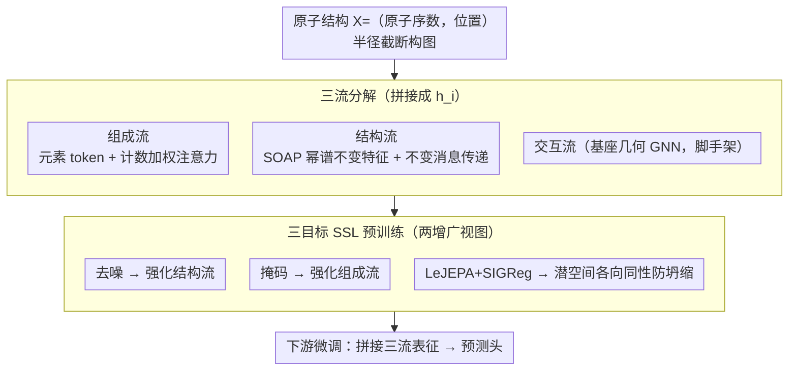

# TriForces: Augmenting Atomistic GNNs for Transferable Representations

**会议**: ICML 2026  
**arXiv**: [2605.20581](https://arxiv.org/abs/2605.20581)  
**代码**: https://github.com/Ramlaoui/triforces (有)  
**领域**: 物理 / 原子级机器学习势 / 几何图神经网络  
**关键词**: MLIP, 自监督预训练, 三流架构, SOAP 描述子, 迁移学习  

## 一句话总结
TriForces 把原子级图神经网络拆成「组成-结构-交互」三条平行流，再叠加 LeJEPA + 去噪 + 掩码的多目标自监督预训练，让 MLIP 在小样本迁移、跨域微调和相似结构检索三种场景下都比单流基座更稳。

## 研究背景与动机

**领域现状**：基于 DFT 数据训练的机器学习原子间势 (MLIP) 已经成为材料发现与分子动力学的主力工具。MACE、eSEN、Orb-v3 这类几何 GNN 在 OMat24、MPtrj 等大规模数据上预测能量与力的精度已经接近 DFT 自身的误差。

**现有痛点**：实际应用几乎总是要在小而贵的下游数据上微调，而当前 MLIP 的迁移性极不稳定 —— 同一个在 100M 结构上预训练好的模型，在「预测晶系」「预测多数元素」这种诊断任务上甚至微调不动。换会议、换泛函、换体系都会导致性能大幅波动。

**核心矛盾**：表征是为预测能量/力优化的，而不是为复用优化的。监督训练把组成信息和几何信息缠绕在同一个潜向量里，下游若只关心组成或只关心几何，就拿不到干净的可重用表征；自监督学习虽然在视觉/语言里证明能保留语义结构，但原子领域之前主要把 SSL 当成辅助损失，没系统验证 SSL 如何与架构归纳偏置交互。

**本文目标**：拆解为两个子问题 —— (1) 如何让架构本身就显式保留组成与几何信息；(2) 如何让 SSL 在低数据迁移、表征组织、检索这些「预测之外」的任务上真正起作用。

**切入角度**：作者观察到「能量与力的耦合梯度」在保守式训练中会互相竞争，而现有方法靠分阶段调度、特殊初始化等 trick 缓解。如果把组成相关的「保力」自由度独立出来，就有希望同时把能量 MAE 拉低、又不牺牲力 MAE。

**核心 idea**：用「三流分解 + 多目标 SSL」替代单流监督训练，让组成、结构、交互三类信息在表征空间里有专属通道。

## 方法详解

### 整体框架
输入是原子结构 $\mathcal{X}=(\{z_i\},\{\mathbf{x}_i\})$，包含原子序数 $z_i$ 与位置 $\mathbf{x}_i$，构图用半径截断。TriForces 把节点级表征拆成三段拼接：$\mathbf{h}_i=[\mathbf{h}^{\text{comp}}_i,\mathbf{h}^{\text{struct}}_i,\mathbf{h}^{\text{int}}_i]$——组成流、结构流各管一类信息，交互流就是原有的基座几何 GNN（脚手架）。预训练在 LeMat-Bulk 的 5M 体相结构上跑，三个 SSL 目标共享同一组随机增广视图、各对齐一条架构流；下游微调时三流一起送入预测头。文中区分三种变体：TriForces-Streams（仅架构，随机初始化）、TriForces（架构+SSL）、Base+SSL（仅 SSL）。

### 关键设计

**1. 组成 Transformer + 计数加权注意力：把纯化学指纹和几何彻底解耦**

监督训练把组成和几何缠在同一个潜向量里，下游若只关心组成就拿不到干净表征。组成流的做法是把结构压成 $T$ 个唯一元素 token $\{(z_t,c_t)\}$，每个 token 用可学元素 embedding $\mathbf{u}_t=\mathbf{e}(z_t)$ 初始化后过 Transformer。关键改动在注意力 logits 上加一个 log-count 偏置

$$a^{(h)}_{ts}=\frac{(\mathbf{q}_t^{(h)})^\top\mathbf{k}_s^{(h)}}{\sqrt{d_h}}+\log(c_s),$$

它严格等价于"让 token 间的注意力等于对所有该类型原子做注意力"，却把复杂度从 $\mathcal{O}(N^2)$ 降到与原子数无关的 $\mathcal{O}(T^2)$。和 Roost、CrabNet 把化学计量比归一化为分数不同，这里保留绝对计数 $c_t$，因为它本身就编码了体系尺寸、能量量级这类物理信息。

**2. 类型无关的结构流：用旋转不变描述子捕捉跨体系的几何模体**

要让几何信息独立于具体元素身份，结构流借 SOAP 风格的幂谱构造旋转不变特征：对每个邻居位移 $\mathbf{r}_{ij}$ 用径向基 $\phi_k(r)$、实球谐 $Y_{lm}(\hat{\mathbf{r}})$ 与多尺度截断 $s_s(r)$ 联合展开成混合通道，累加成局部密度系数 $c_{\alpha lm}(i)$，再通过幂谱 $p_{\alpha\alpha'l}(i)=\sum_m c_{\alpha lm}(i)c_{\alpha'lm}(i)$ 强制旋转不变，最后接少量不变消息传递层叠加连通拓扑。这一流为什么重要：保守式 MLIP 里力是能量对位置的梯度，组成流加进来的额外自由度只要不破坏几何依赖就能"保力"；类型无关的结构流让能量梯度只通过交互流传播，从理论上避免了能量与力损失梯度互相竞争（附录给了 rank-based 界），这也是 OMat24 上能量 MAE 大降而力 MAE 不退的原因。

**3. 三目标互补的 SSL 预训练：让三个自监督目标各管一条架构流**

光有架构分流还不够，得让自监督目标也对齐这三条通路。预训练在同一组随机增广（位置噪声 + 原子类型掩码 + 随机图构造 + 非等变模型加旋转）下取两个视图，同时驱动总损失

$$\mathcal{L}=\mathcal{L}_{\text{denoise}}+\lambda_{\text{mask}}\mathcal{L}_{\text{mask}}+\lambda_{\text{LeJEPA}}\mathcal{L}_{\text{LeJEPA}},$$

其中去噪 $\mathcal{L}_{\text{denoise}}=\sum_i\|f_\theta(\tilde{\mathcal{G}})_i-\boldsymbol{\epsilon}_i\|^2$ 稳定几何表征、强化结构流，掩码 $\mathcal{L}_{\text{mask}}=-\sum_{i\in\mathcal{M}}\log p_\theta(z_i\mid\tilde{\mathcal{G}})$ 强化组成流学元素共现，LeJEPA 在节点和图两个粒度对齐两视图、并用 SIGReg 把表征压成各向同性高斯防坍缩（不需 stop-gradient 或动量编码器）。三者互补的逻辑很清楚：纯非重建目标只拉对齐、会丢精细差异，纯重建目标又整理不好潜空间组织，组合起来正好一一对应三条架构流。

### 损失函数 / 训练策略
预训练在 LeMat-Bulk 5M 体相结构上从零初始化 eSEN、Orb-v3、MACE 三种 backbone。微调时把三流表征拼接送入下游预测头。OMat24 微调跑 2 epoch，MatBench 用标准 5 折交叉验证。

## 实验关键数据

### 主实验：OMat24 微调（4M 子集）

| Backbone / 模式 | 配置 | E MAE (meV/atom) ↓ | F MAE (meV/Å) ↓ | σ MAE (meV/ų) ↓ |
|------|------|------|------|------|
| Orb-v3 Conservative | Baseline | 107 | 150 | 7.8 |
| Orb-v3 Conservative | + Streams | 35.6 | 149 | 6.2 |
| Orb-v3 Conservative | + TriForces (full) | **19.4** | **95.5** | **4.7** |
| eSEN (equivariant) | Baseline | 104 | 80.3 | 6.3 |
| eSEN (equivariant) | + TriForces (full) | **18.8** | **78.0** | **4.4** |
| MACE (equivariant) | Baseline | 117 | 150 | 8.1 |
| MACE (equivariant) | + TriForces (full) | **34.3** | **142** | **6.1** |

Orb-v3 保守式上能量 MAE 从 107 砍到 19.4，相对提升 82%；同时力 MAE 从 150 降到 95.5，验证了「组成流加进来不破坏力」的理论预期。

### 消融：MatBench 8 任务（vs DFT 标注预训练 baseline）

| 任务（单位） | MACE† | TriForces MACE | Orb† | TriForces Orb | eSEN† | TriForces eSEN |
|------|------|------|------|------|------|------|
| Phonons (cm⁻¹) | 36.7 | 27.6 | 26.2 | 22.6 | 57.8 | **19.5** |
| Log GVRH | 0.082 | 0.073 | 0.063 | 0.058 | 0.093 | 0.058 |
| Perovskites (meV) | 61.4 | 35.1 | 30.7 | 26.5 | 40.1 | **25.6** |
| MP Gap (eV) | 0.370 | 0.250 | 0.194 | 0.132 | 0.392 | 0.139 |
| MP E Form (meV/atom) | 40.8 | 34.4 | 21.1 | 17.1 | 83.5 | 20.2 |

TriForces 在 8 个任务里拿下 6 个 best overall，且全程是自监督预训练，不需要 DFT 标签。Phonons 上 eSEN 从 57.8 直接掉到 19.5。

### 关键发现
- 大规模监督场景下（OMat24 全集），架构分流是主贡献，SSL 只小幅提升最终精度但显著加快收敛；低数据场景下 SSL 才是关键 —— 20K 样本时 TriForces 把能量 MAE 从 81.3 降到 34.6，减幅 57%。
- 保守式（力 = 能量梯度）模型从 TriForces 中获益最大，印证了组成流提供「保力自由度」的假设。
- 与同参数量加宽的 baseline 对比（附录 B.7），TriForces 在 8/8 MatBench 任务和 6/7 QM9 目标上仍占优，排除了「靠参数堆」的解释。
- 学到的潜空间支持按化学、按几何或联合的可分解相似结构检索，开辟了 MLIP 表征「预测之外」的新用法。

## 亮点与洞察
- **架构分流 ≠ 简单多任务**：把组成、结构、交互拆成三条独立编码路径，让 SSL 三目标能各管一摊，互不干扰。这种「架构归纳偏置 × SSL 目标」的对齐设计很值得借鉴到其他多模态/多任务场景。
- **计数加权注意力**是个干净的小 trick：把「按元素去重 + log-count 偏置」与「对所有原子做注意力」严格等价化，既省算力又保留物理意义，可以直接复用到任何 set-based 的化学/分子表征里。
- **能量-力梯度耦合的架构级解法**：之前各家是用调度策略或扩散预训练绕开能量/力损失竞争，TriForces 直接从架构层面给出「保力自由度」，让保守式模型可以一次性训到位，省掉了一堆调参 trick。
- **SSL 角色再定位**：作者明确说 TriForces 不是「又一个 SSL 方法」，而是「架构框架 + SSL 加成」。这种把架构与目标解耦评估的实验设计（TriForces-Streams vs Base+SSL vs TriForces）值得作为多任务方法的标准消融范式。

## 局限与展望
- 三流拼接后参数量上去了（如 TriForces Orb-v3 42M vs Orb-v3 25.5M），虽然附录 B.7 控参数对比仍占优，但部署成本仍是问题，未对推理速度做系统对比。
- SOAP 风格幂谱在大体系上的算力开销没充分展开；类型无关结构流是否会在含 H 的有机分子上丢失关键元素差异，作者未明示。
- LeJEPA + SIGReg 的正则权重 $\lambda$ 是关键超参，没看到对不同体系/任务的敏感性分析。
- 检索结果只给了定性可视化，缺少 nearest-neighbor mAP 这类定量指标。

## 相关工作与启发
- **vs JMP / DFT 预训练 MLIP**：JMP 等用 DFT 标签做监督预训练，TriForces 在 MatBench 上虽然没全部超越 JMP-L，但用自监督就把差距缩到很小，关键是不需要昂贵的 DFT 标签。
- **vs Roost / CrabNet（组成模型）**：它们丢掉几何只看化学计量比，TriForces 把组成流嵌进几何 GNN，既保留组成信号又不丢几何分辨能力。
- **vs Noisy Nodes / 力场去噪**：之前 SSL 在 MLIP 里多作为辅助损失，目标比较单一；TriForces 系统对比了非重建 + 去噪 + 掩码三类目标的互补性，给出了「哪个 SSL 在什么场景下最有用」的实证结论。

<!-- RELATED:START -->

## 相关论文

- [\[ICLR 2026\] Augmenting Representations with Scientific Papers](../../ICLR2026/physics/augmenting_representations_with_scientific_papers.md)
- [\[ICML 2026\] Quiver: Quantum-Informed Views for Enhanced Representations in Large ML Models](quiver_quantum-informed_views_for_enhanced_representations_in_large_ml_models.md)
- [\[AAAI 2026\] Learning Fair Representations with Kolmogorov-Arnold Networks](../../AAAI2026/physics/learning_fair_representations_with_kolmogorov-arnold_networks.md)
- [\[ICML 2026\] PINNfluence: Interpreting PINNs Through Influence Functions](pinnfluence_interpreting_pinns_through_influence_functions.md)
- [\[ICML 2026\] EqGINO: Equivariant Geometry-Informed Fourier Neural Operators for 3D PDEs](eqgino_equivariant_geometry-informed_fourier_neural_operators_for_3d_pdes.md)

<!-- RELATED:END -->
