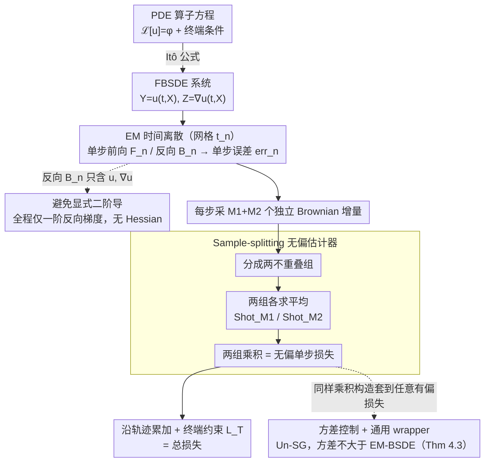

# Unbiased and Second-Order-Free Training for High-Dimensional PDEs

**会议**: ICML 2026  
**arXiv**: [2605.14643](https://arxiv.org/abs/2605.14643)  
**代码**: https://github.com/seojaemin22/Un-EM-BSDE (有)  
**领域**: 科学计算 / 神经 PDE 求解器  
**关键词**: BSDE, 高维 PDE, Euler-Maruyama, 无偏估计, 二阶导数自由

## 一句话总结
本文针对 EM-BSDE 训练 loss 的离散化偏置问题，提出 Un-EM-BSDE：把单步误差用两组独立的 Monte Carlo 子样本平均后做"乘积"形成无偏估计，既消除偏置又不需要 Hessian，在 HJB/BSB/AC 等基准 PDE 上达到 Heun-BSDE / FS-PINNs 的精度但训练时间仅 1.79× EM-BSDE（相比 Heun-BSDE 的 42.91× 与 FS-PINNs 的 32.07×）。

## 研究背景与动机

**领域现状**：高维 PDE 求解器有两大主流——PINNs 把 PDE 残差写进损失函数，但对高频或多尺度解训练不稳；Deep BSDE 利用 PDE 与随机微分方程（SDE）的连接，把问题转化成沿轨迹的概率表示，避开维度灾难。Deep BSDE 又用 Euler-Maruyama（EM）做时间离散，构造 self-consistency loss $\ell_{\text{EM}}=\mathbb{E}[|\text{err}^{\text{EM}}_n|^2]$。

**现有痛点**：Park & Tu (2025) 证明 EM-BSDE loss 在有限步长 $\Delta t$ 下是**离散化-有偏估计**——偏置项 $\frac{1}{2}\text{Tr}[(\sigma^T(\nabla^2 u_\theta)\sigma)^2]$ 直接污染梯度方向。为消偏，他们提出 Heun-BSDE（用 Stratonovich + Heun 积分），但代价是必须显式计算二阶导（Hessian），训练时间是 EM-BSDE 的 **42.91 倍**。Xu & Zhang (2025) 的 Shotgun 方法只能把偏置降为 $1/M$，并不彻底消除。

**核心矛盾**：消偏（无偏）和高效（无二阶导）这两个目标在 BSDE 训练中似乎不可兼得——Heun-BSDE 牺牲效率换无偏，Shotgun/Multi-Shot EM 牺牲无偏换效率，FS-PINNs 用 forward SDE 采样但仍要 Hessian。

**本文目标**：(i) 完全消除 EM 离散化偏置；(ii) 不需要任何 $\nabla^2 u_\theta$ 计算；(iii) 训练时间不能比 EM-BSDE 慢太多；(iv) 对 BZ（fully-coupled FBSDE）、PIDE（带跳跃）这种复杂动力学也能 work。

**切入角度**：利用统计学里的 sample-splitting 经典原理——如果把同一个二阶矩 $\mathbb{E}[X^2]$ 用两个独立子样本 $\mathbb{E}[X_1\cdot X_2]$ 替代，由于 $X_1, X_2$ 独立，$\mathbb{E}[X_1 X_2]=\mathbb{E}[X_1]\mathbb{E}[X_2]=(\mathbb{E}[X])^2$，偏置项（来自 $\text{Var}(X)$）自然消失。

**核心 idea**：用"两组独立 Shot 子样本的乘积"替代"单组样本的平方"，从单步误差形成无偏估计 $\ell^{M_1, M_2}_{\text{UEM}}=\mathbb{E}[\text{Shot}_{M_1}[\text{err}^{\text{EM}}_n]\cdot\text{Shot}_{M_2}[\text{err}^{\text{EM}}_n]]$。

## 方法详解

### 整体框架
PDE $\mathcal{L}[u](t,x)=\phi(t,x,u,\nabla u)$ 通过 Itô 公式转化为 FBSDE 系统 $dX_t=\mu\,dt+\sigma\,dW_t$，$dY_t=\phi\,dt+Z_t^T\sigma\,dW_t$，其中 $Y_t=u(t,X_t)$、$Z_t=\nabla u(t,X_t)$。用 EM 在时间网格 $t_n=n\Delta t$ 上离散，得到单步前向 $F_n(x)=x+\mu\Delta t+\sigma\Delta W_n$ 和反向 $B_n(x;u)=u(t_n,x)+\phi_u\Delta t+\nabla u\cdot\sigma\Delta W_n$。定义单步误差 $\text{err}^{\text{EM}}_n(x;u)=\frac{u(t_{n+1}, F_n(x))-B_n(x;u)}{\Delta t}$。Un-EM-BSDE 在每步采 $M_1+M_2$ 个独立 Brownian 增量 $\Delta W_{n,i}$，把它们分成两组分别求平均后做乘积，得到无偏的单步损失，然后沿轨迹累加。整条流水线只动 loss 的构造方式（采样+分组+乘积），不改动网络与时间步进，因此能保持 EM 一级的训练成本。

### 关键设计

**1. Sample-splitting 无偏估计器：用两组独立噪声的乘积替代单组的平方**

EM-BSDE loss 在有限步长下有偏，根子在于它把同一个噪声 $\Delta W_n$ 同时用于前向和反向，使单步误差的方差被吸进 $\mathbb{E}[X^2]$ 形成偏置项 $\frac12\mathrm{Tr}[(\sigma^T\nabla^2u_\theta\sigma)^2]$。作者借统计学的 sample-splitting：定义 $\text{Shot}_M[\xi]=\frac1M\sum_m\xi_m$，用 $M_1+M_2$ 个 i.i.d. Brownian 增量算出 $M_1+M_2$ 个独立单步误差、分成两个不重叠组求平均后做乘积

$$\ell^{M_1,M_2}_{\text{UEM}}=\mathbb{E}\big[\text{Shot}_{M_1}[\text{err}^{\text{EM}}_n]\cdot\text{Shot}_{M_2}[\text{err}^{\text{EM}}_n]\big].$$

因为两组独立，$\mathbb{E}[X_1X_2]=\mathbb{E}[X_1]\mathbb{E}[X_2]=(\mathbb{E}[X])^2$，来自方差的偏置自然消失。Lemma 4.1 证明它恰好等于连续时间 PDE 残差的平方 $([\mathcal{L}[u_\theta]-\phi_{u_\theta}])^2+O(\Delta t^{1/2})$，完全去掉了 EM 偏置里的 Hessian 项——把方差和均值平方分离，是整个方法的核心机巧。

**2. 避免显式二阶导：始终待在 Itô 框架内，只用一阶梯度**

Heun-BSDE 之所以慢到 42.91×，是因为它走 Itô-to-Stratonovich 转换、会引入二阶空间导校正项、必须算 Hessian；而在 $d$ 维 PDE 里 Hessian 是 $d\times d$ 矩阵，AD 成本是一阶梯度的 $O(d)$ 倍，$d=100$ 量级时直接决定能不能在 GPU 上跑完。Un-EM-BSDE 始终留在 Itô 框架，单步反向公式 $B_n$ 只含 $u,\nabla u$，整条 pipeline 只需要一阶反向梯度（PyTorch/JAX 一行 grad 搞定）。这一点不是额外技巧，而是 sample-splitting 消偏后"不必再引二阶项纠偏"的自然结果——既无偏又无 Hessian，正是它能把训练时间压到 1.79× 的原因。

**3. 方差控制 + Shotgun 通用 wrapper：证明不引入额外方差，并把方法推广成通用消偏器**

sample-splitting 用 cross-moment 替代 second moment，cross-moment 比 second moment 噪、容易引入额外方差，所以方差分析是实用性的关键。Theorem 4.3 证明在 $\alpha=2/M-1/(2M_1)-1/(2M_2)\ge4/(3M+\beta M^4)$、$\beta=1/(2M^2)-1/(4M_1M_2)>0$ 的条件下，$\mathbb{V}[\hat\ell^{M_1,M_2}_{\text{UEM}}]\le\mathbb{V}[\hat\ell^M_{\text{SG}}]\le\mathbb{V}[\hat\ell_{\text{EM}}]$，即 $M_1=1,M_2=2$ 的估计器方差不比 EM-BSDE 大。同样的乘积构造还能套到任意有偏单步损失上做通用消偏——套到 Shotgun loss 得到 Un-SG，在 BSB 硬约束上 RL2 降 2.67×、训练时间只增 1.78×。这把单点贡献放大成"任意有偏单步损失都能被无偏化"的一类技术。

### 损失函数 / 训练策略
实验默认 $M_1=M_2=5$。基线对比：Shotgun 用 $M=50$，Multi-Shot EM 用 $M=10$，使内部采样 budget 与 $M_1+M_2=10$ 对齐。损失既支持 soft constraint（终端条件作为额外损失项 $L_T$）又支持 hard constraint（trial function 形式内置）。算法伪代码（Algorithm 1）展示 batched 实现：对 batch size $B$、时间步 $N$、shot 数 $M_1+M_2$，张量 $X\in\mathbb{R}^{B\times(N+1)\times(M_1+M_2)\times d}$ 一次性存所有候选状态，并行计算前向轨迹与每条 shot 的单步预测 $\hat Y[b,n+1,i]$，最后按组聚合做乘积。

## 实验关键数据

### 主实验

5 个基准 PDE 上 RL2 误差（×$10^{-2}$），bold 标 best，underline 标 second-best：

| PDE / 约束 | EM-BSDE（有偏） | Shotgun（有偏） | Multi-Shot EM | Heun-BSDE（无偏） | FS-PINNs（无偏） | **Un-EM-BSDE（本文）** |
|------------|-----------------|------------------|---------------|--------------------|-------------------|-------------------------|
| HJB soft | 0.4055 | 1.1409 | 0.1617 | 0.1424 | **0.0867** | _0.1348_ |
| BSB soft | 0.3483 | 39.99 | 0.1046 | 0.1030 | **0.0478** | _0.0814_ |
| AC soft | 0.0462 | 0.0951 | _0.0206_ | 0.0774 | 0.0325 | **0.0147** |
| BSB hard | 0.3456 | 0.1629 | 0.0739 | 0.0201 | **0.0048** | _0.0120_ |
| PIDE hard | 0.0374 | 0.4057 | 0.0245 | 0.1874 | **0.0137** | _0.0226_ |

训练时间倍数（Table 1）：

| 方法 | Unbiased | 2nd-order-free | 训练时间 |
|------|----------|----------------|----------|
| EM-BSDE | ✗ | ✓ | 1× |
| Shotgun | ✗ | ✓ | 0.75× |
| Multi-Shot EM-BSDE | ✗ | ✓ | 1.74× |
| Heun-BSDE | ✓ | ✗ | **42.91×** |
| FS-PINNs | ✓ | ✗ | **32.07×** |
| **Un-EM-BSDE（ours）** | ✓ | ✓ | **1.79×** |

### 消融实验

| 配置 | 效果 |
|------|------|
| Un-EM-BSDE 完整 | 几乎所有 setting 都是 second-best 或 best |
| 把 sample-splitting wrapper 套到 Shotgun（Un-SG） | BSB hard 上 RL2 降 2.67×，时间增 1.78× |
| Hard constraint vs Soft constraint | Hard 在复杂动力学（BZ、PIDE）下显著更稳，soft 受 loss balancing 影响 |
| BZ（fully-coupled FBSDE） soft | Un-EM 在 5.18 量级，Shotgun 飙到 86.53 |

### 关键发现
- **效率不降反而是杀手锏**：在 $d$ 高维场景下，Heun-BSDE 和 FS-PINNs 因为 Hessian 计算可能"根本跑不完"，Un-EM-BSDE 的 1.79× 时间是 sweet spot。
- **Wrapper 的通用性比方法本身更值钱**：把同样的乘积构造套到 Shotgun 上立刻获得 2.67× 精度提升，说明这是个一类的消偏技术（适用于任何"同噪声前向 + 反向"的单步损失）。
- **复杂动力学（BZ、PIDE）下 hard constraint 更友好**：soft constraint 的 loss balancing 问题在 fully-coupled / jump 场景中被放大，hard constraint 由于免去权重调优更稳定，这是个非常实用的工程提示。
- **方差不会爆**：理论 Theorem 4.3 + 实验都验证 Un-EM 估计器方差不大于 EM-BSDE，sample-splitting 的"经典 concern"在这里不构成实际问题。

## 亮点与洞察
- **统计学经典招式的精准应用**：sample-splitting 在统计推断里是老 trick，但把它精准 plug 进 BSDE 单步损失的位置，让消偏与效率同时实现，体现了对问题本质的深刻理解——偏置项就藏在 $\text{Var}(X)$ 里，独立采样自动隔离它。
- **通用 wrapper 设计**：Sec 5.3 把方法抽象成"任何带 $\tau$-参数的有偏单步损失都能套同样构造"，这种 framework-level 贡献让论文价值远超单一算法。
- **Itô vs Stratonovich 的避免**：Heun-BSDE 强制走 Stratonovich 是为了得到无偏，但因此引入 Hessian；Un-EM 直接在 Itô 框架内通过随机化拿到同样的无偏性，跳出了 stochastic calculus 选择的两难。
- **理论与实验配合紧密**：Lemma 4.1（无偏）+ Theorem 4.2（一致性）+ Theorem 4.3（方差）三件套都有对应实验验证，没有"理论好看但实验不灵"的常见 ML 论文病。

## 局限与展望
- 当前理论假设 $\mu, \sigma$ 有界、$u_\theta\in C^{1,2}$，对实际 fully-coupled FBSDE 和 PIDE 这类无界系数 / 跳跃过程，理论保证只是部分覆盖（论文显式承认）。
- 算法需要每步采 $M_1+M_2$ 个独立 Brownian 增量（默认 10 个），相比 EM-BSDE 的 1 个，batched 实现要多分配 $10\times$ 的张量内存，在 $d$ 很大或 batch 很大时可能成为内存瓶颈。
- 实验只跑到 $d\sim 100$ 量级，对真正大规模（$d>1000$）的 PDE 求解器还没有完整 ablation。
- 与现代 SOTA 如 forward-backward 双网络方法（separate networks per step）的对比缺失。
- adaptive time-stepping 在复杂动力学下的扩展被列为 future work，目前固定 $\Delta t$ 在 stiff / multi-scale PDE 上可能 sub-optimal。

## 相关工作与启发
- **vs EM-BSDE (Raissi 2024)**：base method，Un-EM 用随机化 product 消除其偏置，时间仅多 79%。
- **vs Heun-BSDE (Park & Tu 2025)**：同样无偏，但 Heun 需要 Hessian、时间 42.91×；Un-EM 完全免 Hessian。
- **vs Shotgun (Xu & Zhang 2025)**：Shotgun 把偏置降 $1/M$ 但不消除；Un-EM 用同样 wrapper 套到 Shotgun 上立刻无偏化。
- **vs FS-PINNs (Park & Tu 2025)**：FS-PINNs 直接最小化沿 SDE 轨迹采样的 PDE 残差平方，无偏但要 Hessian；Un-EM 通过 BSDE-style 单步损失达到相似精度且免 Hessian。
- **vs Hu et al. (2025) bias-variance trade-off PINNs**：思路同源（独立 sample 形成乘积消偏），本文是这一思想在 BSDE 框架内的特化与扩展。
- **启发**：(a) 把 sample-splitting 推广到其他随机损失（如对比学习、scoring rules）也许同样能消除二阶项偏置；(b) "把噪声拆成两组独立样本"的 trick 也可用于消除 RL 中 value estimation 的 bootstrap 偏置。

## 评分
- 新颖性: ⭐⭐⭐⭐ Sample-splitting 在 BSDE 损失内的应用是清晰且非平凡的贡献，但 sample-splitting 本身是经典思想
- 实验充分度: ⭐⭐⭐⭐ 5 个标准 PDE + 2 个复杂扩展（BZ、PIDE）+ wrapper 推广实验，覆盖很全
- 写作质量: ⭐⭐⭐⭐⭐ Table 1 的"unbiased + 2nd-order-free + time"三栏对照表立刻让贡献一目了然，Lemma/Theorem 编号清晰
- 价值: ⭐⭐⭐⭐⭐ Heun-BSDE 42.91× 慢导致它实用价值很有限，Un-EM 把无偏 BSDE 带回 EM 一级的训练成本，是直接可用的进步

<!-- RELATED:START -->

## 相关论文

- [\[AAAI 2026\] PhysicsCorrect: A Training-Free Approach for Stable Neural PDE Simulations](../../AAAI2026/physics/physicscorrect_a_training-free_approach_for_stable_neural_pde_simulations.md)
- [\[NeurIPS 2025\] Enforcing Governing Equation Constraints in Neural PDE Solvers via Training-free Projections](../../NeurIPS2025/physics/enforcing_governing_equation_constraints_in_neural_pde_solvers_via_training-free.md)
- [\[NeurIPS 2025\] High-order Equivariant Flow Matching for Density Functional Theory Hamiltonian Prediction](../../NeurIPS2025/physics/high-order_equivariant_flow_matching_for_density_functional_theory_hamiltonian_p.md)
- [\[ICML 2026\] EqGINO: Equivariant Geometry-Informed Fourier Neural Operators for 3D PDEs](eqgino_equivariant_geometry-informed_fourier_neural_operators_for_3d_pdes.md)
- [\[NeurIPS 2025\] Neural Emulator Superiority: When Machine Learning for PDEs Surpasses its Training Data](../../NeurIPS2025/physics/neural_emulator_superiority_when_machine_learning_for_pdes_surpasses_its_trainin.md)

<!-- RELATED:END -->
