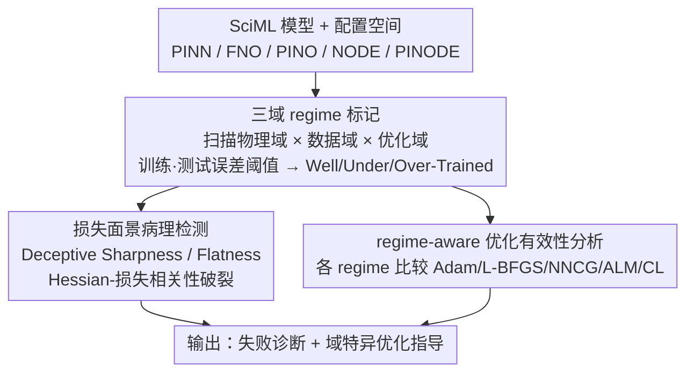

# Unveiling Multi-Regime Patterns in SciML: 不同失败模式与域特异优化

**会议**: ICML 2026  
**arXiv**: [2605.29153](https://arxiv.org/abs/2605.29153)  
**代码**: https://github.com/leastima/sciml_multi_regime  
**领域**: 科学计算 / 神经网络优化 / 损失面景分析  
**关键词**: SciML, 多域分析, PINN, 失败模式, 损失面景

## 一句话总结
通过系统的多域诊断框架揭示 SciML 模型（PINNs、神经算子等）存在的三种一致失败模式——并分析其损失面景特异性，为优化方法选择提供指导。

## 研究背景与动机

**现有问题**：PINNs、神经算子（FNO）和神经 ODE 等 SciML 方法在实际应用中存在优化困难和泛化失败，但缺乏系统的失败模式诊断框架。

**关键观察**：SciML 的损失面景结构比 CV 更复杂，表现为 sharp minima、缺乏连通性和大的 Hessian 特征值——这些特性与 CV 中的直观认知相悖。

**核心矛盾**：标准的 Hessian-损失相关性在 SciML 中失效——低训练损失不对应低曲率，高曲率不对应差的训练效果。

**本文目标**：建立统一的多域诊断框架，理解 SciML 失败的结构性根源，为优化方法选择提供 regime-aware 指导。

## 方法详解

### 整体框架
这是一个 regime-aware 诊断框架，而非新模型。给定一个 SciML 模型，先沿三个轴线系统扫描——（1）物理域（PDE 系数、方程类型）；（2）数据域（训练样本/配置点数量）；（3）优化域（优化器选择、约束处理策略），联合记录训练损失、测试误差和损失面景几何。基于这些测量，用训练/测试误差阈值**自动提取 regime 边界**，把模型行为划成三类失败模式；再在这套 regime 结构上做两件事：检测损失面景里反直觉的**病理现象**，以及按 regime 比较各优化器、给出域特异的优化选择指导。

### 关键设计

**1. 三域 regime 标记：用训练-测试误差自动把 SciML 模型分成三种失败模式**

只看任务级性能很难说清 SciML 到底"哪里坏了"。作者沿物理域（PDE 系数、方程类型）、数据域（样本/配置点数量）、优化域（优化器、约束处理）三个轴系统扫描，再用训练阈值 $T_{\text{train}}$ 和测试阈值 $T_{\text{test}}$ 把每个配置自动归到三类：Well-Trained（Regime I，训练测试都低）、Under-Trained（Regime II，两者都高）、Over-Trained（Regime III，训练低但测试高）。阈值再做 $\pm20\%$ 扰动检验边界稳健性。这样得到的是 task-oblivious 的失败模式视图——绕开"只盯单个任务表现"的局限，让 PINN、FNO、NODE 这些架构差异很大的模型能在同一坐标系下比较失败结构。

**2. 损失面景病理检测：抓出 Hessian 和损失"对不上"的两类反直觉现象**

CV 里"flat minima 泛化好"几乎是常识，但作者发现它在 SciML 里失效，于是同时跟踪最大特征值 $\lambda_{\max}$ 和训练损失的动态曲线，识别两类病理：Deceptive Sharpness（高 Hessian 特征值却对应低训练损失）和 Deceptive Flatness（低 Hessian 特征值却藏着高训练损失）；在 Increasing Sharpening 阶段两者甚至同向变化。进一步用 Hessian 谱密度估计发现 PINNs 缺少 CV 模型（如 ResNet）里那个零特征值峰。这组检测之所以关键，是它定量揭示了标准 Hessian-损失相关性在 SciML 中破裂的根因——landscape 几何本质不同，照搬 CV 的 flat-minima 直觉会误判。

**3. regime-aware 优化有效性分析：证明没有单一最优优化器，要按 regime 选**

诊断之后要落到"怎么选优化器"。作者在每个 regime 下系统比较 Adam、L-BFGS、NNCG、ALM、RoPINN、CL，对每个方法生成物理参数 × 数据量的 2D regime 热图、算相对性能改进。结果很明确：NNCG 在 Regime I 相比 L-BFGS 提升约 50% 测试误差，但在 Regime II/III 里不稳定；ALM 适合约束关键问题，CL 在困难配置下更稳。结论是不存在通吃的优化器，必须 regime-aware 地切换——这把前面的诊断框架直接转化成了可操作的 optimizer 选择指南。

## 实验关键数据

### Regime 结构一致性验证

| 模型 | 数据集 | Regime I | Regime II | Regime III | 关键现象 |
|------|--------|----------|-----------|------------|---------|
| PINN | 1D Convection | $\beta < 25$ | $25 \leq \beta < 50$ | $\beta \geq 50$（稀疏） | 物理参数增大导致边界右移 |
| FNO | 2D Advection-Diffusion | 样本充足 | 中等压力 | 稀疏样本 | 平滑过渡而非 PINN 的 sharp 边界 |
| PINODE | 非线性摆 | 标准配置 | 高维 | 低数据 | 中等特性，介于 PINN 和 FNO |

### 优化方法有效性对比

| 优化方法 | Regime I | Regime II | Regime III | 最佳应用场景 |
|----------|----------|-----------|------------|-----------|
| L-BFGS | ✓ | ✓（易失败） | ✗ | 基础训练 |
| ALM | ✓ | ✓✓（约束硬化） | ✗ | 约束关键问题 |
| CL（课程学习） | ✓ | ✓✓ | ✓ | 困难配置 |
| NNCG | ✓✓（+50%） | ✗（不稳定） | ✗ | Regime I 微调 |

## 亮点与洞察
- **Deceptive Sharpness 反直觉设计**：揭示 SciML 中高曲率区域反而对应优化解，这与 CV 的"flat minima 好"假设相反。
- **Hessian-Loss 相关性破裂**：通过谱密度对比（PINNs 无零特征值峰，ResNet 有），定量证明 SciML landscape 本质不同于 CV。
- **通用失败模式框架**：虽然 PINNs/FNO/NODE 架构差异大，但三域 regime 结构一致出现，表明该失败模式是 SciML 通病。

## 局限与展望
- 实验主要基于较小规模 1D/2D 问题，大规模 3D PDE 泛化性待验证。
- Hessian 计算成本高，难以扩展到大型模型。
- 不同 PDE 系数下 regime 边界位置变化大，难以给出通用阈值。
- 改进方向：设计自适应 regime 检测算法，在线识别当前处于哪个 regime 并自动切换优化策略。

## 相关工作与启发
- **vs Loss Landscape 研究（Yang et al.）**：前者关注 CV/NLP 的 landscape 连通性；本文发现 SciML 缺乏这些性质需要专用诊断工具。
- **vs PINN 优化研究（Krishnapriyan et al.）**：前者分散分析 PINNs 的局部失败现象；本文提供统一的多域视角和定量 regime 标记。

## 评分
- 新颖性: ⭐⭐⭐⭐  将 landscape 诊断从 CV 扩展到 SciML，多维度系统分析是创新。
- 实验充分度: ⭐⭐⭐⭐⭐  涵盖 5 个 SciML 模型 + 4 种 PDE + 5 种优化方法。
- 写作质量: ⭐⭐⭐⭐  逻辑清晰、图表丰富。
- 价值: ⭐⭐⭐⭐  为 SciML 从业者提供清晰的 optimizer 选择指南和失败诊断工具。

<!-- RELATED:START -->

## 相关论文

- [\[ICLR 2026\] Supervised Metric Regularization Through Alternating Optimization for Multi-Regime PINNs](../../ICLR2026/physics/supervised_metric_regularization_through_alternating_optimization_for_multi-regi.md)
- [\[ICLR 2026\] MOSIV: Multi-Object System Identification from Videos](../../ICLR2026/physics/mosiv_multi-object_system_identification_from_videos.md)
- [\[ICML 2026\] Hermite-NGP: Gradient-Augmented Hash Encoding for Learning PDEs](hermite-ngp_gradient-augmented_hash_encoding_for_learning_pdes.md)
- [\[AAAI 2026\] PIMRL: Physics-Informed Multi-Scale Recurrent Learning for Burst-Sampled Spatiotemporal Dynamics](../../AAAI2026/physics/pimrl_physics-informed_multi-scale_recurrent_learning_for_burst-sampled_spatiote.md)
- [\[ICML 2026\] Softplus Attention with Re-weighting Boosts Length Extrapolation in Large Language Models](softplus_attention_with_re-weighting_boosts_length_extrapolation_in_large_langua.md)

<!-- RELATED:END -->
