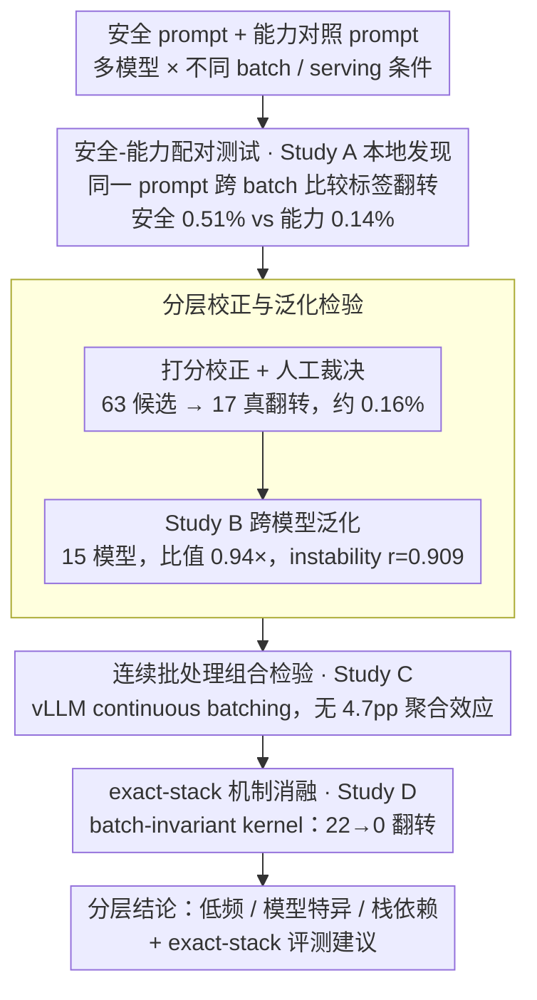

# A Paired Testing Protocol for Batch-Conditioned Refusal Robustness in LLM Serving

**会议**: ICML2026  
**arXiv**: [2605.27763](https://arxiv.org/abs/2605.27763)  
**代码**: 无公开代码（缓存未提供代码仓库）  
**领域**: LLM安全 / LLM评测 / 推理服务鲁棒性  
**关键词**: 拒绝鲁棒性、批处理推理、vLLM、配对测试、安全评测  

## 一句话总结
本文把 LLM serving 中的 batch 条件当作安全评测的处理变量，提出安全提示与能力控制成对比较、人工/打分器校正、跨模型扩展、连续批处理组合和 batch-invariant kernel 消融组成的测试协议，结论是拒绝翻转真实存在但低频、模型特异且依赖具体服务栈。

## 研究背景与动机
**领域现状**：LLM 安全评测通常固定推理服务配置，然后衡量模型是否拒绝有害请求、是否过度拒绝或是否保持能力表现。服务系统侧则关注 batch size、连续批处理、KV cache、调度和 kernel 对吞吐/延迟的影响，很少把这些系统变量纳入安全评测条件。

**现有痛点**：如果同一个 prompt 单独请求、同步 batch 请求或进入 continuous batching scheduler 时输出不同，传统评测很可能看不见这种差异。更麻烦的是，输出变化不一定等于安全问题：它可能只是普通文本不稳定，也可能刚好跨过拒绝/服从边界。因此只报告“batch 会改变输出”不够，必须区分安全标签变化和普通能力标签变化。

**核心矛盾**：batching 一方面是生产服务中常见的性能优化，另一方面它会改变执行顺序、数值路径、co-residence 和 kernel 行为。安全评测若把它当作背景常量，就默认“单请求下的拒绝行为可以代表生产 batch 条件下的行为”，而这正是本文要检验的假设。

**本文目标**：作者不试图证明 batch 普遍危险，而是提出一个能避免过度解读的测试协议：在相同 prompt 和固定 decoding 条件下，对比不同 batch 条件的标签变化；同时用能力控制、打分校正、跨模型验证和 kernel 消融，把真实低频拒绝翻转与测量噪声区分开。

**切入角度**：论文把 batch 条件定义为 treatment variable，把评估单位定义为 conditioned row，即“同一条 prompt 在两个或多个 serving 条件下的配对结果”。这种行级配对比单独统计拒绝率更敏感，也更适合发现边界样本。

**核心 idea**：把拒绝鲁棒性评测从“固定服务配置下打分”改成“在真实服务 batch 条件上做成对干预测试”，并把低频发现、泛化校正和机制消融分层报告。

## 方法详解
本文不是提出新的模型训练方法，而是提出一套安全评测协议和四个证据层。它的逻辑是先用本地扰动研究发现 batch-conditioned refusal flip，再用更大模型集合检查这种信号是否普遍，再用 continuous batching composition 测试多租户共批是否构成额外风险，最后用 batch-invariant kernel 直接做机制消融。

### 整体框架
输入是一组安全提示、能力控制提示、模型和 serving 条件。输出不是单个安全分数，而是按研究层级整理的翻转率、方向、校正后真实翻转比例、跨模型异质性、组合效应和 kernel 消融结果。

四个 study 的角色不同。Study A 是本地发现层，使用三类 1B-3B instruction-tuned 模型，在同步 dispatch、邻居条件、并发量化和显式 true batching 下比较安全与能力标签变化。Study B 扩展到 15 个模型，检查初始安全偏斜是否可泛化，并分析 alignment type 与输出不稳定性是否能预测 fragility。Study C 使用 vLLM FP16 continuous batching，测试 co-batched neighbors 是否带来独立组合效应。Study D 在同一 H100/vLLM 0.19.1 栈上，对 55 个当前 score-flip candidates 比较标准 vLLM 与 `VLLM_BATCH_INVARIANT=1`。

### 关键设计
**1. 安全-能力配对测试：把"安全边界变化"和"普通输出抖动"区分开**

batch 改变输出不一定是安全问题——可能只是普通文本不稳定。为了不把任意 batch-induced 变化误判成安全风险，协议让每条 prompt 同时配一个对照：安全侧用 harmful behavior、jailbreak、truthfulness、bias、over-refusal 相关 prompt，能力侧用 MMLU、ARC-Challenge 等控制任务。每条 row 在不同 batch 条件下分别统计安全标签和能力标签是否翻转。逻辑很直接：如果安全和能力标签同样频繁变化，那更像是泛化输出不稳定；只有当安全侧相对能力侧更容易跨边界时，才真正支持 refusal robustness 风险这个结论。

**2. 分层校正与泛化检验：把稀有信号从打分噪声和小模型偶然性里剥出来**

拒绝翻转是稀有事件，单个正结果极易被过度解读。协议先在 Study A 报告自动打分下的安全/能力翻转，再对 changed rows 做 Unicode normalization、scorer-corrected audit 和人工候选审查，把 operational rate 校准到更保守的范围；随后 Study B 把问题扩展到 15 个模型，报告安全/能力比、fragility 范围、alignment type 的 ANOVA 以及 output instability correlation。这样既保留了"确有边界样本"的发现，又避免把某个小模型上的偶然正结果当成普适风险。

**3. 连续批处理组合检验：把"多租户共批"当成区别于普通 batch 扰动的独立通道单测**

普通的 batch-size 扰动和真实的多租户共批是两种不同的威胁模型——队列化的串行服务可以在没有真正共批重叠的情况下也表现出 batch 敏感性，而 continuous batching 下不同用户请求同时驻留才是真正的 co-residence。Study C 专门把后者单拎出来测：在 vLLM FP16 continuous batching 上，用 5 种 batch-composition 条件、时间重叠扫描、反方向测试和静态/连续批处理对照，检验"同时存在哪些其他请求"是否构成一条独立于普通 batch 扰动的安全通道。结论是双面的：在 4.7 个百分点的最小可检测效应下没有聚合组合效应，但稀有翻转的方向偏 unsafe（每条件 89%-92%，合并 28/31），且 co-batch verification 只有 22.1%。因此论文把它读成一个 underpowered null——"当前证据不足以据此指导 routing"，而不是"组合永远安全"。

**4. exact-stack 机制消融：判断翻转到底依不依赖具体 serving kernel 路径**

部署风险最终取决于真实服务栈，所以与其抽象争论"batch 是否危险"，不如在生产接近的 model/kernel/batch 设定上做验证。Study D 在同一 H100 pod、相同模型、相同 prompt、相同 dispatch mode、temperature 0、max length 2048 下，分别跑标准 vLLM 与 `VLLM_BATCH_INVARIANT=1` 的 batch-invariant kernel。如果标准路径能复现 label flip、而 invariant 路径把 flip 消除，就说明当前这批候选 surface 确实对 batch-sensitive 的执行路径敏感——这把"batch 影响拒绝"的故事从抽象 backend 类别落到了具体 kernel 路径上。

### 损失函数 / 训练策略
本文没有训练损失函数。评测策略是固定 prompt、固定 weights、固定 greedy decoding（temperature 0），只改变 batch size、dispatch synchronization、co-batched composition 或 kernel path。统计解释遵循三条规则：正的本地发现只有在更大扩展或机制检查中得到支持时才升级为可见结论；方向性结果必须同时报告绝对率；不同 study 冲突时，以更大样本或更机制化的 study 决定主张边界。

## 实验关键数据

### 主实验
四个 study 的结果共同支持“低频、模型特异、栈依赖”的结论，而不是“batching 普遍不安全”。

| Study | 测试范围 | 关键指标 | 主要结论 |
|-------|----------|----------|----------|
| A 本地扰动 | 31,410 scored rows，3 个 1B-3B instruction-tuned 模型 | 自动发现安全 0.51% vs 能力 0.14%；增强复现 1.68% vs 0.42%；人工 63 个候选中 17 个真 flip，校正全量约 0.16% | 有真实拒绝边界移动，但 operational rate 很低 |
| B 跨模型扩展 | 127,224 records，15 个模型 | 安全/能力比约 0.94×；fragility 0.00%-2.39%；alignment ANOVA p=0.942；output instability r=0.909 | 不存在普适安全偏斜，模型输出不稳定性是更好预警信号 |
| C 连续批处理组合 | 14,250 records，5 种 batch composition 条件 | 未检测到 4.7pp 以上 aggregate composition effect；28/31 稀有 flip 偏 unsafe；co-batch verification 22.1% | 没有大规模组合效应，但方向性小样本需要监控 |
| D kernel 消融 | 55 个 Study A score-flip candidates，vLLM 0.19.1/H100 | 标准 vLLM: 22 label flips、25 text changes；batch-invariant: 0 label flips、0 text changes | 当前候选 flip 依赖测试栈中的非 invariant 执行路径 |

Study B 的预测因子结果尤其重要：alignment type 不能解释 fragility，而 output instability 与 safety fragility 高度相关。

| 分析项 | 数值 | 解释 |
|--------|------|------|
| safety-to-capability ratio | 0.94× | 跨模型后没有安全侧普遍更高的翻转率 |
| fragility range | 0.00%-2.39% | 模型之间差异明显 |
| alignment type ANOVA | p=0.942，$\eta^2=0.033$ | 可用功效下看不出 alignment 类型与 fragility 有关联 |
| output instability correlation | r=0.909，bootstrap 95% CI [0.65, 0.97] | 批处理下输出越不稳定，拒绝边界越可能脆弱 |
| directional counts | 159 compliance-to-refusal vs 81 refusal-to-compliance | 方向不固定为 unsafe，取决于模型集合 |

### 消融实验
论文最直接的机制消融是 batch-invariant kernel ablation，目标不是估计总体风险，而是检查当前候选翻转是否由 batch-sensitive execution path 承载。

| 模式 | Rows | OK | Label flips | Text changes | 说明 |
|------|------|----|-------------|--------------|------|
| Standard vLLM | 55 | 55 | 22 | 25 | 可复现低频候选翻转，且当前候选集中 flip 都在 safety-domain rows |
| Batch-invariant | 55 | 55 | 0 | 0 | 同模型、同 prompt、同 H100 栈下翻转消失 |

另一个关键分析是 Study A 的 scorer/adjudication 校正，它解释为什么不能把自动发现率直接当作生产风险。

| 校正层 | 结果 | 含义 |
|--------|------|------|
| 原始自动发现 | 安全 0.51% vs 能力 0.14% | 有发现信号，但可能包含打分器伪差 |
| 增强复现子集 | 安全 1.68% vs 能力 0.42% | enriched subset 中方向仍存在 |
| scorer-corrected audit | 26 unsafe-direction vs 18 safe-direction | Unicode/打分修正后方向未完全消失 |
| 人工审查 63 个候选 | 17 个 genuine behavioral flips，约 27% | 多数候选是拒绝措辞变化等自动评分伪差 |
| 校正全量率 | 约 0.16% | 真实 operational rate 应显著低于自动发现信号 |

### 关键发现
- batch-conditioned refusal flip 不是虚构问题。Study A 的 true batching 层仍有 0.80% safety flips，并与 synchronized dispatch 有 99.4% agreement，说明不是纯粹调度假象。
- 初始安全偏斜不能泛化。15 模型扩展中 safety/capability 接近 parity，说明风险不能按 alignment 类型或模型家族简单外推。
- output instability 是最有用的筛查变量。r=0.909 的相关性提示，可以先看模型在 batch 条件下的输出变化率，再决定是否加密集拒绝鲁棒性评测。
- continuous-batch composition 没有显示大 aggregate effect，但稀有 flip 的方向偏 unsafe，且 co-batch verification 只有 22.1%，因此结论是“当前证据不足以指导 routing”，不是“组合永远安全”。
- batch-invariant kernel 消融把机制故事变得更具体：至少在 vLLM 0.19.1/H100/小模型候选集上，非 invariant 执行路径承载了这些翻转。

## 亮点与洞察
- 论文最稳健的地方是克制。它没有停留在“发现 batch 会影响拒绝”这个最吸引眼球的结论，而是继续做跨模型、组合效应和 kernel 消融，把主张收窄到数据真正支持的范围。
- 安全提示和能力控制成对出现，是非常可复用的评测设计。它迫使研究者回答“这是安全边界变化，还是普通输出变化”，避免把系统 nondeterminism 直接包装成 safety finding。
- exact-stack validation 的建议很实用。真实部署中用户关心的是当前模型、当前 batch setting、当前 kernel path 是否改变拒绝行为，而不是某个抽象 backend 类别是否有风险。
- 这篇文章也提醒安全评测要继承系统 benchmark 的纪律：服务配置一旦改变执行 regime，就应该作为评测条件报告，而不是藏在背景设置里。

## 局限与展望
- 所有 study 都处在 sparse-flip regime，方向性统计容易受样本选择和打分器误差影响。虽然论文做了校正，但更大规模的前瞻 benchmark 仍然必要。
- 人工 adjudication 只有单 reviewer，没有 inter-rater agreement，因此 0.16% 校正率更像保守修正层，而不是金标准人口估计。
- Study 之间硬件、模型、打分栈和任务集存在异质性。论文给出的更像 operational doctrine，而不是一个可直接合并的总体 effect size。
- composition study 的 co-batch verification 只有 22.1%，会削弱对实际多租户共批效应的否定强度。
- kernel 消融只覆盖 vLLM 0.19.1、H100 和三个 1B-3B instruction-tuned 模型。更大模型、tensor parallel、其他 backend、随机 decoding 和生产级 scheduler 仍需单独验证。

## 相关工作与启发
- **vs deterministic inference 文献**: 既有工作说明固定 prompt/weights/decoding 下仍可能因 batching、floating point 和 kernel 路径产生输出差异；本文把这个机制类问题转向拒绝安全边界。
- **vs serving systems 文献**: vLLM、continuous batching、KV cache 和调度研究主要优化吞吐与延迟；本文要求把这些变量也纳入 safety envelope。
- **vs quantization safety 文献**: 量化和压缩已被证明会改变 trust/safety 行为；本文强调 batching 也是部署优化的一部分，但其效应比量化更低频、更栈依赖。
- **vs 常规安全 benchmark**: 常规 benchmark 往往把 serving config 固定，本文的启发是 benchmark 报告应至少包含生产 batch setting、能力控制和机制敏感检查。

## 评分
- 新颖性: ⭐⭐⭐⭐☆ 问题定义很新，把 batch condition 明确纳入拒绝鲁棒性测试变量。
- 实验充分度: ⭐⭐⭐⭐☆ 四层证据链完整，但候选稀有、人工校正和 backend 覆盖仍有限。
- 写作质量: ⭐⭐⭐⭐☆ 主张边界清楚，统计解释克制；作为 synthesis paper，部分 study 的原始细节依赖 artifact 背景。
- 价值: ⭐⭐⭐⭐☆ 对 LLM serving 安全评测很有实践意义，尤其适合生产前 exact-stack validation。

<!-- RELATED:START -->

## 相关论文

- [\[AAAI 2026\] Tool4POI: A Tool-Augmented LLM Framework for Next POI Recommendation](../../AAAI2026/recommender/tool4poi_a_tool-augmented_llm_framework_for_next_poi_recommendation.md)
- [\[ICLR 2026\] Token-Efficient Item Representation via Images for LLM Recommender Systems](../../ICLR2026/recommender/token-efficient_item_representation_via_images_for_llm_recommender_systems.md)
- [\[ICML 2025\] RLTHF: Targeted Human Feedback for LLM Alignment](../../ICML2025/recommender/rlthf_targeted_human_feedback_for_llm_alignment.md)
- [\[AAAI 2026\] Align³GR: Unified Multi-Level Alignment for LLM-based Generative Recommendation](../../AAAI2026/recommender/align3gr_unified_multi-level_alignment_for_llm-based_generat.md)
- [\[ACL 2026\] ReRec: Reasoning-Augmented LLM-based Recommendation Assistant via Reinforcement Fine-tuning](../../ACL2026/recommender/rerec_reasoning-augmented_llm-based_recommendation_assistant_via_reinforcement_f.md)

<!-- RELATED:END -->
