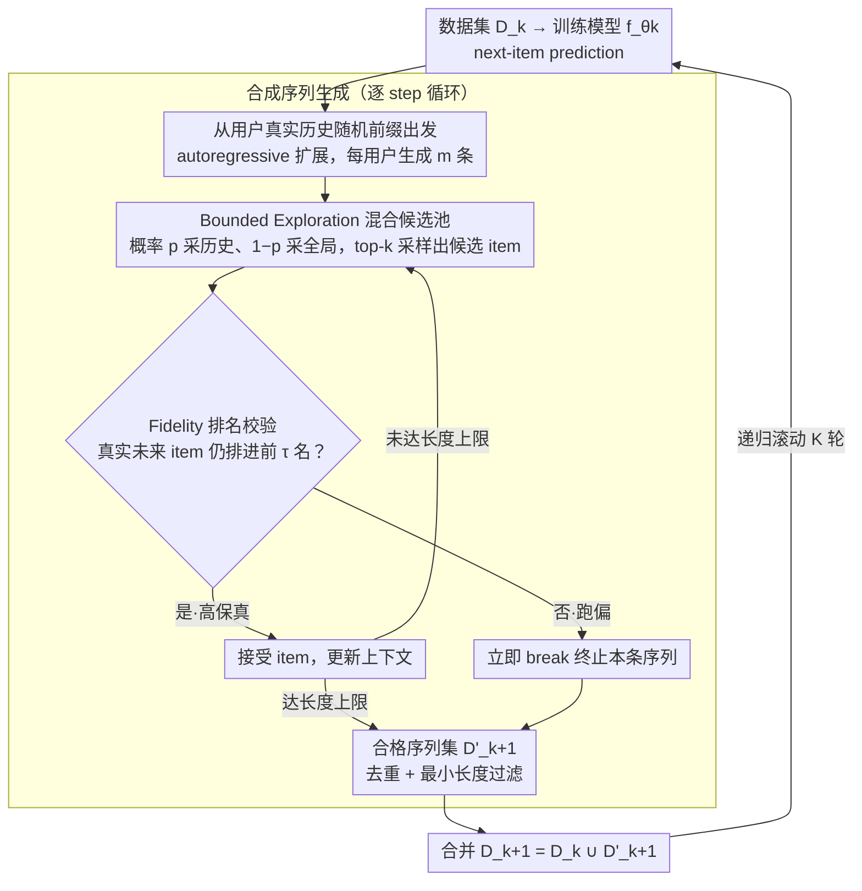

# Can Recommender Systems Teach Themselves? A Recursive Self-Improving Framework with Fidelity Control

**会议**: ICML 2026  
**arXiv**: [2602.15659](https://arxiv.org/abs/2602.15659)  
**代码**: https://github.com/USTC-StarTeam/RSIR  
**领域**: 推荐系统 / 数据增强 / 自训练  
**关键词**: 序列推荐、自训练、数据稀疏、保真度控制、隐式正则化

## 一句话总结
RSIR 让序列推荐模型用自身预测能力生成新的合成用户交互序列、再训练一个新模型，并用基于排名的"保真度检查"过滤掉偏离用户偏好流形的样本，防止 self-consuming model collapse；在 4 个数据集 × 3 个主流 backbone 上稳定提升 NDCG/Recall 4–11%，并理论上证明该过程等价于沿用户偏好流形切空间的隐式正则化。

## 研究背景与动机
**领域现状**：序列推荐主要靠扩大数据与模型解决问题，但任何用户都只接触平台 catalog 的极小比例，交互信号天然极度稀疏。这导致 loss landscape 崎岖、模型收敛到尖锐 minima、泛化差。

**现有痛点**：(1) 数据增强类（Reordering / Insertion / item masking / cropping）只是给现有数据做扰动，不产生新的"高保真用户轨迹"，效果有限；(2) 数据生成类（DiffuASR、DR4SR）能造新序列，但要靠扩散模型/学辅助生成器，训练昂贵；(3) 借 LLM 当 teacher 来扩数据，又把性能瓶颈外包给"足够大的外部模型"，部署上不可控、还有分布失配。

**核心矛盾**：闭环 self-training（自己造数据再训练自己）在 LLM、扩散模型里都被证明能 work，但也极易 model collapse —— 模型偏置和错误会被自己合成的数据放大，几次迭代就性能崩盘。如何在"自生成数据"与"避免误差累积"之间取得平衡，是关键。

**本文目标**：(1) 让推荐模型像 STaR / 自奖励 LLM 那样自我 bootstrap，无需外部 teacher / 标注；(2) 设计一个可靠的"保真度过滤"机制，防止合成数据漂出用户偏好流形；(3) 在理论上解释为什么这种循环不会崩，反而能正则化。

**切入角度**：作者把"自我改进"看成一种数据驱动的隐式正则化 —— 只接受位于用户真实兴趣切空间附近的扰动作为新数据，等价于在 loss landscape 上施加沿 manifold 方向的梯度惩罚，迫使优化收敛到更平坦的 minima。

**核心 idea**：用当前模型生成合成序列 + 用相同模型作"排名裁判"过滤掉跑偏的 step，把这一对组合插入到经典 SFT 循环里，递归滚动多轮。

## 方法详解

### 整体框架
RSIR 在迭代 $k$ 包含 4 步：(1) 在当前数据集 $D_k$ 上训出模型 $f_{\theta_k}$（next-item prediction）；(2) 用 $f_{\theta_k}$ 为每个用户生成 $m$ 条合成序列 $D'_{k+1}$ —— 从用户真实历史的随机前缀出发，autoregressive 扩展；(3) 合并得到 $D_{k+1} = D_k \cup D'_{k+1}$；(4) 从头训 $f_{\theta_{k+1}}$（或 fine-tune 上一轮模型），递归滚动 $K$ 轮。生成时核心是两个机制：Bounded Exploration（混合候选池）+ Fidelity-Based Quality Control（排名校验）；二者的"扰动只沿用户流形切空间"性质，又被理论解释成一项隐式正则化，构成第 3 个关键设计。

### 关键设计

**1. Bounded Exploration 混合候选池：在"挖掘已知兴趣"和"探索新兴趣"之间卡一个比例**

在大词表上完全自由地 autoregressive 生成会让生成空间爆炸、跑飞，但只重排用户已有的 item 又永远扩不出新兴趣。RSIR 在每个生成 step 用概率 $p$ 从用户历史 $s_u$ 内采、概率 $1-p$ 从全局 item 集 $I$ 内采，构成候选池 $\mathcal{C}_t\sim p\cdot\mathrm{Sample}(s_u)+(1-p)\cdot\mathrm{Sample}(I)$，模型只在 $\mathcal{C}_t$ 上做 top-$k$ 采样。$p$ 的经验最优约 0.5——纯 exploit（$p=1$）只重排已知 item，纯 explore（$p=0$）容易跑飞后被质控滤掉；引入历史偏置既保留可控性、又提供"延伸已知兴趣"的能力。

**2. Fidelity-Based Quality Control（保真度排名校验）：每生成一个 item 就试探它会不会让用户跑偏**

这是防止 self-consuming model collapse 的生死线。定义 $S_{tgt}=s_u\setminus S_{ctx}'$ 为用户真实序列里尚未用到的 item，每生成一个候选 item 就立刻检查：若 $\exists i_j\in S_{tgt}$ 使得 $\mathrm{Rank}_{f_{\theta_k}}(i_j\mid S_{ctx}')\leq\tau$（即新上下文下用户真实未来 item 仍被排在前 $\tau$ 名内），就接受这个 item 继续扩展，否则立即 break 终止本条序列。这保证生成轨迹始终与用户真实兴趣流形兼容。作者进一步证明 $\tau$ 越严，"保真度漏报率" $\tilde{p}_k$ 越低，使递归误差递推 $\mathcal{E}(\theta_{k+1})\leq(1-\lambda)\mathcal{E}_0+\lambda[(1-\tilde{p}_k)\rho\mathcal{E}(\theta_k)+\tilde{p}_k\mathcal{E}_{\max}]$ 满足收缩条件，从而避免崩盘。

**3. Manifold Tangential Gradient Penalty：从理论上说明这不是"扩数据"而是"扩对方向的数据"**

为给方法一个理论 footing，作者把"过滤 + 生成"循环重新解释成一种隐式正则化：被接受的扰动只能沿用户偏好流形 $\mathcal{M}$ 的切空间，这等价于在原损失上加了一项 $\Omega(\theta)\propto\|\mathcal{P}_\mathcal{M}\nabla_s f_\theta\|^2$，专门惩罚沿 manifold 方向的梯度幅值，迫使解收敛到与用户真实流形平行的"平坦谷"。这条解释既说明了 RSIR 为什么不是简单的数据增强、而是"扩对的方向的数据"，也指出"漏报噪声地板"才是性能终会饱和的真正原因。

### 损失函数 / 训练策略
每轮就是普通的 next-item prediction NLL，没有改动 loss；超参 grid：$\tau \in \{1,3,5,10,20,50,100\}$，$m \in \{5,10,20\}$，$p \in \{0,0.2,...,1\}$。leave-one-out 评测，K=10/20 报 NDCG/Recall。

## 实验关键数据

### 主实验
4 个数据集 × 3 个 backbone（SASRec / CL4SRec / HSTU），与 5 个数据增强/生成基线比 NDCG@10、Recall@10：

| Backbone | 数据集 | 基线最好 (Recall@10) | +RSIR | 提升 |
|----------|--------|----------------------|-------|------|
| SASRec | Beauty | 0.0557 (DR4SR) | **0.0594** | +6.64% |
| SASRec | Sport | 0.0495 (DR4SR) | **0.0512** | +3.43% |
| CL4SRec | Beauty | 0.0590 (DR4SR) | **0.0649** | +10.00% |
| HSTU | Sport | 0.0515 (DR4SR) | **0.0531** | +3.11% |
| HSTU | Yelp | 0.0386 (Insertion) | **0.0411** | +6.48% |

RSIR-FT（fine-tune 旧权重）与 RSIR（从头训）都稳定优于所有 baseline，CL4SRec 上提升幅度最大约 10%。

### 消融实验
关键消融在 Amazon-Sport + SASRec：

| 配置 | NDCG@10 | Recall@10 | 说明 |
|------|---------|-----------|------|
| Base SASRec | 0.0271 | 0.0474 | 无增强 |
| RSIR-1 w/o fidelity | 0.0273 | 0.0472 | 仅 1 轮、无质控，几乎无提升 |
| RSIR-1 w/ fidelity | **0.0293** | **0.0512** | 1 轮 + 质控 |
| RSIR-2 w/o fidelity | 0.0209 | 0.0384 | 第 2 轮就崩 |
| RSIR-2 w/ fidelity | 0.0294 | 0.0517 | 持续上升 |
| RSIR-3 w/o fidelity | 0.0119 | 0.0210 | 灾难性 collapse |
| RSIR-3 w/ fidelity | 0.0298 | 0.0528 | 仍在涨 |

### 关键发现
- **保真度过滤是生死线**：去掉它 3 轮就完全崩盘（Recall 从 0.0474 跌到 0.0210），印证了 self-consuming model 的 collapse 风险。
- **多轮迭代有"复利"**：HSTU 在 Sport 上首轮 +8% Recall，3 轮后累积到 +14%，但 5–8 轮后逐渐饱和（与理论中的 noise floor 一致）。
- **弱→强迁移可行**：用弱 teacher 生成的数据训强 student 也能拿到 +1.95% 提升，说明 RSIR 受益主要来自隐式正则化而不是 teacher 的绝对能力。
- **数据密度 +342% / 信息熵也涨**：8 轮后训练集密度翻 4 倍多，ApEn（近似熵）也上升；对比 Insertion 虽然也能加数据但 ApEn 下降，证明 RSIR 添加的是"信息丰富"而非噪声。
- **超参数 $p \approx 0.5$、$\tau$ 中等最优** —— 印证 exploration / exploitation trade-off。

## 亮点与洞察
- **第一个把"自我改进"严肃迁移到推荐系统**的工作，且配套了完整的理论分析（流形切空间梯度惩罚 + 递归误差界），把推荐界长期模糊的"数据增强"提到了原理性水平。
- **保真度检查的设计非常巧妙**：不需要外部 critic，直接复用同一个模型的排名分布做 self-verification —— 这种"模型既当生成器又当裁判"的对称结构在 LLM 自训练里也越来越常见，但在推荐里以排名为载体落地很自然。
- "弱模型能教强模型"的实验呼应近期 LLM 的 weak-to-strong generalization 结论，提示在工业场景里可以用小模型廉价生成 curriculum，再喂给生产模型，大大降低部署成本。
- 整体思想可迁移到：序列广告、CTR、对话推荐，乃至任何 next-token prediction + 用户行为序列的任务。

## 局限与展望
- **饱和不可避免**：作者自己承认随迭代次数增加，benefit 衰减、noise floor 显现。如何动态收紧 $\tau$ 或引入自适应过滤是未来方向。
- **保真度只看 top-$\tau$ 排名**，缺少更细粒度的 "user-intent drift" 检测；冷启动或行为单一的用户上可能失效。
- 评测只覆盖中小规模数据集（Amazon × 3 + Yelp），最大物品集仍较小；工业级亿级 item 上 fidelity check 需要 ANN 加速。
- 没有汇报与 LLM-as-teacher 增强（如 LLMRec）的直接对比，要说服读者"自训练真的不需要 LLM"还需补这一对照。

## 相关工作与启发
- **vs DR4SR / DiffuASR**：那些方法靠扩散或学一个生成器造数据，需要额外模型且训练昂贵；RSIR 直接复用 backbone，零外部模型，且首轮就稳定优于它们。
- **vs STaR / Self-Rewarding LLM**：思想同源 —— 模型自评、自训。RSIR 把 LLM 里的"自评 reward"换成了推荐特有的"用户真实序列排名一致性"，并加上理论分析。
- **vs Insertion / Reordering**：那些 heuristic 不能新增 item，只是重排；RSIR 能扩展用户兴趣边界，并通过保真度避免噪声。
- **vs RSIDiff / STEP（自训生成模型 / 视频）**：跨模态印证了 self-improving 的普适性；本文是第一次把这一范式落到推荐。

## 评分
- 新颖性: ⭐⭐⭐⭐ 把 LLM/扩散里的 self-improvement 范式干净迁移到序列推荐，并配了流形切空间的理论解释，原创性高于"又一个数据增强"。
- 实验充分度: ⭐⭐⭐⭐ 4 数据集 × 3 backbone × 5 baseline，多轮迭代、消融、weak-to-strong、运行时分析齐全；缺工业级数据集。
- 写作质量: ⭐⭐⭐⭐ 论文逻辑清晰、定理与实验对应明确，可惜部分实验细节挤在 appendix。
- 价值: ⭐⭐⭐⭐ 在不依赖外部 LLM 的前提下持续提升推荐效果，且工程实现简单（就一个 break 条件），落地友好。

<!-- RELATED:START -->

## 相关论文

- [\[ICLR 2026\] Token-Efficient Item Representation via Images for LLM Recommender Systems](../../ICLR2026/recommender/token-efficient_item_representation_via_images_for_llm_recommender_systems.md)
- [\[ACL 2025\] CoVE: Compressed Vocabulary Expansion Makes Better LLM-based Recommender Systems](../../ACL2025/recommender/cove_compressed_vocabulary_expansion_makes_better_llm-based_recommender_systems.md)
- [\[AAAI 2026\] RecToM: A Benchmark for Evaluating Machine Theory of Mind in LLM-based Conversational Recommender Systems](../../AAAI2026/recommender/rectom_a_benchmark_for_evaluating_machine_theory_of_mind_in_llm-based_conversati.md)
- [\[AAAI 2026\] Hard vs. Noise: Resolving Hard-Noisy Sample Confusion in Recommender Systems via Large Language Models](../../AAAI2026/recommender/hard_vs_noise_resolving_hard-noisy_sample_confusion_in_recommender_systems_via_l.md)
- [\[ICML 2026\] Incentivized Exploration with Stochastic Covariates: A Two-Stage Mechanism Design for Recommender System](incentivized_exploration_with_stochastic_covariates_a_two-stage_mechanism_design.md)

<!-- RELATED:END -->
