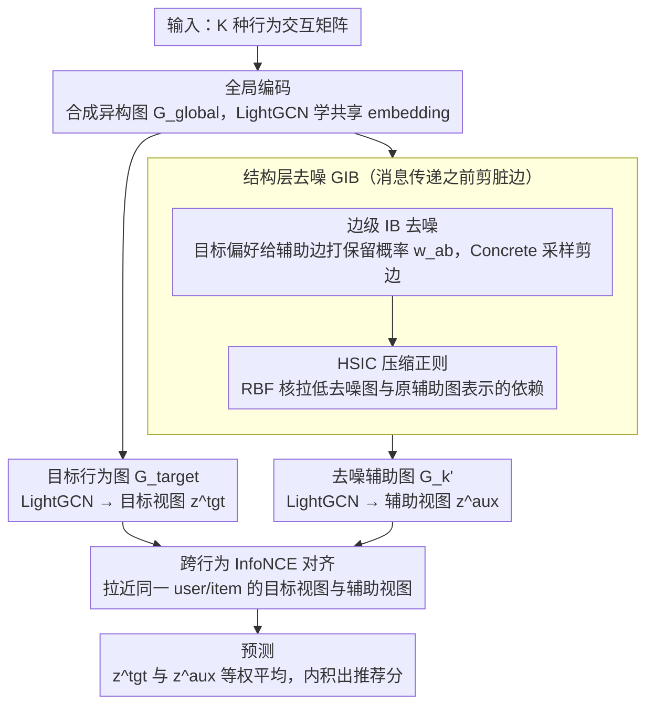

# GCIB: Graph Contrastive Information Bottleneck for Multi-Behavior Recommendation

**会议**: ICML 2026  
**arXiv**: [2605.25690](https://arxiv.org/abs/2605.25690)  
**代码**: https://github.com/akajinchen/GCIB  
**领域**: 推荐系统 / 信息检索  
**关键词**: 多行为推荐, 图信息瓶颈, 对比学习, HSIC, 去噪

## 一句话总结
GCIB 用"图信息瓶颈 + 跨行为对比学习"双管齐下，先在结构层把辅助行为图里与目标任务无关的边剪掉（最大化与目标行为的互信息、用 HSIC 替代项最小化与原始辅助图的互信息），再在特征层把去噪后的辅助表示和稀疏的目标表示做 InfoNCE 对齐，从而在四个多行为推荐基准上把 HR@10 / NDCG@10 相对最佳 baseline 再推高 7%–40%。

## 研究背景与动机

**领域现状**：多行为推荐通过把"点击、加购、收藏"等辅助行为引入目标行为（如购买）的建模，缓解了单一行为下的数据稀疏问题；主流做法是基于 GNN，给每种行为建一张二部图，再用注意力或拼接做多行为表示融合。

**现有痛点**：作者在 Tmall 上做了一个对照实验（图 1），同样的 LightGCN backbone 下：只用辅助行为图 HR@10 最低、只用目标行为图次之、全部混在一起最好但相对单图增益非常有限。这暴露出两个老问题——辅助行为图里塞了大量与目标任务无关甚至有害的边；目标行为本身又太稀疏，监督信号撑不起鲁棒表示学习。

**核心矛盾**：现有 IB-based 推荐方法把"去噪"放在表示空间，即对融合后的 embedding 做压缩；但这些方法等价于"先把噪声传完再去噪"——一旦噪声在消息传递阶段被聚合进 user/item embedding，再压缩也压不干净。换句话说，**结构层的图清洗必须发生在 GNN 消息传递之前**，而不是之后。

**本文目标**：在不依赖任何额外"哪条边是噪声"的标签的前提下，端到端地学到 (a) 一张面向目标行为任务的去噪辅助图 $\mathcal{G}_k'$，以及 (b) 一组对噪声鲁棒、对目标任务对齐的 user/item 表示。

**切入角度**：把图信息瓶颈原理直接搬到边层级——给原始辅助图 $\mathcal{G}_k$ 学一个边伯努利掩码，使得去噪后的图 $\mathcal{G}_k'$ 同时满足 "对目标行为信号 $\mathcal{R}$ 充分" 和 "对原始 $\mathcal{G}_k$ 压缩"，即 $\max\ I(\mathcal{R}; \mathcal{G}_k') - \beta I(\mathcal{G}_k'; \mathcal{G}_k)$。难点是两个互信息项都没有显式形式，作者分别用 BPR 等价代换 + HSIC 替代项绕过。

**核心 idea**：用 **edge-level IB** 剪辅助图，用 **跨行为 InfoNCE** 把去噪辅助表示当作目标表示的"语义补给"，结构层和特征层双重去噪。

## 方法详解

### 整体框架
输入是一组 $\mathcal{K}$ 种行为下的 user-item 交互矩阵 $\{\mathcal{R}^{(k)}\}$；GCIB 的 pipeline 拆成四块：

1. **全局编码**：把所有行为的边合成一张异构二部图 $\mathcal{G}_{global}$，用 LightGCN 学到共享初始 embedding $\mathbf{E}_{global}$；
2. **结构层去噪 (GIB)**：以目标行为表示 $\mathbf{E}_{target}$ 引导给每条辅助边打可微保留概率 $w_{ab}$，伯努利采样得到去噪图 $\mathcal{G}_k'$；再用 HSIC 拉低 $\mathcal{G}_k'$ 与原图 $\mathcal{G}_k$ 节点表示之间的依赖度；
3. **特征层对齐 (GCL)**：在 $\mathcal{G}_{target}$ 和每个 $\mathcal{G}_k'$ 上各跑一遍 LightGCN，得到目标视图 $\mathbf{z}^{tgt}$ 和辅助视图 $\mathbf{z}^{aux}$，用 InfoNCE 把同一 user/item 在两个视图下的表示拉近、把负样本推远；
4. **预测**：把 $\mathbf{z}^{tgt}$ 与 $\mathbf{z}^{aux}$ 等权平均，再做内积出推荐分。

整个网络用 $\mathcal{L} = \mathcal{L}_{BPR} + \beta \mathcal{L}_{IB} + \lambda \mathcal{L}_{CL} + \gamma \|\Theta\|_2$ 一次性优化。

### 关键设计

**1. 目标行为引导的边级 IB 去噪：在消息传递之前就把脏边筛掉**

针对前面"结构层去噪必须发生在 GNN 聚合之前"的痛点，GCIB 不去压缩融合后的 embedding，而是把去噪做成一个边丢弃问题：辅助行为图 $\mathcal{G}_k$ 的每条边 $e_{<u_a,i_b>}$ 是否保留，由概率 $w_{ab}=f([\mathbf{e}_a;\mathbf{e}_b])$ 决定，其中 $\mathbf{e}_a,\mathbf{e}_b$ 是目标行为图上学到的 user/item 表示、$f$ 是单层 MLP——也就是说"保不保这条辅助边"完全由目标行为的偏好说了算，等价于把目标偏好当成 IB 里的监督信号 $Y$ 去给辅助图打分。为了让伯努利采样可导，作者用 Concrete 重参数化 $\mathrm{sigmoid}((\log(\delta/(1-\delta))+w_{ab})/t)$ 让梯度反传；IB 的"充分"项 $\max I(\mathcal{R};\mathcal{G}_k')$ 则直接用目标行为的 BPR 损失替代（BPR 优化本身就等价于最大化目标行为的对数似然）。这样一来 user/item embedding 在消息传递的源头就更干净，而不是等噪声被聚合进去之后再压——这正是它区别于"压缩表示"式 IB 推荐方法的地方。

**2. HSIC 替代项实现"图压缩"：把互信息压缩换成可微的独立性正则**

IB 的另一半是压缩项 $\min I(\mathcal{G}_k';\mathcal{G}_k)$，要让去噪图和原图在节点表示空间上尽量统计独立。但图是非欧数据，这个互信息没法直接估计，variational 上界又得假设条件分布 $p(\mathcal{G}_k'|\mathcal{G}_k)$ 的形式，对离散图结构很难凑。GCIB 改用 HSIC——一个基于 RKHS 的核独立性度量——作替代：对小批量节点表示 $\mathbf{E}'^{\mathbf{B}}_k,\mathbf{E}^{\mathbf{B}}_k$ 用 RBF 核估计 $\hat{HSIC}(X,Y)=(n-1)^{-2}\mathrm{Tr}(K_X H K_Y H)$，压缩损失就是 $\mathcal{L}_{IB}=\frac{1}{|\mathcal{K}|}\sum_k \hat{HSIC}(\mathbf{E}'^{\mathbf{B}}_k,\mathbf{E}^{\mathbf{B}}_k)$。HSIC 是 model-free 的，只要两组节点表示就能算、完全可微、不依赖任何先验假设，相当于把"压缩"这个老大难问题转成了一个工程上很稳的"独立性正则化"。

**3. 跨行为 InfoNCE 语义对齐：让去噪后的辅助表示给稀疏的目标表示"补给语义"**

目标行为太稀疏，BPR 监督信号撑不起鲁棒表示；但若直接把辅助和目标 embedding 加权融合，又会被噪声污染。GCIB 的做法是先去噪、再软对齐：在去噪图 $\mathcal{G}_k'$ 上跑一遍 LightGCN 得到辅助视图 $\mathbf{z}^{aux_k}_u=\mathrm{Mean}(u_k^{(0)},\dots,u_k^{(L_M-1)})$，多种行为求均值得 $\mathbf{z}^{aux}_u$，目标图同样跑 LightGCN 得 $\mathbf{z}^{tgt}_u$，再用 InfoNCE $\mathcal{L}^u_{CL}=-\log\frac{\exp(s(\mathbf{z}^{tgt}_u,\mathbf{z}^{aux}_u)/\tau)}{\sum_{u'}\exp(s(\mathbf{z}^{tgt}_u,\mathbf{z}^{aux}_{u'})/\tau)}$ 把同一 user 的两个视图拉近、把 batch 内其他 user 推远，item 侧同理后取平均。关键在于对齐发生在去噪之后——它对齐的是"洗干净的语义"而不是噪声，既补了监督又不会强行把"点击"和"购买"压成完全相同的表示。

### 损失函数 / 训练策略
总损失四项相加：目标行为 BPR 排序损失 $\mathcal{L}_{BPR}$（充当 IB 的"充分"项）、HSIC 压缩损失 $\mathcal{L}_{IB}$（充当 IB 的"压缩"项）、跨行为对比损失 $\mathcal{L}_{CL}$、$L_2$ 正则 $\gamma\|\Theta\|_2$，由 $\beta$ 和 $\lambda$ 控制三者权重。所有模块端到端联合优化，没有预训练阶段。

## 实验关键数据

### 主实验
四个公开数据集：Tmall（41.7k user / 11.9k item / 2.3M 交互 / 4 种行为）、Taobao（48.7k/39.5k/2.0M/3 种）、Yelp（19.8k/22.7k/1.4M/4 种）、ML-10M（67.8k/8.7k/9.9M/3 种）。对比 13 个 baseline（含 MF-BPR、LightGCN、R-GCN、NMTR、MBGCN、S-MBRec、CRGCN、MB-CGCN、PKEF、BCIPM、NSED、MBLFE），评测 HR@10/20 与 NDCG@10/20，leave-one-out。

| 数据集 | 指标 | GCIB | 最佳 baseline | 相对提升 |
|--------|------|------|----------------|---------|
| Tmall | HR@10 / NDCG@10 | 0.1617 / 0.0944 | 0.1502 / 0.0831 (NSED/BCIPM) | +7.66% / +13.60% |
| Taobao | HR@10 / NDCG@10 | 0.1815 / 0.1199 | 0.1577 / 0.1004 (MBLFE/NSED) | +15.09% / +19.42% |
| Yelp | HR@10 / NDCG@10 | 0.0746 / 0.0358 | 0.0531 / 0.0261 (MBLFE) | +40.49% / +37.16% |
| ML-10M | HR@10 / NDCG@10 | 0.0916 / 0.0429 | 0.0810 / 0.0392 (BCIPM) | +13.09% / +9.44% |

HR@20 / NDCG@20 趋势一致，Yelp 上 NDCG@20 仍能提升 24%，说明在最稀疏的场景下提升最大——这与 GCIB 主打"目标行为稀疏 + 辅助行为噪声"问题的定位吻合。

### 消融实验
| 配置 | Tmall HR@10 | Taobao HR@10 | 说明 |
|------|-------------|--------------|------|
| GCIB (完整) | 0.1617 | 0.1815 | 全套 |
| − Global | 0.1101 | 0.1666 | 去掉全局异构图编码 |
| − IB | 0.1089 | 0.1724 | 去掉结构层 GIB 去噪 |
| − InfoNCE | 0.1523 | 0.1661 | 去掉跨行为对比对齐 |
| − Both | 0.0356 | 0.0352 | 同时去掉 IB 和对齐 |

### 关键发现
- 去掉 IB 和 InfoNCE 后 Tmall HR@10 暴跌到 0.0356（–78%），说明结构去噪和特征对齐是缺一不可的核心；任一单独存在都能维持基本盘，但联用才有完整收益。
- 在 Yelp 这种"目标行为最稀疏"的数据集上 GCIB 相对提升最大（HR@10 +40%），印证了"辅助行为去噪 + 对比补给"对稀疏目标场景的针对性。
- 去掉全局异构图编码（–Global）在 Tmall 上掉得比 Taobao 更厉害，说明 user-item 交互结构越复杂、初始全局编码提供的良好起点越重要。

## 亮点与洞察
- **把 IB 推到边层级**而不是表示层级，是这篇论文最干净的洞察：以往做法是"先污染再去污"，GCIB 是"在污染前就把脏边筛掉"，从信息流上更彻底。
- **用 BPR 损失等价代换 $I(\mathcal{R};\mathcal{G}_k')$、用 HSIC 等价代换 $I(\mathcal{G}_k';\mathcal{G}_k)$** 是非常实用的工程化方案——避开了对图结构估互信息这个老大难，可以直接迁移到任何"用 IB 做图剪枝"的场景。
- **对齐先于融合、融合发生在去噪之后**：先 GIB 再 InfoNCE 再加和，这个顺序保证对比学习对齐的是"有意义的语义"而不是"噪声"，可以推广到任何多视图/多模态推荐的设计。

## 局限与展望
- 作者承认 IB 系数 $\beta$、对比权重 $\lambda$、温度 $\tau$ 等超参对不同数据集敏感，论文里没有给出自动调参方案。
- 自身发现的局限：边伯努利掩码是基于"目标行为 user/item 表示"打分的，对完全冷启动的 user/item（目标行为为零）应该会失效——本文未讨论冷启动；另外 HSIC 估计依赖 batch 内 Monte Carlo 采样，batch 偏小可能导致独立性估计方差大。
- 改进思路：把边掩码做成 user-aware 的（每个 user 一套保留概率）以处理 user 兴趣异质；或引入时序信息，把 IB 扩展到时序多行为推荐。

## 相关工作与启发
- **vs BCIPM / NSED**：都是 IB-based 推荐，但它们在表示层做压缩，GCIB 在图结构层做压缩；这也解释了 GCIB 能在四个数据集上稳定超越的原因——更早介入信息流。
- **vs CRGCN / MB-CGCN（级联型多行为）**：级联型方法把"点击 → 加购 → 购买"做成有序传播，对负迁移敏感；GCIB 用对比学习软对齐，避开了级联顺序的硬假设，在 Tmall 上 HR@10 比 CRGCN 高 +93%。
- **vs S-MBRec / PKEF（行为融合型）**：它们用注意力或专家网络做行为融合，未显式去噪辅助图；GCIB 显式把"去噪"和"对齐"拆开，模块职责更清晰，也更容易解释。

## 评分
- 新颖性: ⭐⭐⭐⭐ 把 IB 从表示层推到边层级、用 HSIC 替代项的组合很扎实，但 GIB + 对比学习的拼装思路在图分类领域已有先例。
- 实验充分度: ⭐⭐⭐⭐ 四个数据集 × 13 个 baseline × 四套指标 + 消融完整，但缺超参敏感性和大规模工业数据的验证。
- 写作质量: ⭐⭐⭐⭐ 动机推导（图 1 三种 setting 的对照实验）非常清楚，公式与图示对齐良好；只是 HSIC 公式排版偏密。
- 价值: ⭐⭐⭐⭐ 在稀疏目标行为场景下平均 20%+ 的提升，对工业推荐系统的"辅助行为去噪"是直接可用的方案。

<!-- RELATED:START -->

## 相关论文

- [\[ICML 2026\] Rethinking Contrastive Learning for Graph Collaborative Filtering: Limitations and a Simple Remedy](rethinking_contrastive_learning_for_graph_collaborative_filtering_limitations_an.md)
- [\[AAAI 2026\] Behavior Tokens Speak Louder: Disentangled Explainable Recommendation with Behavior Vocabulary](../../AAAI2026/recommender/behavior_tokens_speak_louder_disentangled_explainable_recommendation_with_behavi.md)
- [\[NeurIPS 2025\] Semantic Retrieval Augmented Contrastive Learning for Sequential Recommendation](../../NeurIPS2025/recommender/semantic_retrieval_augmented_contrastive_learning_for_sequential_recommendation.md)
- [\[ICLR 2026\] CollectiveKV: Decoupling and Sharing Collaborative Information in Sequential Recommendation](../../ICLR2026/recommender/collectivekv_decoupling_and_sharing_collaborative_information_in_sequential_reco.md)
- [\[ICLR 2026\] C2AL: Cohort-Contrastive Auxiliary Learning for Large-scale Recommendation Systems](../../ICLR2026/recommender/c2al_cohort-contrastive_auxiliary_learning_for_large-scale_recommendation_system.md)

<!-- RELATED:END -->
