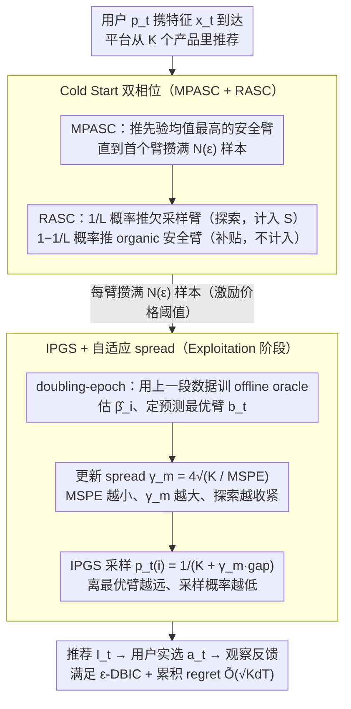

# Incentivized Exploration with Stochastic Covariates: A Two-Stage Mechanism Design for Recommender System

**会议**: ICML 2026  
**arXiv**: [2406.04374](https://arxiv.org/abs/2406.04374)  
**代码**: 待确认  
**领域**: 强化学习 / 上下文老虎机 / 机制设计  
**关键词**: 激励兼容, 上下文 bandit, 机制设计, 冷启动, 反向 gap 采样  

## 一句话总结
RCB 把推荐系统里的"探索-利用"和"用户激励兼容"打包成一个动态贝叶斯激励兼容（DBIC）约束下的上下文 bandit 问题，提出冷启动 + IPGS 两阶段算法，在随机用户协变量场景下证明 $\tilde{O}(\sqrt{KdT})$ regret、可插入任意 offline learning oracle，并量化"激励价格"——冷启动样本量随 $\epsilon$ 收紧呈 $1/\epsilon^2$ 增长。

## 研究背景与动机
**领域现状**：现代推荐市场有三方——产品、用户、平台。平台既要利用已知偏好（exploitation）又要试探冷启动商品（exploration），但自利且短视的用户往往拒绝看似次优的推荐，导致系统在长尾内容上数据稀疏、冷启动失败。激励探索（incentivized exploration）这条线由 Kremer et al. 2014、Mansour et al. 2020 开创，处理无上下文 MAB；Sellke & Slivkins (2023) 进一步把线性上下文纳入，但所有这些工作都假设 **fixed-design**——产品特征静态、不随用户变。

**现有痛点**：现实推荐里用户协变量是**随机抽样到达**的，最优臂会随每个用户变化。先前的 black-box reduction（Mansour et al. 2020）会忽略线性结构带来的统计效率红利，fixed-design 分析又根本不适用。结果是既拿不到 sublinear regret，又难以保证 BIC。

**核心矛盾**：平台长期目标（最大化累积 reward、为冷启动产品收数据）与用户即时自利（按 prior 选当前期望最高的臂）之间存在结构性对立。同时，激励兼容约束 $\epsilon$ 越紧，探索越受限；探索越少，长期 regret 越大——这两个量怎么定量挂钩，前人没说清楚。

**本文目标**：(i) 把随机协变量场景下的激励兼容形式化为 $\epsilon$-DBIC 约束；(ii) 设计算法同时保证 sublinear regret 和 DBIC；(iii) 解耦"激励成本"与"学习速率"，让算法可以即插即用任意 offline regression oracle（不限于 Gaussian/Beta 后验）。

**切入角度**：核心观察是 BIC 约束所需的"足够好后验"和"可持续探索"可以**时序解耦**——先用一个有限长度的 cold start 阶段把每个臂的样本喂到能满足 DBIC 的下限，之后只要 offline oracle 的 MSPE 在下降，IPGS 的 spread 参数就能自动收紧、稳态地维持 DBIC。

**核心 idea**：用两阶段架构（cold start 收最少必需样本 + IPGS 阶段动态校准探索半径）替代 Thompson Sampling 路线，把"激励价格"完全装进冷启动长度 $N(\epsilon)$，让后续学习速率与 $\epsilon$ 彻底脱钩。

## 方法详解

### 整体框架
在每一轮 $t$，用户 $p_t$ 携带特征 $x_t \in \mathcal{X} \subset \mathbb{R}^d$ 到达，平台从 $K$ 个产品里推荐 $I_t$，但用户实际选 $a_t$（可能 $\neq I_t$），平台只在 $a_t$ 上观察噪声反馈 $y_t(a_t) = x_t^\top \beta_{a_t} + \eta_{t,a_t}$，$\eta$ 是 $\sigma$-subgaussian。$\beta_i$ 从共享先验 $\mathcal{P}_{i,0}$ 抽样。

DBIC 约束要求："给定历史 $\Gamma_{t-1}$，被推荐臂 $i$ 相对任意替代 $j$ 的期望损失不超过 $\epsilon$"，形式化为 $\mathbb{E}[\mu(x_t,i) - \mu(x_t,j) \mid I_t=i, \Gamma_{t-1}] \geq -\epsilon$。RCB（Algorithm 1）由两阶段构成：

- **Cold Start Stage**：先做 MPASC（推荐先验均值最高的"安全臂"直到至少一个臂达到 $N(\epsilon)$ 样本），再 RASC（以概率 $1/L$ 探索欠采样臂、$1-1/L$ 推安全臂作"激励补贴"），每臂攒满 $N(\epsilon)$ 样本后转入第二阶段。
- **Exploitation Stage**：用 doubling-epoch 调度 $\mathcal{T}_m = \{t \in [2^{m-1}, 2^m)\}$，每个 epoch 用前一段全部数据训 offline oracle 估计 $\widehat{\beta}_i$，按 IPGS 公式采样推荐臂。

两个阶段通过 $\gamma_m = 4\sqrt{K/\mathcal{E}_{\mathcal{F},\delta}(|\mathcal{T}_{m-1}|)}$ 这个 spread 参数连接——它随 oracle 的 MSPE 反向缩放，随时间自动收紧探索半径。

### 关键设计

**1. Cold Start 双相位（MPASC + RASC），且"有机"推荐不计入训练集**

冷启动要解决的是：在严格 $\epsilon$-DBIC 约束下为每个臂攒满 $N(\epsilon)$ 样本，但又不能污染后续 oracle 用的训练集。MPASC 阶段先推先验均值最高的"安全臂" $\arg\max_i \mathbb{E}[\mu(x_t,i)]$，直到首个臂饱和（$N_i(t)=N$）进入集合 $B_t$。之后转入 RASC：以 promoted 概率 $1/L$ 推欠采样臂中先验均值最高的 $\tilde{a}_t=\arg\max_{i\in[K]\setminus B_t}\mathbb{E}[\mu(x_t,i)]$ 做探索、并把样本计入 $S_{\tilde{a}_t}$；以 $1-1/L$ 概率走 organic 推荐 $a_t^*=\arg\max_i\mathbb{E}[\mu(x_t,i)\mid S_{B_t}]$——organic 轮照常产生 reward，但**不增加 $N$、也不更新 $S$**。这步的巧妙在于：organic 轮的高 utility 正好用来"补贴"exploration 轮可能的 utility 亏损，从而把 $\epsilon$-DBIC 转化成一个关于 $L$ 的可解条件 $L\geq 1+\frac{1-\epsilon}{\tau_{\mathcal{P}_0}\rho_{\mathcal{P}_0}+\epsilon}$；而不把 organic 样本计入训练集，是为了防止 confidence set 被这些重复的安全臂样本过度收紧、过早触发 epoch 切换。

**2. IPGS（反比 gap 采样）+ 自适应 spread：维持 DBIC 又与 oracle 解耦**

进入 Exploitation 阶段后，想在不指定任何后验形态的前提下维持 DBIC，并把 $\tilde{O}(\sqrt{KdT})$ 的 regret 速率和 oracle 选择解耦。设当前 epoch oracle 预测的最优臂为 $b_t=\arg\max_i\widehat{\mu}_t(x_t,i)$，IPGS 对 $i\neq b_t$ 取采样概率 $p_t(i)=\frac{1}{K+\gamma_m(\widehat{\mu}_t(x_t,b_t)-\widehat{\mu}_t(x_t,i))}$、$p_t(b_t)=1-\sum_{j\neq b_t}p_t(j)$——某臂的预测得分离最优臂越远，被采样的概率越低。spread 参数 $\gamma_m=4\sqrt{K/\mathcal{E}_{\mathcal{F},\delta}(|\mathcal{T}_{m-1}|)}$ 随 oracle 的 MSPE 反向缩放：MSPE 一降，$\gamma_m$ 就升、分布自动向 $b_t$ 集中。这个 $1/(K+\gamma_m\Delta)$ 的反比形式让推荐分布的形状直接由 oracle 的学习速率驱动，从而 DBIC 在每个 epoch 自动满足；更重要的是它替代了 Thompson Sampling 对 Gaussian/Beta 后验的特定假设，使 Ridge、Lasso、kernel、神经网络等任意 offline regression oracle 都能即插即用。

**3. 激励价格 $N(\epsilon)$ 的闭式刻画：把"激励成本"变成一个可设计的旋钮**

为了让平台运营者能定量规划"激励预算 ↔ 冷启动周期"的权衡，作者给出冷启动样本量与 $\epsilon,d,K$ 的精确依赖。Theorem 1 在 Assumptions 1–3 下证明：要让 $\epsilon$-DBIC 以概率 $\geq\rho_{\mathcal{P}_0}\rho_{\mathcal{P}_*}$ 满足，需 $N(\epsilon)\geq\frac{(\sigma^2 d+1)K^3}{\phi_0(\tau_{\mathcal{P}_*}+\epsilon)^2}$，对应 exploitation 阶段从 epoch $m_0(\epsilon)=\lceil 2+\log_2 N(\epsilon)\rceil$ 起步，其中 $\phi_0$ 是协变量协方差矩阵的最小特征值、刻画用户特征的多样性。这把以往文献里那个 black-box 的"激励兼容成本"变成了显式可设计量——工程师可以用 $\epsilon$ 这一个旋钮去换冷启动周期；而后续 regret 项又与 $\epsilon$ 解耦，进一步说明"激励 ↔ 学习"在 RCB 里是良态解耦的。

### 损失函数 / 训练策略
RCB 不是端到端可微的神经网络，没有损失函数；但有两个核心理论保证：(i) **Regret Decomposition**（Theorem 2）：$\mathcal{R}(T) \leq T_{\text{cold}}(\epsilon) + \tilde{O}(\sqrt{Kd(T - T_{\text{cold}})})$，把总 regret 显式拆成"激励价格"（cold start 期不可避免的次优）+ "学习 regret"（exploitation 期的标准 $\sqrt{T}$ 速率）。(ii) Exploitation 期 spread 参数 $\gamma_m$ 仅由 oracle 的 $\mathcal{E}_{\mathcal{F},\delta}$ 和 epoch 长度决定，与 $\epsilon$ 无关——这正是"激励 ↔ 学习解耦"的形式化表述。

## 实验关键数据

### 主实验
作者用 PharmGKB 数据集（5,528 名患者）做了一个"个性化华法林剂量推荐"的临床决策支持模拟。把连续剂量离散成 3 臂（Low <3mg、Medium 3–7mg、High >7mg，对应人群占比 27%/60%/13%），把"医生总开 Medium"当作 Standard of Care baseline 与算法 prior $\mathcal{P}_0$；RCB 用线性回归 oracle 估计剂量正确概率，目标是诱导医生在其强 Medium 先验下也愿意探索 Low/High 臂。

| 真实剂量 | RCB → Low | RCB → Medium | RCB → High | 物理 baseline → Medium | 人群占比 |
|---|---|---|---|---|---|
| Low（高风险欠剂量） | **50%** | 48% | 2% | 100%（误判） | 27% |
| Medium | 14% | **84%** | 2% | **100%** | 60% |
| High（高风险过剂量） | 2% | 93% | **5%** | 100%（误判） | 13% |

加权风险分（按 $p_k$ 加权 +1 正确 / -1 错误）：医生 baseline 恒为 0.20；RCB 在 $\epsilon = 0.025$ 下达 **0.291**、$\epsilon=0.035$ 下 0.265，在保留 Medium 群体高精度的同时显著抢回 Low/High 长尾的正确率。

### 消融实验
| 配置 | 关键现象 | 说明 |
|---|---|---|
| 紧预算 $\epsilon=0.025$ | error rate ≈ 0.35 | 全先验方差下达到 Lasso Bandit (Bastani & Bayati 2020) 同档水平，且额外满足 DBIC、不需稀疏性先验 |
| 中等预算 $\epsilon=0.035$ | 弱先验下性能退化 | $\Sigma_0$ 越大冷启动越长，激励满足度更易塌掉 |
| 宽预算 $\epsilon=0.045$ | error rate > 0.40（所有 $\Sigma_0$） | 探索补贴太多反而过度试探次优臂 |
| 与 RCB 算法的 BIC 文献对照 | Table 1 | Kremer 2014（MAB 无上下文）/ Mansour 2020（generic MAB + black-box reduction）/ Sellke 2023（fixed-design 线性 bandit）→ RCB（stochastic covariates + 两阶段 IPGS）填补"随机上下文"这一空缺 |

### 关键发现
- 紧预算 $\epsilon=0.025$ 反而拿到最好 error rate（≈0.35），打破"预算越大越好"的直觉——loose 预算让算法过度补贴探索、把 Medium 多数群体的准确率拖下来。这与 Theorem 1 中 $N(\epsilon) \propto (\tau + \epsilon)^{-2}$ 的分析互相印证：预算放宽确实让冷启动更短，但代价是 exploration 风险更难被 organic 推荐"补贴"住。
- RCB 在"高风险/低占比"群体上的提升（Low 0%→50%、High 0%→5%）远大于"低风险/高占比"上的轻微让步（Medium 100%→84%），这种"利用信息不对称把试探集中在长尾"的行为正是 incentivized exploration 这一线设计目标。
- "modular learning oracle"得到验证：把 Ridge 换成 Lasso、kernel、神经网络只影响 $\mathcal{E}_{\mathcal{F},\delta}(n)$ 项，不破坏 DBIC——这给工业部署留下了直接换骨架的接口。
- Cold start 复杂度 $O(K^3 d / \epsilon^2)$ 随 $K$ 三次幂增长，对大 catalog 推荐场景偏吃力，作者提出 arm clustering / progressive exploration / warm starting / contextual arm elimination 四种工程缓解。

## 亮点与洞察
- "把激励成本完全装进冷启动长度 $N(\epsilon)$"是 RCB 最聪明的一步：它让 BIC 文献里历来纠缠的"激励 ↔ 学习"两个维度做到了显式解耦，后续 regret 项干净到只剩 $\sqrt{KdT}$，分析直接借用 Foster & Rakhlin 2020 的回归 oracle 框架。
- IPGS 这个 $1/(K + \gamma_m \Delta)$ 的反比 gap 采样形式对 RL 社区也有借鉴价值——它在不依赖任何后验形态的前提下提供了"分布形状由学习速率反向校准"的机制，可以用作 Thompson Sampling 的轻量替代。
- "organic 推荐不计入训练集"这一小动作避免了 self-loop 偏差（safe arm 不停被推、confidence set 被这些重复样本过度收紧），对所有"补贴 + 探索"风格的 bandit 算法都有提示意义。
- 把华法林剂量这种**真实高风险决策**当试验台而非合成模拟，让"加权风险分"的概念落到具体临床场景，论证了 RCB 对"高风险少数群体公平性"的优势——这种把 fairness 用 risk-weighted score 量化的做法值得借鉴。

## 局限与展望
- 上下文模型假设线性 reward $\mu(x_t,a) = x_t^\top \beta_a$，对非线性 reward 仅在附录给出 sub-exponential 风格扩展，没在主实验里覆盖。
- $N(\epsilon) = O(K^3)$ 的立方依赖在 $K$ 大（如百千级 catalog）时几乎不可承受，作者只在 conclusion 给出工程缓解但没给出新的理论保证。
- $\epsilon$ 是个超参，论文没讨论如何在线自适应。真实平台里用户的激励容忍度本身是异质且时间变化的，固定 $\epsilon$ 是一种简化。
- "myopic user"假设在某些场景（如长期订阅类产品）不成立；DBIC 的稳态分析对"会因被多次试探而沮丧退出"的用户不直接适用。
- Assumption 4（"trust evolves"，先验协方差最小特征值随 $t$ 线性增长）是个很强的行为假设，作者承认违反该假设时算法仍 robust 但 cold start 期会更长。

## 相关工作与启发
- **vs Kremer et al. 2014**：开创 BIC for MAB 但无上下文；RCB 把它扩到带随机协变量的线性 contextual bandit，并保留可证明 DBIC。
- **vs Mansour et al. 2020**：用 generic black-box reduction 处理一般 MAB，规模上更通用但忽略线性结构带来的统计效率；RCB 显式利用线性 reward 拿到 $\tilde{O}(\sqrt{KdT})$ 而非 $\tilde{O}(T^{2/3})$。
- **vs Sellke 2023**：同样处理线性 contextual bandit，但假设 fixed design（特征静态属于产品端）+ Ridge + 分相位 Thompson Sampling；RCB 处理 stochastic covariates（特征随用户在线抽样）+ 任意 plug-in oracle + IPGS，是真正的 dynamic 推荐场景。
- **vs Lasso Bandit (Bastani & Bayati 2020)**：经典稀疏 contextual bandit，需先验知道非零特征数；RCB 在不要求稀疏性、且额外满足 DBIC 的前提下追平其 error rate（0.35），说明激励约束没有牺牲学习效率。
- **vs Foster & Rakhlin 2020（regression-oracle bandit）**：RCB 实际上把 Foster–Rakhlin 的 IGW 采样换成 IPGS，再叠加 DBIC 校准，提供了"regression oracle + 激励约束"的统一接口。

## 评分
- 新颖性: ⭐⭐⭐⭐ 把 stochastic covariates 引入 incentivized exploration 是首次，且"两阶段 + IPGS"组合替代主流 Thompson Sampling 路线，结构上有清晰差异。
- 实验充分度: ⭐⭐⭐ 真实华法林数据 + 多 $\epsilon$ / $\Sigma_0$ 扫掠合理，但 baseline 偏少（主要对照 Lasso Bandit 与医生 baseline），缺少与 Sellke 2023 等直接 BIC 算法在同任务上的对比。
- 写作质量: ⭐⭐⭐⭐ Table 1 的对比定位非常清楚，Theorem 1/2 的物理意义解读到位（cubic in $K$、linear in $d$、inverse-quadratic in $\epsilon$ 都有专门段落讨论）。
- 价值: ⭐⭐⭐⭐ 给"激励兼容 + contextual bandit"这条线提供了一个 modular、工程友好、可量化激励价格的标杆算法，对推荐系统、临床决策、教育推荐等需要 incentivized exploration 的场景都有直接参考意义。

<!-- RELATED:START -->

## 相关论文

- [\[ICML 2026\] Learning Design Skills as Memory Policies for Agentic Photonic Inverse Design](learning_design_skills_as_memory_policies_for_agentic_photonic_inverse_design.md)
- [\[ACL 2026\] MemRec: Collaborative Memory-Augmented Agentic Recommender System](../../ACL2026/recommender/memrec_collaborative_memory-augmented_agentic_recommender_system.md)
- [\[NeurIPS 2025\] Radial Neighborhood Smoothing Recommender System](../../NeurIPS2025/recommender/radial_neighborhood_smoothing_recommender_system.md)
- [\[ICML 2026\] Can Recommender Systems Teach Themselves? A Recursive Self-Improving Framework with Fidelity Control](can_recommender_systems_teach_themselves_a_recursive_self-improving_framework_wi.md)
- [\[ICLR 2026\] Token-Efficient Item Representation via Images for LLM Recommender Systems](../../ICLR2026/recommender/token-efficient_item_representation_via_images_for_llm_recommender_systems.md)

<!-- RELATED:END -->
