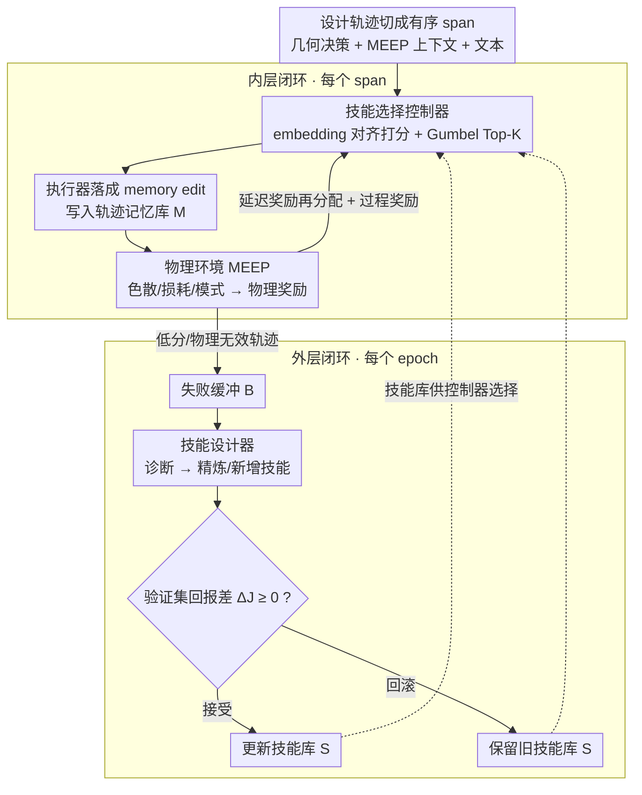

# Learning Design Skills as Memory Policies for Agentic Photonic Inverse Design

**会议**: ICML 2026  
**arXiv**: [2605.29421](https://arxiv.org/abs/2605.29421)  
**代码**: 待确认  
**领域**: LLM Agent / 记忆增强 / AI for Physics  
**关键词**: 记忆策略, 技能库, PPO, 光子晶体光纤, 仿真器在环  

## 一句话总结
SkillPCF 把光子晶体光纤（PCF）的反向设计重塑为"记忆策略学习"问题：用 PPO 训练的控制器在每个轨迹片段从可演化技能库里挑 Top-K 个 memory 操作，执行器把它们落到轨迹记忆里，再用 MEEP 电磁仿真奖励同时优化控制器与技能库本身，在多 LLM 后端和经典优化基线上都拿到更好的设计成功率与仿真预算权衡。

## 研究背景与动机
**领域现状**：PCF 反向设计目前主要有两条路。一条是经典数值优化（参数扫掠、有限元/FDTD 仿真、Nelder-Mead 等），仿真昂贵、依赖专家先验；另一条是 ML 加速（代理网络、可微优化），用一次性回归预测结构-性能映射来削减仿真次数。

**现有痛点**：两条路都把每一次设计任务视为独立 episode——经典法不积累跨任务知识，ML 法又缺乏可解释性和迭代修正能力。实际工程里设计者会在相邻参数区间反复试错，"什么失败、为什么失败、什么在哪个约束下成功"本身就是高价值信号，但目前系统不保留也不复用这些经验。

**核心矛盾**：仿真预算紧张（每次 FDTD/有限元代价大）与设计目标耦合（色散、限制损耗、有效折射率彼此牵动）之间的张力，使得没有记忆机制的方法在多目标场景里要么过度仿真，要么早早收敛到次优结构。

**本文目标**：让 PCF 设计系统具备"记得有用的、忘掉无效的、并能在仿真反馈下持续精炼记忆策略"的能力。进一步拆成三个子问题：(i) 每个设计片段挑出合适的记忆操作；(ii) 把稀疏的设计成功信号回传到中途的记忆决策；(iii) 让记忆操作本身随着失败案例自动演化。

**切入角度**：作者借鉴 LLM-Agent 社区近年的发现——记忆操作（insert / update / delete / skip）可以当作可学策略而非固定启发式，而仿真器返回的确定性物理指标恰好可以充当 verifiable reward。把这两件事拼起来就得到"仿真器在环 + 可演化技能库"的 agent 框架。

**核心 idea**：把 PCF 反向设计变成两层闭环——内层用 PPO 学一个 skill-selection 控制器，外层用 designer 模块从失败缓冲里精炼/扩张技能库——让 LLM Agent 在多轮交互中既消费记忆也重塑记忆操作本身。

## 方法详解

### 整体框架
SkillPCF 把每条设计轨迹切成有序 span，每个 span 由"当前几何决策 + MEEP 仿真上下文 + 文本描述"组成。系统维护两套存储：(1) 轨迹专属的 memory bank $\mathcal{M}$，承载该 trace 的数值化设计证据（单位敏感的参数-性能对、跨轨迹关系等）；(2) 跨轨迹共享的技能库 $\mathcal{S}$，初始包含 InsertTopologyFeature、UpdatePerformanceTrend、DeleteInvalidAssumption、Skip 四种 PCF 专用 memory primitive。

整个流程是双层闭环：**inner loop**（橙线）每个 span 由 Controller 选 Top-K skill → Executor 落地为 memory edit → Physics Environment 跑 MEEP 给出物理奖励；**outer loop**（蓝线）按 epoch $e$ 从低分轨迹挖 hard case 进失败缓冲 $\mathcal{B}^{(e)}$，让 Skill Designer 提出新的 $\hat{\mathcal{S}}^{(e+1)}$，再用验证集上的回报差决定接受或回滚。这种"内层稳定执行 + 外层结构演化"的拆分让动作空间可以增删而不破坏 policy head。

### 关键设计

**1. Embedding 对齐的可演化技能选择头：让动作空间能增删而不重训 policy**

标准 actor head 假定动作空间固定，但 SkillPCF 的技能库会被外层 Designer 增删，普通分类头就用不了了。作者把 span 上下文 $h_t=f_{\mathrm{ctx}}(x_t,M_t)$ 和每条技能描述 $u_i=f_{\mathrm{skill}}(\text{Description}(s_i))$ 用同一套 embedding 模型编到同一表示空间，再以 $z_{t,i}=h_t^\top u_i$、$p_\theta(i\mid h_t)=\text{Softmax}(z_t)_i$ 打分——$z_t$ 的维度随技能库 $|\mathcal{S}^{(e)}|$ 自适应，所以 Designer 增删 skill 不需要重训 policy head。一个 span 经常需要复合操作（既插入新的参数-性能事实、又删掉一个失效假设），单 skill 选择会把它人为分摊成多步、浪费仿真，因此用 Gumbel-Top-K 不放回采样得到有序集合 $A_t=(a_{t,1},\ldots,a_{t,K})$，策略概率写成 $\pi_\theta(A_t\mid h_t)=\prod_{j=1}^{K}\frac{p_\theta(a_{t,j}\mid h_t)}{1-\sum_{\ell<j}p_\theta(a_{t,\ell}\mid h_t)}$。embedding 对齐既解决了"动作空间会变"，又一次能选出一组复合操作。

**2. 延迟奖励再分配 + 过程奖励：把晚到的终端性能信用分到中途的记忆决策上**

长时程设计里，terminal QA 性能往往比中途的记忆操作晚好几步才出现，只靠终端奖励训 PPO 会让中间 span 长期收不到信号；可纯过程奖励又容易让控制器学到"看着有用、对最终设计无帮助"的 trivia。SkillPCF 把 episode 终端奖励 $R_{\mathrm{final}}$ 按指数衰减再分配到每个 span：$\tilde{r}_t=(1-\beta)R_{\mathrm{final}}\frac{\gamma^{T-t}}{\sum_{k=1}^{T}\gamma^{T-k}}+\beta\mathbf{1}[t=T]R_{\mathrm{final}}$，$\gamma\in(0,1)$ 控衰减、$\beta\in[0,1]$ 保留一份纯 terminal 信号；最终 step 奖励 $r_t=r_{\mathrm{proc},t}+\tilde{r}_t$，其中 $r_{\mathrm{proc},t}$ 是 memory 构造质量与物理一致性 check 的过程奖励。显式的 $\beta$ 项让作者能在"全程稀疏终端"和"密集过程"两端连续插值，匹配实际训练 pipeline。

**3. 基于失败缓冲的技能演化 + 接受回滚：让技能库自己长出新操作又不被噪声拖累**

固定 4 种 skill 是死的，但若放手让 Designer 乱改，又可能把已学好的控制器改坏。SkillPCF 在外层每个 epoch $e$ 从低性能/物理无效轨迹收集 hard case 进失败缓冲 $\mathcal{B}^{(e)}$，按结构 regime（hexagonal、PBG、Kagome 等）和光学失效类型聚类后挑代表样本送给 Designer；Designer 先诊断（识别缺失或错位的 memory 操作）、再精炼（编辑既有 skill 或新增结构感知 skill），得到候选 $\hat{\mathcal{S}}^{(e+1)}=\text{Designer}(\mathcal{S}^{(e)},\mathcal{B}^{(e)})$。是否接受由验证集回报差 $\Delta J_{\mathrm{val}}=J_{\mathrm{val}}(\theta^{(e+1)},\hat{\mathcal{S}}^{(e+1)})-J_{\mathrm{val}}(\theta^{(e+1)},\mathcal{S}^{(e)})$ 决定，$\Delta J_{\mathrm{val}}\geq 0$ 才接受、否则回滚到 $\mathcal{S}^{(e)}$，接受之后短期偏置探索新技能。这个验证集回报差形成的 gate 提供了"有限激进 + 安全回退"的工程平衡。

### 损失函数 / 训练策略
控制器 $\theta$ 用 PPO 优化目标 $J(\theta; \mathcal{S}^{(e)}) = \mathbb{E}_{\tau \sim \pi_\theta(\cdot \mid \mathcal{S}^{(e)})} [\sum_t r_t]$，每个 outer epoch 内 $\mathcal{S}^{(e)}$ 固定。PPO 标准设定：$\gamma=0.99$、$\lambda=0.95$、clip $0.2$、entropy $0.01$，每次 update 跑 4 epoch、minibatch 32、梯度裁剪 0.5。Controller 是 hidden size 256 的 MLP，AdamW + 学习率 $1 \times 10^{-4}$。整个训练 10 个 outer 演化 epoch、每个 outer 内 50 个 inner 交互 epoch，batch 32。LLM judge 用 GPT-4o-mini、embedding 用 Text-Embedding-3-Small、检索器是 Contriever（深度 $k=5$）。控制器训练在 A100-40GB 上完成；评测层面用 Calls/q 作为硬件无关的仿真预算指标。

## 实验关键数据

### 主实验
作者构建了 PCFSkill 数据集——479 条专家交互轨迹（覆盖 8 个 PCF 家族：solid-core hexagonal、high-birefringence PM、hollow-core PBG、Kagome、anti-resonant ARF 等），共 2,507 spans（平均 5.23/trace、约 393K tokens、75.6% 设计成功率），加上 553 条 memory-dependent 评测 query 和 596 条失败日志。

在 Llama4-Scout 后端（无视觉设置）与跨 LLM 后端（有视觉设置）下对比 8 个记忆增强 baseline，关键指标如下表：

| 后端 / 设置 | 方法 | Human ↑ | Judge ↑ | Succ. ↑ | Phys. ↑ | Calls/q ↓ |
|---|---|---|---|---|---|---|
| Llama4-Scout / 无视觉 | MemoryBank | 7.18 | 6.72 | 30.61 | 45.92 | — |
| Llama4-Scout / 无视觉 | A-MEM | 6.92 | 6.02 | 36.22 | 38.78 | — |
| Llama4-Scout / 无视觉 | **SkillPCF** | **8.47** | **8.02** | **60.12** | **68.92** | — |
| MiniMax-M2.5 / 有视觉 | MemoryBank | 7.22 | 6.18 | 46.94 | 56.63 | 1.12 |
| MiniMax-M2.5 / 有视觉 | **SkillPCF** | **9.12** | 6.92 | **82.35** | **68.45** | **1.02** |
| Qwen2.5-72B / 有视觉 | A-MEM | — | 6.00 | 41.33 | 52.04 | 1.10 |
| Qwen2.5-72B / 有视觉 | **SkillPCF** | — | **7.95** | **78.92** | **65.28** | **1.02** |

经典优化方法虽然在 Phys. 上接近，但平均 100 calls/q（仿真预算高两个数量级），并且 Succ. 要么 0（NN Predictor）要么靠暴搜（Random Search 92.9%）。SkillPCF 在 1.02 calls/q 下做到 60–82% 设计成功率，是仿真预算/设计质量权衡上的整体最优点。

### 消融实验
| 配置 | 关键贡献 | 说明 |
|---|---|---|
| Full SkillPCF | 物理引导 skill + 演化 + 延迟奖励 | 完整模型，Succ. 60–82% |
| 仅初始 4 种 skill（无演化） | Skill Designer 关闭 | 失败 case 无新 skill 长出，长尾设计性能掉队 |
| 仅 terminal reward（无再分配） | $\beta=1$ | 中段 memory 操作信用缺失，PPO 收敛慢且不稳 |
| skill 选择改为单 action（K=1） | 取消 Top-K | 复合 memory 操作被分摊到多个 span，仿真次数上升 |

memory 操作分布揭示设计行为：INSERT 36% / UPDATE 56% / DELETE 5% / SKIP <1%，证明"修正既有信念"比"插入新事实"更常见，验证 UPDATE skill 的核心地位。

### 关键发现
- 当 LLM 后端从 Llama4-Scout 切到 MiniMax-M2.5、Qwen2.5-72B，SkillPCF 的相对优势没有衰减，反而 Succ. 升到 78–82%，说明记忆策略本身可迁移而不严重依赖某种特定 LLM 风格。
- 在 Without Visual Field 设置下 SkillPCF 反而比经典 ML predictor 拿到更高 Phys. 分（68.92 vs 63.30），暗示 memory 累积的跨 trace 物理一致性可在某种程度上替代视觉证据。
- Mem0 这种通用 memory agent 在 PCF 任务上 Succ. 只有 3.06%，证明缺少物理-grounded 的 skill primitive 时通用 LLM-memory 框架几乎无效——这是把"领域 skill 显式建模"作为可学习动作的最强反向证据。

## 亮点与洞察
- 把 memory operation 重新解释成 RL 动作空间这件事本身并不新，但 SkillPCF 把"动作空间可演化"这个维度真正打通：embedding-aligned 选择头让 Designer 增删 skill 不用重训 policy。这套结构可直接迁到任何"工具/技能集合在训练中演化"的 agent 场景。
- 物理仿真给的是 deterministic、可验证的标量信号，这正是 LLM-agent 缺的"reward grounding"。把昂贵仿真器当 reward source 而不是 inner-loop callable，可以在不暴涨预算的前提下拿到真实物理反馈，是一种相当务实的 simulator-in-the-loop 范式。
- "失败缓冲 + 接受回滚"这一对，本质上是给自演化 agent 装了一个验证集 gate，可借鉴到任何 self-improving LLM 工具调用系统——避免 designer 模块把已收敛的能力改坏。

## 局限与展望
- 数据集只有 479 条轨迹、553 条评测 query，对 LLM-agent 训练而言偏小，作者也没报告在分布外 PCF 家族（如新型 anti-resonant 变体）上的迁移性能。
- 整个 reward 设计依赖 MEEP 这种昂贵仿真，外层 10 epoch × 内层 50 epoch 的 PPO 训练成本在论文里没有完整 ablation，对工业化部署是个未知数。
- Skill Designer 是一个 LLM 调用，本身可能引入与 controller 同源的偏差（"自己写的 skill 自己用得好"），缺少独立第三方裁判。把 Designer 换成不同 backbone 的 self-play / multi-judge 设定值得尝试。
- 当前 skill primitive 只有 4 类、加上演化生成的几条，规模不大；当 skill 库扩到几十上百条时，retrieval-based skill subset selection 可能比 Top-K dense softmax 更经济。

## 相关工作与启发
- **vs MemGPT / Reflexion**：它们用 OS 风格分层 memory 或显式 verbal feedback，但 memory 操作仍是固定启发式；SkillPCF 把操作本身做成可学 action，并加上物理 grounding。
- **vs A-MEM / LangMem / MemoryOS**：通用 memory agent 在 PCF 任务上 Succ. 普遍 25–40%，缺的不是 memory 容量而是领域感知的 skill primitive 和 grounded reward。
- **vs 经典 PCF 反向设计（Gray 2024、Chen 2023）**：前者把每次设计当独立优化任务，需要 100 calls/q 仿真预算；SkillPCF 用 1.02 calls/q 拿到相当的 Phys. 分，差距来自跨轨迹经验复用。
- **vs Sellke & Slivkins 类 incentivized exploration**：同样都关心"在 sample 受限下学习"，但 SkillPCF 把限制从"用户激励预算"换成了"物理仿真预算"，框架可迁移性比题面更宽。

## 评分
- 新颖性: ⭐⭐⭐⭐ 把 memory operation 作为可演化动作空间 + 仿真器在环 reward grounding 的组合是工程意义上的新颖工作，但单项技术（PPO、Gumbel Top-K、Reflexion 风格 self-refine）都不是全新。
- 实验充分度: ⭐⭐⭐⭐ 三种 LLM 后端 × 有无视觉 × 8 个 baseline 的对比合理，PCFSkill 数据集自建可复现；但缺乏跨数据集和分布外 PCF 家族的泛化测试。
- 写作质量: ⭐⭐⭐⭐ 双层闭环图（Figure 2）和数据集统计图（Figure 3）都清晰，公式编号干净，附录补完整。
- 价值: ⭐⭐⭐⭐ 对 AI for Physics / 工程设计 agent 这条线有直接示范意义，整套"可演化技能库 + simulator-in-the-loop reward"模板可迁移到材料、芯片、力学结构等昂贵仿真驱动的设计任务。

<!-- RELATED:START -->

## 相关论文

- [\[ICML 2026\] Incentivized Exploration with Stochastic Covariates: A Two-Stage Mechanism Design for Recommender System](incentivized_exploration_with_stochastic_covariates_a_two-stage_mechanism_design.md)
- [\[ACL 2026\] MemRec: Collaborative Memory-Augmented Agentic Recommender System](../../ACL2026/recommender/memrec_collaborative_memory-augmented_agentic_recommender_system.md)
- [\[ICML 2026\] RGMem: Renormalization Group-Inspired Memory Evolution for Language Agents](rgmem_renormalization_group-inspired_memory_evolution_for_language_agents.md)
- [\[ICML 2026\] Rethinking Contrastive Learning for Graph Collaborative Filtering: Limitations and a Simple Remedy](rethinking_contrastive_learning_for_graph_collaborative_filtering_limitations_an.md)
- [\[ACL 2026\] HARPO: Hierarchical Agentic Reasoning for User-Aligned Conversational Recommendation](../../ACL2026/recommender/harpo_hierarchical_agentic_reasoning_for_user-aligned_conversational_recommendat.md)

<!-- RELATED:END -->
