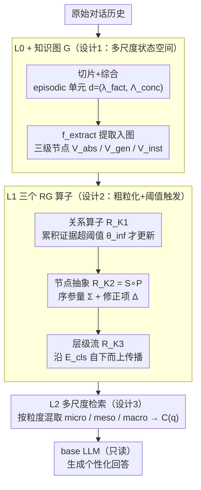

# RGMem: Renormalization Group-Inspired Memory Evolution for Language Agents

**会议**: ICML 2026  
**arXiv**: [2510.16392](https://arxiv.org/abs/2510.16392)  
**代码**: https://github.com/fenhg297/RGMem (有)  
**领域**: LLM Agent / 长期记忆 / 个性化对话  
**关键词**: 重整化群, 多尺度记忆, 用户画像演化, 阈值相变, 稳定性-可塑性  

## 一句话总结
RGMem 借统计物理里的重整化群思想，把语言 agent 的长期对话记忆建模成"事件层 → 关系层 → 概念层"的多尺度系统，通过阈值触发的非线性算子把零散对话粗粒化成稳定的用户画像，从而打破"稳定 vs 可塑"权衡。

## 研究背景与动机

**领域现状**：基于 LLM 的对话 agent 越来越被期望维持跨 session 的个性化交互。主流做法要么是把历史塞进上下文（受窗口限制 + lost-in-the-middle），要么是 RAG / 显式 memory（Mem0、LangMem、A-Mem、Memory OS、Zep 等）在事实/段落粒度上做检索增强。

**现有痛点**：现有显式记忆系统几乎都"扁平"——按词法重叠和时间新近度从一堆事实里捞，缺乏从碎片信息抽出稳定 trait 的能力。结果是噪声越积越多，长期 trait 反而被冲淡；隐式记忆（微调/LoRA/KV-cache）则缺可审计、回滚困难，也无法跨 agent 共享 profile。

**核心矛盾**：长期对话本质是 **多尺度** 的——micro 是具体事件，meso 是跨情境规律，macro 是长期人格特质。把这三者塞在同一个粒度上更新，必然撞上经典的"稳定性 vs 可塑性"两难：更新太激进会过拟合噪声、抛弃既有事实；更新太保守又跟不上真正的偏好漂移。

**本文目标**：(1) 给记忆系统一个原则性的"何时该跨尺度抽象"机制；(2) 让 profile 演化对噪声 robust 但对真实变化敏感；(3) 在不依赖更大上下文窗口或更猛检索的前提下做到这点。

**切入角度**：作者把记忆类比成物理系统——RG 在统计物理里就是研究"高频微观涨落如何被积分掉、留下宏观不变量"的工具。把"快变的事件"看作微观自由度，"慢变的特质"看作宏观序参量，整个对话历史就是一个待粗粒化的系统。

**核心 idea**：把 profile 演化定义成阈值触发的 RG 算子序列——只有当 micro 层证据累计跨过临界阈值时，才把变化"提升"到 meso 或 macro 层，并在每个尺度上分离"序参量 $\Sigma$（共性）"和"修正项 $\Delta$（张力）"，从而获得相变型而非线性单调的画像更新。

## 方法详解

### 整体框架
RGMem 把记忆状态写成 $\mathcal{M} = \mathcal{D}_{L0} \times \mathcal{G}$，其中 $\mathcal{D}_{L0}$ 是从原始对话切分+综合得到的 episodic memory 单元集合，$\mathcal{G} = (\mathcal{V}, \mathcal{E})$ 是带层级的动态知识图。系统物理上分三层：**L0** 负责构造 micro 证据（事件级事实 + 用户结论）；**L1** 跑三个 RG 算子做多尺度演化（关系推断 $\mathcal{R}_{K1}$、节点抽象 $\mathcal{R}_{K2}$、层级流 $\mathcal{R}_{K3}$）；**L2** 提供按尺度感知的检索接口。每来一段对话先在 L0 抽出 episodic 单元 $d = (\lambda_{fact}, \Lambda_{conc})$，再触发 L1 算子更新图，最后查询时由 L2 按问题粒度混取多尺度上下文喂给 LLM。整套系统对 base LLM 是只读的，所有"学习"都发生在外置的多尺度图与可解释更新规则上。

每个尺度的画像表示形式化为 effective theory $\mathcal{T}(\mathcal{M}, s)$，参数化为描述子 $\{\lambda_i(s)\}$；不同尺度之间通过算子 $\mathcal{T}^{(s+1)} = \mathcal{R}(\mathcal{T}^{(s)})$ 联系，对应粗粒化 + rescaling。所有算子都不是显式优化目标，而是把作者写出的 effective Hamiltonian $\mathcal{H}(\mathcal{T}) = \alpha E_{\text{con}}(\mathcal{T}) + \beta E_{\text{fid}}(\mathcal{T}|\mathcal{D}_{L0}) + \gamma E_{\text{com}}(\mathcal{T})$（一致性 + 保真度 + 简洁性）作启发指引——文本空间上没法真做这种全局优化，所以改用一组算子规则来"近似最小化"。

### 关键设计

**1. 三层多尺度记忆状态空间（L0 + 知识图 $\mathcal{G}$）：在数据结构层就把快慢分开**

扁平 RAG 把所有事实丢进同一个池子，新事实一来就把旧 trait 的检索权重稀释掉——"周二吃了什么"和"用户偏好健身"被迫以相同节奏更新。RGMem 在数据结构上就把它们拆开：L0 用 $f_{cg}=f_{synth}\circ f_{seg}$ 先把原始对话切片、再综合成 episodic 单元 $d=(\lambda_{fact},\Lambda_{conc})$，其中 $\Lambda_{conc}=\Lambda_{base}\cup\Lambda_{rel}$ 把"直接结论"和"高显著度信号"分开；再用 $f_{extract}:\mathcal{D}_{L0}\to\mathcal{G}$ 提到知识图里，节点分三级——$\mathcal{V}_{abs}$（抽象概念）/ $\mathcal{V}_{gen}$（一般事件）/ $\mathcal{V}_{inst}$（具体事件），边分静态分类边 $\mathcal{E}_{cls}$ 和动态事件边 $\mathcal{E}_{evt}$。显式分级意味着不同层的内容根本不在同一个粒度上，从而天然支持以不同节奏演化。

**2. 三个 RG 算子做粗粒化 + 阈值触发更新：把"何时该抽象"做成可调度的规则**

RGMem 的核心是用三个算子把"何时该把新证据提升为更高层抽象"变成可解释、可调度的操作，而不是均匀传播。**关系算子 $\mathcal{R}_{K1}$** 对同一关系 $e$ 累积新证据 $D_e^{new}$，更新关系级理论 $\mathcal{T}_e^{(1,t+1)}\leftarrow\mathcal{T}_e^{(1,t)}+\beta(\mathcal{T}_e^{(1,t)},D_e^{new})$，由 LLM 实现的非线性 $\beta$ 融合旧摘要与新证据，且**只在累积证据超过阈值 $\theta_{\text{inf}}$ 时才触发**，防止稀疏噪声被过早抽象。**节点抽象算子 $\mathcal{R}_{K2}=\mathbb{S}\circ\mathbb{P}$** 对抽象节点 $v$ 收集混合尺度输入 $\mathcal{I}_v^{new}=\{\mathcal{T}_{e_i}^{(1),new}\}_{e_i\in N(v)}\cup\{d_j^{new}\}_{j\in D(v)}$：projection-selection $\mathbb{P}$ 优先保留已被聚合过的关系级摘要、丢弃低信息密度噪声 $D_v'=\mathbb{P}(\mathcal{I}_v^{new})$；synthesis-rescaling $\mathbb{S}$ 同时维护两个量——**序参量** $\Sigma_v^{(2,t+1)}=\text{Agg}_{\text{common}}(D_v',\Sigma_v^{(2,t)})$ 抓占主导的稳定模式，**修正项** $\Delta_v^{(2,t+1)}=\text{Extract}_{\text{salient}}(D_v',\Delta_v^{(2,t)})$ 保留"塞不进 $\Sigma$ 但又重要"的张力信号，受阈值 $\theta_{\text{sum}}$ 控制。**层级流算子 $\mathcal{R}_{K3}$** 沿静态分类边 $\mathcal{E}_{cls}$ 自下而上传播，对父节点 $v_p$ 由子节点表征聚合 $(\Sigma_{v_p}^{(s+1)},\Delta_{v_p}^{(s+1)})=\mathcal{R}_{K3}(\{(\Sigma_{v_{c_i}}^{(s)},\Delta_{v_{c_i}}^{(s)})\}_i)$，用 dirty-flag 机制做增量调度。"序参量 + 修正项"这一分法直接对应物理上的"主导有序模式 + 临界涨落"，即便用户行为内部有矛盾也不会被强行抹平成单一摘要；阈值触发则对应相变，让系统天然呈现"小扰动忽略 / 大扰动重组"两态。

**3. 多尺度检索 L2 + 频谱式上下文构造：按"问得多细"取对应尺度的记忆**

传统 RAG 把上下文当成一个池子，"信息密度 vs 上下文长度"会很快撞天花板（论文 Fig. 3 的非单调曲线就是直接证据）。RGMem 的查询接口 $f_{\text{retr}}(q,\mathcal{M})$ 同时访问 micro（episodic 证据）、meso（关系级摘要）、macro（节点级 $\Sigma$ 与 $\Delta$）三层，按问题意图组合成统一上下文 $C(q)$ 喂给 LLM——事实型问题主要拉 micro，长程推理或人格类问题主要拉 macro。按尺度取意味着同样的 token 预算下能塞进更多与查询粒度匹配的信息，而不是把无关的微观涨落也一并检索进来。

### 损失函数 / 训练策略
RGMem 不训任何参数——所有算子都是基于 LLM 的非线性更新函数 + 阈值规则。"训练"完全发生在图结构演化上，因此可解释、可回滚、可审计；超参主要是 $\theta_{\text{inf}}$ 和 $\theta_{\text{sum}}$，以及 L2 的尺度检索预算。

## 实验关键数据

### 主实验
在两个长期对话 memory benchmark 上评估：**LOCOMO**（长上下文推理 + 时序一致性，LLM-as-judge）和 **PersonaMem**（128k token 设定，动态 persona 演化）。

| Benchmark | Backbone | 方法 | 关键指标 |
|-----------|----------|------|---------|
| PersonaMem (Avg) | GPT-4o-mini | Mem0 | 56.79 |
| PersonaMem (Avg) | GPT-4o-mini | A-Mem | 49.17 |
| PersonaMem (Avg) | GPT-4o-mini | Memory OS | 54.23 |
| PersonaMem (Avg) | GPT-4o-mini | **RGMem** | **63.87 (+7.08)** |
| PersonaMem (Avg) | GPT-4.1 | Memory OS | 65.03 |
| PersonaMem (Avg) | GPT-4.1 | **RGMem** | **74.01 (+8.98)** |
| LOCOMO (Avg) | gpt-4o-mini | Zep | 75.14 |
| LOCOMO (Avg) | gpt-4o-mini | **RGMem** | **78.92** |
| LOCOMO (Avg) | gpt-4.1-mini | Zep | 79.09 |
| LOCOMO (Avg) | gpt-4.1-mini | **RGMem** | **86.17** |
| LOCOMO (Avg) | gpt-4.1-mini | Full-Context | 87.52 |

RGMem 在 PersonaMem 上比次优 baseline 提升 7.08 / 8.98 分（两个 backbone），在 LOCOMO 上接近 Full-Context（把全部上下文塞进窗口），但上下文预算远低于后者。

### 消融实验

| 配置 | 关键指标变化 | 说明 |
|------|------------|------|
| Full RGMem | 最佳（PersonaMem 63.87 / 74.01） | 完整三层算子 |
| 阈值 $\theta_{\text{inf}} = 1$（subcritical） | 性能显著下降 | 任何小噪声都触发更新，过拟合瞬时信号 |
| 阈值 $\theta_{\text{inf}} = 3$（critical） | 性能峰值 | 临界点，稳定与可塑兼得 |
| 阈值 $\theta_{\text{inf}} > 5$（supercritical） | 性能显著下降 | 更新被压制，profile 僵化、跟不上真实偏移 |
| 去掉任意核心组件（详见附录 B.4） | 即便检索更多上下文也无法补偿 | 多尺度设计本身是性能来源，不是上下文量 |
| 移除 $\Delta$（只留序参量 $\Sigma$） | 多跳推理 / cross-scenario 任务掉点 | $\Delta$ 保留的临界涨落对复杂场景关键 |

### 关键发现
- **存在临界阈值现象（相变特征）**：把 $\theta_{\text{inf}}$ 当控制参数、task 表现当 order parameter，曲线在 $\theta_{\text{inf}} = 3$ 处出现非单调尖峰，两个 benchmark 都重现同一临界点——这是论文最有意思的实证，把"什么时候该 update profile"问题坐实成相变。
- **打破 stability–plasticity Pareto 前沿**：在 PersonaMem 的 Recall Facts × Latest Preference 二维图上，其它基线连成 trade-off 曲线，RGMem 严格落在 Pareto 前沿之外——同时拿下记得住和跟得上。
- **效信息密度有最优尺度**：LOCOMO 上检索上下文从 3k 到 ~3.8k tokens 时准确率上升，再往大反而下降——粗粒化把无关微观涨落"积分掉"，反而比塞更多 token 强。
- **macroscopic invariance**：在长期一致证据下，高层 profile 表示会收敛并稳定下来，呈现 attractor-like 行为；这意味着 $\Sigma$ 真的捕捉到了跨情境不变的用户特质，而不是简单的"最近 N 条"。

## 亮点与洞察
- **把 RG 当工程透镜，而不是物理隐喻**：作者明确说不是在做 physical RG，而是借"何时该粗粒化"的设计原则。这种"做工程时偷物理直觉"的姿态很有迁移性——任何"需要在多尺度下混合更新"的系统（continual learning、知识图谱演化、多 agent 协作）都能套这套框架。
- **$\Sigma + \Delta$ 双量保存"主导模式 + 张力"**：直接对应物理上的 order parameter 与 critical fluctuations。比常见"摘要 + 异常列表"或"profile + memo" 更有原则性，能解释为什么矛盾不会被压平。
- **阈值即相变控制参数**：把 hyperparameter 重新解释成"控制系统处于哪个动力学regime"，调参时有了明确的物理直觉，而不是网格搜索黑盒。
- **架构完全不动 base LLM、纯外置图**：意味着可以挂在任意闭源/开源 LLM 上，并且 profile 可审计、可回滚、可在多个 agent 之间共享。

## 局限与展望
- 三个算子 $\mathcal{R}_{K1}, \mathcal{R}_{K2}, \mathcal{R}_{K3}$ 都由 LLM 调用实现非线性更新，长期运行下 LLM 推理成本会随图规模累积；论文没给量化的更新延迟/$ 估算。
- "临界阈值 $\theta_{\text{inf}}=3$ 在两个 benchmark 上一致"虽然 striking，但样本只有两个数据集；是否真的具有跨任务普适性、还是对此类长对话数据集的伪共振，仍需更广的复现。
- effective Hamiltonian 公式优雅，但并不被显式最小化——其与算子设计之间的"近似"关系完全是定性论证，缺一个 quantitative gap bound。
- $\mathcal{V}_{abs} / \mathcal{V}_{gen} / \mathcal{V}_{inst}$ 三级 schema 与 $\mathcal{E}_{cls}$ 静态分类边的设计与具体领域有关，迁移到新场景（如长期任务规划而非个性化对话）时需要重新设计 schema。
- 没有真人 user study；persona 模拟和 LLM-as-judge 假设可能放大了"画像稳定"的好处而低估了真实交互中的歧义、戏谑、口是心非。

## 相关工作与启发
- **vs Mem0 / A-Mem / Memory OS**（Chhikara et al., 2025; Rasmussen et al., 2025）：这些都是显式 explicit memory，在事实层面做检索/摘要，没有"算子触发的跨尺度抽象"；RGMem 在 PersonaMem 上系统性高 7–9 分。
- **vs LangMem / Zep**：Zep 在 LOCOMO 上是 baseline 里最强的层次记忆系统，但抽象规则相对线性/固定间隔；RGMem 的阈值非线性触发解释了为何在多跳和时序问题上反超。
- **vs GraphRAG / HippoRAG / AriGraph**（Edge et al., 2024; Gutiérrez et al., 2024; Anokhin et al., 2024）：都用层次图组织 memory，但演化是 bottom-up uniform propagation；RGMem 的贡献正是把"何时该 propagate"做成了相变控制，而不是均匀传播。
- **vs implicit memory / KV-cache 适配**（Wang et al., 2024; Zhu et al., 2026）：那条路擅长风格捕捉但不可审计；RGMem 用显式图换回可回滚 / 可共享性，互补而非替代。

## 评分
- 新颖性: ⭐⭐⭐⭐⭐ 用 RG 视角把 memory evolution 重新框架化为多尺度动力系统，落到"阈值相变"工程操作，少见且有理论味。
- 实验充分度: ⭐⭐⭐⭐ 两个 benchmark + 两个 backbone + 阈值扫描 + Pareto 分析；缺真人 user study 和成本量化。
- 写作质量: ⭐⭐⭐⭐ 概念到算子的映射讲得清楚，附录有理论支撑；正文 effective Hamiltonian 段落略形而上。
- 价值: ⭐⭐⭐⭐⭐ 给长程对话 agent 的 memory 设计指明了一条"原则性多尺度"的路径，对工业可部署 agent 直接可用。

<!-- RELATED:START -->

## 相关论文

- [\[ACL 2026\] From Recall to Forgetting: Benchmarking Long-Term Memory for Personalized Agents](../../ACL2026/recommender/from_recall_to_forgetting_benchmarking_long-term_memory_for_personalized_agents.md)
- [\[ICML 2026\] Learning Design Skills as Memory Policies for Agentic Photonic Inverse Design](learning_design_skills_as_memory_policies_for_agentic_photonic_inverse_design.md)
- [\[ICLR 2026\] In Agents We Trust, but Who Do Agents Trust? Latent Source Preferences Steer LLM Generations](../../ICLR2026/recommender/in_agents_we_trust_but_who_do_agents_trust_latent_source_preferences_steer_llm_g.md)
- [\[ICLR 2026\] GoalRank: Group-Relative Optimization for a Large Ranking Model](../../ICLR2026/recommender/goalrank_group-relative_optimization_for_a_large_ranking_model.md)
- [\[ACL 2026\] MemRec: Collaborative Memory-Augmented Agentic Recommender System](../../ACL2026/recommender/memrec_collaborative_memory-augmented_agentic_recommender_system.md)

<!-- RELATED:END -->
