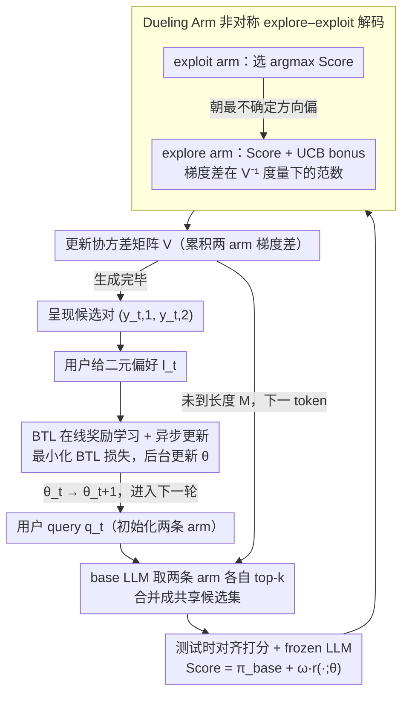

# T-POP: Test-Time Personalization with Online Preference Feedback

**会议**: ICML 2026  
**arXiv**: [2509.24696](https://arxiv.org/abs/2509.24696)  
**代码**: https://github.com/QuZikun/T-POP (有)  
**领域**: LLM 对齐 / 个性化 / 在线学习  
**关键词**: 测试时对齐, 决斗赌博机, 在线偏好反馈, 冷启动个性化, 神经 UCB  

## 一句话总结
T-POP 把"测试时对齐"和"神经决斗赌博机"拼在一起，在不动 LLM 参数的前提下，用每轮一对回复的在线偏好反馈在线学习个性化奖励函数，从而解决新用户个性化的冷启动问题。

## 研究背景与动机

**领域现状**：LLM 个性化目前主要走两条路。一条是 RLHF/DPO 式微调，按每个用户偏好重训或 LoRA 适配；另一条是免微调路线，例如 RAG 检索用户历史或把历史塞进 prompt。两条路都默认能拿到一个用户"足够多"的存量数据。

**现有痛点**：微调路线对新用户太慢、太贵——为每个用户跑一遍 RLHF 显然不现实。RAG / prompt 路线虽然轻，但本质上是"读历史"，对完全没有历史的新用户无效，也就是经典的个性化冷启动问题。

**核心矛盾**：用户偏好只有在交互中才会暴露出来，但又必须在交互过程中就把生成调得像样，否则用户根本不会留下来贡献反馈。换句话说，**"采集偏好"和"利用偏好"是同时发生的，不能拆成"先收集再部署"两阶段**。

**本文目标**：(1) 在不微调底座 LLM 的前提下，让生成在线适配单个用户；(2) 用最便宜的反馈形式——成对偏好——来驱动；(3) 让样本效率足够高，几十次交互内就能看到收益。

**切入角度**：作者把每个 decoding step 当成一个赌博机问题——候选 token 池是"臂"，用户的成对偏好就是 reward 信号。同时为了在线学奖励，必须主动产生"信息量大"的对来 query 用户，这正好是 dueling bandits 擅长的"explore vs exploit"。

**核心 idea**：在 frozen LLM 之上挂一个在线学习的神经奖励函数 $r(\cdot;\theta)$，每次同时按 token 生成两条候选回复——一条纯 exploit，一条带 UCB 探索奖励——给用户做一次成对比较，立刻用 BTL 损失更新 $\theta$。

## 方法详解

### 整体框架
T-POP 在第 $t$ 轮收到 query $q_t$，并行展开两条最长 $M$ 的解码轨迹 $y_{t,1}, y_{t,2}$，分别叫 exploitation arm 和 exploration arm。每个位置 $p$ 同时为两条序列各选下一个 token：先从 base LLM 拿各自的 top-$k$ 候选，合并成共享候选集 $\mathcal{V}_p$，再用打分函数 $\text{Score}(v|y_{<p}) = \pi_{\text{base}}(v|y_{<p}) + \omega \cdot r([y_{<p},v];\theta)$ 给每个候选打分。两条序列各自挑分最高的 token 继续展开，但 exploration arm 额外加一个梯度型 UCB bonus，每选一步还累积更新协方差矩阵 $V$。这条内层 token 循环走到长度 $M$ 后把 $(y_{t,1}, y_{t,2})$ 一起呈给用户，拿到二元偏好 $l_t = \mathbb{1}\{y_{t,1} \succ y_{t,2}\}$，立刻丢进 BTL 损失更新奖励网络 $\theta_t \to \theta_{t+1}$，进入下一轮。base LLM 全程冻结，只有那个小的 reward NN 在变。整套方法可看成「内层逐 token 解码 + 外层逐轮反馈」两层循环：

### 关键设计

**1. 测试时对齐打分 + frozen LLM：把个性化做成 logit 级后处理**

为了绕开 RLHF 微调的开销和冷启动门槛，T-POP 不动 base LLM 的任何参数，而是在每个 token 位置上给 base LLM 的 next-token 概率 $\pi_{\text{base}}(v|y_{<p})$ 加一个由奖励网络给出的偏好奖励，得到打分 $\text{Score}(v|y_{<p})=\pi_{\text{base}}(v|y_{<p})+\omega\cdot r([y_{<p},v];\theta)$，$\omega$ 控强度，选分最高者作为下一 token。个性化因此体现在解码轨迹的偏移上、而不是模型权重的更新上——既不用为每个用户单独训模型，也不用先攒一大批历史数据，per-user 几十轮就能完成"适配"，而且天然兼容只暴露 logit/top-$k$ 的闭源 LLM。

**2. Dueling Arm 的非对称 explore–exploit 解码：让每次比较都最大化信息增益**

如果两条候选回复都纯贪心，它们会几乎一样，用户根本没法判别，BTL 也学不到东西、还白白消耗用户耐心。T-POP 让 exploitation arm 纯贪心取 $v_{p,1}=\arg\max_v\text{Score}(v|y_{t,1})$，而 exploration arm 在打分上额外加一个 UCB 项 $\omega\cdot\nu\cdot u_t(v)$，其中不确定性 $u_t(v)=\|\nabla r([y_{t,2},v];\theta_t)-\nabla r([y_{t,1},v_{p,1}];\theta_t)\|_{V_{t-1}^{-1}}$ 度量该候选回复相对当前 exploit arm 在奖励参数空间中的"新颖度"，$V_{t-1}$ 是历次梯度差的二阶矩阵、更新规则为 $V_{t-1}\leftarrow V_{t-1}+(\nabla r(y_{t,1})-\nabla r(y_{t,2}))(\cdot)^\top$。这相当于强行让第二条 arm 朝奖励参数空间里"最不确定的方向"走，每次成对比较都对 $\theta$ 提供最大信息增益。理论上，作者借 Verma et al. 2024 的 neural dueling bandit 给出 $\tilde O(d_{\text{eff}}\sqrt{T})$ 的 round-level regret 界，再借 Shin et al. 2025 的 tokenized bandit 把保证扩到 token-level，得到 $\tilde O(L\sqrt T)$。

**3. BTL 在线奖励学习 + 异步更新：把二元偏好稳定地沉淀进 reward 网络**

每轮拿到的只是"用户挑了 A 还是 B"这种最省力的二元信号，T-POP 在全部历史 $\mathcal{D}_t=\{(y_{s,1},y_{s,2},l_s)\}_{s=1}^t$ 上最小化 BTL 负对数似然加 L2 正则 $\mathcal{L}_t(\theta)=-\sum[l\log\sigma(r(y_1;\theta)-r(y_2;\theta))+(1-l)\log\sigma(r(y_2;\theta)-r(y_1;\theta))]+\lambda\|\theta\|_2^2$——BTL 恰好把"挑了 A 而非 B"对应成 reward 差的 sigmoid 概率，与奖励学习目标天然对齐。为了不让训练阻塞用户体验，更新放在后台线程跑，当前请求继续用旧的 $\theta_t$ 服务、训练完再切到 $\theta_{t+1}$；个性化阶段结束后把 reward 冻结，只留 exploit arm 做普通低开销 greedy decoding。异步这一招把 BP 开销藏到用户感受不到的地方，是整套方案能"实时部署"的关键。

### 损失函数 / 训练策略
所有可训练参数都在小型 reward NN 上，损失是 BTL 负对数似然加 $\lambda\|\theta\|_2^2$；$V_t$ 初始化为 $\lambda I$；几个关键超参是 reward 权重 $\omega$、探索系数 $\nu$、候选 token 数 $k$、最大生成长度 $M$、交互轮数 $T$。

## 实验关键数据

### 主实验
在三个底座 LLM（Mistral-7B-Instruct-v0.2、Llama-3.1-8B-Instruct、Qwen2-7B-Instruct）× 四个 benchmark（HelpSteer、TruthfulQA、UltraChat、Personal Preference Eval）× 四种偏好属性（creative / verbose / concise / uplifting）下，用 ArmoRM-Llama3-8B 作为 reward judge 打分。

| 底座 | 属性 (avg) | Base | Pref | BS16 | LA | AMULET | T-POP |
|------|-----------|------|------|------|----|--------|-------|
| Mistral-7B | Concise | 0.43 | 0.45 | 0.48 | 0.52 | 0.51 | **0.60** |
| Mistral-7B | Creative | 0.32 | 0.33 | 0.34 | 0.37 | 0.40 | **0.48** |
| Qwen2-7B | Concise | 0.41 | 0.47 | 0.49 | 0.55 | 0.55 | **0.60** |
| Qwen2-7B | Uplifting | 0.38 | 0.39 | 0.40 | 0.42 | 0.42 | **0.55** |
| Llama-3.1-8B | Verbose | 0.30 | 0.31 | 0.32 | 0.35 | 0.44 | **0.50** |

聚合下来 T-POP 比最强基线 AMULET 在 Qwen2-7B 上平均提升约 28.0%，在 Mistral-7B 上约 19.9%，在 Llama-3.1-8B 上几乎打平（0.535 vs 0.5325），整体平均提升约 14.7%。

### 消融实验

| 配置 | 效果 | 说明 |
|------|------|------|
| Full T-POP（exploit + UCB exploration arm + BTL 在线更新） | 最佳 ArmoRM 分数 + 高 GPT-4o win rate | 完整方案 |
| 仅 exploit arm（去掉 UCB 探索） | 学习曲线极慢，偏好难以收敛 | 退化成"重复贪心"，没有信息增益 |
| 固定 reward（不在线更新 $\theta$） | 等价 base + 静态偏置，与 Pref 接近 | 验证在线学习是性能来源 |
| 减少交互轮数 $T$ | 前 20 轮即显著上扬，40–60 轮接近峰值 | 体现"少样本即可个性化" |

### 关键发现
- **样本效率非常陡**：前 20 轮交互内 reward 分数就快速上升，40–60 轮收敛到峰值，再往后会因小幅过拟合略降；这条曲线在三个底座、两个属性下高度一致。
- **UCB 探索是 dueling 关键**：如果把第二条 arm 也设成贪心，两条回复几乎一样，BTL 学不到东西；非对称 explore-exploit 是 reward 学习有效性的来源。
- **AMULET 在 Llama-3.1-8B 上几乎追平**：说明当 base LLM 本身对偏好属性已经比较敏感时，简单的 logit 线性调整也能走得很远；T-POP 的优势更多来自"主动探索 + 在线 BTL"在难场景下的稳健性。
- **异步更新不掉点**：把后向 pass 放后台、用旧 $\theta_t$ 继续服务的方案，在数据上没看到显著退化，但用户感知延迟基本归零。

## 亮点与洞察
- **把 dueling bandit 真正"嵌进 decoding 循环"，而不是套在 response 选择层**：以往的 best-of-N 或 reranker 也能做 pairwise feedback，但样本效率差得多；token-level dueling 把 UCB 的探索压力下放到每一步，配合 Shin et al. 的 tokenized bandit 理论给出 $\tilde O(L\sqrt T)$ regret，这是写得最漂亮的一步。
- **梯度差作不确定性度量，自然处理结构化序列**：传统 UCB 在 token 空间用频次根本算不出来，这里用 reward 网络对候选轨迹的梯度差在 $V_{t-1}^{-1}$ 度量下的范数当 "epistemic uncertainty"，等价于 NTK 视角下的探索奖励，可以无痛迁移到任何用神经 reward 的 RLHF 在线变体。
- **整套方案天然兼容闭源 LLM**：除了 logit / top-$k$ 访问几乎不需要其它接口；这意味着它能跨模型、跨用户共享同一套个性化"挂件"。

## 局限与展望
- 评估里"用户"是 GPT-4o 模拟的，BTL 假设和真实人类口味的吻合度其实没有被直接验证；真人用户反馈的噪声、刻板印象、漂移都没建模。
- 每一步需要展开两条 top-$k$ 候选并算梯度型 UCB，单步延迟比标准 greedy 高得多，对长生成场景（数千 token）部署成本仍重。
- 个性化只在"属性级"被验证（creative / concise 这种全局风格），更细的、跨任务的多面偏好（如同时偏好"严谨 + 简洁 + 带 emoji"）没分析，UCB 在多维 reward 上是否还稳定也未知。
- 偏好可能漂移，但奖励网络是单调累积的——长期使用是否需要遗忘机制 / 分段窗口，论文没讨论。

## 相关工作与启发
- **vs AMULET**（Zhang et al., 2025b）：AMULET 也是 test-time alignment 框架，把 token 选择写成在线学习问题，但缺少"主动 query 用户"的探索机制，相当于纯 exploitation；T-POP 用 dueling bandit 显式做 exploration，因此在更多轮数下持续涨点。
- **vs Linear Alignment (LA)**（Gao et al., 2024）：LA 直接对 logit 做线性调整，简单但容量有限；T-POP 用神经 reward + 在线 BTL，能拟合更细的偏好结构。
- **vs RLHF/DPO 个性化变体**（Jang et al., 2023; Li et al., 2024b; Park et al., 2024）：那些方法需要 per-user 微调权重；T-POP 完全不动 LLM，参数只在小 reward NN 上更新，因此真正能在新用户场景下"上来就用"。
- **vs RAG / prompt-based personalization**（Salemi et al., 2024; Liu et al., 2023）：那一类方法依赖既有用户语料，T-POP 直接靠在线偏好交互产生信号，覆盖冷启动新用户。

## 评分
- 新颖性: ⭐⭐⭐⭐ 把 dueling bandit 嵌入 token-level decoding 的做法以往没看到，理论保证也清晰。
- 实验充分度: ⭐⭐⭐⭐ 三个底座 × 四 benchmark × 四属性 + 学习曲线 + GPT-4o win rate，覆盖足够，但缺真人 user study。
- 写作质量: ⭐⭐⭐⭐ 算法描述与公式编号干净，附录把理论铺得很完整。
- 价值: ⭐⭐⭐⭐ 给"闭源 LLM 的个性化"提供了一个落地友好的范式，工业上比再训 LoRA 更现实。

<!-- RELATED:START -->

## 相关论文

- [\[ICML 2025\] PARM: Multi-Objective Test-Time Alignment via Preference-Aware Autoregressive Reward Model](../../ICML2025/recommender/parm_multi-objective_test-time_alignment_via_preference-aware_autoregressive_rew.md)
- [\[NeurIPS 2025\] MMPB: It's Time for Multi-Modal Personalization](../../NeurIPS2025/recommender/mmpb_its_time_for_multi-modal_personalization.md)
- [\[ACL 2026\] Personalizing LLMs with Binary Feedback: A Preference-Corrected Optimization Framework](../../ACL2026/recommender/personalizing_llms_with_binary_feedback_a_preference-corrected_optimization_fram.md)
- [\[ACL 2026\] Mirroring Users: Towards Building Preference-aligned User Simulator with User Feedback in Recommendation](../../ACL2026/recommender/mirroring_users_towards_building_preference-aligned_user_simulator_with_user_fee.md)
- [\[AAAI 2026\] Preference is More Than Comparisons: Rethinking Dueling Bandits with Augmented Human Feedback](../../AAAI2026/recommender/preference_is_more_than_comparisons_rethinking_dueling_bandits_with_augmented_hu.md)

<!-- RELATED:END -->
