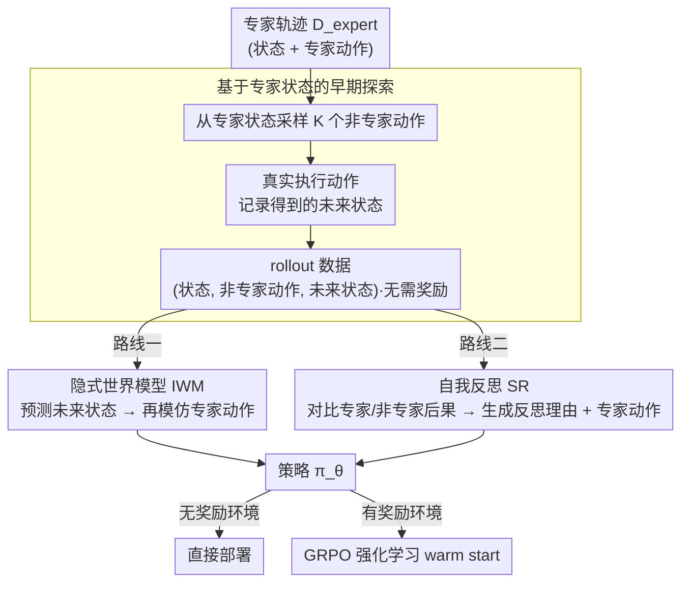

# Agent Learning via Early Experience

**会议**: ICML2026  
**arXiv**: [2510.08558](https://arxiv.org/abs/2510.08558)  
**代码**: 无  
**领域**: 强化学习 / LLM Agent  
**关键词**: 早期经验, 隐式世界模型, 自我反思, 模仿学习, Agent 强化学习  

## 一句话总结
本文提出 early experience 范式，让语言 Agent 在没有外部奖励的情况下利用自己尝试动作后的未来状态学习环境动态和决策反思，从而在 8 个 Agent 环境中稳定超过纯模仿学习，并为后续 GRPO 强化学习提供更好的初始化。

## 研究背景与动机

**领域现状**：当前语言 Agent 主要有两条训练路线。一条是用专家轨迹做监督微调，把 Agent 看成从状态到动作的行为克隆器；另一条是强化学习，让 Agent 通过环境奖励优化长期回报。前者训练简单、奖励无关，已经被广泛用于网页导航、工具调用和具身文本环境；后者更符合“从经验中学习”的长期目标，但在真实 Agent 场景里远没有棋类或 Atari 那样成熟。

**现有痛点**：纯模仿学习只告诉模型专家在某个状态下做了什么，却不告诉它“如果自己做错一步会发生什么”。一旦部署时模型偏离专家轨迹，它会进入训练数据没有覆盖的新状态，错误会沿着长轨迹累积。强化学习理论上可以解决这个问题，但现实网页、API、多轮工具任务往往没有可靠奖励，或者奖励太稀疏、轨迹太长，导致训练成本和稳定性都很差。

**核心矛盾**：语言 Agent 需要从自身交互中学习，但许多环境暂时无法提供可验证奖励。也就是说，我们想要 RL 式的经验覆盖，却又不能依赖 RL 所需的奖励信号。

**本文目标**：作者想回答一个更务实的问题：在没有外部奖励的情况下，Agent 能否把自己的动作后果转化为监督信号？如果可以，这些信号是否能同时提升普通任务表现、域外泛化，以及后续真正做 RL 时的上限？

**切入角度**：论文观察到，即使环境不给奖励，执行一个动作后得到的未来状态本身也包含信息。比如网页报错、工具返回空结果、页面元素变化，都在告诉 Agent 当前动作造成了什么后果。只要能把这些后果变成训练目标，就可以在专家演示和完整 RL 之间构造一个中间训练阶段。

**核心 idea**：用 Agent 自己提出的非专家动作及其未来状态替代外部奖励，把“动作后会发生什么”和“为什么专家动作更好”转化为两个监督学习任务。

## 方法详解

### 整体框架

论文把语言 Agent 决策形式化为 MDP：状态 $s$ 是网页内容、工具输出或文本环境描述，动作 $a$ 是点击、调用工具或生成文本，策略 $\pi_\theta$ 根据状态输出动作分布。传统模仿学习只使用专家数据 $\mathcal{D}_{expert}=\{(s_i,a_i)\}$，优化 $\mathcal{L}_{IL}=-\sum_i \log \pi_\theta(a_i\mid s_i)$。

early experience 在这个基础上多做一步：对每个专家状态 $s_i$，让当前模型采样 $K$ 个不同于专家动作的候选动作 $a_i^j$，真实执行这些动作，得到对应未来状态 $s_i^j$。这样形成 rollout 数据 $\mathcal{D}_{rollout}=\{(s_i,a_i^j,s_i^j)\}$。这些数据不需要奖励标注，也不要求动作成功；关键是它们来自 Agent 自己会犯的错误和会探索到的分支。

作者围绕这批未来状态设计了两种训练方式。第一种是隐式世界模型：训练同一个语言模型根据“当前状态 + 动作”预测未来状态，让策略参数吸收环境动态。第二种是自我反思：比较专家动作和候选动作的未来状态，让模型生成为什么专家动作更好的解释，再用“解释 + 专家动作”作为监督目标。二者都不是在线 RL，而是把无奖励交互转成离线可训练的 token 预测任务，最后得到的策略既能直接部署，也能作为后续 GRPO 强化学习的 warm start。

### 关键设计

**1. 基于专家状态的早期探索：用模型自己的动作后果替代奖励。** 真实 Agent 的长轨迹 rollout 代价高、奖励稀疏，纯随机探索更是浪费。本文不把 Agent 完全放飞，而是以专家轨迹中的状态 $s_i$ 为锚点：让当前模型采样 $K$ 个不同于专家动作的候选动作 $a_i^j$ 并真实执行，记录得到的未来状态 $s_i^j$，连同专家动作产生的下一状态 $s_{i+1}$ 一起收进 rollout 数据 $\mathcal{D}_{rollout}=\{(s_i,a_i^j,s_i^j)\}$。这批数据不需要奖励标注、也不要求动作成功，关键在于它们恰好覆盖“模型部署时很可能会偏离到的局部分支”。以专家状态为锚点，既保证探索从有意义的深层状态出发、不浪费在无关分支上，又主动暴露模型自己会犯的局部错误，为后面两种训练方式提供原料。

**2. 隐式世界模型 IWM：把环境动态直接灌进策略参数。** 传统世界模型通常作为独立 simulator 服务于规划，要额外模块、还在推理时带来开销。IWM 换了个思路：把每个三元组 $(s_i,a_i^j,s_i^j)$ 改写成 next-token prediction——输入当前状态和动作，目标预测执行后的文本状态，损失为 $\mathcal{L}_{IWM}=-\sum \log p_\theta(s_i^j\mid s_i,a_i^j)$（专家转移 $s_{i+1}$ 也一并并入）。训练分两阶段：先用 IWM 目标做一轮动态建模，再回到专家动作上做模仿学习微调。由于状态预测和动作预测共用同一组参数 $\theta$，策略在微调前就已经“见过”错误动作触发的页面变化、工具副作用和报错信息，没有任何额外推理开销却内化了粗粒度的环境动态，从而对部署时的分布漂移更鲁棒。

**3. 自我反思 SR：把失败后果总结成可迁移的决策理由。** 只做偏好学习（如 DPO）会把非专家动作当成 rejected response，却不解释环境为什么反馈不好。SR 利用语言模型擅长总结规则的能力补上这一步：对同一状态，比较专家动作的下一状态 $s_{i+1}$ 和替代动作的下一状态 $s_i^j$，提示同一个模型生成反思文本 $c_i^j$，解释为什么专家动作更合适；再以“反思 + 专家动作”为监督目标训练 $\mathcal{L}_{SR}=-\sum \log p_\theta(c_i^j,a_i\mid s_i)$，并与原始专家数据混合。因为反思 grounded 在真实执行后的状态差异——“预算超了”“工具参数缺失”“页面进入错误分支”——它把环境后果写成了可复用的决策原则，比凭空编造 rationale 更可信，也更容易迁移到新任务。

### 损失函数 / 训练策略

训练采用两种同属 early experience 的 recipe。IWM 先训练一轮未来状态预测，再在总更新步数不超过 imitation learning 的前提下继续做专家动作监督；SR 与专家数据混合，训练轮数与 imitation learning 保持一致。所有环境使用相同 prompt 格式和解码策略，作者先为 IL baseline 选择合适训练步数，再固定这个预算用于 IWM 和 SR，以避免方法收益来自额外优化步数。

实验模型包括 Llama-3.2-3B、Qwen-2.5-7B 和 Llama-3.1-8B。环境覆盖 ALFWorld、ScienceWorld、TravelPlanner、BFCLv3、Tau-Bench、SearchQA、WebShop、WebArena-Lite 等 8 类任务，既有有限动作空间，也有大型结构化工具空间和开放网页动作空间。

## 实验关键数据

### 主实验

| 代表环境 | 模型 | IL | Ours-IWM | Ours-SR | 主要结论 |
|--------|------|------|----------|---------|----------|
| ALFWorld | Llama-3.2-3B | 78.1 | 83.6 (+5.5) | 85.9 (+7.8) | 两种 early experience 都提升具身文本任务成功率 |
| ScienceWorld | Llama-3.1-8B | 54.7 | 57.0 (+2.3) | 68.0 (+13.3) | SR 对需要多步推理的科学实验特别有效 |
| TravelPlanner | Qwen-2.5-7B | 16.7 | 22.2 (+5.5) | 31.7 (+15.0) | 自我反思显著改善长程约束满足 |
| BFCLv3 | Llama-3.2-3B | 21.3 | 25.3 (+4.0) | 29.3 (+8.0) | 工具调用中 SR 能减少逻辑和顺序错误 |
| WebShop | Llama-3.1-8B | 47.3 | 58.6 (+11.3) | 58.2 (+10.9) | 网页购物中未来状态预测带来大幅收益 |
| WebArena-Lite | Llama-3.1-8B | 4.9 | 8.5 (+3.6) | 8.5 (+3.6) | 在噪声更大的网页可访问树上也能提升 |

### 消融实验

| 分析项 | 设置 | 关键指标 | 说明 |
|------|------|---------|------|
| 域外泛化 | ALFWorld / BFCLv3 / SearchQA OOD | IWM/SR 全部优于 IL，多数提升 2-9 点 | 早期经验覆盖了专家轨迹外的状态，因此域外下降幅度更小 |
| 后续 RL 初始化 | WebShop / ALFWorld / SearchQA + GRPO | early-experience checkpoint 的 RL 后上限均高于 IL checkpoint | 即使后面有奖励优化，先学习未来状态/反思仍能提供更好的起点 |
| 人类数据量 | WebShop、ALFWorld 不同比例专家演示 | WebShop 仅用 1/8 演示即可超过全量 IL；ALFWorld 约 1/2 演示超过全量 IL | 自身动作后果提供了专家数据之外的信息量 |
| 分支数 $K$ | 每个专家状态采样不同数量替代动作 | IWM 随 $K$ 增大较稳定提升；SR 在 $K=2$ 到 $4$ 附近更合适 | IWM 需要更多动态覆盖，SR 则受上下文和对比质量限制 |

### 关键发现
- IWM 更适合状态转移规则稳定、未来状态可预测的环境，例如 WebShop 和 ALFWorld；它让模型提前理解“这个动作会把页面或环境推到哪里”。
- SR 更适合错误主要来自推理、约束和工具选择的场景，例如 TravelPlanner、ScienceWorld 和 BFCLv3；它把错误分支总结成决策理由。
- early experience 不只是替代 imitation learning，还能作为 RL warm start。用相同 GRPO recipe 时，从 IWM/SR checkpoint 出发的最终性能持续高于从 IL checkpoint 出发。
- 与 Long CoT、STaR-style rationale 和 DPO 相比，early experience 的优势在于反思或预测都 grounded 在真实执行后的未来状态，而不是只凭模型想象理由或只构造偏好对。

## 亮点与洞察
- 最核心的亮点是把“没有奖励”重新解释为“仍然有状态反馈”。许多 Agent 环境确实不给成功标签，但网页变化、工具输出和错误消息本身就是关于动作质量的弱监督。
- IWM 的设计很轻量：它没有训练外置 simulator，也没有在推理时做模型预测规划，而是把未来状态预测当成一种 mid-training。这个选择牺牲了显式规划能力，但换来了可直接复用现有 LLM 微调框架的工程可行性。
- SR 比普通 rationale distillation 更可信，因为解释来自同一状态下专家动作和模型动作的后果对比。它不是让模型凭空解释“为什么这么做”，而是让模型看见“这么做之后哪里坏了”。
- 论文把 early experience 放在 imitation learning 和 RL 之间的位置很清楚：短期看，它降低对专家数据的依赖；长期看，它让后续 RL 从更懂环境动态的策略开始。

## 局限与展望
- 论文仍依赖专家轨迹作为探索锚点，因此不是完全从零开始的 experience learning。若任务没有可用示范，early experience 如何初始化仍需要额外研究。
- 未来状态必须能被文本化并用于训练。对高维视觉状态、动态图形界面或强实时交互，简单的文本摘要可能丢失关键信息。
- SR 需要生成反思文本，反思质量受模型自身能力和 prompt 影响；如果替代动作并非真正更差，或者专家轨迹本身有瑕疵，反思会把错误偏好固化进模型。
- IWM 和 SR 当前主要是离线阶段，尚未形成持续收集新经验、过滤经验、更新策略的闭环系统。后续可以研究带不确定性估计的数据选择、反思质量判别器，以及与在线 RL 的交替训练。

## 相关工作与启发
- **vs 纯模仿学习**: 模仿学习只学习专家状态到动作的映射，本文额外执行模型自己的替代动作并学习后果，因此能缓解部署时偏离专家轨迹后的分布漂移。
- **vs 传统世界模型 / model-based RL**: 传统世界模型通常作为独立动态模型供 planning 使用，本文的 IWM 把未来状态预测直接并入策略参数，更像无奖励的 Agent mid-training。
- **vs Self-Reflection prompting**: 以往反思多发生在推理时，而且常常需要外部反馈或奖励；本文把反思写入训练数据，并用真实状态差异 grounding 解释。
- **vs STaR / rationale distillation**: STaR 式方法为正确动作合成理由，但理由未必见过错误动作后果；本文的 SR 明确比较专家动作和替代动作的未来状态，减少空泛解释。
- **vs DPO**: DPO 把专家动作和非专家动作做成 chosen/rejected 对，信号更粗；本文显示在 WebShop 和 ALFWorld 上 DPO 弱于 IWM/SR，而且训练更容易崩。

## 评分
- 新颖性: ⭐⭐⭐⭐☆ 从“未来状态即监督”切入 Agent 学习，范式清楚，虽然相关于世界模型和反思，但组合方式很有启发。
- 实验充分度: ⭐⭐⭐⭐⭐ 覆盖 8 个环境、3 个模型家族/规模、OOD、数据量、分支数、RL warm start 和 baseline 对比，证据链很完整。
- 写作质量: ⭐⭐⭐⭐☆ 论文主线清晰，IWM/SR 的位置讲得明白；不足是表格很多，细节需要翻附录才能拼全。
- 价值: ⭐⭐⭐⭐⭐ 对当前 LLM Agent 训练非常实用，尤其适合作为无奖励环境中介于 SFT 和 RL 之间的训练阶段。

<!-- RELATED:START -->

## 相关论文

- [\[ICLR 2026\] ExGRPO: Learning to Reason from Experience](../../ICLR2026/reinforcement_learning/exgrpo_learning_to_reason_from_experience.md)
- [\[ICML 2026\] LLM-Guided Communication for Cooperative Multi-Agent Reinforcement Learning](llm-guided_communication_for_cooperative_multi-agent_reinforcement_learning.md)
- [\[ICML 2026\] Vulnerable Agent Identification in Large-Scale Multi-Agent Reinforcement Learning](vulnerable_agent_identification_in_large-scale_multi-agent_reinforcement_learnin.md)
- [\[ICML 2026\] Interaction-Breaking Adversarial Learning Framework for Robust Multi-Agent Reinforcement Learning](interaction-breaking_adversarial_learning_framework_for_robust_multi-agent_reinf.md)
- [\[ICML 2026\] Multi-Agent Decision-Focused Learning via Value-Aware Sequential Communication](multi-agent_decision-focused_learning_via_value-aware_sequential_communication.md)

<!-- RELATED:END -->
