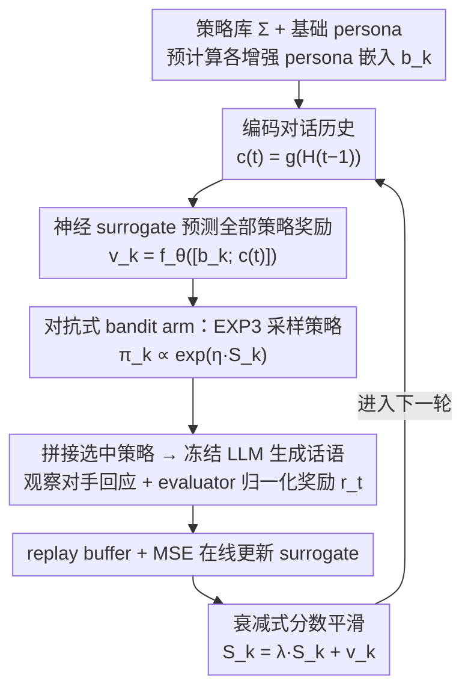

# ALSO: Adversarial Online Strategy Optimization for Social Agents

**会议**: ICML 2026  
**arXiv**: [2605.15768](https://arxiv.org/abs/2605.15768)  
**代码**: https://github.com/Babylonehy/ALSO  
**领域**: 多智能体 / 社会智能  
**关键词**: LLM社会智能, 多智能体模拟, 在线策略优化, 对抗多臂老虎机, Sotopia  

## 一句话总结
ALSO 把 LLM 社会智能模拟中的动态策略选择建模为对抗在线 bandit，并用轻量级奖励代理模型从对话历史中泛化稀疏反馈，在 Sotopia-Hard 上把整体分数从 3.02 提升到 3.53，尤其显著改善关系维度。

## 研究背景与动机
**领域现状**：LLM 社会模拟通常用 persona 描述一个智能体是谁，包括性格、职业、背景和目标；在多轮对话中，模型根据 persona 和场景生成行动。Sotopia 等 benchmark 已经把社会智能从静态问答推进到开放式多轮互动。

**现有痛点**：静态 persona 不等于动态策略。一个智能体可以始终“是同一个人”，但在谈判、冲突、合作中需要不断切换策略。已有方法要么离线训练策略模型，要么用 prompt optimizer 在固定验证集上找指令，这些方法默认奖励分布稳定，而社会互动里的对手会随对话共同演化。

**核心矛盾**：社会场景的反馈既稀疏又非平稳。一个策略在前几轮有效，可能因为对方改变立场而在后几轮失效；标准随机 bandit 或离线 prompt optimization 很难利用这种随时间漂移的反馈。

**本文目标**：作者希望在不微调 LLM、不额外调用昂贵 LLM 优化器的前提下，让智能体在每轮对话中根据历史状态选择更合适的社会策略，并从即时评价反馈中持续更新。

**切入角度**：论文把候选社会策略看成 bandit arms，把对话历史看成上下文，把 per-turn LLM 评价器给出的归一化奖励看成在线反馈。由于对手会适应，作者选择对抗 bandit 视角而不是平稳随机 bandit。

**核心 idea**：用 EXP3 式随机化策略选择保证非平稳环境下的探索鲁棒性，再用神经 surrogate 在“历史上下文 + 策略语义”上预测奖励，弥补稀疏反馈无法覆盖全部策略的问题。

## 方法详解
ALSO 的对象不是模型参数，而是每轮插入到 persona 后面的策略指令。它把原本固定的 persona prompt 拆成两层：基础身份保持不变，行为策略按在线学习器选择。这样做的好处是身份连续性不会被破坏，但行动方式可以随对话局势改变。

### 整体框架
在两智能体社会模拟中，每个 agent 有基础 persona、私有目标和候选策略集合 $\Sigma=\{\sigma_1,\dots,\sigma_K\}$。每一轮开始时，ALSO 先编码当前对话历史，再把每个候选策略与基础 persona 拼接成增强 persona，并预先计算或复用其嵌入。神经 value network 对每个候选策略预测当前奖励，EXP3 风格的指数权重分布采样一个策略，agent 用“基础 persona + 选中策略”生成下一轮话语。

对话环境返回对手回应后，LLM evaluator 给出 turn-level 多维评分，ALSO 将其归一化为标量奖励。这个样本会加入 replay buffer，用 MSE 更新 surrogate，同时用带衰减的 score smoothing 更新每个策略 arm 的累计分数。底层 LLM 完全冻结，在线变化只发生在策略选择器和轻量级 value network。

### 关键设计

**1. 策略作为对抗式 bandit arm（exponential-weights 选择）**：社会互动的奖励会随对手反应和对话阶段不断漂移，把策略选择当成平稳随机问题（贪心或固定验证集搜索）会被这种非平稳性反噬。ALSO 把策略空间 $\Sigma=\{\sigma_1,\dots,\sigma_K\}$ 里的每条策略指令当作一个 arm，选中后与基础 persona 拼成增强 persona $b^{(t)}=b^0\oplus\sigma_{k_t}$ 再喂给冻结的 LLM。每轮按指数权重分布 $\pi_k^{(t)}\propto\exp(\eta S_k^{(t-1)})$ 随机采样一个 arm，而非贪心取最高分。这种 EXP3 式随机化是对抗设定下的关键——贪心策略容易被对手摸清规律、或过拟合到转瞬即逝的局势，随机化能在非平稳环境里保持探索鲁棒性。

**2. 历史感知的神经 surrogate（密集化稀疏反馈）**：bandit 每轮只看得到被选中那条策略的奖励，而 12 条候选策略里大多数（及其同义改写）可能整局都没被采样到，直接按 arm 累计奖励极其低效。ALSO 用一个冻结 embedding 模型 $g(\cdot)$ 分别编码对话历史 $\mathbf{c}^{(t)}=g(\mathcal{H}^{(t-1)})$ 和预计算好的增强 persona 嵌入 $\mathbf{b}_k$，拼成特征 $\mathbf{x}_k^{(t)}=[\mathbf{b}_k;\mathbf{c}^{(t)}]$，再由可训练 value network $f_\theta$ 一次性预测全部 arm 的当前奖励 $\hat v_k^{(t)}=f_\theta(\mathbf{x}_k^{(t)})$。因为语义相近的策略（如“先验证再转向”与“合作式谈判”）在相似上下文里往往同样有效，surrogate 能把单条反馈泛化到语义邻近的策略上，给指数权重分布提供稠密的分数估计——这也是消融里最关键的部件，去掉后 Overall 从 3.91 掉到 3.33。

**3. 衰减式分数平滑（追踪非平稳漂移）**：经典 EXP3 把历史反馈等权累加，但社会对话的最优策略常随阶段切换，过度记忆早期反馈会让策略僵化。ALSO 给累计分数加一个指数衰减因子 $\lambda\in(0,1]$（实验取 0.9），更新为 $S_k^{(t)}=\lambda S_k^{(t-1)}+\hat v_k^{(t)}$，让近期证据主导、旧反馈逐渐淡出。这样 arm 分数既保留历史经验、又能对对手立场变化快速响应，在“过度记忆早期反馈导致僵化”和“只看最近反馈导致高方差”之间取得平衡。

### 损失函数 / 训练策略
ALSO 不微调 LLM。唯一训练的是 value network，它用 replay buffer 中的样本最小化预测奖励和 evaluator 奖励之间的 MSE。策略选择器使用指数权重和 score smoothing 在线更新。实验默认使用 12 个预定义社会策略，每个 episode 最多 20 轮；双边设置下两个 agent 各自维护独立 optimizer，并只根据自身反馈更新。

## 实验关键数据

### 主实验
主实验在 Sotopia-All 和更困难的 Sotopia-Hard 上评估，agent 交互使用 DeepSeek-V3.2，最终报告用独立 GPT-4o Sotopia-Eval 评价。ALSO 不需要额外 LLM optimizer 调用，而 OPRO 和 EvoPrompt 会周期性调用优化器生成或变异 prompt。

| Benchmark | 方法 | Goal | Rel. | Know. | Overall |
|-----------|------|------|------|-------|---------|
| Sotopia-All | Vanilla | 8.21 | 2.54 | 5.28 | 3.62 |
| Sotopia-All | INSTINCT | 8.51 | 2.84 | 6.09 | 3.85 |
| Sotopia-All | ALSO | 8.50 | 2.90 | 6.14 | 3.89 |
| Sotopia-Hard | Vanilla | 6.52 | 1.32 | 4.37 | 3.02 |
| Sotopia-Hard | INSTINCT | 6.92 | 2.16 | 5.44 | 3.43 |
| Sotopia-Hard | ALSO | 7.11 | 2.43 | 5.47 | 3.53 |

### 消融实验
组件消融在 Sotopia-Hard 上进行，逐一去掉或替换 ALSO 的关键部件。

| 配置 | Goal | Rel. | Know. | Overall | 说明 |
|------|------|------|-------|---------|------|
| ALSO full | 7.93 | 3.07 | 6.46 | 3.91 | 完整模型 |
| w/o EXP3，用 $\varepsilon$-greedy | 7.50 | 2.71 | 5.32 | 3.61 | 随机化对抗探索被削弱 |
| w/o Score Smoothing | 7.57 | 2.25 | 5.39 | 3.57 | 关系维度下降最明显 |
| w/o Context Embedding | 7.43 | 2.64 | 4.82 | 3.51 | 无法根据对话阶段选策略 |
| w/o Neural Surrogate | 6.89 | 2.00 | 4.93 | 3.33 | 整体和关系维度退化最大 |

### 关键发现
- ALSO 在 Sotopia-Hard 上的最大收益来自 Relationship，从 Vanilla 的 1.32 提升到 2.43，相对提升 83.79%，说明在线策略切换主要缓解了冲突和僵局。
- 去掉 neural surrogate 后 Overall 从 3.91 降到 3.33，是最关键的消融；这说明只用 bandit 计数无法充分利用策略语义和对话历史。
- 双边优化优于只优化一方，且在 Qwen-2.5-72B-Instruct 与 DeepSeek-V3.2 上都显著，说明社会互动中双方共同适应比单边策略注入更符合任务机制。
- 跨场景泛化实验中，zero-shot transfer 在 7 个未见 Sotopia-Hard 场景上把 Overall 从 3.17 提升到 3.60，说明 surrogate 学到的不只是场景记忆。

## 亮点与洞察
- 论文很好地区分了 persona 和 strategy。persona 定义“是谁”，strategy 定义“怎么行动”；社会智能的关键往往不是换身份，而是在同一身份下调整互动方式。
- 对抗 bandit 视角比离线 prompt optimizer 更适合社会模拟。Sotopia 里的奖励不是固定验证集上的静态分数，而是由双方共同演化出的轨迹结果。
- 轻量 surrogate 是性价比很高的设计。它不需要生成新 prompt，也不改 LLM 参数，却能让策略选择从稀疏 bandit 反馈中获得上下文泛化。

## 局限与展望
- 策略空间是人工预定义的 12 类社会策略，覆盖面和粒度会影响上限；真实开放社交中可能需要自动扩展或层次化策略库。
- per-turn evaluator 本身是 LLM，奖励可能带有偏差、尺度漂移和自洽性问题；虽然最终 judge 分离，但在线学习仍受 shaping reward 质量限制。
- 论文主要在两智能体 Sotopia 场景中验证，多方群体互动、长期记忆和联盟形成是否适用还没有充分展开。
- ALSO 的理论使用对抗 bandit 作为设计理由，并未给出严格 regret 保证；在强非平稳 LLM 环境下，这可以理解，但也留下了理论分析空间。

## 相关工作与启发
- **vs Sotopia-RL / SDPO**: 这些方法通过离线训练或偏好优化提升社会行为，代价是数据收集和模型更新；ALSO 不改模型参数，更适合部署时快速适应。
- **vs OPRO / EvoPrompt**: 它们把 prompt 优化看作静态任务上的搜索；ALSO 把每轮策略选择看作在线决策，能响应对话过程中的奖励漂移。
- **vs 外部 planner 方法**: Sotopia-Ω、DAT、EPO 等方法依赖离线学到的规划器；ALSO 直接在互动过程中根据反馈调策略，避免每次新策略都重训规划器。
- **启发**: 对 agent 系统来说，很多“能力不足”可能不是底座模型不会，而是缺少可在线调整的行为策略层。把策略层从 persona 中解耦出来，是构建可控社会智能 agent 的一个实用方向。

## 评分
- 新颖性: ⭐⭐⭐⭐☆ 把社会策略优化明确落到 adversarial online bandit 上很有针对性，虽然核心算法组件来自已有在线学习思想。
- 实验充分度: ⭐⭐⭐⭐☆ 有主结果、组件消融、双边/单边、跨场景和异构模型分析，但仍集中在 Sotopia 系列场景。
- 写作质量: ⭐⭐⭐⭐☆ 问题定义和算法流程清楚，实验解释能对应到社会互动机制。
- 价值: ⭐⭐⭐⭐☆ 对多智能体 agent 的在线行为控制很有参考价值，尤其适合不希望微调模型的应用。

<!-- RELATED:START -->

## 相关论文

- [\[ACL 2026\] Breaking the Impasse: Dual-Scale Evolutionary Policy Training for Social Language Agents](../../ACL2026/reinforcement_learning/breaking_the_impasse_dual-scale_evolutionary_policy_training_for_social_language.md)
- [\[CVPR 2026\] Adversarial Agents: Black-Box Evasion Attacks with Reinforcement Learning](../../CVPR2026/reinforcement_learning/adversarial_agents_black-box_evasion_attacks_with_reinforcement_learning.md)
- [\[ACL 2026\] DPEPO: Diverse Parallel Exploration Policy Optimization for LLM-based Agents](../../ACL2026/reinforcement_learning/dpepo_diverse_parallel_exploration_policy_optimization_for_llm-based_agents.md)
- [\[NeurIPS 2025\] Online Optimization for Offline Safe Reinforcement Learning](../../NeurIPS2025/reinforcement_learning/online_optimization_for_offline_safe_reinforcement_learning.md)
- [\[ICML 2026\] Interaction-Breaking Adversarial Learning Framework for Robust Multi-Agent Reinforcement Learning](interaction-breaking_adversarial_learning_framework_for_robust_multi-agent_reinf.md)

<!-- RELATED:END -->
