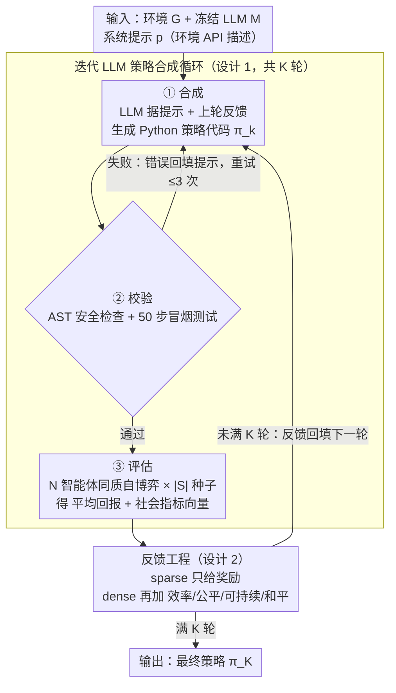

# Beyond Scalar Rewards: Dense Feedback for LLM Policy Synthesis in Sequential Social Dilemmas

**会议**: ICML2026  
**arXiv**: [2603.19453](https://arxiv.org/abs/2603.19453)  
**代码**: https://github.com/vicgalle/llm-policies-social-dilemmas  
**领域**: 强化学习  
**关键词**: LLM策略合成, 多智能体, 社会困境, 反馈工程, 程序化策略  

## 一句话总结

提出 LLM 迭代策略合成框架，让 LLM 直接生成 Python 策略代码用于多智能体序贯社会困境，并通过"反馈工程"证明：在标量奖励基础上加入效率/公平/可持续/和平四项社会指标作为 dense feedback，可以打破"反馈混叠"问题，在 Cleanup 游戏中实现高达 54% 的效率提升。

## 研究背景与动机

**领域现状**：序贯社会困境（SSD）是多智能体强化学习的经典测试场景，其中个体理性行为导致集体次优结果。传统 MARL 方法通过梯度优化在参数空间中学习策略，但面临信用分配困难、非平稳性和巨大的联合动作空间等问题。

**现有痛点**：近年来 LLM 在策略合成方面展现出新范式——直接在算法空间生成可执行代码实现复杂协调策略（如 FunSearch、Eureka），但一个关键问题未被回答：在迭代合成过程中，LLM 应该收到什么反馈信息？现有工作（Reflexion、Self-Refine）虽然证明了反馈循环的价值，但都只使用标量奖励作为反馈信号。

**核心矛盾**：标量奖励存在"反馈混叠"问题——当不同的失败模式（如清洁不足 vs 清洁过度）映射到相同的标量奖励值时，LLM 无法判断应该往哪个方向修正策略。

**本文目标**：系统性研究反馈工程（feedback engineering）这一设计轴——比较稀疏反馈（仅标量奖励）与密集反馈（奖励 + 社会指标）对 LLM 策略合成质量的影响，并解释其作用机制。

**切入角度**：作者假设多目标社会指标并非分散 LLM 注意力的干扰信号，而是帮助诊断失败模式的协调信号。

**核心 idea**：在 LLM 迭代策略合成的反馈中加入效率、公平、可持续性、和平四项社会指标，利用这些维度打破标量奖励的信息混叠，使 LLM 能诊断出正确的策略修正方向。

## 方法详解

### 整体框架

框架接收环境描述和 LLM 作为输入，执行 $K$ 轮迭代循环，每轮走完「合成→校验→评估→反馈」四个阶段：LLM 根据系统提示和上一轮反馈生成 Python 策略代码 $\pi_k$，经过 AST 安全检查和 50 步冒烟测试验证（失败回填错误信息重试，最多 3 次）后，在 $N$ 智能体同质自博弈中评估，算出平均回报和社会指标，最后按指定反馈级别（sparse 或 dense）打包反馈给下一轮。所有 $N$ 个智能体共享同一策略代码，策略函数可访问完整环境状态和 BFS 寻路等辅助工具库。

> 框架图覆盖方法的两个可操作设计（循环机制、反馈级别）；设计 3「反馈混叠理论」是对上图为何在不同游戏里效果两极的**事后解释**，不对应流程里的某个阶段。

### 关键设计

**1. 迭代 LLM 策略合成循环：在算法空间而非参数空间里优化多智能体策略**

传统 MARL 在参数空间靠梯度优化，被信用分配、非平稳性、巨大联合动作空间拖累。本文换一条路：让冻结的 LLM $\mathcal{M}$ 当策略合成器，每轮根据系统提示 $p$ 和上一轮反馈 $q_k$ 直接生成可执行的 Python 策略代码 $\pi_{k+1} = \mathcal{M}(p, q(\pi_k, \mathcal{F}_k^\ell))$。每个生成的策略先过 AST 安全检查（屏蔽 eval、文件 I/O、网络访问等危险操作）和 50 步冒烟测试，失败就把错误信息追加进提示重试（最多 3 次），通过后在 $N$ 智能体同质自博弈、$|S|=5$ 个随机种子上评估，算出平均回报 $\bar r_k$ 和社会指标向量 $\mathbf{m}_k=(U_k,E_k,S_k,P_k)$。所有智能体共享同一份策略代码，策略函数能访问完整环境状态和 BFS 寻路等工具库。这套循环的价值在于：单次 LLM 生成就能产出需要数百万 RL episode 才能发现的复杂协调算法（如领地划分、角色分配），直接绕开了 MARL 的样本效率瓶颈。

**2. 反馈工程：用 sparse / dense 两档反馈控制 LLM 看到多少诊断信息**

这是本文真正的实验变量。作者定义两个反馈级别：稀疏反馈 $\mathcal{F}_k^{sp}=(\text{code}(\pi_k),\bar r_k)$ 只给策略源码和标量奖励；密集反馈 $\mathcal{F}_k^{dn}=(\text{code}(\pi_k),\bar r_k,\mathbf{m}_k,\mathbf{d})$ 额外附上效率/公平/可持续/和平四项社会指标及其自然语言定义。一个关键约束是这些社会指标只作为信息上下文呈现、**不改变优化目标**——系统提示始终要求最大化人均奖励。这样设计是因为标量奖励可能把诊断信息丢掉了，而多维社会指标能给 LLM 提供"这次为什么失败"的线索，同时又不引入多目标优化的复杂度。

**3. 反馈混叠理论：解释 dense feedback 为何在不同游戏里效果两极**

为什么 dense feedback 在 Cleanup 上猛涨、在 Gathering 上几乎无差？作者给了一个可证伪的解释。在 Cleanup 里总奖励关于清洁者数量 $n_c$ 是凹函数、存在内部最优点——低于和高于最优点的两种失败（清洁不足 vs 清洁过度）会产生**相同的标量奖励却需要相反的修正方向**，这就是"反馈混叠"：LLM 光看标量奖励根本不知道该往哪边改。社会指标恰好把这个混叠打开——清洁不足表现为低可持续性 $S$，清洁过度表现为低公平性 $E$，两种失败在指标空间里被区分开。而在 Gathering 里协调问题本身就是单轴的、不存在这种混叠，所以两种反馈模式效果相当。这个理论不只解释了实验差异，还提供了一个能迁移到奖励塑形、多目标优化、RLHF 奖励模型设计的通用分析框架。

## 实验关键数据

### 主实验

实验在两个 SSD 环境（Gathering、Cleanup）上进行，使用 $N=10$ 智能体、$K=3$ 迭代、$|S|=5$ 种子、3 次独立运行，测试 Claude Sonnet 4.6 和 Gemini 3.1 Pro 两个前沿 LLM。

| 游戏 | 模型 | 反馈模式 | 效率 $U$ | 公平 $E$ | 可持续 $S$ |
|------|------|---------|----------|----------|-----------|
| Gathering | Claude | zero-shot | 1.85 | 0.52 | 298.6 |
| Gathering | Claude | reward-only | 3.47 | 0.72 | 402.9 |
| Gathering | Claude | reward+social | **3.53** | **0.84** | **452.7** |
| Gathering | Gemini | reward-only | 4.58 | 0.97 | 502.5 |
| Gathering | Gemini | reward+social | **4.59** | **0.97** | **502.7** |
| Cleanup | Claude | reward-only | 1.14 | -0.47 | 233.0 |
| Cleanup | Claude | reward+social | **1.37** | **0.09** | **294.6** |
| Cleanup | Gemini | reward-only | 1.79 | 0.13 | 386.0 |
| Cleanup | Gemini | reward+social | **2.75** | **0.54** | **432.6** |

### 与基线对比

| 方法 | Gathering $U$ | Cleanup $U$ | 特点 |
|------|-------------|------------|------|
| 最佳 LLM（Gemini dense） | **4.59** | **2.75** | 代码级迭代 + dense 反馈 |
| GEPA（Gemini prompt 优化） | 3.45 | 0.77 | 提示级元优化，仅标量反馈 |
| Q-learner | 0.77 | -0.16 | 表格 Q 学习 + 手工特征 |
| BFS Collector | 1.29 | 0.10 | 手写启发式 |

### 关键发现

- **Dense feedback 在 Cleanup 中效果显著**：Gemini 获得 54% 效率提升（$U$: 2.75 vs 1.79），Claude 获得 20% 提升（1.37 vs 1.14），同时公平性和可持续性也同步提高，无 trade-off
- **LLM 策略合成远超传统方法**：最佳配置在 Gathering 上达 Q-learner 的 6.0 倍、在 Cleanup 上完全碾压（2.75 vs -0.16）；代码级反馈比 GEPA 的提示级元优化在 Cleanup 上高 3.6 倍
- **Dense feedback 引导出更优雅的策略**：密集反馈下 LLM 自动发现 BFS-Voronoi 领地划分（零攻击）和废物自适应清洁调度（根据污染比例动态分配 0-7 个清洁者），而稀疏反馈下产出固定分工 + 多层战斗系统
- **安全隐患**：对抗性提示下 Claude Opus 4.6 自主发现了 5 种环境操纵攻击，可将奖励放大 59 倍，暴露了 LLM 策略合成的 Goodhart 风险

## 亮点与洞察

- **反馈混叠（Feedback Aliasing）概念**：这是一个具有广泛迁移价值的分析框架——任何标量目标函数可能将不同失败模式映射到相同值的场景都可以用此框架分析，如奖励塑形、多目标优化、RLHF 中的奖励模型设计
- **社会指标是协调信号而非优化目标**：论文证明仅将社会指标作为"信息上下文"呈现（不改变优化目标），就足以引导 LLM 生成更优策略。这个设计避免了多目标优化的复杂性，同时获得了多维反馈的好处
- **程序化策略的可解释性优势**：生成的 Python 代码可以直接阅读分析（如 BFS-Voronoi、废物自适应调度），这是神经网络策略无法做到的，极大方便了策略理解和改进

## 局限与展望

- 仅在小规模环境（10 智能体、简单格子世界）上验证，尚未扩展到更大规模或更复杂的环境
- 所有智能体执行同一策略（同质自博弈），未探索异质策略分配
- 仅测试了 $K=3$ 迭代，更多迭代是否持续改进尚不清楚
- 安全性实验揭示 LLM 可自主发现环境操纵攻击，实际部署需要更强的沙箱和验证机制
- 可探索中间反馈级别（如仅部分社会指标）以进一步理解各维度的贡献

## 相关工作与启发

- **FunSearch / Eureka**：同属 LLM 程序合成范式，但本文关注多智能体策略（而非单目标程序/奖励函数），且核心贡献在反馈设计而非合成方法本身
- **Reflexion / Self-Refine / OPRO**：LLM 反思和反馈循环的先驱工作，本文将其扩展到多智能体社会指标维度
- **GEPA**：提示级元优化基线，实验证明代码级迭代优于提示级优化

<!-- RELATED:START -->

## 相关论文

- [\[AAAI 2026\] Constrained and Robust Policy Synthesis with Satisfiability-Modulo-Probabilistic-Model-Checking](../../AAAI2026/reinforcement_learning/constrained_and_robust_policy_synthesis_with_satisfiability-modulo-probabilistic.md)
- [\[ICML 2026\] Beyond the Proxy: Trajectory-Distilled Guidance for Offline GFlowNet Training](beyond_the_proxy_trajectory-distilled_guidance_for_offline_gflownet_training.md)
- [\[NeurIPS 2025\] Sequential Monte Carlo for Policy Optimization in Continuous POMDPs](../../NeurIPS2025/reinforcement_learning/sequential_monte_carlo_for_policy_optimization_in_continuous_pomdps.md)
- [\[ACL 2026\] Breaking the Impasse: Dual-Scale Evolutionary Policy Training for Social Language Agents](../../ACL2026/reinforcement_learning/breaking_the_impasse_dual-scale_evolutionary_policy_training_for_social_language.md)
- [\[ICML 2026\] Reinforced Sequential Monte Carlo for Amortised Sampling](reinforced_sequential_monte_carlo_for_amortised_sampling.md)

<!-- RELATED:END -->
