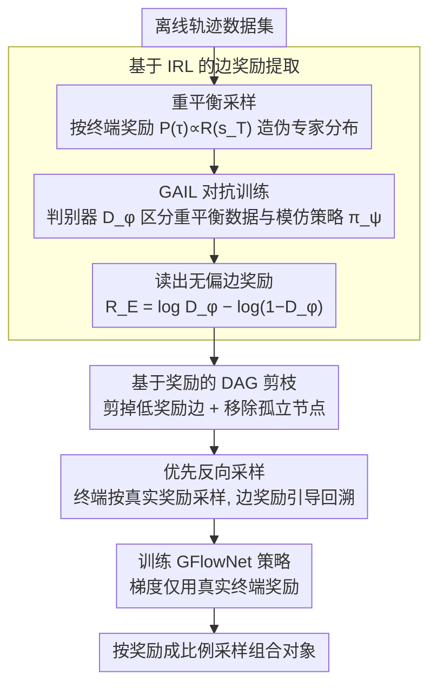

# Beyond the Proxy: Trajectory-Distilled Guidance for Offline GFlowNet Training

**会议**: ICML2026  
**arXiv**: [2505.20110](https://arxiv.org/abs/2505.20110)  
**代码**: https://github.com/Chenruishuo/TD-GFN  
**领域**: reinforcement_learning  
**关键词**: GFlowNet, 离线训练, 逆强化学习, DAG剪枝, 无代理奖励  

## 一句话总结
提出 TD-GFN，一种无需代理奖励模型的离线 GFlowNet 训练框架，通过逆强化学习从离线轨迹中提取边级奖励，再经 DAG 剪枝与优先反向采样间接指导策略学习，同时保证梯度更新仅依赖真实终端奖励，在分子设计和序列生成等任务上显著超越现有基线。

## 研究背景与动机

**领域现状**：生成流网络（GFlowNet）是一类在 DAG 结构环境上采样组合对象的生成模型，目标是以与奖励成正比的概率采样终端节点。在分子发现、蛋白质序列设计、组合优化等领域已有广泛应用。然而许多实际场景中，主动查询奖励函数代价极高（如湿实验、人类评估），因此需要从预收集的离线数据集训练 GFlowNet。

**现有痛点**：标准范式是在离线数据集上训练一个代理奖励模型（proxy），然后让 GFlowNet 查询该代理获取奖励信号。但构建可靠的代理模型需要大量多样数据和领域专知；更严重的是，当 GFlowNet 生成分布外（OOD）样本并查询代理时，代理的估计误差会通过梯度传播，损害策略质量。现有的无代理方法如 RO-GFlowNet 和 COFlowNet 虽然尝试直接从离线轨迹学习，但只施加粗粒度约束来对齐策略与数据分布，限制了泛化能力和探索效率。

**核心矛盾**：离线 GFlowNet 训练面临一个根本困境——代理模型引入误差传播，而无代理方法的粗约束又限制探索。DAG 中不同边对学习有效策略的贡献是不均等的（如通往高奖励终端的关键边 vs 通往低奖励终端的边），但现有方法未能利用这种结构差异。

**本文目标**：设计一种无代理的离线 GFlowNet 训练框架，能够(1)从轨迹中提取细粒度的转移级指导信号，(2)在不依赖代理奖励做梯度更新的前提下有效引导策略探索高奖励区域。

**切入角度**：利用 GFlowNet 训练与熵正则化 RL 的理论等价性，将最大因果熵逆强化学习应用于重平衡的离线数据集，提取每条边的重要性分数（边奖励）。这些边奖励不预测终端奖励，而是量化转移对策略学习的结构性贡献。

**核心 idea**：用 IRL 从轨迹中蒸馏出边级奖励，通过 DAG 剪枝和优先反向采样间接指导策略，梯度更新仅依赖真实终端奖励，从而同时实现高效探索和误差隔离。

## 方法详解

### 整体框架
TD-GFN 的训练分为两个阶段：(1) **边奖励提取阶段**——对离线数据集进行重平衡采样后，用对抗式 IRL（基于 GAIL）学习一个边级奖励函数 $R_E(s, s')$，量化 DAG 中每条边对策略学习的贡献；(2) **策略训练阶段**——利用边奖励执行 DAG 剪枝去除低效转移，然后通过优先反向采样构造训练轨迹，最终用这些轨迹和数据集中的真实终端奖励训练 GFlowNet 策略。整个过程中梯度更新仅依赖真实奖励，边奖励仅用于采样引导。

### 关键设计

**1. 基于 IRL 的边奖励提取：从轨迹里蒸馏出转移级的结构性偏好**

代理奖励模型的麻烦在于它预测终端奖励，一旦在 OOD 样本上估错，误差就随梯度传播污染策略。TD-GFN 换个思路：不去预测终端奖励，而是学一个量化"每条 DAG 边对策略学习有多重要"的边奖励 $R_E(s, s')$。做法是先对数据集按终端奖励成比例重平衡采样轨迹 $P(\tau) \propto R(s_T)$ 构造近似专家分布，再用 GAIL 做对抗训练——判别器 $D_\phi$ 区分重平衡数据与模仿策略 $\pi_\psi$ 生成的转移，最后从判别器读出无偏边奖励 $R_E(s, s') = \log D_\phi(s, s') - \log(1 - D_\phi(s, s'))$。理论上在总体极限下 $R_E$ 恢复的是对数条件入流分数（即规范反向策略 $\mathcal{P}_B^*$ 的对数），学习误差 $\|R_E - r^*\|_\infty \le \varepsilon$ 能保证反向策略的 TV 距离不超过 $\frac{1}{2}(e^{2\varepsilon} - 1)$。正因为边奖励捕捉的是转移的结构性偏好而非终端奖励本身，即使有近似误差也不会经梯度伤害策略，实验也显示它对未观察转移泛化良好。

**2. 基于奖励的 DAG 剪枝：把边奖励间接地用在动作空间而非梯度上**

直接拿边奖励给梯度做 reward shaping，会放大 IRL 的函数逼近误差；TD-GFN 选择一种更鲁棒的间接用法——剪枝。用模仿策略 $\pi_\psi$ 采一批状态-动作对统计边奖励分布，若某条边的奖励低于阈值 $R_E(s, s') < \text{mean}(\mathcal{D}_{R_E}) - K \cdot \text{std}(\mathcal{D}_{R_E})$（$K$ 为超参）就把它从 DAG 中剪掉，再移除与根节点断连的孤立节点。这样策略的注意力被集中到高价值区域，同时彻底绕开误差传播。理论上还有保证：高瓶颈分数 $\beta(x) > \tau + \varepsilon$ 的终端节点在剪枝后仍可达，存活终端上的奖励比例关系完全保持不变——剪掉的只是"没用的边"，GFlowNet 的采样目标不被破坏。

**3. 优先反向采样：在剪枝后的 DAG 上造出聚焦高价值区域的训练轨迹**

剪枝缩小了动作空间，还需把训练轨迹也导向高价值区域。TD-GFN 从数据集终端节点按奖励成比例采样起点 $x$，再用边奖励定义的反向策略 $\mathcal{P}_B(s_t | s_{t+1}) = \exp\{R_E(s_t, s_{t+1})\} / \sum_{(s, s_{t+1}) \in E'} \exp\{R_E(s, s_{t+1})\}$ 递归回溯到根节点，生成完整轨迹。终端采样偏向高奖励、路径采样偏向重要转移，于是轨迹天然聚焦在高价值区域，强化了 GFlowNet"按奖励成比例分配采样资源"的核心归纳偏置。最关键的是，策略的梯度更新只用数据集里记录的真实终端奖励，IRL 阶段的潜在误差始终被隔离在采样引导这一侧、进不到梯度里。

### 训练策略
策略训练可采用任意 GFlowNet 目标函数（FM、TB、SubTB、DB），实验表明 TD-GFN 的剪枝与采样模块与具体目标正交，均能带来一致提升。主实验采用 Flow Matching (FM) 目标以与 COFlowNet 公平对比。

## 实验关键数据

### 主实验

| 任务 | 方法 | 核心指标 | 收敛速度 |
|------|------|----------|----------|
| Hypergrid $8^4$ | TD-GFN | L1 Error 最低, 16/16 模式 | <5,000 次状态访问（基线 6 倍加速） |
| Hypergrid $8^4$ | COFlowNet | L1 Error 次优 | >10,000 次状态访问 |
| 生物序列 (AMP) | TD-GFN | Top-100 奖励与多样性均最高 | — |
| 生物序列 (AMP) | Proxy-GFN | 奖励低于 TD-GFN | — |

| 方法 | Reward-10 ↑ | Reward-100 ↑ | Reward-1000 ↑ | 收敛轨迹数 ↓ |
|------|-------------|--------------|---------------|-------------|
| Oracle-GFN (参考) | 7.718 | 7.408 | 6.801 | 44.1×10⁴ |
| Proxy-GFN | 7.625 | 7.281 | 6.636 | 43.7×10⁴ |
| QM-COFlowNet | 7.611 | 7.296 | 6.638 | 4.4×10⁴ |
| FM-COFlowNet | 7.582 | 7.201 | 6.485 | 5.8×10⁴ |
| Dataset-GFN | 7.550 | 7.198 | 6.474 | 6.0×10⁴ |
| **TD-GFN** | **7.733** | **7.450** | **6.810** | **2.7×10⁴** |

### 消融与鲁棒性

| 实验设置 | TD-GFN 表现 | 说明 |
|----------|------------|------|
| Mixed 数据集（加入随机轨迹） | 保持最优 L1 Error | 噪声数据下依然鲁棒 |
| 1/10 数据集（仅 150 条轨迹） | 仍优于基线 | 数据稀缺场景下有效 |
| Median 行为策略（半训练） | 更快收敛 | 对次优采集策略鲁棒 |
| Bad 行为策略（反转奖励） | 显著优于基线 | 极端退化策略下表现突出 |
| 分子多样性（Tanimoto 模式数） | 1.5-2× 于最强基线 | 剪枝未导致过拟合，反而增强探索 |
| 不同 GFN 目标（TB/SubTB/DB） | 一致提升 | 与具体目标正交 |

## 亮点与洞察
- 边奖励与代理奖励的本质区别：边奖励捕捉转移的结构性偏好而非预测终端奖励，因此可以间接使用而不引入梯度误差传播
- 在分子设计任务上，TD-GFN 匹配了使用真实 Oracle 的在线 GFN 的性能，同时仅用 1/20 的轨迹数
- 尽管进行了 DAG 剪枝，TD-GFN 发现的高奖励模式数反而是基线的 1.5-2 倍，说明"减少动作空间"与"增强探索"并不矛盾
- 重平衡策略本身就很有效：即使是简单的重平衡 GAIL 模仿学习也优于直接在数据集上训练的 Dataset-GFN

## 局限性 / 可改进方向
- IRL 阶段需要额外训练判别器和模仿策略，增加了计算开销
- 剪枝阈值 $K$ 是超参数，需要针对不同任务调节
- 理论保证依赖边奖励的逼近误差 $\varepsilon$，实际中该误差难以直接度量
- 仅在离散 DAG 环境上验证，连续状态空间或非 DAG 结构的扩展有待探索

## 相关工作与启发
- **COFlowNet / RO-GFlowNet**：现有无代理离线 GFlowNet 方法，施加粗粒度约束，TD-GFN 通过细粒度边级指导显著超越
- **GAIL / MaxEntIRL**：TD-GFN 的边奖励提取直接建立在最大因果熵 IRL 框架之上
- **GFlowNet-RL 等价性 (Tiapkin et al., 2024)**：将 GFlowNet 训练转化为熵正则化 RL 是本文方法论的理论基础
- 启发：在其他需要离线数据训练的生成模型中，"从轨迹中蒸馏结构性指导信号 + 间接使用以隔离误差"的范式可能具有广泛适用性

## 评分
- 新颖性: 9/10 — 将 IRL 引入离线 GFlowNet 训练是全新范式，边奖励的间接使用设计精巧
- 实验充分度: 9/10 — 三个基准、多种数据质量设置、多种 GFN 目标、理论保证，非常全面
- 写作质量: 8/10 — 论文结构清晰，动机明确，理论与实验衔接紧密
- 价值: 8/10 — 为离线 GFlowNet 建立了新的 SOTA 范式，对分子设计等实际应用有重要意义

<!-- RELATED:START -->

## 相关论文

- [\[ICML 2026\] Offline Reinforcement Learning with Generative Trajectory Policies](offline_reinforcement_learning_with_generative_trajectory_policies.md)
- [\[ICML 2026\] Trajectory-Level Data Augmentation for Offline Reinforcement Learning](trajectory-level_data_augmentation_for_offline_reinforcement_learning.md)
- [\[ICML 2026\] Beyond Scalar Rewards: Dense Feedback for LLM Policy Synthesis in Sequential Social Dilemmas](beyond_scalar_rewards_dense_feedback_for_llm_policy_synthesis_in_sequential_soci.md)
- [\[AAAI 2026\] Know your Trajectory -- Trustworthy Reinforcement Learning Deployment through Importance-Based Trajectory Analysis](../../AAAI2026/reinforcement_learning/know_your_trajectory_--_trustworthy_reinforcement_learning_deployment_through_im.md)
- [\[ICML 2025\] Online Pre-Training for Offline-to-Online Reinforcement Learning](../../ICML2025/reinforcement_learning/online_pre-training_for_offline-to-online_reinforcement_learning.md)

<!-- RELATED:END -->
