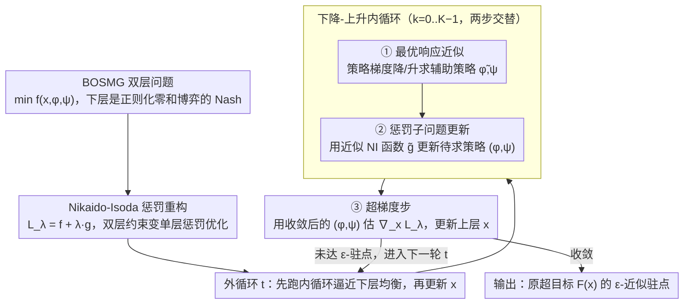

# Bilevel Optimization over Saddle Points of Zero-Sum Markov Games

**会议**: ICML2026  
**arXiv**: [2605.26654](https://arxiv.org/abs/2605.26654)  
**代码**: 无  
**领域**: 强化学习  
**关键词**: 双层优化, 零和马尔可夫博弈, 策略梯度, Nikaido-Isoda函数, 鞍点均衡

## 一句话总结
提出 PANDA 算法，通过基于 Nikaido-Isoda 函数的惩罚重构，用纯一阶策略梯度方法求解下层为正则化零和马尔可夫博弈的双层 RL 问题，达到 $\tilde{O}(\epsilon^{-1})$ 迭代复杂度和 $\tilde{O}(\epsilon^{-3})$ 样本复杂度，匹配单策略下层 BRL 的最优已知速率。

## 研究背景与动机

**领域现状**：双层强化学习 (BRL) 是建模层次化决策的有力范式——上层 (UL) 学习器优化高级变量（如激励参数、奖励设计），下层 (LL) 则在该变量影响下求解一个 RL 问题。近年来已有 PARL、HPGD、SoBiRL、First-Order BRL 等一系列算法被提出，并具有理论收敛保证。

**现有痛点**：现有 BRL 方法几乎全部假设下层是**单策略** MDP（只有一个 agent 做 max 或 min），无法处理多智能体对抗结构。然而在激励设计 (incentive design)、RLHF 偏好学习等场景中，下层天然涉及两个对抗策略的耦合博弈。直接将单策略 BRL 方法迁移到 min-max 博弈设置会失败——例如 HPGD/SoBiRL 的超梯度推导依赖单策略 MDP 的闭式最优策略特性，在耦合双策略优化下不再成立。

**核心矛盾**：零和马尔可夫博弈中两个对抗策略的战略耦合使得算法设计本质上更困难。现有处理该设置的方法要么是启发式无收敛保证 (Meta-Gradient)，要么依赖计算代价高昂的二阶信息如 Hessian 逆 (DA)，要么仅能收敛到惩罚代理问题的驻点而非原问题驻点 (PBRL)。

**本文目标**：设计一个随机一阶方法来求解下层为正则化 min-max 零和马尔可夫博弈 (MMZSMG) 的双层优化问题 (BOSMG)，同时获得可证明的高效迭代和样本复杂度。

**切入角度**：利用 Nikaido-Isoda (NI) 函数刻画下层策略对距均衡的偏离程度——NI 函数非负且仅在策略对为 Nash 均衡时为零。将 NI 函数作为惩罚项加入上层目标，就可以将双层约束问题转化为无约束惩罚优化，从而避免超梯度计算。进一步利用正则化 MMZSMG 的内在结构（唯一均衡、NI 函数的非均匀 PŁ 性质），保证算法收敛到原问题的近似驻点。

**核心 idea**：用 NI 函数惩罚重构 + 下降-上升策略梯度，绕开超梯度和二阶信息，实现纯一阶求解 BOSMG。

## 方法详解

### 整体框架
PANDA 求解的问题形式为：$\min_{x,\phi,\psi} f(x,\phi,\psi)$ s.t. $(\phi,\psi) \in \arg\min_{\phi'}\max_{\psi'} J(x,\phi',\psi')$，其中 $x$ 是上层变量，$(\phi,\psi)$ 分别参数化 min-player 和 max-player 的策略，$J$ 是正则化价值函数。算法先用 NI 函数把这个双层约束重构成惩罚形式 $\min_{x,\phi,\psi} f(x,\phi,\psi) + \lambda \cdot g(x,\phi,\psi)$；随后进入外循环，每一轮先跑一段下降-上升内循环逼近下层均衡，再用收敛后的策略做一步超梯度更新上层 $x$，整套流程只用一阶策略梯度信息。

（图中只画出贡献到算法流程的两个设计——惩罚重构与下降-上升三步迭代；设计 3 的非均匀 PŁ 性质是支撑收敛证明的理论工具，不在数据流上。）

### 关键设计

**1. Nikaido-Isoda 惩罚重构：用一个非负 gap 把双层约束变成可一阶求解的单层惩罚优化**

传统双层 RL 求超梯度要走链式法则、涉及 Hessian 逆，计算代价高，而单策略 BRL 的超梯度推导又依赖单 MDP 的闭式最优策略，在双策略耦合的 min-max 博弈下根本不成立。作者改用 NI 函数 $g(x,\phi,\psi) = \max_{\psi'} J(x,\phi,\psi') - \min_{\phi'} J(x,\phi',\psi)$ 来精确度量当前策略对偏离 Nash 均衡的程度——它非负，且仅在均衡时为零，天然贴合 min-max 博弈的鞍点结构，比单纯的值函数 gap 更精确。把它当惩罚项加进上层目标得 $L_\lambda(x,\phi,\psi) = f(x,\phi,\psi) + \lambda \cdot g(x,\phi,\psi)$，于是双层约束被吸收进一个无约束的惩罚问题；理论上当 $\lambda$ 足够大时，$L_\lambda^*(x)$ 的驻点与原超目标 $F(x)$ 驻点之间的梯度偏差只有 $O(\lambda^{-1})$，从而彻底绕开超梯度和二阶信息。

**2. 下降-上升三步迭代（最优响应 + 惩罚子问题 + 超梯度更新）：在嵌套结构里只用一阶信息完成下层逼近 + 上层更新**

NI 函数里藏着两个最优响应问题（一个 max、一个 min），无法闭式求解，只能在线逼近。算法因此把每个外循环迭代拆成「一段内循环 + 一次超梯度步」。内循环跑 $K$ 步，每一步同时做两件事交替推进：① **最优响应近似**——对辅助变量 $\tilde{\phi},\tilde{\psi}$ 各做一步策略梯度下降/上升，逼近 NI 函数里的两个最优响应；② **惩罚子问题更新**——用当前 $\tilde{\phi},\tilde{\psi}$ 拼出近似 NI 函数 $\tilde{g}(x,\phi,\psi,\tilde{\phi},\tilde{\psi}) = J(x,\phi,\tilde{\psi}) - J(x,\tilde{\phi},\psi)$ 作为 $g$ 的代理，据此用随机梯度更新真正待求的策略 $(\phi,\psi)$。$K$ 步过后 $(\phi,\psi)$ 已足够接近惩罚子问题的最优解 $(\phi^*_\lambda,\psi^*_\lambda)$；③ **超梯度步**——内循环结束后，用收敛的 $(\phi,\psi)$ 估计超梯度 $\nabla_x \tilde{L}_\lambda$，随机梯度下降更新上层 $x$，再进入下一轮外循环。全程只用一阶策略梯度（Monte Carlo roll-out 估梯度），从不计算 Hessian 或其逆。关键在内循环只需 $K=O(\log\lambda)$ 步就能保证 $(\phi,\psi)$ 足够接近惩罚子问题最优解、让超梯度估计有效——对数级内循环意味着整体计算负担增长缓慢。

**3. NI 函数的非均匀 PŁ 性质：给收敛分析提供不依赖强凸假设的梯度支配条件**

要证 PANDA 不靠强凸假设也收敛，需要一个刻画 NI 函数优化景观的结构性工具。作者证明对任意 $x$ 和 $(\phi,\psi)$，NI 函数满足 $\frac{1}{2}\|\nabla_{(\phi,\psi)}g\|^2 \geq \mu(\phi,\psi)\cdot g(x,\phi,\psi)$，其中 $\mu(\phi,\psi)$ 依赖策略的最小概率和正则化系数。这把 Mei et al. (2020) 对单 agent 软值函数的非均匀 PŁ 结果推广到了双 agent 零和博弈，说明 softmax 参数化下正则化零和博弈的 NI 函数有良好的梯度支配性质，是整个收敛证明能成立的核心，也对其它基于 NI 函数的博弈论算法分析有独立价值。

## 实验关键数据

### 主实验

| 环境 | 方法 | UL 目标 | NE Gap | 说明 |
|------|------|---------|--------|------|
| Synthetic (激励设计) | **PANDA** | **最高** (≈2.55) | **≈0** | 接近 Oracle 上界 |
| Synthetic | META | ≈2.2 | ≈0 | 启发式，UL 优化不充分 |
| Synthetic | DA | ≈2.3 | ≈0 | 需二阶信息 |
| Synthetic | PBRL | ≈2.35 | ≈0 | UL 次优 |
| Sentinel-Intruder 5×5 | **PANDA** | **最低 UL loss** | — | 有效避免禁区 |
| Sentinel-Intruder 20×20 | **PANDA** | **最低 UL loss** | — | 大规模仍优 |

### 消融实验（惩罚参数 $\lambda$ 影响）

| $\lambda$ | UL 奖励 | NE Gap | 说明 |
|-----------|---------|--------|------|
| 1 | 较高 | **较大** | 下层均衡约束不够强 |
| 4 | 高 | ≈0 | 均衡与 UL 目标较好平衡 |
| 10 | 略低 | ≈0 | 强惩罚略牺牲 UL 目标 |

### 复杂度对比

| 算法 | LL 问题 | 随机/确定 | 迭代复杂度 | 样本复杂度 | Oracle |
|------|---------|-----------|------------|------------|--------|
| **PANDA** | **Min-Max** | **随机** | $\tilde{O}(\epsilon^{-1})$ | $\tilde{O}(\epsilon^{-3})$ | 一阶 |
| First-Order BRL | Max | 随机 | $\tilde{O}(\epsilon^{-1})$ | $\tilde{O}(\epsilon^{-3})$ | 一阶 |
| SoBiRL | Max | 随机 | $\tilde{O}(\epsilon^{-1.5})$ | $\tilde{O}(\epsilon^{-3.5})$ | 一阶 |
| DA | Min-Max | 确定 | $\tilde{O}(\epsilon^{-1})$ | — | 一阶+二阶 |
| META | Min-Max | 随机 | N/A | N/A | 一阶 |

### 关键发现
- PANDA 是**首个**在随机设置下为 BOSMG 提供收敛保证的一阶方法，且迭代和样本复杂度均匹配单策略 BRL 的最优速率
- $\lambda$ 控制着下层均衡精度和上层目标优化之间的 trade-off：$\lambda$ 太小导致均衡约束松弛，$\lambda$ 太大则过度惩罚
- 在 20×20 大网格环境中 PANDA 仍能有效运行并超越基线，说明算法在较大规模下的可扩展性

## 亮点与洞察
- **NI 函数 + 惩罚方法的组合**是处理 min-max 双层问题的优雅思路。NI 函数天然衡量鞍点偏离，惩罚重构将其融入目标函数，避免了超梯度计算。这个框架可以迁移到其他下层含对抗结构的层次优化场景
- **非均匀 PŁ 性质推广到零和博弈**是一个有独立价值的理论贡献。它说明 softmax 参数化下正则化零和博弈的 NI 函数具有良好的优化景观，可用于分析其他基于 NI 函数的博弈论算法
- **内循环步数仅需 $O(\log\lambda)$** 是一个实用的设计——对数级内循环意味着整体计算负担增长缓慢

## 局限与展望
- 目前仅处理**正则化**零和马尔可夫博弈（依赖正则化器的强凸-强凹性保证均衡唯一性），推广到无正则化或一般和博弈仍是开放问题
- 采用 **tabular softmax 参数化**，尚未验证在函数逼近（如神经网络策略）下的表现
- 实验环境规模有限（最大 20×20 网格），在真实大规模多智能体场景中的可扩展性有待验证
- 样本复杂度中隐含的对数因子和常数可能较大，实际效率与理论速率之间可能存在差距

## 相关工作与启发
- **双层 RL**：PARL (Chakraborty+, ICLR'24)、HPGD (Thoma+, '24)、SoBiRL (Yang+, '25) 处理单策略下层；First-Order BRL (Gaur+, NeurIPS'25)、SLAC (Zeng+, '25) 是惩罚方法代表
- **零和马尔可夫博弈**：Cen+ (JMLR'24) 给出正则化零和博弈下的线性收敛 Nash 均衡算法；Munos+ ('24) 将零和博弈框架用于 RLHF
- **双层优化理论**：Kwon+ ('24)、Chen+ ('25) 建立了惩罚方法在非凸下层双层优化中的收敛理论
- 启发：NI 函数惩罚的思路可用于 RLHF 中的偏好对齐——当偏好模型涉及对抗训练时，类似框架可能有效

<!-- RELATED:START -->

## 相关论文

- [\[ICML 2025\] Solving Zero-Sum Convex Markov Games](../../ICML2025/reinforcement_learning/solving_zero-sum_convex_markov_games.md)
- [\[ICML 2026\] Global Policy-Space Response Oracles for Two-Player Zero-Sum Games](global_policy-space_response_oracles_for_two-player_zero-sum_games.md)
- [\[AAAI 2026\] Perturbing Best Responses in Zero-Sum Games](../../AAAI2026/reinforcement_learning/perturbing_best_responses_in_zero-sum_games.md)
- [\[ICML 2026\] FAB: A First-Order AB-based Gradient Algorithm for Distributed Bilevel Optimization over Time-Varying Directed Graphs](fab_a_first-order_ab-based_gradient_algorithm_for_distributed_bilevel_optimizati.md)
- [\[ICLR 2026\] SPIRAL: Self-Play on Zero-Sum Games Incentivizes Reasoning via Multi-Agent Multi-Turn Reinforcement Learning](../../ICLR2026/reinforcement_learning/spiral_self-play_on_zero-sum_games_incentivizes_reasoning_via_multi-agent_multi-.md)

<!-- RELATED:END -->
