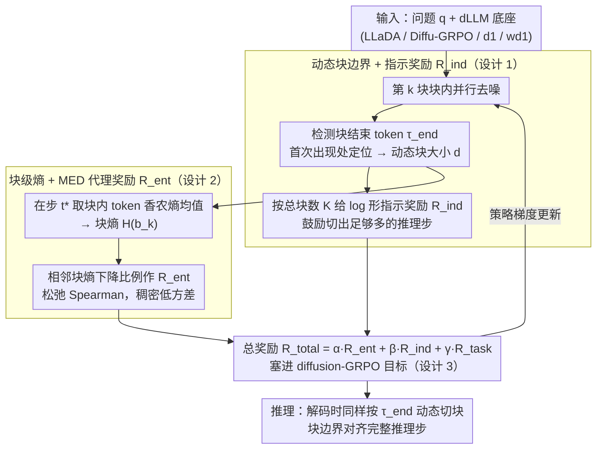

# Break the Block: Dynamic-size Reasoning Blocks for Diffusion Large Language Models via Monotonic Entropy Descent with Reinforcement Learning

**会议**: ICML 2026  
**arXiv**: [2605.02263](https://arxiv.org/abs/2605.02263)  
**代码**: https://github.com/YanJiangJerry/Block-R1 (有)  
**领域**: LLM推理 / 扩散语言模型 / 强化学习  
**关键词**: dLLM, GRPO, 动态块大小, 熵单调下降, 推理一致性

## 一句话总结
针对扩散语言模型 (dLLM) 半自回归生成时"块大小固定"破坏推理逻辑链的问题，本文提出 b1：用 RL 学一个块结束指示 token 来生成动态长度块，并用一个"块级熵单调下降 (Monotonic Entropy Descent, MED) 奖励"驱动连贯推理，作为即插即用的奖励项接入现有 dLLM RL 框架（Diffu-GRPO/GDPO/d1/wd1），在 Countdown 上将 wd1 从 39.45 推到 58.98。

## 研究背景与动机

**领域现状**：LLaDA、d1、wd1 等扩散语言模型 (dLLM) 采用"半自回归 + 块内并行去噪"的生成范式：把待生成序列切成多个固定大小 $c$ 的块，块间从左到右依次生成、块内 $T$ 步并行 denoise。基于这套范式，最近的 RL 后训练（Diffu-GRPO、GDPO、wd1）开始模仿 GRPO 把 dLLM 推向数学推理。

**现有痛点**：固定块大小带来两个观察得到的问题：(i) 不同数据集的最优块大小差异很大（Sudoku/Countdown/GSM8K/MATH500 各异），"一刀切"显然次优；(ii) 即使是同一道题，刚性边界经常把一个完整运算切开——文中给出的例子是把 "$71-66$" 拆到 Block 3 和 Block 4 之间，导致这一块出现明显的高熵 (uncertainty) 异常 token 并算错。

**核心矛盾**：dLLM 的并行块假设 (块内 token 条件独立) 和"推理是有逻辑链的连续语义步骤"之间存在冲突——固定的边界几乎一定会切到推理步的中间。

**本文目标**：让 dLLM 自己学会在"语义完整的推理步"处划块，同时让整体推理过程的不确定性逐步降低。

**切入角度**：作者经验性地发现一条规律——在 LLaDA/d1/wd1 上，正确推理 trace 的"块级平均熵"沿生成方向呈单调下降，错误推理则呈震荡或上升。这暗示"块熵单调下降"是推理正确性的代理指标。

**核心 idea**：把"在哪里换块"变成可学的——引入一个 end-of-step 指示 token，由 RL 用一个"相邻块熵下降"的稠密奖励教模型在合适位置开新块，从而让块边界对齐推理步、并让整段推理的熵保持单调下降。

## 方法详解

### 整体框架
b1 是一个加在现有 dLLM GRPO 框架之上的奖励/解码插件，由三件事拼成：(1) 动态块构造——在推理生成里插入特殊 token $\tau_{\text{end}}$，每次出现就关闭当前块、开新块；(2) MED 训练目标——用一个"相邻块熵下降"的代理奖励 $R_{\text{ent}}$ 加上一个"鼓励多步推理"的指示奖励 $R_{\text{ind}}$，与任务奖励 $R_{\text{task}}$ 加权汇总后塞进 Diffu-GRPO；(3) 推理对齐——解码时严格按训练流程，遇到 $\tau_{\text{end}}$ 就动态调整下一块起点。

### 关键设计

**1. 动态块边界 + 指示 token 奖励 $R_{\text{ind}}$：让模型自己决定每块多长，使一块恰好覆盖一个完整推理步**

固定块大小最大的毛病是刚性边界几乎一定会切到推理步中间（论文里把 "$71-66$" 拆到 Block 3 和 4 之间，那一块就冒出高熵异常 token 并算错）。b1 的做法是把"在哪里换块"提升成可学决策：在词表里加一个块结束 token $\tau_{\text{end}}$（默认实现为字符串 `\block`），在第 $k$ 块的去噪过程中一旦 $\hat{\mathbf{x}}_{t}[S_{k-1}+j]=\tau_{\text{end}}$ 出现，就把 $j$ 当作当前块的动态大小 $d$，下一块从 $\tau_{\text{end}}$ 之后接续。为防止模型偷懒只生成 1–2 个大块，块数被做成 log 形式的稠密奖励：当总块数 $K\geq K_{\text{target}}$ 时 $R_{\text{ind}}=1$，否则 $R_{\text{ind}}=\log(K+1)/\log(K_{\text{target}}+1)$（默认 $K_{\text{target}}=10$）。log 形式让奖励平滑、避免坍塌到极少数大块，又把切块位置从人工超参变成 RL 决策变量。

**2. 块级熵 + MED 代理奖励 $R_{\text{ent}}$：直接驱动相邻块的平均熵单调下降，逼出更自信连贯的推理**

作者经验性地发现一条规律——正确推理 trace 的"块级平均熵"沿生成方向单调下降，错误推理则震荡或上升，于是把"块熵单调下降"当成推理正确性的代理来优化。具体地，在块结束的扩散时刻 $t^{*}$ 取每个 token 的 Shannon 熵、在块内取平均得到块熵 $\mathcal{H}(\mathbf{b}_{k}^{d})$。理想目标是最大化块熵序列的负 Spearman 秩相关 $r_{\text{SCC}}$，但 Spearman 是全局排名、奖励方差大、训练不稳；作者把它松弛成相邻对的下降比例 $R_{\text{ent}}=\frac{1}{K-1}\sum_{k=2}^{K}\mathbb{I}(\mathcal{H}(\mathbf{b}_{k-1}^{d})>\mathcal{H}(\mathbf{b}_{k}^{d}))$，并在附录证明：最大化这个松弛项与最大化 Spearman 系数有相同的全局最优解（即严格单调下降）。这样就把一个稀疏的全局排名信号拆成 $K-1$ 个独立成对比较，提供稠密、低方差的梯度，同时不丢"严格单调下降"这个最优解。

**3. 即插即用的 GRPO 总奖励：让 b1 不绑定具体的 dLLM RL 算法**

b1 想做成"只贡献信号、不绑算法"的插件，好和现有最强方法叠加。它把三项奖励加权成总奖励 $R_{\text{total}}=\alpha R_{\text{ent}}+\beta R_{\text{ind}}+\gamma R_{\text{task}}$（默认 $\alpha=\beta=\gamma=1$，不调参直接用），再塞进底座算法原本的 diffusion-GRPO 目标里（policy ratio 仍用 $\exp(\phi^{\pi_{\theta}}-\phi^{\pi_{\text{old}}})$ 近似）。整套额外复杂度只有 $\mathcal{O}(K\cdot T\cdot L+L)$，相对 self-attention 的 $O(L^{2})$ 可忽略。因此 Diffu-GRPO、GDPO、d1、wd1 都能直接加上 b1，b1 只在"块级"贡献信号，与"更好的 GRPO 目标"是正交的提升维度。

### 损失函数 / 训练策略
训练数据集与 d1/wd1 完全一致：LLaDA-8B-Instruct 在 GSM8K/MATH/Sudoku/Countdown 上做 RL post-training，序列长度 256/512，4×AMD Mi300x，每卡 batch=12。所有权重 $\alpha,\beta,\gamma$ 直接固定为 1。

## 实验关键数据

### 主实验

| Algo / 数据集 | Sudoku-256 | Countdown-256 | GSM8K-256 | MATH500-256 |
|---|---|---|---|---|
| LLaDA-8B-Instruct (base) | 7.67 | 16.80 | 76.19 | 32.00 |
| + Diffu-GRPO | 13.53 | 19.92 | 76.35 | 33.60 |
| + Diffu-GRPO + b1 | **16.97** (+3.44) | **28.91** (+8.99) | **78.39** (+2.04) | **34.60** (+1.00) |
| + d1 | 15.06 | 25.39 | 77.03 | 33.40 |
| + d1 + b1 | 18.48 (+3.42) | 30.47 (+5.08) | 78.24 (+1.21) | 34.40 (+1.00) |
| + wd1 | 23.14 | 39.45 | 78.85 | 34.20 |
| + wd1 + b1 | **27.29** (+4.15) | **58.98** (+19.53) | **80.82** (+1.97) | **37.40** (+3.20) |

最大单点提升：wd1 + b1 在 Countdown-256 上 +19.53 个点。

### 消融实验

| 配置 (基于 wd1) | Countdown | GSM8K | MATH500 |
|---|---|---|---|
| Fixed-size (wd1) | 39.45 | 78.85 | 34.20 |
| b1 w/o MED ($R_{\text{ent}}$) | 44.14 | 79.23 | 35.00 |
| b1 w/o $R_{\text{ind}}$ | 55.86 | 80.06 | 36.60 |
| b1 (Full) | **58.98** | **80.82** | **37.40** |

### 关键发现
- 去掉 MED 奖励后 Countdown 从 58.98 暴跌到 44.14，证实"熵单调下降"是 b1 的核心信号；去掉指示奖励虽然温和但同样掉点，说明动态块本身也贡献明显。
- 把所有推理样本按 $r_{\text{SCC}}$ 分桶，准确率随 $r_{\text{SCC}}$ 单调上升；wd1+b1 把 Countdown 上 $r_{\text{MED}}$ (正 $r_{\text{SCC}}$ 比例) 从 91.41% 抬到 97.66%，对应 acc 从 39.45 抬到 58.98——首次给"熵单调下降 ↔ 推理正确"提供了量化对应关系。
- 训练 step 时间 wd1 从 1.31s/step 增到 1.68s/step、吞吐 28.57→27.03 tok/s，几乎可忽略，平均准确率 43.91→51.12，性价比极高。
- AdaBlock-dLLM (一种推理时按 newline 截断的免训练方法) 在 0-shot 复现下不涨点，证明"动态块"必须被学进来、不能仅靠规则切。

## 亮点与洞察
- 把"块大小"这个长期被当成超参的东西变成可学策略，并配上一个有理论解析的奖励 ($R_{\text{ent}}$ 与全局 Spearman 同最优)，是 dLLM 后训练里少见的"既改解码、又改奖励"的双重设计。
- "块熵单调下降"是一条新颖的可观测信号——它本质上是把 "AR 模型中 token 熵下降→更自信"那套直觉迁移到块粒度，并且不需要 ground truth 就能用，对所有任务都通用。
- 设计成纯 plug-and-play 奖励插件，复用底座 GRPO 框架的全部基础设施，几乎零代码侵入；这种"只贡献信号、不绑算法"的范式可以直接迁移到任何分段生成模型（如 block-diffusion image 模型）的连贯性优化。

## 局限与展望
- 当前评测集中在数学/逻辑题，没验证更复杂的开放式生成（代码、长文档摘要）是否同样满足"熵单调下降"假设。
- $K_{\text{target}}=10$ 默认值偏经验，长推理任务可能需要自适应目标块数。
- 块熵用的是 mean-field 假设（块内 token 独立），实际推理步内部 token 间是有强依赖的，未来可以引入结构化熵估计（如 conditional / joint entropy）进一步提升信号质量。

## 相关工作与启发
- **vs d1 / wd1**：底座 RL 框架相同，但 d1/wd1 仍用固定块；b1 在它们基础上叠加 MED+指示奖励，把 wd1 从 39.45 推到 58.98（Countdown），证明"动态块"是与"更好的 GRPO 目标"正交的提升维度。
- **vs AdaBlock-dLLM**：AdaBlock 是推理时按高置信换行符截断，免训练；b1 把切块能力学进权重并直接 RL 优化，0-shot 下显著优于 AdaBlock。
- **vs StableMoE / 动态计算路由**：b1 启发的"用 RL 学习生成边界"思路也可以反向迁移到 MoE 的 dynamic top-k 等"决策超参可学"问题。

## 评分
- 新颖性: ⭐⭐⭐⭐⭐ dLLM 上第一次把"块大小"做成 RL 可学变量，并给出"块熵单调下降"这条新颖且可证的优化信号。
- 实验充分度: ⭐⭐⭐⭐ 在 4 个数据集、4 套 RL 底座算法上系统验证，并给出消融、$r_{\text{SCC}}$ 相关性分析和效率对比，但缺开放式生成任务。
- 写作质量: ⭐⭐⭐⭐ 故事线清晰（观察 → 假设 → 方法 → 理论 → 验证），图 2/3 的 token 熵可视化极有说服力。
- 价值: ⭐⭐⭐⭐⭐ 即插即用、几乎零成本叠加在现有最强 dLLM RL 算法之上、在 Countdown 上 +19.5 个点，对 dLLM 推理研究有直接推动作用。

<!-- RELATED:START -->

## 相关论文

- [\[ICML 2026\] d2: Improving Reasoning in Diffusion Language Models via Trajectory Likelihood Estimation](d2_improving_reasoning_in_diffusion_language_models_via_trajectory_likelihood_es.md)
- [\[ICML 2026\] Learning Unmasking Policies for Diffusion Language Models](learning_unmasking_policies_for_diffusion_language_models.md)
- [\[ICML 2026\] The Shape of Reasoning: Topological Analysis of Reasoning Traces in Large Language Models](the_shape_of_reasoning_topological_analysis_of_reasoning_traces_in_large_languag.md)
- [\[ACL 2026\] d-TreeRPO: Towards More Reliable Policy Optimization for Diffusion Language Models](../../ACL2026/reinforcement_learning/d-treerpo_towards_more_reliable_policy_optimization_for_diffusion_language_model.md)
- [\[ICML 2026\] Coupled Variational Reinforcement Learning for Language Model General Reasoning](coupled_variational_reinforcement_learning_for_language_model_general_reasoning.md)

<!-- RELATED:END -->
