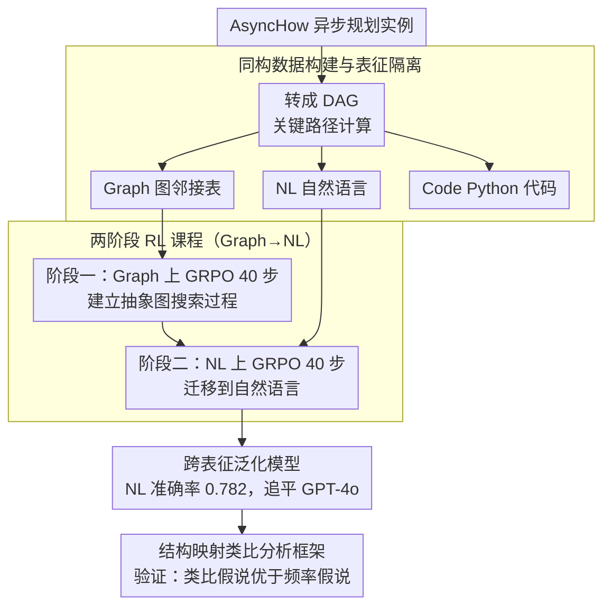

# Can Large Language Models Generalize Procedures Across Representations?

**会议**: ICML2026  
**arXiv**: [2602.03542](https://arxiv.org/abs/2602.03542)  
**代码**: 有 (论文附带数据集与代码)  
**领域**: LLM推理  
**关键词**: 跨表征泛化, 强化学习课程, 生成类比, 过程知识迁移, GRPO  

## 一句话总结

本文发现 LLM 在符号表征（代码/图）上学到的过程知识无法可靠迁移到自然语言任务，提出"先符号后自然语言"的两阶段 RL 课程学习策略，使 1.5B Qwen 模型在异步规划任务上接近 zero-shot GPT-4o，并从认知科学角度证明成功的跨表征泛化可被解释为生成类比。

## 研究背景与动机

**领域现状**：LLM 在预训练和后训练阶段大量使用代码、图等符号数据，业界普遍期望符号训练能提升模型的自然语言推理能力。近期不少工作（如 code-augmented pre-training、graph reasoning）尝试通过符号数据增强 LLM，但效果参差不齐。

**现有痛点**：现有研究将表面表征因素和深层结构因素混在一起，无法回答一个关键问题——符号训练究竟在什么条件下能帮助自然语言任务？实验发现，单独在代码或图上训练的模型在对应格式上表现很好，但迁移到自然语言时性能大幅下降甚至不如未训练的基线。

**核心矛盾**：符号表征和自然语言表征共享相同的底层算法和过程结构（同构），但 LLM 似乎只学到了表面模式而非可迁移的过程知识。现有的 SFT 和 RL 方法（vanilla SFT、蒸馏、STaR、GRPO）在跨表征设置下均无法实现可靠泛化。

**本文目标**：(1) 用严格同构的实验设计隔离过程泛化与虚假迁移；(2) 提出一种训练策略使模型能跨表征泛化；(3) 从认知科学角度分析泛化的机制。

**切入角度**：作者借鉴认知科学中的结构映射理论（Structure-Mapping Theory），将跨表征泛化视为生成类比问题。如果模型能像人类那样识别不同表征间的共享结构，就应该能在新表征上 zero-shot 成功。

**核心 idea**：用两阶段 RL 课程——先在符号表征（Graph）上训练学会抽象过程，再在自然语言上继续训练完成适配——来显著提升跨表征泛化能力。

## 方法详解

### 整体框架

作者围绕**异步规划**任务构建同构数据：给定一组有依赖关系的步骤（如做菜流程），模型需计算在无限资源下完成所有步骤的最短时间。该任务可形式化为 DAG 上的关键路径计算。每个规划实例被表示为三种同构格式：自然语言（NL）、图邻接表（Graph）和 Python 代码片段（Code），底层算法完全相同，仅表面形式不同。

训练流程分两阶段：**阶段一（符号归纳）** 在 Graph 数据上用 GRPO 训练 40 步，让模型快速学会抽象的图搜索过程；**阶段二（自然语言适配）** 在 NL 数据上继续 GRPO 训练 40 步，将学到的过程知识迁移到自然语言。总训练预算与纯 NL 训练 80 步完全相同。训练得到模型后，作者再用结构映射理论的类比分析框架对结果做事后解释，验证泛化究竟来自结构类比还是数据频率。

### 关键设计

**1. 同构数据构建与表征隔离：让不同表征间唯一的变量只剩表面形式**

现有研究把"表面表征差异"和"深层结构差异"混在一起，无法判断迁移失败到底是"过程不可学"还是"表面形式干扰"，这是个因果推断问题。作者把 AsyncHow 数据集里每个自然语言规划实例转成 DAG，再分别表示成三种同构格式：邻接表字典（Graph，含 START/END 哨兵节点和时间权重字典）、Python 最长路径搜索代码（Code，随机重编节点索引、时间统一为分钟）、以及原始自然语言（NL）。三者共享完全相同的图结构和答案，底层算法一模一样，只有表面形式不同。这套严格控制让"过程泛化"和"虚假迁移"能被干净地区分开——后面观察到的所有迁移失败/成功都只能归因于表征形式，而非任务难度。

**2. 两阶段 RL 课程学习（Graph → NL）：用符号预热改变自然语言阶段的学习动态**

单独在符号上训练无法迁移到 NL，单独训 NL 又效率低。作者发现 Graph 格式信息密度高、within-representation 训练快，于是设计两阶段课程：阶段一在 Graph 上用 GRPO（$k=16$ 采样，正确且格式合规 reward 为 1）训练 40 步，快速建立抽象的图搜索过程归纳偏置；阶段二在 NL 上继续 GRPO 训练 40 步，把这套过程适配到自然语言。总预算和纯 NL 训 80 步完全相同，但 NL 准确率从 0.698 提到 0.782。关键证据是顺序不可逆——反向课程 NL→Graph 只有 0.431，远差于纯 NL，而阶段二的 reward 曲线更像符号训练而非纯 NL 训练，说明符号预热确实重塑了 NL 阶段的优化动态，相当于"先学结构密度高的表征、再迁移"的先易后难原则。

**3. 基于结构映射理论的类比分析框架：把"为什么课程有效"从经验层面拉到可量化的认知机制**

光说"课程有效"不够，作者想区分模型是靠"大量中等相似实例堆砌"（频率学习）还是靠"少量高度相似实例的结构映射"（类比推理）。借认知科学的结构映射理论，定义类比强度 $AS(G_b, G_t)=\alpha\cdot sim_u(V_b, V_t)+(1-\alpha)\cdot sim_b(E_b, E_t)$（$\alpha=0.4$），一元相似度用直方图-Jaccard 度量节点时间分布、二元相似度用 3 次迭代的 Weisfeiler-Lehman 子树核。再用 Pearson $\rho$ 分别衡量"频率假说"（训练集相关实例数量）和"类比假说"（最相似训练实例的结构相似度）与测试准确率的相关性。结果在所有成功泛化的设置里类比相关系数都高于频率相关系数（如课程后 NL 测试 0.265 vs 0.245），证明课程学习鼓励的是结构映射式的类比，而非数据堆砌——这给"成功的跨表征泛化 = 生成类比"提供了定量支撑。

## 实验关键数据

### 主实验：跨表征泛化（Qwen2.5-1.5B-Instruct, GRPO）

| 训练表征 | 测试 NL | 测试 Graph | 测试 Code | 说明 |
|----------|---------|-----------|-----------|------|
| NL only (80 steps) | 0.698 | - | - | 纯 NL 基线 |
| Graph only | 高 | 高 | - | 无法迁移到 NL |
| Code only | - | - | 高 | 无法迁移到 NL |
| **Graph→NL 课程 (40+40)** | **0.782** | - | - | 同预算超越 NL-only |
| NL→Graph (反向) | 0.431 | - | - | 顺序很重要 |
| Graph+NL 交叉训练 | 0.382 | - | - | 不如课程学习 |

### 课程学习与基线对比（NL 测试准确率）

| 模型/方法 | NL 准确率 | NL-AAVE 准确率 | 说明 |
|-----------|----------|----------------|------|
| Qwen-1.5B + Graph→NL 课程 | **0.782** | **0.573** | 本文方法 |
| Qwen-3B + NL only (40 steps) | 0.471 | 0.400 | 2× 参数量 |
| Qwen-7B + NL only (40 steps) | 0.698 | 0.573 | 4.7× 参数量 |
| GPT-4o-mini (zero-shot) | 0.440 | 0.289 | 商用模型 |
| GPT-4o (zero-shot) | 0.782 | 0.724 | 商用模型 |

### 消融实验

| 配置 | NL 准确率 | 说明 |
|------|----------|------|
| Graph(40)→NL(40) GRPO | **0.782** | 完整课程 |
| NL only (80) GRPO | 0.698 | 去掉符号预热，掉 8.4% |
| NL→Graph (反向课程) | 0.431 | 顺序逆转，掉 35.1% |
| Graph+NL 交叉 | 0.382 | 去掉阶段分离，掉 40% |
| Code(40)→NL(40) | 0.382 | Code 阶段一效果差 |
| 阶段二换蒸馏 SFT | 0.462 | RL 优于 SFT |
| 标准 SFT 课程 | 0.249 | 课程对 SFT 无效 |

### 关键发现

- **跨表征泛化普遍失败**：四种后训练方法（vanilla SFT、蒸馏、STaR、GRPO）在三个模型家族上均无法从符号训练可靠迁移到 NL，说明 LLM 学的是表面模式而非过程知识
- **课程顺序至关重要**：Graph→NL 显著优于 NL→Graph（0.782 vs 0.431），因为 Graph 训练效率高，能快速建立强过程基础；反向课程相当于先学难的再学简单的，破坏已学知识
- **类比假说优于频率假说**：在所有成功泛化的设置中，类比相关系数 $\rho_k$ 一致高于频率相关系数 $\rho_p$（如课程训练后 NL 测试：0.265 vs 0.245），说明泛化靠结构映射而非数据堆砌
- **1.5B 模型追平 GPT-4o**：课程训练的 1.5B Qwen 在 NL 上达到 0.782，与 zero-shot GPT-4o 持平，同时超过 7B 同族模型，展现了高效的参数利用

## 亮点与洞察

- **同构实验设计是方法论亮点**：通过构建 NL/Graph/Code 三种同构数据，严格隔离了表面形式差异和结构差异，为跨表征泛化研究提供了干净的因果推断框架。这种实验设计可以迁移到任何需要研究"形式 vs 内容"的场景
- **课程学习的"先易后难"原则在 RL 中特别有效**：Graph 格式信息密度高、训练效率好，作为 warm-up 阶段建立的过程归纳偏置能改变后续 NL 训练的优化动态。这个 insight 可推广到其他需要跨模态/跨格式迁移的 RL 训练场景
- **认知科学视角的引入非常有启发性**：将 LLM 的跨表征泛化与人类的生成类比对齐，用结构映射理论定量分析泛化机制，而非停留在"有效/无效"的经验层面。特别是发现 LLM 仍需大量训练才能泛化，与人类 few-shot 类比能力形成鲜明对比

## 局限与展望

- **任务类型有限**：主实验聚焦异步规划（DAG 关键路径），虽然补充了数学和物理实验，但这些任务的结构相对简单，尚不清楚在更复杂的过程推理（如多步博弈、因果推断）上是否同样有效
- **只测试了 Graph→NL 一种有效课程**：Code→NL 效果差，Graph+Code→NL 也不好，说明方法对阶段一表征的选择敏感。如何自动选择最优的符号表征或组合是开放问题
- **NL-AAVE 差距仍然显著**：课程训练后 NL-AAVE 准确率（0.573）明显低于标准 NL（0.782），说明课程学习在方言鲁棒性上仍有提升空间
- **改进方向**：(1) 探索多表征阶梯式课程（如 Graph→Code→NL）的可能性；(2) 在课程的符号阶段引入表征多样性增强；(3) 将课程学习策略与 test-time scaling（如 best-of-N、self-consistency）结合

## 相关工作与启发

- **AsyncHow** (Lin et al., 2024a)：提供了本文使用的自然语言异步规划数据集，将现实世界任务形式化为 DAG 关键路径问题
- **DeepSeek-R1** (DeepSeek-AI, 2025)：本文使用的 GRPO 方法和 Qwen 基座均参考了 R1 的训练范式，证明了 RL 在过程学习中的优越性
- **结构映射理论** (Gentner, 1983)：本文分析框架的理论基础，定义了类比强度的三个约束（结构一致性、平行连通性、系统性）
- **SFT memorizes, RL generalizes** (Chu et al., 2025)：本文结论与之一致——RL 在跨表征泛化中显著优于 SFT，补充了"RL 泛化优势"在跨表征设置下的证据

<!-- RELATED:START -->

## 相关论文

- [\[ACL 2026\] Why Does Reinforcement Learning Generalize? A Feature-Level Mechanistic Study of Post-Training in Large Language Models](../../ACL2026/reinforcement_learning/why_does_reinforcement_learning_generalize_a_feature-level_mechanistic_study_of_.md)
- [\[ICML 2026\] The Shape of Reasoning: Topological Analysis of Reasoning Traces in Large Language Models](the_shape_of_reasoning_topological_analysis_of_reasoning_traces_in_large_languag.md)
- [\[ICLR 2026\] Post-training Large Language Models for Diverse High-Quality Responses](../../ICLR2026/reinforcement_learning/post-training_large_language_models_for_diverse_high-quality_responses.md)
- [\[ICML 2026\] Break the Block: Dynamic-size Reasoning Blocks for Diffusion Large Language Models via Monotonic Entropy Descent with Reinforcement Learning](break_the_block_dynamic-size_reasoning_blocks_for_diffusion_large_language_model.md)
- [\[ICML 2026\] Game of Thought: Robust Information Seeking with Large Language Models Using Game Theory](game_of_thought_robust_information_seeking_with_large_language_models_using_game.md)

<!-- RELATED:END -->
