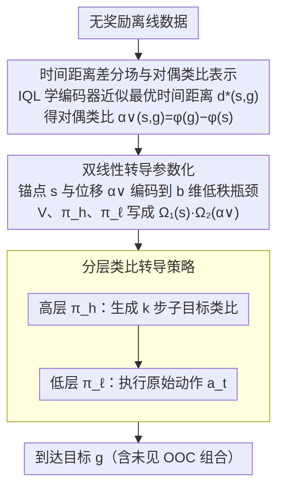

# Compositional Transduction with Latent Analogies for Offline Goal-Conditioned Reinforcement Learning

**会议**: ICML2026  
**arXiv**: [2605.20609](https://arxiv.org/abs/2605.20609)  
**代码**: https://rllab-snu.github.io/projects/CTA/  
**领域**: 机器人  
**关键词**: 离线目标条件强化学习, 组合泛化, 类比转导, 时间距离差分场, 双线性转导  

## 一句话总结

本文提出 CTA（Compositional Transduction with latent Analogies），通过将目标到达任务分解为"任务内生类比"和"任务外生上下文"两个独立因子，利用时间距离差分场作为类比表示，并结合双线性转导实现对未见类比—上下文组合的外推，在 OGBench 操控环境上平均性能超过最强基线约 42%。

## 研究背景与动机

**领域现状**：离线目标条件强化学习（offline GCRL）旨在从无奖励的离线数据中训练一个通用的目标到达智能体。现有方法主要通过**轨迹拼接**（trajectory stitching）来实现组合泛化——将时间上相邻的片段连接起来合成新的目标到达行为。

**现有痛点**：轨迹拼接只能组合时间上相邻的行为片段，但无法处理另一种互补的组合性需求——在**不同的任务无关上下文下复用同一任务相关的行为变换**。例如，智能体在窗户打开时学会了开抽屉，但在窗户关闭时却无法迁移这一行为，因为这两个上下文组合在训练数据中从未共现。

**核心矛盾**：离线数据有限，不可能覆盖所有"任务 × 上下文"的组合。现有方法缺乏将**任务内生变换**（如开抽屉）与**任务外生上下文**（如窗户状态）解耦并重新组合的机制，导致在未见组合上泛化失败。

**本文目标**：(1) 定义什么是"类比"并给出可学习的表示；(2) 解决未见类比—上下文组合的分布外推问题。

**切入角度**：作者观察到最优时间距离 $d^*(s,g)$ 诱导的准度量空间对任务外生上下文不变，而一对状态—目标的**时间距离差分场** $\alpha(s,g)(x) = d^*(x,g) - d^*(x,s)$ 恰好编码了任务内生位移，且足以支撑最优目标到达。

**核心 idea**：用时间距离差分场作为任务内生类比的表示，通过双线性转导将类比和上下文解耦为低秩因子，实现对未见组合（OOC）的可靠外推。

## 方法详解

### 整体框架

CTA 分为两阶段：**类比提取**和**类比转导**。首先，通过学习一对编码器 $\phi, \varphi$ 来近似最优时间距离 $d^*(s,g) = \phi(s)^\top \varphi(g)$，由此得到**对偶类比** $\alpha^\vee(s,g) = \varphi(g) - \varphi(s)$，它是时间距离差分场的有限维实例化。然后，在类比转导阶段，利用对偶类比作为位移信号，通过双线性转导参数化值函数和分层策略，使智能体能够外推到未见的类比—上下文组合。推理时，高层策略生成 $k$ 步子目标类比，低层策略执行原始动作。

### 关键设计

**1. 时间距离差分场与对偶类比表示：用"到所有探针状态的难度差"刻画任务内生位移**

要把"开抽屉"这种任务变换从"窗户开/关"这种上下文里剥离出来，得有一个对上下文不变、对任务位移充分的表示。单个标量 $d^*(s,g)$ 不行——不同任务可能映射到同一个距离值而退化。CTA 的做法是对状态—目标对 $(s,g)$ 定义时间距离差分场 $\alpha(s,g)(x)=d^*(x,g)-d^*(x,s)$：它遍历所有探针状态 $x$，比较"到 $g$"与"到 $s$"的难度差，相当于给任务内生位移盖了一个对整个状态空间的"签名"，靠相对比较消除标量退化。实际中把 $d^*$ 参数化成内积 $\phi(s)^\top\varphi(g)$，差分场就坍缩成一个 $d$ 维向量 $\alpha^\vee(s,g)=\varphi(g)-\varphi(s)$，独立于探针状态 $x$。和基于 bisimulation 的类比不同，它建在最优时间距离上，不受离线数据里次优策略质量波动的影响，更适合离线场景。

**2. 双线性转导参数化：用低秩瓶颈让锚点和位移各自独立泛化，撑起 OOC 外推**

光有类比表示还不够——如果用标准 MLP 拟合 $V(s, \alpha^\vee)$，会把"当前状态"（锚点）和"类比"（位移）耦合在一起，碰到训练里没共现过的组合就泛化失败。CTA 把值函数写成双线性形式 $V(s,g)=\Omega_1(s)\cdot\Omega_2(\alpha^\vee(s,g))$，$\Omega_1, \Omega_2$ 分别把锚点和位移编码到一个 $b$ 维低秩瓶颈空间（$b\ll d$），策略均值同样双线性化，如高层 $\mu_h(s,\alpha^\vee(s,g))=\omega_{h1}(s)\cdot\omega_{h2}(\alpha^\vee(s,g))$。低秩约束逼着网络在锚点和位移各自的边际分布上独立学习，推理时通过张量积自然外推到未见组合——这正是借自 Netanyahu et al. (2023) 的 OOC 泛化理论，首次用到离线 GCRL 的值函数和策略参数化上，且有误差界保证。消融里 HIQL∨ 和 HIQL+α∨ 性能几乎一样（39.3 vs 39.6），说明单纯用对偶类比表示不够，真正的增益来自这个双线性转导。

**3. 分层类比转导策略：把长程类比拆成 $k$ 步短程子任务**

离线数据里长程类比很稀疏，直接做长程转导既不可靠、又容易把类比查询推到 OOC 范围之外。CTA 分两层：高层策略 $\pi_h$ 以当前状态和最终目标类比为条件，输出 $k$ 步子目标类比 $\alpha^\vee(s_t, s_{t+k})$；低层策略 $\pi_\ell$ 以当前状态和子目标类比为条件，输出原始动作 $a_t$。拆成短程子任务后，可复用的短程类比数量大幅增加，数据效率和转导稳定性都上来了，低层策略也不会去查超出预期 OOC 范围的类比。两层策略都用优势加权回归（AWR）训练。

### 损失函数 / 训练策略

类比提取阶段使用 IQL 的 expectile 损失训练 $\phi, \varphi$ 和 $Q$ 函数（公式 9）。类比转导阶段使用无动作 IQL 损失训练值函数 $V$（公式 13），高层和低层策略均用优势加权回归损失训练（公式 14、15），温度参数 $\beta_h, \beta_\ell$ 控制行为克隆的权重。目标网络用于稳定训练。

## 实验关键数据

### 主实验

在 OGBench 的 8 个操控环境上与 11 个基线比较（8 种随机种子）：

| 环境 | GCBC | HIQL | GCIQL | GCIVL∨ | HIQL∨ | HIQL+α∨ | **CTA** |
|------|------|------|-------|--------|-------|---------|---------|
| scene-play | 5 | 38 | 51 | 72 | 87 | 80 | **90** |
| cube-single-play | 6 | 15 | 68 | 89 | 69 | 74 | **86** |
| cube-double-play | 1 | 6 | 40 | 60 | 38 | 30 | **50** |
| cube-triple-play | 1 | 3 | 3 | 2 | 18 | 11 | **17** |
| puzzle-3x3-play | 2 | 12 | 95 | 5 | 79 | 72 | **94** |
| puzzle-4x4-play | 0 | 7 | 26 | 23 | 16 | 50 | **84** |
| puzzle-4x5-play | 0 | 4 | 14 | 5 | 5 | 0 | **17** |
| puzzle-4x6-play | 0 | 3 | 12 | 2 | 2 | 0 | **12** |
| **平均** | 1.9 | 11.0 | 38.6 | 32.2 | 39.3 | 39.6 | **56.3** |

### OOC 外推案例研究

在 scene 和 puzzle-4x4 上故意移除特定类比—上下文组合的训练数据，测试直接成功率（direct success rate）：

| 环境 | HIQL | GCIQL∨ | HIQL∨ | HIQL+α∨ | **CTA** |
|------|------|--------|-------|---------|---------|
| scene | 19±10 (42±12) | 51±10 (63±11) | 45±11 (87±7) | 48±14 (86±6) | **73±9 (94±4)** |
| puzzle-4x4 | 37±11 (69±9) | 44±11 (55±12) | 35±17 (62±13) | 66±11 (95±4) | **80±8 (100±1)** |

> 表中括号外为直接成功率（仅计直接完成任务的轨迹），括号内为总成功率（含绕路完成）。

### 关键发现

- **Puzzle 环境增益最大**：状态空间呈指数级增长，组合泛化至关重要，CTA 在 4 个 puzzle 环境上平均提升约 40%，在 4×4 上达到最强基线的 2.5 倍
- **OOC 外推是性能增益的来源**：HIQL∨ 和 HIQL+α∨ 性能接近（39.3 vs 39.6），说明单纯使用对偶类比表示不够；CTA 通过双线性转导实现 OOC 外推才获得了显著提升
- **CTA 参数量更少**：尽管采用双线性参数化，CTA 比 HIQL+α∨ 少约 20% 参数，排除了模型容量带来增益的可能

## 亮点与洞察

- **时间距离差分场作为类比表示**巧妙地将度量几何中的距离差分嵌入引入 RL，通过对所有探针状态的相对比较消除标量退化问题，同时自然获得对上下文的不变性。这一思路可迁移到任何需要在变化环境中保持任务语义不变的场景
- **双线性转导的 OOC 保证**将 Netanyahu et al. (2023) 的 OOC 泛化理论首次应用于离线 GCRL 的值函数和策略参数化，用低秩瓶颈实现因子级别的独立泛化。这一范式可推广到其他需要组合泛化的序列决策问题
- **类比的 t-SNE 可视化**直观验证了学到的对偶类比确实按任务语义聚类（如"开抽屉"vs"关抽屉"），且对窗户/按钮等上下文因素保持不变

## 局限与展望

- **假设 4.3 较强**：要求同一任务块内所有状态—目标对的任务内生成分在不同比较端点下保持一致，在复杂真实环境中可能不成立
- **对偶类比与理论的 gap**：实际学到的 $\varphi(g) - \varphi(s)$ 不保证最小或可辨识，与理论上不变的距离差分场存在近似误差
- **适用范围限制**：在缺乏明确任务—上下文分离的环境（如迷宫）中，CTA 优势有限；方法设计偏向操控类任务
- 未来方向包括更精确地近似距离差分场、将类比转导扩展到连续控制和高维视觉观测场景

## 相关工作与启发

- **离线 GCRL**：HIQL（分层 IQL）、GCIQL、QRL（准度量学习）、CRL（对比 RL）等提供了时间距离估计的不同方案，CTA 在此基础上引入类比层
- **类比与表示学习**：word2vec 的线性偏移类比启发了本文的差分向量设计；goal-conditioned bisimulation 是最近的相关工作，但依赖在策略 reward matching，不适合离线场景
- **对偶目标表示**：Park et al. (2026) 的对偶表示 $\varphi(g)$ 与本文对偶类比 $\varphi(g) - \varphi(s)$ 共享编码器训练方式，但前者不具备类比转导能力

<!-- RELATED:START -->

## 相关论文

- [\[ICML 2026\] Latent Representation Alignment for Offline Goal-Conditioned Reinforcement Learning](latent_representation_alignment_for_offline_goal-conditioned_reinforcement_learn.md)
- [\[CVPR 2026\] MangoBench: A Benchmark for Multi-Agent Goal-Conditioned Offline Reinforcement Learning](../../CVPR2026/reinforcement_learning/mangobench_a_benchmark_for_multi-agent_goal-conditioned_offline_reinforcement_le.md)
- [\[ICML 2026\] Offline Reinforcement Learning with Generative Trajectory Policies](offline_reinforcement_learning_with_generative_trajectory_policies.md)
- [\[AAAI 2026\] First-Order Representation Languages for Goal-Conditioned RL](../../AAAI2026/reinforcement_learning/first-order_representation_languages_for_goal-conditioned_rl.md)
- [\[ICML 2026\] Mind Dreamer: Untethering Imagination via Active Causal Intervention on Latent Manifolds](mind_dreamer_untethering_imagination_via_active_causal_intervention_on_latent_ma.md)

<!-- RELATED:END -->
