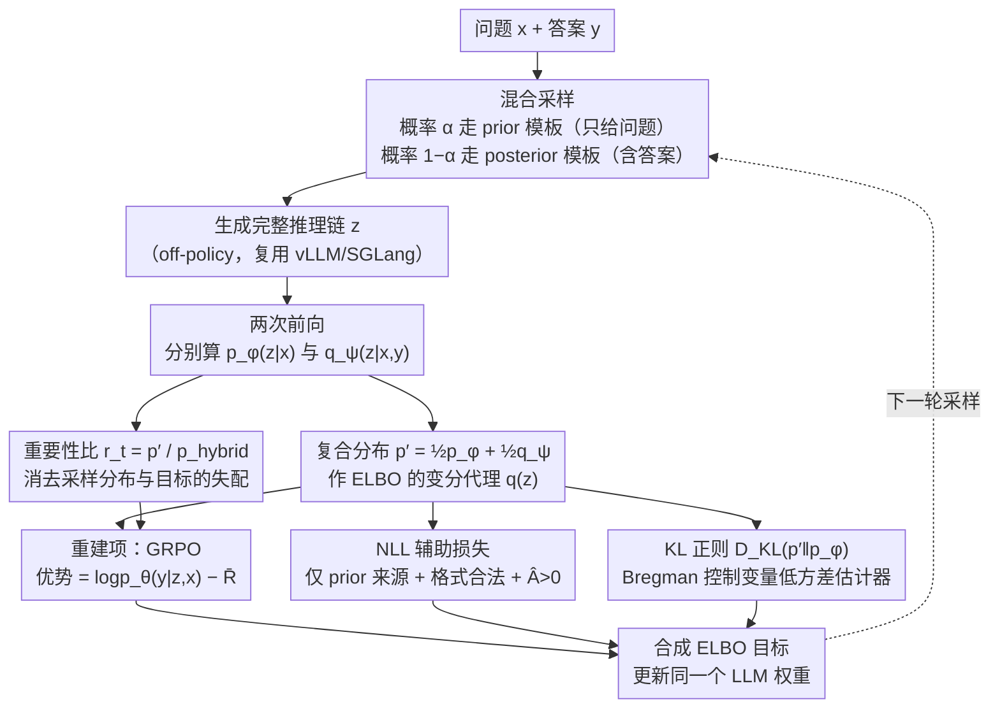

# Coupled Variational Reinforcement Learning for Language Model General Reasoning

**会议**: ICML 2026  
**arXiv**: [2512.12576](https://arxiv.org/abs/2512.12576)  
**代码**: https://github.com/wenxueru/CoVRL  
**领域**: LLM 推理 / 强化学习 / 变分推断 / verifier-free RL  
**关键词**: 变分 RL、先验/后验耦合、混合采样、GRPO、无验证器奖励  

## 一句话总结
CoVRL 把"用回答概率当奖励"的 verifier-free RL 重写成一个变分推断问题，构造一个"先验 (只看问题) + 后验 (看到答案)"的复合分布，并用混合采样 + 重要性加权同时优化两者，使 Qwen2.5-7B 在 9 个通用与数学推理基准上相对 base 平均涨 12.4%，比最强 verifier-free 基线再涨 2.3%。

## 研究背景与动机

**领域现状**：以 RLVR (RL with Verifiable Reward) + GRPO 为代表的训练范式让 LLM 在数学/代码这类有规则验证器的任务上突飞猛进；但凡是没有可靠形式化验证器的领域（化学反应、自由问答、通用推理），这套路就不能直接用。

**现有痛点**：为绕开验证器，verifier-free 方法（VeriFree、JLB、LaTRO、RLPR）改用"LLM 自己生成参考答案的对数概率"做奖励——把推理链 $z$ 看作潜变量，把 $p(y|x)=\int p(y|z,x)p(z|x)\,dz$ 当作要优化的边缘似然。**问题在于**：它们都是**只用先验 $p_\phi(z|x)$（只看问题）采样推理链**。这带来两个老大难：(1) 难题上模型一上来根本写不出合理推理链，采样效率极低；(2) 推理过程跑对了但最终答案表述跟 ground-truth 格式不一致，照样拿低分，**推理链与答案不耦合**。

**核心矛盾**：训练时如果改用 VAE 式的后验 $q_\psi(z|x,y)$（看着答案造推理链）采样，效率高、答案对齐好，但推理时拿不到答案、只能用先验，导致 **训练-推理分布失配**；KL 正则 $D_{\mathrm{KL}}(q_\psi\|p_\phi)$ 是反向 KL，**只能让后验避开先验的低概率区，但不保证覆盖先验的高概率区**——先验里仍有大片"训练时没见过"的区域，推理崩溃。

**本文目标**：在不引入外部验证器的前提下，找到一个**既高效又转移**的采样分布，让训练时的推理链既受答案指导又不偏离推理时的真实分布。

**切入角度**：与其在先验、后验之间二选一，**不如直接构造一个把两者按 token 等权混合的复合分布 $p'(z|x,y)=\tfrac12 p_\phi(z|x)+\tfrac12 q_\psi(z|x,y)$**——再去优化 $p'$ 对应的 ELBO。这样后验的"答案指导"和先验的"推理时一致性"被同时灌进梯度。

**核心 idea**：用"先验/后验混合的复合分布"作为变分代理 $q(z)$，配合"按概率 $\alpha$ 在两条 prompt 模板间随机切换"的离线混合采样 + 重要性加权，在同一个 LLM 上把变分推断与 RL 无缝对接。

## 方法详解

### 整体框架
CoVRL 把推理链 $z$ 视作连接问题 $x$ 与答案 $y$ 的潜变量，重写为 $\log p(y|x)\ge \mathbb{E}_{q(z)}[\log p_\theta(y|z,x)]-D_{\mathrm{KL}}(q(z)\|p_\phi(z|x))$（ELBO）。过往工作取 $q=p_\phi$（先验本身）；CoVRL 取 $q=p'$ 这个复合分布，再用 GRPO 优化重建项、用 Schulman 类 KL 估计器优化正则项。三个分布 $p_\phi(z|x)$、$q_\psi(z|x,y)$、$p_\theta(y|z,x)$ 共用同一个 LLM 权重，只靠 prompt 模板切换上下文（prior 模板只塞问题；posterior 模板把答案也放进 assistant 提示里），形成"单模型多角色"的变分 RL 闭环。

### 关键设计

**1. 复合分布 $p'(z|x,y)$ 作为变分代理：把后验的"答案指导"和先验的"推理时一致性"绑进同一个 ELBO**

verifier-free 方法都只从先验 $p_\phi(z|x)$（只看问题）采推理链，难题上一上来写不出合理链、采样效率极低，还常出现"推理对了但答案表述对不上 ground-truth"的错位；可若改用 VAE 式后验 $q_\psi(z|x,y)$（看着答案造链）训练，推理时拿不到答案又会造成训练-推理分布失配，而反向 KL $D_{\mathrm{KL}}(q_\psi\|p_\phi)$ 只让后验避开先验低概率区、不保证覆盖其高概率区。CoVRL 不在两者间二选一，而是构造一个 token 级等权混合 $p'(z_t|z_{<t},x,y)=\tfrac12 p_\phi(z_t|z_{<t},x)+\tfrac12 q_\psi(z_t|z_{<t},x,y)$ 当作 ELBO 里的 $q(z)$。替换后重建项 $\mathbb{E}_{p'}[\log p_\theta(y|z,x)]$ 的梯度会同时流回先验和后验，正则项 $D_{\mathrm{KL}}(p'\|p_\phi)$ 又把整个复合分布拉向先验——后验的高质量轨迹给先验"补血"，先验的覆盖范围反过来约束后验，等于把 VAE 的 $q$ 和 RL 的 $\pi$ 拉到了同一坐标系。

**2. off-policy 混合采样 + 重要性重加权：不真做 token 级混合，靠 prompt 切换 + 重要性比把分布失配数学闭合**

直接从 $p'$ 采样要求每个 token 都做混合，工程开销大且和 vLLM/SGLang 不兼容。CoVRL 改成按概率 $\alpha$ 走 prior 模板、$1-\alpha$ 走 posterior 模板生成完整轨迹，即 $p_{\text{hybrid}}(z|x,y)=\alpha p_\phi+(1-\alpha)q_\psi$，再对每条轨迹做两次前向算出 $p_\phi(z|x)$、$q_\psi(z|x,y)$ 进而得 $p'$ 与 $p_{\text{hybrid}}$；GRPO 损失里的 token 比率 $r_t=p'_{\text{new}}(z_t|\cdot)/p_{\text{hybrid}}(z_t|\cdot)$ 把实际采样分布和目标复合分布的差消掉。优势 $\hat A=\log p_{\theta_{\text{old}}}(y|z,x)-\bar R$ 直接用模型自己对答案的对数概率当奖励，无需外部验证器。这样不改现有 verl/OpenRLHF 框架、复用 SGLang/vLLM 批量推理，仅靠 prompt 切换就实现了混合分布的有偏估计，再加一项对"仅来自先验、$\hat A>0$"轨迹的 NLL 辅助损失（相当于选择性 MLE）稳住先验训练。

**3. 基于 Bregman 控制变量的低方差 KL 估计器：让混合采样下的 KL 项无偏、非负、不爆炸**

标准 $\log\tfrac{p'}{p_\phi}$ 估计器在混合采样下方差极高还可能为负，KL 项一炸训练就崩。CoVRL 扩展 Schulman 的低方差 KL 估计器，按样本来源分两套：来自先验时取 $D_{\mathrm{KL}}^{\text{prior}}=\tfrac{p'}{p_\phi}\log\tfrac{p'}{p_\phi}-\tfrac{p'}{p_\phi}+1$，来自后验时取 $D_{\mathrm{KL}}^{\text{posterior}}=\tfrac{p'}{q_\psi}\log\tfrac{p'}{p_\phi}+\tfrac{p'}{q_\psi}-1$。两者差在 Bregman 修正项 $\left(\tfrac{p'}{p_{\text{hybrid}}}-1\right)$ 的符号——它满足 $\mathbb{E}_{p_{\text{hybrid}}}[\cdot]=0$ 所以无偏，又能把估计器钉在非负区间避免梯度爆炸。再配合对重要性比的软裁剪、以及对达到最大长度的样本跳过 KL 计算，进一步降噪，这是 CoVRL 能跑稳的关键工程支撑。

### 损失函数 / 训练策略
重建项用 GRPO 做策略梯度（带 PPO 风格 clip，$\epsilon=0.3$），KL 项作为独立 loss 加到目标里（比把它塞进奖励里更稳）。base 模型直接对 Qwen2.5-7B-Base 微调、不做 SFT，batch=192 题、每题 rollout 8 条；cosine LR + 64 步 warmup、峰值 1e-6；温度 1.0、max_tokens=2048。Qwen3-base 上把 `<think>` 标记换成 `<thinking>` 以匹配模型偏好。

## 实验关键数据

### 主实验
在 9 个通用 + 数学推理基准上对比所有 verifier-free RL 基线，所有方法都用 GRPO + 同超参跑在 Qwen2.5-7B-Base 上：

| 方法 | GPQA | MMLU-Pro | TheoremQA | AIME'24 | MATH-500 | Minerva | SAT-Math | Overall |
|---|---|---|---|---|---|---|---|---|
| Base Model | 26.1 | 36.7 | 25.2 | 2.7 | 44.7 | 18.6 | 76.5 | 37.8 |
| VeriFree | 28.9 | 44.1 | 33.4 | 5.0 | 59.5 | 24.0 | 93.3 | 47.1 |
| JLB | 31.6 | 42.7 | 31.9 | 4.8 | 57.6 | 23.6 | 93.7 | 46.5 |
| LaTRO | 31.0 | 42.7 | 32.8 | 4.0 | 59.3 | 24.4 | 90.1 | 44.7 |
| RAVR | 30.2 | 44.5 | 34.8 | 6.3 | 61.2 | 23.3 | 94.1 | 47.8 |
| RLPR | 31.3 | 44.9 | 33.5 | 6.5 | 61.2 | 24.7 | 93.8 | 47.9 |
| **CoVRL (Ours)** | **30.4** | **46.5** | **36.3** | **7.5** | **66.3** | **25.5** | **97.1** | **50.2** |

CoVRL 比 base 平均涨 12.4%，比最强基线 RLPR 再涨 2.3%；在 SAT-Math、MATH-500、TheoremQA 等需要长链推理的任务上提升尤其明显。

### 消融实验

| 实验 | 设置 | 关键现象 | 说明 |
|---|---|---|---|
| 模型规模 | Qwen2.5-7B → 14B | Overall: +12.4% → +14.0% | 增益随规模上行，证明方法可 scale |
| 模型族 | Qwen3-8B / Qwen3-14B | 分别 +8.6% / +5.4% | 跨基座家族都稳涨，非 Qwen2.5 特例 |
| 训练数据 | Non-Math Only | Math benchmark 仍 +21.6%(MATH-500) | 非数学训练数据可迁移到数学任务 |
| 训练数据 | Math Only | Non-Math 仍 +6.0%(MMLU-Pro) | 数学训练数据反向也能提升通用推理 |
| 混合比 $\alpha$ | 0.1 / 0.5 / 0.9 | $\alpha=0.5$ 最优；$\alpha=0.9$ 链短 reward 难涨 | 平衡采样验证了双向耦合的必要性 |

### 关键发现
- **后验持续比先验给出更高奖励曲线（图 4a）**——证明"看到答案再造推理链"确实是更高效的探索源；同时先验奖励也持续上涨说明后验的好处能转移到推理时。
- **响应长度随训练单调增长**——CoVRL 鼓励模型自发产生更详细的 CoT；这是单纯 SFT 难做到的。
- **跨数据域的反向迁移**：只用非数学数据训练就能把 MATH-500 拉到 66.3%，反之亦然，强烈暗示 CoVRL 学到的是"通用推理 pattern"而非领域特定的解题模板。
- $\alpha=0.9$（接近纯先验）时模型挣不到奖励、转去最小化 KL 导致链长退化；$\alpha=0.1$（接近纯后验）链虽长但训练-推理失配让性能不如 $\alpha=0.5$。

## 亮点与洞察
- **第一次把 verifier-free RL 与变分推断在 token 级正式打通**：之前的工作要么把推理链当独立采样、要么用 IWAE+EM 拆成两个模型；CoVRL 用一个 LLM、两套 prompt、一段 ELBO 把先验与后验绑在一起，工程极简、理论闭合。
- **混合采样 + 重要性比是个非常 portable 的工程方案**：不需要改 vLLM、不需要 token-by-token 真混合，对任何"训练-推理分布失配"的 RL 场景（不仅 LLM）都有借鉴价值。
- **答案对数概率作为内生奖励**：CoVRL 复用 $\log p_\theta(y|z,x)$ 既当 reward 又当训练目标，避免独立 reward model 的部署成本与奖励黑客问题，特别适合化学、医学、自由问答这种没有规则验证器的领域。
- **训练-推理一致性的几何直觉**：复合分布 $p'$ 把 $p_\phi$ 放在分母位置，KL 正则又把 $p'$ 拉向 $p_\phi$，相当于给后验一个永远朝着先验高概率区"靠岸"的弹簧——既能借后验的力，又不会被冲离推理时的真实分布。

## 局限与展望
- 每条轨迹要做两次前向（prior 模板与 posterior 模板各一次）才能算出重要性比，**训练算力比纯先验方法约翻倍**；规模更大时是否仍 cost-effective 没有给出 FLOPs 对比。
- 奖励 $\log p_\theta(y|z,x)$ 用模型自己评分，**仍然可能在模型有系统性偏差的任务上出现自我强化（reward hacking）**；论文承认风险但未量化分析。
- 混合比 $\alpha$ 是固定的全局超参，**$\alpha=0.5$ 的最优性是经验观察**，没有理论或自适应方案；不同任务/规模可能需要重新搜参。
- 实验仅评估到 14B、上下文 4K，**对长 context 推理、多步工具调用、agent 场景未做验证**；混合 prompt 模板在长序列下的工程稳定性待考。

## 相关工作与启发
- **vs VeriFree / RLPR / JLB**：这些只从先验采样的 verifier-free 方法在难题上探索效率低、答案-推理常错位；CoVRL 用复合分布同时拿到后验的引导。
- **vs LaTRO**：LaTRO 首次把推理链做潜变量；CoVRL 在它基础上引入复合分布与混合采样，把"潜变量 RL"从单分布扩到双分布耦合。
- **vs RAVR**：RAVR 是先驱性地用后验采样，但缺乏与先验的耦合机制；CoVRL 通过 $p'$ 与重要性比把训练-推理失配显式闭合。
- **vs Zhou et al. (2025b) 的 IWAE+EM 方案**：他们用两个独立模型分别表示先验、后验，按 EM 交替更新；CoVRL 把两者合进一个模型 + 一次 RL 训练，工程上轻太多。
- **vs VAE 经典框架**：CoVRL 等价于用"先验/后验混合"代替 VAE 中的 $q_\phi$，体现了"用 RL 替代显式重参数化"在离散文本生成上的一种通用配方。

## 评分
- 新颖性: ⭐⭐⭐⭐⭐ 复合分布 + token 级混合 + 重要性比，把变分推断和 verifier-free RL 整合得相当干净，是该方向少见的 framework-level contribution。
- 实验充分度: ⭐⭐⭐⭐ 9 基准 + 4 base 模型 + 训练曲线 + $\alpha$ 消融，证据链充分；但缺 KL 估计器对比、缺与 RLVR 的直接比对。
- 写作质量: ⭐⭐⭐⭐⭐ 公式推导一步不漏，动机-方法-实验衔接紧凑，图 1/2 把核心 idea 一图讲清。
- 价值: ⭐⭐⭐⭐ 给所有没有验证器的推理任务提供了高样本效率的训练范式，方法本身可迁移到 RLHF、agent 等场景。

<!-- RELATED:START -->

## 相关论文

- [\[ICML 2026\] Break the Block: Dynamic-size Reasoning Blocks for Diffusion Large Language Models via Monotonic Entropy Descent with Reinforcement Learning](break_the_block_dynamic-size_reasoning_blocks_for_diffusion_large_language_model.md)
- [\[ICML 2026\] d2: Improving Reasoning in Diffusion Language Models via Trajectory Likelihood Estimation](d2_improving_reasoning_in_diffusion_language_models_via_trajectory_likelihood_es.md)
- [\[AAAI 2026\] Vision-Language Reasoning for Geolocalization: A Reinforcement Learning Approach](../../AAAI2026/reinforcement_learning/vision-language_reasoning_for_geolocalization_a_reinforcement_learning_approach.md)
- [\[ICML 2026\] The Surprising Difficulty of Search in Model-Based Reinforcement Learning](the_surprising_difficulty_of_search_in_model-based_reinforcement_learning.md)
- [\[ICML 2026\] InftyThink+: Effective and Efficient Infinite-Horizon Reasoning via Reinforcement Learning](inftythink_effective_and_efficient_infinite-horizon_reasoning_via_reinforcement_.md)

<!-- RELATED:END -->
