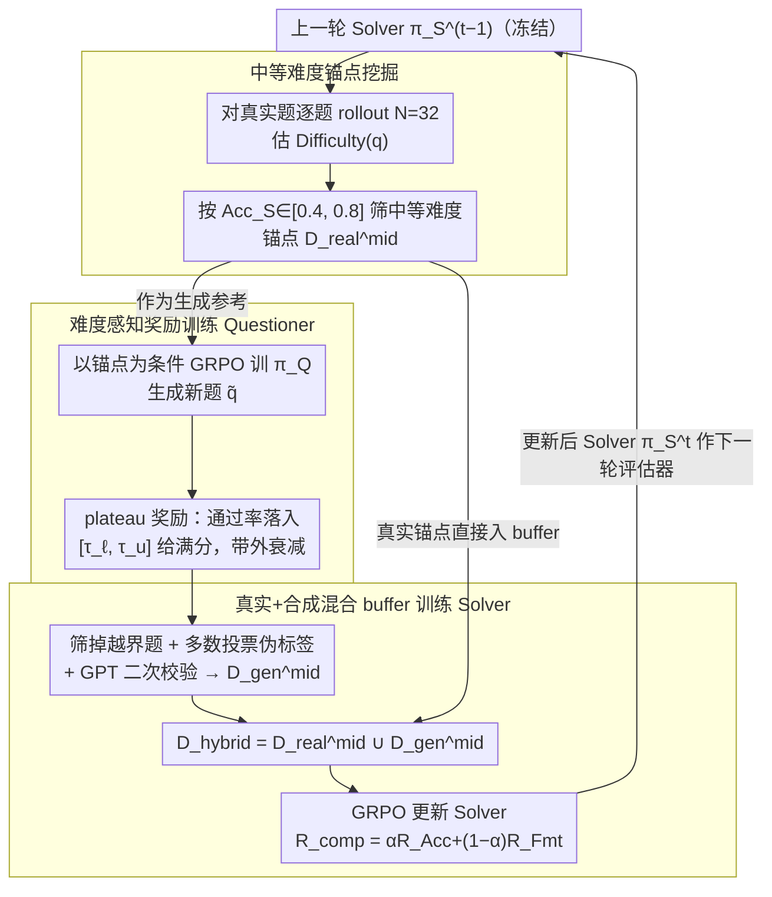

# D$^2$Evo: Dual Difficulty-Aware Self-Evolution for Data-Efficient Reinforcement Learning

**会议**: ICML 2026  
**arXiv**: [2605.17037](https://arxiv.org/abs/2605.17037)  
**代码**: 暂无公开链接  
**领域**: LLM 推理 / 强化学习 / 自演化训练  
**关键词**: GRPO、难度感知、自演化、问题生成、数据高效 RL  

## 一句话总结
D$^2$Evo 在每一轮 RL 迭代里都用当前 Solver 估计难度、挑出中等难度真实样本作为锚点，再训练 Questioner 围绕锚点合成同等难度的新题，从而以 < 2K 真实数学题就在数学和通用推理上同时超过用 19K 真实数据训练的 GRPO 基线。

## 研究背景与动机

**领域现状**：以 GRPO 为代表的 group-level RL 已经成为 LLM 后训练提升推理能力的主流范式，做法是对每道题采样一组回答、用相对优势做策略梯度更新。

**现有痛点**：GRPO 对训练样本的难度分布极为敏感——题目太易则一组回答全对、太难则一组回答全错，组内方差归零后优势信号塌缩，梯度为零，等于这一步白训。然而现成数学数据集（如 Math12K、OpenRs-7K）中真正落在中等难度区间的样本只占小部分；更糟糕的是，跑完一个 epoch 之后，原本中等的题大多被模型学会变成了"易题"，剩下的硬题依旧搞不定，**有效信号样本越训越少**。

**核心矛盾**：作者把这两个问题分别叫做"有效数据稀缺 (Effective Data Scarcity)"和"动态难度漂移 (Dynamic Difficulty Shifts)"——根源在于训练数据的难度是静态的，而 Solver 的能力是动态的，两者之间的错配让多轮迭代收益迅速枯竭。已有的自合成方案要么无锚点（R-Zero、Absolute-Zero）导致熵塌缩、生成偏离分布，要么虽有锚点但不做难度控制（SPICE），生成的新题大量落在易/难两极，仍旧浪费梯度。

**本文目标**：让 Questioner 在每一轮都能围绕"对当前 Solver 而言恰到好处难"的锚点生成新题，并让两者协同演化、彼此牵引。

**切入角度**：作者基于 Bae 等人的结论——在二元奖励下，KL 散度的下界与每道题的通过率 $p$ 满足 $D_{\mathrm{KL}}(\pi_{\mathrm{init}}\|\pi^{*})\ge p(1-p)/(2\beta^{2})$，在 $p=0.5$ 时最大——证明"中等难度"不是经验直觉而是有理论支撑的最优学习信号区。再加上他们实测一个 epoch GRPO 之后中等区间样本占比骤降，**自然推出"每轮根据当前 Solver 重新挖锚点 + 生成同难度新题"的循环结构**。

**核心 idea**：用"双重难度感知 (dual difficulty awareness)"——Questioner 用难度奖励对齐目标难度带，Solver 用混合缓冲区（真实锚点 + 同难度合成题）持续训练——让题与解题者在多轮迭代中协同演化，把有限的真实数据榨干。

## 方法详解

### 整体框架
D$^2$Evo 是一个多轮迭代的自演化 RL 循环，每一轮 $t$ 都做四件事：

1. **难度估计**：用上一轮的 Solver $\pi_S^{t-1}$（冻结）对候选真实数据集逐题 rollout $N=32$ 次，按定义 $\text{Difficulty}(q)=(1-\text{correct}/N)\times 100$ 估难度，按阈值 $[\textit{low}=0.4,\textit{high}=0.8]$ 挑出中等难度子集 $\mathcal{D}^{mid}_{real}$，作为锚点。
2. **Questioner 训练**：以锚点 $(q_{\text{anc}}, y_{\text{anc}}, s)$ 为条件，用 GRPO + 难度感知奖励训练 $\pi_Q$ 生成新题 $\tilde q$，使生成题在当前 Solver 下的通过率落入目标带 $[\tau_\ell, \tau_u]$。
3. **构造混合缓冲区**：从生成题里筛掉难度越界的，用多数投票生成伪标签 + GPT 二次审核，得到 $\mathcal{D}^{mid}_{gen}$，与锚点合成 $\mathcal{D}_{hybrid}=\mathcal{D}^{mid}_{real}\cup\mathcal{D}^{mid}_{gen}$。
4. **Solver 训练**：在 $\mathcal{D}_{hybrid}$ 上用 GRPO 更新 Solver，奖励为 $R_{\mathrm{comp}}=\alpha R_{\mathrm{Acc}}+(1-\alpha) R_{\mathrm{Fmt}}$。

更新后的 Solver 再作为下一轮的难度评估器和起点，形成闭环。整套循环把"数据生成 / 数据筛选 / 模型更新"绑进同一难度坐标系，避免了多轮之间难度漂移。

### 关键设计

**1. 基于当前 Solver 的中等难度锚点挖掘：每轮重新校准"哪些真实题正处于学习前沿"**

直接拿预先标好难度的静态数据集训练，会随着模型变强迅速失效——原本中等的题学会了变易题，剩下的硬题依旧搞不定，有效信号样本越训越少。D$^2$Evo 在每轮迭代前先用当前冻结的 Solver $\pi_S^{t-1}$ 对候选真实数据逐题做 $N=32$ 次 rollout，按 $\text{Difficulty}(q)=(1-\text{correct}/N)\times 100$ 估难度，再用 $\text{Acc}_S(q)\in[\textit{low}=0.4,\textit{high}=0.8]$ 筛出对它而言不易不难的子集当锚点。这个池子是会漂移的：Solver 变强后原先的"中等"题被升格为易题剔除，部分硬题降级进入锚点池。相比 R-Zero、AZR 那种完全不用锚点、让 Questioner 漫无目的造题的方案，锚点机制相当于每轮重新把生成牢牢钉在"优势信号最丰富"的真实题分布上。

**2. 带 plateau 形目标带的难度感知奖励：让 Questioner 出"刚好让 Solver 受教"的题，而非越难或越易越好**

Solver 每更新一次，题目对它的通过率就会大幅漂移，固定难度标签的奖励立刻失效；R-Zero 无约束造题会熵塌缩、AZR 不控难度会让生成题散落两极，都在浪费梯度。D$^2$Evo 给 Questioner 一个 plateau 形奖励：对生成题 $\tilde q$ 做 $N_v$ 次 Solver rollout 得通过率 $x=\text{Acc}_S(\tilde q)$，落在目标带 $[\tau_\ell,\tau_u]$ 内时 $r_{\text{diff}}(x)=1$ 给满分，带外则按 $x<\tau_\ell$ 时 $(x/\tau_\ell)^a$、$x>\tau_u$ 时 $((1-x)/(1-\tau_u))^a$ 衰减（$a\ge 1$ 控制锐度）。再叠一个格式约束（必须用 `<question>...</question>` 包裹，不合规归零）得到 $R_{\mathrm{comp}}$。带内全分、带外快速衰减的形状把训练信号收紧到值得花算力的难度区间，不让 Questioner 因为多样性奖励漂到极端。

**3. 真实锚点 + 同难度合成题的混合 buffer：用真实题稳定监督、合成题持续刷新信号**

纯合成题难免有伪标签噪声，纯真实题又稀缺易耗尽，所以 Solver 在两者拼成的 buffer 上训。合成题先用 Solver 多数投票生成伪标签 $\tilde y$、要求通过率仍落在 $[\tau_\ell,\tau_u]$，再用 GPT-5.2 二次校验答案一致性以降噪，最后与真实锚点按统一难度准则 $\text{Acc}_S(q)\in[\tau_\ell,\tau_u]$ 拼成 $\mathcal{D}_{hybrid}$ 参与 GRPO 更新。真实锚点提供 on-distribution、grounded 的稳定监督，合成题提供源源不断的同难度新信号，两者互补又同处一个难度坐标系，这正是整套循环不在多轮之间发生难度漂移的关键。

> ⚠️ 原文称用 "GPT-5.2" 做二次校验，该模型名以原文为准。

### 损失函数 / 训练策略
两端都用 GRPO（Eq. 2 形式），共享 LLM 权重，仅靠 prompt 区分 Questioner / Solver 角色。Questioner 的 reward 是上述 $R_{\mathrm{comp}}$，Solver 的 reward 是 $\alpha R_{\mathrm{Acc}}+(1-\alpha)R_{\mathrm{Fmt}}$（要求 `<think>...</think>` 与 `\boxed{}` 结构）。难度阈值 $\textit{low}=0.4, \textit{high}=0.8$，rollout 数 $N=32$，每个模型训 3 轮自演化迭代。

## 实验关键数据

### 主实验
在 7 个数学推理基准（AMC、Minerva、MATH-500、GSM8K、Olympiad-Bench、AIME-2024、AIME-2025）上对比 Base、Full Data (19K 真实数据 GRPO)、R-Zero、AZR、SPICE 五个基线，三种 backbone：

| 模型 / 方法 | #真实数据 | Math Avg. (7 项) | 相对 Base 提升 |
|---|---|---|---|
| Qwen3-4B-Base | – | 43.87 | – |
| + Full Data (GRPO) | 19K | 49.28 | +5.41 |
| + R-Zero (Iter 3) | – | 46.91 | +3.04 |
| + AZR | – | 46.36 | +2.49 |
| + SPICE | 20K | 50.59 | +6.72 |
| **D$^2$Evo (Iter 3)** | **0.1K** | **51.35** | **+7.48** |
| Qwen3-8B-Base | – | 47.24 | – |
| + Full Data | 19K | 52.70 | +5.46 |
| + SPICE | 20K | 54.34 | +7.10 |
| **D$^2$Evo (Iter 3)** | **0.4K** | **55.32** | **+8.08** |
| Llama-3.1-8B-Inst | – | 29.35 | – |
| + Full Data | 19K | 31.10 | +1.75 |
| **D$^2$Evo (Iter 3)** | **0.4K** | **33.09** | **+3.74** |

在仅训练数学数据的前提下，通用推理 (SuperGPQA、MMLU-Pro、BBEH 平均) 上 D$^2$Evo 在 Qwen3-4B / 8B / Llama-3.1-8B 也分别比 Base 提升 4.20%、2.59%、3.19%，三个 backbone 都超过 Full Data 基线。

### 消融实验

| 配置 | Math Avg. | General Avg. | 说明 |
|---|---|---|---|
| D$^2$Evo (full, Qwen3-4B) | 51.35 | 32.16 | 完整方法 |
| w/o Questioner | 47.94 | 30.75 | 去掉自合成题，仅用真实锚点训 Solver |
| w/o share weight | 49.99 | 31.62 | Questioner 与 Solver 不共享权重 |
| w/o synthesis data | 48.71 | 31.65 | Solver 只在锚点上训 |
| w/ random anchor data | 49.22 | 31.93 | 锚点不按难度筛、随机抽 |

### 关键发现
- 去掉 Questioner 在数学上掉 3.4 点最多，说明"自合成中等难度题"是性能上限的主驱动；随机锚点掉 2.1 点说明"按当前 Solver 选难度"的锚点机制也是关键之一。
- 共享权重略胜独立权重 (51.35 vs 49.99)，作者解释为"学会出题"会反向锐化模型对题目结构的理解，从而帮助解题——co-evolution 自带正反馈。
- 三轮迭代一直在涨：Qwen3-4B 上 Iter 1→Iter 3 涨 2.89%、8B 涨 2.82%，而 R-Zero 在 8B 上随迭代波动甚至下滑，对比凸显出难度感知锚点对多轮稳定性的必要性。

## 亮点与洞察
- **把"GRPO 优势信号最大化"用作锚点筛选准则**：通过 $p(1-p)$ 推导出 $p\approx0.5$ 的中等难度区间，再用动态 rollout 估计代替静态难度标签，让"中等难度"成为一个会随模型能力滑动的目标——这把课程学习里"按预设顺序教"的思想升级成了"按当前学生现状选教材"。
- **Questioner 与 Solver 共享权重的 co-evolution**：让同一个 LLM 既学解题又学按指定难度出题，二者在 GRPO 下相互监督——出题能力变强反过来提升对题目结构的表征，本身就是一种隐式的辅助任务正则。
- **极端样本效率**：每轮锚点 + 生成题加起来只有几百条，三轮总共 ≤2K 真实样本即可全面超过 19K Full Data，这套机制非常适合标注昂贵或私有数据有限的场景，例如医学、法务、科研推理。

## 局限与展望
- 难度估计依赖每轮 $N=32$ 次 rollout 与 GPT-5.2 二次审核，**估难度本身就有相当算力开销**，作者没给出对比训练 + 估难度的总 FLOPs，规模到 70B 是否仍 cost-effective 待验。
- 实验只在数学 + 通用推理基准上验证，**未覆盖代码、agent、多步工具调用**等更长 horizon 的任务；伪标签机制在没有 majority vote 收敛的开放式生成上是否可行存疑。
- 自演化框架天然有"小回路放大偏差"的风险——Questioner 可能持续生成同一类型的中等题，导致分布漂窄；目前只看到 BBEH/MMLU-Pro 的间接证据，缺乏对生成题多样性的直接定量分析。
- 阈值 $[\textit{low}, \textit{high}]=[0.4, 0.8]$ 与目标带 $[\tau_\ell, \tau_u]$ 是预设超参，**没有给出自适应方案**；不同任务可能需要重新搜参。

## 相关工作与启发
- **vs R-Zero (Huang et al., 2025)**：R-Zero 让 Challenger 完全无锚点造题，结果熵塌缩、出题越来越同质；D$^2$Evo 始终用真实中等难度锚点 + Solver 难度反馈约束生成，避免了 Questioner 漂移。
- **vs Absolute-Zero (Zhao et al., 2025)**：AZR 不做难度控制，生成题大量散落两端；D$^2$Evo 用 plateau 奖励把生成题压在"刚好让 Solver 受教"的中段。
- **vs SPICE (Liu et al., 2025a)**：SPICE 用 20K 文档级语料造题但 Solver/Questioner 都没有难度感知，靠数据规模硬怼；D$^2$Evo 用 < 2K 真实数据就反超，说明"难度感知"比"数据多"更关键。
- **vs 课程学习**：传统课程学习按预先标好的难度从易到难排课表，模型变强后老课表失效；D$^2$Evo 的锚点池在每轮按当前能力重新生成，本质是"自适应在线课程"，对长训练 horizon 更鲁棒。

## 评分
- 新颖性: ⭐⭐⭐⭐ "锚点 + plateau 难度奖励 + 共享权重 co-evolution"组合在 self-evolving RL 里第一次同时出现，理论动机 (GRPO 优势信号) 也讲得清楚。
- 实验充分度: ⭐⭐⭐⭐ 三个 backbone、10 个基准、三轮迭代曲线、五组消融，覆盖比较扎实；但缺训练算力 vs Full Data 的直接对比，欠最后一颗星。
- 写作质量: ⭐⭐⭐⭐ 结构清晰、动机-方法-实验逻辑链对得很整齐，公式和图都到位。
- 价值: ⭐⭐⭐⭐ 给"数据极少 + GRPO 长训不稳"这两个现实痛点提供了即插即用的处方，对所有 verifiable-reward RL 场景都有迁移潜力。

<!-- RELATED:START -->

## 相关论文

- [\[ICML 2026\] The Surprising Difficulty of Search in Model-Based Reinforcement Learning](the_surprising_difficulty_of_search_in_model-based_reinforcement_learning.md)
- [\[ACL 2026\] Easy Samples Are All You Need: Self-Evolving LLMs via Data-Efficient Reinforcement Learning](../../ACL2026/reinforcement_learning/easy_samples_are_all_you_need_self-evolving_llms_via_data-efficient_reinforcemen.md)
- [\[AAAI 2026\] STELAR-Vision: Self-Topology-Aware Efficient Learning for Aligned Reasoning in Vision](../../AAAI2026/reinforcement_learning/stelar-vision_self-topology-aware_efficient_learning_for_aligned_reasoning_in_vi.md)
- [\[ICML 2026\] InftyThink+: Effective and Efficient Infinite-Horizon Reasoning via Reinforcement Learning](inftythink_effective_and_efficient_infinite-horizon_reasoning_via_reinforcement_.md)
- [\[ICML 2026\] CPMöbius: Iterative Coach–Player Reasoning for Data-Free Reinforcement Learning](cpmobius_iterative_coach-player_reasoning_for_data-free_reinforcement_learning.md)

<!-- RELATED:END -->
