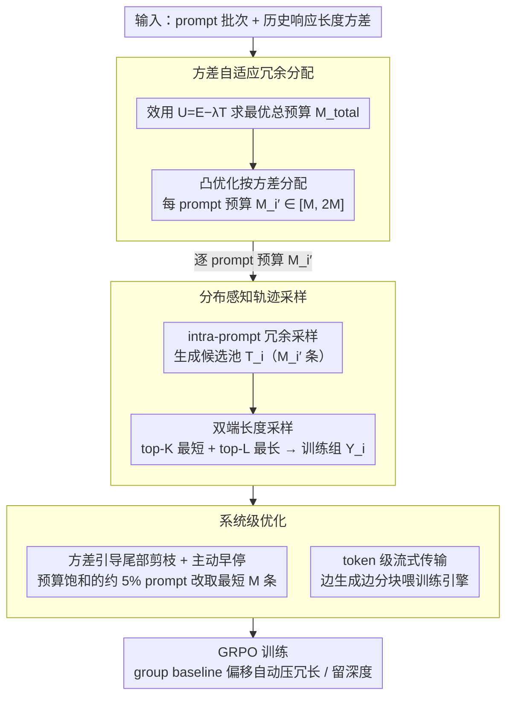

# DARTS: Distribution-Aware Active Rollout Trajectory Shaping for Accelerating LLM Reinforcement Learning

**会议**: ICML 2026  
**arXiv**: [2605.30859](https://arxiv.org/abs/2605.30859)  
**代码**: 论文摘要标注 "Source code available at: URL"（占位，待开源后确认）  
**领域**: 强化学习 / LLM 推理训练 / 系统优化  
**关键词**: GRPO, rollout 加速, 长尾分布, 主动塑形, 双端采样, 自适应冗余分配  

## 一句话总结
DARTS 把 LLM RL 训练的 rollout 长尾瓶颈从"调度绕开"重新定义成"主动塑形分布"，通过 intra-prompt 冗余采样 + 双端长度采样 + 方差驱动的冗余预算分配，把模型的 rollout 长度分布显式压短压紧，在 Qwen 系列 3B–32B 模型上相比 VeRL 取得最高 1.77 倍加速，同时不损失下游精度。

## 研究背景与动机

**领域现状**：当下 LLM 通过 GRPO / DAPO 等 RL 算法做"推理时间扩展"已经成为标配——每个 prompt 由策略 $\pi_\theta$ 采样 $M$ 条响应 $\{o_i^j\}_{j=1}^M$ 计算 group-normalized advantage $A(o_i^j) = (r_i^j - \mu(\mathcal{Y}_i))/\sigma(\mathcal{Y}_i)$，再回传梯度。整条流水线分 rollout 与 training 两段，rollout 阶段占总训练时间 70% 以上，构成主要瓶颈。其慢的根源是 rollout 轨迹长度的极端长尾——少数 prompt 触发的超长 trajectory 可比中位长度长 5–10 倍、比短响应长 20 倍以上，而同步 on-policy 系统中"最长一条响应卡住整个 batch"，造成严重 GPU 闲置。

**现有痛点**：业界已有的缓解策略——RollPacker 的 Tail Batching 和 Kimi/Moonshot 的 Partial Rollout——本质都是"prompt 级 tail scheduling"：超采样 $N' > N$ 个 prompt，等够 $N$ 个 prompt 完成后把剩下的长尾 prompt 推迟到下个批次或截断后续跑。这类方法只在"调度时序"上调整，没有触及分布本身；同时它们识别的是 inter-prompt 长尾（不同 prompt 之间的方差），忽略了同一个 prompt 内部也有显著长尾。另一条异步路线虽能完全 overlap rollout 和 training，但破坏 on-policy 语义，导致训练不稳和精度下降。

**核心矛盾**：scheduling 路线无法消除根本浪费——长尾 trajectory 本身是被生成出来的，token 计算成本已经付了。作者观察到一个被忽视的事实：单个 prompt 内的 rollout 长度同样呈现严重长尾（max/mean > 10×），并且这些长尾里很大一部分是"无效冗长"——对正确率没贡献的口水话或错误循环。

**本文目标**：把"应付长尾延迟"升级为"消除长尾分布"，具体分解为：(1) 在不损精度前提下让模型的 rollout 长度分布向短端集中；(2) 同时保留必要的长链推理；(3) 让分布塑形机制具备 prompt-aware 自适应性；(4) 配套系统优化把分布塑形带来的额外采样开销摊平。

**切入角度**：作者把长尾 trajectory 按"长度–奖励相关性"拆成两种模式——Pattern I（冗长无效尾，$\mathbb{E}[l|r>0] \le \mathbb{E}[l|r<0]$，正确响应反而短）和 Pattern II（必要深度尾，$\mathbb{E}[l|r>0] > \mathbb{E}[l|r<0]$，正确响应需要长链）。理想的分布塑形应该压前者、留后者。

**核心 idea**：用同一种"双端长度采样 + 自适应冗余预算"机制，通过 GRPO group baseline 的偏移自动同时实现"抑制冗长 (Pattern I)"和"保留深度 (Pattern II)"，不必显式分类。

## 方法详解

### 整体框架
DARTS 在 VeRL 之上做 rollout 阶段插件，整体三件套：(1) Distribution-Aware Trajectory Sampling——对每个 prompt $q_i$ 先做 intra-prompt 冗余采样得到候选池 $\mathcal{T}_i$（大小 $M_i' \ge M$），再用双端长度采样选出训练组 $\mathcal{Y}_i$；(2) Adaptive Redundancy Allocation——用历史长度方差 $\tilde\sigma_L^2(q_i)$ 作为长尾严重程度的代理，把总冗余预算 $M_{\mathrm{total}}$ 按方差分给各 prompt；(3) System-Level Optimization——方差引导的尾部剪枝 + proactive 早停 + token 级流式传输。整个流程不改 reward function、不引入额外 hyperparameter（除 $M_{\mathrm{up}}, M_{\mathrm{low}}, \lambda$ 三个稳定的系统参数）。运行时三者首尾相扣：先由方差自适应分配为每个 prompt 定下冗余预算 $M_i'$，喂给分布感知采样去生成候选池并双端选样，最后由系统级优化把约 5% 的极端长尾 prompt 剪掉、并以 token 流式喂入 GRPO 训练。

### 关键设计

**1. Distribution-Aware Trajectory Sampling：用一条采样规则同时压冗长、留深度，不显式分类**

长尾里其实混着两种相反的轨迹——Pattern I 是"冗长无效尾"（正确响应反而短，口水话和错误循环把长度撑长），Pattern II 是"必要深度尾"（正确响应本就需要长链推理）。理想的塑形要压前者、留后者，但显式给每个 prompt 分类又会引入一个分类器和新的学习问题。DARTS 的巧妙在于让 GRPO 的 group baseline 自动完成区分：先对每个 prompt $q_i$ 做 intra-prompt 冗余采样生成 $M_i' \ge M$ 条候选 $\mathcal{T}_i$，再做双端长度采样——按长度排序取最短 top-$K$ 与最长 top-$L$（$K+L=M$ 且 $K\gg L$，主实验 $L=1$），并排除触顶系统长度的无效轨迹。命题 1/2 说明了它为何自洽：对 Pattern I 的 prompt，$\mathcal{Y}_{\text{short}}$ 抓到的多是高奖励短样本，使组均值 $\mu(\mathcal{Y}_i^{\text{dual}})\approx\bar r_{\text{short}}$ 偏高，于是冗长正例的 advantage $r(o_i^{\text{long}})-\mu$ 被压低、抑制冗长；对 Pattern II 的 prompt，$\mathcal{Y}_{\text{short}}$ 多是错误短答、$\mu$ 偏低，反而放大必要长链的正 advantage、鼓励深度。一条规则、靠 $\mu$ 的偏移撬动两个相反方向的梯度，工程上零额外组件，且双端组合保证训练组里既有"短而正确"的样板又有"长而正确"的探索路径，不会陷入单端偏置。

**2. Variance-Based Adaptive Redundancy Allocation：把宝贵的冗余预算按长尾严重度分给最该分的 prompt**

冗余采样要花钱，均匀地给每个 prompt 都多采几条是浪费——那些分布已经短而紧的低不确定性 prompt 采几条都长得差不多。DARTS 发现响应长度方差 $\sigma_L^2(q_i)$ 与"长尾严重程度 + 模型不确定性"强正相关，于是直接用它的滑动平均 $\tilde\sigma_L^2(q_i)$ 当代理，几乎零在线成本。预算分两步定：先定义效用 $U(\bar M)=E(\bar M)-\lambda T(\bar M)$，其中 effectiveness $E$ 用数据集级 $\tilde\sigma_L^2$、overhead $T$ 用基于 per-token latency 的 cost model $T_{\text{rollout}}=\sum_{m}(l_{[m]}-l_{[m-1]})\cdot\mathrm{PTL}(d_{\mathrm{TP}}, M'-m+1)$ 估计，对 $\partial U/\partial\bar M=0$ 求出最优总预算 $M_{\mathrm{total}}$；再求解凸优化 $\min\sum_i \mathrm{Norm}(\tilde\sigma_L(q_i))/M_i'$ s.t. $\sum_i M_i'=M_{\mathrm{total}}$、$M_{\mathrm{low}}\le M_i'\le M_{\mathrm{up}}$（默认 $M_{\mathrm{low}}=M, M_{\mathrm{up}}=2M$），二阶导为正所以贪心即最优。这正好体现边际效用递减：给高方差 prompt 多加一个候选比给低方差的更值。两个软界也有讲究——$M_{\mathrm{up}}=2M$ 防单个 prompt 吃光所有冗余，$M_{\mathrm{low}}=M$ 保证最少能维持基础 GRPO 训练。值得强调的是，把"系统度量"（长度方差）当作"算法度量"（长尾 + 不确定性）的桥梁，省掉了额外的不确定性估计模型，rollout 本身的统计量就够用。

**3. Variance-Guided Tail Pruning + Token-Level Streaming：给 5% 极端 prompt 兜底，并打破样本级流水线颗粒度**

双端采样在最贵的那约 5% 极端 prompt 上反而是负优化——必须等最长那条轨迹完成才能拿到 top-$L$ longest。DARTS 用方差信号识别这些采样预算饱和到 $M_{\mathrm{up}}$ 的 prompt，自动从双端切换成 shortest-only（只取最短 $M$ 条）。背后的洞察是这类 prompt 长度分布整体右移，"最短"也已经够长够深，没必要再等长尾。一旦切到 shortest-only，就能开 proactive early stopping：收齐 $M$ 条短轨迹后立即终止剩下还在 decode 的长尾，把最贵的尾部 token 计算直接砍掉。另一条优化针对大规模数据并行下"每张卡只跑几条 trajectory、sample-level overlap 失效"的瓶颈——token-level streaming 把"每完成一条 trajectory 才送 training"改成"每累计一定 token 就 chunk 化送出"，让 training engine 能在长轨迹后缀还在生成时就启动前缀的 forward，进一步压掉闲置时间。

### 损失函数 / 训练策略
不改训练目标。底层 RL 算法用 GRPO（group size $M=8$）+ DAPO 优化（clip-higher、token-level loss、overlong reward shaping）。所有 prompt-level scheduling 和分布塑形都发生在 rollout 阶段，对训练阶段透明。reward 完全沿用原任务（数学题用 verifier）。$\lambda$ 控制冗余分配激进程度（大 $\lambda$ 保守、小 $\lambda$ 激进），$M_{\mathrm{up}}=2M$、dual-end 默认比例 $L:K = 1:7$。

## 实验关键数据

实验主体在 8 节点（每节点 8×H20 96GB + NVLink + 1.6Tbps IB）上跑 Qwen2.5-3B/7B-Math/14B/32B 和 Qwen3-30B-A3B（MoE），数据集为 DAPO-MATH（7B–32B）和 MATH-lighteval（3B），对比 VeRL（SOTA 开源 RL 框架）与 Tail Batching（RollPacker 的 prompt 级调度代表）。

### 主实验：端到端吞吐加速比（vs VeRL）
| 模型 | VeRL | Tail Batching | DARTS | 相对 VeRL | 相对 Tail Batching |
|------|------|----------------|-------|-----------|-------------------|
| Qwen2.5-3B | 1.00× | 1.07× | 1.29× | 1.29× | 1.21× |
| Qwen2.5-Math-7B | 1.00× | ~1.3× | 1.45× | 1.45× | ~1.12× |
| Qwen2.5-14B | 1.00× | ~1.4× | 1.63× | 1.63× | ~1.16× |
| Qwen2.5-32B / Qwen3-30B-A3B | 1.00× | 1.62× (max) | 1.77× (max) | 1.77× | 1.43× |
| BBH 零样本（Qwen2.5-32B） | 78.1 | — | 84.7 | +6.6 | — |
| BBH 零样本（Qwen2.5-Math-7B） | 56.6 | — | 58.8 | +2.2 | — |

### 消融实验：组件贡献分解（Qwen2.5-14B，32×H20）
| 配置 | Speedup | 说明 |
|------|---------|------|
| VeRL baseline | 1.00× | 标准 GRPO + 同步 on-policy |
| + Token-Level Streaming | 1.09× | 单独贡献 ~9%，颗粒度优化 |
| + Distribution-Aware Sampling | 1.40× | 加入双端采样（uniform 预算），主要收益来源 |
| + Adaptive Allocation (DARTS) | 1.63× | 加方差自适应分配，再 +0.23× |

### 关键发现
- 分布塑形的收益主要来自 sampling 层（1.40×），自适应分配再叠加 0.23×，token 流式只贡献 1.09×——说明吞吐瓶颈的根本确实是"分布本身"，而不是流水线颗粒度。
- DARTS 在更大模型上加速比更高（3B 上 1.29× → 32B 上 1.77×），因为大模型推理链更深、长尾更突出，分布塑形的优化空间更大。
- 训练收敛曲线和 5 个数学 benchmark（MATH500、GSM8K、AIME2024、AIME2025、Olympiad）平均分基本与 VeRL 持平，BBH 零样本反而最多提升 6.6 分（Qwen2.5-32B 从 78.1 到 84.7），证明分布塑形不损推理能力反而提升泛化。
- dual-end 比例敏感性：$L:K = 1:7$ 加速比 1.45×（7B），$2:6$ 略降到 1.43×，$4:4$ 掉到 1.25×——长尾占比越大、塑形越弱，但 $1:7$ 已经足够稳定，作者主实验固定 $L=1$。
- 简单加大长度惩罚的对照实验下游精度掉 2–7%，证明 DARTS 通过"改 group baseline"而不是"改 reward"来塑形是关键——长链只要正确就仍能拿到强正梯度，不会被一刀切。
- 跨域初步实验：多模态推理（Qwen2.5-VL-3B / Geo3K）1.20×、代码生成（Phi-3-mini-3B / Eurus-2-RL-Data）1.15× 加速，小模型上长尾不显著所以收益有限，但方法本身可迁移。

## 亮点与洞察
- "用 GRPO group baseline 自动区分 Pattern I/II"是最巧妙的设计——dual-end 采样不显式分类却同时撬动两种相反方向的梯度调整（命题 1 抑制冗长 / 命题 2 放大深度），完全靠 $\mu(\mathcal{Y}_i)$ 的偏移做"分布感知"，工程上零额外组件。这种"借力已有归一化"的思路可直接迁移到任何 group-relative advantage 算法（DAPO、ReMax、RLOO）。
- 把"系统度量（长度方差 $\sigma_L^2$）"当作"算法度量（长尾严重程度 + 不确定性）"的桥梁很务实——不需要额外的不确定性估计模型，rollout 本身的统计量就够用，且对每个 prompt 在线累计成本几乎为零。这种"复用免费统计量"是系统-算法协同设计的好范式。
- 把 PTL profiling 引入 RL 训练框架做 cost-aware 分配是少见且必要的——多数 RL 加速工作只算 "trajectory 数 / token 数"，忽略不同 batch size 下生成 latency 非线性，这导致 uniform 预算分配在大规模并行下严重次优。
- intra-prompt 长尾 vs inter-prompt 长尾的区分是概念层最大的贡献——之前所有 scheduling 工作都默认长尾来自"prompt 难度不同"，DARTS 指出"同一 prompt 内也能差 10 倍"，并从模型内在 rollout 行为出发去优化，方向比纯调度更彻底。

## 局限与展望
- DARTS 强依赖 GRPO 的 group baseline 机制——对 PPO 等单样本估计算法（advantage 不通过 group mean 归一化）该方法的核心理论 (命题 1/2) 不成立，作者未给出 PPO 适配方案。
- 蒙混效应：当一个 prompt 同时存在冗长无效尾和必要深度尾（中间态），双端采样会同时"压一部分长链 + 留一部分长链"，但具体保留哪几条由长度排序决定而非奖励信号——可能误杀真正高质量的中长链。
- $M_{\mathrm{up}}=2M$ 的硬上界限制了塑形空间——对极端复杂 prompt（如 olympiad 证明）2M 候选可能仍不足以覆盖正确长链；提高 $M_{\mathrm{up}}$ 又会触发更多 tail pruning 走 shortest-only 退化为单端采样，长期看可能损失推理深度。
- 小模型和非数学域上加速比明显衰减（3B 上 1.29× vs 32B 上 1.77×），说明方法收益对"长尾严重度"很敏感；对那些 rollout 本身已经紧凑的任务（短答案 QA、分类），DARTS 没什么用武之地。
- 训练动态稳定性只在 ~500 步内验证，超长训练（数万步）下分布塑形是否会让模型陷入"短链舒适区"丧失探索能力，未有实验数据回答。

## 相关工作与启发
- **vs RollPacker / Tail Batching**：两者都做 inter-prompt 超采样，但 RollPacker 只调度（把长尾推迟到下个 batch），DARTS 直接改分布；DARTS 还引入 intra-prompt 视角，是更深一层的优化。实测 DARTS 比 Tail Batching 多 1.07–1.43× 加速。
- **vs Partial Rollout (Kimi/Moonshot)**：Partial Rollout 截断长尾后下个 step 续跑，引入轻微 off-policy；DARTS 完全保持 on-policy 语义同时压短分布，理论更干净。
- **vs 异步 RL 框架（AReaL、AsyncFlow）**：异步路线靠 overlap 隐藏长尾延迟但牺牲 on-policy；DARTS 选了相反路线——保住同步语义、从分布层消除长尾，两条路适合不同场景。
- **vs Length Penalty 路线**：直接加大 length penalty 简单粗暴但精度掉 2–7%；DARTS 通过 group baseline 偏移做"软"塑形，不动 reward 不损精度，是更精巧的等价物。
- **启示**：把 rollout 当成"可塑形的分布"而不是"被动产生的开销"，这一视角可以推广到所有依赖采样的 RL 工作——视频/机器人 RL 里的 episode 长度分布、agentic RL 里的 tool call 步数分布，都可能用类似的"采样冗余 + group baseline 偏移"做主动塑形。

<!-- RELATED:START -->

## 相关论文

- [\[ICML 2026\] EchoRL: Reinforcement Learning via Rollout Echoing](echorl_reinforcement_learning_via_rollout_echoing.md)
- [\[ICML 2026\] Trajectory-Level Data Augmentation for Offline Reinforcement Learning](trajectory-level_data_augmentation_for_offline_reinforcement_learning.md)
- [\[ICLR 2026\] QuRL: Efficient Reinforcement Learning with Quantized Rollout](../../ICLR2026/reinforcement_learning/qurl_efficient_reinforcement_learning_with_quantized_rollout.md)
- [\[ICML 2026\] Safety Generalization Under Distribution Shift in Safe Reinforcement Learning: A Diabetes Testbed](safety_generalization_under_distribution_shift_in_safe_reinforcement_learning_a_.md)
- [\[ICML 2026\] Hista and Numca: Estimate State Value Effectively for LLM Reinforcement Learning](hista_and_numca_estimate_state_value_effectively_for_llm_reinforcement_learning.md)

<!-- RELATED:END -->
