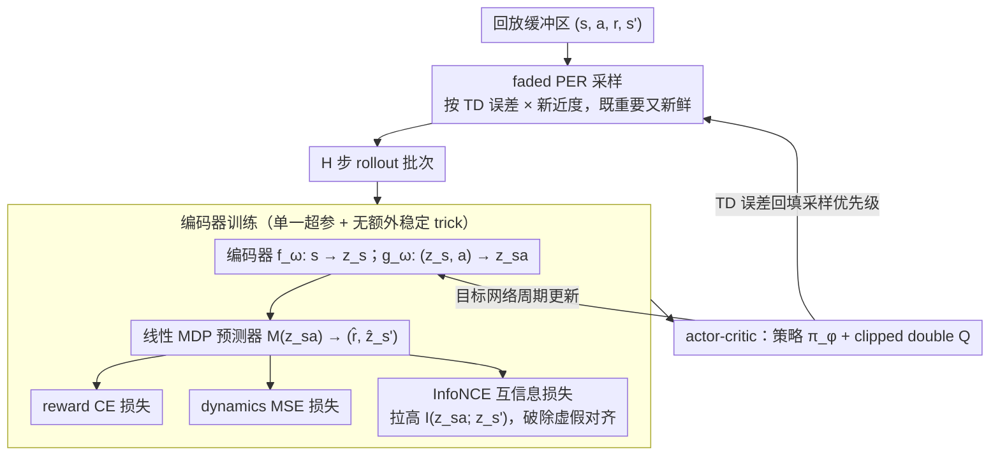

# DR.Q: Debiased Model-based Representations for Sample-efficient Continuous Control

**会议**: ICML 2026  
**arXiv**: [2605.11711](https://arxiv.org/abs/2605.11711)  
**代码**: <https://github.com/dmksjfl/DR.Q>  
**领域**: 强化学习 / off-policy actor-critic / 表示学习  
**关键词**: 模型化表示, 互信息, InfoNCE, faded PER, primacy bias

## 一句话总结
DR.Q 在 MR.Q 类"模型化表示 + actor-critic"骨架上加两件事——用 InfoNCE 显式最大化 $z_{sa}$ 与下一状态表示 $z_{s'}$ 的互信息，再用"PER × forget"融合的 faded prioritized replay 缓解早期经验过拟合——在 73 个连续控制任务上用单一超参组击败 SimBaV2 / MR.Q / TDMPC2 等强基线。

## 研究背景与动机

**领域现状**：为提升 sample efficiency，社区目前主要走两条路——(a) model-free 的 value-overestimation 缓解 / replay reuse / 网络架构改进；(b) 学世界模型做 planning（TDMPC2）或数据增强（MBPO）。最近"model-based representation"是第三条路：用模型化目标训练 state/state-action 编码器，把 latent dynamics 嵌进表示，再送给标准 actor-critic（TD7、MR.Q）。

**现有痛点**：MR.Q 这类方法用 $\min \mathbb E[(z_{sa}-z_{s'})^2]$ 做潜空间一致性，但**最小化欧氏距离并不必然提升互信息**（本文 Theorem 4.1）——可能只是把冗余维度对齐了，关键维度反而被忽视；再加上 uniform sampling / PER 容易陷 primacy bias，让表示过拟合早期经验。

**核心矛盾**：表示学习目标（"几何上靠近 vs 信息上对齐"）和采样策略（"按 TD error 重要 vs 按时间新近"）这两条线先前各自演化，但都引入 bias，最终拖累 actor-critic。

**本文目标**：(1) 把"latent dynamics consistency"从纯几何升级为"几何 + 互信息"，给出对应的 Lemma 论证；(2) 把"重要"与"新鲜"两种 prioritization 信号融合为一个采样概率公式；(3) 在单一超参下覆盖 73 个 task。

**切入角度**：MR.Q 的隐式假设 = MSE 小 ⇒ 互信息大，本文用 Theorem 4.1 反例否决之；同时把 Wang/Kang 的 forget 机制和 Schaul 的 PER 拉到同一个公式里。

**核心 idea**：用 InfoNCE 显式替代 MR.Q 隐含的互信息假设；用 faded PER $P(i)\propto |\delta(i)|^\alpha (1-\epsilon)^i$ 同时压住"老 + 不重要"两种负面信号。

## 方法详解

### 整体框架
沿用 MR.Q 的两阶段：(a) 训 encoder $f_\omega:s\to z_s$、$g_\omega:(z_s,a)\to z_{sa}$、linear MDP predictor $M(z_{sa})\to (\hat r,\hat z_{s'})$；(b) 在 $z_s,z_{sa}$ 上训 deterministic policy $\pi_\phi$ 与 clipped double Q $Q_{\theta_{1,2}}$。Encoder 在长度 $H$ 的展开 rollout 上做 reward CE 损失 + dynamics MSE + InfoNCE 三项；采样改用 faded PER。DR.Q 相对 MR.Q 只动两处——把采样换成 faded PER、给编码器损失加一项 InfoNCE，其余 encoder/predictor/actor-critic 骨架与训练配置保持不变。

### 关键设计

**1. InfoNCE 互信息损失（Equation 8）：把"几何靠近"升级成"信息对齐"**

MR.Q 的隐式假设是"MSE 小 ⇒ 互信息大"，但本文 Theorem 4.1 给出反例——仅最小化 $\|z_{sa}-z_{s'}\|^2$ 完全可能只是把冗余维度对齐了，关键维度反而被忽视。DR.Q 的对策是显式拉高 $z_{sa}$ 与目标网络给出的 $\tilde z_{s'}$ 的互信息：把一个 batch 里 $N$ 个样本互为负样本，按余弦相似度做对比

$$\mathcal L_I=-\frac1N\sum_i\log\frac{\exp(\cos(\hat z_{s'_i},\tilde z_{s'_i})/\tau)}{\sum_k\exp(\cos(\hat z_{s'_i},\tilde z_{s'_k})/\tau)},$$

它等价于互信息下界 $I(\hat Z_{s'};\tilde Z_{s'})\ge \log N - \mathcal L_I$。Lemma 4.2 进一步说明 $I$ 升则条件熵 $H(Z_{s'}|Z_{sa})$ 降，潜空间动力学更确定、value-error 上界更紧（接 DeepMDP / MR.Q 的理论链）。这一项之所以有效，是因为它直接消除了 MR.Q 表示里可能存在的"虚假对齐"，强迫编码器把容量花在任务相关信号上而非冗余维度——这也解释了为什么后面消融里它在高维冗余状态上增益最大。

**2. Faded Prioritized Experience Replay（Equation 4）：让采样既看"重要"又看"新鲜"**

uniform sampling 容易让表示过拟合早期经验（primacy bias），纯 PER 会把策略钉死在早期 high-TD-error transition 上，而纯 forget 机制又会漏掉低频但 informative 的老样本。DR.Q 把"TD-error 重要性"和"时间新近性"两个先验乘进同一个采样概率

$$P(i)=\frac{|\delta(i)|^\alpha (1-\epsilon)^i}{\sum_j |\delta(j)|^\alpha (1-\epsilon)^j},$$

其中 $i=0$ 是最新 transition；实现上用 LAP 改进 PER，并对 forget 权重设下截断 $\epsilon_\mathrm{low}$ 防止有价值的老经验被清零。Theorem 4.3 给出严格性质：TD-error 相同时老样本被采概率严格更小，且总采样次数被常数上界约束。两个信号相乘正好给出"既重要又新鲜"的合成度量——这是一个看似工程小 trick、实际有定理撑腰的设计。

**3. encoder loss 与 actor-critic 的统一配置：靠"好表示 + 好采样"跨 73 任务用同一套超参**

把三项 encoder 损失和 actor-critic 串起来，编码器在长度 $H$ 的展开 rollout 上优化 $\mathcal L^\mathrm{DR.Q}_\mathrm{enc}=\sum_{t=1}^H \lambda_r \mathcal L_\mathrm{reward} + \lambda_d \mathcal L_\mathrm{dynamics} + \lambda_m \mathcal L_I$（reward CE、dynamics MSE、InfoNCE），critic 用 Huber loss + horizon $H_Q$ 的 multi-step return + clipped double Q，actor 加 Gaussian noise + clip 探索，target 网络周期更新。值得注意的是作者刻意不加 normalization / parameter reset / hidden regularization 这些常见稳定 trick——这恰恰是为了证明只靠"好表示 + 好采样"就够用，让方法更简洁、单一超参就能覆盖全部 73 个任务。

### 损失函数 / 训练策略
- Reward loss: 两-hot encoding + symexp 间隔 + CE。
- Dynamics loss: $\mathcal L_\mathrm{dynamics}=\mathbb E[(\hat z_{s'}-\mathrm{SG}(\tilde z_{s'}))^2]$，stop-gradient 防 target 编码器 drift。
- InfoNCE: 上述 Equation 8，温度 $\tau$。
- 总损失三项加权和，权重 $\lambda_r,\lambda_d,\lambda_m$ 全任务统一。
- Replay Ratio (UTD) = 1，比 SimBaV2/FoG 等高 UTD 方法更高效。

## 实验关键数据

### 主实验（73 任务，10 seed，单一超参；汇总自 Figure 1）

| 基准 | 任务数 | 关键对比 | 提升 |
|---|---|---|---|
| MuJoCo | — | DR.Q vs MR.Q / SimBaV2 / TDMPC2 | 匹配或超越 |
| DMC-Hard (7 dog/humanoid) | 7 | DR.Q vs SimBaV2 | +15.5% |
| DMC-Visual | — | DR.Q vs MR.Q | +26.8% |
| HumanoidBench (w/ hand) | 14 | DR.Q vs FoG | +58.9% |
| 全部 73 | 73 | DR.Q 全面追平或胜出 MR.Q | 一致领先 |

DR.Q 是首个在 1M env step 内把 dog-run 任务平均回报推过 700 的算法。

### 消融实验（Figure 4，4 个代表性任务，10 seed）

| 配置 | 现象 | 解释 |
|---|---|---|
| Full DR.Q | 最优 sample efficiency 与 asymptotic | InfoNCE + faded PER 协同 |
| w/o InfoNCE ($\lambda_m=0$) | 高维 HumanoidBench 任务大幅下滑 | 状态空间冗余多时尤需互信息约束 |
| DR.Q (only forget) | 削掉 PER 后曲线塌 | 没了 TD-error 优先级，重要样本被淹没 |
| DR.Q (only LAP) | 削掉 forget 后曲线塌 | 早期经验过拟合，primacy bias 显现 |
| 无 InfoNCE 时 | 至少与 MR.Q 持平 | DR.Q 兜底退化为 MR.Q |

### 关键发现
- InfoNCE 的增益在**高维冗余状态**（如 HumanoidBench 带 dexterous hand）上尤其显著——因为强迫表示编码任务相关信号、抑制冗余维度。
- PER 与 forget 必须**联合**：单独任一一项都比 full 差，证明"重要 × 新鲜"是真实存在的互补 axis。
- 单一超参就能跨 73 任务实属罕见，体现 DR.Q 的鲁棒性，也对 RL 算法 benchmark 文化是一种纠偏（很多 SOTA 是 task-specific tuning 出来的）。

## 亮点与洞察
- **理论 + 实验 + 工程三层闭环**：Theorem 4.1 戳穿 MR.Q 的隐式假设，Lemma 4.2 给互信息 → 条件熵 → value error bound 的链条，最后 InfoNCE 落地，环环相扣。
- Faded PER 的公式形式极简却能同时反映两个先验，且 Theorem 4.3 给出严格的"老样本采样概率严格变小"性质，是少见的"看似工程小 trick、实际有定理"的例子。
- 故意不堆 trick（无 normalization、无 reset、无 hidden reg）反而胜出，提示社区在 RL 上"少即是多"在表示学习导向时仍成立。

## 局限与展望
- Hopper-v4 上反而不如 baseline——unified hyperparameter 的代价；某些 dynamics 简单任务可能被高维表示器拖累。
- visual-humanoid-run 上 DR.Q 与所有方法都失败，限于 1M step 预算；表示器在如此小预算下学不到东西。
- 未在离散动作（Atari）或非 Markovian（POMDP）任务上验证；hard exploration 任务也未碰。
- InfoNCE 引入 batch 内对比，存在 batch-size 与负样本质量的隐性依赖，论文未给出 ablation。

## 相关工作与启发
- **vs MR.Q (Fujimoto et al. 2025)**: 共享骨架，但 MR.Q 仅最小化 MSE，DR.Q 显式加 InfoNCE；MR.Q 用 uniform/PER 采样，DR.Q 用 faded PER。
- **vs TDMPC2 (Hansen et al. 2024)**: TDMPC2 在 latent 中做 planning，DR.Q 只做 actor-critic 学习；后者更轻量但不损失性能。
- **vs SimBaV2 (Lee et al. 2025)**: SimBaV2 走"网络架构 + 高 UTD"路线，DR.Q 用 UTD=1 + 好表示就追平甚至超越，说明"信息密度 > 计算密度"。
- **vs FoG (Kang et al. 2025)**: FoG 的 forget 机制单独使用；DR.Q 与 PER 融合成 faded PER，理论与经验都更稳。

## 评分
- 新颖性: ⭐⭐⭐⭐ 两个组件单看不算新，但用 Theorem 4.1 戳穿先前默认假设并系统融合 PER + forget，是有真贡献的组合创新。
- 实验充分度: ⭐⭐⭐⭐⭐ 73 任务 × 10 seed × 单一超参，HumanoidBench/DMC/MuJoCo 全覆盖，消融分别消去两项，证据非常扎实。
- 写作质量: ⭐⭐⭐⭐ 理论与实验衔接紧凑，公式排版略密；Figure 1/3/4 直观。
- 价值: ⭐⭐⭐⭐ 给"model-based representation"流派一个清晰的升级版本，开源代码 + 单一超参对工业 RL 团队直接可用。

<!-- RELATED:START -->

## 相关论文

- [\[ICLR 2026\] WIMLE: Uncertainty-Aware World Models with IMLE for Sample-Efficient Continuous Control](../../ICLR2026/reinforcement_learning/wimle_uncertainty-aware_world_models_with_imle_for_sample-efficient_continuous_c.md)
- [\[ICLR 2026\] Sample-efficient and Scalable Exploration in Continuous-Time RL](../../ICLR2026/reinforcement_learning/sample-efficient_and_scalable_exploration_in_continuous-time_rl.md)
- [\[ICML 2026\] Dr. Tulu: Reinforcement Learning with Evolving Rubrics for Deep Research](dr_tulu_reinforcement_learning_with_evolving_rubrics_for_deep_research.md)
- [\[ICML 2026\] Laplacian Representations for Decision-Time Planning](laplacian_representations_for_decision-time_planning.md)
- [\[ICML 2026\] From Reward-Free Representations to Preferences: Rethinking Offline Preference-Based Reinforcement Learning](from_reward-free_representations_to_preferences_rethinking_offline_preference-ba.md)

<!-- RELATED:END -->
