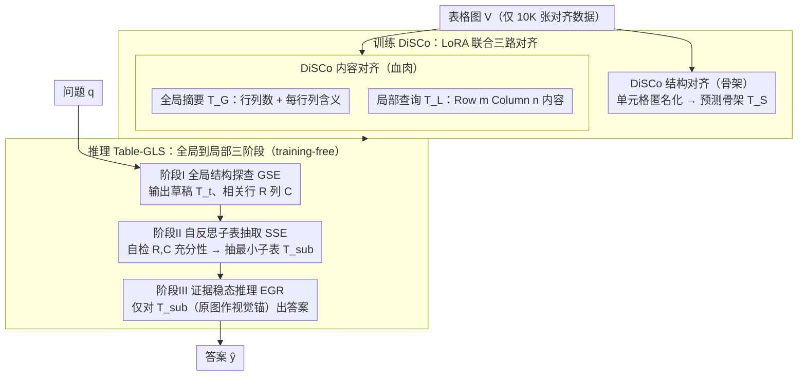

# Decoupling Skeleton and Flesh: Efficient Multimodal Table Reasoning with Disentangled Alignment and Structure-aware Guidance

**会议**: ICML 2026  
**arXiv**: [2602.03491](https://arxiv.org/abs/2602.03491)  
**代码**: https://github.com/AAAndy-Zhu/TableVLM  
**领域**: 多模态VLM / 表格推理 / 表征解耦 / 训练-free 推理  
**关键词**: LVLM, 表格图像理解, 结构-内容解耦, 全局到局部推理, 子表证据  

## 一句话总结
本文为多模态表格推理提出两件套：训练阶段 DiSCo 用结构匿名化把"骨架"和"血肉"两个对齐目标解耦，让 LVLM 只用 10K 表格图就学会布局；推理阶段 Table-GLS 用"全局结构探查 → 自反思子表抽取 → 证据稳态推理"三步把整图问答压缩到最小可验证子表上，整套无需推理数据微调也不调外部工具，在 21 项 benchmark 上超过依赖 82K-97K 标注的 SFT/RL 基线。

## 研究背景与动机

**领域现状**：把 LVLM 适配到表格推理目前主要走两条路——一是大规模 SFT 或 GRPO 强化学习（Table-LLaVA、Table-R1、TURBO），用几十万张表图把 HTML/Markdown/LaTeX 串塞进模型；二是接外部工具（ReFocus），靠视觉编辑器 + 代码控制做多跳推理。

**现有痛点**：SFT 路线需要昂贵的表格推理标注，还会触发灾难性遗忘原本的通用推理能力；外部工具路线在推理时延和系统复杂度上膨胀，且没真正增强模型自身的结构理解。两条路都把表格的**结构（行列布局、表头层级）**和**内容（单元格语义）**耦合在同一条线性化序列里学习，模型被迫同时记忆两种相互纠缠的信号，导致跨布局泛化差且样本效率低。

**核心矛盾**：HTML/Markdown 等序列化表示天然把结构 token（`<tr>`、`|`、表头标签）和内容 token（单元格语义）混编为同一长序列；让模型用同一目标同时学这两种信息，结构信号会被海量内容 token 淹没，反过来内容理解又要依附于尚未学到的结构骨架，形成"先有鸡还是先有蛋"的双向阻碍。

**本文目标**：(1) 用尽量少的对齐数据让 LVLM 学到可泛化的表格结构表征；(2) 在推理时不再做任何额外训练或工具调用就能稳健地回答含密集布局的表格问题。

**切入角度**：作者观察到 LVLM 本身的文本-语义推理能力其实很强，缺的只是"表格结构"这个独立维度。如果能把结构学习和内容学习解耦——结构学习用单元格匿名化的"骨架版"表格、内容学习以全局/局部结构坐标为锚点——就能让模型把原有语义能力"嫁接"到结构骨架上。推理阶段同样模仿这种解耦：先看骨架定位行列，再抽小子表做证据推理。

**核心 idea**：用"骨架-血肉"解耦同时贯穿训练（DiSCo 两路对齐）与推理（Table-GLS 三阶段链），把表格能力做成"插件式"模块而不是端到端硬塞。

## 方法详解

### 整体框架
训练阶段 DiSCo 用 10K 表格图，对同一张图同时构造**结构对齐样本** $(I_S,V)\to T_S$（cell 内容全部替换为占位符 $t_p$ 的匿名化 HTML/Markdown/LaTeX）和**内容对齐样本**——全局形如"$M$ 行 $N$ 列，第 $m$ 列描述 X"的半结构化摘要 $T_G$ 与局部形如"Row $m$ Column $n$: [content]"的单元格语义 $T_L$，三路目标用 LoRA 联合微调。推理阶段 Table-GLS 把单步问答拆成三步：先让 LVLM 看整图给出相关行列索引 $R,C$ 与推理草稿 $T_t$；再让它自检 $R,C$ 是否足够并抽出最小可解释子表 $T_{sub}$；最后只让它对 $T_{sub}$（保留原图作辅助视觉锚）做证据稳态推理输出 $\hat{y}$。整个 pipeline 不需要任何推理专用标注或外部工具，结构能力来自 DiSCo，推理能力来自基础 LVLM 自身。

### 关键设计

**1. DiSCo 结构对齐（骨架）：用单元格匿名化把布局从内容里抽离出来单独学**

HTML/Markdown 把结构 token（`<tr>`、`|`、表头标签）和内容 token（单元格语义）混编成一条长序列，结构信号数量上远少于内容，训练时直接被海量内容 token 淹没。DiSCo 的破法很直接：对常规序列化表 $T$ 做匿名化 $T_S=\texttt{Anonymize}(T,t_p)$，把所有单元格内容替换成统一占位符 $t_p$，训练目标 $\mathcal{L}_{\text{struct}}=-\mathbb{E}\log P_\theta(T_S\mid I_S,V)$ 让模型只能依赖图像里的视觉布局线索（行列分隔线、表头位置）去预测骨架。内容信号被清零后，模型被迫只学布局，结构能力得到独立监督，对没见过的合并单元格、嵌套表头泛化更好——OOD TSD/TCE 涨幅最显著的正是这一项。

**2. DiSCo 内容对齐（血肉）：把单元格语义嫁接到已学到的结构坐标上**

骨架学会之后，要让模型把"行 $m$ 列 $n$"当成坐标系而不是把内容当自由文本流，所以内容对齐分全局/局部两层。全局让模型输出半结构化摘要 $T_G$（行数、列数、每行/每列含义），损失 $\mathcal{L}_{\text{content\_global}}=-\mathbb{E}\log P_\theta(T_G\mid I_G,V)$；局部给定行号 $m$、列号 $n$ 让模型输出 "Row $m$ Column $n$: [content]"，损失 $\mathcal{L}_{\text{content\_local}}=-\mathbb{E}\log P_\theta(T_L\mid I_L,V,m,n)$。传统 HTML 对齐把语义和位置绑死在序列里、没法显式查某个单元格；DiSCo 强制内容必须挂在结构坐标上，既复用了 LVLM 原本就很强的语义能力，又让"查行 $m$ 列 $n$"成为一个原生操作——这恰好是后面 Table-GLS 抽子表所需的最小接口。

**3. Table-GLS 全局到局部三阶段推理：先定位骨架→再抽证据→最后推理，全程不训练不用工具**

直接对整张表图问答，模型容易用全局模式匹配走捷径（关注无关行列也能蒙对）。Table-GLS 把单步问答拆成"找证据 vs 用证据"的可解释链路。阶段 I（Global Structure Exploration）由 prompt $I_{GSE}$ 驱动模型先输出推理草稿 $T_t$、相关行标签 $R$、列标签 $C$，强制它先做 where-to-look 决策而非直接读单元格；阶段 II（Self-refined Sub-table Extraction）由 $I_{SSE}$ 让模型自检 $R,C$ 是否充分必要、必要时修正，再抽出最小可解释子表 $T_{sub}$，这步 plan-before-extract 防止全局阶段的错位扩散；阶段 III（Evidence-grounded Reasoning）只让模型对 $T_{sub}$（原图作辅助视觉锚）生成答案 $\hat{y}=\text{LVLM}(I_{EGR},T_{sub},V,q)$。显式拆分既减少 spurious correlation，又把推理过程留痕方便诊断 OOD 错误；自反思那一步尤其关键——消融显示去掉 SSE 后 AIT-QA 从 76.71 掉到 73.39。

### 损失函数 / 训练策略
DiSCo 总损失 $\mathcal{L}_{\text{DiSCo}}=\mathcal{L}_{\text{struct}}+\mathcal{L}_{\text{content\_global}}+\mathcal{L}_{\text{content\_local}}$，所有 LVLM（Gemma3-12B、Gemma3n-E4B、LLaVA-v1.6-7B、Qwen3-VL-8B/4B/32B）都用 LoRA 微调以保住原推理能力。Table-GLS 完全 training-free，只用 vLLM 在 zero-shot 下跑三阶段 prompt。两个组件设计上正交：DiSCo 加强表征，Table-GLS 加强推理过程，论文实验里二者叠加（Full）在所有任务上都比单用任一一个更强。

## 实验关键数据

### 主实验
21 个表格理解 + 推理 benchmark，对齐预算只用 10K 表格图 vs baseline 的 82K-97K，全部在 zero-shot 下评测：

| 任务簇 | 配置 | 关键指标 | 本文 (Qwen3-VL-8B) | Textual (10K) | Textual-All (97K) |
|--------|------|----------|---------------------|----------------|---------------------|
| 表理解 TSD/TCE/TCL/RCE/MCD | 平均（已见结构） | accuracy | **DiSCo 42.9-93.5** | 41.0-89.6 | 37.7-89.8 |
| OOD 表理解（未见布局） | OOD TSD/TCE/TCL/RCE | accuracy | **DiSCo 65.5-88.4** | 44.8-82.0 | 50.1-86.1 |
| 表推理 8 任务（HiTab/AIT-QA/InfoTabs 等） | Full = DiSCo+Table-GLS | avg | **显著 > GPT-4o-mini & Table-LLaVA-13B** | – | – |

在 Qwen3-VL-32B 上 DiSCo 把 OOD TCL 从 65.91 拉到 74.10、OOD RCE Column 从 84.16 拉到 88.40；在小模型 Gemma3n-E4B 上 OOD TCL 从 9.00→14.32（直接接 textual 反而只到 10.20），说明结构-内容解耦尤其救小模型在 OOD 上的崩塌。

### 消融实验
Qwen3-VL-8B + 四个代表推理任务（Full = DiSCo + Table-GLS）：

| 配置 | HiTab | AIT-QA(O) | InfoTabs | PubHealthTab(O) |
|------|-------|-----------|----------|------------------|
| **Full** | 27.35 | **76.71** | **72.67** | **77.14** |
| − GSE（去全局探查） | 24.30 | 62.82 | 72.09 | 74.92 |
| − SSE（去自反思子表） | **31.41** | 73.39 | 70.20 | 73.94 |
| only Table-GLS（无 DiSCo） | 29.76 | 55.58 | 73.59 | 72.76 |
| CoT | 28.17 | 56.75 | 67.98 | 57.52 |
| DiSCo+CoT | 26.40 | 73.78 | 71.00 | 68.33 |
| RoT (row-of-thought) | 33.88 | 55.58 | 61.26 | 58.29 |
| DiSCo+RoT | 26.27 | 69.08 | 66.98 | 72.14 |

### 关键发现
- **结构解耦是 OOD 关键**：DiSCo 在 OOD 任务上涨幅远大于 in-domain；textual 对齐反而在 OOD TCL 等任务上掉点，说明把结构和内容混编学习会过拟合到训练集的具体布局模式。
- **GSE 是 OOD 救命稻草**：去掉全局结构探查后，OOD 数据集 AIT-QA 从 76.71→62.82，掉了近 14 个点；同模型 in-domain HiTab 反而升到 31.41，说明 GSE 牺牲了部分 in-domain 速度换取强泛化。
- **DiSCo 与 Table-GLS 必须组队**：单独 Table-GLS（无 DiSCo）在 AIT-QA 只有 55.58；单独 DiSCo + CoT/RoT 都比不上 Full，验证训练表征解耦和推理路径解耦两者互补、不可替换。
- **小标注大效果**：只用 10K 表图就超过用 97K 标注的 Textual-All 与 82K SFT 的 Table-LLaVA，说明结构-内容解耦把样本效率提到了一个新档位。

## 亮点与洞察
- **"骨架/血肉"是一对优雅的归纳偏置**：把表格的"是什么布局"和"装了什么"显式分开学，对齐 token 不再相互覆盖；这一思路可以平行迁移到代码（AST 结构 vs 标识符语义）、UI（布局结构 vs 文案）、化学（分子骨架 vs 取代基）等同样结构-内容耦合的多模态域。
- **训练-推理对称的解耦哲学**：DiSCo 在训练侧解耦表征，Table-GLS 在推理侧解耦"找证据 vs 用证据"，二者形成"训练学到了 → 推理用得上"的闭环；这种对称设计避免了常见的"训练阶段过度泛化但推理阶段又被 prompt 拉回单一模式"的问题。
- **plan-before-extract 自反思**：SSE 阶段让模型显式回答"这些行列够不够"是个低成本却显著的工程 trick——在 LVLM agent 框架里值得作为通用模板。

## 局限与展望
- 评估仍主要在静态表格图上，对长文档里嵌入表 + 周边段落联合推理（如完整科学论文 PDF）的场景未覆盖，结构对齐目标也没考虑表-图-文交错的更高阶布局。
- DiSCo 要求能拿到训练表的 HTML/Markdown/LaTeX ground truth 才能构造结构匿名化样本，对纯扫描件或低质量 OCR 的表格无法直接套用。
- Table-GLS 三阶段每问要调 3 次 LVLM，推理时延较直接答升高约 2-3 倍；当问题本身简单（如单单元格查询）时仍走完整 pipeline 略浪费，可以加一个早退分类器。
- 失败时缺乏机制让模型"二次找证据"——SSE 只跑一次，若初始 $R,C$ 偏得太远修正空间有限。

## 相关工作与启发
- **vs Table-LLaVA / TabPedia / SynTab**：这些工作都靠大规模 SFT (82K-97K) 让模型学 HTML/Markdown 序列化表，结构和内容耦合学；DiSCo 用 10K 图 + 三路解耦目标在 in-domain 持平、OOD 大幅领先，且不微调下游推理任务。
- **vs Table-R1 / TURBO / R3V**：这些方法用 GRPO/RL 给推理轨迹加监督，但仍需推理专用奖励信号；Table-GLS 不动模型权重，仅用三段 prompt 就把推理流程显式化，避免 RL 微调带来的能力漂移。
- **vs ReFocus（外部工具）**：ReFocus 用代码做视觉编辑实现多跳；Table-GLS 把"多跳"折叠到自反思子表抽取里，不依赖外部工具栈，部署门槛低。
- **vs 通用 CoT/RoT**：消融显示 DiSCo+CoT/RoT 在多数任务上不如 DiSCo+Table-GLS，证明把推理过程结构化到"全局→局部→证据"链比通用自然语言 CoT 更适合表格这类高度结构化输入。

## 评分
- 新颖性: ⭐⭐⭐⭐ 训练-推理双解耦的设计哲学清晰，单元格匿名化做结构对齐这个 trick 简单但之前没人系统化做。
- 实验充分度: ⭐⭐⭐⭐⭐ 21 个 benchmark + 4 个 backbone（4B/8B/12B/32B）+ in-domain/OOD 双视角 + 完整消融，且开源代码与数据。
- 写作质量: ⭐⭐⭐⭐ 框架图与三阶段公式 (Eq. 5-7) 清楚，章节结构呼应"骨架/血肉"主题；但 Table 1 信息密度过高，初读不易抓主干。
- 价值: ⭐⭐⭐⭐⭐ 把 LVLM 在表格推理上的样本效率压到 10K，且 Table-GLS 推理模板可以零成本嫁接到现有任何 LVLM 上，工业落地友好。

<!-- RELATED:START -->

## 相关论文

- [\[ICLR 2026\] FAPO: Flawed-Aware Policy Optimization for Efficient and Reliable Reasoning](../../ICLR2026/reinforcement_learning/fapo_flawed-aware_policy_optimization_for_efficient_and_reliable_reasoning.md)
- [\[ICLR 2026\] Metis-SPECS: Decoupling Multimodal Learning via Self-distilled Preference-based Cold Start](../../ICLR2026/reinforcement_learning/metis-specs_decoupling_multimodal_learning_via_self-distilled_preference-based_c.md)
- [\[ICLR 2026\] REA-RL: Reflection-Aware Online Reinforcement Learning for Efficient Reasoning](../../ICLR2026/reinforcement_learning/rea-rl_reflection-aware_online_reinforcement_learning_for_efficient_reasoning.md)
- [\[ICML 2026\] D$^2$Evo: Dual Difficulty-Aware Self-Evolution for Data-Efficient Reinforcement Learning](d2evo_dual_difficulty-aware_self-evolution_for_data-efficient_reinforcement_lear.md)
- [\[ICLR 2026\] Reasoning Boosts Opinion Alignment in LLMs](../../ICLR2026/reinforcement_learning/reasoning_boosts_opinion_alignment_in_llms.md)

<!-- RELATED:END -->
