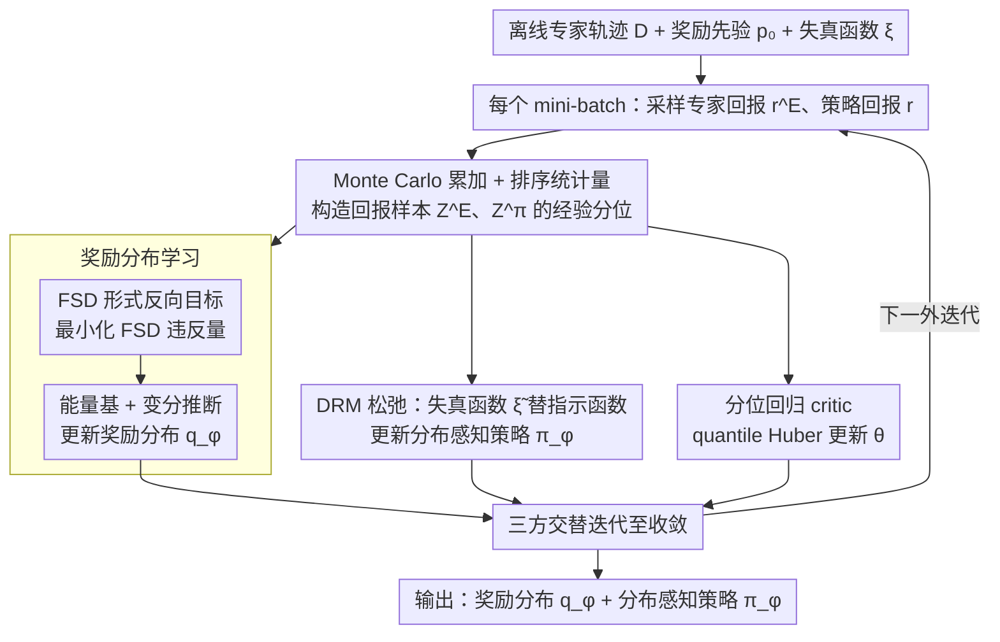

# Distributional Inverse Reinforcement Learning

**会议**: ICML 2026 Oral  
**arXiv**: [2510.03013](https://arxiv.org/abs/2510.03013)  
**代码**: 未公开  
**领域**: 强化学习 / 逆强化学习 / 分布式 RL / 风险敏感模仿  
**关键词**: 离线 IRL, 奖励分布, 一阶随机占优, 失真风险度量, 神经行为建模  

## 一句话总结
本文提出 DistIRL：在离线逆强化学习中把奖励本身建模为条件分布、把"专家比学习者更优"这一约束从期望升级到一阶随机占优 (FSD)，并用失真风险度量 (DRM) 把 FSD 难解的 0/1 指示函数松弛成可优化的风险加权目标，从而首次系统地从离线示范中同时学到完整奖励分布与分布感知策略。

## 研究背景与动机

**领域现状**：经典离线 IRL 沿用 MaxEntIRL/IQ-Learn/ML-IRL 路线，把奖励视为确定函数 $r(s,a)\in\mathbb{R}$，靠匹配占有度或期望回报来恢复参数；Bayesian IRL 进一步引入奖励参数后验，但似然依然由 soft-$Q$ 等期望项驱动。

**现有痛点**：很多现实场景的奖励本身就是随机变量——机器人接触富集任务里同一 $(s,a)$ 的回报方差很大；神经科学里多巴胺信号在相同行为下呈现显著的 trial-to-trial 偏斜抖动。只匹配期望会把两个均值相同、方差/偏度/尾部完全不同的奖励分布判为等价，高阶结构对 IRL 目标"不可见"。

**核心矛盾**：分布匹配（如 Wasserstein 距离）能比较两个分布的相似度，却不蕴含 IRL 必需的"专家优于学习者"序关系；反过来仅看期望的序关系又丢掉了高阶矩。因此需要一个既保留"专家占优"语义又能传播到全分布的目标。

**本文目标**：(1) 离线、无环境交互地恢复**奖励分布** $q_\phi(r\mid s,a)$；(2) 在此基础上学出**分布感知/风险敏感**的策略；(3) 给出收敛速率证明而非仅经验上 work。

**切入角度**：作者注意到 FSD（一阶随机占优）正好把"$X$ 优于 $Y$"从均值层面升级到 CDF 层面——$F_X(z)\le F_Y(z),\forall z$ 不仅蕴含 $\mathbb{E}[X]\ge\mathbb{E}[Y]$，而且对任意单调效用函数都成立。FSD 因此天然适合作为分布版本的"专家优于学习者"约束。

**核心 idea**：把 MaxEntIRL 的期望差替换为 FSD 违反量 $\int [F_{Z^E}(z)-F_{Z^\pi}(z)]_+\,dz$，套上能量基模型 + 变分推断学奖励分布；策略侧把不可观测的 FSD 指示函数 $\mathcal{I}(v)$ 松弛为可计算的失真函数 $\tilde\xi(v)$，恢复成 DRM 形式的风险敏感策略目标。

## 方法详解

### 整体框架
输入是离线专家轨迹 $\mathcal{D}=\{(s_t^E,a_t^E)\}$、奖励先验 $p_0(r)$、所选失真函数 $\xi$（实验默认 CVaR$_{0.05}$）；输出是变分奖励分布 $q_\phi(r\mid s,a)$ 和分布感知策略 $\pi_\varphi(a\mid s)$，外加一个分位回归 critic $\theta$ 估计回报分位。整个 pipeline 三方在每个外迭代里交替更新：从 mini-batch 状态出发分别采样专家动作回报 $r_t^E$ 与策略动作回报 $r_t$、由 Monte Carlo 累加构造回报样本 $Z^E,Z^\pi$、用 FSD 违反量更新 $\phi$、用 DRM 目标更新 $\varphi$、用 quantile Huber 更新 critic $\theta$。

### 关键设计

**1. FSD 形式的反向目标：把"专家优于学习者"从期望升级到全分布**

经典 IRL 只在期望层面约束"专家更优"，于是两个均值相同、方差/偏度不同的奖励分布被判等价，高阶矩对目标不可见。本文改用一阶随机占优（FSD）表达这个约束：定义违反量 $\mathcal{L}_{\text{FSD}}=\int [F_{Z^E}(z)-F_{Z^\pi}(z)]_+\,dz$，再用变量代换转写到分位空间 $\int_0^1 [F_{Z^\pi}^{-1}(v)-F_{Z^E}^{-1}(v)]_+\,dv$，并用 Monte Carlo + 排序统计量 $z_{(k)}$ 近似经验分位 $F_{Z^\pi}^{-1}(k/N)\approx z_{(k)}$，全程不需要显式 CDF。之所以选 FSD 而不是 Wasserstein 这类对称距离，是因为对称距离只能比"像不像"、丢掉了"谁占优"的序关系，而 FSD 既给出可微违反量、又自动蕴含均值占优（推论 4.3），是把 MaxEntIRL 推广到分布级别的最小改动。

**2. 能量基 + 变分推断学奖励分布：给 FSD 配一个完整的 Bayesian 学习接口**

FSD 违反量本身只是个能量函数、没有显式概率模型，没法直接学出"奖励的条件分布"。本文把它解读为对数似然 $p(\mathcal{D}\mid r)\propto\exp(-\mathcal{L}_{\text{FSD}}(\pi,r))$ 构造能量基模型，引入变分后验 $q_\phi$ 并最大化 ELBO，得到 $\mathcal{L}_r(\phi)=\mathbb{E}_{q_\phi}[\mathcal{L}_{\text{FSD}}]+\mathrm{KL}(q_\phi\Vert p_0)$。$q_\phi$ 按场景实例化：神经科学场景用 Azzalini skew-normal（刻画非对称尾部），机器人场景用分位函数，二者都能同时支持高效采样、KL 闭式和可微梯度。这一步把奖励的点估计升级成完整后验，并且天然把 MaxEntIRL 里的凸正则 $\psi(r)$ 与 KL 项对应起来，让"学奖励分布"落进标准变分推断的工具链。

**3. DRM 松弛：把 FSD 策略目标里不可观测的指示函数变成可优化的风险目标**

把 FSD 用到策略侧时会卡在指示函数 $\mathcal{I}(v)=\mathbb{1}\{F_{Z^\pi}^{-1}(v)\ge F_{Z^E}^{-1}(v)\}$ 上——它不可观测、无法直接优化。本文用一个非降失真函数 $\tilde\xi(v)\ge 0$ 替代 $\mathcal{I}(v)$，策略目标退化为 $\mathcal{L}_\pi(\varphi)=\int_0^1 F_{Z^\pi}^{-1}(v)\,d\tilde\xi(v)+\mathcal{H}(\pi_\varphi)$，即一个失真风险度量（DRM）期望加最大熵。这个松弛不是随便取的：命题 4.6 证明"对所有 $\xi$ 都 DRM 占优"等价于 FSD 占优，所以松弛后的最优解仍能回到原 FSD 目标。更妙的是 $\tilde\xi$ 一身两用——它既是让指示函数可解的工程手段，又是控制策略风险偏好的旋钮（取 CVaR$_{0.05}$ 就强调下尾），同时把策略学习自动嵌进分位回归 critic 的现成工具链。

### 损失函数 / 训练策略
外层交替优化：reward 网络以 $\phi_{k+1}\leftarrow\phi_k-\eta^\phi\nabla\mathcal{L}_r(\phi_k)$（Eq. 3）更新，critic 用 quantile Huber 损失 $\mathcal{L}_{QR}$ 做 off-policy evaluation，策略以 $\varphi_{k+1}\leftarrow\varphi_k+\eta^\varphi\nabla\mathcal{L}_\pi(\varphi_k)$ + KKT 形式的 KL 约束 $\min_\pi \mathrm{KL}(\pi\,\Vert\,\tfrac{1}{Z}\exp\{M_\xi(Z^\pi)\})$（Ziebart et al.）更新。理论上选步长 $\eta_k=\eta_0 k^{-1/2}$ 时算法达到 $\mathcal{O}(\varepsilon^{-2})$ 迭代复杂度（定理 5.6）。整个流程纯离线，不需要环境模型或在线 rollout。

## 实验关键数据

### 主实验
在 risk-sensitive D4RL 上构造带稀有惨重惩罚的奖励（HalfCheetah 高速触发 $-70$ 罚分、Walker2D/Hopper 大俯仰角触发 $-30/-50$），用风险规避 DSAC 采 10 条专家轨迹做离线 IRL，5 个随机种子平均：

| 方法 | HalfCheetah | Hopper | Walker2d |
|------|-------------|--------|----------|
| DistIRL (Gauss) | **3469±59** | **886±1** | **1526±148** |
| DistIRL-qrt (分位) | 3294±172 | 747±79 | 1211±182 |
| BC | 2828±281 | 346±1 | 1321±26 |
| ValueDICE | 1259±78 | 260±10 | 798±311 |
| Offline ML-IRL | 826±231 | 192±56 | 240±50 |
| Expert | 3540±44 | 892±3 | 1478±200 |

DistIRL 在三个 risk-sensitive 任务上都拉到接近专家水平，明显甩开 BC 与基于期望匹配的 ValueDICE/ML-IRL；后两者因为各自假设 risk-neutral 奖励或预训练 transition 模型不对齐而严重退化。在 risk-neutral D4RL 上（Table 2）DistIRL 在 Hopper/Walker2d 也是 SOTA，HalfCheetah 仅次于使用额外非专家数据的 ML-IRL，说明框架并非只在分布奖励上 work。

### 消融实验
HalfCheetah + 右偏斜正态奖励 + 风险规避专家，缩放后的归一化得分：

| 配置 | 得分 | 说明 |
|------|------|------|
| **DistIRL (Dis-QR-FSD)** | **1.00±0.02** | 分布奖励 + 分位回归 critic + FSD 损失（完整模型） |
| Dis-TD-FSD | 0.67±0.31 | 用 TD critic 取代 QR，方差大幅升高 |
| Dis-TD-Mean (≈BIRL) | 0.33±0.01 | 有分布奖励但只匹配均值，性能腰斩 |
| Dis-QR-Mean | 0.22±0.02 | 分布奖励 + 均值匹配，同样掉点 |
| Det-TD-Mean (≈ValueDICE) | 0.22±0.00 | 完全无分布信号 |
| Det-QR-Mean (≈RIZE) | 0.00±0.01 | 表现最差 |

### 关键发现
- FSD 损失是性能跃迁的核心：把 Dis-QR-Mean → Dis-QR-FSD 直接从 0.22 拉到 1.00，远比"加上分位 critic"或"只把奖励改成分布"任一单一改动有效。
- BIRL 等价于 Dis-TD-Mean，分数 0.33——验证了 motivation：仅有奖励分布假设而没有分布感知目标，并不能恢复真实方差。
- 小鼠自发行为实验 (§6.2) 中 S-DistIRL（skew-normal 奖励）在多巴胺信号和估计奖励的均值上取得最高 Pearson 相关（约 0.3）且 W-1 距离最低，说明偏斜分布族对神经数据上的非对称尾部至关重要；同样模型在 5×5 gridworld 中能同时恢复两个高奖励状态的均值与右上角的方差 $\sigma^2=1$，而 BIRL 只能复原均值且在左下角伪造出虚假高值。

## 亮点与洞察
- **把 IRL 的"专家占优"语义从均值升级到 FSD**：等价于用整条 CDF 而非一点定义优劣，这一推广配合分位空间的可微近似几乎不增加工程复杂度，却同时解决了奖励高阶矩不可见与策略缺乏风险意识两个长期问题。
- **DRM 松弛的双重作用**：失真函数 $\tilde\xi$ 既是"使 FSD 指示函数变可解"的工程 trick，又是控制策略风险偏好的旋钮（CVaR/Wang/POW…），还借命题 4.6 提供了"对所有 $\xi$ 取交集即恢复 FSD"的理论闭环。
- **可迁移设计**：能量基 + 变分推断的奖励学习骨架与具体分布族解耦，原文给出 skew-normal 与分位函数两种实例化；同思路可用扩散先验、Normalizing Flow 等做 OOD 鲁棒奖励建模，在 RLHF 偏好建模和 RL fine-tuning LLM 上都有自然延伸空间。

## 局限与展望
- 算法本质上仍是 MaxEntIRL 家族，奖励的可辨识性仅在所选先验、变分族与 FSD 归纳偏置下成立，论文也明确不主张能唯一恢复 ground-truth 奖励。
- 失真函数 $\xi$ 当前固定为人工选择（默认 CVaR$_{0.05}$）；当专家真实风险偏好严重偏离所选 DRM 时性能会衰减，未来需要让 $\xi$ 也从示范中学。
- 现有实验里 reward 网络对每个 $(s,a)$ 独立建模，没有刻画状态间奖励分布的相关性；接触富集机器人或多步博弈里这一假设可能过强。

## 相关工作与启发
- **vs MaxEntIRL / IQ-Learn / Offline ML-IRL**：它们都在期望层面定义专家约束，本文把约束推到 CDF 层面后能感知高阶矩，且不再依赖预训练 transition 模型。
- **vs Bayesian IRL (BIRL)**：BIRL 学的是确定奖励参数的后验，似然仍由 soft-$Q$ 驱动；DistIRL 学的是奖励本身的条件分布，似然由 FSD 能量函数定义，因此能区分相同均值不同方差/偏度的奖励。
- **vs 分布式 RL (C51/QR-DQN/IQN)**：那条线在正向 RL 里建模回报分布，奖励已知；DistIRL 反向求解未知奖励分布，并把策略侧的风险偏好显式接到失真函数上。
- **vs Risk-aware Imitation (Singh 2018, Lacotte 2019, Cheng 2023)**：这些工作做风险敏感策略但奖励仍是点估计，本文则同时学奖励分布与风险敏感策略，并且证明对应优化收敛 $\mathcal{O}(\varepsilon^{-2})$。

## 评分
- 新颖性: ⭐⭐⭐⭐⭐ 把 FSD + DRM 引入 IRL 是首个在离线设定下系统学习奖励分布的框架，理论与工程都自洽。
- 实验充分度: ⭐⭐⭐⭐ 覆盖 gridworld、神经科学真实数据、risk-sensitive/risk-neutral D4RL 三类场景，但只比 5 个 baseline、单一 DRM 默认值，外加未公开代码略影响复现。
- 写作质量: ⭐⭐⭐⭐ 数学定义、能量基→变分推断→FSD→DRM 的推导链条清晰，命题 4.6 这种把松弛回收为原问题的处理读起来很舒服。
- 价值: ⭐⭐⭐⭐⭐ 给"奖励本质上随机"的科学和机器人场景提供了实用且可证明的工具，且 FSD/DRM 这套范式可平行迁移到 RLHF、动物行为建模、机器人安全模仿。

<!-- RELATED:START -->

## 相关论文

- [\[NeurIPS 2025\] Convergence Theorems for Entropy-Regularized and Distributional Reinforcement Learning](../../NeurIPS2025/reinforcement_learning/convergence_theorems_for_entropy-regularized_and_distributional_reinforcement_le.md)
- [\[NeurIPS 2025\] Inverse Optimization Latent Variable Models for Learning Costs Applied to Route Problems](../../NeurIPS2025/reinforcement_learning/inverse_optimization_latent_variable_models_for_learning_costs_applied_to_route_.md)
- [\[ICML 2025\] Decoding Rewards in Competitive Games: Inverse Game Theory with Entropy Regularization](../../ICML2025/reinforcement_learning/decoding_rewards_in_competitive_games_inverse_game_theory_with_entropy_regulariz.md)
- [\[ICML 2026\] Safe In-Context Reinforcement Learning](safe_in-context_reinforcement_learning.md)
- [\[ICML 2026\] EchoRL: Reinforcement Learning via Rollout Echoing](echorl_reinforcement_learning_via_rollout_echoing.md)

<!-- RELATED:END -->
