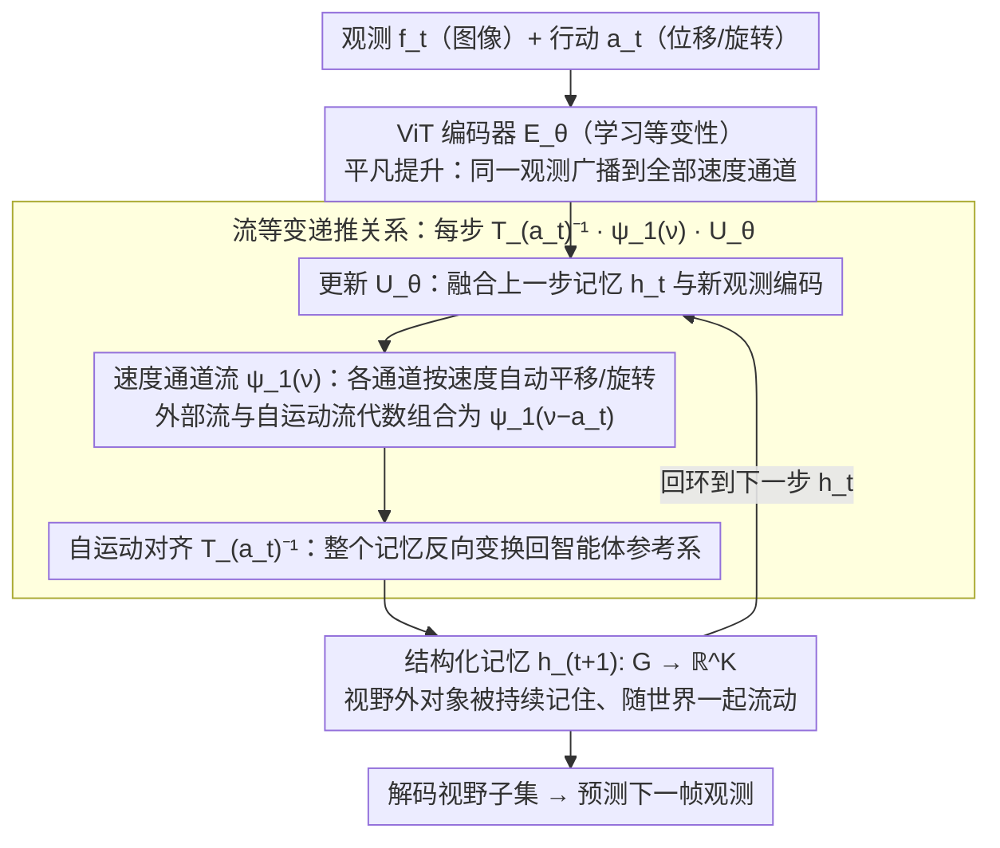

# Flow-Equivariant World Models: Memory for Partially Observed Dynamic Environments

**会议**: ICML 2026  
**arXiv**: [2601.01075](https://arxiv.org/abs/2601.01075)  
**代码**: 待确认  
**领域**: 强化学习 / 世界模型 / 表示学习  
**关键词**: 世界模型, 部分可观测, 流等变, 结构化记忆, 动态环境预测

## 一句话总结
FloWM 通过在隐空间中利用**时间参数化对称性**（流等变）维持结构化动态记忆——解决部分可观测环境下对象越界后失踪的问题，使长视野预测精度远超扩散和循环基线（3D Block World 210 步预测 SSIM 0.9525 vs DFoT 0.8885）。

## 研究背景与动机

**领域现状**：世界模型是具身智能的核心，需要同时预测自身在环境中的运动和外部对象的动态。现有方法主要采用大规模潜在扩散变换器（CogVideoX 风格），能达到逼真的视觉质量，但在部分可观测场景（智能体受限视野）中存在致命弱点。

**现有痛点**：
- **滑动窗口信息丢失**：自注意力窗口必须丢弃超出范围的历史信息，当智能体转身返回原视角时，越界的对象已从上下文消失，模型无法追踪。
- **视角依赖的记忆无法处理动态**：现有记忆增强方法（WORLDMEM 等）存储的是特定视角的观测，无法在外部对象运动时保持一致性。
- **长视野预测失败**：扩散强制方案预测到某个深度后开始产生幻觉（凭空生成对象、遗忘已有对象）。

**核心矛盾**：世界具有时间结构（自身运动 + 外部对象运动），但现有模型忽视这种结构，而是用通用注意力机制暴力编码——导致无法区分"对象暂时不可见"和"对象不存在"。

**本文目标**：（1）建立理论框架用流等变形式化结构化动态记忆；（2）设计可扩展的实现方案支持 2D/3D 部分可观测环境；（3）在长视野预测和下游规划任务中验证优势。

**切入角度**：借鉴群论中的等变性思想——如果数据生成过程尊重群对称性，那么在模型中融入该对称性可显著提升泛化能力（已在分子动力学中验证泛化能力可提升 1000 倍）。本文创新点是将**静态群等变扩展到时间参数化流**，从而自然产生结构化记忆。

**核心 idea**：在隐空间中维持一个"速度通道"堆栈——每个通道对应不同的运动流（如速度向量）；每步更新时先根据智能体行动变换整个隐状态（实现自运动等变），再融合新观测（实现外部运动等变），使记忆自动对齐世界结构。

## 方法详解

### 整体框架
FloWM 的核心是**一条每步递推**，把"看不见"和"不存在"在隐空间里彻底分开。拿到当前观测 $f_t$ 和行动 $a_t$ 后：先用 ViT 编码器把观测编码、并通过**平凡提升**广播到一组"速度通道"上；再用更新算子 $U_\theta$ 融合上一步的结构化记忆；接着让每个速度通道按其运动流 $\psi_1(\nu)$ 自动平移/旋转（外部对象运动）；最后用智能体行动导出的逆变换 $T_{a_t}^{-1}$ 把整个记忆对齐回当前参考系（自身运动）。如此得到的隐状态 $h_t: G \to \mathbb{R}^K$ 是一份覆盖**整个世界坐标空间** $G$（而非仅当前视野）的结构化动态记忆——视野外的对象被持续记住、并随世界一起流动；预测时只解码记忆中对应当前视野的子集。

这套方案分三层递进落地：先建立**通用流等变框架**（把静态群等变扩展到时间参数化流，推导全局流等变约束），再为 **2D/3D 任务**实例化具体网络，最后用流变换维持**超出视野的对象**（部分可观测补丁）。

**输入**：观测序列 $\{f_t\}$（图像）+ 行动序列 $\{a_t\}$（位移/旋转）  
**隐状态**：结构化记忆 $h_t: G \to \mathbb{R}^K$，$G$ 是世界坐标空间  
**输出**：预测观测 $\hat{f}_{t+1}$（从隐空间的视野子集解码）

### 关键设计

**1. 流等变递推关系：让记忆随世界动态和自身运动一起变换，从而把"看不见"和"不存在"分开**

现有滑动窗口和视角依赖记忆的根子问题，是无法区分"对象暂时移出视野"和"对象消失"——一旦越界，self-attention 窗口只能把它丢掉。作者的核心机制是一条递推公式 $h_{t+1}(\nu) = T_{a_t}^{-1} \psi_1(\nu) \cdot U_\theta[h_t(\nu); E_\theta[f_t, h_t](\nu)]$：隐状态是一组"速度通道"的堆栈，$\psi_1(\nu)$ 是速度通道 $\nu$ 对应的单步流变换（平移/旋转），$T_{a_t}$ 是智能体行动导出的变换。每步先按各通道的运动速度让记忆自动流动、融合新观测，再用 $T_{a_t}^{-1}$ 把整个记忆反向变换回智能体参考系做对齐。这样视野外的对象不仅被记住，其轨迹还和视野内对象用同一套规则更新。和把记忆交给无结构 self-attention 相比，显式建模时间对称性大幅压低了学习复杂度——实验里收敛速度快 100+ 倍。

**2. 速度通道与平凡提升：用代数组合代替对外部对象的显式速度预测**

如果让模型显式预测每个外部对象的运动速度，既脆弱又难扩展到没见过的动态。作者改成让编码器对所有速度通道做"平凡提升"$E_\theta[f_t; h_t](\nu) = E_\theta[f_t; h_t](\nu')$，把同一份观测广播到全部通道；更新时外部对象流 $\psi_1(\nu)$ 和自身行动流 $\psi_1(-a_t)$ 在代数层直接组合成 $\psi_1(\nu - a_t)$，速度通道随之自动排列。于是模型学到的是一套隐式速度表示，而不是去回归具体速度值。参数在通道间共享，既压低了隐层维度，又因为运动模态（自身 vs 外部动态）被分离而互不干扰，对未见过的动态更鲁棒。

**3. ViT 编码器的学习等变性：用"弱约束 + 强诱导"换取表达力和可扩展性**

在 2D/3D 扩展里强制编码器精确等变需要做 3D 反投影，代价高昂。作者干脆不在编码器上加显式等变约束，而是让外层的递推关系 $T_{a_t}^{-1}\psi_1(\nu)$ 在每一步"鼓励"编码器自己学出等变——把第一人称视图映射到抽象俯视图的同时保持几何一致。这个妥协靠探针网络实验验证站得住：训练后等变误差从 6.96 降到 0.22，能以 96% 准确率从隐空间恢复对象位置，远超基线的 2.36。也就是说，用前馈近似代替精确约束没有损失性能，反而换来了更强的编码器表达力和向 3D 的可扩展性。

## 实验关键数据

### 主实验：2D MNIST World（部分可观测）

| 模型 | 20 步 MSE | 150 步 MSE | 20 步 PSNR | 150 步 PSNR | 150 步 SSIM |
|------|--------|---------|----------|-----------|----------|
| **FloWM (完整)** | 0.0005 | **0.0018** | 32.99 | **27.56** | **0.9813** |
| FloWM (无 VC) | 0.0041 | 0.0334 | 23.83 | 14.77 | 0.7729 |
| FloWM (无 SME) | 0.1234 | 0.1317 | 9.088 | 8.805 | 0.0127 |
| DFoT 基线 | 0.1448 | 0.2111 | 8.394 | 6.755 | 0.2434 |
| DFoT-SSM | 0.1277 | 0.1688 | 8.940 | 7.726 | 0.3146 |

完整 FloWM 在 150 步（超训练长度 7.5 倍）仍保持 PSNR 27.56，基线在 20 步就崩溃；学习曲线显示 FloWM 收敛速度快 100 倍。

### 3D Block World（刚体动力学 + 部分可观测）

| 模型 | 70 步 MSE | 210 步 MSE | 70 步 SSIM | 210 步 SSIM | 规划成功率 |
|------|--------|----------|----------|-----------|----------|
| **FloWM (完整)** | 0.000603 | **0.001539** | 0.9673 | **0.9525** | **0.727** |
| FloWM (无 VC) | 0.007615 | 0.009614 | 0.9045 | 0.8935 | — |
| FloWM (无 SME) | 0.009579 | 0.012625 | 0.8782 | 0.8631 | — |
| DFoT | 0.011759 | 0.021684 | 0.9377 | 0.8885 | 5.571 |
| DreamerV3 RSSM | 0.016360 | 0.016470 | 0.8799 | 0.8782 | 6.449 |

在 210 步预测（超训练长度 3 倍）上 FloWM SSIM 达 0.9525，所有基线均降至 0.8-0.89；基线出现严重幻觉——凭空生成对象、忘记已有对象、模糊叠加，而 FloWM 保持清晰；下游规划任务（"寻找红块"）FloWM 平均距离 0.727，基线达 5-6。

### 关键发现
- 通过探针网络解码隐空间中对象位置，FloWM 恢复 96% 准确率，DFoT / DFoT-SSM 都低于 1%。
- 等变误差训练后从 6.96 → 0.22（↓96%），验证了学习等变性的有效性。
- 去掉速度通道（无 VC）或自运动等变性（无 SME），性能直线下跌——两个模块都必不可少。

## 亮点与洞察
- **理论框架的优雅性**：用 Lie 群 / 代数统一处理时间对称性，推导出"流等变"概念后自然导出结构化记忆的递推公式，避免了 ad-hoc 的记忆机制；具有强可扩展性——新加一个对称性只需扩展速度通道集合，无需重新设计网络。
- **部分可观测问题的根本洞察**：指出现有方法的失败源于"混淆不可见与不存在"，而流等变强制模型区分这两者；解释了为什么 self-attention 的通用性在这里反而是弱点。
- **学习等变性的务实方案**：不强制精确等变约束（在 3D 反投影场景下代价巨大），而是依赖递推关系诱导，证明模型会自动学会等变表示；这种"弱约束 + 强诱导"的设计哲学可迁移到其他需要几何结构的任务。
- **可迁移的技巧**：速度通道的平凡提升思想可用于其他多模态问题；用探针网络验证隐空间是否学到预期结构。

## 局限与展望
- 实验仅在控制环境（离散动作、已知参数化）中验证，未涉及真实自驾 / 机器人数据集。
- 隐空间映射假设为固定大小，长时间交互下可能超出容量。
- 仅支持刚体运动，对变形 / 软体无法处理。
- 编码器设计的脆弱性：虽然实验证明学习等变性有效，但该过程隐式且缺乏理论保证，大规模应用时可能有失败案例。
- 改进方向：扩展到连续速度族；自适应隐空间大小；结合视觉编码的显式深度预测强化等变约束的可靠性。

## 相关工作与启发
- **vs DreamerV3**：用循环隐状态预测动态但无空间结构，部分可观测环境下会混淆视角移动与世界变化；FloWM 显式解耦两者，长视界性能领先 10 倍。
- **vs 扩散强制（DFoT）**：用固定长度滑动窗口 + diffusion，无显式记忆机制，150 步后完全失效（幻觉）；FloWM 仍精准。
- **vs WORLDMEM / 内存银行方案**：存储历史观测帧，检索时仍依赖 self-attention 融合无法处理动态；FloWM 用流变换主动更新内存位置，天然适配动态。
- **vs 神经映射 / EgoMap**：早期工作已有"结构化映射"思想，但未参数化为流、无正式等变理论、不支持预测；FloWM 可视为该思想的现代化形式化与泛化。

## 评分
- 新颖性: ⭐⭐⭐⭐⭐  首次将流等变理论系统引入世界模型，形式化部分可观测下的对称性，理论框架全新且优雅。
- 实验充分度: ⭐⭐⭐⭐  2D/3D 基准齐全，消融深入；基准环境过于简洁（无噪声 / 遮挡 / 随机性），难以评估真实泛化能力。
- 写作质量: ⭐⭐⭐⭐⭐  脉络清晰，数学严谨但不晦涩，图示直观。
- 价值: ⭐⭐⭐⭐⭐  对世界模型 / 部分可观测问题的洞察深刻；方法论可推广到其他需要结构化表示的任务（SLAM、导航）。

<!-- RELATED:START -->

## 相关论文

- [\[ICML 2025\] PIGDreamer: Privileged Information Guided World Models for Safe Partially Observable RL](../../ICML2025/reinforcement_learning/pigdreamer_privileged_information_guided_world_models_for_safe_partially_observa.md)
- [\[ICML 2026\] Parameter-free Dynamic Regret: Time-varying Movement Costs, Delayed Feedback, and Memory](parameter-free_dynamic_regret_time-varying_movement_costs_delayed_feedback_and_m.md)
- [\[CVPR 2026\] GeoWorld: Geometric World Models](../../CVPR2026/reinforcement_learning/geoworld_geometric_world_models.md)
- [\[ICML 2026\] Perceptual Flow Network for Visually Grounded Reasoning](perceptual_flow_network_for_visually_grounded_reasoning.md)
- [\[ICLR 2026\] InFOM: Intention-Conditioned Flow Occupancy Models](../../ICLR2026/reinforcement_learning/infom_intention_flow_occupancy.md)

<!-- RELATED:END -->
