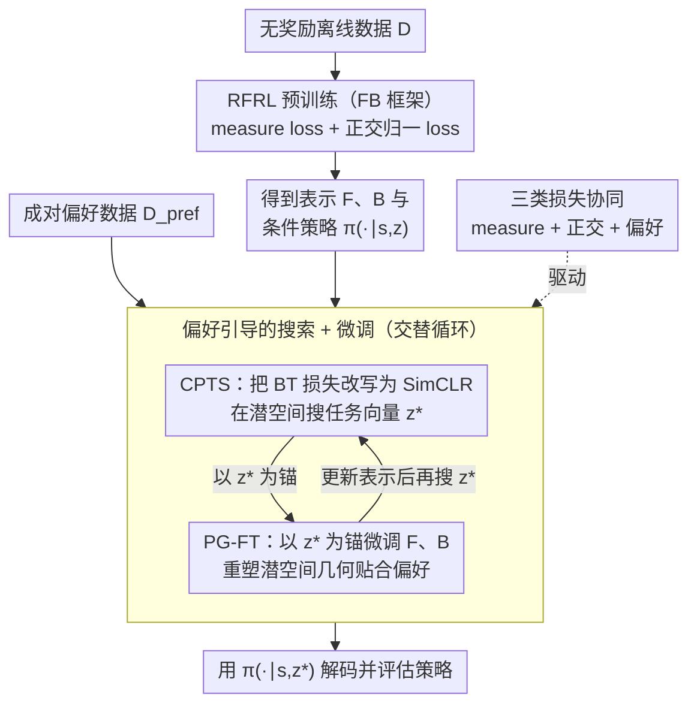

# From Reward-Free Representations to Preferences: Rethinking Offline Preference-Based Reinforcement Learning

**会议**: ICML 2026  
**arXiv**: [2606.01123](https://arxiv.org/abs/2606.01123)  
**代码**: https://github.com/rl-bandits-lab/FB-PbRL (有)  
**领域**: 强化学习 / 偏好学习  
**关键词**: PbRL、Forward-Backward表示、对比学习、零样本RL、Successor Measure

## 一句话总结
本文把离线偏好强化学习 (PbRL) 改写在 Forward-Backward (FB) 表示空间里，证明在 FB 框架下标准的 Bradley-Terry 偏好损失等价于 SimCLR 对比损失，从而提出 FB-PbRL：先在无奖励离线数据上预训练 FB 表示，再在偏好数据上用对比目标搜索任务向量 $\boldsymbol{z}^\star$ 并微调表示，整个流程不再训练任何显式奖励或偏好模型。

## 研究背景与动机
**领域现状**：离线 PbRL 的标准做法是两阶段：先用 BT 模型从成对偏好数据 $(\sigma^{(1)},\sigma^{(2)},y)$ 学一个 reward model $r_{\boldsymbol{\psi}}$（最小化 $\mathcal{L}(\boldsymbol{\psi})=-\mathbb{E}[\mathbb{I}(y=1)\log P_{\boldsymbol{\psi}}(\sigma^{(1)}\succ\sigma^{(2)})+\ldots]$），再用现成的离线 RL 算法在 $r_{\boldsymbol{\psi}}$ 标注的全数据集上学策略；或者跳过奖励直接学 preference model。

**现有痛点**：人类偏好极昂贵——典型预算只有几千对，导致两条路都不好走。学奖励容易 reward over-optimization 和泛化差（Fig.2 显示 BT 学出来的奖励都缩到中段、与真值分布不符），直接学 preference model 又欠拟合精度低。在低质量 ExORL 数据集上这两类方法基本学不到东西。

**核心矛盾**：PbRL 在监督稀缺时无论"先学奖励"还是"直接学偏好"都过拟合；而 reward-free representation learning (RFRL) 系列（FB / Laplacian / HILP / PSM）能在无奖励数据上学非常通用的表示，零样本对任何 reward function 给出近似最优策略——但 RFRL 需要 test-time 给出真奖励 $r(s,a)$ 来组装任务向量 $\boldsymbol{z}_r=\mathbb{E}[\mathbf{B}_\omega(s,a)r(s,a)]$，而 PbRL 场景下没有奖励，只有偏好。

**本文目标**：在没有奖励监督的情况下，如何把 RFRL 的表示用起来做 PbRL？分解为两个子问题——(a) 怎么从偏好数据直接推出任务向量 $\boldsymbol{z}$？(b) 预训练得到的表示不知道下游任务，怎么把它适配到具体偏好任务上？

**切入角度**：作者发现在 FB 框架下若假设奖励对 backward 表示线性可表示 $r_{\boldsymbol{\psi}}(s,a)=\mathbf{B}_{\bar\omega}(s,a)^\top\boldsymbol{\psi}$、且 backward 表示正交归一 $\mathbf{H}_\mathbf{B}\approx\mathbf{I}_d$（FB 预训练本来就强加），那么 BT 偏好损失可以解析地重写成对 $\boldsymbol{z}$ 的 SimCLR 形式，相当于把"学奖励"换成"在 FB 潜空间里做对比检索"。

**核心 idea**：不学奖励、不学偏好模型，而是在冻结的 FB backward 表示上把偏好优化转成对比学习——再加一步 fine-tuning 让预训练的 FB 几何"贴合"具体偏好任务，从而摆脱 reward over-optimization。

## 方法详解

### 整体框架
FB-PbRL 由两阶段组成，输入是无奖励离线数据 $\mathcal{D}$ 和成对偏好数据 $\mathcal{D}_{\text{pref}}$：

1. **RFRL 预训练**：用 FB 框架（Touati & Ollivier 2021/2023）把 successor measure 分解成 $\mathcal{M}^{\pi_r^*}(s,a,\{(s',a')\})=\mathbf{F}_\theta(s,a,\boldsymbol{z}_r)^\top\mathbf{B}_\omega(s',a')$，只在 $\mathcal{D}$ 上用 measure loss + orthonormality loss 学 $\mathbf{F},\mathbf{B}$ 以及条件策略 $\pi(\cdot\mid s,\boldsymbol{z})$（这一步完全无监督）。
2. **Preference-guided search + fine-tune**：交替做两件事——(i) 用对比偏好损失搜索锚向量 $\boldsymbol{z}^\star$ (CPTS)，(ii) 把 $\boldsymbol{z}^\star$ 作为锚反向微调 $\mathbf{F},\mathbf{B}$ 让潜空间几何更贴合偏好结构 (PG-FT)。最终用 $\pi(\cdot\mid s,\boldsymbol{z}^\star)$ 评估。

整个流程从不显式构造奖励，$\boldsymbol{z}^\star$ 是低维向量（典型 $d\sim$ 几百），优化代价远小于训练高容量奖励/偏好模型。

### 关键设计

**1. CPTS：把 BT 偏好损失解析地改写成 FB 潜空间里的 SimCLR，搜任务向量而非学奖励**

直接学奖励在稀缺反馈下会 over-optimization（Fig.2 显示 BT 学出的奖励全塌到中段、和真值分布不符），是 PbRL 的主要病根。作者的关键洞察是：在 FB 框架本来就有的两个约束——奖励对 backward 表示线性可表示 $r_{\boldsymbol{\psi}}(s,a)=\mathbf{B}_{\bar\omega}(s,a)^\top\boldsymbol{\psi}$、backward 表示正交归一 $\mathbf{H}_\mathbf{B}=\mathbf{I}_d$——下，BT 偏好损失能解析地重写成对比损失。把段落潜表示定义为 $\mathbf{B}_{\bar\omega}(\sigma):=\tfrac{1}{k}\sum_i \mathbf{B}_{\bar\omega}(s_i,a_i)$，记 $\boldsymbol{z}_\sigma^+,\boldsymbol{z}_\sigma^-$ 为偏好对正负段的潜码，由 $\boldsymbol{\psi}=\mathbf{H}_\mathbf{B}^{-1}\boldsymbol{z}_{\boldsymbol{\psi}}$ 代入 BT 损失即得

$$\mathcal{L}_{\text{pref}}(\boldsymbol{z};\bar\omega)=-\mathbb{E}\Big[\log\frac{\exp(\boldsymbol{z}^\top\boldsymbol{z}_\sigma^+)}{\exp(\boldsymbol{z}^\top\boldsymbol{z}_\sigma^+)+\exp(\boldsymbol{z}^\top\boldsymbol{z}_\sigma^-)}\Big],$$

正是 SimCLR 对比形式。于是 CPTS 直接在冻结的 FB 表示上搜 $\boldsymbol{z}_{\text{CPTS}}^\star=\arg\min_{\boldsymbol{z}}\mathcal{L}_{\text{pref}}$——这是个低维凸目标的 minimizer，既避开了高容量奖励网络的过拟合，又能给出"近最优控制取决于偏好覆盖度和估计误差"的形式化保证。

**2. PG-FT：以当前 $\boldsymbol{z}^\star$ 为锚反向微调 FB 潜空间，让通用表示专门化到具体偏好任务**

预训练时 $\boldsymbol{z}\sim\mathcal{N}(0,I_d)$ 是任务无关先验，CPTS 搜出来的 $\boldsymbol{z}_{\text{CPTS}}^\star$ 往往离偏好数据诱导的 $\boldsymbol{z}_\sigma$ 簇很远（Fig.3(a) 的视觉证据），通用 RFRL 表示"什么任务都能凑合用"但对单一偏好任务的方向不够锐利。PG-FT 不再把 FB 当冻结量，而是交替更新：一步用 $\nabla_{\boldsymbol{z}}\mathcal{L}_{\text{pref}}(\boldsymbol{z};\omega)$ 更新 $\boldsymbol{z}^\star$，一步以 $\boldsymbol{z}^\star$ 为锚用 $\mathcal{L}_m(\theta,\omega;\boldsymbol{z}^\star)+\lambda\mathcal{L}_{\text{ortho}}(\omega)+\alpha\mathcal{L}_{\text{pref}}(\omega;\boldsymbol{z}^\star)$ 微调 $\mathbf{F}_\theta,\mathbf{B}_\omega$。偏好信号在这里当任务指令书，把潜空间几何重塑成 reward-aligned（Fig.3(b) 里 $\boldsymbol{z}_\sigma$ 按真实回报渐变着色），同时把 $\boldsymbol{z}^\star$ 拉回 in-distribution 区域，让 policy $\pi(\cdot\mid s,\boldsymbol{z}^\star)$ 能更准地解码任务。

**3. 三类损失协同的交替训练目标：既保住 FB 几何约束又加入偏好对齐**

fine-tuning 的风险是把通用表示冲坏，所以要让"表示是否还满足 FB 几何"和"表示是否对齐偏好"两类信号互相约束。measure loss $\mathcal{L}_m$ 是 successor measure 的 Bellman 残差，保证 $\mathbf{F},\mathbf{B}$ 还在正确分解 successor measure；orthonormality loss $\mathcal{L}_{\text{ortho}}(\omega)=\|\mathbb{E}[\mathbf{B}_\omega(s,a)\mathbf{B}_\omega(s,a)^\top]-\mathbf{I}_d\|_F^2$ 保住 $\mathbf{H}_\mathbf{B}\approx\mathbf{I}_d$，而这正是设计 1 那条 SimCLR 等价性成立的前提；偏好损失 $\mathcal{L}_{\text{pref}}$ 则既驱动 $\boldsymbol{z}^\star$ 搜索也驱动 $\mathbf{B}_\omega$ 微调。算法循环就是：采 transitions 更新 measure + ortho，采 preferences 更新 $\mathbf{B}_\omega$ 与 $\boldsymbol{z}^\star$，最后用 $\mathbf{F},\mathbf{B},\boldsymbol{z}^\star$ 同步更新 policy——不引入任何新模块，靠三类损失的相互牵制完成偏好对齐。

### 损失函数 / 训练策略
- 总损失：$\mathcal{L}_m(\theta,\omega;\boldsymbol{z}^\star)+\lambda\mathcal{L}_{\text{ortho}}(\omega)+\alpha\mathcal{L}_{\text{pref}}(\boldsymbol{z}^\star,\omega)$，默认 $\alpha=100$。
- 协议：标准 PbRL Protocol 用 2000 对偏好；Zero-Shot RL Protocol 用 400 段轨迹（10k transitions）抽出的偏好，便于和 RFRL 基线公平对比。

## 实验关键数据

### 主实验
DMC 16 个任务（Cheetah/Walker/Quadruped/Pointmass，每域 4 任务），数据集用 ExORL 的 RND unsupervised 数据（低质量、无奖励监督）。Ours-T = CPTS only，Ours-FT = 完整 FB-PbRL。

**vs offline PbRL baselines（PbRL Protocol，按域平均回报）**：

| 域 | DPPO | OPPO | OPRL | CLARIFY | LIRE | Ours-T | Ours-FT |
|---|---|---|---|---|---|---|---|
| Cheetah | 202.3 | 200.9 | 276.4 | 271.5 | 313.4 | 344.7 | **621.7** |
| Walker | 242.3 | 247.5 | 253.8 | 248.9 | 232.5 | 533.4 | **762.9** |
| Quadruped | 309.1 | 569.3 | 631.1 | 602.9 | 378.7 | 663.4 | **846.9** |
| Pointmass | 16.3 | 24.1 | 337.5 | 317.8 | 102.3 | 69.1 | **570.8** |

Ours-FT 在 16 个任务里几乎全是最佳，连仅做 test-time 搜索的 Ours-T 都已超越所有 PbRL baseline，说明低质量数据上 BT-based 方法整体失效，而 FB 表示天然抗 distribution shift。

**vs Zero-Shot RFRL baselines（Zero-Shot Protocol，按域平均回报；Ours 仅用偏好）**：

| 域 | Laplace | FB | HILP | PSM | RLDP | Ours-FT |
|---|---|---|---|---|---|---|
| Cheetah | 316.5 | 385.6 | 193.5 | 626.0 | 609.6 | **645.4** |
| Walker | 136.7 | **719.9** | 348.1 | 689.1 | 621.6 | 699.4 |
| Quadruped | 601.2 | 561.7 | 289.8 | 618.7 | 612.8 | **826.3** |

只用偏好数据的 Ours-FT 仍能赢过用真奖励的 RFRL 基线（Quadruped 平均超 200+），Walker 与最强基线持平。

### 消融实验
| 配置 | Cheetah | Walker | Quadruped | 说明 |
|---|---|---|---|---|
| FB-BT-FT (集成 BT 奖励 + FB 微调) | 536.6 | 600.6 | 714.1 | 把对比换成"学奖励再 fine-tune"，全面落后 |
| Ours-FT (对比 fine-tune) | **621.7** | **794.5** | **846.9** | 完整方法 |

另外 Fig.5：(a) 偏好从 2000 降到 200 对仅掉约 10%，跨预算稳定优于最强 RFRL/PbRL baseline；(b) 噪声 $\delta=0.2$ 翻转下仍优于所有基线；(c) 偏好系数 $\alpha$ 在很宽范围内稳定，默认 $\alpha=100$ 最优。Table 3 真实人类标注的 Adroit Pen-cloned + MetaWorld Button-Press 上 Ours-FT 拿到 89.0 / 71.2，均超过 LiRE 和 DPPO。

### 关键发现
- **对比 fine-tune > 奖励 fine-tune**：FB-BT-FT 比 Ours-FT 全面差 80+ 分，证实"把偏好直接当对比信号"比"先学 BT 奖励再微调"更有效，对比损失没有 reward over-optimization 的塌陷模式。
- **CPTS only 已经很强**：不做 fine-tune 的 Ours-T 在 DMC 上就已经压过所有 PbRL baseline，说明 RFRL 预训练给出的表示天然就比传统两阶段 PbRL 更适合稀缺监督。
- **样本效率**：200 对偏好对就达到几乎跟 2000 对相当的性能，对昂贵的人类标注极友好；wall-clock 上 1 小时 fine-tune 即超过最强 baseline，per-step 略贵但收敛更快。
- **Pointmass-Bottom-Right 是失败案例**：RND 数据集覆盖严重不均加上 10k transitions 提供的偏好信号稀疏，FB-PbRL 在这一目标上方差大、表现差。

## 亮点与洞察
- **"偏好损失 = 对比损失"是个漂亮的解析等价**：BT 偏好损失原本被视为序列层级的概率模型，本文揭示在线性奖励 + 正交 backward 这两个 FB 本来就有的约束下它就是 SimCLR 形式——这种"已有模型 + 已有损失"的代数等价让看似不相关的两条线（PbRL 与 RFRL）瞬间打通，是值得迁移到其它 representation learning 场景的思路（例如把 RLHF 的偏好损失也写成对比形式）。
- **"搜索 + 微调"双阶段**：CPTS 用低维凸搜索做粗对齐，PG-FT 用高维表示微调做精对齐，分摊了"通用 RFRL 表示不一定贴合具体任务"的风险；这种"先在低维空间搜锚、再用锚反向调表示"的范式可以套到多任务 transfer learning 上。
- **绕开 reward over-optimization 的工程意义大**：RLHF 实践里 reward hacking 是反复出现的噩梦，本文给出一条"根本不需要训练 reward model"的可行路径，对 LLM 对齐也有借鉴价值——下一步自然是 FB-PbRL 应用到语言模型偏好对齐。

## 局限与展望
- 等价性依赖 FB 框架特有的两个结构假设（线性奖励 + $\mathbf{H}_\mathbf{B}=\mathbf{I}_d$），换其它 RFRL 架构（HILP、PSM）就不一定推得出来，迁移性受限。
- 预训练阶段成本不便宜：虽然 fine-tune 1 小时就超过 baseline，但 FB 预训练本身需要大量无奖励数据 + 大量算力，作者只在附录摊销，工业落地需要考虑场景是否值得。
- Pointmass-Bottom-Right 暴露了"覆盖不足 + 偏好稀疏"复合场景的脆弱性，方向上可以结合 active query selection（OPRL/CLARIFY）补强稀疏区域的偏好采样。
- 真实人类偏好数据上 Pen-human 仍微弱落后 DPPO，说明在偏好质量参差时 FB 预训练用的 offline 数据需要再丰富。

## 相关工作与启发
- **vs DPPO / OPPO (no reward model PbRL)**: 他们用 contrastive learning 但直接对 trajectory embedding 操作，没有预训练的 RFRL 表示作支撑；FB-PbRL 把对比目标放在 successor-measure decomposition 的潜空间上，理论与实证都更强（DPPO 在 DMC RND 上几乎学不到东西，FB-PbRL 拉开 3-5×）。
- **vs OPRL / CLARIFY (active PbRL)**: 靠 active query 提升标签效率，本文靠"在更好的表示上做对比"达到同样目标——且 200 对偏好就达 2000 对水平的样本效率比 active 类还强。
- **vs FB / Laplace / HILP / PSM (RFRL)**: 他们 test-time 必须给真奖励，本文用偏好取代奖励，并通过 PG-FT 把通用表示再对齐到具体任务，性能反超有真奖励的基线。
- **vs RLHF / IPL**: 思路上殊途同归（都想绕开显式 reward model），但 IPL 走"Q-implicit reward"，本文走"在表示空间搜索任务向量"，方向更接近 representation learning 的主流。

## 评分
- 新颖性: ⭐⭐⭐⭐⭐ "BT loss = SimCLR loss on FB latent"是个未被人发现的解析桥梁，把 RFRL 和 PbRL 这两条独立路线焊在一起，思想性强。
- 实验充分度: ⭐⭐⭐⭐⭐ 16 任务 × 三大协议（PbRL/Zero-Shot/Human）+ 多类基线 + 限反馈/噪声/系数三类鲁棒性 + wall-clock 效率 + 消融，覆盖到位。
- 写作质量: ⭐⭐⭐⭐⭐ 从动机推导（Fig.2 reward collapse）→ 解析等价 → CPTS → PG-FT → 完整算法逐层推进，逻辑流畅。
- 价值: ⭐⭐⭐⭐⭐ 对 PbRL/RLHF 都给了"不学奖励模型也能做"的实证证据，配合代码开源，潜在影响超出小型 RL benchmark。

<!-- RELATED:START -->

## 相关论文

- [\[ICML 2026\] Safe Reinforcement Learning with Preference-Based Constraint Inference](safe_reinforcement_learning_with_preference-based_constraint_inference.md)
- [\[NeurIPS 2025\] Reward-Aware Proto-Representations in Reinforcement Learning](../../NeurIPS2025/reinforcement_learning/reward-aware_proto-representations_in_reinforcement_learning.md)
- [\[ICML 2026\] Offline Reinforcement Learning with Universal Horizon Models](offline_reinforcement_learning_with_universal_horizon_models.md)
- [\[ICLR 2026\] Reasoning as Representation: Rethinking Visual Reinforcement Learning in Image Quality Assessment](../../ICLR2026/reinforcement_learning/reasoning_as_representation_rethinking_visual_reinforcement_learning_in_image_qu.md)
- [\[ICML 2026\] Laplacian Representations for Decision-Time Planning](laplacian_representations_for_decision-time_planning.md)

<!-- RELATED:END -->
