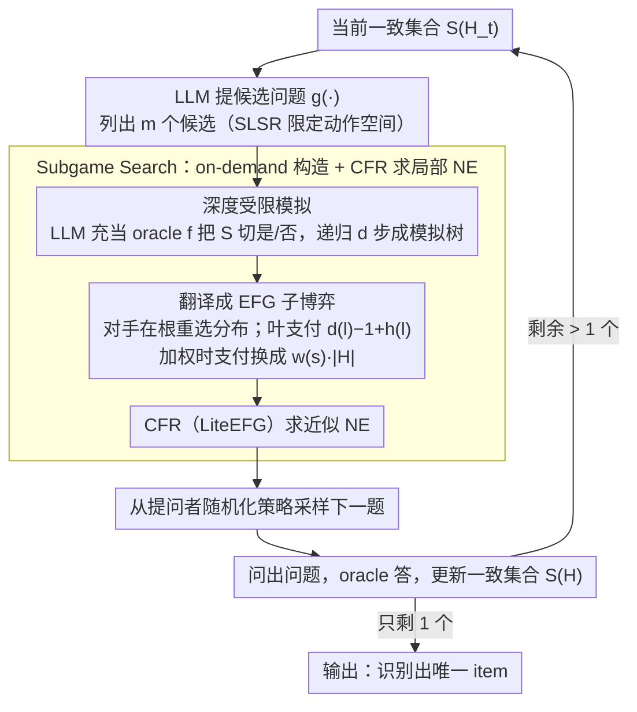

# Game of Thought: Robust Information Seeking with Large Language Models Using Game Theory

**会议**: ICML 2026  
**arXiv**: [2602.01708](https://arxiv.org/abs/2602.01708)  
**代码**: 无  
**领域**: LLM 推理 / 博弈论 / 信息搜索  
**关键词**: 20 Questions, Nash equilibrium, EFG, subgame search, 最坏情况优化

## 一句话总结
本文把 LLM 主动提问场景（20 Questions / 医疗诊断 / 故障排查）建模成两人零和扩展式博弈 (EFG)，提出 Game of Thought (GoT)：用深度有限的子博弈构造 + CFR 求 Nash 均衡来产生“随机化提问策略”，在所有数据集上把 worst-case 交互轮数显著降低，且 weighted 变体下相对 UoT 提升 15–40%。

## 研究背景与动机

**领域现状**：让 LLM 主动澄清、主动问问题以补全信息是 agent / 医疗 / 故障排查里的核心能力。当前主流做法是 Self-Consistency、Tree-of-Thought 这类基于提示的搜索，以及 Hu et al. 2024 提出的 Uncertainty of Thought (UoT)——后者在 20 Questions 上做有限深度搜索，最大化 expected information gain。

**现有痛点**：UoT 显式假设“目标 item 是均匀分布抽取的”，但现实场景里目标分布往往未知且非均匀；如果对手刻意挑“最难猜的那个”，UoT 的 worst-case 表现会很差。在医疗诊断、故障排查这类高风险场景，最坏情况的损失才是真正决定可用性的指标。

**核心矛盾**：要在“分布未知 + 高风险”场景下保证可用性，需要按最坏情况优化；而最大化信息增益的启发式只能保证均值不差，并不抗对手；同时若把对手建模成对抗者，问题就是一个 imperfect-information EFG，构造完整博弈树代价又高得离谱（25 个候选物时构 3763 个 infoset 已经要 5–6 小时）。

**本文目标**：(1) 给 LLM 信息搜索定义一个干净的对抗式数学模型；(2) 在该模型下设计可计算 Nash 均衡（NE）的算法；(3) 在大状态空间下用 subgame search 让算法可落地。

**切入角度**：把 item 选择者看作恶意对手——他从 $\mathcal{S}$ 选 $s^*$，提问者顺序问二值问题 $q_t$ 并由 oracle $f(q_t,s^*)$ 答；当 $|S(H)|=1$ 时游戏结束，提问者代价是 $|H|$。这构成两人零和 EFG，按 Von Neumann minimax 定理 $\min_x \max_y u(x,y)=\max_y \min_x u(x,y)$ 必有随机化 NE，求 NE 就等于对最坏分布做最优。

**核心 idea**：用 EFG 形式化“Strategic Language Search (SLS)”问题，受 poker bot 启发用 depth-limited subgame search + CFR 在 LLM 接口上近似 NE。

## 方法详解

### 整体框架
问题被形式化为四元组 $(\mathcal{S},\mathcal{Q},f,g)$：$\mathcal{S}$ 是候选 item 集合，$\mathcal{Q}$ 是 LLM 能生成的自然语言问题集合，$f:\mathcal{Q}\times\mathcal{S}\to\{0,1\}$ 是 LLM 充当 oracle 的答案函数，$g$ 是“给定剩余 item 集合时 LLM 提议的 $m$ 个候选问题”。每轮 GoT 的 4 步流程：(1) 用 LLM 做 depth-limited 模拟，沿 candidate questions 构出树；(2) 把树翻译成 EFG 子博弈；(3) 用 CFR（LiteEFG）求该子博弈的近似 NE；(4) 从 NE 的提问者分布里采样下一个问题。重复直至 $|S(H)|=1$。

下图把这套"展开子博弈→求 NE→采样提问→更新候选集"的回环画出来：SLS/SLSR 形式化（设计 1）落在候选问题与 EFG 翻译节点上，Subgame Search（设计 2）是中间那组 on-demand 构造+CFR 求解，加权支付（设计 3）是 EFG 节点上的可选支路。

### 关键设计

**1. SLS / SLSR / WSLS 形式化：把"LLM 该问哪个问题"写成可严格分析的两人零和 EFG**

UoT 这类启发式没有可对照的"最优"，无法回答"现在离最优还差多远"。GoT 先把问题写干净：SLS = (S, Q, f)，item chooser 私选 $s^*$、questioner 序贯提问 $q_t$ 并观测 $a_t=f(q_t,s^*)$，历史 $H_t=(Q_t,A_t)$，一致集合 $S(H)=\{s:f(Q(\tau),s)=A(\tau)\,\forall\tau\}$，游戏在 $|S(H)|=1$ 时结束、questioner 代价 = $|H|$。在此之上 SLSR 把候选问题限制为 $g(S(H))$ 输出的 $m$ 个（贴近现实——LLM 一次只能列有限个候选），WSLS 给每个 item 加权 $w(s)$、代价 = $w(s^*)|H|$，刻画"漏掉危险目标代价更大"。理论上 Theorem 3.7 证明当 $\mathcal{Q}=\mathcal{Q}_\infty$ 时 even-split 是 NE——这正好说明 UoT 的近似策略只在均匀分布限制下才最优。EFG 形式化把 NE 当成"对最坏情况优化"的金标准，又把可解性证明（Theorem 3.6 的 best-response NP-complete 性）和近似算法干净地分开。

**2. Subgame Search：on-demand 构造 + CFR 求局部 NE，避开指数级完整博弈树**

显式构造完整博弈树成本与 $|\mathcal{S}|$ 指数相关（25 个 item 已要 5–6 小时），但人玩 20Q 也只看几步。GoT 借 poker bot 的做法，只在到达当前 infoset $I(H_t)$ 时按需展开一个固定深度 $d$ 的子博弈：用 LLM 生成 $g(S(H_t))$ 个候选问题，对每个候选 $c_i$ 让 LLM 充当 $f$ 把 $S(H_t)$ 切成 $Y=\{s:f(c_i,s)=1\}$ 和补集 $\bar Y$，递归 $d$ 步得 simulation tree；翻译成 EFG 时让 item chooser 在子博弈根重新选一个 $S(H_t)$ 上的分布（safe subgame search 的标准做法），叶子 $l$ 支付为 $d(l)-1+h(l)$、启发式 $h(l):=\log_2(|S(l)|)$ 给乐观下界；最后用 LiteEFG 的 CFR 求近似 NE，从提问者策略采样下一题。Theorem 5.1 证明这套 subgame search 是 safe 的——让对手在子博弈根"重新选"相当于给对手更多权力，由此得到的策略放回原博弈仍能保证最坏情况界。

**3. Weighted variant + 加权启发式：让 NE 自动把"危险目标"优先识别出来**

UoT 的信息增益对权重不可知，加权场景下退化成均匀，可能"总轮数少但漏了关键 item"。GoT 在 WSLSR 里把 EFG 支付换成 $w(s^*)\cdot|H|$，启发式相应改为 $h(l)=\max_{s\in S(l)} w(s)\cdot(d(l)+\log_2(|S(l)|))$，提问 prompt 也注入权重信息，让 LLM 倾向先排除高权 item。这样 NE 的极小化最大值结构会自动把概率质量分给"先问出高权 item"的策略——比如人为构造 weight=100 vs 1 时，GoT 总会先直接问"是否为该重权 item"。本质是把权重通过支付函数显式传进博弈，让"高权时下大注"成为均衡的自然产物。

### 一个完整示例：20 Questions 里一轮提问怎么走

假设当前一致集合 $S(H_t)$ 还剩 8 个候选动物。GoT 先让 LLM 提出 $m=3$ 个候选问题，比如「它会飞吗」「它体型比猫大吗」「它生活在水里吗」。对每个候选，LLM 充当 oracle $f$ 把这 8 个切成"是/否"两堆：「会飞吗」切成 3 是 / 5 否，「比猫大吗」切成 4 / 4，「生活在水里吗」切成 1 / 7。如果只看信息增益（UoT 思路），「比猫大吗」的 4:4 均分最优、会被选中。但 GoT 把这棵深度 $d=3$ 的模拟树翻成 EFG 子博弈、让对手在根节点重新挑最难猜的分布，再用 CFR 求 NE——NE 给出的是一个随机化提问策略，可能以 0.7 概率问「比猫大吗」、0.3 概率问「会飞吗」，因为对手若总赌 UoT 的确定性选择就会被针对。提问者按这个分布采样、问出问题、收到答案后候选集从 8 缩到 4（或 3/5），进入下一轮重新展开子博弈，直到只剩 1 个。正是这种"随机化 + 按最坏分布优化"让 GoT 的 worst-case 轮数稳定低于 UoT。

### 损失函数 / 训练策略
本文不训练 LLM，直接用 GPT-4.1 / Qwen-2.5-72B 当 $f,g$ 提供问题和答案，所有“训练”都发生在 EFG 求解层（CFR 迭代）。CFR 每轮只在 subgame 内做几百次迭代即可收敛到近似 NE，相比 LLM 调用成本忽略不计；GoT 的主要计算瓶颈是 LLM 的多秒延迟。

## 实验关键数据

### 主实验
5 个数据集：20Q-Common (136 item)、20Q-S128、20Q-Breeds (25)、医学诊断 DX (100 disease)、故障排查 FloDial (59 fault)。worst-case 交互长度 $L_{worst}=\max_{s\in\mathcal{S}}|H^s|$（越低越好）：

| Method | Common (4.1) | S128 (4.1) | Breeds (4.1) | DX (4.1) | FloDial (4.1) |
|--------|-------------|------------|--------------|---------|--------------|
| **GoT** | **10.2** | **11.8** | **7.4** | **12.2** | **7.9** |
| UoT | 11 | 13 | 9 | 13 | 9 |
| DP (Direct Prompting) | 13.8 | 16.2 | 7.8 | 16.8 | 12.7 |
| DC (Direct Choice) | 12.9 | 14.6 | 9.3 | 16.2 | 11.6 |

Qwen-2.5-72B 上结果一致（GoT 全部最优，DX 上 10.5 vs UoT 12）。

**Weighted variant**（worst-case $\max_s w(s)|H^s|$，越低越好）：

| Method | Common | Breeds | DX | FloDial |
|--------|--------|--------|-----|---------|
| **GoT** | **152.1** | **23.2** | **78.3** | **61.4** |
| UoT | 227.4 | 32.1 | 110.0 | 81.0 |
| DP | 224.0 | 36.9 | 116.0 | 90.1 |

GoT 相对 UoT 改进 15–40%；UoT 在加权场景下退化得很厉害，因为它的信息增益是 weight-agnostic。

### 消融实验

| 配置 | DX worst-case | 说明 |
|------|--------------|------|
| GoT, $d$=3, $m$=3 | 12.2 | 完整模型 |
| GoT, $d$ 增加 | 单调下降 → 平台 | 深度越深越接近“对当前候选问题集的最优策略” |
| UoT, $d$ 增加 | 几乎不动 | 信息增益对最坏情况优化无帮助 |
| WSLSR Breeds, weight skew=100 注入正确问题 | GoT 达到最优 | 验证 NE 求解的最优性 |
| WSLSR Breeds, weight skew=100 不注入 | GoT 性能大跌 | NE 是基于候选集的最优，受 LLM 候选质量限制 |

### 关键发现
- 所有方法离理论下界 $\log_2(|\mathcal{S}|)$ 都还差 2–3 轮，说明实际 LLM 很难生成“恰好二分”的自然语言问题——这是当前 LLM 信息搜索的根本上限。
- GoT 的 worst-case 优势随权重偏斜程度增大，说明 NE 求解对“分布不友好”的鲁棒性是结构性的，不是 trick。
- average-case 上 GoT 与 UoT 相当（DX 实验），但 worst-case GoT 提升的幅度与 UoT 在 average-case 上对 DP 的提升幅度相当——也就是说 GoT 是“在不牺牲均值的前提下显著改善 tail”。
- 不同先验下的 average 性能：在 UoT 不利的先验 $X_{UoT}$ 下，UoT 的平均性能显著下降，GoT 几乎不变；说明 GoT 不只是 worst-case 好，对分布不确定本身也鲁棒。

## 亮点与洞察
- 把 LLM agent 的“提问策略”问题第一次干净地写成扩展式博弈 + Nash 均衡，提供了一个可分析、可验证的 worst-case 优化框架，社区之前几乎都在均值上调启发式。
- “Safe subgame search 在 LLM 接口上”是一个很自然但鲜有人做的迁移：poker AI 早就解决了大博弈树的近似求解，这套工具应用到 LLM agent 是首个干净的范例，技术路线可直接搬到 negotiation、dialogue policy 等其他 LLM 决策场景。
- Theorem 3.7 / Theorem 5.1 的存在让方法不只是工程实现，而是带有最优性保证——这在 LLM 推理改进类工作里非常少见。
- 用 LLM 自身做 $g$ 限定候选问题集合，再让 NE 在“LLM 可表达问题”范围里搜，是个聪明的简化：把无穷动作空间限制到可枚举集合，使得 CFR 可解。

## 局限与展望
- 作者承认只支持严格二值问题，开放式回答的扩展未做。
- 自评：每步要让 LLM 做 $m^d$ 次模拟调用（默认 $d=m=3$ → 27 次），代价不低；在 latency 敏感的实时 agent 中需要更激进的剪枝或 batch 调用。
- subgame search 是 safe 但不是 strict optimal——子博弈外的 deep value 仍由启发式 $\log_2|S(l)|$ 给出，启发式偏差会传导到全局策略上，论文未量化这种偏差。
- WSLSR 的性能强依赖 LLM 给的候选问题质量（消融已证），所以 GoT 的“天花板”实际上是 LLM 自身的提问能力，没解决“怎么让 LLM 生成更好二分问题”这个根问题。
- 没有比较 GoT 在 MCTS / AlphaZero 风格搜索下的效果，subgame search vs MCTS 在 LLM agent 中的取舍仍是开放问题。

## 相关工作与启发
- **vs UoT (Hu et al. 2024)**：UoT 假设均匀分布最大化 expected info gain；本文证明这等价于 Theorem 3.7 中 $\mathcal{Q}=\mathcal{Q}_\infty$ 时的 NE，但现实里候选问题集合有限、分布未知，UoT 的 worst-case 自然差。
- **vs Tree-of-Thought / Self-Consistency**：那些方法搜的是“答案空间”；GoT 搜的是“提问策略空间”，并显式考虑对手。
- **vs Poker bot (Libratus / Pluribus)**：技术上完全继承 subgame search + CFR；新意在于把它适配到 LLM 接口上，并把状态空间用 $S(H)$ 压缩。
- **可迁移启发**：(1) 凡是“对话 / 询问 / 谈判”任务都可以重写成 EFG 求 NE，本文给出了模板；(2) 用 LLM 当 $g$ 限定动作空间是把无穷决策树压缩到可搜规模的通用配方；(3) “worst-case 优化也可以不损失 average”是个对 LLM 推理研究风向有反思价值的结论。

## 评分
- 新颖性: ⭐⭐⭐⭐ EFG/NE 框架在 LLM 信息搜索上的形式化和落地是首次，方法本身是经典博弈论的精彩重用而非全新算法。
- 实验充分度: ⭐⭐⭐⭐ 5 个数据集 × 2 个 LLM × 加权/非加权 × 平均/最坏，覆盖比较扎实；缺与 MCTS、RL-finetuned LLM 的对比。
- 写作质量: ⭐⭐⭐⭐⭐ 形式化清楚，定义—定理—算法—实验一气呵成，例 1/2/3 让概念易懂，读起来非常顺。
- 价值: ⭐⭐⭐⭐ 给“LLM 信息搜索”这条线建立了 worst-case 优化的标杆方法，对医疗诊断等高风险场景有现实意义。

<!-- RELATED:START -->

## 相关论文

- [\[ICLR 2026\] Pruning as a Cooperative Game: Surrogate-Assisted Layer Contribution Estimation for Large Language Models](../../ICLR2026/reinforcement_learning/remix_reinforcement_routing_for_mixtures_of_loras_in_llm_finetuning.md)
- [\[ACL 2026\] Understanding Generalization in Role-Playing Models via Information Theory](../../ACL2026/reinforcement_learning/understanding_generalization_in_role-playing_models_via_information_theory.md)
- [\[ICML 2026\] The Shape of Reasoning: Topological Analysis of Reasoning Traces in Large Language Models](the_shape_of_reasoning_topological_analysis_of_reasoning_traces_in_large_languag.md)
- [\[ICLR 2026\] Robust Multi-Objective Controlled Decoding of Large Language Models](../../ICLR2026/reinforcement_learning/robust_multi-objective_controlled_decoding_of_large_language_models.md)
- [\[ICML 2025\] Decoding Rewards in Competitive Games: Inverse Game Theory with Entropy Regularization](../../ICML2025/reinforcement_learning/decoding_rewards_in_competitive_games_inverse_game_theory_with_entropy_regulariz.md)

<!-- RELATED:END -->
