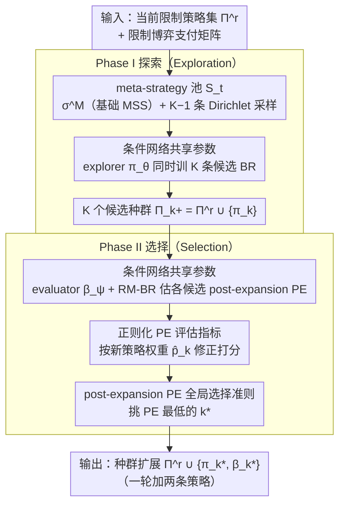

# Global Policy-Space Response Oracles for Two-Player Zero-Sum Games

**会议**: ICML 2026  
**arXiv**: [2605.28273](https://arxiv.org/abs/2605.28273)  
**代码**: https://github.com/Zhangjy1997/GlobalPSRO (有)  
**领域**: 强化学习 / 博弈论RL  
**关键词**: PSRO、Nash均衡、Population Exploitability、零和博弈、DRL

## 一句话总结
本文指出主流 PSRO 在扩展策略种群时只看"受限博弈"的局部信息会导致最坏情况下要加入近 $N$ 个纯策略才能收敛，因此提出一个先采样多条候选最优响应、再用 *post-expansion Population Exploitability (PE)* 直接打分挑选最佳扩展的两阶段探索-选择框架 Global PSRO，并通过参数共享的条件策略网络把多候选训练和评估的代价压到可接受范围。

## 研究背景与动机
**领域现状**：Policy-Space Response Oracle (PSRO) 是把大规模零和博弈求 Nash 均衡的标准做法：维护一个 restricted strategy population $\Pi^r$，用 meta-strategy solver (MSS) 在该限制博弈上解出混合策略 $\sigma$，再用 DRL 学一个对 $\sigma$ 的 best response (BR) $\pi$，把 $\pi$ 加进 $\Pi^r$ 迭代。代表 MSS 有 restricted-game Nash、PRD、AlphaRank、Uniform。

**现有痛点**：MSS 只看 $\Pi^r$ 内部的支付矩阵就决定下一步要训练谁的 BR，所谓"局部强但全局没用"——加入一条对当前限制博弈很强的策略，往往对全局可被剥削度几乎没贡献。Anytime PSRO / EPSRO 把 exploitability 评估扩到全博弈对手算 SRGB-MSS 缓解了一些，但仍然只是"按一条 meta-strategy 训一个 BR"，并没有真去评估"加这条策略后种群整体变好了多少"。

**核心矛盾**：PSRO 的最终目标是让 *种群* 而非单条策略逼近 Nash，但所有 MSS 的选取准则都是基于"单条 meta-strategy 上的 BR"，与目标错位。作者证明了一个相当强的负面定理：对任意 RGB-MSS $\mathcal{M}$ 和任意 $N$，存在 $N\times N$ 零和博弈让 $\mathcal{M}$ 要么不收敛，要么需要至少 $N-1$ 次迭代——而某个特定的 oracle MSS 只需 $\min\{S+2, N-1\}$ 次（$S$ 是均衡支撑大小）。

**本文目标**：把扩展决策从"对当前 meta-strategy 训 BR"改成"直接最小化加入候选后种群的 PE"，并在大规模 DRL 场景下让多候选训练-评估的成本可承受。

**切入角度**：种群的全局可被剥削度 Population Exploitability $\mathcal{PE}(\Pi^r;\mathcal{G})=\min_{\sigma\in\Delta(\Pi^r)}\epsilon(\sigma)$ 才是真正衡量"种群好不好"的量；而 best response 在单纯形上有局部稳定性（命题 4.1：若 $\sigma$ 的 BR 唯一则在某个邻域里 BR 不变），所以有限的候选池就足以覆盖大块 BR 区域。

**核心 idea**：每轮先并行采样 $K$ 条 meta-strategy 训出 $K$ 条候选 BR，再用 RM-BR 估计每个 *假设加入后种群* 的 PE，挑 PE 最低的那个加进 $\Pi^r$；用单个条件神经网络 $\pi_\theta(a\mid s,\sigma)$ 把 $K$ 条候选的训练和评估摊到一份参数上。

## 方法详解

### 整体框架
Global PSRO 把每轮 PSRO 迭代拆成两个阶段，输入是当前限制策略集 $\mathbf{\Pi}^r$ 和限制博弈支付矩阵 $\widehat{\mathbf{U}}$，输出是扩展后的 $\mathbf{\Pi}^r\cup\{\pi_{k^\star},\beta_{k^\star}\}$：

1. **Phase I (Exploration)**：构造 meta-strategy 池 $\mathcal{S}_t=\{\sigma^{\mathcal{M}}\}\cup\{\sigma_k\sim\text{Dirichlet}(\mathbf{1})\}_{k=2}^{K}$（其中一条来自基础 RGB-MSS $\mathcal{M}$，其余从单纯形均匀采样），用条件策略 $\pi_\theta(a\mid s,\sigma)$ 通过 $\max_\theta\frac{1}{K}\sum_k U(\pi_\theta(\cdot\mid\sigma_k),\sigma_k)$ 同时训 $K$ 条候选 BR，候选种群 $\mathbf{\Pi}_k^+=\mathbf{\Pi}^r\cup\{\pi_k\}$。
2. **Phase II (Selection)**：对每个 $\mathbf{\Pi}_k^+$ 估计 $\mathcal{PE}(\mathbf{\Pi}_k^+;\mathcal{G})=\min_\sigma\max_\pi U(\pi,\sigma)$，挑 PE 最低的 $k^\star$ 把候选 $\pi_{k^\star}$ 和评估副产物 $\beta_{k^\star}$（针对 $\rho_{k^\star}$ 的 full-game BR，相当于一次 Anytime-PSRO 扩展）一起加进种群。

> 一轮加两条策略，按 PSRO 计数即两次迭代。理论保证（定理 4.2-4.3）：只要包含 $\sigma^{\mathcal{M}}$ 并保守破并列，就继承基础 MSS 的有限步收敛性；在 Sec.3.1 那种把 RGB-MSS 卡死的对抗博弈族上，期望迭代数被压到 $\mathbb{E}[T^\star]\le \min\{2+\tfrac{2S}{1-(1-c)^{K-1}},N-1\}$，$K\to\infty$ 时收紧到 $\min\{2+2S,N-1\}$，比"必须加 $N-1$ 个纯策略"快了一个数量级。

### 关键设计

**1. 基于 post-expansion PE 的全局选择准则：把扩展目标从"对 meta-strategy 的 BR 收益"换成"加入候选后种群的 PE"**

所有 RGB-MSS 的毛病是只看限制博弈内部的局部支付，于是加进来的策略"局部强但全局没用"，最坏情况要把全策略空间几乎都塞进种群才收敛。Global PSRO 干脆把扩展决策直接对齐 PSRO 的原始目标——让种群逼近 Nash——把准则改成 $\pi^\star\in\arg\min_{\pi\in\mathcal{B}(\Delta(\mathbf{\Pi}^r))}\mathcal{PE}(\mathbf{\Pi}^r\cup\{\pi\};\mathcal{G})$。评估时把候选种群当成一个新限制博弈求 $\min_{\sigma\in\Delta(\mathbf{\Pi}_k^+)}\max_{\pi\in\mathbf{\Pi}} U(\pi,\sigma)$；大博弈下精确解不可行，用 RM-BR 近似——内层 regret matching 维护混合 $\rho_k$、外层 best response 学习器追 $\rho_k$，迭代得到 $\widehat{\mathcal{PE}}_k=U(\beta_k,\rho_k)$。这相当于把搜索从"代理空间"（怎么选 meta-strategy）搬到"目标空间"（种群整体可被剥削度），是整个方法的核心。

**2. 条件神经网络共享参数的多候选训练与评估：让"多采样再选择"在 DRL 预算下从奢侈品变可承受**

朴素实现要训 $K$ 个独立策略 + $K$ 个独立评估器，等于把每轮 PSRO 的 DRL 计算量乘以 $K$，根本跑不动。Global PSRO 用单个 conditional explorer $\pi_\theta(a\mid s,\sigma)$ 同时输出 $K$ 条候选响应，目标 $J(\theta)=\tfrac{1}{K}\sum_k U(\pi_\theta(\cdot\mid\sigma_k),\sigma_k)$；评估阶段同样用一个 conditional evaluator $\beta_\psi(a\mid s,\sigma)$，候选 $k$ 的 BR 学习器就是切片 $\beta_k\triangleq\beta_\psi(\cdot\mid\sigma_k)$，整轮 RM-BR 评估共享 $\psi$。参数一摊，多候选的相对开销几乎可以忽略，这才让"先生成多条候选 BR、再用全局指标挑"的探索-选择框架在真实 DRL 环境里可行。

**3. 正则化 PE 评估指标：防止"新策略权重几乎为 0 却 PE 看起来很小"的假性最优**

在大博弈里 $\rho_k$ 和 $\beta_k$ 都是 RM-BR 的近似量，收敛慢的时候新策略 $\pi_k$ 可能在混合 $\rho_k$ 里权重几乎为 0、却让 $\widehat{\mathcal{PE}}_k$ 被估计噪声带得很小，导致选错。作者定义 $\hat p_k\triangleq\rho_k(\pi_k)$，改用 $\widehat{\mathcal{PE}}_k^{\mathrm{reg}}=(1-\hat p_k)(\widehat{\mathcal{PE}}(\mathbf{\Pi}^r;\mathcal{G})-U(\beta_k,\rho^r))+\widehat{\mathcal{PE}}_k$ 打分；由于 $U(\beta_k,\rho^r)\le\widehat{\mathcal{PE}}(\mathbf{\Pi}^r;\mathcal{G})$，括号内非负，$\hat p_k$ 越小被加的惩罚越大。这把"新加策略是否真被种群利用"显式编码进打分，让选择对估计误差更鲁棒——消融里去掉这个正则会带来中等退化。

### 损失函数 / 训练策略
- Explorer 用 PPO 优化 $J(\theta)=\tfrac{1}{K}\sum_k U(\pi_\theta(\cdot\mid\sigma_k),\sigma_k)$；评估阶段交替"用 $\beta_\psi$ 与 $\rho_k$ 对打采轨迹 → RM 更新 $\rho_k$ → DRL 更新 $\psi$"若干步。
- 一轮加入 $\{\pi_\theta(\cdot\mid\sigma_{k^\star}),\beta_\psi(\cdot\mid\sigma_{k^\star})\}$ 两条策略，并行实现下与基础 PSRO 在相同 environment-step 预算下比较。

## 实验关键数据

### 主实验
环境：Kuhn Poker / Liar's Dice / Leduc Poker / Goofspiel (5, 13 cards) 五个两人零和扩展式博弈，OpenSpiel 实现，BR 都用 PPO，所有方法按 environment steps 预算对齐。指标：Population Exploitability（越低越好）。

| 数据集 / 步数 | 本文 Global PSRO | PSRO w/ Nash | PSRO w/ AlphaRank | Anytime PSRO | NeuPL w/ AlphaRank | PSD-PSRO w/ AlphaRank |
|---|---|---|---|---|---|---|
| Goofspiel-13 @ $19.2\times 10^6$ | **0.305** | 0.579 | 0.459 | 0.404 | 0.244 | 0.599 |
| Goofspiel-13 @ $76.8\times 10^6$ | **0.056** | 0.284 | 0.188 | 0.223 | 0.169 | 0.251 |
| Goofspiel-13 @ $153.6\times 10^6$ | **0.046** | 0.193 | 0.178 | 0.191 | 0.132 | 0.160 |

在 Goofspiel-13 这种最大博弈上，Global PSRO 在中后期普遍把 PE 压到所有基线的 1/3 到 1/4；NeuPL w/ AlphaRank 是除本文外最强的对手，但仍然差 2× 以上。Kuhn Poker 这种很小的博弈上 restricted-game Nash 已经接近全博弈，Global PSRO 与之持平甚至略输——符合"小博弈不需要 global info"的直觉。

### 消融实验
RQ4 在 Kuhn / Liar's / Leduc / Goofspiel-5 上五项消融：

| 配置 | 关键现象 | 说明 |
|---|---|---|
| Full Global PSRO | 全场最佳 | 完整方法 |
| Exploitation only | 大幅退化 | 候选池只剩 $\sigma^{\mathcal{M}}$，等同 single-MSS PSRO，证实多候选 + 选择是主要增益 |
| Random selection | 大幅退化 | 同样候选池但随机挑，说明 PE 打分本身是关键 |
| w/o PE regularization | 中等退化 | 用裸 $\widehat{\mathcal{PE}}_k$ 打分，估计噪声会带偏选择 |
| Exact PE evaluation | 微弱再涨 | 给出选择上限，意味着实用 RM-BR 估计已经足够 informative |
| Neighbor-search exploration | 退化 | 把 Dirichlet 均匀采样换成围绕 $\sigma^{\mathcal{M}}$ 的局部扰动，多样性不够 |

另外 RQ2 把 PSD-PSRO 的多样性正则塞进 Global PSRO 的 explorer（条件输入 $(\sigma,\lambda)$，$\lambda\sim\text{Uniform}[0,0.1]$），Leduc Poker 上有明显进一步收益，其它博弈收益不稳，说明 diversity-driven 与本框架是正交且可叠加的。

### 关键发现
- 增益主要来自"换打分准则"而非"换参数化"：与同样用 conditional population 的 NeuPL 相比 Global PSRO 仍持续更低 PE，说明 post-expansion PE selection 才是核心。
- 理论与实践对齐：Sec.3 的负面定理预测"RGB-MSS 在某些对抗博弈上要 $N-1$ 步"，Fig.1 在专门构造的 $100\times 100$ 博弈上确实看到了这种渐进卡死。
- 评估精度对最终性能不敏感：把估计 PE 换成精确 PE 只多涨一点点，说明 RM-BR + regularization 已经做对了选择的相对排序。

## 亮点与洞察
- **"按目标本身打分"的极简思想**：PSRO 一直在卷 MSS（怎么选 meta-strategy），但选 MSS 永远只是代理目标；本文直接把代理换成真目标 PE，相当于把 search 从"代理空间"搬到"目标空间"，这种"对齐 selection 准则与最终目标"的设计可以迁移到其它 multi-stage 训练管线。
- **条件策略 = 多候选的免费午餐**：把 $K$ 条候选的训练和评估都摊到一个 $\pi_\theta(a\mid s,\sigma)$ / $\beta_\psi(a\mid s,\sigma)$ 上，让"多采样、再选择"在 DRL 预算下从奢侈品变可承受品，这个 trick 适合所有"先生成多候选再挑"的 pipeline（diverse RL、ensembling、population-based training 等）。
- **正则化打分对抗估计噪声**：用"新策略权重 $\hat p_k$"作为可信度修正，是一个值得抄走的小设计——很多 selection-based 方法（neural architecture selection、active learning）也面临估计量太噪而错选的问题。

## 局限与展望
- 仅限两人零和：PE 在多人 general-sum 里没有 saddle-point 结构，没法直接 $\min$-$\max$ 估计，作者明确放在 future work。
- 真实 DRL 中的 $\widehat{\mathcal{PE}}_k$ 仍是有偏估计：RM-BR 在每轮预算紧的时候 $\rho_k$ 离真正的 least-exploitable mixture 还远，文中靠正则项缓解但没给误差分析；如果换成置信上界式选择（UCB-PSRO）也许能进一步省 budget。
- 候选数 $K$ 的选取没有自适应机制：当前是固定超参，从 Theorem 4.3 看 $K$ 越大越好但 explorer 的训练目标摊薄了梯度信号，实际折中需要每个博弈调；如果能根据当前 PE 估计的方差动态决定 $K$ 会更优雅。

## 相关工作与启发
- **vs Anytime PSRO / EPSRO (SRGB-MSS)**: 他们也用了全博弈信息——找最难被全博弈剥削的 meta-strategy——但仍是"按一条 $\sigma$ 训一个 BR"，没有评估"加进去后种群好不好"；本文把扩展决策提升到种群层并增加 $\beta_k$ 作为额外副产物。
- **vs PSD-PSRO (diversity-driven)**: 他们通过多样性正则强迫新策略与已有策略不同，本文反过来用"加进去后 PE 是否真降"来评判候选；二者正交，结合后在 Leduc Poker 上额外提升。
- **vs NeuPL / Simplex-NeuPL (conditional population)**: 他们也用条件神经网络共享 PSRO 种群参数但保留传统选择机制，本文借用同款参数共享技术，但核心贡献在选择准则——实验上 NeuPL 是最强 baseline，本文持续更低 PE 证明改进来自 selection 而非参数化。

## 评分
- 新颖性: ⭐⭐⭐⭐ "对齐 selection 准则与最终目标"+负面定理是简洁有力的视角，但 PE 已是已知量，条件策略也是已有技巧，组合属于"对的人在对的位置"。
- 实验充分度: ⭐⭐⭐⭐ 五个游戏 + 四类基线 + 完整 RQ1-4 消融 + 理论对照实验（Fig.1）+ 多样性正则叠加，覆盖面强。
- 写作质量: ⭐⭐⭐⭐⭐ Sec.3 把 RGB-MSS 局限性以"工具/目标错位"的统一视角讲清楚，定理与算法的对应关系紧密。
- 价值: ⭐⭐⭐⭐ 给 PSRO 系列方法换了 selection 准则的"新标准做法"，对开放式多智能体训练、自对弈基础设施有直接影响。

<!-- RELATED:START -->

## 相关论文

- [\[ICML 2026\] Revisiting Regularized Policy Optimization for Stable and Efficient Reinforcement Learning in Two-Player Games](revisiting_regularized_policy_optimization_for_stable_and_efficient_reinforcemen.md)
- [\[AAAI 2026\] Perturbing Best Responses in Zero-Sum Games](../../AAAI2026/reinforcement_learning/perturbing_best_responses_in_zero-sum_games.md)
- [\[ICML 2026\] Bilevel Optimization over Saddle Points of Zero-Sum Markov Games](bilevel_optimization_over_saddle_points_of_zero-sum_markov_games.md)
- [\[ICML 2025\] Solving Zero-Sum Convex Markov Games](../../ICML2025/reinforcement_learning/solving_zero-sum_convex_markov_games.md)
- [\[ICLR 2026\] SPIRAL: Self-Play on Zero-Sum Games Incentivizes Reasoning via Multi-Agent Multi-Turn Reinforcement Learning](../../ICLR2026/reinforcement_learning/spiral_self-play_on_zero-sum_games_incentivizes_reasoning_via_multi-agent_multi-.md)

<!-- RELATED:END -->
