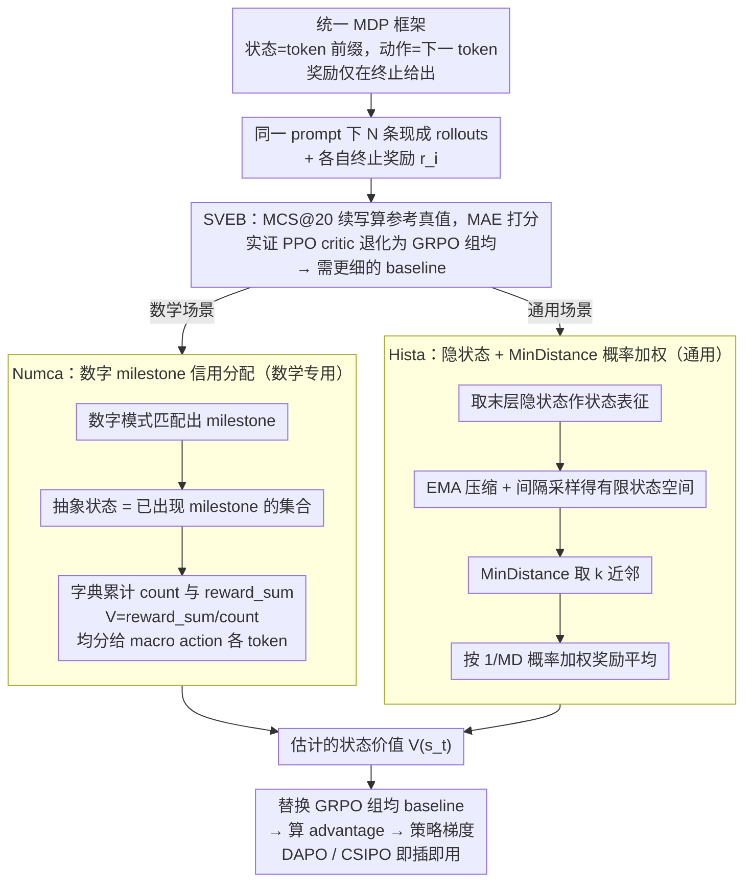

# Hista and Numca: Estimate State Value Effectively for LLM Reinforcement Learning

**会议**: ICML 2026  
**arXiv**: [2605.29782](https://arxiv.org/abs/2605.29782)  
**代码**: https://github.com/VOXXXX1874/Hista  
**领域**: 强化学习 / LLM 后训练 / 信用分配  
**关键词**: LLM RL, GRPO, 状态价值估计, Hindsight, 隐状态表征  

## 一句话总结
本文先用一个新建的 State Value Estimation Benchmark (SVEB) 实证 PPO critic 在 LLM RL 里几乎完全退化为 GRPO 的组均奖励 baseline，再提出两种以"无须额外 rollout、几乎零额外算力"为目标的状态价值估计方法 —— Numca 用数字 milestone 把数学推理重写为目标条件 RL 做信用分配，Hista 用 LLM 末层隐状态 + MinDistance 做概率加权奖励平均 —— 在五大类 SVEB 子集都把 MAE 降到 GRPO/PPO 之下，并让 DAPO/CSIPO 等强算法在多个数学基准上拿到一致提升。

## 研究背景与动机

**领域现状**：DeepSeek-R1 之后，以 GRPO 及其后继 DAPO、GSPO、CSIPO 为代表的 RL 后训练范式已经成为 LLM 推理对齐的事实标准。它们的共同骨架是把"整条回答"看作一个动作，用同一个组均奖励 $\bar r$ 作为每个 token 的 baseline，再做策略梯度。这套设计绕开了 token 级状态价值估计的难题，但也牺牲了经典 RL 中 critic 的细粒度信用分配。

**现有痛点**：作者构造 SVEB 后发现，被广泛使用的 PPO critic 在 LLM 场景下并没有提供"比组均更细的指导" —— PPO-1 (未见数据) 与 GRPO 几乎同分 (0.169 vs 0.164)，PPO-N (见过数据) 也只比 GRPO 略好 (0.158 vs 0.164)；更直接地，作者画出 $\widehat V_{PPO}(s_t)-\widehat V_{GRPO}(s_t)$ 的分布，发现它紧紧贴在零附近 —— PPO critic 的输出几乎就是组均奖励本身。

**核心矛盾**：替代方案要么不可扩展（PRM 与 MCTS 需要昂贵标注或大量额外 rollout，VAPO/VC-PPO 仍要训一个和 actor 同量级的 critic），要么本就不是为"作为 baseline 估值"设计的（PRM 主要做正确性核验）。LLM RL 训练循环里的"算力税"非常高，因此真正可用的 state value estimator 必须满足：不增加 rollout 数 / 不引入大模型规模的 critic / 不依赖额外人工标注 / 与现有 GRPO-style 训练循环即插即用。

**本文目标**：(i) 把"状态价值估计的好坏"做成可量化的评测 (SVEB)；(ii) 给一个数学推理场景下立刻可用的轻量方法 (Numca)；(iii) 在一般领域给一个无需先验的通用方法 (Hista)，并在理论上证明它优于组均估计器。

**切入角度**：作者把 LLM 推理重新装回经典 RL 的 MDP 框架 —— 状态是 token 前缀、动作是下一个 token、奖励只在终止时给。这样一来，状态价值 $V^\pi(s_t)=\mathbb{E}_\pi[r(s_T)\mid s_t]$ 的本质是"从这条前缀出发，未来终止奖励的期望"。任何能把"从 $s_t$ 出发的多条 rollouts"按某种相似度聚合并取平均的方法，都是潜在的状态价值估计器；问题转化为找一个既廉价又有意义的"状态等价类"或"状态相似度"。

**核心 idea**：用一个不需要训练的"廉价相似度" —— 数学场景下是数字 milestone 的等价类（Numca），通用场景下是 LLM 末层隐状态之间的 MinDistance（Hista） —— 直接对同 prompt 下的现成 rollouts 做加权平均奖励，作为细粒度 baseline。

## 方法详解

### 整体框架
作者把所有方法套进统一的 MDP：状态 $s_t=(x_1,\dots,x_t)$，动作 $a_t\in\mathcal V$，转移确定，奖励仅在 $a_t=\langle\mathrm{eos}\rangle$ 或截断时由 $r(s_T)$ 给出。给定一个 prompt 下的 $\mathcal N$ 条 rollouts 与每条终止奖励 $r_i$，所有方法的目标都是为某个中间状态 $s_t$ 给出 $\widehat V(s_t)$，再像 GRPO 那样作为 baseline 进入策略梯度。

SVEB 的构造方式是：选一组 prompts，用固定 $\pi$ 跑 rollouts，从每条均匀采样若干中间 $s_t$；对每个 $s_t$ 再独立采 $n$ 条续写得到 $\widehat V(s_t)=\frac{1}{n}\sum_i r(s_T^{(i)})$（论文用 MCS@20）作为参考真值；最后用 MAE 评分。子集按领域分为 number / math / science / general / programming 五个，覆盖了 DAPO-17K、OpenR1-220K、以及多领域选择题。

后续的 Numca 和 Hista 都被设计成"GRPO 训练管线内的 baseline 替换" —— 不改变 rollout 数量，不引入新 critic，不需要额外标注，只换 $\widehat V(s_t)$ 的计算方式。

### 关键设计

**1. SVEB：用 Monte Carlo 真值把"value estimator 好不好"做成一个可测的 MAE**

之前评 baseline 质量都是看"下游 RL 是否变好"，这混杂了优化噪声和算法差异，没法干净地隔离"估值精度"本身。SVEB 的做法是给每个中间状态 $s_t$ 用大规模 Monte Carlo 续写算一个参考真值 $\widehat V(s_t)=\frac{1}{n}\sum_{i=1}^n r(s_T^{(i)})$（论文用 MCS@20，按大数律 $\widehat V(s_t)\to V^\pi(s_t)$），再用 $\mathrm{MAE}(f,D_s)=\frac{1}{|D_s|}\sum_j |f(s_t^{(j)},\theta)-\widehat V(s_t^{(j)})|$ 给任意估计器打分。靠这把离线、可重复的尺子，作者第一次把"PPO critic 在 LLM 场景下没用"从经验直觉提升成可量化结论：SVEB-NUMBER 上 PPO-1@40 / PPO-N@40 / GRPO@40 的 MAE 分别是 0.169 / 0.158 / 0.164，而 $\widehat V_{PPO}-\widehat V_{GRPO}$ 的分布几乎以零为中心——PPO critic 的输出基本就是组均奖励本身。这个结论正是后面放弃训 critic、改走廉价相似度路线的合理性来源。

**2. Numca：把数学题里的"数字"当 milestone，用目标条件 RL 做几乎零成本的信用分配**

直接搬 HER 那套"用最终状态当 alternate goal"在文本上行不通，因为语义不是离散结构化的。但作者注意到数学题里"算到某个中间数"天然是可解析、可验证的子目标，于是用数字 milestone 绕开了"如何无监督找 milestone"的难题。具体做法：定义模式集 $\mathcal P$（整数 / 小数 / 分数等），milestone $m=(x_i,\dots,x_j)$ 是解码字符串匹配 $\mathcal P$ 的 token 子序列；状态 $s_t$ 抽象成 $s_t^M\triangleq\mathbb M(s_t)$，即"已出现的所有 milestone 的集合"，相邻两个抽象状态之间的 token 拼成 macro action。然后对现成 rollouts 维护一个字典 $\mathcal T[s^M]=(\mathrm{count}, \mathrm{reward\_sum})$，每条 rollout 命中一个唯一抽象状态就 count+1、把终止奖励累加，最后 $V(s^M)=\mathcal T[s^M].\mathrm{reward\_sum}/\mathcal T[s^M].\mathrm{count}$，再均匀分给该 macro action 内所有 token。整个过程就是字典查询，内存和算力几乎可忽略。代价是它只在数字密集的场景管用——SVEB-NUMBER 上 Numca@40 MAE 降到 0.132（vs GRPO 0.175 / PPO-N 0.159），但在 science 子集退回 0.217，所以它是数学专用解法，需要 Hista 接力。

**3. Hista：用 LLM 末层隐状态 + MinDistance 做概率加权奖励平均，且有理论兜底**

要在不依赖任何领域先验的前提下给任意 $s_t$ 估值，得有一个通用的"状态相似度"。作者把 LLM 自回归训练视为一种隐式表征学习（与 MAE/DINO/BERT/JEPA 同源），于是末层隐状态就是天然的状态表征，不必再训表征模型。两个变长隐状态序列之间的距离用 MinDistance 定义——长者每个位置去短者里找最近邻求 $\ell_2$ 再求和：

$$\mathrm{MD}(\mathbf X_1,\mathbf X_2)=\sum_i \min_j \|\mathbf x_{1,i}-\mathbf x_{2,j}\|_2.$$

这套设计两头都有理论支撑：Theorem 5.2 证明两个状态拿到相同最终奖励的概率与 $\mathrm{MD}$ 成反比 $P(R_1=R_2)\propto 1/\mathrm{MD}$；Theorem 5.5 进一步证明概率加权估计器 $\widehat V_{PW}(s_t)=\sum_i P_{t,i} r_i/\sum_i P_{t,i}$ 的偏差不大于朴素平均估计器——即"相似状态应有相似奖励"这条直觉转成概率加权后，偏差理论上必然不会更差。工程上为了跑超长序列，先用平滑系数 $\alpha$、压缩间隔 $\varphi$ 的 EMA 把 $\mathbf X_\tau$ 压成 $\mathbf E_\tau$，再以采样间隔 $\delta$ 切出有限状态空间，对每个 $s_t^H$ 取 $k$ 近邻按 $\omega_i=1/\mathrm{MD}(s_t,s_i)$ 加权得 $V(s_t)=\sum_{i=1}^k \omega_i r_i/\sum_{i=1}^k \omega_i$。空间复杂度 $O(\lfloor T/d\rfloor^2)$，可批量化到 GPU，整体开销与 GRPO 同量级，因此能直接挂到任何 GRPO-style 算法上做无痛 baseline 替换。

### 损失函数 / 训练策略
所有方法保留 GRPO/DAPO/CSIPO 原本的 clipping、KL 正则、importance sampling 等机制，只替换 advantage 公式里的 baseline：把组均奖励换成 Numca / Hista 给出的 $\widehat V(s_t)$。Numca 用字典 + 数字正则模式匹配，Hista 用末层隐状态 + EMA 压缩 + kNN 加权。两者都不需要额外训练步骤，也不引入新模型参数。

## 实验关键数据

### 主实验
SVEB 五个子集 MAE（@40 rollouts，参考值 MCS@20，越低越好）：

| 方法 | Number ↓ | Math ↓ | Science ↓ | General ↓ | Programming ↓ |
|------|----------|--------|-----------|-----------|---------------|
| GRPO@40 | 0.175 | 0.208 | 0.215 | 0.202 | 0.157 |
| PPO-N@40 | 0.159 | 0.187 | 0.198 | 0.185 | 0.144 |
| Numca@40 | **0.132** ↓0.027 | 0.194 ↑0.007 | 0.217 ↑0.019 | 0.200 ↑0.015 | 0.154 ↑0.010 |
| Hista@40 | 0.142 ↓0.017 | **0.145** ↓0.042 | **0.173** ↓0.025 | **0.157** ↓0.028 | **0.119** ↓0.025 |
| MCS@1（参考） | 0.223 | 0.235 | 0.272 | 0.283 | 0.162 |
| MCS@2（参考） | 0.133 | 0.160 | 0.188 | 0.139 | 0.113 |

Numca 仅在数字密集的 Number 子集明显胜出；Hista 在五个子集全面优于 GRPO/PPO-N，且接近 MCS@2 这种已经用 2 倍 rollout 的真值估计。

### 消融实验 / 下游对比
在 Qwen2.5-Math-1.5B-Instruct 上把 GRPO 的 baseline 换成 Numca，下游数学评测结果：

| Benchmark | Qwen | + GRPO | + Numca |
|-----------|------|--------|---------|
| MATH-500 | 0.740 | 0.746 | **0.760** |
| GSM8K | 0.849 | 0.848 | **0.864** |
| MinervaMath | 0.286 | 0.301 | **0.313** |
| OlympiadBench | 0.425 | 0.413 | **0.426** |
| AMC23 | 0.528 | 0.553 | **0.584** |
| AIME24&25 | 0.104 | 0.113 | 0.104 |
| AVERAGE | 0.528 | 0.541 | **0.555** |

训练曲线（论文 Fig. 3）显示：Numca 验证集精度稳步上升，GRPO/PPO 出现不稳定波动 —— 作者把这归因于细粒度且更准的 baseline 减小了策略梯度方差。Hista 进一步应用到 DAPO 上（论文 Fig. 1b，Qwen2.5 base 上多组超参），收敛速度和最终奖励都明显优于不带 Hista 的 DAPO/CSIPO。

### 关键发现
- "PPO critic 在 LLM RL 里基本退化为 GRPO" 不仅在某个数据集上成立，而是跨多数据源都被复现；这意味着实际工程里训一个全规模 critic 大多数情况下是浪费算力。
- 估值精度更高 $\Rightarrow$ 训练曲线更平稳：Numca 在数学场景中的训练—验证曲线更稳定，且峰值更高，证明 baseline 的方差与 RL 策略梯度方差强相关 —— 改进 baseline 是除了"加 rollout 数"之外最便宜的方差削减手段。
- AIME24&25 上 Numca 没赢 GRPO，作者其它分析也指向 AIME 这种"答案空间极小但中间步骤极长"的题目对 number-based milestone 帮助有限，反过来强化了"通用方法 Hista 的必要性"。

## 亮点与洞察
- **SVEB 这个评测本身可能比方法更影响后续工作**：它给出了一个独立于下游 RL 的 baseline 质量度量，未来任何新提的 baseline 都可以先在 SVEB 上做廉价 ablation，再决定要不要进 RL 训练。
- **Numca 用"数字"做 milestone 是极轻量的 hindsight 应用**：实现就是一个字典 + 正则，没有任何额外网络，却在 SVEB-Number 上把 MAE 砍到接近 MCS@2。这条思路可以迁移到任何"中间结果可被快速验证"的场景，例如代码执行栈、定理证明的中间引理、SQL 的中间表，只要能定义可解析的 milestone。
- **Hista 把"LLM = 隐式表征学习器"这条信念落地为可用工具**：直接用末层隐状态 + MinDistance + 概率加权，不训新模型也不加 rollout，就拿到了几乎全场最优的估值精度，并且有理论 (Theorem 5.5) 保证偏差不会比 GRPO 更差。这非常适合作为现有 GRPO-stack 的"无痛 baseline 替换"。
- **理论与工程对齐**：Theorem 5.2 把 MD 反比关联到"同奖励概率"，Theorem 5.5 给出概率加权 vs 均值的偏差不等式 —— 提供了"为什么要这么做"的依据，而不仅仅是"实验上有效"。

## 局限与展望
- Numca 强依赖数字密度，在非数字推理（science / general）上几乎与 GRPO 同分，文章本身也明确承认这是它必须由 Hista 接力的原因。
- Hista 的 MD 度量是 $\ell_2$ + MinDistance 的拼装，理论假设 (A.1, B.2) 写在附录里且对真实 LLM 隐空间的成立程度未被实证验证；当 prompt 内 rollouts 多样性极低时，加权可能退化回均值。
- 评测仍以离线 MAE + 数学/科学/编程 benchmark 为主，没有覆盖多轮对话、长程 agent 任务（如 tool use），那里 prompt 同质性、隐状态稳定性更复杂。
- 空间复杂度 $O((T/d)^2)$ 在 100k token 级长上下文上仍可能挤显存；论文用 EMA + 采样间隔 $\delta$ 缓解，但极端长链推理上需要进一步压缩。

## 相关工作与启发
- **vs PPO / VAPO / VC-PPO**：它们要训一个 actor 量级的 critic，本文实证这套 critic 在 LLM RL 中收敛到组均，因此用 Numca/Hista 直接换 baseline，省掉整套 critic 训练。
- **vs PRM / MCTS-based credit assignment (Lightman et al. 2023, Zhang et al. 2025, Li et al. 2025, Guan et al. 2025)**：它们靠人工 process label 或大量额外 rollout 拿细粒度信号，成本极高；Hista 复用已有 rollouts 的隐状态，几乎零额外成本，并且不限于"验证正确性"，而是直接给出 value 估计。
- **vs HER / GCRL (Andrychowicz et al. 2018, Eysenbach et al. 2023)**：本文是 HER 思想在 LLM 上的具体落地 —— Numca 把"达到某个数"当成 hindsight goal，Hista 进一步把"达到的语义状态"用隐状态表示，从而摆脱对显式 goal 的依赖。
- **vs GRPO / DAPO / GSPO / CSIPO**：这些算法集中改 clip / IS / KL，本文与之正交：不动这些机制，只换 baseline，因此可以与它们任一叠加，并在论文 Fig. 1b / Fig. 3 中确实展示了 + Hista / + Numca 后的进一步提升。

## 评分
- 新颖性: ⭐⭐⭐⭐ SVEB + Numca + Hista 三件套首次把"baseline 质量"作为 LLM RL 的独立可优化轴，Hista 用隐状态做概率加权 baseline 也是首次。
- 实验充分度: ⭐⭐⭐⭐ 五领域 SVEB + 数学下游 + DAPO 上的应用 + 多模型 (Qwen2.5-1.5B / Math 系列) 覆盖，主要缺多轮 / agent 类任务。
- 写作质量: ⭐⭐⭐⭐ 论证链条从"PPO 退化"到"为什么需要 Numca/Hista"非常清楚，Theorem 与实证交替呈现。
- 价值: ⭐⭐⭐⭐⭐ 几乎零额外算力的 baseline 替换 + 可直接挂到现有 GRPO/DAPO 训练循环，对工业级 LLM 后训练有立刻可见的工程收益。

<!-- RELATED:START -->

## 相关论文

- [\[ICML 2026\] DARTS: Distribution-Aware Active Rollout Trajectory Shaping for Accelerating LLM Reinforcement Learning](darts_distribution-aware_active_rollout_trajectory_shaping_for_accelerating_llm_.md)
- [\[ICML 2026\] Multi-Agent Decision-Focused Learning via Value-Aware Sequential Communication](multi-agent_decision-focused_learning_via_value-aware_sequential_communication.md)
- [\[ACL 2026\] Efficient Hyperparameter Optimization for LLM Reinforcement Learning](../../ACL2026/reinforcement_learning/efficient_hyperparameter_optimization_for_llm_reinforcement_learning.md)
- [\[ICLR 2026\] Value Flows](../../ICLR2026/reinforcement_learning/value_flows.md)
- [\[ICLR 2026\] Continuous-Time Value Iteration for Multi-Agent Reinforcement Learning](../../ICLR2026/reinforcement_learning/continuous-time_value_iteration_for_multi-agent_reinforcement_learning.md)

<!-- RELATED:END -->
