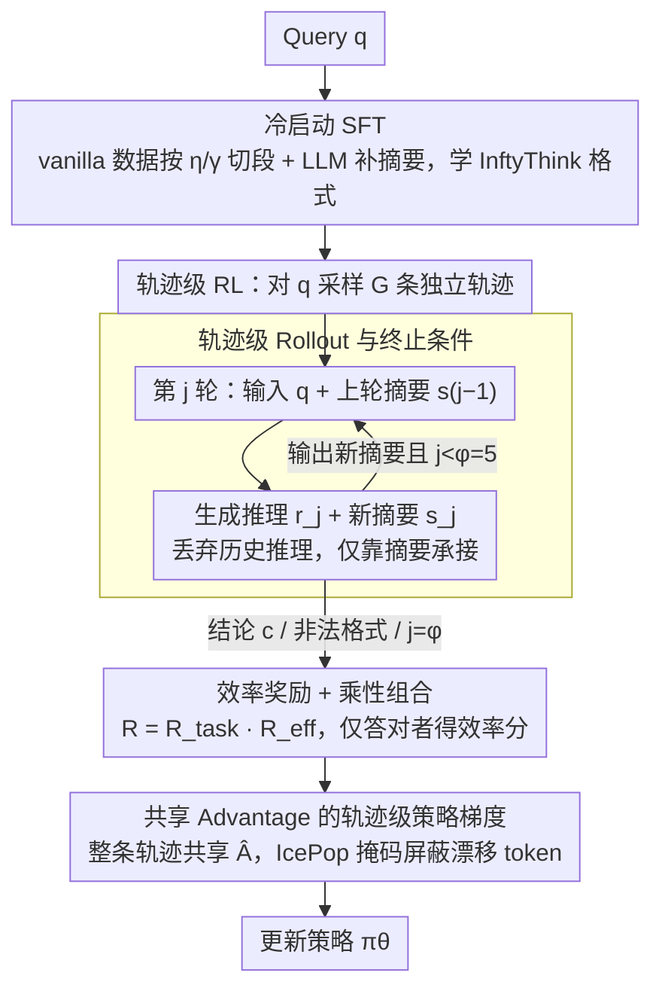

# InftyThink+: Effective and Efficient Infinite-Horizon Reasoning via Reinforcement Learning

**会议**: ICML 2026  
**arXiv**: [2602.06960](https://arxiv.org/abs/2602.06960)  
**代码**: https://zju-real.github.io/InftyThink-Plus  
**领域**: LLM推理 / 强化学习 / 高效推理  
**关键词**: 迭代推理, 轨迹级RL, GRPO, 摘要式CoT, 效率奖励

## 一句话总结
本文把"迭代推理 + 显式摘要"这一推理范式从纯 SFT 升级到端到端 RL，提出 InftyThink+：用轨迹级 GRPO 同时优化"何时摘要、保留什么、如何续推"三个决策，并配以效率奖励，在 DeepSeek-R1-Distill-Qwen-1.5B 上把 AIME24 准确率提升 21%、延迟降低 32.8%。

## 研究背景与动机

**领域现状**：当前的大型推理模型（DeepSeek-R1、o1 等）依赖"推理时缩放"——通过生成超长 chain-of-thought（CoT）在 `<think>...</think>` 内做分解、规划、反思，从而提升复杂推理能力。

**现有痛点**：把推理深度直接绑死到上下文长度上会撞到三堵墙：(1) self-attention 二次复杂度导致超长推理代价爆炸；(2) 受最大上下文窗口硬限制，难题在结论前就被截断；(3) "lost-in-the-middle"——序列越长，早期关键信息越难被利用，反过来拖垮推理质量。

**核心矛盾**：现有"迭代式推理"方案（token 剪枝、潜在空间压缩、Markovian Thinker 固定分块、原始 InftyThink）要么用启发式硬切，要么只靠 SFT 模仿数据格式，**没人优化"何时压缩、压缩什么、怎么续推"这三个决策**——而它们恰恰是迭代推理成败的关键。一个差的早期摘要会污染后面所有迭代；一次不必要的迭代浪费算力；过早收尾会牺牲精度。

**本文目标**：把"迭代推理"从"格式模仿"升级为"策略优化"——让模型自己学会在合适的时机摘要、提炼关键状态、用摘要续推。

**切入角度**：迭代推理本质是带长程后果的序列决策问题，必须用 **trajectory-level RL** 来优化整条多轮轨迹，而不是逐 token 模仿。但 InftyThink 的"单 query → 多次生成"结构和标准 GRPO 的"单 query → 多条独立 trajectory"假设并不直接对齐，需要重新设计 rollout、奖励和梯度估计。

**核心 idea**：cold-start SFT 学格式 + 轨迹级 GRPO 学策略；奖励在轨迹级累积，advantage 在轨迹内共享，并加一项二次衰减的"少迭代多奖励"效率项。

## 方法详解

### 整体框架

输入是单个 query $q$，输出是一条多轮迭代轨迹 $\mathcal{O}_i = \{o_i^1, o_i^2, \ldots, o_i^{n_i}\}$，每一轮 $o_i^j$ 由"推理段 $r_j$ + 摘要 $s_j$"组成，下一轮只看 query 和最新摘要 $s_{j-1}$，不再看历史推理。当模型在某轮直接输出结论 $c$（而非新的 `
`）时整条轨迹终止，或者达到最大迭代数 $\varphi$ 强制停止。训练分两阶段：

1. **Cold start (SFT)**：把已有的 vanilla 推理数据 $(q, r, c)$ 用两个超参 $\eta$（段长上限，6k）和 $\gamma$（摘要长度上限，1k）切段并由外部 LLM 生成摘要 $\{s_1, \ldots, s_{n-1}\}$，得到 InftyThink 格式训练样本（公式 1），让模型先学会用 `
...
` 和 `<history>...</history>` 特殊 token 产出格式合法的多轮输出。
2. **Trajectory-level RL (GRPO 改造)**：在 DeepScaleR 数据集上做完整的 multi-iteration rollout，按轨迹打分，用共享 advantage 优化。

### 关键设计

**1. 轨迹级 Rollout 与终止条件：把"单 query → 单次生成"扩成"单 query → 多轮迭代轨迹"**

标准 GRPO 的 rollout 假设每条 trajectory 是一次连续生成，没法直接喂给"分段-摘要-续推"的循环。InftyThink+ 重新设计了 rollout：给定 query $q$，第 $j$ 轮把 prompt 拼成 $q + s_{j-1}$（$j=1$ 时 $s_0$ 为空），生成 $o_i^j$ 后抽出新摘要 $s_j$ 作为下一轮唯一输入——历史推理段全部丢掉，只靠摘要承接。轨迹在三种情况下终止：模型自己输出结论而非摘要、输出不符合 InftyThink 格式、或迭代数达到上限 $\varphi=5$。每个 query 用 GRPO 采样 $G$ 条独立轨迹组成 group。$\varphi$ 这个硬上限既约束训练成本，也防止模型陷入"一直摘要不收尾"的恶性死循环。

**2. 效率奖励 + 乘性组合：在"答对"之外加一项"少迭代奖励"，且只让答对的轨迹拿得到**

vanilla RL 会鼓励模型把 CoT 越写越长、延迟成本同步爆炸，所以要给迭代次数一个反向压力。任务奖励是二值的 $\mathcal{R}_{\text{task}}(\mathcal{O}_i) = \mathbb{I}[\operatorname{Verify}(o_i^{n_i}, gt) = \text{Correct}]$；效率奖励用二次衰减 $\mathcal{R}_{\text{eff}}(\mathcal{O}_i) = 1 - ((n_i - 1)/\varphi)^2$，$n_i=1$ 时满分、随迭代数平滑下降。关键是两者**乘性**组合 $\mathcal{R}(\mathcal{O}_i) = \mathcal{R}_{\text{task}} \cdot \mathcal{R}_{\text{eff}}$ 而非加性——这样只有答对的轨迹才分得到效率奖励，堵死了模型"为了少迭代而提前草率收尾"的捷径。二次衰减曲线本身也比硬性 length penalty 优雅：早期惩罚轻、鼓励探索，靠近 $\varphi$ 时惩罚陡升、遏制无谓迭代。

**3. 共享 Advantage 的轨迹级策略梯度：让早期的"好摘要"也拿到正梯度，哪怕这轮没给答案**

迭代推理的因果链是"早期好摘要 → 后期能答对"，一个差的早期摘要会污染后面所有迭代，所以 advantage 必须能跨轮回传。InftyThink+ 在 GRPO 框架内对一条轨迹里所有 token 共享同一个 advantage $\hat{A}_t = (\mathcal{R}(\mathcal{O}_i) - \mu)/\sigma$（$\mu,\sigma$ 在该 query 的 $G$ 条轨迹间统计），loss 在所有轮、所有 token 上做 token-level 平均，clipped surrogate 用非对称 clip $\epsilon^-,\epsilon^+$。token-level 平均是为了避免长轨迹的 loss 被稀释。此外引入 IcePop token 级梯度掩码——把 inference engine（SGLang）和 training engine（FSDP）log-prob 差异大的 token 屏蔽掉，稳住"rollout 后端 ≠ training 后端"这一大规模 RL 工程里典型的数值漂移问题，否则训练容易崩塌。

### 损失函数 / 训练策略
两阶段：(1) SFT 用 OpenThoughts-114K，Qwen3-4B-Instruct-2507 合成中间摘要，loss 只在推理段和摘要 token 上算，query/history token 全部 mask；(2) RL 用 DeepScaleR-Preview，global batch 128，1000 步（Qwen3-4B-Base 500 步），$\varphi=5$，verl + AgentLoop 异步 rollout，SGLang + FSDP，PRIME-Math 做答案校验。

## 实验关键数据

### 主实验
基座 DeepSeek-R1-Distill-Qwen-1.5B（采样 32 次取均值，T=0.7），ACC 为准确率（%），LAT 为平均推理延迟（秒）：

| 设置 | AIME24 ACC↑ | AIME25 ACC↑ | GPQA_D ACC↑ | 平均 ACC↑ | 平均 LAT↓ |
|---|---|---|---|---|---|
| Vanilla（仅 cold-start） | 26.67 | 24.48 | 29.40 | 41.69 | 110.96 |
| Vanilla + RL (task) | 38.75 | 31.04 | 29.81 | 47.31 | 149.44 |
| InftyThink+（仅 cold-start） | 29.48 | 27.92 | 32.31 | 44.06 | 77.57 |
| InftyThink+ RL (task) | **50.94** | **35.83** | **37.50** | **53.96** | 100.21 |
| InftyThink+ RL (task+eff) | 43.96 | 32.92 | 35.46 | 50.58 | **48.37** |

在更大的 Qwen3-4B-Base 上同样成立：InftyThink+ RL (task) 平均 ACC 58.71 vs Vanilla RL 57.13，平均延迟 265s vs 535s。

### 消融实验（摘要时机策略，cold-start 与 RL 两种状态下，AIME24 ACC %）

| 时机策略 | w/o RL | w/ RL | 说明 |
|---|---|---|---|
| Adaptive（模型自决） | 29.48 | 50.94 | InftyThink+ 默认 |
| Random（3-6k token 随机打断） | 28.54 (-0.94) | 47.92 (-3.02) | RL 后 gap 反而被放大 |
| Fixed（每 5k token 强制摘要） | 28.44 (-1.04) | 48.44 (-2.50) | 同上 |

### 关键发现
- **RL 的红利在 InftyThink+ 上更大**：task-only RL 给 Vanilla 带来 +5.62 平均 ACC，给 InftyThink+ 带来 +9.89——AIME24 上差距尤其大（+21.46 vs +12.08），说明显式摘要为 RL 提供了更可被优化的"高层状态"。
- **效率奖励能拿到真正的 Pareto 改进**：相对纯 cold-start，task+eff 同时把平均 ACC 抬高 6.51 点、延迟降低 29.20s；相对 task-only RL 用 ~3 点 ACC 换来一半的延迟。
- **自适应时机不可替代**：RL 越强，硬塞固定/随机切分的代价越大（AIME24 上 RL 后掉点 -2.5 ~ -3.0），说明 RL 学到的是一套真正"看情况摘要"的策略，而非凑次数。
- **RL 训练本身也加速 18.2%**：因为每轮 context 有界，rollout 阶段不会被超长序列拖死。

## 亮点与洞察
- **"乘性奖励 + 共享 advantage"是这类多阶段 trajectory 优化的好模板**：乘性卡掉错答的捷径，共享 advantage 让"无答案但贡献大"的中间步骤拿到信号——这一套可直接搬到 agent 多轮工具调用、长程规划等场景。
- **二次衰减效率奖励 vs 线性**的细节非常实用：早松后紧的曲线天然兼顾探索与收敛，比硬性 length penalty 优雅得多。
- **IcePop token-level 梯度掩码**为"rollout 后端 ≠ training 后端"的工程现实提供了简洁解法，是大规模 RL 系统稳定性的真正瓶颈。
- **范式启示**：把"长 CoT"从"一次性长序列"切成"多轮带摘要的有界上下文"，等价于把 attention 复杂度从 $O(L^2)$ 摊成 $O(\varphi \cdot (L/\varphi)^2)$，理论延迟降低与实测 32.8% 一致——这条路线对推理时长被卡住的下游 agent 任务有很强的迁移价值。

## 局限与展望
- 主实验基座只到 1.5B 和 4B，超大模型（30B+）上 trajectory-level RL 的稳定性和回报曲线还需要验证。
- 摘要质量评估只做了"用外部 LLM 替换"这种间接 ablation，缺乏对摘要语义保真度的直接度量。
- 效率奖励的权衡用乘性写死，没探索动态权重或多目标 Pareto front 的更细控制。
- $\varphi=5$ 是硬上限，对真正需要 10+ 轮的极难问题是否够用未知；自适应的 $\varphi$ 或层次化迭代是自然的下一步。

## 相关工作与启发
- **vs InftyThink (Yan et al., 2025)**：本文沿用同一推理范式（模型自决迭代边界 + 显式摘要），但把训练从纯 SFT 升级到 cold-start + 轨迹级 RL，从"学格式"升级到"学策略"。
- **vs Markovian Thinker / Delethink (Aghajohari et al., 2025)**：对方把推理切成固定大小的 chunk + RL，实现线性 compute 但忽略推理的自然结构；本文允许模型按内容自适应切分。
- **vs 长 CoT + 标准 RL**：vanilla RL 鼓励模型生成更长 CoT，延迟和成本同步爆炸；InftyThink+ 在拉长推理深度的同时把延迟压住，是"效率-效果"真正的双赢。
- **vs token 剪枝 / 潜在压缩 (Xia et al., 2025; Zhang et al., 2025)**：那类方法是 input-side 压缩，可能丢掉日后关键信息；本文是 output-side 显式文本摘要 + RL 优化保留策略。

## 评分
- 新颖性: ⭐⭐⭐⭐ 把 trajectory-level RL 完整嵌入"迭代摘要式推理"，rollout/reward/advantage 三件套都做了对齐改造，思路清晰且实用。
- 实验充分度: ⭐⭐⭐⭐ 两个基座、四个 benchmark、3 类时机消融 + 摘要质量替换 + 训练加速，覆盖比较完整。
- 写作质量: ⭐⭐⭐⭐ 三大痛点-三个决策-三类设计的结构对称清晰，公式与表格搭配到位。
- 价值: ⭐⭐⭐⭐ 对于上下文受限或需要 agent 长程推理的场景有直接工程价值，乘性奖励/共享 advantage 范式可复用性高。

<!-- RELATED:START -->

## 相关论文

- [\[ACL 2026\] A Goal Without a Plan Is Just a Wish: Efficient and Effective Global Planner Training for Long-Horizon Agent Tasks (EAGLET)](../../ACL2026/reinforcement_learning/a_goal_without_a_plan_is_just_a_wish_efficient_and_effective_global_planner_trai.md)
- [\[ICML 2026\] Offline Reinforcement Learning with Universal Horizon Models](offline_reinforcement_learning_with_universal_horizon_models.md)
- [\[ICML 2026\] Long-Horizon Model-Based Offline Reinforcement Learning Without Explicit Conservatism](long-horizon_model-based_offline_reinforcement_learning_without_explicit_conserv.md)
- [\[ICML 2026\] D$^2$Evo: Dual Difficulty-Aware Self-Evolution for Data-Efficient Reinforcement Learning](d2evo_dual_difficulty-aware_self-evolution_for_data-efficient_reinforcement_lear.md)
- [\[ICML 2026\] Coupled Variational Reinforcement Learning for Language Model General Reasoning](coupled_variational_reinforcement_learning_for_language_model_general_reasoning.md)

<!-- RELATED:END -->
