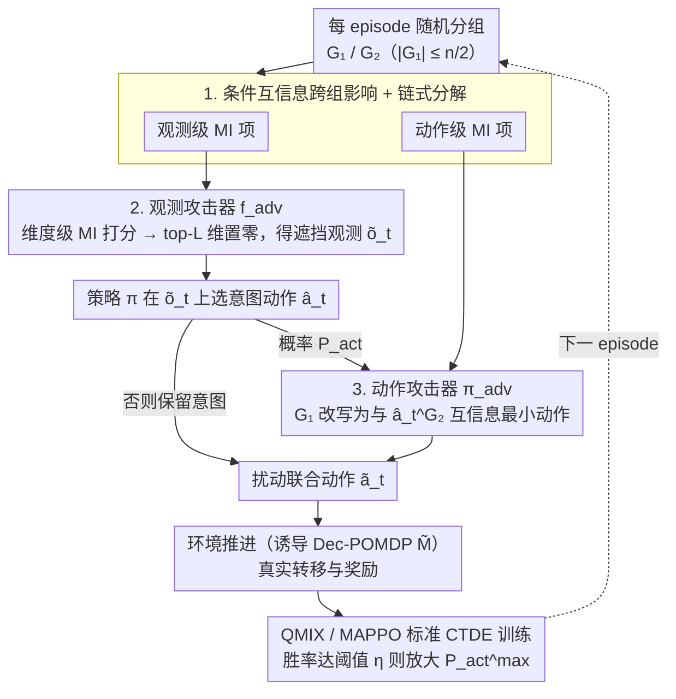

# Interaction-Breaking Adversarial Learning Framework for Robust Multi-Agent Reinforcement Learning

**会议**: ICML 2026  
**arXiv**: [2605.18024](https://arxiv.org/abs/2605.18024)  
**代码**: https://sunwoolee0504.github.io/IBAL  
**领域**: 强化学习 / 多智能体 / 鲁棒 MARL  
**关键词**: MARL, CTDE, 互信息, 对抗训练, 协作鲁棒性  

## 一句话总结
本文从信息论视角出发，把多智能体之间的"互相影响"用条件互信息刻画出来，再设计同时遮挡观测和扰动动作的攻击器去最小化跨组互信息，并据此训练出能在协作部分崩溃时仍能稳定决策的 IBAL 策略，在 SMAC / SMACv2 / LBF 等多种攻击与"队友缺失"扰动下都显著超过既有鲁棒 MARL 方法。

## 研究背景与动机

**领域现状**：合作型 MARL 通常采用中心化训练 + 去中心化执行（CTDE）框架，例如 VDN、QMIX 这一类把联合动作价值 $Q^{tot}$ 分解为个体效用 $Q^i$ 的方法。这种紧耦合训练让智能体能学到精细的协作策略，但同时让策略对"训练时少见的交互模式"极其敏感。

**现有痛点**：已有的鲁棒 MARL 工作（Lin et al. 2020 的对抗正则、ROMANCE/EGA 的关键时刻动作攻击、Wolfpack 的串行靶向攻击、ATLA 的 RL 攻击者等）大都把鲁棒性归结为"价值导向"的扰动 —— 攻击者直接挑选使 $Q^i$ 最小的动作，或对观测加 FGSM 噪声。这类目标隐含假设是"扰动只发生在单个智能体的输入端"，并不直接破坏"智能体之间的依赖结构"，因此当攻击真正切断协作链路（例如让一队人看不到另一队人）时，这些方法的防御就会突然崩塌。

**核心矛盾**：CTDE 的训练—执行之间存在结构假设的错配。训练期价值分解假设各智能体能稳定地相互"读到"对方，而真实部署中协作可能因为通信中断、视野遮挡、单元死亡等被打断，导致策略遇到几乎从未在训练分布中见过的交互断裂。

**本文目标**：(i) 用一种与 $Q^{tot}$ 结构无关的方式量化"跨智能体影响"；(ii) 构造能直接抹掉这种影响的攻击器；(iii) 在该攻击下学到一组对"协作崩塌"鲁棒的策略，并能进一步泛化到"队友缺失"这类非参数化扰动。

**切入角度**：作者把 $n$ 个智能体随机切成两组 $G_1, G_2$，用条件互信息 $\mathcal{I}(\boldsymbol{o}_{t+1}^{G_1}, \boldsymbol{a}_t^{G_1}; \boldsymbol{a}_t^{G_2} \mid \boldsymbol{\tau}_t)$ 刻画 $G_2$ 对 $G_1$ 的影响，并按互信息链式法则把它拆成观测级和动作级两项；分别用一个遮挡观测的攻击器和一个改写动作的攻击器去最小化这两项，就得到了一个不依赖值估计、专门撕开协作通道的攻击。

**核心 idea**：用最小化跨组互信息的"交互破坏"作为对抗训练目标，并证明其等价于在带扰动转移的诱导 Dec-POMDP 上做标准 MARL 优化，从而把"协作崩塌鲁棒性"问题归约为一个标准价值学习问题。

## 方法详解

### 整体框架
IBAL 在 CTDE 训练循环外再套一层"分组—攻击—训练"流程：每个 episode 开始随机抽 $k \sim \mathrm{Unif}(\{0,\dots,K\})$ 并随机抽 $G_1 \subset \mathcal{N}$（限制 $|G_1| \le n/2$，避免攻击过强），$G_2 = \mathcal{N}\setminus G_1$。每个环境步首先由观测攻击器 $\boldsymbol{f}_{\mathrm{adv}}$ 把 $G_1$ 与 $G_2$ 对望方向的观测分量按互信息打分挑出前 $L$ 维并置零；策略 $\boldsymbol{\pi}$ 在被遮挡的观测 $\tilde{\boldsymbol{o}}_t$ 上选出意图动作 $\hat{\boldsymbol{a}}_t$；以概率 $P_{\mathrm{act}}$ 触发动作攻击器 $\boldsymbol{\pi}_{\mathrm{adv}}$，把 $G_1$ 的子动作替换为最小化与 $\hat{\boldsymbol{a}}_t^{G_2}$ 互信息的动作 $\tilde{\boldsymbol{a}}_t^{\mathrm{min},G_1}$。环境用扰动后的联合动作 $\tilde{\boldsymbol{a}}_t$ 推进，转移与奖励都按真实动力学产生，但被等价看成在一个新的"带扰动转移"的 Dec-POMDP $\tilde{\mathcal{M}}$ 上采样，从而可以直接灌进 QMIX/MAPPO 这类标准 CTDE 优化器。

理论支撑是 Theorem 4.2：把"观测攻击 $\to$ 策略 $\to$ 动作攻击"看作组合策略 $\boldsymbol{\pi}_{\mathrm{adv}} \circ \boldsymbol{\pi} \circ \boldsymbol{f}_{\mathrm{adv}}$，则它在 Joint-Adversarial Dec-POMDP $\mathcal{M}^J$ 上的价值，恰好等于在状态扩张为 $\tilde{s}_t = (s_t, \tilde{\boldsymbol{a}}_t)$、转移变为 $\tilde{P}(\tilde{s}_{t+1}\mid \tilde{s}_t, \hat{\boldsymbol{a}}_t) := P(s_{t+1}\mid s_t, \hat{\boldsymbol{a}}_t)\cdot \boldsymbol{\pi}_{\mathrm{adv}}(\tilde{\boldsymbol{a}}_t\mid s_t, \hat{\boldsymbol{a}}_t)$ 的诱导 Dec-POMDP $\tilde{\mathcal{M}}$ 上对原策略 $\boldsymbol{\pi}$ 求 $\tilde{V}_{\boldsymbol{\pi}}(s_t)$。这条等价让"在攻击者下学最优策略"变回了"在新环境下学最优策略"，所以可以照搬 QMIX 损失，不用专门设计 minimax 优化。

### 关键设计

**1. 基于条件互信息的跨组影响刻画与链式分解：用一个跟价值函数完全解耦的量度量"$G_2$ 对 $G_1$ 影响多大"，再拆成可分别攻击的两部分**

值导向攻击只看"我把值打下来多少"，根本表达不了"我把协作链路切断了多少"，而且一旦 value 估计本身不可靠（QMIX 单调混合对非最优动作的估计会扭曲）攻击方向就跟着失真。IBAL 换一个角度：把 $G_2$ 对 $G_1$ 的影响定义为条件互信息 $\mathcal{I}(\boldsymbol{o}_{t+1}^{G_1}, \boldsymbol{a}_t^{G_1}; \boldsymbol{a}_t^{G_2} \mid \boldsymbol{\tau}_t)$，由互信息链式法则拆成观测级 $\mathcal{I}(\boldsymbol{o}_{t+1}^{G_1}; \boldsymbol{a}_t^{G_2} \mid \boldsymbol{a}_t^{G_1}, \boldsymbol{\tau}_t)$ 和动作级 $\mathcal{I}(\boldsymbol{a}_t^{G_1}; \boldsymbol{a}_t^{G_2} \mid \boldsymbol{\tau}_t)$ 两项。观测级量的是"$G_2$ 的动作能多大程度改变 $G_1$ 下一步看到的东西"（如某单位进出 $G_1$ 视野），动作级量的是"$G_1$ 和 $G_2$ 的动作有多协同"。互信息直接对应信息流量，与 QMIX 的结构假设无关，所以即便在 value 估计扭曲的区域也能给出一致的攻击方向，分别对应观测攻击器和动作攻击器要消掉的两个量。

**2. 观测攻击：维度级互信息上界 + 零遮挡掩码**

从 $G_1$ 每个智能体的观测里挑出最能"告诉自己 $G_2$ 在哪/在干嘛"的 $L$ 个维度一次性归零，难点是直接对所有 $L$ 维子集求互信息会组合爆炸。作者用 Lemma 4.3 把群体级观测互信息上界成维度级互信息之和加一个群冗余项 $\mathcal{R}(G_1;G_2)$，并实测这个冗余项相对主项可忽略（类似泰勒余项），于是最优掩码近似为对每个维度单独打分 $D^{i,*} = \arg\max_{D^i:|D^i|=L}\sum_{d\in D^i}\sum_{j\in G_2}\mathcal{I}(o^i_{d,t+1}; a^j_t \mid a^i_t, \boldsymbol{\tau}_t)$，被选中的维度输出置零 $\tilde{o}^i_{d,t}=0$。维度级互信息用 CLUB 估计器训练、每个 (agent, dim) 只算一次，分组变了只需重新聚合不必重算。掩码选"全零"而非高斯噪声/FGSM 是有讲究的：由数据处理不等式 $\mathcal{I}(f(X);Y\mid Z)\le \mathcal{I}(X;Y\mid Z)$，确定性置零能最大程度抹掉信号，带噪扰动反而会保留残余互信息。把组合优化降成逐维打分让攻击代价线性可控，还顺带给出"哪些观测分量真正承担跨组信息传递"的可解释结果（Fig. 2 验证 Top-$L$ 高互信息维度正是编码 $G_2$ 存在性的那些通道）。

**3. 动作攻击 + 自适应攻击强度调度**

在策略已经"想协作"地给出意图动作 $\hat{\boldsymbol{a}}_t$ 之后，把 $G_1$ 的部分动作改写成与 $\hat{\boldsymbol{a}}_t^{G_2}$ 互信息最小的那个 $\tilde{\boldsymbol{a}}_t^{\mathrm{min},G_1} := \arg\min_{\boldsymbol{a}_t^{G_1}} \mathcal{I}(\boldsymbol{a}_t^{G_1}; \hat{\boldsymbol{a}}_t^{G_2}\mid \boldsymbol{\tau}_t)$，攻击器以概率 $P_{\mathrm{act}}$ 输出 $\langle \tilde{\boldsymbol{a}}_t^{\mathrm{min},G_1}, \hat{\boldsymbol{a}}_t^{G_2}\rangle$、否则保留原意图；动作级互信息这里用 KL 散度形式的共享估计器一次性给出组级 MI，不再做维度分解。关键是攻击强度要由弱到强：$P_{\mathrm{act}}\sim\mathrm{Unif}(1/K, P_{\mathrm{act}}^{\max})$，每当平均胜率 $\bar\sigma$ 超过阈值 $\eta$ 就把上界放大 $\alpha$ 倍 $P_{\mathrm{act}}^{\max}\leftarrow \min(1,\alpha P_{\mathrm{act}}^{\max})$。固定 $P_{\mathrm{act}}$ 会让学习强度和攻击强度脱节——弱策略时被一巴掌拍死、强策略时又挑战不够；这个自适应调度等于把课程式难度内建进训练，$1/K$ 的下界则保证策略再弱也有非平凡攻击、不退化成 vanilla 训练。

### 损失函数 / 训练策略
价值损失沿用所选 backbone（QMIX 或 MAPPO）的标准目标，区别只在采样的转移来自 $\tilde{\mathcal{M}}$；CLUB 与 KL 估计器与策略联合在线更新；所有 SMAC 实验在 QMIX 上跑 10M 步，且统一从 1M 步预训练的 QMIX 初始化，便于公平比较。攻击中"观测互相遮挡"被对称化（既挡 $G_1$ 也挡 $G_2$）以避免训练偏置；分组上限 $K\le n/2$ 是关键超参，作者在主文中按场景搜索（$K=1$ 用于 2s3z，$K=4$ 用于 8m）。

## 实验关键数据

### 主实验
基线覆盖 Vanilla QMIX、Rand-Obs/Rand-Act、FGSM、ATLA、ERNIE、ROMANCE、WALL；攻击侧考虑 Nat. / Rand. / FGSM / EGA / Wolfpack / Ours；测试集种子与训练集不同以测真实泛化。论文给出 SMAC 六个场景 (3m, 3s_vs_3z, 2s3z, 8m, 1c3s5z, MMM) 的平均胜率曲线与表格。

| 评测设定 | Vanilla QMIX | ROMANCE / WALL（强基线趋势） | IBAL（本文） |
|----------|-------------|-----------------------------|------------|
| Natural（无攻击） | 中—高 | 与 vanilla 相近 | 不弱于 vanilla |
| FGSM / EGA / Wolfpack 攻击 | 明显掉点 | 各自针对自己的攻击较好，遇 Interaction-Breaking 攻击急剧塌方 | 在所有攻击下保持高胜率，1c3s5z 上"全攻击都高" |
| Interaction-Breaking 攻击（本文新增） | 最严重塌方 | 最严重塌方 | 显著最高 |
| Dis-1 / Dis-2（队友被禁用） | 急剧下降 | 普遍掉很多 | 差距进一步扩大 |
| HP-15（友军初始血量 -15%） | 退化 | 略好但仍掉 | 明显领先 |
| LBF / SMACv2 自然性能 | 受随机性拖累 | 与 vanilla 接近 | 反而更高，说明对随机性同样鲁棒 |
| MAPPO backbone | — | — | 同样获得鲁棒性提升，证明方法与值分解结构解耦 |

### 消融实验
| 配置 | 8m Dis-1 胜率 (%) | 说明 |
|------|-------------------|------|
| IBAL Full | 88.4 ± 3.3 | 完整方法 |
| w/o adaptive prob.（固定 $P_{\mathrm{act}}=1/K$） | 明显下降 | 课程式攻击强度对学习曲线很关键 |
| w/ random masking（随机选 $L$ 维而非按 MI） | 下降 | MI 引导比随机更能切中跨组通道 |
| w/o 观测攻击 | 大幅下降 | 观测/动作两类攻击不可互相替代 |
| w/o 动作攻击 | 大幅下降 | 同上 |
| IBAL + Gaussian noise（替代零掩码） | 78.1 ± 13.3（8m） / 71.9 ± 22.1（MMM） | 残余互信息让攻击变弱 |
| IBAL + FGSM 替代零掩码 | 38.5 ± 7.4（8m） / 77.6 ± 3.6（MMM） | FGSM 在视觉鲁棒标准下强，但用于切断信息流不如直接置零 |

### 关键发现
- 攻击 IBAL 自己设计的"互信息最小动作"在轨迹可视化里表现为有方向地"后撤以脱离 $G_2$"，而值最小化攻击在 QMIX 单调混合下会触发非最优动作的不可靠估计，表现为震荡式抖动 —— 也解释了为什么 ROMANCE/WALL 训练出的策略遇 IBAL 攻击会"莫名崩"。
- IBAL 训出的策略学到了协作崩塌时的应急行为：8m 中某队员被打残时另一健康队友会前压顶替前排；MMM 中医疗单位被驱离后低血量友军会主动靠近医疗单位再回战场。这类行为在标准训练下罕见，是被"频繁的协作中断"逼出来的。
- 最大分组 $K$ 越大不一定越好：2s3z 在 $K=1$ 最优，8m 直到 $K=4$ 仍稳定，再大反而阻碍学习，反映"攻击强度与可学习性之间的折中"。

## 亮点与洞察
- **值导向 vs 信息导向的攻击分野**：本文把鲁棒 MARL 攻击从"打掉值"扩展到"打掉信息流"，提供了一个全新的攻击表面，对实际部署里"通信被劫持/视野被遮挡"这类场景更贴切。
- **维度级互信息上界**让 MI 攻击从理论玩具变成可工程化方案：每个 (agent, dim) 只估一次，组合改变时只聚合，避免了 MI 攻击常被诟病的算力爆炸；这一思路也能迁移到任何需要"在高维输入里选少量关键维"的对抗问题（如多模态推断的特征级攻击）。
- **JA-Dec-POMDP $\to$ 诱导 Dec-POMDP 的等价**绕开了真正的 minimax 训练，让攻防训练可以共用一套 CTDE 实现，工程门槛非常低 —— 这是为什么作者能轻松把 IBAL 同时挂到 QMIX 与 MAPPO 两条 backbone 上。
- 训练时的"队友缺失"作为非参数扰动反而被 MI 攻击 + 随机分组覆盖到了，让 IBAL 在 Dis-$\ell$ 上额外大幅领先 —— 这表明"分组打互信息"实际上隐式覆盖了"队友直接消失"这种极端情形。

## 局限与展望
- 引入了若干超参（$K$、$L$、$P_{\mathrm{act}}^{\max}$、$\alpha$、$\eta$），虽然作者给了经验区间，但跨任务迁移仍需小规模搜索。
- 需要持续训练 CLUB / KL 互信息估计器，相对 vanilla QMIX 有非平凡的额外开销，论文承认有"中等"计算成本。
- 当前评估集中在 SMAC 家族 + LBF，缺乏在真实通信受损（如带宽限制、丢包）或异构多智能体（无人车 + 无人机）场景的验证；理论上 JA-Dec-POMDP 框架支持，但实证留待后续。
- 对手只是"信息切断"型，仍未覆盖"主动注入误导"型（例如对手发出伪造观测让某组以为对方在某处），这是自然的下一步。

## 相关工作与启发
- **vs ROMANCE / EGA**：它们用 RL 学到的攻击器去最小化值估计或挑选关键时刻，本文换成最小化跨组互信息，攻击不依赖 Q 网络结构，因而能跨 backbone 通用，并在 QMIX 不可靠估计区域仍稳定有效。
- **vs Wolfpack/WALL**：Wolfpack 顺序攻击同一团体内不同个体以"放大破坏"，本文则在群级别上整体撕开两组之间的依赖；实验中 WALL 防自己攻击很强，但面对互信息攻击就塌。
- **vs ATLA**：ATLA 训练一个 RL 观测攻击者，本文给出闭式互信息攻击 + 分组课程，省掉了对抗 RL 的训练不稳定问题。
- **vs MI 用于通信/角色发现的 MARL（如 Jaques et al. 2019, Wang et al. 2020b）**：以往工作把互信息作为正向奖励/正则促进协作，本文反过来把"最小化互信息"当作对抗目标用于鲁棒训练，是同一工具的"对偶用法"。

## 评分
- 新颖性: ⭐⭐⭐⭐⭐ 首次系统化把"交互断裂"作为 MARL 鲁棒性的攻击表面，并给出互信息上界 + JA-Dec-POMDP 等价的完整闭环。
- 实验充分度: ⭐⭐⭐⭐ SMAC 六场景 + LBF + SMACv2 + MAPPO backbone + 完整消融 + 攻击变体对比，唯一缺真实通信场景。
- 写作质量: ⭐⭐⭐⭐ 理论推导和工程实现衔接清晰，Fig. 2 的可解释性可视化非常加分。
- 价值: ⭐⭐⭐⭐ 对部署中协作易崩的场景有直接实用价值，且方法与 backbone 解耦，迁移成本低。

<!-- RELATED:START -->

## 相关论文

- [\[ICML 2026\] Vulnerable Agent Identification in Large-Scale Multi-Agent Reinforcement Learning](vulnerable_agent_identification_in_large-scale_multi-agent_reinforcement_learnin.md)
- [\[ICML 2026\] LLM-Guided Communication for Cooperative Multi-Agent Reinforcement Learning](llm-guided_communication_for_cooperative_multi-agent_reinforcement_learning.md)
- [\[AAAI 2026\] ChartEditor: A Reinforcement Learning Framework for Robust Chart Editing](../../AAAI2026/reinforcement_learning/charteditor_a_reinforcement_learning_framework_for_robust_chart_editing.md)
- [\[ICLR 2026\] Robust Deep Reinforcement Learning against Adversarial Behavior Manipulation](../../ICLR2026/reinforcement_learning/robust_deep_reinforcement_learning_against_adversarial_behavior_manipulation.md)
- [\[AAAI 2026\] MARS: A Meta-Adaptive Reinforcement Learning Framework for Risk-Aware Multi-Agent Portfolio Management](../../AAAI2026/reinforcement_learning/mars_a_meta-adaptive_reinforcement_learning_framework_for_risk-aware_multi-agent.md)

<!-- RELATED:END -->
