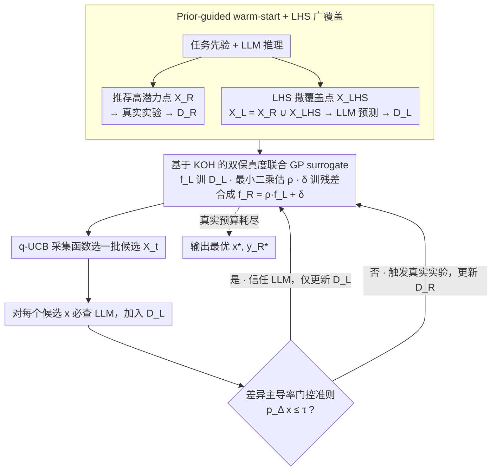

# LABO: LLM-Accelerated Bayesian Optimization through Broad Exploration and Selective Experimentation

**会议**: ICML 2026  
**arXiv**: [2605.22054](https://arxiv.org/abs/2605.22054)  
**代码**: 未公开  
**领域**: 贝叶斯优化 / LLM加速 / 多保真度 / 科学发现  
**关键词**: 贝叶斯优化、LLM先验、多保真度、KOH模型、门控准则  

## 一句话总结
本文提出 LABO，把 LLM 当作"低保真度"评估源接入贝叶斯优化循环——用 Kennedy–O'Hagan 联合高斯过程把真实实验 $f_R$ 分解为缩放的 LLM 预测 $\rho f_L$ 加上残差过程 $\delta$，再用"差异主导率" $p_\Delta = \sigma_\delta^2/(\rho^2\sigma_L^2 + \sigma_\delta^2)$ 做门控决定每个候选要不要花真实实验，从而用近乎免费的 LLM 查询广撒网、把昂贵真实实验集中到 LLM 不可信的区域，在 COF、Fullerene 等 6 个科学优化任务上同等真实预算下显著超过 vanilla BO 与 LLAMBO、BOPRO、CAKE。

## 研究背景与动机

**领域现状**：科学配方优化（药物发现、催化剂设计、分子工程）每次评估都对应一次昂贵实验，因此贝叶斯优化（BO）是主流——用高斯过程 surrogate 建模目标、用采集函数（EI、UCB）平衡探索利用、迭代提示下一组候选。近期一系列工作开始把 LLM 接入 BO：LLAMBO 用 LLM 给初始化点和候选建议，BOPRO 在 LLM embedding 的隐空间做 BO，CAKE 把 LLM 先验注入 GP 核。

**现有痛点**：现有 LLM+BO 方法把 LLM 当"建议提供者"接入采样、surrogate 或采集函数，但**没有充分利用 LLM 评估成本远低于真实实验这一事实**——LLM 一次推理只要几分钱，真实化学合成可能要几天几万块。当下方法仅在初始化或局部决策处轻量调用 LLM，没有把它作为可独立采样的"低保真度评估源"系统化使用。同时 BO 自身有两个老问题：冷启动（开局没数据）和高维搜索空间下的探索困难。

**核心矛盾**：要充分利用 LLM 的低成本广覆盖能力，就得把它当评估源接入 surrogate；但 LLM 预测会系统性偏离真实实验（化学直觉错位、reasoning 幻觉），如果无脑信任会把 surrogate 带偏。如何在"广用 LLM 探索"和"只在 LLM 可信处省真实实验"之间动态权衡，是核心问题。

**本文目标**：设计一个 BO 框架同时回答两个问题：（i）怎么把异构的 LLM 与真实保真度信号融成一个统一概率 surrogate；（ii）每一步要不要为某候选额外花一次真实实验。

**切入角度**：多保真度仿真领域早有成熟的 Kennedy–O'Hagan（KOH）联合 GP 框架——把高保真度看作低保真度的线性变换加上残差过程，分别用 GP 建模。作者把 LLM 直接当低保真度评估源（"知识保真度"，区别于传统数值仿真保真度）套入 KOH，并用残差 GP 的方差占比作为不确定性的可解释指标，决定是否触发真实实验。

**核心 idea**：用 KOH 把真实目标分解为 $f_R(x) = \rho f_L(x) + \delta(x)$，其中 $f_L$ 拟合 LLM 预测、$\delta$ 拟合 LLM 与真实之间的差异；用差异主导率 $p_\Delta(x) = \sigma_\delta^2(x)/(\rho^2\sigma_L^2(x) + \sigma_\delta^2(x))$ 与阈值 $\tau$ 比较——$p_\Delta$ 大说明不确定性主要来自 LLM 不可信、必须做真实实验；$p_\Delta$ 小则信任 LLM 预测、只更新 $f_L$。

## 方法详解

### 整体框架
LABO 分 warm-start 和优化循环两阶段。Warm-start：让 LLM 基于任务先验 $\mathcal{P}$ 推荐少量高潜力点 $\mathcal{X}_R$ 跑真实实验得 $\mathcal{D}_R$，同时用 Latin Hypercube Sampling 撒一批空间覆盖点 $\mathcal{X}_L$（保证 $\mathcal{X}_R \subset \mathcal{X}_L$）让 LLM 全部预测得 $\mathcal{D}_L$。优化循环：每轮先训 $f_L \sim \mathcal{GP}(0, k_L)$ 在 $\mathcal{D}_L$ 上、用最小二乘估 $\rho$、训 $\delta \sim \mathcal{GP}(0, k_\delta)$ 在残差 $\{(x, y_R - \rho y_L)\}$ 上，合成 $f_R = \rho f_L + \delta$；然后用 q-UCB 采集函数选一批候选 $\mathcal{X}_t$，对每个 $x \in \mathcal{X}_t$ 必查 LLM 加入 $\mathcal{D}_L$、再算 $p_\Delta(x)$ 判断是否触发真实实验加入 $\mathcal{D}_R$，直到真实预算耗尽。下图把这套数据流画出来——warm-start 一次性喂入两组数据，优化循环则反复重训 surrogate、选点、查 LLM，再由门控决定每个候选走"信任 LLM"还是"花真实实验"的分支：

### 关键设计

**1. 基于 KOH 的双保真度联合 GP surrogate：把 LLM 当一台便宜的实验仪器接进概率框架**

以往 LLM+BO 把 LLM 当"建议提供者"，没利用它评估成本远低于真实实验这一事实。LABO 的概念转换是把 LLM 当独立的低保真度评估源，套用多保真度仿真里成熟的 Kennedy–O'Hagan 框架：假设 $f_L(x)\sim\mathcal{GP}(0,k_L)$ 训在所有 LLM 评估上、残差 $\delta(x)\sim\mathcal{GP}(0,k_\delta)$ 训在真实实验与 LLM 预测的差上，真实目标分解为 $f_R(x)=\rho f_L(x)+\delta(x)$，预测均值方差分别是 $\mu_R=\rho\mu_L+\mu_\delta$、$\sigma_R^2=\rho^2\sigma_L^2+\sigma_\delta^2$，$\rho$ 用最小二乘 $\rho=\arg\min_\rho\sum_{\mathcal{D}_R}(y_R-\rho y_L)^2$ 简单标定。两个 GP 独立但经 $\rho$ 相连，所以哪怕只增加 LLM 查询、没有新实验，也会更新 $(\mu_L,\sigma_L^2)$ 进而改善 $(\mu_R,\sigma_R^2)$。这样建模的好处是能**自适应识别系统性偏差**——LLM 准时残差 GP 方差小，LLM 不准时残差 GP 自然吸收偏差；比起把 LLM 当难调的 prior mean 或当不稳定的 kernel（CAKE 路线），KOH 更可解释、调参更少。

**2. 差异主导率门控准则：让概率模型自己决定哪个候选值得花真实实验**

有了联合 surrogate，核心问题是每一步要不要为某候选 $x$ 烧一次昂贵实验。LABO 不用人工设的成本/收益比，而是算"残差 GP 在总不确定性里占的比例"

$$p_\Delta(x) = \frac{\sigma_\delta^2(x)}{\rho^2\sigma_L^2(x) + \sigma_\delta^2(x)},$$

$p_\Delta(x)\le\tau$ 时只查 LLM 更新 $\mathcal{D}_L$，否则触发真实实验更新 $\mathcal{D}_R$。直觉很清晰：如果不确定性主要由 LLM 与真实之差 $\delta$ 贡献，说明 LLM 在 $x$ 处不可靠、必须做实验把残差降下来；如果主要由 LLM 自身方差 $\sigma_L^2$ 贡献，说明只是 LLM 还没在该点附近预测过，多查几次几乎免费的 LLM 就够了。作者还证明这个门控会让"真实实验区域"在有限步后收敛到稳定子集 $\mathcal{X}_R^*$，并给出累积 regret 上界，关键项 $\Psi_T(\mathcal{X}_R^*)\ll\Psi_T(\mathcal{X})$。相比传统多保真度 BO 难调的查询阈值，$p_\Delta$ 给出的是信息论性质的判据——直接量化"再多查 LLM 能不能降不确定性"，把决策权交给 GP 自己。

**3. Prior-guided warm-start + LHS 广覆盖：用一个 LLM 同时治冷启动和高维探索两个老病**

BO 的冷启动（开局没数据）和高维探索是两个独立痛点，传统方法要么用 LHS 解决覆盖、要么用专家点解决冷启动。LABO 让 LLM 一次性扮演两个角色：一是基于科学先验（文献、可行性约束、目标语义）用 in-context reasoning 推荐少量高潜力点 $\mathcal{X}_R$ 跑真实实验，开局就有几个真实数据点；二是用 Latin Hypercube Sampling 撒一批空间覆盖点，组成 $\mathcal{X}_L=\mathcal{X}_R\cup\mathcal{X}_{\text{LHS}}$（论文用 50 个）让 LLM 全部预测，使 $f_L$ 一开始就能拟合全局结构、避免传统 BO 早期完全瞎走。约束 $\mathcal{X}_R\subset\mathcal{X}_L$ 保证有配对数据让 $\rho$ 和 $\delta$ 立刻训起来。LLM 在这里既是"专家"又是"廉价仿真器"，一次把两个问题都接住。

### 损失函数 / 训练策略
全部主实验固定 $\tau = 0.75$、batch=2、初始真实点 3、warm-up LLM 评估 50、采集函数 q-UCB、kernel 是 RBF，不针对每个任务或 LLM backbone 单独调参。LLM 后端主用 Intern S1 241B，消融也试了 Intern-S1-mini 7B、Qwen3-235B（Instruct/Thinking）、DeepSeek V3.1 685B。

## 实验关键数据

### 主实验

| 任务（维度） | 评估方法 | LABO | Vanilla BO | LLAMBO | BOPRO | CAKE |
|--------------|----------|------|------------|--------|-------|------|
| COF (14D) | 最终目标值 | **最优** | 落后 | 早期快但卡死局部 | 早期快但卡死局部 | 波动大 |
| Sandwich (20D) | 最终目标值 | **最优** | 落后 | 卡死 | 卡死 | 波动大 |
| PCE10 (4D) | 收敛速度+终值 | **最优** | 收敛快但终值低 | — | — | — |
| Fullerene (3D) | 最终目标值 0.9512 | **最优** | 落后 | — | — | — |
| Flow Battery (3D) | 终值 | **最优** | — | — | — | — |
| P3HT (5D) | 终值 | **最优** | — | — | — | — |

LABO 在 6 个科学任务全部最优，方差也明显小于 baseline（特别是 CAKE）；高维任务（COF、Sandwich）优势最大，因为 LLM 在高维空间撒网比纯 BO 高效得多。

### 消融实验

| $\tau$ | COF 终值 | COF 到 90% 迭代数 | COF L/R 比 | Fullerene 终值 | Fullerene L/R 比 |
|--------|----------|-------------------|------------|----------------|------------------|
| 0.60 | 10.778±0.276 | 24.60±2.51 | 1.52±0.29 | 0.9490 | 1.54 |
| 0.70 | 11.070 | 15.83 | 2.00 | 0.9511 | 2.00 |
| **0.75** | **11.228** | **14.17** | **2.68** | **0.9512** | **3.87** |
| 0.80 | 11.134 | 14.80 | 3.44 | 0.9506 | 5.69 |
| 0.85 | 11.171 | 12.60 | 5.26 | 0.9499 | 14.60 |

### 关键发现
- 用同样 LLM 初始化点喂给 vanilla BO（隔离 LLM 推荐起点的贡献），LABO 仍显著领先，说明性能增益**不是**来自初始点而是来自整个双保真度循环。
- 把 LLM 预测换成均匀随机值（同输出范围），LABO 性能崩塌，证明 LLM 的科学先验确实提供了真实信号——不是任何"广撒网"都有用。
- LLM 后端越强越好，但差距不极端：Qwen3-Thinking 优于 Qwen3-Instruct（reasoning 能力有用），DeepSeek 685B 略胜 Intern-S1 241B 略胜 Intern-S1-mini 7B；说明 LABO 对 LLM 选择鲁棒，能用便宜小模型也能跑。
- $\tau = 0.75$ 是甜点：$\tau$ 太低过度依赖真实实验丧失 LLM 加速优势，$\tau$ 太高过度信任 LLM 被错误预测带偏；高维任务（COF）L/R 比偏低（2.68），低维任务（Fullerene）L/R 比偏高（3.87）——LABO 自动按任务复杂度调配预算。
- 采样轨迹可视化（COF 任务）显示：LLM 查询点覆盖整个搜索空间、真实实验集中在少数高不确定子区域，恰好符合理论里 $\mathcal{X}_R^* \subsetneq \mathcal{X}$ 的预测。

## 亮点与洞察
- 把 LLM 重新定位为"知识保真度评估源"而非"建议生成器"是关键概念转变——传统 LLM+BO 工作把 LLM 当顾问问意见，LABO 把 LLM 当便宜的另一台实验仪器接入多保真度框架，思路转向后 KOH 这套成熟工具立刻可用。
- 用 $p_\Delta$ 这种 GP 内部可分解的不确定性比例做门控，既有可解释性又有理论保证（regret 上界），比手动调"成本/收益阈值"鲁棒得多；这种"用模型自己的不确定性结构做决策"的思路可迁移到主动学习、贝叶斯实验设计的任何地方。
- 整套框架几乎不依赖 LLM 的准确度——理论分析明确说"对 LLM oracle 不做结构假设、允许全域不准"，LLM 不准时残差 GP 自动接管，体现了把 LLM 当"可能不准但便宜的信号源"的工程务实态度。

## 局限与展望
- 作者承认社会影响声明里说"无需特别强调"，但实际上 LLM 在科学优化里给"不可靠预测"的风险被严重低估——如果 LLM 系统性偏向训练数据里常见的化合物，LABO 可能整体偏向 mainstream 区域、错过新颖发现。
- 自己发现：$\rho$ 用全局最小二乘估计，假设了 LLM 与真实之间的关系在整个空间是线性常数；实际上 LLM 在不同化学类别上的准确度差别极大，可能需要 $\rho(x)$ 局部化（如 piecewise 或 GP 估 $\rho$）。
- 实验只在小批量（batch=2、初始点 3、warm-up 50）下测试，真实大型湿实验室预算可能更紧；$\tau = 0.75$ 是固定值，没探索动态调度（如开局信 LLM 多、后期信实验多）。
- LLM 查询成本被当作"几乎为零"处理，但在 GPT-4 级模型 + 复杂任务下 LLM 推理也不便宜；后续应给 LLM 成本也加权进 regret 分析。

## 相关工作与启发
- **vs LLAMBO**: LLAMBO 让 LLM 推荐初始点和候选，但最终决策权在传统采集函数手里，LLM 只是"建议提供者"；LABO 把 LLM 当独立评估源，决策权在 GP surrogate 与门控准则上，LLM 直接进入 likelihood 计算。
- **vs CAKE**: CAKE 把 LLM 先验注入 GP 核函数；LABO 把 LLM 单独建一个 GP 通过 KOH 与真实 GP 耦合。CAKE 的不稳定主要来自核更新破坏 GP 后验的良态，LABO 把两个 GP 解耦更稳。
- **vs 传统多保真度 BO（如 BOCA、MF-MES）**: 这些方法主要针对数值仿真保真度（同一物理模型不同精度），LABO 引入"知识保真度"——LLM 不是物理仿真而是语言模型，但同样的 KOH 框架能直接套用；这是个简单但有效的概念扩展。
- **vs ChemBOMAS（LLM 跑伪实验）**: ChemBOMAS 把 LLM 预测当初始观测注入，但只在初始化阶段；LABO 在整个循环里持续用 LLM，并有门控机制控制信任程度。

## 评分
- 新颖性: ⭐⭐⭐⭐ 把 LLM 重定位为多保真度评估源 + KOH 联合 GP + 差异主导率门控是新颖组合，特别是 $p_\Delta$ 门控的可解释性比之前 LLM+BO 工作清爽很多。
- 实验充分度: ⭐⭐⭐⭐ 6 个科学任务（不同维度、不同领域）覆盖广，多 baseline 对比，5 个随机种子，多个 LLM 后端消融，$\tau$ 扫描，AutoML 与高维任务在 appendix 里补充。
- 写作质量: ⭐⭐⭐⭐ Section 4 把 KOH、门控、workflow 三块讲得有条理；Theorem 5.1 的 regret 分解清晰指出 $\Psi_T(\mathcal{X}_R^*) \ll \Psi_T(\mathcal{X})$ 是优势来源；Figure 4 的样本分布可视化很直观。
- 价值: ⭐⭐⭐⭐ 给"如何把 LLM 接入科学优化"提供了具体可复现的框架，门控准则的思路可移植到主动学习、实验设计等其他高成本采样场景；对实际科研工作流（材料、化学、药物）有直接应用价值。

<!-- RELATED:START -->

## 相关论文

- [\[ACL 2026\] DPEPO: Diverse Parallel Exploration Policy Optimization for LLM-based Agents](../../ACL2026/reinforcement_learning/dpepo_diverse_parallel_exploration_policy_optimization_for_llm-based_agents.md)
- [\[ACL 2026\] Semantic-Space Exploration and Exploitation in RLVR for LLM Reasoning](../../ACL2026/reinforcement_learning/semantic-space_exploration_and_exploitation_in_rlvr_for_llm_reasoning.md)
- [\[NeurIPS 2025\] Gradient-Variation Online Adaptivity for Accelerated Optimization with Hölder Smoothness](../../NeurIPS2025/reinforcement_learning/gradient-variation_online_adaptivity_for_accelerated_optimization_with_hölder_sm.md)
- [\[ACL 2026\] Efficient Hyperparameter Optimization for LLM Reinforcement Learning](../../ACL2026/reinforcement_learning/efficient_hyperparameter_optimization_for_llm_reinforcement_learning.md)
- [\[NeurIPS 2025\] Optimizing the Unknown: Black Box Bayesian Optimization with Energy-Based Model and Reinforcement Learning](../../NeurIPS2025/reinforcement_learning/optimizing_the_unknown_black_box_bayesian_optimization_with_energy-based_model_a.md)

<!-- RELATED:END -->
