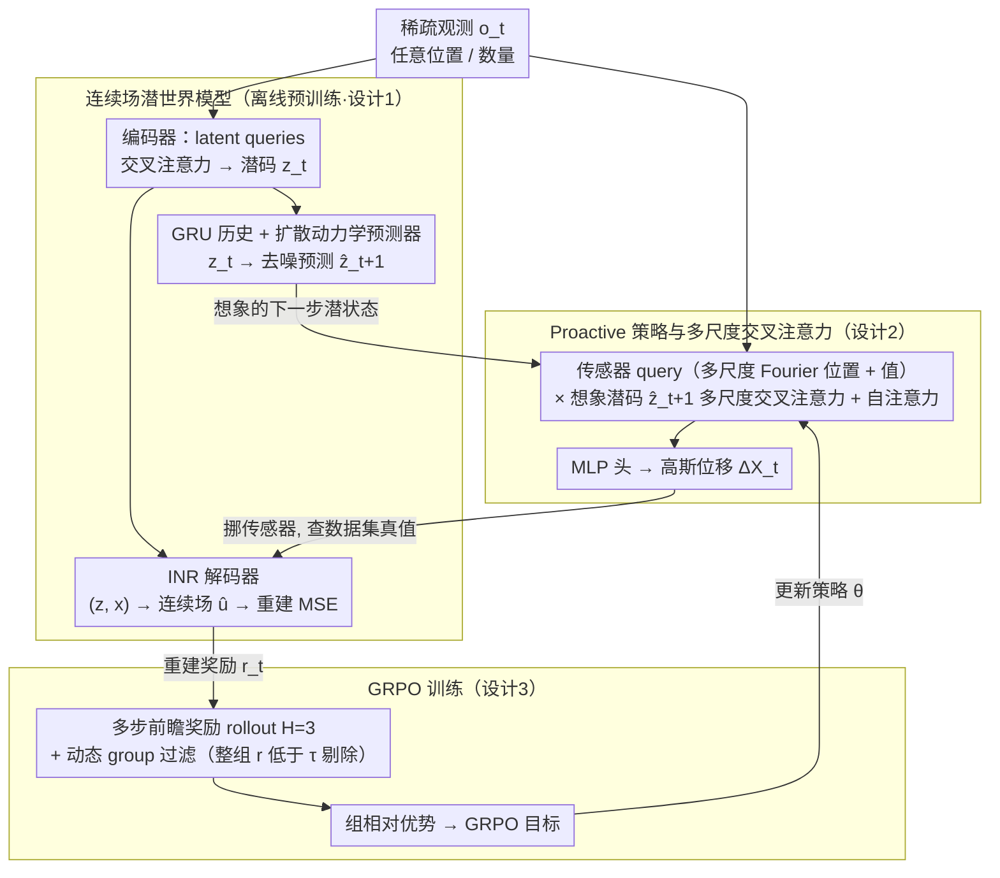

# LASER: Learning Active Sensing for Continuum Field Reconstruction

**会议**: ICML 2026 Oral  
**arXiv**: [2604.19355](https://arxiv.org/abs/2604.19355)  
**代码**: 待确认  
**领域**: 强化学习 / 世界模型 / 主动感知  
**关键词**: 主动感知, 世界模型, GRPO, POMDP, 连续场重建

## 一句话总结
把"该把稀疏传感器放哪"建模成一个 POMDP，用一套包含编码器、GRU、扩散动力学预测器和隐式神经场解码器的"连续场潜世界模型"提供 imagined 下一步潜状态作为策略条件，再用 GRPO + 动态 group 过滤 + 多步前瞻奖励训练交叉注意力策略，在 Navier-Stokes / 浅水方程 / 真实海表温度（SST）三个数据集的稀疏感知重建任务上一致打败固定布局和 offline-optimized 布局。

## 研究背景与动机

**领域现状**：从稀疏离散传感器测量恢复连续物理场（湍流、应力场、温度场等）是科学计算和工程的核心问题；近期主流是用神经算子、INR 或 transformer 算子做重建，要么把传感器位置当作固定输入（AROMA、DiffusionPDE），要么做 offline 优化产生**全局静态**的布局（PhySense）。

**现有痛点**：固定/全局优化的布局忽略了物理场是**非平稳**的——同一套传感器位置在不同时间步、不同初始条件下信息量差异巨大。文献明确报告"换一套布局，重建精度可以差好几倍"。但当前没有人在 closed-loop 中真正做 instance-specific 的传感器自适应。

**核心矛盾**：要让传感器位置在线自适应，需要一个能"预演 what-if"的环境模型——你想知道"如果我现在把传感器往北挪 0.1，下一步重建误差会怎样"，但真实物理系统不可能反复 rollout；同时主动感知是高维连续动作空间 + 稀疏延迟反馈，RL 直接做不稳。

**本文目标**：(i) 构建一个能 forward predict、能算重建奖励的潜世界模型作为可微环境代理；(ii) 训一个 RL 策略在这个潜空间里**proactively** 决定下一步传感器位移；(iii) 让 RL 训练在稀疏奖励下稳定。

**切入角度**：借鉴 Ha & Schmidhuber 2018 的 World Model 范式——把"环境模拟"和"在 latent imagination 中规划"两件事拆开。但 continuum field 的世界模型必须能处理**任意位置、任意数量**的稀疏观测、能 forward roll、能输出连续场作为可微奖励来源；策略侧借 DeepSeek-R1 系工作把 GRPO 这种 group-relative 优势估计搬到连续控制。

**核心 idea**：用"world-model imagined 下一步潜状态"作为策略的查询上下文，让传感器决策**面向未来**（proactive）而非反应当下，再用 GRPO + 动态过滤把训练打稳。

## 方法详解

### 整体框架
LASER 把主动感知建模为 POMDP $\mathcal{M}=(\mathcal{S},\mathcal{A},\mathcal{O},\mathcal{E},\mathcal{T}_\phi,\mathcal{R}_\phi,\gamma)$，潜状态 $\bm s_t=[\bm z_t,\bm h_t]$ 由当前观测潜码 $\bm z_t$ 和 GRU 历史 $\bm h_t$ 组成，动作 $\bm a_t=\Delta\bm X_t$ 是传感器位移，奖励 $r_t=-\mathcal{L}(\bm u_{t+1},\hat{\bm u}_{t+1})$ 是世界模型解码出的重建 MSE 的相反数。训练两阶段：(1) **离线**预训练世界模型 $\phi$（encoder/dynamics/decoder 联合 ELBO + 扩散去噪），每步重新随机采传感器布局以学不变性；(2) **在线**用 GRPO 训练策略 $\pi_\theta$，每步从当前 $\hat{\bm z}_{t+1}$ 和 $\bm o_t$ 出发采 $G$ 组动作，环境只查训练数据集真值得到 reward，不需要真实物理仿真器。

### 关键设计

**1. 连续场潜世界模型：当一个可微的物理环境代理，既能 forward predict 又能算重建奖励**

真实物理仿真器昂贵且不可微，没法让 RL 反复 rollout，所以作者先离线训一套潜世界模型 $p_\phi^{enc}\to p_\phi^{dyn}\to p_\phi^{dec}$ 当代理。编码器仿 AROMA，用 $M$ 个可学 latent queries 对稀疏观测 $(\bm x_t^{(i)},\bm u_t(\bm x_t^{(i)}))$ 做 cross-attention 得 $\bm z_t\sim\mathcal{N}(\bm\mu_\phi,\bm\sigma_\phi^2)$，天然 permutation-invariant，能适配任意传感器数和位置；而且训练时每步重新随机采布局，逼世界模型学到布局不变的表示，否则后面 RL 一改布局它就崩。动力学预测器是 conditional diffusion，条件是当前 $\bm z_t$ 和 GRU 历史 $\bm h_t=\mathrm{GRU}_\phi(\bm h_{t-1},\bm z_t)$，对噪声化的 $\tilde{\bm z}_{t+1}$ 做 $K$ 步去噪输出 $\hat{\bm z}_{t+1}$——用扩散而不是确定性 MLP，是因为湍流这类非平稳场的未来是多模态的，单点预测会被平均成模糊。解码器是隐式神经场 (INR)，输入 $(\bm z_t,\bm x)$ 输出任意坐标的场值 $\hat{\bm u}_t(\bm x)$，于是奖励能在整个 $\Omega$ 上算连续可微的 MSE 而不局限于网格点。整体训练目标 $\mathcal{L}_{world}=\mathcal{L}_{recon}+\beta\mathcal{D}_{KL}+\lambda\mathcal{L}_{diffusion}$。

**2. Proactive 策略与多尺度交叉注意力：用"想象出的下一步潜状态"当上下文，让传感器决策超前一步**

传感器决策必须 anticipate 而非 react——你想知道"如果场马上变成那样，现在该把传感器往哪挪"。作者的关键设计就是把世界模型幻想出的 $\hat{\bm z}_{t+1}$（而非当前 $\bm z_t$）作为策略的 key/value，策略 $\pi_\theta(\bm a_t|\hat{\bm z}_{t+1},\bm o_t)$ 是个 Transformer。传感器侧 query 由位置和值嵌入拼成 $\mathbf q^{(i)}=[\gamma_{pos}(\bm x_t^{(i)});\text{Embed}(\bm u_t(\bm x_t^{(i)}))]$，其中 $\gamma_{pos}$ 是多尺度 Fourier feature $\gamma^s(\bm x)=[\sin(\bm x\bm\omega^s),\cos(\bm x\bm\omega^s)]$；query 和 imagined 潜码做多尺度 cross-attention $\mathbf f=\bigoplus_{s}\text{softmax}(\mathbf q^{(s)}(\mathbf k^{(s)})^\top/\sqrt{c_s})\mathbf v^{(s)}$，多尺度是为了同时抓物理场的局部细节和全局结构（湍流大涡 + 小涡）；再过一层 self-attention 让传感器之间协同、不扎堆覆盖同一区域；最后 MLP 头输出高斯位移 $(\bm\mu_\theta^{(i)},\log\bm\sigma_\theta^{(i)})$，动作 clip 到 $[-a_{max},a_{max}]$。

**3. GRPO 训练：动态 group 过滤 + 多步前瞻奖励，把稀疏奖励 + 高维连续动作的训练打稳**

主动感知是高维连续动作 + 稀疏延迟反馈，model-free RL 直接做会抖。作者把 GRPO 这套 group-relative 优势估计从 LLM 离散 token 搬到连续控制：每个 $t$ 采 $G$ 组动作得 reward $\{r_t^g\}$，组相对优势 $A_{g,t}=(r_t^g-\text{mean})/\text{std}$ 再 batch 内二次归一化 $\hat A_{g,t}$，目标 $\mathcal{J}_{GRPO}=\mathbb E[\min(s_{g,t}(\theta)\hat A_{g,t},\text{clip}(\cdot,1-\epsilon,1+\epsilon)\hat A_{g,t})]$ 沿用 PPO 的 clip。在此之上加两个增量。其一是**动态 group 过滤**：维护一个 $\tau$ 跟踪 $\min_g r_t^g$ 的运行均值，整组 reward 都 $<\tau$ 的低质量样本（传感器扎堆、跑出边界这类系统性无信息配置）从 buffer 剔除，免得它们污染 advantage 估计。其二是**多步前瞻奖励**：执行 $\bm a_t$ 后冻结布局，让 $p_\phi^{dyn}$ 自回归 rollout $H=3$ 步，按 $r_t^{look}=\sum_{h=1}^H\gamma^{h-1}r_{t+h}/\sum\gamma^{h-1}$ 折扣聚合——单步 reward 只会鼓励短视布局，把奖励和"未来 H 步重建"挂钩才能在快速演化的湍流上避免决策只顾眼前。

### 损失函数 / 训练策略
世界模型用 $\mathcal{L}_{world}$ 离线训完冻结；策略用 GRPO 在线训。$H=3$，扩散去噪步数 $K$、$G$、$\epsilon$、$\beta$、$\lambda$ 在 appendix 给出。每个 episode 随机选轨迹和起始 $t_0$、初始化传感器为均匀分布，防止过拟合初始条件。

## 实验关键数据

### 主实验
3 个 benchmark：NS-1e-3 / NS-1e-5（2D Navier-Stokes 涡量形式）/ Shallow-Water（3D 浅水方程） / SST（真实海表温度）。重建误差 $\mathrm{MSE}_{recon}$（$\times 10^{-3}$）越低越好，Avg 是 In-time + Out-time 平均：

| #Obs | 数据集 | AROMA(固定) | DiffusionPDE | PhySense(offline 优化) | LASER-PPO | **LASER** |
|------|--------|------------|--------------|------------------------|-----------|-----------|
| 256 | NS-1e-3 | 2.720 | 1.344 | 0.376 | 0.304 | **0.302** |
| 128 | NS-1e-3 | 5.816 | 6.609 | 0.370 | 0.353 | **0.321** |
| 64  | NS-1e-3 | 20.27 | 6.543 | 0.466 | 0.396 | **0.434** |
| 256 | Shallow-Water | 12.59 | 3.175 | 0.355 | 0.326 | **0.257** |
| 100 | SST | 1.0586 | 3.4626 | 0.7059 | — | **0.6932** |

LASER 在 11/12 个 (dataset × #Obs) 组合上拿下最低误差，越稀疏对固定布局的相对优势越大（NS-1e-3 @64 上 AROMA→LASER 是 47×）；对比 PPO 替换的 LASER-PPO，GRPO + 动态过滤进一步降低误差，确认设计选择。

### 消融实验

| 配置 | NS-1e-3 @256 Avg | 说明 |
|------|------------------|------|
| LASER 完整 | 0.302 | 完整模型 |
| LASER† (去掉动态 group 过滤) | 0.391 | Out-time 误差 0.685 vs 0.483，过滤对长程预测最关键 |
| LASER($\phi$) (无主动感知，只世界模型) | 0.359 | 主动感知带来 ~16% 提升 |
| 前瞻 $H=1$ | Out-t 0.6136 | 单步奖励短视 |
| 前瞻 $H=5$ | Out-t 0.3380 | $H$ 越大 Out-time 越好，同任务降 ~45% |

GRU 历史长度消融（Table 6）：湍流越强（NS-1e-5、Shallow-Water）最优 history 越短（3 步），太长引入过时信息反而伤性能。

### 关键发现
- **主动感知 > offline 优化布局**：PhySense 是同类最强 offline 基线，LASER 仍能稳定打过，说明 instance-specific 自适应不可替代
- **前瞻奖励对 Out-time 泛化极关键**：$H=1\to 5$ Out-t 误差砍掉 45%，In-t 几乎不变——说明 lookahead 主要解决的是"训练分布外的未来步预测"
- **越稀疏越体现自适应优势**：AROMA 在 $N=64$ 上对 $N=256$ 退化 10×+，LASER 退化 <2×，证明 closed-loop 感知能"补"传感器不足
- **GRPO 比 PPO 更适合此问题**：在所有数据集上 LASER 都比 LASER-PPO 略优，group-relative advantage + 动态过滤组合是稳定训练的关键

## 亮点与洞察
- **世界模型当可微环境**——这个老想法在科学计算里其实非常合适：真实物理仿真器昂贵或不可微，世界模型既能 forward predict 又能算梯度奖励，绕开了 model-free RL 在 sample efficiency 上的死穴
- **proactive 范式**——把 $\hat{\bm z}_{t+1}$（未来 latent）而非 $\bm z_t$（当前 latent）作为策略 condition 的 key/value 是简单但深刻的设计：它让策略的认知"超前一步"，可以迁移到任何 model-based 控制问题
- **GRPO 在连续控制上的落地**——大多数 GRPO 工作都是 LLM 推理（离散 token），这里把它做到连续高维动作；动态 group 过滤是个通用稳定 trick
- **多尺度 Fourier 编码 + 多尺度 cross-attention**——空间频率多尺度对应物理场的多尺度结构（湍流大涡 + 小涡），方法层面给科学 ML 提了一个有效模板

## 局限与展望
- 世界模型预训练完后**冻结**，不与策略联合微调；策略发现的新型布局如果落到世界模型的训练分布外，预测可能不可靠，存在 model exploitation 风险
- 评估均为模拟数据集 + 真实 SST 历史数据，**没有真实闭环硬件实验**；真实传感器有运动延迟、噪声、能耗约束，目前框架只 clip 位移幅度
- $H=3$ 的 rollout 在 Out-t 上还能继续受益于更长 $H$，但扩散动力学每步去噪贵，$H$ 上不去导致 In-t/Out-t 在最稀疏 setting 仍有差距
- 当前在每个 dataset 单独训世界模型 + 策略，跨物理域迁移（如训湍流迁到温度场）能力未验证

## 相关工作与启发
- **vs AROMA (Serrano+2024)**：AROMA 是 LASER 编码器的 backbone，但它把传感器位置当作**固定**输入；LASER 把"位置"提升为可控动作，并在固定 backbone 上加了 dynamics + 策略
- **vs DiffusionPDE (Huang+2024)**：DiffusionPDE 用 score-based 模型在测试时做 sparse-conditioned 采样，每步千次 sampling 极慢；LASER 把扩散仅用于潜空间动力学预测，开销小且支持自回归 rollout
- **vs PhySense (Ma+2025)**：PhySense 离线优化全局静态布局，是最强的"非自适应"基线；LASER 在最稀疏 setting 下相对 PhySense 平均降误差 30%+，证明 instance-specific 自适应的额外价值
- **vs DreamerV3 等 World Model RL**：思路同源（latent imagination → 训策略），但 DreamerV3 是离散场景/低维状态，LASER 把这条范式搬到 PDE 连续场 + Transformer encoder + 扩散 dynamics 这种科学 ML 配置上

## 评分
- 新颖性: ⭐⭐⭐⭐ 把 world-model RL + GRPO + 多尺度科学 ML 编码器三件事拼到主动感知场景，组合新但单组件多为已有
- 实验充分度: ⭐⭐⭐⭐ 3 数据集 × 3 稀疏度 × 多个消融，覆盖到位；缺真实硬件
- 写作质量: ⭐⭐⭐⭐ POMDP 形式化、Figure 2 拓扑、Algorithm 1 都清晰；公式密度略高
- 价值: ⭐⭐⭐⭐ 给科学 ML 社区提供了"主动感知 = world-model RL"的清晰范式，对地球科学、流体测量、工业传感网络都有可迁移性

<!-- RELATED:START -->

## 相关论文

- [\[ICLR 2026\] cadrille: Multi-modal CAD Reconstruction with Reinforcement Learning](../../ICLR2026/reinforcement_learning/cadrille_multi-modal_cad_reconstruction_with_reinforcement_learning.md)
- [\[ICML 2026\] DARTS: Distribution-Aware Active Rollout Trajectory Shaping for Accelerating LLM Reinforcement Learning](darts_distribution-aware_active_rollout_trajectory_shaping_for_accelerating_llm_.md)
- [\[CVPR 2026\] BuildingGPT: Auto-Regressive Building Wireframe Reconstruction Model with Reinforcement Learning](../../CVPR2026/reinforcement_learning/buildinggpt_auto-regressive_building_wireframe_reconstruction_model_with_reinfor.md)
- [\[ICML 2026\] Mind Dreamer: Untethering Imagination via Active Causal Intervention on Latent Manifolds](mind_dreamer_untethering_imagination_via_active_causal_intervention_on_latent_ma.md)
- [\[ICML 2025\] Learning Mean Field Control on Sparse Graphs](../../ICML2025/reinforcement_learning/learning_mean_field_control_on_sparse_graphs.md)

<!-- RELATED:END -->
